# Quy trình nghiệp vụ — Ví trả sau (mục 3)

> Tài liệu này diễn giải lại mục **3. Quy trình nghiệp vụ** trong tài liệu thiết kế *"Ví trả sau - Nền tảng"*, bằng ngôn ngữ dễ hiểu cho người mới. Bản gốc chỉ có sơ đồ activity, không có chữ giải thích, nên mình vẽ lại + viết thêm phần "vì sao lại làm vậy" theo logic nghiệp vụ chung, để đọc vào là hiểu ngay không cần đoán. File này sẽ được bổ sung dần khi đọc tới các mục con tiếp theo (3.3, 3.4...).
>
> Bối cảnh chung: Viettel Money không tự thẩm định/cho vay, mà đóng vai trò nền tảng — hệ thống **Lending** ra quyết định nghiệp vụ, còn **Lender** là lớp trung gian duy nhất được gọi thẳng sang hai đối tác cho vay thật là **Cake** và **VietCredit**. Hai mục dưới đây là hai bước đầu tiên trong hành trình vay: khách vào app thấy gì (3.1), rồi khách đăng ký vay thì hệ thống xử lý ra sao (3.2).

---

## 3.1. Luồng truy cập dịch vụ

Đây là **bước đầu tiên** khi khách hàng bấm vào icon dịch vụ vay (Ví trả sau) trên app Viettel Money. Trước khi có bất kỳ nghiệp vụ vay nào diễn ra, Lending đóng vai người gác cổng — quyết định khách sẽ được dẫn tới màn hình nào.

### Sơ đồ tổng quan

Xem mã Mermaid (nếu bạn dùng công cụ có hỗ trợ render Mermaid, hoặc muốn sửa lại sơ đồ)

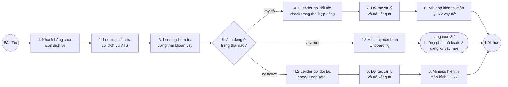

**Đọc nhanh:** khách bấm icon → hệ thống check xem dịch vụ có mở không → check khách đang "ở đâu" trong hành trình vay (chưa vay / đang làm hồ sơ dở / đã có khoản vay) → tùy vào đó mà gọi đúng loại thông tin cần và đẩy khách sang đúng màn hình, không có màn hình nào là "một cho tất cả".

### Giải thích từng bước

#### Bước 1 — Khách hàng chọn icon dịch vụ

Đây là hành động khởi phát: khách mở app Viettel Money, thấy icon "Ví trả sau" (hoặc tên hiển thị tương tự) và bấm vào. Từ đây, mọi thứ phía sau đều do backend quyết định giúp khách, khách không cần biết đằng sau có bao nhiêu bước.

#### Bước 2 — Lending kiểm tra cờ dịch vụ VTS

Trước khi làm bất cứ điều gì, hệ thống Lending check một cái "cờ" (feature flag) tên VTS — nhiều khả năng là viết tắt của chính dịch vụ "Ví Trả Sau". Mục đích thường thấy của loại cờ này là để **bật/tắt dịch vụ theo từng nhóm khách, từng kênh, hoặc từng giai đoạn triển khai** (ví dụ: mở dần cho một số tỉnh/thuê bao trước khi mở toàn quốc, hoặc tắt tạm khi cần bảo trì) mà không cần deploy lại code.

> Sơ đồ gốc không vẽ nhánh "cờ tắt thì làm gì" — có thể vì trường hợp đó được xử lý từ sớm hơn (ví dụ: icon bị ẩn luôn nếu cờ tắt, nên không tới được bước này). Bạn nên hỏi lại BA/đội nghiệp vụ để chắc VTS là viết tắt của gì và nhánh "tắt" đi về đâu.

#### Bước 3 — Lending kiểm tra trạng thái khoản vay của khách hàng

Đây là bước quan trọng nhất của cả luồng: hệ thống tự hỏi "khách này đang ở giai đoạn nào trong hành trình vay?" trước khi quyết định cho khách xem cái gì. Có 3 khả năng, và mỗi khả năng dẫn tới một trải nghiệm hoàn toàn khác:

- **vay dở** — khách đã bắt đầu đăng ký nhưng chưa hoàn tất (chưa ký hợp đồng, hoặc hồ sơ đang chờ xử lý).
- **vay mới** — khách chưa từng đăng ký vay, đây là lần đầu.
- **kv active** — khách đã có khoản vay đang chạy (đã ký hợp đồng, đang trong thời gian sử dụng/trả nợ).

**Vì sao phải tách 3 nhánh riêng thay vì gọi một API chung "lấy trạng thái"?** Vì mỗi trạng thái cần một loại dữ liệu khác nhau và dẫn tới một màn hình khác nhau: khách vay dở cần biết "hồ sơ đang tới đâu" để tiếp tục điền, khách đang vay active cần biết "còn nợ bao nhiêu, khi nào phải trả" để quản lý khoản vay, còn khách mới thì chưa có gì để tra cả — chỉ cần đưa thẳng vào onboarding. Tách nhánh sớm giúp hệ thống chỉ gọi đúng API cần dùng, không tốn request dư thừa.

#### Nhánh "vay dở" — tiếp tục hồ sơ đang làm

`4.1 Lender gọi đối tác check trạng thái hợp đồng` → `7. Đối tác xử lý và trả kết quả` → `8. Miniapp hiển thị màn QLKV vay dở`

Vì hồ sơ chưa xong nên **chưa có khoản vay thật để tra** — thứ cần biết ở đây là "hợp đồng/hồ sơ đang ở bước nào" (ví dụ: đang chờ đối tác thẩm định, đang chờ khách ký...). Lender gọi sang đối tác (Cake hoặc VietCredit, tùy khách đang làm hồ sơ ở bên nào) để lấy trạng thái đó, rồi Miniapp hiển thị một màn hình QLKV riêng cho trường hợp "dở" — mục đích là để khách **tiếp tục** đúng chỗ đang làm, thay vì phải đăng ký lại từ đầu.

#### Nhánh "vay mới" — bắt đầu hành trình vay

`4.3 Hiển thị màn hình Onboarding` → chuyển sang mục 3.2 (Luồng phân bổ leads và đăng ký vay mới)

Đây là nhánh đơn giản nhất: chưa có gì để tra cứu cả nên không cần gọi đối tác ở bước này. Hệ thống chỉ việc đưa khách vào màn hình Onboarding để bắt đầu quy trình đăng ký — phần đăng ký chi tiết (chọn gói vay, điền thông tin, eKYC...) được xử lý ở một luồng riêng, mục 3.2, không nằm trong phạm vi của "Luồng truy cập dịch vụ" này. Nói cách khác, mục 3.1 chỉ làm nhiệm vụ **điều hướng (routing)**, còn nghiệp vụ vay thật sự nằm ở các mục sau.

#### Nhánh "kv active" — quản lý khoản vay đang có

`4.2 Lender gọi đối tác check LoanDetail` → `5. Đối tác xử lý và trả kết quả` → `6. Miniapp hiển thị màn hình QLKV`

Khách đã có khoản vay thật (đã ký hợp đồng), nên lần này Lender gọi đối tác để lấy **LoanDetail** — tức là chi tiết khoản vay: dư nợ hiện tại, kỳ hạn trả, ngày đến hạn, lịch sử thanh toán... Sau khi có dữ liệu, Miniapp hiển thị màn hình QLKV (Quản Lý Khoản Vay) để khách theo dõi và thao tác (trả nợ, xem lịch sử...).

#### Vì sao có "Lender" làm lớp trung gian, không để Miniapp gọi thẳng Cake/VietCredit?

Lender là một service tách riêng khỏi Lending, đóng vai trò **Service Thanh toán số** — service duy nhất được phép nói chuyện trực tiếp với đối tác (Cake, VietCredit) để: kiểm tra điều kiện vay, thẩm định/phê duyệt khoản vay, quản lý dư nợ, cập nhật trạng thái thanh toán/tất toán. Nhờ có lớp Lender này, Lending và Miniapp không cần biết Cake hay VietCredit có API khác nhau thế nào — cứ gọi Lender theo một chuẩn chung ("check trạng thái hợp đồng", "check LoanDetail"), còn việc dịch sang đúng API của từng đối tác là chuyện của Lender lo. Đây là một dạng thiết kế **adapter/gateway**, giúp thêm đối tác mới sau này (nếu có) mà không phải sửa lại Miniapp hay Lending. Nguyên tắc này sẽ lặp lại ở mục 3.2 dưới đây.

---

## 3.2. Luồng phân bổ leads và đăng ký vay

Đây là luồng chạy tiếp ngay sau nhánh **"vay mới"** ở mục 3.1 — khách bấm "Đăng ký vay" từ màn Onboarding. Vì có **2 đối tác** cùng nhận hồ sơ (Cake, VietCredit), luồng này về bản chất là một cái máy lọc nhiều lớp: lọc dần để biết khách hợp với đối tác nào, chọn một đối tác cụ thể để gửi hồ sơ sang, rồi mới cho khách xác thực danh tính và điền thông tin vay. Để dễ theo dõi, mình chia thành 3 giai đoạn nhỏ.

### Giai đoạn 1: Lọc & phân bổ đối tác

**Phần 1 — Lọc nội bộ theo từng đối tác (bước 1-5):**

Xem mã Mermaid

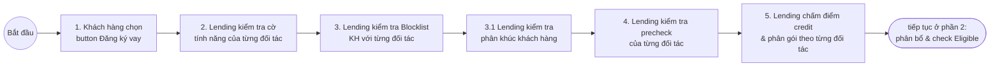

#### Bước 1 — Khách hàng chọn button Đăng ký vay

Đây là điểm bắt đầu của mục 3.2, nối tiếp trực tiếp từ nhánh "vay mới" ở mục 3.1: khách đang ở màn Onboarding và bấm nút "Đăng ký vay" để chính thức bắt đầu quy trình xin vay.

#### Bước 2 — Lending kiểm tra cờ tính năng đăng ký ví trả sau của từng đối tác

Vì có hai đối tác cùng nhận hồ sơ (Cake, VietCredit), hệ thống check riêng cho **mỗi đối tác** xem tính năng nhận đăng ký mới có đang mở hay không. Một đối tác có thể đang tạm đóng (do bảo trì, hết hạn mức ngày...) trong khi đối tác kia vẫn mở bình thường, nên phải check tách riêng theo từng đối tác chứ không dùng chung một cờ.

#### Bước 3 — Lending kiểm tra Blocklist KH với từng đối tác

Mỗi đối tác có danh sách khách hàng bị họ tự chặn riêng (Blocklist) — ví dụ do khách từng nợ xấu hoặc gian lận với riêng đối tác đó. Kiểm tra sớm bước này giúp loại các đối tác chắc chắn sẽ từ chối, trước khi tốn công ở các bước lọc sâu hơn.

#### Bước 3.1 — Lending kiểm tra phân khúc khách hàng

Hệ thống xác định khách thuộc phân khúc nào (dựa theo tiêu chí nghiệp vụ, ví dụ theo lịch sử sử dụng dịch vụ hoặc theo hồ sơ tín dụng). Kết quả phân khúc này sẽ được dùng để áp đúng bộ điều kiện precheck và công thức chấm điểm ở hai bước tiếp theo.

#### Bước 4 — Lending kiểm tra bộ điều kiện precheck của từng đối tác

Đây là một lượt lọc nhanh nữa, làm riêng theo từng đối tác — loại sớm những hồ sơ chắc chắn không đạt điều kiện tối thiểu của đối tác đó (ví dụ độ tuổi, thời gian dùng SIM...), để không tốn công chấm điểm cho những trường hợp gần như chắc chắn bị từ chối.

#### Bước 5 — Lending thực hiện chấm điểm credit và phân gói theo từng đối tác

Với những đối tác còn "sống" sau các lượt lọc trên, hệ thống tính điểm tín dụng và map ra gói vay khả dụng — làm riêng cho từng đối tác vì Cake và VietCredit có công thức chấm điểm và điều kiện gói vay khác nhau. Kết thúc bước này, hệ thống đã biết được khách này đủ điều kiện sơ bộ với đối tác nào, và mỗi đối tác đó có thể cho vay gói gì.

**Phần 2 — Phân bổ & check Eligible với đối tác (bước 6-9):**

Xem mã Mermaid

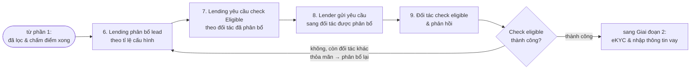

#### Bước 6 — Lending thực hiện phân bổ lead theo cấu hình tỉ lệ phân bổ

Trong số các đối tác đủ điều kiện sơ bộ (kết quả từ Phần 1), hệ thống chọn ra **một đối tác cụ thể** để gửi hồ sơ, theo một tỉ lệ được cấu hình sẵn (ví dụ chia lưu lượng 70/30 giữa Cake và VietCredit). Đây là bước điều tiết lưu lượng — có thể điều chỉnh tỉ lệ này qua cấu hình mà không cần sửa code, hữu ích khi cần cân đối tải hoặc ưu tiên đối tác nào theo chiến lược kinh doanh.

#### Bước 7 — Lending yêu cầu check Eligible theo đối tác đã phân bổ

Sau khi đã chọn được một đối tác cụ thể, hệ thống yêu cầu kiểm tra "Eligible" — tức là hỏi **thật** xem đối tác đó có đồng ý nhận hồ sơ này không, khác với các bước lọc nội bộ ở Phần 1 (precheck, chấm điểm) vốn chỉ là Lending tự tính toán.

#### Bước 8 — Lender thực hiện gửi yêu cầu sang đối tác được phân bổ

Đúng theo nguyên tắc đã thấy ở mục 3.1: chỉ có Lender được phép gọi trực tiếp sang đối tác, nên yêu cầu check Eligible ở bước 7 được Lender chuyển tiếp sang đúng đối tác đã được phân bổ.

#### Bước 9 — Đối tác check eligible và phản hồi

Đối tác xử lý yêu cầu và trả về kết quả: có nhận hồ sơ này hay không.

#### Vì sao có vòng lặp "phân bổ lại"?

Nếu đối tác vừa được chọn từ chối ở bước 9, hệ thống không dừng lại luôn — nó kiểm tra xem còn đối tác nào khác cũng đủ điều kiện sơ bộ (dựa vào kết quả đã có từ Phần 1) không. Nếu còn, hệ thống quay lại bước 6 để phân bổ hồ sơ sang đối tác còn lại thử tiếp; nếu hết đối tác thì hồ sơ mới thực sự dừng (sơ đồ gốc không vẽ rõ nhánh này, nên hỏi lại BA nếu cần). Cơ chế này giúp tăng tỉ lệ khách được duyệt, thay vì "trứng bỏ hết một giỏ" vào một đối tác duy nhất và bỏ cuộc ngay khi bị từ chối.

### Giai đoạn 2: eKYC & nhập thông tin khoản vay

Xem mã Mermaid

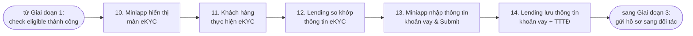

#### Bước 10 — Miniapp hiển thị màn hình eKYC

Chỉ khi có một đối tác thật sự chấp nhận Eligible ở Giai đoạn 1, hệ thống mới cho khách bước vào xác thực danh tính — có chủ đích: eKYC khá mất công (khách phải chụp giấy tờ, chụp mặt), nên để dành nó cho sau cùng, tránh bắt khách xác thực xong rồi mới biết chẳng đối tác nào nhận hồ sơ.

#### Bước 11 — Khách hàng thực hiện eKYC

Khách chụp giấy tờ và khuôn mặt theo hướng dẫn trên Miniapp để xác thực danh tính.

#### Bước 12 — Lending so khớp thông tin eKYC của khách hàng (ekyc_pass)

Hệ thống đối chiếu kết quả eKYC (ảnh giấy tờ, ảnh khuôn mặt) với thông tin khách đã cung cấp, để xác nhận đúng là khách hàng thật đang thực hiện đăng ký.

#### Bước 13 — Miniapp hiển thị màn hình nhập thông tin khoản vay và Submit

Sau khi eKYC hợp lệ, khách mới được vào màn hình để tự chọn số tiền vay và kỳ hạn, rồi bấm Submit để gửi thông tin — đúng như nguyên tắc đã thấy ở mục 3.1: chỉ hỏi/làm những gì cần thiết ở đúng thời điểm, không bắt khách nhập thông tin vay trước khi biết chắc có đối tác nhận hồ sơ.

#### Bước 14 — Lending lưu thông tin khoản vay, kèm thông tin TTTĐ (Submit)

Hệ thống lưu lại thông tin khoản vay khách vừa nhập, kèm theo một khối dữ liệu gọi là "TTTĐ".

> "TTTĐ" mình chưa chắc chắn viết tắt của gì (có thể liên quan tới thông tin thẩm định/định danh đi kèm hồ sơ) — nên hỏi lại BA/đội nghiệp vụ để ghi chú chính xác.

### Giai đoạn 3: Gửi hồ sơ đăng ký sang đối tác

Xem mã Mermaid

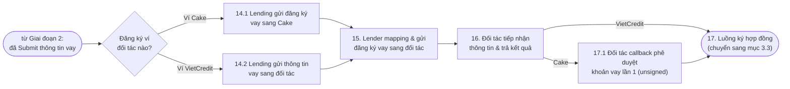

#### Bước 14.1 / 14.2 — Lending gửi đăng ký vay sang đối tác tương ứng

Tùy hồ sơ thuộc ví Cake hay VietCredit (chính là đối tác đã được "phân bổ" từ bước 6), Lending có một bước chuẩn bị dữ liệu riêng cho từng đối tác — `14.1` cho Cake, `14.2` cho VietCredit — vì có thể mỗi đối tác cần một cấu trúc dữ liệu đầu vào khác nhau ở bước chuẩn bị này.

#### Bước 15 — Lender mapping và gửi thông tin đăng ký vay sang đối tác

Cả hai nhánh ở bước 14.1/14.2 đều đổ về Lender — nơi dữ liệu được "dịch" (mapping) sang đúng chuẩn API của từng đối tác trước khi gửi đi, đúng nguyên tắc Lender là lớp trung gian duy nhất nói chuyện với đối tác đã thấy ở mục 3.1: Lending/Miniapp không cần biết Cake và VietCredit khác nhau ra sao, Lender lo phần dịch đó.

#### Bước 16 — Đối tác tiếp nhận thông tin và trả kết quả

Đối tác nhận hồ sơ đăng ký vay chính thức, xử lý và trả kết quả về. Từ đây, hai đối tác lại tách đường một lần nữa ở bước tiếp theo.

#### Bước 17.1 — Đối tác callback phê duyệt khoản vay lần 1, unsigned (chỉ với Cake)

Riêng với Cake, kết quả ở bước 16 chưa phải là quyết định cuối cùng — Cake gọi ngược lại (callback) để báo "phê duyệt lần 1", nhưng hợp đồng chưa được ký ("unsigned"). Đây nhiều khả năng là một bước duyệt sơ bộ riêng theo cách tích hợp/API của Cake — nên hỏi lại BA nếu cần khẳng định chắc.

#### Bước 17 — Luồng ký hợp đồng

Với VietCredit, hồ sơ đi thẳng vào bước ký hợp đồng ngay sau bước 16; với Cake, sau khi có callback phê duyệt lần 1 ở bước 17.1 thì cũng đi vào cùng bước ký hợp đồng này. Đây là điểm kết thúc của mục 3.2, dẫn tiếp qua mục 3.3 (nằm ngoài phạm vi phần này).

---

## 3.3. Luồng ký hợp đồng

Đây là luồng chạy tiếp ngay sau khi hồ sơ được đối tác chấp nhận ở cuối mục 3.2 (`17. Luồng ký hợp đồng` dẫn qua đây). Về bản chất, luồng này làm hai việc: cho khách xem trước nội dung hợp đồng, rồi tùy khách chọn *ký* hay *hủy* mà đi theo một trong hai nhánh khác nhau.

### Sơ đồ tổng quan

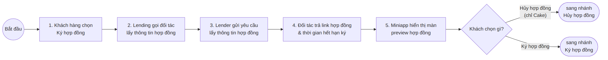

Xem mã Mermaid

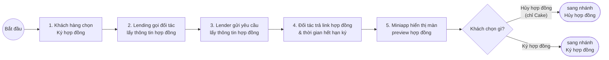

**Đọc nhanh:** khách bấm ký hợp đồng (hoặc với VietCredit, hành động submit đăng ký ở mục 3.2 coi như luôn kích hoạt bước này) → hệ thống lấy thông tin/link hợp đồng thật từ đối tác → cho khách xem trước → khách chọn Hủy hoặc Ký, mỗi lựa chọn đi theo một nhánh riêng.

### Giải thích từng bước

#### Bước 1 — Khách hàng chọn Ký hợp đồng

Đây là điểm bắt đầu của mục 3.3. Sơ đồ gốc ghi chú thêm: với đối tác VietCredit, bước này có thể được kích hoạt ngay khi khách "submit thông tin đăng ký ví" (ở mục 3.2) — nghĩa là VietCredit không cần một hành động "bấm ký hợp đồng" tách riêng như Cake, cả hai cách vào đều dẫn tới cùng luồng này.

#### Bước 2-3 — Lending gọi đối tác lấy thông tin hợp đồng, qua Lender

Lending yêu cầu lấy thông tin hợp đồng, và như mọi khi, yêu cầu này được chuyển qua Lender để gửi sang đúng đối tác — đúng nguyên tắc "Lender là lớp trung gian duy nhất nói chuyện với đối tác" đã thấy từ mục 3.1 và 3.2.

#### Bước 4 — Đối tác trả link hợp đồng và thời gian hết hạn ký hợp đồng

Đối tác trả về một đường link tới nội dung hợp đồng thật (nhiều khả năng hợp đồng được lưu/host bên phía đối tác), kèm theo thời hạn khách phải ký trước khi hết hạn — có thời hạn để tránh hồ sơ bị treo vô thời hạn nếu khách không quay lại ký.

#### Bước 5 — Miniapp hiển thị màn hình preview hợp đồng trước ký

Khách được xem trước nội dung hợp đồng qua link vừa lấy được, trước khi phải đưa ra quyết định — đảm bảo khách đọc được điều khoản thật trước khi cam kết, không ký "mù".

#### Nhánh "Hủy hợp đồng" (chỉ Cake)

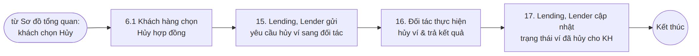

Xem mã Mermaid

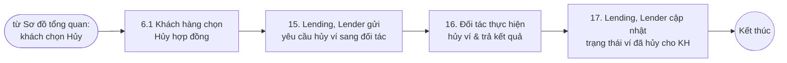

Sau khi xem preview, nếu khách đổi ý không muốn vay nữa, khách có thể chọn **Hủy hợp đồng** (`6.1`) — nhưng sơ đồ gốc ghi rõ tùy chọn này **chỉ có với Cake**, VietCredit không thấy có nhánh tương ứng (có thể do cách tích hợp/API của VietCredit không hỗ trợ hủy ở bước này — nên hỏi lại BA nếu cần chắc chắn). Khi khách hủy, hệ thống gửi yêu cầu **hủy ví** (không chỉ hủy đơn xin vay) sang đối tác (`15`), đối tác xử lý và trả kết quả (`16`), rồi hệ thống cập nhật lại cho khách biết ví đã hủy (`17`). Gọi là "hủy ví" vì tới bước này, ví trả sau nhiều khả năng đã được khởi tạo ở các bước trước (dù chưa active), nên hủy ở đây là hủy luôn cái ví đó.

#### Nhánh "Ký hợp đồng"

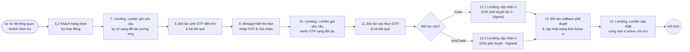

Xem mã Mermaid

```mermaid
flowchart LR
    inKy(["từ Sơ đồ tổng quan:<br/>khách chọn Ký"]) --> s62["6.2 Khách hàng chọn<br/>Ký hợp đồng"]
    s62 --> s7["7. Lending, Lender gửi yêu cầu<br/>ký số sang đối tác tương ứng"]
    s7 --> s8["8. Đối tác sinh OTP đến KH<br/>& trả kết quả"]
    s8 --> s9["9. Miniapp hiển thị màn<br/>nhập OTP & Xác nhận"]
    s9 --> s10["10. Lending, Lender gửi yêu cầu<br/>verify OTP sang đối tác"]
    s10 --> s11["11. Đối tác xác thực OTP<br/>& trả kết quả"]
    s11 --> gw2{"Đối tác nào?"}
    gw2 -- "Cake" --> s121["12.1 Lending cập nhật ví<br/>(Chờ phê duyệt lần 2 - Signed)"]
    gw2 -- "VietCredit" --> s122["12.2 Lending cập nhật ví<br/>(Chờ phê duyệt - Signed)"]
    s121 --> s13["13. Đối tác callback phê duyệt<br/>& cập nhật trạng thái Active ví"]
    s122 --> s13
    s13 --> s14["14. Lending, Lender cập nhật<br/>trạng thái ví active cho KH"]
    s14 --> stop2((Kết thúc))
```

Nếu khách đồng ý, khách chọn **Ký hợp đồng** (`6.2`). Hệ thống gửi yêu cầu **ký số** sang đúng đối tác tương ứng (`7`) — "ký số" ở đây là ký điện tử, không phải ký tay. Để xác nhận đúng khách hàng là người ký (không phải ai khác đang cầm điện thoại), đối tác sinh một mã OTP gửi tới khách (`8`), Miniapp cho khách nhập mã đó (`9`), rồi hệ thống gửi mã sang đối tác để xác thực (`10`, `11`). Đây là cơ chế xác thực chữ ký số khá phổ biến (tương tự ký hợp đồng điện tử ở nhiều dịch vụ khác), giúp đảm bảo tính pháp lý của việc ký.

Sau khi OTP xác thực thành công, hệ thống tách theo đối tác: **Cake** chuyển ví sang trạng thái "Chờ phê duyệt **lần 2** - Signed" (`12.1`), còn **VietCredit** chuyển sang "Chờ phê duyệt - Signed" (`12.2`, không có "lần 2"). Tên trạng thái khác nhau này khớp với điều đã thấy ở mục 3.2: chỉ Cake có thêm một bước "phê duyệt lần 1 (unsigned)" trước khi ký (`17.1` ở mục 3.2), nên tới đây mới gọi là "lần 2"; VietCredit không có bước phê duyệt trước ký nên chỉ có một lần phê duyệt duy nhất, xảy ra sau khi ký. Cuối cùng, đối tác gọi callback để phê duyệt (lần phê duyệt cuối) và báo trạng thái ví đã **Active** (`13`), hệ thống cập nhật lại cho khách biết ví đã sẵn sàng sử dụng (`14`).

## 4. Biểu đồ trạng thái

Mục 3 ở trên mô tả các **service gọi nhau như thế nào** (Miniapp gọi Lending, Lending gọi Lender, Lender gọi đối tác...). Mục này mô tả một góc khác: **một khoản vay đi qua những trạng thái (status) nào** trong suốt "đường đời" của nó, từ lúc khách bắt đầu đăng ký tới khi khoản vay kết thúc (đóng, quá hạn, hoặc bị từ chối/hủy ở đâu đó giữa đường). Có hai sơ đồ trạng thái riêng cho VC (VietCredit) và Cake, vì hai đối tác này **thẩm định và ký hợp đồng theo thứ tự khác nhau** — điều này đã được nhắc ở mục 3.3, và sơ đồ trạng thái dưới đây cho thấy rõ hơn tại sao lại khác.

Tin vui là phần đầu — từ lúc khách bấm đăng ký tới lúc `SUBMIT` — **giống nhau hoàn toàn giữa VC và Cake** (cùng một chuỗi lọc điều kiện), nên chỉ cần một sơ đồ chung. Hai sơ đồ chỉ tách ra **sau** `SUBMIT`.

### 4.1. Giai đoạn 1 — Lọc điều kiện (chung cho cả VC và Cake)

**Phần 1a — Lọc segment, VDS, credit, lender (trước eKYC):**

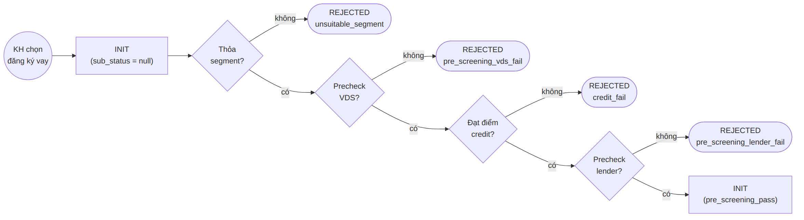

Xem mã Mermaid (nếu muốn sửa lại sơ đồ)

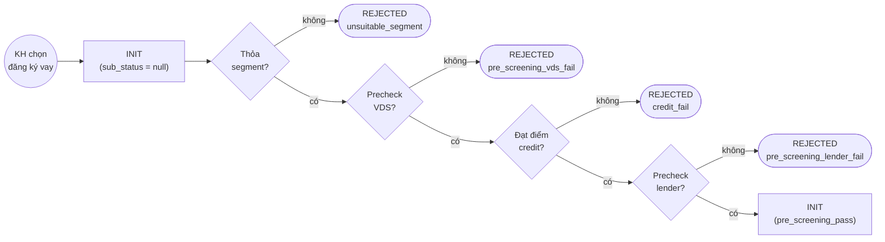

**Phần 1b — eKYC, xác nhận khoản vay & Submit:**

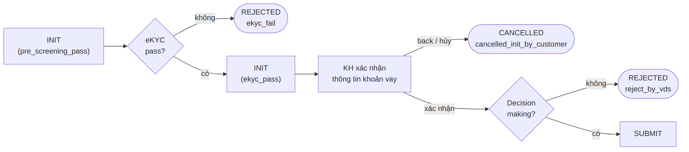

Xem mã Mermaid (nếu muốn sửa lại sơ đồ)

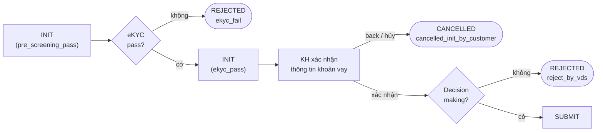

#### Trạng thái INIT — vừa mới bắt đầu

Ngay khi khách chọn đăng ký vay và thỏa hạn mức tối thiểu, hệ thống tạo một khoản vay ở trạng thái `INIT` (`sub_status = null`) — đây chỉ là "đặt cọc chỗ" trong hệ thống, chưa có gì được thẩm định cả.

#### Bốn lớp lọc sơ bộ: segment → precheck VDS → credit → precheck lender

Bốn bước này chính là các bước *precheck* và *chấm điểm credit* đã nói ở mục 3.2 (Giai đoạn 1, phần 1), nhìn từ góc độ trạng thái: mỗi lớp fail sẽ đẩy khoản vay sang `REJECTED` với một `sub_status` riêng để biết chính xác fail ở đâu (`unsuitable_segment`, `pre_screening_vds_fail`, `credit_fail`, `pre_screening_lender_fail`). Qua hết cả bốn lớp thì khoản vay vẫn ở `INIT`, chỉ đổi `sub_status` thành `pre_screening_pass` để đánh dấu "đã qua vòng lọc sơ bộ".

#### eKYC pass — xác thực danh tính

Khách phải xác thực danh tính (chụp giấy tờ, chụp mặt) — nếu không đạt, `REJECTED (ekyc_fail)`; nếu đạt, `INIT` chuyển `sub_status` thành `ekyc_pass`. Đây là cùng bước eKYC đã nói ở mục 3.2 (bước 10-12), chỉ khác là ở đây nhìn theo góc trạng thái thay vì theo góc "service nào gọi service nào".

#### KH xác nhận thông tin khoản vay

Khách xem lại thông tin khoản vay (số tiền, kỳ hạn...) trước khi gửi đi thật. Nếu khách bấm back/hủy ở bước này, khoản vay chuyển `CANCELLED (cancelled_init_by_customer)` — khách tự hủy, không phải bị từ chối.

#### Decision making — chốt lần cuối trước khi Submit

Một lượt kiểm tra cuối (`decision`) trước khi chính thức gửi đi; nếu không đạt thì `REJECTED (reject_by_vds)`, nếu đạt thì chuyển sang `SUBMIT` — đánh dấu hồ sơ đã chính thức được gửi, chuẩn bị chuyển sang giai đoạn xử lý ở đối tác.

### 4.2. Giai đoạn 2 (VC) — ký hợp đồng trước, thẩm định sau

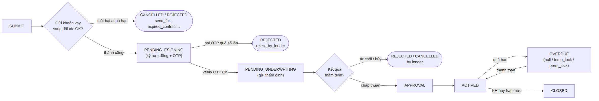

Xem mã Mermaid (nếu muốn sửa lại sơ đồ)

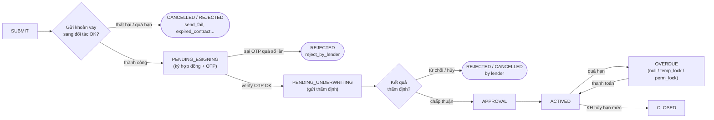

#### Gửi khoản vay sang đối tác

Sau `SUBMIT`, Lender gửi hồ sơ khoản vay sang VietCredit. Nếu gửi thất bại hoặc quá hạn xử lý, khoản vay bị `CANCELLED`/`REJECTED` luôn tại đây (`send_fail`, `expired_contract_by_customer`...) — chưa kịp tới bước ký hợp đồng. Nếu gửi thành công, chuyển sang `PENDING_ESIGNING`.

#### PENDING_ESIGNING — ký hợp đồng trước

Đây là điểm khác biệt lớn nhất so với Cake: **VietCredit cho ký hợp đồng ngay, trước khi thẩm định**. Khách lấy hợp đồng, nhận OTP, nhập OTP để xác thực chữ ký số (giống hệt cơ chế đã nói ở mục 3.3). Nếu nhập sai OTP quá số lần cho phép, hồ sơ bị `REJECTED (reject_by_lender)`. Nếu verify OTP thành công, khoản vay chuyển sang `PENDING_UNDERWRITING`.

#### PENDING_UNDERWRITING — thẩm định sau khi đã ký

VietCredit thẩm định hồ sơ (đối tác có thể trả kết quả ngay, hoặc trả kết quả "tạm" rồi Viettel phải gọi API hỏi lại kết quả sau — xem ghi chú bên dưới). Nếu bị từ chối/hủy, khoản vay chuyển `REJECTED`/`CANCELLED`. Nếu được chấp thuận, chuyển `APPROVAL` rồi `ACTIVED` ngay — **chỉ một lần phê duyệt duy nhất**, đúng như đã nói ở mục 3.3.

> **Ghi chú nhỏ:** sơ đồ gốc có một nhánh ghi "trường hợp đối tác trả kết quả thẩm định TB (tạm biết/tạm báo), Viettel phải gọi API truy vấn kết quả" — nghĩa là đôi khi VietCredit không trả kết quả thẩm định ngay trong cùng một lượt gọi, mà Viettel phải chủ động hỏi lại sau. Đây giống một dạng xử lý bất đồng bộ (polling), nên hỏi lại BA về tần suất/thời điểm gọi lại nếu cần triển khai.

#### ACTIVED, OVERDUE, CLOSED — vòng đời sau khi khoản vay chạy

Sau khi `ACTIVED`, khoản vay hoạt động bình thường. Nếu tới hạn mà khách chưa trả, chuyển `OVERDUE` (có 3 mức: `null` là vừa quá hạn, `temp_lock` là khóa tạm, `perm_lock` là khóa vĩnh viễn — càng để lâu mức độ khóa càng nặng). Khi khách thanh toán lại đầy đủ, quay về `ACTIVED`. Nếu khách chủ động hủy hạn mức (đóng ví), khoản vay chuyển `CLOSED`.

### 4.3. Giai đoạn 2 (Cake) — thẩm định lần 1 trước, ký hợp đồng sau, rồi thẩm định lần 2

**Phần 1 — Thẩm định lần 1 rồi mới ký hợp đồng:**

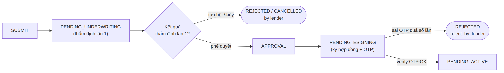

Xem mã Mermaid (nếu muốn sửa lại sơ đồ)

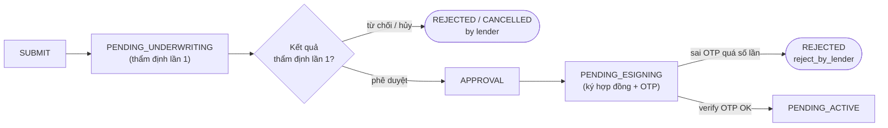

**Phần 2 — Thẩm định lần 2 rồi mới Active:**

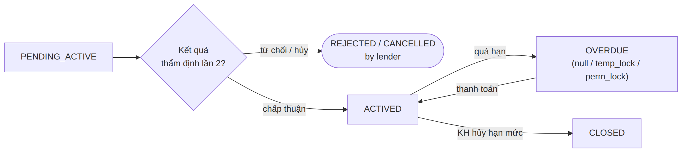

Xem mã Mermaid (nếu muốn sửa lại sơ đồ)

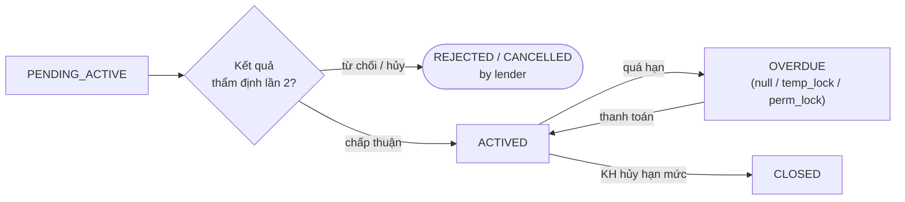

#### PENDING_UNDERWRITING (lần 1) — thẩm định trước khi ký

Khác với VietCredit, Cake **thẩm định trước khi cho ký hợp đồng**. Sau `SUBMIT`, hồ sơ chuyển `PENDING_UNDERWRITING` và Cake thẩm định lần đầu. Đây chính là bước tương ứng với "callback phê duyệt lần 1, unsigned" đã nói ở mục 3.2 (bước 17.1) — "unsigned" vì tới đây hợp đồng còn chưa ký. Nếu bị từ chối/hủy ngay tại đây, `REJECTED`/`CANCELLED`; nếu được phê duyệt, chuyển `APPROVAL`.

#### PENDING_ESIGNING — ký hợp đồng sau khi đã qua thẩm định lần 1

Từ `APPROVAL`, khoản vay chuyển `PENDING_ESIGNING` để khách ký hợp đồng (lấy hợp đồng, nhận OTP, verify OTP — cùng cơ chế như mục 3.3 và như VC ở trên). Sai OTP quá số lần thì `REJECTED (reject_by_lender)`; verify thành công thì chuyển `PENDING_ACTIVE`.

#### PENDING_ACTIVE — chờ thẩm định lần 2

Đây là trạng thái Cake có mà VietCredit không có: sau khi ký hợp đồng xong, khoản vay chưa `ACTIVED` ngay, mà còn phải chờ Cake thẩm định thêm một lần nữa (`kết quả thẩm định lần 2`) — tương ứng với "callback phê duyệt lần 2, Signed" đã nói ở mục 3.3 (bước 12.1). Nếu lần này bị từ chối/hủy, `REJECTED`/`CANCELLED`; nếu được chấp thuận, khoản vay mới thật sự chuyển `ACTIVED`.

#### ACTIVED, OVERDUE, CLOSED

Từ đây, vòng đời của Cake giống hoàn toàn VC: `ACTIVED` → quá hạn thì `OVERDUE` (null/temp_lock/perm_lock) → thanh toán lại thì về `ACTIVED`; khách hủy hạn mức thì `CLOSED`.

### So sánh nhanh: VC vs Cake

| | VietCredit (VC) | Cake |
|---|---|---|
| Thứ tự ký hợp đồng vs thẩm định | **Ký trước** (`PENDING_ESIGNING`), thẩm định sau (`PENDING_UNDERWRITING`) | **Thẩm định trước** (`PENDING_UNDERWRITING`), ký sau (`PENDING_ESIGNING`) |
| Số lần phê duyệt | 1 lần (sau khi ký) | 2 lần (lần 1 trước khi ký — unsigned; lần 2 sau khi ký — Signed) |
| Trạng thái đặc trưng riêng | Không có `PENDING_ACTIVE` | Có thêm `PENDING_ACTIVE` (chờ phê duyệt lần 2) |
| Phần lọc điều kiện trước Submit | Giống nhau (xem mục 4.1) | Giống nhau (xem mục 4.1) |
| Vòng đời sau khi Active | Giống nhau: `ACTIVED` ⇄ `OVERDUE` → `CLOSED` | Giống nhau: `ACTIVED` ⇄ `OVERDUE` → `CLOSED` |

Bảng tham khảo: mapping trạng thái cũ của Cake sang trạng thái mới của nền tảng (dành cho việc cắt chuyển dữ liệu, không phải luồng nghiệp vụ)

Bảng này chỉ có ý nghĩa với việc **migrate dữ liệu Cake cũ sang nền tảng mới** — vì Cake là sản phẩm đã chạy trước, nên trạng thái cũ cần được "dịch" sang tên trạng thái mới ở trên. Không cần nhớ bảng này để hiểu luồng nghiệp vụ, chỉ cần khi làm việc với dữ liệu cũ.

| Trạng thái sản phẩm hiện tại (cũ) | STATUS mới | SUB_STATUS mới | Note |
|---|---|---|---|
| PRECHECK_VDS_QUALIFIED | INIT | PRE_SCREENING_PASS | |
| CREDIT_PASSED | INIT | PRE_SCREENING_PASS | |
| PRECHECK_CAKE_QUALIFIED | INIT | PRE_SCREENING_PASS | |
| EKYC_PASSED | INIT | PRE_EKYC_PASS | |
| SEND_TO_PARTNER, sub = null | PENDING_UNDERWRITING | SEND_TO_PARTNER | Đánh dấu chưa gọi client-create |
| SEND_TO_PARTNER, sub = INIT | | | Đánh dấu đã gọi client-create nhưng nhận mã lỗi được phép retry |
| SEND_TO_PARTNER, sub = PROFILE_INIT | | | Đánh dấu đã gọi client-update nhưng nhận mã lỗi được phép retry |
| SEND_TO_PARTNER, sub = PROFILE_NON_EKYC | | | Đánh dấu đã gọi client-update nhưng nhận mã lỗi được phép retry |
| SEND_TO_PARTNER, sub = UPDATE_TIME_OUT | | | Đánh dấu đã gọi client-update nhưng nhận timeout được phép retry |
| EKYC_CAKE_REVIEW | | | Đánh dấu đã gọi client-update nhưng profile cần đối tác callback-ekyc |
| SEND_TO_PARTNER, sub = PROFILE_EKYC | | | Đánh dấu đã gọi client-update thành công, chưa gọi register |
| SEND_TO_PARTNER, sub = REGISTER_TIME_OUT | | | Đánh dấu đã gọi register nhưng bị timeout, được phép retry |
| SEND_TO_PARTNER, sub = LOAN_INIT | | | Đánh dấu khoản vay đã khởi tạo bên đối tác Cake |
| WAITTING_FOR_APPROVAL | | | Đánh dấu khoản vay đang reviewing và chờ phê duyệt từ đối tác Cake |
| CANCELLED, sub = LOAN_CANCELLED | CANCELLED | CANCELLED_BY_LENDER | |
| REJECTED, sub = LOAN_REJECTED | REJECTED | REJECTED_BY_LENDER | |
| PENDING_SIGNCONTRACT, sub = null | PENDING_ESIGNING | NULL | |
| PENDING_SIGNCONTRACT, sub = get_infor | PENDING_ESIGNING | NULL | |
| PENDING_SIGNCONTRACT, sub = TO | PENDING_ESIGNING | NULL | |
| CANCELLED, sub = cancel by customer | CANCELLED | CANCELLED_CONTRACT_BY_CUSTOMER | |
| EXPIRED_SIGNCONTRACT | CANCELLED | EXPIRED_CONTRACT_BY_CUSTOMER | |
| CALLED_OFF | CANCELLED | CANCLLED_CONTRACT_BY_LENDER | |
| SIGNED | PENDING_ACTIVE | | |
| ACTIVE | ACTIVE | | |
| CLOSED | CLOSED | | |
| OVERDUE, sub = null | OVERDUE | NULL | |
| OVERDUE, sub = temp_lock | OVERDUE | TEMP_LOCK | |
| OVERDUE, sub = perm_lock | OVERDUE | PERM_LOCK | |
| PRECHECK_VDS_NOT_QUALIFIED | REJECTED | PRE_SCREENING_VDS_FAIL | |
| CREDIT_FAILED | REJECTED | CREDIT_SCORE_FAIL | |
| PRECHECK_CAKE_NOT_QUALIFIED | REJECTED | PRE_SCREENING_LENDER_FAIL | |
| EKYC_FAILED | REJECTED | EKYC_FAIL | |
| SEND_FAILED | REJECTED | REJECT_BY_VDS | |

*(Các dòng để trống STATUS/SUB_STATUS trong bảng gốc — nên hỏi lại BA để xác nhận giá trị chính xác trước khi dùng cho việc migrate thật.)*

---

## Vài điểm dễ nhầm, nên để ý

- **"vay dở" khác với "kv active" (mục 3.1)** — "Vay dở" là *chưa xong việc đăng ký* (chỉ có hồ sơ, chưa có khoản vay thật), còn "kv active" là *đã xong đăng ký, đang có khoản vay thật đang chạy*.
- **Bước 5 và bước 7 ở mục 3.1 tên giống nhau ("Đối tác xử lý và trả kết quả") nhưng là hai API khác nhau** — một trả trạng thái hợp đồng, một trả LoanDetail.
- **Ba lớp lọc ở Giai đoạn 1 của mục 3.2 dễ gộp nhầm thành một:** *precheck* (bước 4 — Lending tự lọc sơ bộ, chưa hỏi đối tác), *chấm điểm credit & phân gói* (bước 5 — tính điểm và gói vay khả dụng), và *check Eligible* (bước 7-9 — hỏi thẳng đối tác xem có nhận hồ sơ không). Ba bước này diễn ra ở ba thời điểm khác nhau và có mục đích khác nhau, đừng nhầm là cùng một lượt kiểm tra.
- **Vòng lặp "phân bổ lại" (mục 3.2) không phải bug hay lặp vô hạn** — nó chỉ quay lại bước 6 khi *còn đối tác khác thỏa mãn điều kiện*; nếu không còn đối tác nào, hồ sơ dừng lại (sơ đồ gốc không vẽ rõ nhánh "hết đối tác thì sao", nên hỏi lại BA nếu cần).
- **Có 2 quyết định "chọn đối tác nào" nằm ở 2 vị trí khác nhau trong mục 3.2** — "phân bổ lead" (bước 6, chọn đối tác để hỏi eligible) và "Decision making Ví Cake/VietCredit" (bước 14, chọn đối tác để gửi hồ sơ chính thức). Về logic nhiều khả năng đây là cùng một đối tác được giữ nguyên từ bước 6 mang xuống dùng ở bước 14, nhưng trên sơ đồ chúng được vẽ là hai bước quyết định riêng — nên đọc kỹ, đừng nhầm là một.
- **Nhánh "vay mới" ở mục 3.1 không đụng tới đối tác** — Cake/VietCredit chỉ được gọi tới từ mục 3.2, còn ở màn Onboarding ban đầu (3.1) thì chưa có gì liên quan tới đối tác cả.
- **Cờ dịch vụ VTS ở mục 3.1 không thấy nhánh "không đạt"** trên sơ đồ gốc — nên hỏi lại BA xem nhánh tắt dịch vụ được xử lý ở đâu.
- **"Hủy hợp đồng" (mục 3.3) là hủy ví, không phải hủy khoản vay đơn thuần** — và tùy chọn này sơ đồ gốc ghi rõ chỉ có với Cake, VietCredit không có nhánh tương ứng ở bước preview hợp đồng.
- **"Phê duyệt lần 1" và "phê duyệt lần 2" chỉ áp dụng cho Cake** — VietCredit chỉ có một lần phê duyệt (sau khi ký), nên khi đọc thấy "Signed" mà không có "lần 2" thì đó là trạng thái của VietCredit, đừng nhầm là thiếu bước.
- **Hai lượt xác thực khác mục đích dễ gộp nhầm ở mục 3.3**: sinh/verify OTP (bước 8-11, xác thực đúng khách hàng đang ký) khác với eKYC ở mục 3.2 (xác thực danh tính khách khi đăng ký) — hai cơ chế riêng, ở hai thời điểm khác nhau trong hành trình.
- **Mục 4 nhìn cùng một hành trình nhưng theo góc "trạng thái", không phải góc "service gọi nhau"** — đừng nhầm sơ đồ mục 4 là một luồng nghiệp vụ khác với mục 3; nó chỉ là một lát cắt khác của cùng luồng đăng ký vay đã nói ở mục 3.1-3.3.
- **Cake và VietCredit đảo ngược thứ tự "ký hợp đồng" và "thẩm định"** (mục 4.2, 4.3) — VietCredit ký trước thẩm định sau (1 lần phê duyệt), Cake thẩm định trước ký sau (2 lần phê duyệt, có thêm trạng thái `PENDING_ACTIVE` mà VietCredit không có). Đây là điểm dễ nhầm nhất giữa hai đối tác.
- **`REJECTED` và `CANCELLED` không phải là một** — theo sơ đồ trạng thái mục 4, `REJECTED` là bị đối tác/hệ thống từ chối (không đạt điều kiện), còn `CANCELLED` là bị hủy (do khách tự hủy, hoặc do hết hạn xử lý/timeout) — mỗi trạng thái đều có `sub_status` riêng để biết chính xác lý do.
- **Bảng mapping Cake ở mục 4.3 chỉ dùng cho việc cắt chuyển dữ liệu cũ, không phải luồng nghiệp vụ hiện tại** — đừng dùng bảng đó để hiểu luồng chạy thật, chỉ dùng khi cần đối chiếu dữ liệu Cake từ trước khi cắt chuyển sang nền tảng mới.

---

## Một số từ hay gặp, giải thích ngắn gọn

- **Lending**: hệ thống lõi quản lý nghiệp vụ vay của Viettel Money — nơi ra quyết định "đi đâu tiếp theo" trước khi đụng tới đối tác.
- **Lender (Lender Service)**: lớp trung gian giữa Lending và các đối tác cho vay (Cake, VietCredit) — service duy nhất được phép gọi trực tiếp sang đối tác, chịu trách nhiệm "dịch" dữ liệu sang đúng chuẩn API của từng đối tác (mapping).
- **Miniapp**: ứng dụng con chạy trong app Viettel Money, là phần giao diện khách hàng thực sự nhìn thấy và bấm vào.
- **QLKV**: viết tắt của "Quản Lý Khoản Vay" — màn hình cho khách xem/theo dõi khoản vay của mình.
- **LoanDetail**: chi tiết một khoản vay đang có — dư nợ, kỳ hạn, ngày đến hạn, lịch sử trả...
- **Đối tác (Partner)**: Cake hoặc VietCredit — đơn vị thực sự thẩm định, phê duyệt, và quản lý dư nợ của khoản vay. Viettel Money đóng vai nền tảng kết nối, không tự cho vay.
- **Cờ dịch vụ / cờ tính năng (feature flag)**: một kiểu "công tắc" để bật/tắt một tính năng cho một nhóm khách/kênh/đối tác nhất định mà không cần sửa code.
- **Blocklist**: danh sách khách hàng bị chặn/từ chối, quản lý riêng theo từng đối tác (thường do lịch sử nợ xấu, gian lận...).
- **Phân khúc khách hàng**: nhóm khách theo một số tiêu chí nghiệp vụ, dùng để áp precheck/chấm điểm phù hợp cho từng nhóm.
- **Precheck**: lọc sơ bộ nhanh, loại sớm hồ sơ chắc chắn không đạt trước khi làm các bước tốn công hơn (như chấm điểm hay eKYC).
- **Chấm điểm credit & phân gói**: tính điểm tín dụng của khách rồi map ra một hoặc nhiều gói vay khả dụng, làm riêng theo từng đối tác.
- **Phân bổ lead**: chọn một đối tác cụ thể để gửi hồ sơ khách hàng sang, theo tỉ lệ được cấu hình sẵn (kiểu điều tiết lưu lượng giữa các đối tác).
- **Eligible / check Eligible**: kiểm tra điều kiện nhận hồ sơ *thật* với đối tác — khác precheck ở chỗ đây là hỏi trực tiếp đối tác, không phải Lending tự lọc nội bộ.
- **eKYC**: xác thực danh tính khách hàng qua app (chụp giấy tờ, chụp mặt, đối chiếu).
- **TTTĐ**: chưa xác định chắc chắn viết tắt của gì — nên hỏi lại BA/đội nghiệp vụ.
- **Decision making (Ví Cake / Ví VietCredit)**: bước xác định hồ sơ này thuộc ví (đối tác) nào để gửi đăng ký chính thức.
- **Callback (unsigned)**: đối tác (ở đây là Cake) gọi ngược lại hệ thống để báo kết quả phê duyệt tạm, hợp đồng chưa ký ("unsigned") — khác với phê duyệt cuối cùng sau khi ký hợp đồng.
- **Ký số**: ký hợp đồng bằng hình thức điện tử (không phải ký tay), thường đi kèm một bước xác thực OTP để đảm bảo đúng khách hàng thực hiện ký.
- **OTP (One-Time Password)**: mã dùng một lần, gửi tới khách để xác thực chính khách hàng đang thực hiện hành động (ở đây là ký hợp đồng) — khác với eKYC (xác thực danh tính lúc đăng ký).
- **Signed / Active (trạng thái ví)**: "Signed" là đã ký hợp đồng nhưng còn chờ đối tác phê duyệt lần cuối; "Active" là ví đã được phê duyệt xong, khách dùng được dịch vụ.
- **Hủy ví**: hủy toàn bộ ví trả sau (không chỉ hủy đơn xin vay) — vì tới bước này ví nhiều khả năng đã được khởi tạo, dù chưa active.
- **INIT / SUBMIT / APPROVAL / ACTIVED / OVERDUE / CLOSED**: các trạng thái (`STATUS`) chính của một khoản vay, theo đúng thứ tự đi qua trong đời một khoản vay bình thường — mới tạo, đã gửi đăng ký, được phê duyệt, đang hoạt động, quá hạn, đã đóng.
- **PENDING_ESIGNING**: trạng thái "đang chờ ký hợp đồng" — khách đang trong bước lấy hợp đồng và xác thực OTP để ký.
- **PENDING_UNDERWRITING**: trạng thái "đang chờ thẩm định" — hồ sơ đã gửi sang đối tác, đang chờ đối tác đánh giá có cho vay hay không.
- **PENDING_ACTIVE**: trạng thái chỉ có ở Cake — đã ký hợp đồng xong nhưng còn chờ đối tác phê duyệt lần 2 trước khi thật sự Active.
- **sub_status**: một trạng thái "phụ" đi kèm `STATUS` chính, dùng để biết chi tiết hơn *vì sao* khoản vay đang ở trạng thái đó (ví dụ `REJECTED` có thể do `ekyc_fail`, `credit_fail`, `reject_by_lender`... mỗi lý do một `sub_status` khác nhau).
- **OVERDUE (null/temp_lock/perm_lock)**: ba mức độ quá hạn — `null` là vừa quá hạn, `temp_lock` là bị khóa tạm thời, `perm_lock` là bị khóa vĩnh viễn; càng để quá hạn lâu mức khóa càng nặng.
- **Cắt chuyển nền tảng (migrate)**: việc chuyển dữ liệu/khách hàng đang dùng sản phẩm Cake cũ sang chạy trên nền tảng "Ví trả sau" mới — cần bảng mapping trạng thái cũ→mới vì tên trạng thái hai bên khác nhau.

---

*Tài liệu này viết dựa trên sơ đồ activity của mục 3.1, 3.2, 3.3 và mục 4 (Biểu đồ trạng thái) trong file "Ví trả sau - Nền tảng-v25", phần "vì sao" là suy luận theo logic nghiệp vụ chung (có đối chiếu với phần mô tả vai trò của Lender ở mục Mô hình tổng quan trong cùng tài liệu), không phải trích nguyên văn đặc tả chi tiết. Sơ đồ trạng thái ở mục 4 đã được đơn giản hóa một số nhánh phụ (timeout, retry) để dễ đọc — nếu cần chính xác 100% từng nhánh, nên đối chiếu lại sơ đồ activity gốc ở trang "4. Biểu đồ trạng thái" của file PDF. Bạn nên xác nhận lại với BA/đội nghiệp vụ trước khi dùng để trình bày chính thức, đặc biệt là ý nghĩa của cờ VTS, "TTTĐ", nhánh "Hủy hợp đồng" chỉ có ở Cake, cơ chế đối tác trả kết quả thẩm định "TB" (polling) ở mục 4.2, và các nhánh fail không được vẽ rõ trên sơ đồ gốc.*
