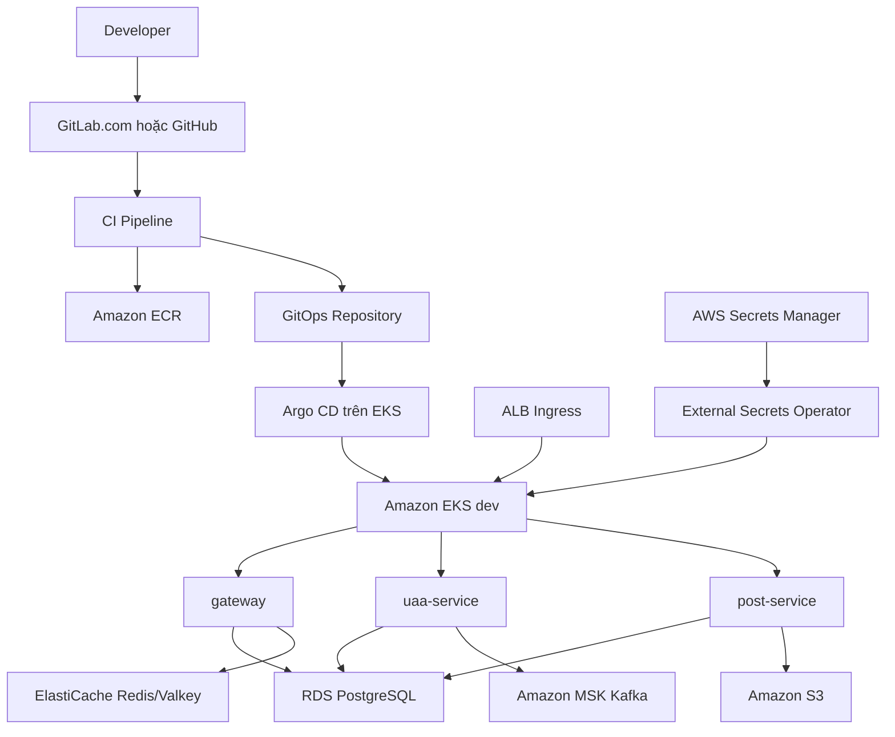

# Thực hành CI/CD + Argo CD + AWS + EKS theo topology doanh nghiệp low-cost

> Mục tiêu: dựng hệ thống 3 Spring Boot service, PostgreSQL, Redis/Valkey, Kafka, S3, ECR, EKS và Argo CD theo cách làm gần với doanh nghiệp, nhưng sizing nhỏ và chỉ bật khi thực hành để bảo vệ AWS credit 100 USD.
> Bản này là v2 của tài liệu `THUC-HANH-GITLAB-CI-ARGOCD-AWS-EKS.md`. Bản cũ giữ lại hướng GitLab Self-Managed; bản v2 không self-host GitLab.

Tài liệu kiến thức nền: [Triển khai hệ thống Spring Boot trên AWS và Kubernetes](./TRIEN-KHAI-HE-THONG-SPRINGBOOT-AWS-EKS-PRODUCTION.md).

---

## 0. Danh sách bước dự kiến

Danh sách này giúp ước lượng phạm vi trước khi đi vào phần giải thích chi tiết. Mỗi bước lớn có thể gồm nhiều bước nhỏ liên quan cùng một phạm vi triển khai.

```text
Bước 2.1 - Bảo vệ AWS root account bằng MFA
Bước 2.2 - Vô hiệu hóa root access key
Bước 2.3 - Tạo IAM group và IAM user lab
Bước 2.4 - Bật CloudTrail audit trong account lab
Bước 2.5 - Tạo budget/cost alert để bảo vệ free credit
Bước 3.1 - Bootstrap Terraform remote state backend
Bước 3.2 - Tạo root module đầu tiên cho network dev
Bước 3.3 - Triển khai network dev thật bằng module VPC
Bước 3.4 - Dựng network shared-services bằng lại module VPC
Bước 3.5 - Chốt không self-host GitLab trong lab AWS credit 100$
Bước 3.6 - Triển khai Amazon ECR dùng chung
Bước 3.7 - Chuẩn bị source control và CI SaaS build/push image
Bước 4.1 - Triển khai EKS dev
Bước 4.2 - Cài add-on nền cho EKS dev
Bước 4.3 - Triển khai RDS PostgreSQL dev
Bước 4.4 - Triển khai ElastiCache Redis/Valkey dev
Bước 4.5 - Triển khai Amazon MSK Kafka dev
Bước 4.6 - Triển khai S3 và Secrets Manager dev
Bước 4.7 - Cài Argo CD và GitOps dev
Bước 4.8 - Deploy gateway, uaa-service và post-service vào EKS
Bước 4.9 - Hoàn thiện observability và security dev
Bước 4.10 - Kiểm thử reliability và rollback dev
Bước 5.1 - Dựng staging theo buổi học từ module đã chạy ở dev
Bước 5.2 - Promote image dev sang staging bằng cùng digest
Bước 6.1 - Chuẩn bị production mô phỏng hoặc apply ngắn hạn
Bước 6.2 - Promote staging sang production bằng cùng digest
Bước 7.1 - Cleanup bắt buộc sau mỗi buổi thực hành
```

---

## 1. Nguyên tắc thực hành

### 1.1. Enterprise topology, lab-sized capacity

Bài lab dùng công nghệ và luồng triển khai doanh nghiệp hay dùng:

| Thành phần | Công nghệ chọn trong v2 |
|---|---|
| Source control | GitLab.com hoặc GitHub |
| CI | GitLab CI hoặc GitHub Actions |
| Infrastructure as Code | Terraform |
| Container registry | Amazon ECR |
| Kubernetes | Amazon EKS |
| Continuous Delivery | Argo CD GitOps |
| Database | Amazon RDS for PostgreSQL |
| Cache | Amazon ElastiCache Redis/Valkey |
| Kafka | Amazon MSK Provisioned |
| Secret | AWS Secrets Manager + External Secrets Operator |
| Object storage | Amazon S3 |
| Ingress | AWS Load Balancer Controller + ALB |
| Observability | CloudWatch trước, Prometheus/Grafana sau nếu cần |

Sizing nhỏ không có nghĩa là bỏ topology:

```text
Dùng đúng boundary, đúng service, đúng luồng CI/CD/GitOps
  -> giảm node size, disk, retention, replica khi lab
  -> bật khi thực hành
  -> destroy sau khi nghiệm thu
```

### 1.2. Không self-host GitLab trong bài lab 100 USD

Không tạo các tài nguyên sau trong luồng chính:

- GitLab application EC2.
- Gitaly EC2.
- RDS PostgreSQL riêng cho GitLab.
- Redis riêng cho GitLab.
- ALB riêng cho GitLab.
- S3 buckets riêng cho GitLab artifact/LFS/upload/backup.
- GitLab Runner EC2 Auto Scaling riêng.

Lý do: GitLab Self-Managed là một platform lớn, cần RAM và nhiều data component. Với credit 100 USD, nên dành ngân sách cho EKS, RDS, MSK, ElastiCache và workload Spring Boot.

### 1.3. Không chạy 24/7

Mỗi buổi thực hành đi theo nhịp:

```text
terraform apply
  -> kiểm tra topology
  -> chạy flow ứng dụng
  -> ghi kết quả
  -> terraform destroy
```

Không để qua đêm các nhóm tài nguyên tính tiền theo giờ:

- EKS control plane.
- NAT Gateway.
- ALB.
- RDS.
- ElastiCache.
- MSK.
- EC2 worker nodes.

### 1.4. Không dựng đồng thời dev, staging, production

Vẫn giữ tư duy promotion:

```text
dev hoàn thành
  -> tạo staging từ cùng module và values khác
  -> staging hoàn thành
  -> tạo production từ cùng module và values khác
```

Nhưng trong account 100 USD:

- Chỉ apply một môi trường tại một thời điểm.
- `staging` và `production` ban đầu chỉ có folder, README, tfvars mẫu và GitOps values.
- Khi cần học promotion, apply staging trong một buổi riêng rồi destroy.

---

## 2. Kiến trúc đích



Topology HA tiny khi muốn học HA:

```text
VPC 2 AZ hoặc 3 AZ
  -> public subnet cho ALB/NAT
  -> private app subnet cho EKS worker nodes
  -> isolated data subnet cho RDS/Redis/MSK

EKS
  -> node group trải 2 AZ
  -> mỗi service 2 replicas
  -> PDB, HPA, probes, resource requests/limits

Data
  -> RDS PostgreSQL Multi-AZ nếu buổi học cần HA DB
  -> ElastiCache primary + replica nếu buổi học cần HA cache
  -> MSK 2 broker / 2 AZ để học managed Kafka
```

Topology low-cost khi chỉ cần test app flow:

```text
EKS 1 cluster
  -> 1-2 worker nodes
  -> 3 Spring Boot services

RDS PostgreSQL single-AZ
  -> 1 instance nhỏ
  -> 2 database/schema nếu cần 2 DB logic

Redis
  -> ElastiCache 1 node hoặc in-cluster cho phase đầu

Kafka
  -> MSK 2 broker khi học managed Kafka
  -> Redpanda/Strimzi in-cluster nếu chỉ cần test code nhanh
```

---

## 3. Cấu trúc repository

### 3.1. Source repositories

Có thể dùng mono-repo hoặc multi-repo. Với bài học rõ ràng, dùng multi-repo:

```text
https://gitlab.com/newgate2601/social-media-app-gateway
├── src/
├── pom.xml
├── Dockerfile
├── .dockerignore
├── .gitlab-ci.yml hoặc .github/workflows/ci.yml
├── src/main/resources/application-k8s.yaml
├── k8s/deployment.yaml
└── README.md

https://gitlab.com/newgate2601/social-media-app-uaa
https://gitlab.com/newgate2601/social-media-app-post
```

Mapping triển khai:

| GitLab project | ECR repository | Kubernetes Service |
|---|---|---|
| `newgate2601/social-media-app-gateway` | `newgate2601-shared-services/gateway` | `gateway-service` |
| `newgate2601/social-media-app-uaa` | `newgate2601-shared-services/uaa-service` | `uaa-service` |
| `newgate2601/social-media-app-post` | `newgate2601-shared-services/post-service` | `post-service` |

Không dùng `service-registry` trong AWS/EKS path. Service discovery do Kubernetes Service DNS và Spring Cloud Kubernetes Gateway discovery đảm nhiệm.

Nếu muốn đơn giản hóa thao tác, dùng mono-repo:

```text
springboot-learning/
├── services/
│   ├── gateway/
│   ├── uaa-service/
│   ├── post-service/
├── terraform/
└── gitops/
```

### 3.2. Infrastructure repository

```text
terraform/
├── modules/
│   ├── vpc/
│   ├── eks/
│   ├── ecr/
│   ├── rds-postgresql/
│   ├── msk/
│   ├── elasticache/
│   ├── s3-app/
│   └── observability/
└── environments/
    ├── shared-services/
    │   ├── network/
    │   └── ecr/
    ├── dev/
    │   ├── network/
    │   ├── eks/
    │   ├── data/
    │   └── observability/
    ├── staging/       # chưa apply lúc đầu
    └── production/    # chưa apply lúc đầu
```

### 3.3. GitOps repository

```text
gitops/
├── charts/
│   └── springboot-service/
├── applications/
│   ├── gateway/
│   │   ├── values-dev.yaml
│   │   ├── values-staging.yaml
│   │   └── values-production.yaml
│   ├── uaa-service/
│   └── post-service/
└── argocd/
    ├── dev/
    ├── staging/
    └── production/
```

Ban đầu chỉ apply `dev`. Các folder `staging` và `production` có thể tồn tại để giữ cấu trúc, nhưng không tạo AWS resource thật cho đến khi cần học promotion.

---

## 4. Cổng nghiệm thu

Một giai đoạn chỉ được đóng khi đạt đủ điều kiện:

```text
Không đạt nền tảng -> chưa dựng dev
Không đạt dev      -> chưa dựng staging
Không đạt staging  -> chưa dựng production
```

Không chuyển lỗi sang môi trường sau với ghi chú "sẽ sửa sau".

---

## PHẦN I - NỀN TẢNG DÙNG CHUNG

## 5. Bước 1 - Chốt ADR kiến trúc

Tạo ADR:

```text
docs/adr/
├── 001-aws-account-model.md
├── 002-region-and-availability-zones.md
├── 003-no-self-hosted-gitlab-for-100-usd-lab.md
├── 004-gitops-with-argocd.md
├── 005-managed-data-services-low-cost.md
├── 006-lab-start-stop-destroy-policy.md
└── 007-environment-promotion-model.md
```

Chốt rõ:

- Region AWS.
- Một AWS account lab.
- CIDR cho shared-services, dev, staging, production.
- Dùng GitLab.com hay GitHub.
- Dùng GitLab CI hay GitHub Actions.
- Môi trường nào được apply trước.
- Chính sách bật/tắt/destroy sau buổi học.
- Budget alert và ngưỡng dừng.

Hoàn thành khi ADR ghi rõ: **không self-host GitLab trong bài lab này**.

## 6. Bước 2 - Chuẩn bị AWS account lab

Làm các việc bắt buộc:

- Bật MFA cho root account.
- Không dùng root cho thao tác hằng ngày.
- Tạo IAM user hoặc IAM Identity Center user cho lab.
- Bật CloudTrail.
- Tạo budget alert.
- Tạo S3 backend + locking cho Terraform state.

Budget nên đặt:

```text
20 USD  -> cảnh báo sớm
50 USD  -> kiểm tra lại resource đang chạy
80 USD  -> dừng apply resource mới
95 USD  -> cleanup bắt buộc
```

Hoàn thành khi có thể chạy:

```powershell
aws sts get-caller-identity
terraform version
```

## 7. Bước 3 - Terraform remote state

Tạo backend:

```text
bootstrap/backend/terraform.tfstate
shared-services/network/terraform.tfstate
shared-services/ecr/terraform.tfstate
dev/network/terraform.tfstate
dev/eks/terraform.tfstate
dev/data/terraform.tfstate
dev/observability/terraform.tfstate
```

Luồng thay đổi Terraform:

```text
terraform fmt
  -> terraform validate
  -> terraform plan
  -> review plan
  -> terraform apply
```

Không commit:

```text
.terraform/
terraform.tfstate
terraform.tfstate.backup
tfplan
*.tfplan
```

## 8. Bước 4 - Network shared-services và dev

Tạo VPC bằng cùng module:

```text
modules/vpc
  -> environments/shared-services/network
  -> environments/dev/network
```

CIDR gợi ý:

| Môi trường | CIDR | Vai trò |
|---|---|---|
| shared-services | `10.10.0.0/16` | ECR, CI integration, platform shared |
| dev | `10.20.0.0/16` | EKS và workload dev |
| staging | `10.30.0.0/16` | chưa apply lúc đầu |
| production | `10.40.0.0/16` | chưa apply lúc đầu |

Lab low-cost có thể dùng `nat_gateway_mode = "single"`. Khi học HA network, đổi sang `one_per_az` trong một buổi riêng và destroy sau đó.

Hoàn thành khi:

- VPC dev và shared-services tách state.
- Public/private/isolated subnet có route đúng.
- Không có staging/production resource thật.

## 9. Bước 5 - ECR dùng chung

Tạo ECR repositories:

```text
gateway
uaa-service
post-service
```

Cấu hình:

- Image tag immutability.
- Lifecycle policy.
- Image scan.
- Encryption.

CI push image theo digest, không deploy `latest`.

Hoàn thành khi mỗi service có thể push image:

```text
<account>.dkr.ecr.<region>.amazonaws.com/gateway@sha256:...
<account>.dkr.ecr.<region>.amazonaws.com/uaa-service@sha256:...
<account>.dkr.ecr.<region>.amazonaws.com/post-service@sha256:...
```

## 10. Bước 6 - Source control và CI SaaS

Chọn một trong hai:

```text
GitLab.com + GitLab CI
GitHub + GitHub Actions
```

Yêu cầu:

- Protected main branch.
- Merge Request/Pull Request bắt buộc.
- Pipeline phải pass trước khi merge.
- CI dùng OIDC/role tạm thời nếu có thể.
- Không lưu AWS access key dài hạn trong repo.

Pipeline source:

```text
Pull/Merge Request
  -> compile
  -> unit test
  -> integration test nhẹ
  -> dependency scan nếu có

Merge main
  -> build JAR
  -> build image
  -> scan image
  -> push ECR
  -> tạo MR/PR cập nhật GitOps image digest
```

Hoàn thành khi CI push được image vào ECR và mở thay đổi GitOps.

---

## PHẦN II - MÔI TRƯỜNG DEV

## 11. Bước 7 - Dựng EKS dev

Terraform root module:

```text
terraform/environments/dev/eks
```

Tạo:

- EKS control plane.
- Managed node group.
- VPC CNI, CoreDNS, kube-proxy.
- EBS CSI Driver.
- Metrics Server.
- Cluster Autoscaler hoặc Karpenter nếu muốn học nâng cao.
- Namespace, ResourceQuota, LimitRange.
- Pod Security và RBAC.

Low-cost default:

```text
node group: 1-2 nodes
instance: t3.large hoặc t3a.large
desired: 2 nếu cần chạy 3 service + Argo CD + addons
```

HA lab:

```text
2 AZ
2 worker nodes
3 Spring Boot service, mỗi service 2 replicas nếu tài nguyên đủ
```

Hoàn thành khi:

- `kubectl get nodes` thành công.
- Node không có public IP nếu thiết kế private node.
- Pod test resolve DNS được.
- RBAC không cấp quyền cluster-admin bừa bãi.

## 12. Bước 8 - Dựng data service dev

Terraform root module:

```text
terraform/environments/dev/data
```

Tạo theo phase.

Phase low-cost:

```text
RDS PostgreSQL single-AZ
ElastiCache 1 node hoặc Redis in-cluster
MSK 2 broker chỉ bật khi cần test Kafka thật
S3 bucket app
Secrets Manager
```

Phase HA tiny:

```text
RDS PostgreSQL Multi-AZ
ElastiCache primary + replica
MSK Provisioned 2 broker / 2 AZ
S3 versioning nếu cần test rollback/object history
```

Gợi ý DB:

- Nếu cần 2 DB logic, ưu tiên 1 RDS PostgreSQL instance với 2 database/schema.
- Chỉ tạo 2 RDS riêng khi bài học thật sự cần tách blast radius.

Hoàn thành khi:

- Không service data nào public.
- Security Group chỉ mở đúng nguồn từ EKS.
- Secret nằm trong Secrets Manager.
- Backup retention hợp lý cho lab.
- Deletion protection tắt trong lab để destroy được.

## 13. Bước 9 - Cài add-on dev

Thứ tự:

1. AWS Load Balancer Controller.
2. External Secrets Operator.
3. Metrics Server.
4. Argo CD.
5. Log/metric collector.
6. Policy engine nếu cần.

Yêu cầu:

- Version được pin.
- IAM role dùng IRSA/OIDC.
- Không dùng admin credential tĩnh trong secret.

Hoàn thành khi Argo CD chạy được trong cluster và có quyền đúng phạm vi dev.

## 14. Bước 10 - Chuẩn bị GitOps dev

Tạo:

```text
gitops/
├── charts/springboot-service/
├── applications/gateway/values-dev.yaml
├── applications/uaa-service/values-dev.yaml
├── applications/post-service/values-dev.yaml
└── argocd/dev/
```

Chart phải có:

- Deployment.
- Service.
- Ingress.
- ConfigMap.
- ExternalSecret.
- Probes.
- Resource requests/limits.
- HPA.
- PDB.
- Topology spread constraints.

Không lưu secret thật trong GitOps.

## 15. Bước 11 - Deploy 3 Spring Boot service

Luồng chuẩn:

```text
Developer merge code
  -> CI build/test/scan
  -> CI push image vào ECR
  -> CI mở MR/PR cập nhật image digest trong GitOps
  -> merge GitOps
  -> Argo CD sync
  -> EKS rolling update
```

Service flow:

```text
Client
  -> ALB
  -> gateway
  -> uaa-service
  -> post-service
  -> PostgreSQL
  -> Redis/Valkey
  -> Kafka
  -> S3
```

Hoàn thành khi:

- 3 service đều healthy.
- Ingress gọi được endpoint.
- Service đọc secret từ ExternalSecret.
- Service kết nối DB/cache/Kafka/S3 thành công.
- Rollout và rollback bằng GitOps commit hoạt động.

## 16. Bước 12 - Observability và security dev

Tối thiểu:

- CloudWatch logs.
- Metric EKS/node/pod.
- RDS metric.
- MSK consumer lag.
- Redis memory/eviction.
- Application structured log có trace id.

Nâng cao:

- OpenTelemetry.
- Prometheus/Grafana.
- Alert rule.
- Runbook.

Security:

- Container non-root.
- Read-only root filesystem nếu app cho phép.
- NetworkPolicy default deny nếu CNI/policy engine hỗ trợ.
- Secret rotation test.

## 17. Bước 13 - Reliability drill dev

Thực hành:

- Xóa Pod.
- Drain node.
- Revert GitOps commit.
- Làm Redis tạm thời unavailable.
- Tạo Kafka message lỗi và DLQ.
- Restore database vào instance kiểm tra.
- Rotate secret.

Hoàn thành khi mỗi drill có ghi:

```text
Mục tiêu
Cách làm
Kết quả quan sát
Lỗi gặp
Cách sửa
```

---

## PHẦN III - STAGING THEO BUỔI HỌC

## 18. Bước 14 - Tạo staging từ module đã chạy ở dev

Không copy module rồi sửa tay.

```text
environments/staging
  -> gọi lại modules/vpc
  -> gọi lại modules/eks
  -> gọi lại modules/data
```

Khác biệt nằm trong biến:

- CIDR.
- Instance size.
- Replica.
- Backup retention.
- Domain.
- Sync policy.

Trong credit 100 USD, chỉ apply staging khi cần học:

```text
terraform apply staging
  -> chạy test
  -> terraform destroy staging
```

## 19. Bước 15 - Promote image dev sang staging

Không build lại image.

```text
gateway@sha256:abc đã chạy dev
  -> cập nhật values-staging.yaml
  -> Argo CD staging sync
```

Hoàn thành khi staging chạy đúng image digest đã qua dev.

---

## PHẦN IV - PRODUCTION MÔ PHỎNG HOẶC APPLY NGẮN HẠN

## 20. Bước 16 - Review trước production

Review:

- Threat model.
- IAM least privilege.
- RPO/RTO.
- Capacity.
- Chi phí theo giờ.
- Backup/restore.
- Rollback.
- Observability.

Với account 100 USD, production chủ yếu là:

```text
Terraform root module
tfvars mẫu
GitOps values-production.yaml
runbook
cost estimate
```

Chỉ apply production nếu có buổi học riêng và destroy ngay sau khi nghiệm thu.

## 21. Bước 17 - Promote staging sang production

Không build lại image:

```text
gateway@sha256:abc đã đạt staging
  -> MR/PR production
  -> approval
  -> Argo CD production sync
```

Production sync nên manual trong lab để tránh apply nhầm.

---

## PHẦN V - CLEANUP BẮT BUỘC

## 22. Checklist destroy sau mỗi buổi

Trước khi nghỉ:

```powershell
terraform destroy
```

Kiểm tra không còn:

- EKS cluster.
- EC2 worker nodes.
- NAT Gateway không cần thiết.
- ALB.
- RDS lab.
- ElastiCache lab.
- MSK lab.
- EBS volume orphan.
- EIP unattached.
- Snapshot không cần giữ.
- Log group retention quá dài.

Các resource có thể giữ nếu rất rẻ và có chủ đích:

- S3 Terraform state bucket.
- DynamoDB/S3 lock backend nếu đang dùng.
- ECR repositories.
- Route 53 hosted zone/domain.
- Budget alert.
- CloudTrail.

## 23. Definition of Done toàn bài v2

- [ ] Không self-host GitLab trong AWS account lab.
- [ ] CI SaaS build/test/scan/push image vào ECR.
- [ ] Image deploy bằng digest, không dùng `latest`.
- [ ] Argo CD là thành phần deploy app vào EKS.
- [ ] Terraform module dùng lại cho dev/staging/production.
- [ ] Dev chạy được 3 Spring Boot service.
- [ ] Service kết nối PostgreSQL, Redis/Valkey, Kafka và S3.
- [ ] Secret lấy từ AWS Secrets Manager qua External Secrets Operator.
- [ ] Probes, resource limit, HPA, PDB hoạt động.
- [ ] Rollback bằng GitOps revert đã thử.
- [ ] Backup/restore DB đã thử.
- [ ] Kafka DLQ/retry/idempotency đã thử ở mức lab.
- [ ] Log/metric/alert cơ bản hoạt động.
- [ ] Staging/production không chạy 24/7.
- [ ] Sau buổi học có cleanup checklist và không còn resource tính phí lớn bị bỏ quên.

---

## 24. Tài liệu chính thức

- [Amazon EKS - Pricing](https://aws.amazon.com/eks/pricing/)
- [Amazon EKS - Argo CD](https://docs.aws.amazon.com/eks/latest/userguide/argocd.html)
- [AWS Prescriptive Guidance - Argo CD](https://docs.aws.amazon.com/prescriptive-guidance/latest/eks-gitops-tools/argo-cd.html)
- [Amazon ECR](https://docs.aws.amazon.com/AmazonECR/latest/userguide/what-is-ecr.html)
- [Amazon RDS for PostgreSQL](https://docs.aws.amazon.com/AmazonRDS/latest/UserGuide/CHAP_PostgreSQL.html)
- [Amazon ElastiCache](https://docs.aws.amazon.com/AmazonElastiCache/latest/dg/WhatIs.html)
- [Amazon MSK](https://docs.aws.amazon.com/msk/latest/developerguide/what-is-msk.html)
- [External Secrets Operator](https://external-secrets.io/)
- [Argo CD](https://argo-cd.readthedocs.io/)

