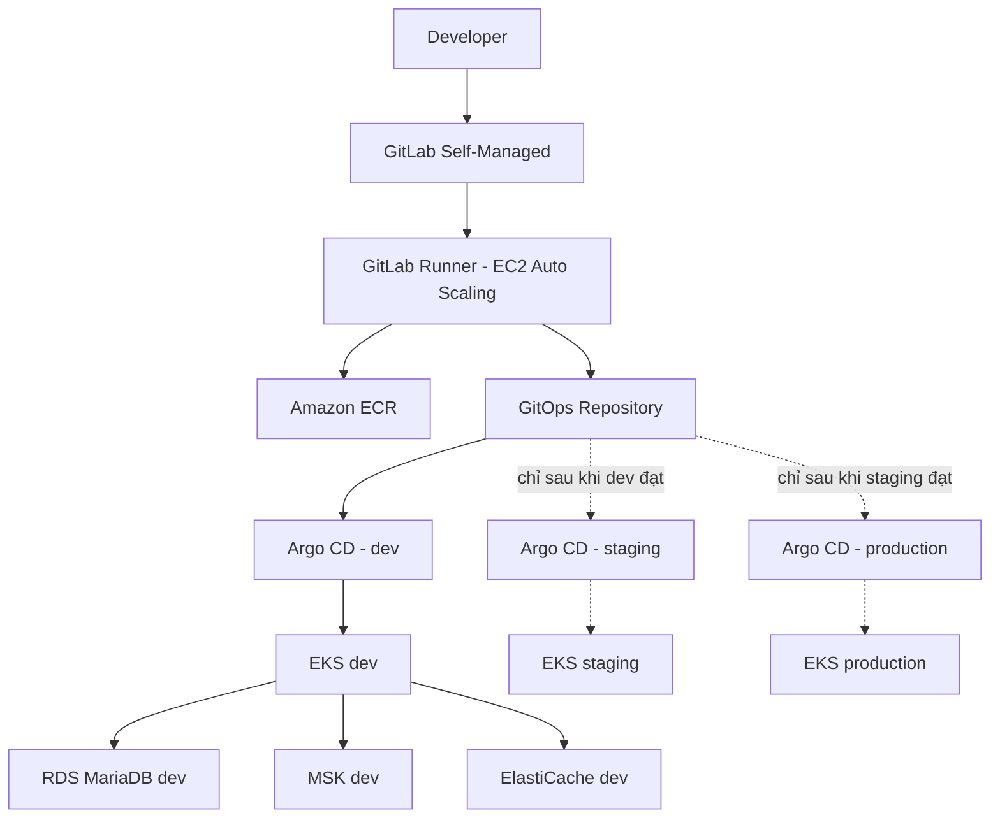
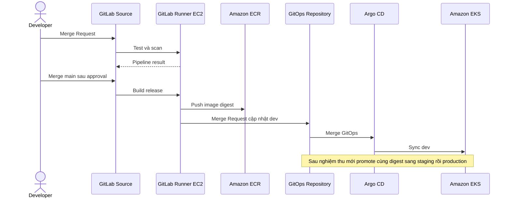

# Thực hành GitLab CI + Argo CD + AWS + Kubernetes theo từng giai đoạn

> Mục tiêu: dựng một hệ thống Spring Boot, MariaDB, Kafka và Redis theo cách làm gần với doanh nghiệp.  
> Thứ tự bắt buộc: hoàn thành nền tảng dùng chung → hoàn thành `dev` → hoàn thành `staging` → cuối cùng mới dựng `production`.

Tài liệu kiến thức nền: [Triển khai hệ thống Spring Boot trên AWS và Kubernetes](./TRIEN-KHAI-HE-THONG-SPRINGBOOT-AWS-EKS-PRODUCTION.md).

---

## 1. Nguyên tắc thực hành

### 1.1. Không dựng đồng thời ba môi trường

Chúng ta thực hiện đúng thứ tự:

```text
Nền tảng dùng chung hoàn thành
  → dev hoàn thành và được nghiệm thu
  → staging được dựng từ module đã chạy tốt ở dev
  → staging hoàn thành và được nghiệm thu
  → production được dựng từ đúng module đã kiểm chứng
  → go-live
```

Khi đang làm `dev`:

- Không tạo EKS staging.
- Không tạo RDS staging.
- Không tạo tài nguyên production để “để sẵn”.
- Không cấp quyền production cho GitLab Runner hoặc Argo CD.
- Không viết một bộ manifest riêng cho staging hay production.

### 1.2. Làm một lần đúng hướng, không dựng tạm rồi thay

Các quyết định sau được dùng lâu dài ngay từ đầu:

| Thành phần | Cách triển khai cố định |
|---|---|
| Source control | GitLab Self-Managed private trên AWS |
| GitLab Runner | EC2 Auto Scaling trong account shared-services |
| Infrastructure as Code | Terraform module dùng chung, root module riêng theo môi trường |
| Container registry | Amazon Elastic Container Registry (Amazon ECR) |
| Kubernetes | Amazon Elastic Kubernetes Service (Amazon EKS) |
| Continuous Delivery | Argo CD theo mô hình GitOps |
| Database | Amazon RDS for MariaDB |
| Kafka | Amazon Managed Streaming for Apache Kafka (Amazon MSK) |
| Redis/Valkey | Amazon ElastiCache |
| Secret | AWS Secrets Manager + External Secrets Operator |
| File/object | Amazon Simple Storage Service (Amazon S3) |

GitLab Runner không được đặt tạm trên một máy rồi chuyển sang EKS. Runner trên EC2 Auto Scaling là kiến trúc chính thức của bài thực hành và tiếp tục phục vụ cả dev, staging lẫn production.

### 1.3. Dùng lại module không có nghĩa là dựng sẵn môi trường

Khi làm dev, chúng ta viết module có đầu vào rõ ràng:

```text
modules/vpc
modules/eks
modules/rds-mariadb
modules/msk
modules/elasticache
modules/observability
```

Dev gọi các module đó trước. Sau khi dev ổn định, staging và production gọi lại đúng module với biến khác.

```text
Một module đã kiểm chứng
├── environments/dev
├── environments/staging       # chỉ tạo sau khi dev đạt cổng nghiệm thu
└── environments/production    # chỉ tạo sau khi staging đạt cổng nghiệm thu
```

Nếu staging yêu cầu viết lại toàn bộ module, dev chưa thực sự hoàn thành.

### 1.4. Vai trò của từng công cụ

| Công cụ | Công việc |
|---|---|
| GitLab | Lưu source code, Terraform và GitOps configuration |
| GitLab CI | Build, test, scan, tạo image và đề nghị thay đổi GitOps |
| Amazon ECR | Lưu container image theo digest bất biến |
| Argo CD | Đọc GitOps repository và đồng bộ xuống EKS |
| Amazon EKS | Chạy ứng dụng Spring Boot |
| Terraform | Tạo và thay đổi hạ tầng AWS |

GitLab CI không chạy `kubectl apply` vào production. Argo CD không build source code.

---

## 2. Kiến trúc đích



Môi trường staging và production trong sơ đồ là kiến trúc đích, không phải tài nguyên được tạo ngay từ đầu.

---

## 3. Cấu trúc repository được chốt từ đầu

### 3.1. Source repository

```text
orders-service/
├── src/
├── pom.xml
├── Dockerfile
├── .gitlab-ci.yml
└── README.md
```

### 3.2. Infrastructure repository

```text
platform-infrastructure/
├── modules/
│   ├── vpc/
│   ├── eks/
│   ├── rds-mariadb/
│   ├── msk/
│   ├── elasticache/
│   └── observability/
└── environments/
    ├── shared-services/
    ├── dev/
    ├── staging/       # ban đầu chỉ có README, chưa apply
    └── production/    # ban đầu chỉ có README, chưa apply
```

### 3.3. GitOps repository

```text
platform-gitops/
├── charts/
│   └── springboot-service/
├── applications/
│   └── orders-api/
│       └── values-dev.yaml
└── argocd/
    └── dev/
```

Ở giai đoạn dev, GitOps repository chỉ có dev. Khi dev đạt cổng nghiệm thu, ta bổ sung `values-staging.yaml` và `argocd/staging/`. Khi staging đạt, ta mới bổ sung production. Helm chart luôn chỉ có một bộ template; mỗi môi trường chỉ cung cấp values khác nhau.

---

## 4. Cổng nghiệm thu

Một giai đoạn chỉ được đóng khi đạt toàn bộ điều kiện của nó.

```text
Không đạt cổng nền tảng  → chưa làm dev
Không đạt cổng dev       → chưa dựng staging
Không đạt cổng staging   → chưa dựng production
Không đạt cổng production → chưa go-live
```

Không bỏ qua lỗi ở môi trường trước rồi hy vọng sửa ở môi trường sau.

---

## PHẦN I – DỰNG NỀN TẢNG DÙNG CHUNG

## 5. Bước 1 – Chốt quyết định kiến trúc

Tạo Architecture Decision Record (ADR – tài liệu ghi quyết định kiến trúc):

```text
docs/adr/
├── 001-aws-account-model.md
├── 002-region-and-availability-zones.md
├── 003-gitlab-self-managed.md
├── 004-gitlab-runner-on-ec2.md
├── 005-gitops-with-argocd.md
└── 006-managed-data-services.md
```

Chốt:

- Region AWS.
- Mô hình account.
- Dải mạng không trùng nhau.
- Tên miền.
- Người sở hữu GitLab, platform và application.
- Service Level Objective, Recovery Point Objective và Recovery Time Objective dự kiến.

**Hoàn thành khi:** mọi quyết định quan trọng có người phê duyệt và có lý do được ghi lại.

## 6. Bước 2 – Chuẩn bị AWS account lab và quyền truy cập

Mô hình thực hành dùng **một AWS account duy nhất** để giữ chi phí thấp và tránh kích hoạt AWS Organizations trong giai đoạn học:

```text
Single AWS Account - lab
├── root account                  # chỉ dùng cho quản trị đặc biệt, bắt buộc bật MFA
├── IAM user/group lab-admin       # dùng thao tác hằng ngày trên Console/CLI
├── IAM user/role ci-lab           # dùng sau cho GitLab CI nếu cần
├── ECR                            # registry dùng chung trong account
├── Terraform state                # S3 bucket + locking trong cùng account
├── dev resources                  # VPC, EKS, RDS, MSK, ElastiCache cho dev
├── audit                          # CloudTrail trong cùng account
└── budget                         # cảnh báo chi phí để bảo vệ free credit
```

Trong mô hình lab này, chưa tạo account riêng cho `shared-services`, `staging`, `production`, `security` hoặc `log-archive`. Các tên đó chỉ giữ vai trò định hướng kiến trúc sau này. Khi cần nâng cấp lên mô hình doanh nghiệp, có thể tách account sau khi đã hiểu rõ luồng triển khai.

Thực hiện:

- Bật Multi-Factor Authentication cho root account.
- Vô hiệu hóa hoặc xóa root access key nếu đang tồn tại.
- Tạo IAM group `LabAdmin`.
- Tạo IAM user dùng cho thực hành hằng ngày, ví dụ `tony-lab-admin`.
- Gắn user thực hành vào group `LabAdmin`.
- Gắn policy phù hợp cho group `LabAdmin`.
  - Giai đoạn học có thể dùng `AdministratorAccess` để tránh vướng quyền khi dựng lab.
  - Khi đã ổn định, giảm quyền theo từng phạm vi Terraform, ECR, EKS, RDS, MSK, ElastiCache.
- Tạo IAM user hoặc role riêng cho CI sau này, ví dụ `ci-lab`, nhưng chưa cấp quyền production.
- Bật AWS CloudTrail trong cùng account để audit hành động quan trọng.
- Tạo budget/cost alert để bảo vệ khoản free credit.
- Không dùng root account cho công việc hằng ngày.
- Không phát access key cố định cho root account.

**Hoàn thành khi:** root account đã có MFA; root access key không còn active; đăng nhập được bằng IAM user lab; hành động quan trọng có CloudTrail audit; có budget alert; không có tài nguyên staging/production được tạo trong giai đoạn này.

## 7. Bước 3 – Dựng Terraform state chuẩn

Trong `shared-services`:

- Tạo S3 bucket lưu remote state.
- Bật versioning và AWS Key Management Service encryption.
- Cấu hình state locking theo backend đang dùng.
- Tách state theo account, môi trường và miền tài nguyên.

```text
shared/gitlab/terraform.tfstate
shared/runner/terraform.tfstate
dev/network/terraform.tfstate
dev/eks/terraform.tfstate
dev/data/terraform.tfstate
```

Pipeline Terraform:

```text
Merge Request
  → terraform fmt -check
  → terraform validate
  → lint/security scan
  → terraform plan
  → review
  → merge protected branch
  → approval
  → apply đúng plan
```

**Hoàn thành khi:** state không nằm trên laptop hoặc Git; apply có lịch sử và approval.

## 8. Bước 4 – Dựng network dùng chung và network dev

Viết module VPC hoàn chỉnh ngay từ đầu, sau đó chỉ gọi module cho `shared-services` và `dev`.

```text
VPC
├── public subnet trên 3 AZ
├── private application subnet trên 3 AZ
└── isolated data subnet trên 3 AZ
```

Bao gồm:

- Internet Gateway.
- NAT Gateway theo thiết kế High Availability/chi phí đã chốt.
- Route table.
- VPC endpoint.
- Security Group.
- VPC Flow Logs.

Không apply root module staging/production.

**Hoàn thành khi:** private workload đi ra ngoài đúng đường; data subnet không nhận kết nối Internet; CIDR còn đủ chỗ tăng trưởng.

## 9. Bước 5 – Dựng GitLab Self-Managed chính thức

Không dùng GitLab public repository.

Kiến trúc theo Chương 14 của tài liệu kiến thức:

```text
Route 53 + Load Balancer + TLS
  → GitLab application trên EC2
  → RDS for PostgreSQL
  → ElastiCache Redis/Valkey
  → Gitaly trên EC2 + EBS SSD
  → S3 cho artifact, upload, LFS và backup
```

Với quy mô thực hành cá nhân, có thể giảm số node nhưng cấu trúc dữ liệu, backup, private network và quyền truy cập vẫn giữ đúng hướng. Phải ghi rõ phần nào chưa High Availability vì giới hạn chi phí.

Tạo private repositories:

```text
commerce/orders-service
platform/platform-infrastructure
platform/platform-gitops
```

Bật:

- Protected `main`.
- Merge Request bắt buộc.
- Code Owners.
- Pipeline phải thành công trước merge.
- Backup và monitoring.

**Hoàn thành khi:** clone, push, Merge Request và restore test hoạt động.

## 10. Bước 6 – Dựng GitLab Runner lâu dài trên EC2 Auto Scaling

Runner này được giữ nguyên cho toàn bộ lộ trình.

```text
GitLab
  → Runner Manager
  → EC2 Auto Scaling Runner
  → job build trong môi trường cô lập
```

Thiết kế:

- Runner nằm private subnet của shared-services.
- EC2 instance profile dùng credential tạm thời.
- Runner unprotected không có quyền production.
- Runner protected chỉ nhận protected branch/tag và role được giới hạn.
- Không dùng một Runner có quyền cao cho repository không tin cậy.
- Runner cache trên S3 có lifecycle.
- Auto Scaling theo lượng job và có giới hạn chi phí.

**Hoàn thành khi:** pipeline mẫu build thành công, Runner scale được và không chứa access key tĩnh.

## 11. Bước 7 – Dựng Amazon ECR và CI chuẩn

Tạo ECR repository cho `orders-api`:

- Image tag immutability.
- Image scanning.
- Lifecycle policy.
- Mã hóa.
- CI chỉ push đúng repository.

Pipeline source:

```text
Merge Request:
  compile → unit test → integration test → scan

Merge main:
  build JAR
  → build container image non-root
  → scan image
  → tạo Software Bill of Materials
  → push ECR
  → lưu image digest
```

Không deploy tag `latest`.

**Hoàn thành khi:** từ commit có thể truy ra pipeline, test, image digest và SBOM.

## 12. Cổng nghiệm thu nền tảng dùng chung

- [ ] AWS account và quyền được tách rõ.
- [ ] Terraform remote state, locking và pipeline hoạt động.
- [ ] VPC shared-services và dev được tạo bằng cùng module chuẩn.
- [ ] GitLab private, protected branch và backup hoạt động.
- [ ] GitLab Runner EC2 là kiến trúc chính thức, không phải Runner tạm.
- [ ] Runner dùng IAM role tạm thời.
- [ ] ECR image bất biến và được scan.
- [ ] Chưa có EKS/RDS/MSK/ElastiCache staging hoặc production.

Chỉ khi tất cả mục trên đạt mới bắt đầu Phần II.

---

## PHẦN II – HOÀN THÀNH TOÀN BỘ MÔI TRƯỜNG DEV

## 13. Bước 8 – Dựng EKS dev

Terraform gọi module EKS cho dev:

- EKS control plane.
- Managed Node Group On-Demand cho system workload.
- Node group application.
- VPC CNI, CoreDNS, kube-proxy và EBS CSI Driver.
- EKS access entries và Kubernetes Role-Based Access Control.
- Metrics Server và node autoscaler.
- Namespace, ResourceQuota, LimitRange và NetworkPolicy.

Kiểm tra:

- Node không có public IP.
- Pod test có DNS và kết nối đúng endpoint.
- Developer chỉ có quyền namespace được cấp.
- Drain một node không làm mất toàn bộ workload thử nghiệm.

## 14. Bước 9 – Dựng data service dev

Chỉ dựng tài nguyên dev:

```text
RDS for MariaDB dev
MSK dev
ElastiCache dev
S3 dev
Secrets Manager dev
```

Dù chọn cấu hình nhỏ để tiết kiệm, interface của module phải có sẵn các tùy chọn production như Multi-AZ, backup retention, deletion protection, encryption, subnet và alarm. Dev không cần giả vờ là production, nhưng module không được viết kiểu chỉ dùng được cho dev.

Kiểm tra:

- Không dịch vụ nào public.
- Pod test kết nối được bằng TLS.
- Secret lấy từ Secrets Manager.
- Security Group chặn nguồn không được phép.
- Backup và metric hoạt động.

## 15. Bước 10 – Cài add-on dev

Theo thứ tự:

1. AWS Load Balancer Controller.
2. ExternalDNS nếu sử dụng.
3. External Secrets Operator.
4. Metrics Server.
5. Log collector và metric collector.
6. Argo CD.
7. Policy engine nếu có.

Mỗi add-on cần version được pin, owner, dashboard và quy trình nâng cấp.

## 16. Bước 11 – Chuẩn bị GitOps cho dev

GitOps dev chứa:

```text
applications/orders-api/values-dev.yaml
argocd/dev/orders-api.yaml
```

Argo CD:

- Chỉ đọc đúng GitOps repository.
- `AppProject` chỉ cho deploy vào cluster/namespace dev.
- Auto-sync và self-heal có thể bật cho dev.
- `prune` chỉ bật sau khi hiểu tài nguyên nào sẽ bị xóa.
- GitLab webhook gửi thông báo thay đổi cho Argo CD.

Không lưu secret trong values.

## 17. Bước 12 – Deploy Spring Boot vào dev

Luồng:

```text
Developer merge code
  → GitLab CI build/test/scan
  → push image ECR
  → CI tạo Merge Request đổi image digest của dev
  → merge GitOps
  → Argo CD sync
  → EKS rolling update
```

Tài nguyên tối thiểu:

- Deployment.
- ClusterIP Service.
- Ingress.
- ConfigMap và ExternalSecret.
- Startup/readiness/liveness probe.
- Resource request và memory limit.
- Horizontal Pod Autoscaler.
- Pod Disruption Budget.
- Topology spread.

## 18. Bước 13 – Hoàn thiện application flow ở dev

Kiểm tra business flow đầy đủ:

```text
Client
  → ALB
  → Spring Boot
  → ghi/đọc MariaDB
  → publish/consume Kafka
  → cache Redis
  → lưu/đọc file S3
```

Application phải có:

- Flyway/Liquibase migration theo expand/contract.
- Connection pool có ngân sách rõ.
- Kafka producer/consumer có retry, Dead-Letter Topic và idempotency.
- Redis cache-aside, Time To Live và fallback.
- Timeout, retry có backoff/jitter.
- Graceful shutdown.
- Structured log có trace ID.

## 19. Bước 14 – Observability và security dev

Hoàn thiện ngay ở dev, không đợi production:

- Log tập trung.
- Dashboard API, Java Virtual Machine, EKS, RDS, MSK và Redis.
- OpenTelemetry trace.
- Alert thử nghiệm có owner và runbook.
- Container non-root.
- Read-only root filesystem.
- Default-deny NetworkPolicy.
- Pod Security và admission policy.
- Secret rotation test.

## 20. Bước 15 – Kiểm thử độ tin cậy ở dev

Thực hiện có kế hoạch:

- Xóa Pod.
- Drain node.
- Tăng traffic để HPA scale.
- Làm application mất kết nối Redis tạm thời.
- Tạo Kafka message lỗi.
- Thử rollback image bằng Git revert.
- Restore database vào instance kiểm tra.
- Rotate secret.

Ghi lại kết quả và sửa ở dev cho đến khi đạt. Không chuyển lỗi sang staging.

## 21. Cổng nghiệm thu dev

- [ ] CI build/test/scan/push ECR hoàn chỉnh.
- [ ] Argo CD deploy dev hoàn toàn từ GitOps.
- [ ] GitLab CI không có quyền quản trị EKS.
- [ ] Spring Boot kết nối RDS, MSK, Redis và S3 thành công.
- [ ] Probe, graceful shutdown, HPA và PDB hoạt động.
- [ ] Migration backward-compatible.
- [ ] Log, metric, trace và alert hoạt động.
- [ ] Rollback bằng Git revert đã thử.
- [ ] Backup/restore dev đã thử.
- [ ] Node drain và Pod failure đã thử.
- [ ] Terraform module và Helm chart không chứa giá trị hard-code riêng cho dev.
- [ ] Không còn lỗi nghiêm trọng được ghi chú “sẽ sửa ở staging”.

Chỉ khi cổng dev đạt mới tạo Merge Request bắt đầu Phần III.

---

## PHẦN III – DỰNG VÀ HOÀN THÀNH STAGING

## 22. Bước 16 – Khởi tạo staging từ module đã kiểm chứng

Tạo root module staging gọi lại module đã chạy ở dev:

```text
environments/staging/
├── network/
├── eks/
├── data/
└── observability/
```

Không copy rồi sửa source module. Khác biệt nằm trong biến staging:

- CIDR.
- Instance size.
- Backup retention.
- Số replica.
- Domain.
- Account/role.
- Mức High Availability.

Nếu phát hiện module thiếu khả năng cần cho staging, bổ sung module bằng Merge Request, kiểm tra lại dev không bị ảnh hưởng rồi mới apply staging. Đây là mở rộng có kiểm soát, không phải phá đi dựng lại dev.

## 23. Bước 17 – Dựng EKS và data service staging

Theo thứ tự:

1. Network staging.
2. EKS staging.
3. RDS/MSK/ElastiCache/S3/Secrets Manager staging.
4. Add-on staging.
5. Observability staging.
6. Argo CD staging.

Staging không dùng chung database, Kafka topic hoặc Redis với dev.

## 24. Bước 18 – Promote image từ dev sang staging

Không build lại image:

```text
Image đã chạy ở dev: orders-api@sha256:abc
  → Merge Request thêm/cập nhật values-staging.yaml
  → approval
  → Argo CD staging sync
```

CI phải kiểm tra digest tồn tại trong ECR và đã qua pipeline dev.

## 25. Bước 19 – Kiểm thử staging

Staging dùng để kiểm tra gần production:

- End-to-end test.
- Contract test giữa service.
- Load/performance test.
- Migration test với dữ liệu giả đủ lớn.
- Security test.
- RDS failover/reconnect test nếu topology cho phép.
- Node rotation.
- Argo CD rollback.
- Backup/restore.
- Runbook rehearsal.

Không sao chép dữ liệu cá nhân production vào staging nếu chưa có cơ chế che dữ liệu và phê duyệt.

## 26. Cổng nghiệm thu staging

- [ ] Staging được dựng từ cùng Terraform module với dev.
- [ ] Staging dùng cùng Helm chart/Kustomize base với dev.
- [ ] Image digest đúng image đã chạy ở dev.
- [ ] End-to-end, performance và security test đạt.
- [ ] Migration, rollback và restore đạt.
- [ ] Dashboard, alert và runbook đã được dùng thử.
- [ ] Capacity production đã được tính từ số đo staging.
- [ ] Không còn lỗi nghiêm trọng được để dành cho production.

Chỉ khi cổng staging đạt mới bắt đầu Phần IV.

---

## PHẦN IV – DỰNG PRODUCTION VÀ GO-LIVE

## 27. Bước 20 – Review trước khi tạo production

Review bắt buộc:

- Threat model và network flow.
- IAM least privilege.
- RPO/RTO.
- Capacity và chi phí.
- Multi-AZ.
- Backup/restore.
- Kế hoạch release và rollback.
- On-call, owner và escalation.

Production account chưa nhận workload cho đến khi review được duyệt.

## 28. Bước 21 – Dựng production từ module đã kiểm chứng

Thứ tự:

```text
Network production
  → EKS production
  → RDS/MSK/ElastiCache/S3 production
  → add-on
  → observability/security
  → Argo CD production
```

Đặc điểm production:

- Multi-AZ.
- Deletion protection.
- Backup retention đúng RPO.
- Mã hóa bằng AWS Key Management Service.
- Quyền tối thiểu.
- Private endpoint/subnet theo thiết kế.
- Capacity có headroom.
- Alert tới kênh on-call thật.

## 29. Bước 22 – Tạo GitOps production

```text
applications/orders-api/values-production.yaml
argocd/production/orders-api.yaml
```

Chính sách:

- Protected path/branch.
- Ít nhất Application Owner phê duyệt.
- Platform/Operations phê duyệt nếu quy trình yêu cầu.
- Argo CD production dùng manual sync hoặc sync window ở giai đoạn đầu.
- Không cho developer sửa trực tiếp live resource.

## 30. Bước 23 – Promote đúng image staging sang production

```text
orders-api@sha256:abc đã đạt staging
  → Merge Request production
  → policy kiểm tra provenance và test result
  → approval
  → merge
  → Argo CD sync
  → canary hoặc rolling update
```

Không build lại, không đổi tag và không thay image digest giữa staging với production.

## 31. Bước 24 – Go-live có kiểm soát

Trong release:

- Theo dõi error rate.
- Theo dõi P95/P99 latency.
- Theo dõi Pod, node và HPA.
- Theo dõi RDS connection/query latency.
- Theo dõi Kafka consumer lag.
- Theo dõi Redis memory/eviction.
- Chạy smoke test business flow.

Nếu vượt ngưỡng:

```text
Dừng rollout
  → revert GitOps commit
  → Argo CD sync image digest cũ
  → xác nhận hệ thống phục hồi
  → mở incident
```

## 32. Cổng nghiệm thu production

- [ ] Production được dựng từ module đã qua dev và staging.
- [ ] Image digest đúng image đã đạt staging.
- [ ] Multi-AZ, backup và deletion protection hoạt động.
- [ ] Smoke test và business metric đạt.
- [ ] Alert đi tới on-call.
- [ ] Rollback path sẵn sàng.
- [ ] Audit xác định được người yêu cầu, người duyệt, commit và digest.
- [ ] Không có thao tác tay chưa được đưa lại vào Terraform/GitOps.

---

## PHẦN V – VẬN HÀNH LÂU DÀI

## 33. Workflow thay đổi ứng dụng hằng ngày



## 34. Workflow thay đổi hạ tầng

```text
Thay module Terraform
  → plan dev
  → apply dev
  → quan sát và nghiệm thu dev
  → plan/apply staging
  → nghiệm thu staging
  → plan production
  → approval
  → apply production
```

Không apply đồng thời cả ba môi trường.

## 35. Công việc định kỳ

- Review SLO và error budget.
- Review capacity và chi phí.
- Upgrade GitLab, Runner, Argo CD và EKS.
- Rotate node, secret và certificate.
- Patch database/Kafka/Redis theo maintenance window.
- Restore drill.
- Disaster Recovery drill.
- IAM/RBAC access review.
- Dọn image, snapshot, log và resource hết hạn.
- Postmortem sau sự cố.

---

## 36. Definition of Done toàn bộ bài thực hành

- [ ] Nền tảng dùng chung được dựng một lần và tiếp tục được sử dụng.
- [ ] Không có Runner, repository hoặc pipeline “tạm rồi bỏ”.
- [ ] Dev hoàn thành đầy đủ trước khi staging tồn tại.
- [ ] Staging hoàn thành đầy đủ trước khi production tồn tại.
- [ ] Terraform module và Helm chart được dùng lại, không copy thành ba bộ độc lập.
- [ ] CI build/test/scan và push ECR bằng image bất biến.
- [ ] Argo CD là thành phần duy nhất thực hiện application deployment theo GitOps.
- [ ] GitLab CI không có quyền quản trị EKS production.
- [ ] Cùng một image digest được promote dev → staging → production.
- [ ] Secret không nằm trong source/GitOps repository.
- [ ] Backup, restore, failover, rollout và rollback đã được thử.
- [ ] Log, metric, trace, alert và runbook hoạt động.
- [ ] Mọi thay đổi production có audit đầy đủ.

---

## 37. Tài liệu chính thức

- [Amazon EKS – Continuous Deployment with Argo CD](https://docs.aws.amazon.com/eks/latest/userguide/argocd.html)
- [Amazon EKS – Argo CD considerations](https://docs.aws.amazon.com/eks/latest/userguide/argocd-considerations.html)
- [AWS Prescriptive Guidance – Argo CD](https://docs.aws.amazon.com/prescriptive-guidance/latest/eks-gitops-tools/argo-cd.html)
- [GitLab Reference Architectures](https://docs.gitlab.com/administration/reference_architectures/)
- [Install GitLab on AWS](https://docs.gitlab.com/install/aws/)
- [Amazon EKS Best Practices Guide](https://docs.aws.amazon.com/eks/latest/best-practices/introduction.html)
