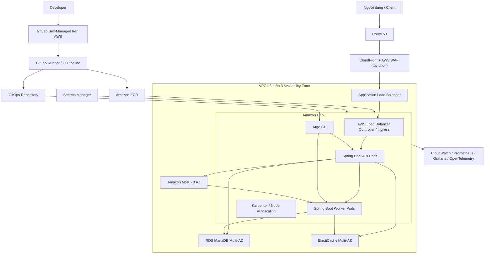
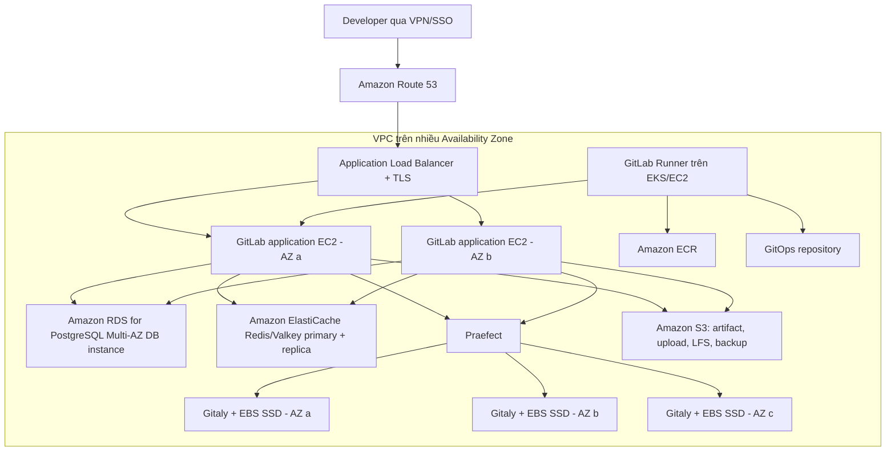

# Thực hành triển khai hệ thống Spring Boot trên AWS và Kubernetes như một dự án doanh nghiệp

> Phạm vi: dự án cỡ trung bình đến lớn sử dụng Spring Boot, MariaDB, Apache Kafka và Redis.  
> Mục tiêu: giúp người mới đi từng bước từ mã nguồn đến một hệ thống chạy thật trên AWS. Kiến trúc và quy trình trong tài liệu bám theo cách các đội Platform/DevOps thường làm ở doanh nghiệp, không chỉ dừng ở việc “deploy chạy được”.

### Cách đọc thuật ngữ trong tài liệu

Thuật ngữ được viết đầy đủ bằng tiếng Anh ở lần xuất hiện đầu tiên, sau đó mới dùng dạng viết tắt. Ví dụ:

```text
Amazon Elastic Kubernetes Service (Amazon EKS)
```

Trong đó:

- `Amazon Elastic Kubernetes Service` là tên đầy đủ của dịch vụ.
- `Amazon EKS` là tên viết tắt sẽ được dùng ở các phần sau.
- Phần giải thích ngay sau đó cho biết dịch vụ này dùng để làm gì trong hệ thống.

Một số từ như Pod, Deployment, Service hoặc Ingress là tên chính thức của tài nguyên Kubernetes nên được giữ nguyên tiếng Anh. Mỗi từ sẽ được giải thích bằng ngôn ngữ đơn giản khi sử dụng.

---

## 1. Kết quả cần đạt

Sau khi đi hết tài liệu, bạn cần hiểu và tự thực hiện được:

- Thiết kế hạ tầng Amazon Web Services (AWS – nền tảng điện toán đám mây của Amazon) có khả năng tiếp tục hoạt động khi một máy chủ hoặc một trung tâm dữ liệu gặp lỗi.
- Chạy các dịch vụ Spring Boot trên Amazon Elastic Kubernetes Service (Amazon EKS – dịch vụ Kubernetes do AWS quản lý).
- Chọn đúng nơi chạy MariaDB, Kafka và Redis.
- Tạo hạ tầng bằng Terraform thay vì tạo thủ công từng tài nguyên trên giao diện AWS.
- Triển khai GitLab Self-Managed trong AWS để lưu source code private và chạy pipeline bằng GitLab Runner.
- Đóng gói ứng dụng một lần thành container image, sau đó đưa đúng image đó qua `dev` (môi trường phát triển) → `staging` (môi trường kiểm thử gần giống thật) → `production` (môi trường phục vụ người dùng thật).
- Triển khai theo GitOps, nghĩa là cấu hình trong Git quyết định phiên bản nào được chạy trên Kubernetes.
- Quản lý secret (mật khẩu, token, khóa truy cập), quyền truy cập và mạng theo nguyên tắc chỉ cấp đúng quyền cần thiết.
- Thiết lập kiểm tra sức khỏe, tự động tăng giảm tài nguyên, log, số liệu giám sát, dấu vết request và cảnh báo.
- Sao lưu, phục hồi, quay lại phiên bản cũ và xử lý sự cố theo hướng dẫn có sẵn.

Tài liệu dùng region ví dụ là `ap-southeast-1` (Singapore). Khi làm thật phải chọn region dựa trên độ trễ, chi phí, quy định lưu trữ dữ liệu và khả năng cung cấp dịch vụ.

---

## 2. Trước khi triển khai, cần hiểu hệ thống production là gì

`Production` là môi trường thật, nơi người dùng thật đang sử dụng hệ thống. Một hệ thống production tốt không chỉ là hệ thống “đang chạy”. Nó còn phải trả lời được các câu hỏi sau:

1. Nếu một Pod chết, hệ thống có tự phục hồi không?
2. Nếu một máy chủ Amazon Elastic Compute Cloud (Amazon EC2) hoặc một Availability Zone (AZ – một khu vực trung tâm dữ liệu độc lập trong cùng AWS Region) gặp lỗi, người dùng có tiếp tục sử dụng được không?
3. Nếu lượng truy cập tăng gấp 5 lần, số Pod và máy chủ có tự tăng lên không?
4. Nếu phiên bản mới bị lỗi, có quay lại phiên bản cũ trong vài phút không?
5. Nếu database bị lỗi, có thể mất bao nhiêu dữ liệu và cần bao lâu để phục hồi?
6. Ai được triển khai lên production? Có biết ai đã thay đổi gì và vào lúc nào không?
7. Mật khẩu hoặc token có vô tình nằm trong Git, container image hoặc log không?
8. Khi hệ thống chậm, có xác định được lỗi nằm ở ứng dụng, MariaDB, Kafka, Redis, mạng hay máy chủ không?
9. Có thể nâng cấp Kubernetes, thay máy chủ và vá bảo mật mà không dừng hệ thống không?
10. Chi phí mỗi môi trường, mỗi team và mỗi service có đo được không?

### 2.1. Các khái niệm sẽ được dùng nhiều

| Tên đầy đủ | Tên ngắn | Giải thích dễ hiểu |
|---|---|---|
| High Availability | HA | Tính sẵn sàng cao: một thành phần hỏng nhưng hệ thống vẫn phục vụ được |
| Service Level Indicator | SLI | Chỉ số đo thực tế, ví dụ 99,95% request thành công |
| Service Level Objective | SLO | Mục tiêu nội bộ mà đội vận hành muốn đạt, ví dụ tỷ lệ thành công ít nhất 99,9% mỗi tháng |
| Service Level Agreement | SLA | Mức dịch vụ cam kết với khách hàng, thường đi kèm trách nhiệm nếu không đạt |
| Recovery Point Objective | RPO | Khi có sự cố, doanh nghiệp chấp nhận mất tối đa bao nhiêu dữ liệu; RPO 5 phút nghĩa là có thể mất dữ liệu của 5 phút gần nhất |
| Recovery Time Objective | RTO | Doanh nghiệp chấp nhận hệ thống ngừng tối đa bao lâu; RTO 60 phút nghĩa là phải phục hồi trong vòng 60 phút |
| Infrastructure as Code | IaC | Khai báo hạ tầng bằng mã nguồn để có thể review, chạy lại và biết lịch sử thay đổi |
| Continuous Integration | CI | Tích hợp liên tục: mỗi thay đổi mã nguồn được build, kiểm thử và kiểm tra tự động |
| Continuous Delivery/Deployment | CD | Đưa phiên bản đã kiểm tra tới các môi trường một cách tự động và có kiểm soát |
| Git Operations | GitOps | Lưu trạng thái mong muốn của hệ thống trong Git; công cụ triển khai đọc Git và làm cho môi trường chạy giống cấu hình đó |
| Immutable artifact | Không viết tắt | Gói đã tạo ra thì không sửa nữa; cùng một container image được dùng từ staging tới production |
| Mean Time to Recovery | MTTR | Thời gian trung bình để phục hồi dịch vụ sau sự cố |

Ví dụ mục tiêu ban đầu hợp lý cho một hệ thống cỡ trung bình:

- Service Level Objective (SLO) của Application Programming Interface (API – giao diện để các hệ thống gọi nhau): hoạt động thành công `99,9%` trong một tháng.
- Độ trễ phân vị 95 (P95 latency): 95% request đọc hoàn thành dưới `300 ms`.
- Recovery Point Objective (RPO) của MariaDB: chấp nhận mất tối đa `5 phút` dữ liệu.
- Recovery Time Objective (RTO) của MariaDB: phải phục hồi trong tối đa `60 phút`.
- Kafka consumer lag (số message đang chờ consumer xử lý): cảnh báo nếu tăng liên tục trong 10 phút.
- Production deploy: rollback được trong dưới `10 phút`.

Các con số trên là dữ liệu mẫu để thực hành. Trong dự án thật, Product Owner (người phụ trách yêu cầu sản phẩm), developer, Site Reliability Engineer (SRE – kỹ sư đảm bảo độ tin cậy), DevOps và phía nghiệp vụ phải thống nhất trước khi thiết kế.

### 2.2. Từ điển thuật ngữ dùng trong bài

Bạn không cần học thuộc bảng này trước. Khi gặp một chữ viết tắt ở phần sau, hãy quay lại đây để tra.

#### AWS và mạng

| Tên đầy đủ | Tên ngắn | Dùng để làm gì? |
|---|---|---|
| Amazon Web Services | AWS | Nền tảng cloud chứa toàn bộ hạ tầng của bài thực hành |
| AWS Region | Region | Một khu vực địa lý của AWS, ví dụ Singapore; mỗi Region có nhiều Availability Zone |
| Availability Zone | AZ | Một hoặc nhiều trung tâm dữ liệu độc lập trong cùng Region; trải hệ thống qua nhiều AZ để một nơi hỏng không làm dừng toàn bộ hệ thống |
| Virtual Private Cloud | VPC | Mạng riêng của dự án trên AWS |
| Classless Inter-Domain Routing | CIDR | Cách viết một dải địa chỉ IP, ví dụ `10.0.0.0/16` |
| Internet Protocol | IP | Địa chỉ mạng của máy, Pod hoặc dịch vụ |
| Domain Name System | DNS | Đổi tên miền như `api.example.com` thành địa chỉ hệ thống có thể kết nối |
| Network Address Translation | NAT | Cho máy trong private subnet đi ra Internet mà không nhận kết nối trực tiếp từ Internet |
| Transport Layer Security | TLS | Mã hóa dữ liệu khi truyền qua mạng; HTTPS là HTTP chạy qua TLS |
| Hypertext Transfer Protocol Secure | HTTPS | Giao thức web đã được mã hóa bằng TLS |
| Security Group | SG | Tường lửa cấp tài nguyên AWS, quy định nguồn nào được kết nối tới cổng nào |
| Elastic Network Interface | ENI | Card mạng ảo được gắn vào tài nguyên AWS |

#### Các dịch vụ AWS

| Tên đầy đủ | Tên ngắn | Dùng để làm gì? |
|---|---|---|
| Amazon Elastic Compute Cloud | Amazon EC2 | Máy chủ ảo; các worker node của EKS thường chạy trên EC2 |
| Amazon Elastic Kubernetes Service | Amazon EKS | Dịch vụ Kubernetes do AWS quản lý |
| Amazon Elastic Container Registry | Amazon ECR | Kho lưu container image |
| Amazon Relational Database Service | Amazon RDS | Dịch vụ database quan hệ do AWS quản lý |
| Amazon Managed Streaming for Apache Kafka | Amazon MSK | Dịch vụ Apache Kafka do AWS quản lý |
| Amazon Simple Storage Service | Amazon S3 | Dịch vụ lưu file/object có độ bền cao |
| Amazon Elastic Block Store | Amazon EBS | Ổ đĩa block gắn với máy EC2 hoặc Kubernetes Pod qua volume |
| Application Load Balancer | ALB | Nhận HTTP/HTTPS request và chuyển tới ứng dụng phù hợp |
| Web Application Firewall | AWS WAF | Lọc một số request web xấu trước khi request vào ứng dụng |
| Key Management Service | AWS KMS | Tạo và quản lý khóa dùng để mã hóa dữ liệu |
| Identity and Access Management | AWS IAM | Quản lý ai hoặc service nào được làm hành động gì trên AWS |
| AWS Certificate Manager | ACM | Cấp và quản lý chứng thư TLS cho tên miền |
| Security Token Service | AWS STS | Cấp thông tin đăng nhập tạm thời thay vì dùng access key cố định lâu dài |

#### Kubernetes

| Thuật ngữ | Giải thích dễ hiểu |
|---|---|
| Cluster | Một cụm Kubernetes gồm bộ phận điều khiển và các máy chạy ứng dụng |
| Node | Một máy chủ thuộc cluster, thường là máy EC2 trong bài này |
| Pod | Đơn vị chạy nhỏ nhất của Kubernetes; thường chứa một container Spring Boot chính |
| Deployment | Khai báo ứng dụng cần chạy bao nhiêu Pod và cập nhật Pod theo cách nào |
| Service | Tạo địa chỉ ổn định để các Pod hoặc service khác gọi một nhóm Pod |
| Ingress | Khai báo đường dẫn hoặc tên miền public sẽ được chuyển vào Service nào |
| Namespace | Cách chia tài nguyên trong một cluster theo team hoặc hệ thống |
| ConfigMap | Lưu cấu hình không nhạy cảm cho ứng dụng |
| Secret | Tài nguyên Kubernetes chứa dữ liệu nhạy cảm; vẫn phải kết hợp mã hóa và giới hạn quyền đọc |
| StatefulSet | Bộ điều khiển dành cho ứng dụng cần tên Pod và ổ đĩa ổn định, thường dùng cho hệ thống có trạng thái |
| Persistent Volume | PV | Ổ lưu trữ bền vững mà vòng đời không phụ thuộc hoàn toàn vào Pod |
| Persistent Volume Claim | PVC | Yêu cầu xin một Persistent Volume với dung lượng và loại ổ đĩa cụ thể |
| Container Storage Interface | CSI | Chuẩn để Kubernetes làm việc với hệ thống lưu trữ như Amazon EBS |
| Container Network Interface | CNI | Chuẩn plugin mạng; Amazon VPC CNI kết nối Pod với mạng VPC |
| Horizontal Pod Autoscaler | HPA | Tự tăng hoặc giảm số Pod theo CPU, RAM hoặc metric khác |
| Pod Disruption Budget | PDB | Giới hạn số Pod có thể bị dừng cùng lúc trong các hoạt động có kế hoạch như nâng cấp node |
| Role-Based Access Control | RBAC | Phân quyền trong Kubernetes dựa trên vai trò |
| Custom Resource Definition | CRD | Cách mở rộng Kubernetes bằng một loại tài nguyên mới |

#### Ứng dụng, dữ liệu và vận hành

| Tên đầy đủ | Tên ngắn | Ý nghĩa |
|---|---|---|
| Application Programming Interface | API | Giao diện để client hoặc service khác gọi ứng dụng |
| Java Virtual Machine | JVM | Máy ảo chạy ứng dụng Java/Spring Boot |
| Java Archive | JAR | File đóng gói ứng dụng Java |
| Structured Query Language | SQL | Ngôn ngữ đọc và thay đổi dữ liệu trong MariaDB |
| Time To Live | TTL | Thời gian dữ liệu cache được phép tồn tại trước khi tự hết hạn |
| Dead-Letter Topic | DLT | Kafka topic giữ message đã thử xử lý nhiều lần nhưng vẫn lỗi |
| Change Data Capture | CDC | Theo dõi thay đổi trong database và phát các thay đổi đó sang hệ thống khác |
| Personally Identifiable Information | PII | Dữ liệu có thể nhận diện một cá nhân, ví dụ số điện thoại hoặc căn cước |
| Disaster Recovery | DR | Kế hoạch phục hồi khi sự cố lớn làm mất cả hệ thống hoặc cả Region |
| Multi-Factor Authentication | MFA | Đăng nhập bằng từ hai yếu tố trở lên, ví dụ mật khẩu và mã từ thiết bị |
| Single Sign-On | SSO | Đăng nhập tập trung một lần để truy cập nhiều hệ thống |
| Software Bill of Materials | SBOM | Danh sách thư viện và thành phần có trong một bản build |
| Static Application Security Testing | SAST | Quét mã nguồn để tìm lỗi bảo mật mà không cần chạy ứng dụng |
| Software Composition Analysis | SCA | Kiểm tra thư viện bên thứ ba và lỗ hổng đã biết |

Khi một thuật ngữ xuất hiện trong câu lệnh hoặc file YAML, tên tiếng Anh được giữ nguyên để bạn có thể tìm đúng tài liệu chính thức và đọc đúng thông báo lỗi.

---

## 3. Kiến trúc sẽ dùng trong bài thực hành

### 3.1. Mỗi thành phần sẽ chạy ở đâu và vì sao?

Trong bài thực hành này, chúng ta không đặt mọi thứ vào Kubernetes. Mỗi thành phần được đặt ở nơi phù hợp với công việc của nó, giống cách nhiều hệ thống doanh nghiệp được tổ chức.

| Thành phần | Nơi chạy trong bài thực hành | Vai trò |
|---|---|---|
| Spring Boot | Amazon Elastic Kubernetes Service (Amazon EKS) | Chạy API và worker; Kubernetes tự khởi động lại, phân phối và tăng giảm số Pod |
| MariaDB | Amazon Relational Database Service for MariaDB (Amazon RDS for MariaDB) | Lưu dữ liệu nghiệp vụ lâu dài; AWS hỗ trợ backup, thay máy lỗi và chuyển đổi máy chính |
| Apache Kafka | Amazon Managed Streaming for Apache Kafka (Amazon MSK) | Truyền event giữa các dịch vụ; AWS quản lý broker và hạ tầng Kafka |
| Redis/Valkey | Amazon ElastiCache | Lưu cache trong bộ nhớ để đọc nhanh; AWS quản lý node, replica và failover |
| Container image | Amazon Elastic Container Registry (Amazon ECR) | Kho lưu container image do CI tạo ra |
| Mật khẩu và token | AWS Secrets Manager | Lưu, mã hóa và hỗ trợ thay đổi secret mà không ghi secret vào Git |
| Điểm vào public | Amazon Route 53 → Amazon CloudFront/AWS WAF → Application Load Balancer | Nhận tên miền, lọc request xấu và chuyển request vào ứng dụng |
| File/object | Amazon Simple Storage Service (Amazon S3) | Lưu file bền vững, không phụ thuộc vòng đời của Pod |

#### Vì sao Spring Boot chạy trong Amazon EKS?

Spring Boot API và worker có thể được thiết kế theo kiểu `stateless`, nghĩa là Pod không giữ dữ liệu quan trọng chỉ tồn tại trên ổ đĩa của chính Pod đó. Khi một Pod chết, Kubernetes tạo Pod mới và request tiếp theo vẫn có thể được xử lý.

Amazon EKS đảm nhiệm phần Kubernetes control plane (bộ phận điều khiển cluster). Đội DevOps tập trung vào:

- Cấu hình số Pod và tài nguyên CPU/RAM.
- Triển khai phiên bản mới.
- Tự động tăng giảm số Pod.
- Phân tán Pod qua nhiều máy chủ và nhiều Availability Zone.
- Giám sát, phân quyền và xử lý sự cố.

Đây là phần thực hành chính của tài liệu.

#### Vì sao MariaDB chạy trên Amazon RDS thay vì trong một Pod?

MariaDB giữ dữ liệu nghiệp vụ như đơn hàng, tài khoản hoặc giao dịch. Dữ liệu này phải còn nguyên ngay cả khi Pod hoặc máy chủ bị xóa.

Nếu tự chạy MariaDB trong Kubernetes, đội vận hành phải tự xử lý:

- Persistent Volume (PV – ổ đĩa bền vững gắn với Pod).
- Replication (sao chép dữ liệu sang máy khác).
- Chọn máy chính mới khi máy chính hỏng.
- Backup, restore và kiểm tra backup có dùng được hay không.
- Nâng phiên bản MariaDB mà không làm hỏng dữ liệu.
- Theo dõi query chậm, dung lượng ổ đĩa và kết nối.

Trong kiến trúc thực hành, Amazon RDS for MariaDB chạy theo chế độ Multi-Availability Zone (Multi-AZ – có bản dự phòng ở Availability Zone khác). Khi máy database chính có vấn đề, RDS thực hiện failover, nghĩa là chuyển vai trò database chính sang máy dự phòng.

Bạn vẫn phải học cấu hình connection pool, migration, backup, restore, cảnh báo và xử lý failover. AWS chỉ quản lý phần hạ tầng database; AWS không sửa thiết kế bảng hoặc câu SQL kém hiệu quả cho bạn.

#### Vì sao Kafka chạy trên Amazon MSK?

Kafka không phải chỉ là một process nhận và gửi message. Một Kafka cluster production có nhiều broker, topic, partition và replica. Hệ thống còn phải giữ được quorum, tức là đủ số broker đồng thuận để tiếp tục hoạt động an toàn.

Nếu tự chạy Kafka trên Kubernetes, đội vận hành phải hiểu sâu về:

- Gắn và phục hồi ổ đĩa cho từng broker.
- Phân tán broker qua nhiều Availability Zone.
- Replication factor (số bản sao của dữ liệu).
- Rebalance partition khi broker thay đổi.
- Nâng cấp broker, vá lỗi và thay máy.
- Theo dõi consumer lag, partition lỗi và dung lượng đĩa.

Amazon Managed Streaming for Apache Kafka (Amazon MSK) quản lý phần broker và hạ tầng. Trong bài thực hành, bạn tập trung vào những việc đội ứng dụng và DevOps vẫn phải làm: tạo topic, chọn số partition, cấu hình producer/consumer, bảo mật kết nối, theo dõi consumer lag và xử lý message lỗi.

#### Vì sao Redis/Valkey chạy trên Amazon ElastiCache?

Redis hoặc Valkey thường giữ dữ liệu tạm trong RAM để truy cập rất nhanh. Ví dụ: cache kết quả đọc từ MariaDB, session hoặc dữ liệu rate limit.

Một node Redis đơn có thể mất toàn bộ cache khi máy hỏng. Amazon ElastiCache cho phép tạo primary node (node chính), replica (node sao chép) và automatic failover (tự chuyển sang replica khi primary lỗi). Bạn vẫn phải quyết định thời gian sống của cache, cách xóa cache, cách tránh hot key và cách để ứng dụng hoạt động khi cache tạm thời không truy cập được.

#### Vì sao không lưu file trong Pod?

Pod có thể bị xóa và tạo lại trên một máy chủ khác. File ghi trong filesystem của container có thể biến mất theo Pod. Vì vậy ảnh, hóa đơn, file import/export hoặc tài liệu người dùng được lưu trong Amazon Simple Storage Service (Amazon S3), còn Pod chỉ xử lý và trả đường dẫn hoặc mã định danh của file.

#### Đây có phải là né tránh việc học vận hành dữ liệu không?

Không. Đây là cách chia trách nhiệm thường gặp trong doanh nghiệp:

```text
AWS quản lý phần cứng và một phần vòng đời dịch vụ managed
Đội Platform/DevOps quản lý cấu hình, bảo mật, capacity, backup policy và monitoring
Đội phát triển quản lý schema, query, event, cache và hành vi ứng dụng
```

Bạn vẫn thực hành kết nối, bảo mật, scale, backup/restore, failover và quan sát cả MariaDB, Kafka lẫn Redis. Điểm khác là bài thực hành dùng dịch vụ managed đúng như kiến trúc doanh nghiệp, thay vì dành phần lớn thời gian để sửa ổ đĩa hoặc dựng lại broker bằng tay.

Ở công ty tự vận hành Kafka, MariaDB hoặc Redis trên Kubernetes, thường sẽ có đội Database Administrator (DBA – quản trị cơ sở dữ liệu) hoặc Platform/SRE chuyên trách, dùng operator và runbook riêng. Đó là một nhánh chuyên sâu khác, không phải kiến trúc được triển khai trong tài liệu này.

Lý do chính: database và broker có bài toán riêng về replication, quorum, backup, failover, patch, nâng cấp, storage và data recovery. Tự chạy trên Kubernetes có thể làm được, nhưng đòi hỏi đội ngũ có kinh nghiệm sâu và trực vận hành 24/7.

### 3.2. Sơ đồ tổng thể



### 3.3. Luồng một request

```text
Client
  → DNS Route 53
  → CloudFront/WAF (nếu dùng)
  → ALB HTTPS
  → Kubernetes Ingress
  → Service (ClusterIP)
  → Spring Boot Pod
      → RDS MariaDB cho dữ liệu bền vững
      → ElastiCache cho cache/session/rate limit
      → MSK để publish event bất đồng bộ
  → Response
```

---

## 4. Thiết kế tài khoản và môi trường AWS

### 4.1. Không đặt mọi thứ vào một AWS account

Mô hình tối thiểu:

```text
AWS Organization
├── management        # billing, Organization; không chạy workload
├── security          # Security Hub, GuardDuty, audit
├── log-archive       # CloudTrail và log tập trung
├── shared-services   # CI runner, artifact, DNS hoặc tooling chung
├── non-production    # dev, test, staging
└── production        # production được cô lập
```

Với tổ chức lớn hơn, có thể tách thêm account theo business unit hoặc workload. Production nên là account riêng để giảm blast radius và tách quyền rõ ràng.

### 4.2. Tách cluster như thế nào?

Khuyến nghị khởi đầu:

- Một EKS cluster cho `dev/test`.
- Một EKS cluster cho `staging` nếu staging cần giống production.
- Một EKS cluster riêng cho `production`.

Không dùng namespace như ranh giới bảo mật duy nhất giữa production và non-production. Cluster dùng chung tiết kiệm tiền nhưng tăng blast radius, cạnh tranh tài nguyên và độ phức tạp phân quyền.

### 4.3. Quy ước đặt tên và tag

Ví dụ:

```text
acme-prod-eks
acme-prod-orders-db
acme-prod-streaming-msk
acme-prod-cache
```

Tag tối thiểu:

```hcl
tags = {
  Environment = "production"
  Project     = "commerce-platform"
  Owner       = "platform-team"
  CostCenter  = "CC-1024"
  ManagedBy   = "terraform"
  DataClass   = "confidential"
}
```

---

## 5. Thiết kế mạng VPC

### 5.1. Bố trí subnet

Dùng ít nhất 3 AZ nếu region và ngân sách cho phép:

```text
VPC 10.0.0.0/16
├── Public subnet AZ-a   # ALB, NAT Gateway
├── Public subnet AZ-b
├── Public subnet AZ-c
├── Private app AZ-a     # EKS worker nodes/pods
├── Private app AZ-b
├── Private app AZ-c
├── Isolated data AZ-a   # RDS, MSK, ElastiCache
├── Isolated data AZ-b
└── Isolated data AZ-c
```

- Pod và node application không cần public IP.
- RDS, MSK và Redis không public.
- Chỉ ALB internet-facing nằm ở public subnet.
- Security Group chỉ mở đúng luồng cần thiết.
- Dùng VPC endpoints cho ECR API, ECR DKR, S3, CloudWatch, STS và Secrets Manager khi phù hợp để giảm phụ thuộc NAT và tăng tính riêng tư.

### 5.2. Lưu ý IP

Amazon VPC CNI cấp IP VPC cho Pod. Phải tính CIDR đủ lớn dựa trên:

```text
Số Pod cực đại
+ số node cực đại
+ Load Balancer/ENI
+ tăng trưởng 12–24 tháng
+ phần dự phòng
```

Thiếu IP là một lỗi scale rất thường gặp. Không chọn CIDR nhỏ chỉ vì môi trường hiện tại có ít Pod. Cân nhắc prefix delegation, secondary CIDR hoặc IPv6 khi quy mô lớn.

### 5.3. Ma trận network tối thiểu

| Nguồn | Đích | Cổng | Ghi chú |
|---|---|---:|---|
| Internet | ALB | 443 | TLS public |
| ALB | Spring Boot target | app port | Chỉ từ SG của ALB |
| Spring Boot | RDS MariaDB | 3306 | Chỉ SG application |
| Spring Boot | MSK | theo chế độ TLS/SASL | Không public broker |
| Spring Boot | ElastiCache | 6379 hoặc cấu hình TLS | Bắt buộc mã hóa khi có thể |
| Pod | AWS APIs | 443 | Qua VPC endpoint hoặc NAT |

---

## 6. Infrastructure as Code với Terraform

### 6.1. Cấu trúc repository

```text
infrastructure/
├── modules/
│   ├── vpc/
│   ├── eks/
│   ├── rds-mariadb/
│   ├── msk/
│   ├── elasticache/
│   ├── observability/
│   └── security/
├── environments/
│   ├── dev/
│   ├── staging/
│   └── production/
└── README.md
```

Không biến module thành một “siêu module” chứa toàn bộ công ty. Module nên có trách nhiệm rõ, version rõ và output đủ dùng.

### 6.2. Terraform state

- Lưu remote state trên S3.
- Bật versioning và encryption bằng KMS.
- Khóa state theo cơ chế backend được Terraform/AWS hỗ trợ tại thời điểm triển khai.
- Tách state theo môi trường và theo miền tài nguyên để giảm blast radius.
- CI role chỉ được truy cập state nó cần.
- Không commit `.tfstate`, plan chứa secret hoặc file biến nhạy cảm.

Ví dụ tách state:

```text
prod/network/terraform.tfstate
prod/eks/terraform.tfstate
prod/data/terraform.tfstate
prod/observability/terraform.tfstate
```

### 6.3. Pipeline IaC

```text
Pull request
  → terraform fmt -check
  → terraform validate
  → lint/security scan
  → terraform plan
  → người có thẩm quyền review
Merge protected branch
  → manual approval cho production
  → terraform apply đúng plan đã duyệt
  → lưu audit log
```

Không chạy `terraform apply` production từ laptop cá nhân trừ tình huống break-glass có quy trình và audit.

---

## 7. Xây dựng Amazon EKS

### 7.1. Các thành phần nền tảng

Một cluster production thường cần:

- VPC CNI, CoreDNS, kube-proxy hoặc thành phần tương đương được EKS quản lý.
- EBS CSI Driver cho persistent volume khi thực sự cần.
- AWS Load Balancer Controller.
- ExternalDNS để đồng bộ DNS nếu tổ chức cho phép.
- External Secrets Operator hoặc Secrets Store CSI Driver.
- Metrics Server.
- Karpenter hoặc Cluster Autoscaler.
- Argo CD.
- Fluent Bit/OpenTelemetry Collector/Prometheus agent.
- Kyverno hoặc OPA Gatekeeper để thực thi policy.

Không cài add-on mà không xác định owner, version, quy trình upgrade và dashboard/alert của nó.

### 7.2. Node pool

Tách workload theo đặc tính:

```text
system-on-demand   # CoreDNS, controller, Argo CD; ổn định
app-on-demand      # API quan trọng
app-spot           # worker chịu được gián đoạn
memory-optimized   # workload JVM cần nhiều RAM nếu có
```

Nguyên tắc:

- System workload không nên phụ thuộc hoàn toàn vào Spot.
- Spot chỉ dùng cho workload retry được, có nhiều replica và xử lý termination đúng.
- Dùng taint/toleration và node affinity có chủ đích.
- Đa dạng instance type để autoscaler dễ tìm capacity.
- Phân tán replica qua nhiều node và AZ.

### 7.3. Namespace và quota

Ví dụ:

```text
platform-system
observability
argocd
commerce
payment
identity
```

Mỗi namespace ứng dụng nên có:

- `ResourceQuota`.
- `LimitRange`.
- RBAC theo team.
- NetworkPolicy default-deny và các rule allow cần thiết.
- Pod Security Admission phù hợp.
- Ownership label và cost label.

### 7.4. IAM cho Pod

Không đặt AWS access key tĩnh trong Kubernetes Secret. Dùng EKS Pod Identity hoặc IRSA tùy tiêu chuẩn nền tảng hiện tại.

```text
ServiceAccount orders-api
  → IAM role chỉ cho phép
      secretsmanager:GetSecretValue trên secret của orders
      s3:GetObject trên đúng bucket/prefix
      kms:Decrypt trên đúng KMS key
```

Mỗi service hoặc nhóm service có quyền giống nhau nên có role riêng. Tránh một role dùng chung có `s3:*`, `secretsmanager:*` hoặc quyền trên `*`.

---

## 8. Đóng gói Spring Boot đúng chuẩn container

### 8.1. Dockerfile mẫu

```dockerfile
FROM eclipse-temurin:21-jre

RUN addgroup --system spring && adduser --system --ingroup spring spring
WORKDIR /app

COPY --chown=spring:spring target/app.jar /app/app.jar

USER spring:spring
EXPOSE 8080

ENV JAVA_TOOL_OPTIONS="-XX:MaxRAMPercentage=75.0 -XX:+ExitOnOutOfMemoryError"
ENTRYPOINT ["java", "-jar", "/app/app.jar"]
```

Yêu cầu production:

- Base image nhỏ, có nguồn tin cậy và được scan.
- Pin image bằng digest trong môi trường cần kiểm soát cao.
- Không chạy root.
- Không nhúng credential vào image hoặc `ENV` trong Dockerfile.
- Ghi log ra stdout/stderr, không ghi file log cục bộ.
- Image chứa đúng một application process.
- Build có SBOM và ký image nếu quy trình bảo mật yêu cầu.

Có thể dùng multi-stage build, nhưng pipeline Maven riêng rồi chỉ copy JAR vào runtime image thường dễ tách trách nhiệm và cache hơn.

### 8.2. Spring Boot Actuator

Dependency:

```xml
<dependency>
    <groupId>org.springframework.boot</groupId>
    <artifactId>spring-boot-starter-actuator</artifactId>
</dependency>
```

Ví dụ cấu hình:

```yaml
management:
  endpoints:
    web:
      exposure:
        include: health,info,prometheus
  endpoint:
    health:
      probes:
        enabled: true
      show-details: never
  health:
    livenessstate:
      enabled: true
    readinessstate:
      enabled: true
```

Không public toàn bộ actuator endpoint ra Internet. Endpoint quản trị nên đi qua port/path nội bộ, NetworkPolicy và authentication phù hợp.

### 8.3. Health check đúng nghĩa

- **Startup probe:** JVM/application đã khởi động xong chưa.
- **Readiness probe:** Pod có sẵn sàng nhận traffic không.
- **Liveness probe:** process có bị kẹt và cần restart không.

Không nên cho liveness phụ thuộc trực tiếp vào MariaDB/Kafka/Redis. Nếu database chập chờn mà mọi Pod cùng fail liveness, Kubernetes restart toàn bộ ứng dụng và làm sự cố nặng hơn.

---

## 9. Kubernetes manifest/Helm cho Spring Boot

### 9.1. Deployment mẫu

```yaml
apiVersion: apps/v1
kind: Deployment
metadata:
  name: orders-api
  labels:
    app.kubernetes.io/name: orders-api
spec:
  replicas: 3
  revisionHistoryLimit: 5
  strategy:
    type: RollingUpdate
    rollingUpdate:
      maxUnavailable: 0
      maxSurge: 1
  selector:
    matchLabels:
      app.kubernetes.io/name: orders-api
  template:
    metadata:
      labels:
        app.kubernetes.io/name: orders-api
        app.kubernetes.io/part-of: commerce
    spec:
      serviceAccountName: orders-api
      terminationGracePeriodSeconds: 45
      securityContext:
        runAsNonRoot: true
        seccompProfile:
          type: RuntimeDefault
      topologySpreadConstraints:
        - maxSkew: 1
          topologyKey: topology.kubernetes.io/zone
          whenUnsatisfiable: DoNotSchedule
          labelSelector:
            matchLabels:
              app.kubernetes.io/name: orders-api
      containers:
        - name: application
          image: ACCOUNT.dkr.ecr.ap-southeast-1.amazonaws.com/orders-api:1.4.2
          imagePullPolicy: IfNotPresent
          ports:
            - name: http
              containerPort: 8080
          envFrom:
            - configMapRef:
                name: orders-api
            - secretRef:
                name: orders-api-runtime
          startupProbe:
            httpGet:
              path: /actuator/health/readiness
              port: http
            periodSeconds: 5
            failureThreshold: 30
          readinessProbe:
            httpGet:
              path: /actuator/health/readiness
              port: http
            periodSeconds: 5
            failureThreshold: 3
          livenessProbe:
            httpGet:
              path: /actuator/health/liveness
              port: http
            periodSeconds: 10
            failureThreshold: 3
          lifecycle:
            preStop:
              exec:
                command: ["sh", "-c", "sleep 10"]
          resources:
            requests:
              cpu: 500m
              memory: 768Mi
            limits:
              memory: 1024Mi
          securityContext:
            allowPrivilegeEscalation: false
            readOnlyRootFilesystem: true
            capabilities:
              drop: ["ALL"]
```

CPU limit có thể gây throttling khó đoán đối với JVM. Nhiều đội đặt CPU request nhưng không đặt CPU limit, đồng thời bắt buộc memory limit. Đây là quyết định phải test tải và tuân theo policy của tổ chức, không phải công thức áp dụng cho mọi hệ thống.

### 9.2. Service, PDB và HPA

```yaml
apiVersion: v1
kind: Service
metadata:
  name: orders-api
spec:
  type: ClusterIP
  selector:
    app.kubernetes.io/name: orders-api
  ports:
    - name: http
      port: 80
      targetPort: http
---
apiVersion: policy/v1
kind: PodDisruptionBudget
metadata:
  name: orders-api
spec:
  minAvailable: 2
  selector:
    matchLabels:
      app.kubernetes.io/name: orders-api
---
apiVersion: autoscaling/v2
kind: HorizontalPodAutoscaler
metadata:
  name: orders-api
spec:
  scaleTargetRef:
    apiVersion: apps/v1
    kind: Deployment
    name: orders-api
  minReplicas: 3
  maxReplicas: 20
  behavior:
    scaleDown:
      stabilizationWindowSeconds: 300
    scaleUp:
      stabilizationWindowSeconds: 30
  metrics:
    - type: Resource
      resource:
        name: cpu
        target:
          type: Utilization
          averageUtilization: 65
```

PDB chỉ hạn chế một số gián đoạn tự nguyện như drain node; nó không bảo vệ khỏi node crash hoặc việc xóa trực tiếp Deployment. HPA cũng không tạo thêm node: cần node autoscaler để cấp compute khi Pod không schedule được.

Đối với Kafka consumer, CPU thường không phải metric scale tốt nhất. Nên cân nhắc KEDA hoặc custom metric dựa trên consumer lag, nhưng phải giới hạn replica theo số partition có thể xử lý song song.

### 9.3. Graceful shutdown

```yaml
server:
  shutdown: graceful
spring:
  lifecycle:
    timeout-per-shutdown-phase: 30s
```

Khi rollout:

1. Pod bị đánh dấu terminating.
2. Endpoint được loại khỏi luồng traffic.
3. `preStop` tạo khoảng thời gian để load balancer/service cập nhật.
4. Spring Boot hoàn thành request đang xử lý.
5. Process thoát trước `terminationGracePeriodSeconds`.

Phải kiểm thử thực tế vì ALB deregistration delay, keep-alive và thời gian xử lý request ảnh hưởng đến zero-downtime.

---

## 10. MariaDB trên Amazon RDS

### 10.1. Cấu hình production cơ bản

- RDS for MariaDB Multi-AZ.
- DB subnet group trong isolated data subnet ở nhiều AZ.
- Không public access.
- Mã hóa KMS at rest và TLS in transit.
- Automated backup, retention theo chính sách dữ liệu.
- Bật Performance Insights/Enhanced Monitoring phù hợp.
- CloudWatch alarm cho CPU, memory, storage, connections, latency và replication lag nếu có.
- Deletion protection cho production.
- Snapshot trước migration rủi ro cao.

Multi-AZ dùng cho HA/failover, không dùng standby để scale truy vấn đọc. Nếu cần scale read, tạo read replica riêng. Ứng dụng vẫn phải retry kết nối có backoff vì failover không đồng nghĩa mọi connection sống xuyên suốt.

### 10.2. Connection pool và số connection

Giả sử:

```text
20 Pod × Hikari maximumPoolSize 20 = tối đa 400 connection
```

Nếu database chỉ chịu được khoảng 300 connection thì autoscaling application có thể làm database sập nhanh hơn. Cần đặt ngân sách connection:

```text
DB connection budget
  = max_connections
  - connection cho vận hành/migration
  - safety margin

Pool tối đa mỗi Pod
  <= connection budget / số Pod cực đại
```

Ví dụ cấu hình:

```yaml
spring:
  datasource:
    hikari:
      minimum-idle: 2
      maximum-pool-size: 10
      connection-timeout: 3000
      validation-timeout: 1000
      max-lifetime: 840000
```

Các số trên chỉ là điểm bắt đầu; phải load test. Có thể đánh giá RDS Proxy nếu đặc tính workload và engine/version hỗ trợ phù hợp.

### 10.3. Migration schema

Dùng Flyway hoặc Liquibase, nhưng không để mọi replica cùng tùy tiện migration production.

Quy trình an toàn:

```text
Backup/snapshot
  → chạy migration Job riêng
  → migration backward-compatible
  → deploy application mới
  → theo dõi
  → cleanup schema cũ ở release sau
```

Áp dụng mô hình expand/contract:

1. Thêm cột/table mới, chưa xóa cái cũ.
2. Deploy code đọc/ghi tương thích cả hai phiên bản.
3. Backfill nếu cần.
4. Chuyển hoàn toàn sang schema mới.
5. Release sau mới xóa schema cũ.

Tránh đổi tên/xóa cột trong cùng release mà code cũ vẫn đang chạy trong rolling update.

### 10.4. Backup chưa đủ, phải thử restore

- Kiểm tra automated backup và snapshot lifecycle.
- Copy snapshot sang account/region khác nếu RPO/DR yêu cầu.
- Mã hóa và kiểm soát quyền truy cập snapshot.
- Diễn tập restore định kỳ vào môi trường cô lập.
- Đo thời gian restore thực tế để xác nhận RTO.
- Kiểm tra tính toàn vẹn và khả năng application kết nối sau restore.

---

## 11. Kafka trên Amazon MSK

### 11.1. Thiết kế cluster

Với workload ổn định và cần kiểm soát sâu, MSK Provisioned thường dễ dự báo. MSK Serverless phù hợp một số workload biến động nhưng cần đánh giá giới hạn, chi phí và tính năng tại thời điểm thiết kế.

Khuyến nghị ban đầu:

- Broker phân tán trên 3 AZ.
- TLS in transit, encryption at rest.
- Dùng IAM/SASL hoặc cơ chế xác thực được tổ chức chuẩn hóa.
- Broker nằm private subnet.
- Replication factor thường là 3 cho topic quan trọng.
- `min.insync.replicas` thường là 2 và producer dùng `acks=all` cho dữ liệu quan trọng.
- Theo dõi dung lượng đĩa, under-replicated partition, offline partition, request latency và consumer lag.

Không tạo quá nhiều partition “để dành”. Partition tăng song song nhưng cũng tăng metadata, file handle, recovery time và chi phí vận hành.

### 11.2. Producer Spring Boot

```yaml
spring:
  kafka:
    bootstrap-servers: ${KAFKA_BOOTSTRAP_SERVERS}
    producer:
      acks: all
      properties:
        enable.idempotence: true
        delivery.timeout.ms: 120000
        request.timeout.ms: 30000
    consumer:
      enable-auto-commit: false
      properties:
        isolation.level: read_committed
```

Idempotent producer giúp giảm bản ghi trùng do retry trong một số tình huống, nhưng không tự biến toàn bộ business flow thành exactly-once.

### 11.3. Outbox pattern

Lỗi kinh điển:

```text
INSERT order thành công
→ publish Kafka thất bại
→ database có order nhưng downstream không nhận event
```

Giải pháp outbox:

```text
Cùng một transaction MariaDB:
  INSERT orders
  INSERT outbox_events

Outbox publisher / CDC:
  đọc outbox
  → publish Kafka
  → đánh dấu đã xử lý
```

Consumer vẫn phải idempotent vì Kafka thường được thiết kế theo at-least-once ở cấp ứng dụng:

- Mỗi event có `eventId` duy nhất.
- Lưu processed event hoặc dùng unique constraint.
- Handler gọi lại không tạo tác dụng phụ lần hai.
- Có retry topic và dead-letter topic.
- Alert khi DLT có message hoặc consumer lag tăng.

### 11.4. Quy ước event

Envelope gợi ý:

```json
{
  "eventId": "01J...",
  "eventType": "OrderCreated",
  "eventVersion": 2,
  "occurredAt": "2026-07-15T08:30:00Z",
  "producer": "orders-service",
  "traceId": "...",
  "data": {}
}
```

- Event schema có version.
- Ưu tiên backward compatibility.
- Dùng Schema Registry nếu số team/topic lớn.
- Không chứa secret hoặc dữ liệu cá nhân không cần thiết trong event.
- Xác định retention theo business và chi phí.

---

## 12. Redis/Valkey trên Amazon ElastiCache

### 12.1. Vai trò hợp lý

- Cache dữ liệu đọc nhiều.
- Distributed session nếu thực sự cần stateful session.
- Rate limit hoặc distributed lock sau khi đánh giá semantics.
- Dữ liệu tạm có thể tái tạo.

Không coi Redis là database bền vững mặc định cho dữ liệu business quan trọng.

### 12.2. Cấu hình production

- Replication group có primary và replica ở nhiều AZ.
- Automatic failover/Multi-AZ.
- Encryption at rest và in transit.
- Authentication/ACL theo khả năng engine.
- Private subnet và Security Group chặt chẽ.
- Alert memory, CPU, evictions, connection, replication lag.
- Chọn eviction policy phù hợp.

### 12.3. Cache-aside

```text
GET request
  → đọc Redis
  → cache hit: trả dữ liệu
  → cache miss: đọc MariaDB
      → ghi Redis với TTL + jitter
      → trả dữ liệu
```

Các vấn đề cần xử lý:

- Cache stampede: lock ngắn, request coalescing hoặc refresh sớm.
- Cache penetration: negative cache có TTL ngắn.
- Hot key: chia key hoặc local cache tùy bài toán.
- Stale data: invalidate khi write hoặc chấp nhận eventual consistency rõ ràng.
- Redis down: application có fallback về DB nhưng phải rate limit để không đánh sập DB.

TTL nên có jitter để hàng loạt key không hết hạn cùng lúc:

```text
TTL thực = TTL cơ sở + random(0..N giây)
```

---

## 13. Quản lý cấu hình và secret

### 13.1. Phân loại

| Loại | Ví dụ | Nơi lưu |
|---|---|---|
| Cấu hình không nhạy cảm | timeout, feature flag mặc định | Helm values/ConfigMap |
| Secret runtime | DB password, API credential | Secrets Manager |
| Chứng thư/khóa | TLS private key | ACM/Secrets Manager/KMS tùy loại |
| Image config | port mặc định | image/application defaults |

Luồng đề xuất:

```text
Secrets Manager
  → External Secrets Operator
  → Kubernetes Secret tạm thời
  → Pod mount/env
```

Yêu cầu:

- Kubernetes etcd encryption bằng KMS.
- RBAC hạn chế người đọc Secret.
- Không log giá trị secret.
- Secret rotation có runbook và được kiểm thử.
- Git history phải được coi là đã lộ nếu từng commit secret; xóa commit không thay thế việc rotate.

---

## 14. Triển khai GitLab Self-Managed trên AWS

### 14.1. GitLab trong hệ thống này dùng để làm gì?

`GitLab Self-Managed` là GitLab do chính doanh nghiệp cài đặt và vận hành trong AWS account của mình. Source code, lịch sử commit, pipeline và artifact không nằm trong repository public.

GitLab đảm nhiệm:

- Lưu source code trong private repository.
- Quản lý user, group và quyền truy cập.
- Tạo Merge Request (MR – yêu cầu hợp nhất code) để review trước khi vào nhánh chính.
- Kích hoạt Continuous Integration (CI – build và kiểm thử tự động).
- Lưu kết quả pipeline, artifact và báo cáo kiểm tra.
- Gửi công việc build tới GitLab Runner.

GitLab không trực tiếp chạy ứng dụng production. Luồng triển khai của bài thực hành là:

```text
Developer
  → GitLab Self-Managed trên AWS
  → GitLab Runner build và test
  → đẩy container image lên Amazon ECR
  → cập nhật GitOps repository
  → Argo CD đọc GitOps repository
  → triển khai Spring Boot lên Amazon EKS
```

### 14.2. Vì sao GitLab không phải một container thông thường?

Một hệ thống GitLab gồm nhiều thành phần:

| Thành phần | Công việc |
|---|---|
| GitLab Rails/Puma | Xử lý giao diện web và API |
| GitLab Workhorse | Xử lý request, upload/download file và hỗ trợ Rails |
| Sidekiq | Chạy công việc nền như gửi email, xử lý hook và pipeline |
| PostgreSQL | Lưu user, project, permission, issue, pipeline và metadata |
| Redis/Valkey | Lưu session, cache, queue và trạng thái tạm thời |
| Gitaly | Đọc và ghi nội dung Git repository |
| Praefect | Điều phối nhiều Gitaly node trong mô hình High Availability |
| Object storage | Lưu artifact, upload, Large File Storage và backup |
| GitLab Runner | Nhận job CI và chạy build/test |

Nếu GitLab ngừng hoạt động, developer có thể không push code, review hoặc chạy pipeline được. Vì vậy GitLab cần backup, monitoring, upgrade plan và Disaster Recovery giống một hệ thống production khác.

### 14.3. Kiến trúc GitLab production trên AWS

Với dự án cỡ trung bình đến lớn, bài này dùng kiến trúc tách phần xử lý và phần dữ liệu:



Vai trò từng dịch vụ AWS:

| Dữ liệu/thành phần GitLab | Nơi chạy | Lý do |
|---|---|---|
| GitLab application | Amazon EC2 hoặc EKS theo kiến trúc đã chọn | Chạy web, API và background worker |
| PostgreSQL chính của GitLab | Amazon RDS for PostgreSQL Multi-AZ DB instance | Tách database khỏi application và có cơ chế failover |
| Redis/Valkey | Amazon ElastiCache, chế độ primary và replica | Lưu session, cache và background queue |
| Git repository | Gitaly trên EC2 với Amazon EBS SSD | Git repository cần storage có độ trễ thấp và hiệu năng I/O ổn định |
| Artifact, upload, LFS | Amazon S3 | File object không cần nằm trên ổ đĩa application node |
| Certificate | AWS Certificate Manager (ACM) | Quản lý chứng thư TLS cho Load Balancer |
| DNS | Amazon Route 53 | Tạo tên miền như `gitlab.company.internal` |
| Secret | AWS Secrets Manager | Lưu database password, token và secret cấu hình |
| Build agent | GitLab Runner trên EKS hoặc EC2 Auto Scaling | Tách tài nguyên build khỏi GitLab application |

Không dùng Amazon Aurora cho database GitLab. Tài liệu reference architecture hiện tại của GitLab ghi Amazon Aurora không tương thích; Amazon RDS Multi-AZ DB cluster cũng chưa được kiểm chứng cho GitLab. Mô hình sử dụng `Amazon RDS Multi-AZ DB instance` là sản phẩm khác và được hỗ trợ. Luôn kiểm tra lại compatibility matrix của đúng GitLab version trước khi dựng.

### 14.4. Chọn EC2 hay EKS để chạy GitLab application?

Có hai cách chính trên AWS.

#### Cách A – GitLab Linux package trên Amazon EC2

```text
Amazon EC2
  → cài GitLab bằng Linux package chính thức
  → kết nối PostgreSQL, Redis và S3 bên ngoài
```

Đây là cách dễ hiểu và trưởng thành hơn cho người mới vận hành GitLab. GitLab cũng mô tả Linux package là phương thức cài đặt trưởng thành và có khả năng mở rộng.

Phù hợp khi:

- Đội vận hành quen Linux và Amazon EC2.
- Không có yêu cầu GitLab phải chạy trên Kubernetes.
- Muốn việc debug và upgrade ít lớp hơn.
- Quy mô chưa cần Cloud Native Hybrid.

#### Cách B – GitLab Cloud Native Hybrid trên Amazon EKS

```text
Amazon EKS
  → GitLab web/API/Sidekiq chạy trong Pod

Bên ngoài EKS
  → PostgreSQL
  → Redis/Valkey
  → object storage
  → Gitaly và các thành phần stateful theo reference architecture
```

Tên `Cloud Native Hybrid` có nghĩa là một phần GitLab chạy trên Kubernetes, nhưng các thành phần giữ trạng thái quan trọng vẫn nằm ngoài cluster. GitLab yêu cầu external PostgreSQL, Redis và object storage cho triển khai Helm production.

Phù hợp khi:

- Đội Platform đã vận hành Kubernetes tốt.
- Muốn scale web/worker bằng Kubernetes.
- Có đủ năng lực quan sát và xử lý sự cố ở cả GitLab lẫn EKS.

Trong bài thực hành này, chọn **Cách A cho GitLab application** và dùng **GitLab Runner trên Amazon EKS**. Cách này vẫn sát thực tế doanh nghiệp nhưng giúp tách bài học vận hành GitLab khỏi độ phức tạp của việc chạy chính GitLab trên Kubernetes.

### 14.5. Kiến trúc theo hai cấp độ thực hành

#### Cấp độ 1 – Lab tiết kiệm

```text
Route 53 + ALB
  → 1 Amazon EC2 cài GitLab Linux package
      → PostgreSQL và Redis đi kèm package
      → Git repository trên Amazon EBS
      → backup sang Amazon S3

GitLab Runner
  → chạy trên một EC2 riêng hoặc trong EKS
```

Mô hình này giúp học cài đặt, kết nối, backup và CI nhưng không có High Availability. Không gọi đây là kiến trúc production HA.

#### Cấp độ 2 – Production-like

```text
Route 53
  → ALB trên nhiều AZ
  → nhiều GitLab application node
      → RDS for PostgreSQL Multi-AZ DB instance
      → ElastiCache primary + replica
      → S3 cho object storage
      → Gitaly/Praefect trên EC2 + EBS SSD

GitLab Runner
  → EKS node pool riêng
```

Số lượng máy và cấu hình phải lấy từ GitLab Reference Architectures dựa trên số user và request mỗi giây, không đoán theo kích thước của application đang được build.

### 14.6. Network và truy cập

```text
Developer
  → VPN hoặc mạng công ty
  → internal ALB
  → GitLab application
```

Nếu doanh nghiệp cần truy cập từ Internet:

```text
Internet
  → AWS WAF
  → internet-facing ALB
  → GitLab application private subnet
```

Quy tắc chính:

- GitLab application, Gitaly, PostgreSQL và Redis nằm trong private subnet.
- Chỉ Load Balancer nhận kết nối từ người dùng.
- PostgreSQL chỉ nhận kết nối từ Security Group của GitLab application.
- Redis chỉ nhận kết nối từ GitLab application và thành phần được phép.
- Gitaly chỉ nhận kết nối từ GitLab/Praefect.
- GitLab Runner không dùng chung Security Group và IAM role với GitLab application.
- SSH Git có thể đi qua Network Load Balancer hoặc endpoint được thiết kế riêng nếu cần.

### 14.7. Lưu trữ Git repository

Gitaly quản lý việc đọc và ghi Git repository. Không đặt repository trực tiếp trong Amazon S3 vì Git cần filesystem có độ trễ thấp và thao tác nhiều file nhỏ.

Với Gitaly:

- Dùng Amazon EBS loại SSD có hiệu năng ổn định.
- Không dùng burstable disk cho workload production quan trọng.
- Không dùng Amazon Elastic File System (Amazon EFS) làm mặc định cho Gitaly; GitLab cảnh báo network filesystem có thể làm giảm đáng kể hiệu năng.
- Theo dõi dung lượng, Input/Output Operations Per Second (IOPS – số thao tác đọc/ghi mỗi giây), latency và inode.
- Một Gitaly node là Single Point of Failure (SPOF – một điểm hỏng có thể làm dừng toàn bộ chức năng Git). Muốn HA phải triển khai Gitaly Cluster với Praefect theo reference architecture.

Amazon S3 dùng cho:

- CI artifact.
- Git Large File Storage (Git LFS – cơ chế lưu file lớn ngoài lịch sử Git thông thường).
- User upload.
- Package và các loại object được GitLab hỗ trợ.
- Backup.

### 14.8. GitLab Runner trên Amazon EKS

GitLab Runner nhận job CI từ GitLab. Runner không phải GitLab server và có thể tăng giảm độc lập.

```text
GitLab
  → gửi job cho GitLab Runner
  → Runner tạo Pod tạm thời trên EKS
  → Pod checkout source code
  → Maven build và test
  → build container image
  → push Amazon ECR
  → Pod bị xóa khi job hoàn thành
```

Tách node pool cho CI:

```text
gitlab-runner-system   # Runner manager
ci-on-demand           # Job quan trọng
ci-spot                # Job retry được, tiết kiệm chi phí
```

Yêu cầu bảo mật:

- Không dùng privileged container nếu không thật sự cần.
- Ưu tiên BuildKit, Kaniko hoặc cơ chế build image không cần mount Docker socket.
- Mỗi Runner group phục vụ đúng nhóm repository.
- Protected Runner chỉ chạy protected branch/tag.
- Job production dùng IAM role riêng và approval riêng.
- Dùng EKS Pod Identity hoặc IAM Roles for Service Accounts (IRSA – gán quyền AWS cho Kubernetes ServiceAccount) thay cho access key cố định.
- Xóa workspace và Pod sau job.
- Không cho job từ fork hoặc repository không tin cậy dùng Runner có quyền production.

Quyền AWS mẫu cho CI application:

```text
Được:
  → đăng nhập và push image vào đúng Amazon ECR repository
  → đọc dependency/artifact cần thiết
  → cập nhật đúng GitOps repository

Không được:
  → quyền cluster-admin trên EKS production
  → đọc database production
  → đọc toàn bộ AWS Secrets Manager
  → sửa VPC hoặc IAM
```

### 14.9. Quy trình repository trong doanh nghiệp

Tối thiểu có hai private repository:

```text
orders-service
  → source code, test, Dockerfile

platform-gitops
  → Helm values hoặc Kubernetes manifest theo môi trường
```

Quy tắc nhánh:

- Không push trực tiếp vào `main`.
- Mọi thay đổi đi qua Merge Request.
- Bắt buộc pipeline thành công.
- Bắt buộc Code Owner hoặc người có trách nhiệm review.
- Production environment dùng protected branch/tag.
- Bật Single Sign-On, Multi-Factor Authentication và audit log.
- Tài khoản nghỉ việc phải bị thu hồi ngay qua quy trình Identity and Access Management.

### 14.10. Backup và phục hồi GitLab

Backup phải bao gồm nhiều loại dữ liệu khác nhau:

| Dữ liệu | Cách bảo vệ |
|---|---|
| PostgreSQL | RDS automated backup, snapshot và diễn tập restore |
| Git repository | GitLab backup/Gitaly strategy theo reference architecture; EBS snapshot không thay thế hoàn toàn backup nhất quán |
| Object storage | S3 versioning, lifecycle và replication nếu RPO yêu cầu |
| GitLab configuration | Backup `/etc/gitlab`, secret và file cấu hình theo hướng dẫn của GitLab |
| Terraform/GitOps | Private repository có backup và quyền truy cập khẩn cấp |

Restore cần đúng phiên bản GitLab tương thích với backup. Runbook phải ghi:

1. Dựng lại hạ tầng bằng Terraform.
2. Cài đúng GitLab version.
3. Khôi phục secret và configuration.
4. Khôi phục PostgreSQL, repository và object storage theo đúng thứ tự.
5. Kiểm tra đăng nhập, clone, push, Merge Request và pipeline.
6. Đo thời gian thực tế để đối chiếu RTO.

### 14.11. Monitoring và cảnh báo GitLab

Theo dõi ít nhất:

- HTTP error rate và latency của GitLab web/API.
- Số job Sidekiq đang chờ và thời gian chờ.
- PostgreSQL connection, CPU, storage và query latency.
- Redis memory, connection, eviction và replication.
- Gitaly request latency, error, disk latency, IOPS và dung lượng.
- Số Runner online, queued job và thời gian pipeline chờ Runner.
- S3 error.
- Certificate sắp hết hạn.
- Backup thất bại hoặc quá lâu không có backup thành công.

Mỗi alert phải có owner và runbook. Ví dụ Runner hết capacity không cùng mức độ nghiêm trọng với Gitaly không thể đọc repository.

### 14.12. Nâng cấp GitLab

GitLab có đường nâng cấp bắt buộc qua một số phiên bản trung gian. Không nhảy thẳng tới phiên bản mới nhất nếu tài liệu upgrade path không cho phép.

Quy trình:

```text
Đọc release note và upgrade path
  → kiểm tra version PostgreSQL/Redis tương thích
  → backup và xác nhận restore point
  → nâng môi trường thử nghiệm
  → chạy smoke test clone/push/pipeline
  → chọn maintenance window
  → nâng production theo đúng thứ tự component
  → theo dõi migration và metric
```

Không tự động nâng GitLab production chỉ vì có image mới.

### 14.13. Terraform repository cho GitLab

```text
infrastructure/
└── environments/
    └── production/
        └── gitlab/
            ├── network.tf
            ├── alb.tf
            ├── ec2-gitlab.tf
            ├── rds-postgresql.tf
            ├── elasticache.tf
            ├── s3.tf
            ├── gitaly.tf
            ├── iam.tf
            ├── monitoring.tf
            ├── variables.tf
            └── outputs.tf
```

Không lưu GitLab root password, database password hoặc Runner authentication token trong `.tfvars` được commit. Terraform chỉ tạo quyền và liên kết tới AWS Secrets Manager; secret thật được cấp qua quy trình bảo mật.

### 14.14. Checklist hoàn thành GitLab trên AWS

- [ ] GitLab chỉ chứa private repository.
- [ ] Truy cập qua HTTPS và chứng thư hợp lệ.
- [ ] Single Sign-On/Multi-Factor Authentication được bật theo khả năng của tổ chức và GitLab tier.
- [ ] `main` là protected branch và không cho push trực tiếp.
- [ ] PostgreSQL, Redis và Gitaly không public.
- [ ] Object storage tách sang Amazon S3.
- [ ] GitLab Runner tách khỏi application node.
- [ ] Runner dùng quyền AWS tạm thời và theo nguyên tắc quyền tối thiểu.
- [ ] CI chỉ push Amazon ECR/cập nhật GitOps, không giữ quyền quản trị production.
- [ ] Có backup configuration, database, repository và object storage.
- [ ] Đã thử restore và đo RTO.
- [ ] Có dashboard, alert, runbook và upgrade plan.
- [ ] Kiến trúc được đối chiếu với GitLab Reference Architectures của đúng phiên bản.

Tài liệu GitLab chính thức cần đối chiếu khi triển khai:

- [GitLab Reference Architectures](https://docs.gitlab.com/administration/reference_architectures/)
- [Install GitLab on AWS](https://docs.gitlab.com/install/aws/)
- [GitLab installation methods](https://docs.gitlab.com/install/install_methods/)
- [Install GitLab with Helm](https://docs.gitlab.com/charts/installation/)
- [GitLab installation requirements](https://docs.gitlab.com/install/requirements/)
- [Gitaly documentation](https://docs.gitlab.com/administration/gitaly/)

---

## 15. CI/CD và GitOps

### 15.1. Tách repository

```text
orders-service/             # source code, test, Dockerfile
platform-infrastructure/    # Terraform
platform-gitops/            # Helm values/manifests theo môi trường
```

Với monorepo, nguyên tắc vẫn giống: quyền, pipeline và ownership phải rõ ràng.

### 15.2. CI pipeline

```text
Pull request:
  compile
  → unit test
  → lint/static analysis
  → dependency scan
  → secret scan

Merge main:
  build JAR
  → integration test với Testcontainers
  → build OCI image
  → image scan
  → tạo SBOM
  → push ECR bằng tag bất biến + digest
  → ký image (nếu áp dụng)
  → cập nhật GitOps dev bằng pull request/automation
```

Tag gợi ý:

```text
orders-api:1.4.2
orders-api:git-a1b2c3d
sha256:...
```

Không deploy `latest`. Không rebuild image khi promote; production phải dùng đúng digest đã được test ở staging.

### 15.3. CD bằng Argo CD

```text
CI cập nhật image digest trong GitOps repo
  → Argo CD phát hiện diff
  → sync vào cluster
  → Kubernetes rolling update
  → readiness + metric kiểm chứng
  → promote hoặc rollback bằng Git revert
```

Quyền CI không nên gồm quyền admin trực tiếp vào cluster production. CI chỉ cập nhật GitOps repository; Argo CD trong cluster reconcile trạng thái.

### 15.4. Promote môi trường

```text
dev tự động
  → test tự động
  → PR promote staging
  → smoke/performance/security test
  → approval/change window nếu cần
  → PR promote production
  → progressive rollout
```

Production có thể dùng:

- Rolling update cho service thông thường.
- Canary cho thay đổi rủi ro cao.
- Blue/green khi cần đổi traffic nhanh và đủ ngân sách.

Rollback application không đồng nghĩa rollback database. Vì vậy migration phải backward-compatible.

### 15.5. Tài liệu thực hành riêng

Workflow dựng hệ thống theo thứ tự hoàn thành `dev` → `staging` → `production` nằm trong tài liệu riêng:

- [Thực hành GitLab CI + Argo CD + AWS + Kubernetes theo từng giai đoạn](./THUC-HANH-GITLAB-CI-ARGOCD-AWS-EKS.md)

Tài liệu riêng là checklist thực hiện chính. Chương này chỉ giải thích nguyên tắc CI/CD và GitOps.

---

## 16. Observability: log, metric, trace

### 16.1. Ba trụ cột

```text
Logs    → chuyện gì đã xảy ra?
Metrics → mức độ và xu hướng ra sao?
Traces  → request chậm/lỗi ở đoạn nào?
```

Khuyến nghị dùng OpenTelemetry để tránh application phụ thuộc quá sâu vào một backend quan sát cụ thể.

### 16.2. Structured log

Log JSON nên có:

```json
{
  "timestamp": "2026-07-15T08:30:00Z",
  "level": "ERROR",
  "service": "orders-api",
  "environment": "production",
  "traceId": "...",
  "spanId": "...",
  "requestId": "...",
  "message": "Create order failed",
  "errorCode": "ORDER_001"
}
```

Không log password, token, full card number, cookie, authorization header hoặc toàn bộ request body chứa PII.

### 16.3. Metric cần có

**Application – RED:**

- Rate: request/giây.
- Errors: tỷ lệ 4xx/5xx theo ý nghĩa business.
- Duration: P50/P95/P99.

**Infrastructure – USE:**

- Utilization.
- Saturation.
- Errors.

**JVM:** heap, non-heap, GC pause, thread, CPU, connection pool.

**MariaDB:** connection, CPU, free storage, query latency, deadlock.

**Kafka:** producer error, broker health, under-replicated partition, consumer lag, DLT.

**Redis:** memory, eviction, hit ratio, connection, replication lag.

### 16.4. Alert có hành động

Mỗi alert cần có:

- Mức độ nghiêm trọng.
- Service owner.
- Dashboard/log link.
- Runbook.
- Điều kiện clear.
- Kênh escalation.

Không cảnh báo chỉ vì CPU đạt 80% trong một phút nếu không có ảnh hưởng. Ưu tiên symptom người dùng (error rate, latency, saturation) rồi mới tới nguyên nhân.

---

## 17. Bảo mật theo nhiều lớp

### 17.1. Supply chain

- Protected branch và bắt buộc review.
- Dependency/version pin hợp lý.
- SCA, SAST, secret scan, image scan.
- ECR image tag immutability và lifecycle policy.
- SBOM cho release.
- Admission policy chặn image không đúng registry, chạy root hoặc thiếu resource request.

### 17.2. Kubernetes

- EKS endpoint private hoặc public endpoint bị giới hạn CIDR tùy mô hình truy cập.
- Dùng EKS access entries/IAM và Kubernetes RBAC; không chia sẻ kubeconfig admin.
- Pod Security Standards mức phù hợp.
- Default-deny NetworkPolicy.
- Container non-root, drop capabilities, read-only root filesystem.
- Audit control-plane log và CloudTrail.
- Nâng cấp version/add-on/node định kỳ.

### 17.3. AWS

- IAM least privilege và role ngắn hạn qua SSO/federation.
- SCP để chặn hành động nguy hiểm ở cấp Organization.
- KMS cho dữ liệu nhạy cảm.
- GuardDuty, Security Hub, Config theo nhu cầu quản trị.
- CloudTrail tập trung sang log archive account.
- WAF rate-based rule/managed rule khi public API cần bảo vệ.
- AWS Budgets và anomaly detection cho chi phí.

### 17.4. Break-glass

Tài khoản/role break-glass:

- Không dùng hàng ngày.
- Bảo vệ MFA mạnh.
- Credential được kiểm soát nghiêm ngặt.
- Mọi lần sử dụng tạo alert và audit.
- Diễn tập định kỳ để chắc chắn dùng được khi hệ thống IAM/SSO gặp sự cố.

---

## 18. Capacity planning và autoscaling

### 18.1. Ba lớp scale

```text
HPA/KEDA        → tăng/giảm số Pod
Karpenter/CA    → tăng/giảm số node
RDS/MSK/Redis   → scale theo cơ chế riêng, không tự đi theo số Pod
```

Đây là điểm nguy hiểm: application scale rất nhanh nhưng database thường scale chậm. HPA phải có trần dựa trên capacity downstream.

### 18.2. Quy trình sizing

1. Đặt SLO latency/error.
2. Load test một Pod với resource xác định.
3. Tìm saturation point.
4. Đặt request dựa trên số đo, không phỏng đoán.
5. Tính replica bình thường và replica khi peak.
6. Kiểm tra connection pool, Kafka partition và Redis hot key.
7. Test node scale-up time.
8. Chừa headroom để mất một AZ/node mà vẫn phục vụ được.

Ví dụ:

```text
Một Pod chịu ổn định 100 request/s ở P95 < 300 ms
Peak dự kiến 600 request/s
Headroom 30%

Replica tải = ceil(600 × 1,3 / 100) = 8 Pod
```

Sau đó vẫn phải kiểm tra 8 Pod có vượt giới hạn DB connection hay không.

---

## 19. High Availability và Disaster Recovery

### 19.1. HA trong một region

- EKS workload trải trên 3 AZ.
- Tối thiểu 2–3 replica cho service quan trọng.
- Topology spread/anti-affinity.
- PDB hợp lý, không quá chặt khiến node không drain được.
- RDS Multi-AZ.
- MSK broker ở 3 AZ.
- ElastiCache Multi-AZ với replica/failover.
- ALB ở nhiều subnet/AZ.

### 19.2. DR liên region

Không mặc định dựng active-active multi-region; nó rất tốn kém và phức tạp về consistency. Chọn dựa trên RPO/RTO:

| Mô hình | Chi phí | RTO | Độ phức tạp |
|---|---:|---:|---:|
| Backup & restore | Thấp | Giờ | Thấp |
| Pilot light | Trung bình | Chục phút–giờ | Trung bình |
| Warm standby | Cao | Phút–chục phút | Cao |
| Multi-site active-active | Rất cao | Rất thấp | Rất cao |

Một phương án khởi đầu:

- IaC có thể dựng lại VPC/EKS ở region DR.
- ECR replication hoặc copy image.
- RDS snapshot/cross-region replica tùy RPO.
- S3 cross-region replication nếu cần.
- Kế hoạch replicate Kafka chỉ khi business yêu cầu.
- Route 53 failover record.
- Diễn tập DR 6 hoặc 12 tháng/lần.

DR chưa từng diễn tập chỉ là giả thuyết.

---

## 20. Quy trình release production

### 20.1. Trước release

- [ ] Pull request đã đủ review và test.
- [ ] Image đã scan, có digest bất biến.
- [ ] Migration backward-compatible.
- [ ] Đã test ở staging với cấu hình gần production.
- [ ] Dashboard và alert sẵn sàng.
- [ ] Có rollback plan và người ra quyết định rollback.
- [ ] Thay đổi hạ tầng/database có backup hoặc recovery plan.
- [ ] Capacity đủ cho rolling/canary.
- [ ] Người liên quan biết change window nếu cần.

### 20.2. Trong release

```text
Promote GitOps PR
  → Argo CD sync
  → quan sát Pod startup/readiness
  → kiểm tra error rate, latency, saturation
  → smoke test business flow
  → tăng canary/hoàn tất rollout
```

### 20.3. Sau release

- [ ] Theo dõi đủ cửa sổ thời gian đã quy định.
- [ ] Kiểm tra consumer lag và DLT.
- [ ] Kiểm tra DB connection/query latency.
- [ ] Ghi lại anomaly.
- [ ] Đóng change hoặc rollback.
- [ ] Post-deployment review cho release lớn.

---

## 21. Runbook xử lý sự cố mẫu

### 21.1. Pod `CrashLoopBackOff`

```bash
kubectl -n commerce get pod
kubectl -n commerce describe pod <pod-name>
kubectl -n commerce logs <pod-name> --previous
kubectl -n commerce get events --sort-by=.lastTimestamp
```

Kiểm tra:

1. Exit code/OOMKilled.
2. Secret/ConfigMap thiếu hoặc sai.
3. Probe quá chặt.
4. Application không kết nối được downstream.
5. Image/config mới thay đổi gì.
6. Nếu ảnh hưởng người dùng: rollback trước, điều tra sâu sau.

### 21.2. API latency tăng

```text
Kiểm tra scope: một endpoint hay toàn hệ thống?
  → trace chậm ở application, DB, Redis hay downstream?
  → Hikari pool có chờ connection?
  → DB query/lock/CPU?
  → Redis hit ratio/eviction?
  → Pod CPU throttling/GC?
  → node/network/AZ?
```

Không scale Pod ngay theo phản xạ nếu bottleneck là database; thêm Pod có thể tăng connection và làm sự cố nặng hơn.

### 21.3. Kafka consumer lag tăng

1. Producer rate có tăng không?
2. Consumer có error/rebalance liên tục không?
3. Handler có chậm vì DB/downstream không?
4. Số consumer có vượt số partition hữu ích không?
5. Có poison message không?
6. Scale consumer có làm DB quá tải không?
7. DLT/retry topic có hoạt động không?

### 21.4. Rollback

```bash
# Trong GitOps, ưu tiên revert commit cấu hình/image rồi để Argo CD reconcile.
git revert <bad-gitops-commit>

# Lệnh khẩn cấp (nếu policy cho phép), sau đó phải đồng bộ lại Git.
kubectl -n commerce rollout undo deployment/orders-api
kubectl -n commerce rollout status deployment/orders-api
```

Nếu live state được sửa khẩn cấp nhưng Git không sửa, Argo CD có thể đưa lỗi trở lại hoặc báo drift. Git phải được cập nhật ngay sau thao tác break-glass.

---

## 22. Nâng cấp và bảo trì

### 22.1. EKS

- Theo dõi lịch hỗ trợ Kubernetes/EKS.
- Nâng từng minor version theo đường được hỗ trợ.
- Kiểm tra API deprecated trước khi nâng.
- Nâng non-production trước.
- Kiểm tra compatibility của add-on/controller/CRD.
- Nâng control plane, add-on và node theo runbook.
- Rotate managed node group bằng node mới rồi drain node cũ.
- Quan sát PDB, capacity và topology trong lúc drain.

### 22.2. Data services

- Theo dõi engine end-of-support.
- Test minor/major upgrade với snapshot clone hoặc staging.
- Đánh giá parameter group thay đổi có reboot không.
- Kiểm tra client compatibility.
- Chọn maintenance window ít ảnh hưởng.
- Có rollback/recovery plan; major DB upgrade thường không rollback đơn giản như application.

---

## 23. Tối ưu chi phí nhưng không phá độ tin cậy

- Dùng Graviton nếu application/dependency tương thích và đã benchmark.
- Right-size resource request bằng metric thực tế.
- Spot cho async worker và workload chịu gián đoạn.
- Savings Plans/Reserved capacity cho baseline ổn định sau khi có dữ liệu.
- ECR/S3/log retention và lifecycle policy.
- VPC endpoint cần so sánh chi phí với NAT theo lưu lượng thực tế.
- Tắt môi trường ephemeral ngoài giờ nếu phù hợp.
- Gắn tag/label để phân bổ chi phí theo team/service.
- Đặt AWS Budget và cost anomaly alert.

Không tối ưu bằng cách giảm production còn một replica hoặc gom mọi dữ liệu lên một node. Chi phí downtime thường lớn hơn phần compute tiết kiệm được.

---

## 24. Lộ trình thực hành từ local đến production

### Giai đoạn 1 – Local

Chạy bằng Docker Compose:

```text
Spring Boot + MariaDB + Kafka + Redis
```

Mục tiêu:

- Health endpoint.
- Flyway/Liquibase.
- Kafka producer/consumer + retry/DLT.
- Redis cache-aside.
- Structured log + traceId.
- Integration test với Testcontainers.

### Giai đoạn 2 – Kubernetes local

Dùng `kind`, `k3d` hoặc Minikube:

- Deployment, Service, ConfigMap, Secret.
- Probe, requests/limits, HPA.
- Helm chart.
- Ingress.
- Prometheus/Grafana.
- Argo CD.

Ở giai đoạn học có thể chạy MariaDB/Kafka/Redis trong cluster để hiểu StatefulSet, PVC, headless Service và operator. Không suy ra rằng mô hình lab này là lựa chọn production tốt nhất.

### Giai đoạn 3 – AWS non-production

- Terraform dựng VPC và EKS.
- Dựng GitLab lab trên Amazon EC2, lưu backup trên Amazon S3.
- Đặt GitLab Runner trong EKS hoặc trên EC2 riêng.
- ECR.
- Một RDS MariaDB nhỏ.
- MSK/ElastiCache hoặc phương án lab tiết kiệm có ghi rõ khác biệt production.
- ALB Controller, DNS, TLS.
- Pod Identity/IRSA và Secrets Manager.
- CI build image, Argo CD deploy.

### Giai đoạn 4 – Production-like

- Multi-AZ đầy đủ.
- Load test và failure test.
- Pod/node autoscaling.
- Backup/restore drill.
- Canary/rollback.
- Observability và on-call alert.
- Security policy.
- Upgrade cluster/node/add-on.
- Game day: giả lập node chết, AZ suy giảm, Redis failover, DB failover và consumer lag.

### Giai đoạn 5 – Vận hành như doanh nghiệp

- SLO/error budget.
- Change management vừa đủ.
- On-call rotation.
- Incident commander và communication channel.
- Postmortem không đổ lỗi.
- Capacity review, cost review, access review định kỳ.
- DR exercise có biên bản và action item.

---

## 25. Checklist go-live rút gọn

### Application

- [ ] Stateless; file bền vững nằm ở S3/database.
- [ ] Graceful shutdown.
- [ ] Startup/readiness/liveness đúng.
- [ ] Timeout, retry có exponential backoff và jitter.
- [ ] Retry chỉ dùng cho thao tác an toàn/idempotent.
- [ ] Circuit breaker/bulkhead khi cần.
- [ ] DB pool tính theo max replica.
- [ ] Event consumer idempotent.

### Kubernetes

- [ ] Ít nhất 3 replica cho API quan trọng nếu capacity cho phép.
- [ ] Resource request và memory limit.
- [ ] HPA + node autoscaler.
- [ ] PDB + topology spread qua AZ.
- [ ] Non-root, drop capabilities, read-only filesystem.
- [ ] Namespace quota, RBAC, NetworkPolicy.

### AWS và dữ liệu

- [ ] Private subnet cho node và data service.
- [ ] RDS Multi-AZ, backup, deletion protection.
- [ ] MSK multi-AZ, replication đúng.
- [ ] ElastiCache replica/failover.
- [ ] KMS/TLS.
- [ ] Secrets Manager và IAM least privilege.
- [ ] Restore drill đạt RTO/RPO.

### Delivery và vận hành

- [ ] IaC được review.
- [ ] Image immutable, scan, SBOM.
- [ ] GitOps và audit trail.
- [ ] Staging test cùng image digest.
- [ ] Dashboard, alert và runbook.
- [ ] Rollback/canary đã diễn tập.
- [ ] Cost budget và ownership rõ ràng.

---

## 26. Những sai lầm thường gặp

1. Chạy MariaDB, Kafka và Redis production trong EKS chỉ vì “đã có Kubernetes”.
2. Một cluster chứa cả dev và production nhưng không có ranh giới bảo mật/tài nguyên.
3. Pod không có resource request nên scheduler và autoscaler ra quyết định sai.
4. Liveness check phụ thuộc database làm toàn bộ Pod restart khi DB chập chờn.
5. HPA không có giới hạn theo sức chịu của database.
6. Dùng tag `latest`, không biết production đang chạy source commit nào.
7. Pipeline có kubeconfig admin của production.
8. Secret nằm trong Git, Helm values hoặc CI log.
9. Có backup nhưng chưa từng restore.
10. Rollback code nhưng migration đã xóa cột mà code cũ cần.
11. Scale Kafka consumer vượt số partition hoặc đánh sập database downstream.
12. Chỉ có log, không có metric/trace/SLO.
13. Alert quá nhiều, không alert nào có runbook.
14. Tối ưu chi phí bằng cách loại bỏ redundancy.
15. Nâng EKS trực tiếp ở production mà không kiểm tra deprecated API/add-on.

---

## 27. Thứ tự triển khai đề xuất cho một dự án thật

```text
1. Chốt SLO, RPO, RTO và traffic dự kiến
2. Thiết kế AWS account, IAM và network
3. Viết Terraform cho VPC, EKS và data services
4. Dựng GitLab Self-Managed và GitLab Runner trên AWS
5. Chuẩn hóa Spring Boot, image và health check
6. Tạo Helm chart và GitOps repository
7. Dựng CI build/test/scan/push
8. Dựng Argo CD và deploy dev
9. Kết nối RDS, MSK, ElastiCache qua private network
10. Thiết lập log, metric, trace và alert
11. Load test, tune resource/pool/partition
12. Test rollback, failover, restore và node drain
13. Security review và go-live checklist
14. Canary production
15. Theo dõi SLO, cost và cải tiến liên tục
```

Đích đến không phải là có thật nhiều công cụ. Đích đến là hệ thống có thể thay đổi thường xuyên nhưng vẫn an toàn, quan sát được, phục hồi được và có người chịu trách nhiệm rõ ràng.

---

## 28. Tài liệu chính thức nên đọc tiếp

Các đường dẫn dưới đây nên được kiểm tra lại khi bắt đầu dự án vì AWS và Kubernetes thay đổi theo thời gian:

- [Amazon EKS Best Practices Guide](https://docs.aws.amazon.com/eks/latest/best-practices/introduction.html)
- [Amazon EKS – Reliability Best Practices](https://docs.aws.amazon.com/eks/latest/best-practices/reliability.html)
- [Amazon EKS – Cluster Autoscaler](https://docs.aws.amazon.com/eks/latest/best-practices/cas.html)
- [Amazon EKS – Compute and Autoscaling](https://docs.aws.amazon.com/eks/latest/best-practices/cost-opt-compute.html)
- [Amazon EKS – Continuous Deployment with Argo CD](https://docs.aws.amazon.com/eks/latest/userguide/argocd.html)
- [Amazon EKS – Argo CD considerations, GitLab webhook và sync policy](https://docs.aws.amazon.com/eks/latest/userguide/argocd-considerations.html)
- [AWS Prescriptive Guidance – Argo CD và GitOps trên EKS](https://docs.aws.amazon.com/prescriptive-guidance/latest/eks-gitops-tools/argo-cd.html)
- [Amazon RDS – MariaDB Multi-AZ và read replica](https://docs.aws.amazon.com/AmazonRDS/latest/UserGuide/USER_MariaDB.Replication.ReadReplicas.MultiAZ.html)
- [Amazon MSK – Best practices for Standard brokers](https://docs.aws.amazon.com/msk/latest/developerguide/bestpractices.html)
- [Kubernetes – Liveness, Readiness và Startup Probes](https://kubernetes.io/docs/concepts/configuration/liveness-readiness-startup-probes/)
- [Kubernetes – Pod Disruptions và PodDisruptionBudget](https://kubernetes.io/docs/concepts/workloads/pods/disruptions/)
- [Kubernetes – Horizontal Pod Autoscaling](https://kubernetes.io/docs/concepts/workloads/autoscaling/horizontal-pod-autoscale/)
- [Spring Boot – Production-ready Features](https://docs.spring.io/spring-boot/reference/actuator/)
