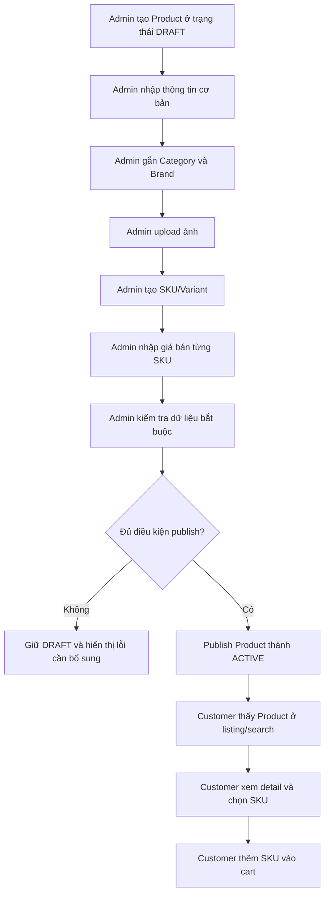

# Catalog Module - Business Logic và Màn Hình

## 1. Catalog là gì trong hệ thống e-commerce?

Catalog là module quản lý toàn bộ dữ liệu sản phẩm mà khách hàng nhìn thấy trước khi mua hàng.

Catalog trả lời các câu hỏi:

- Cửa hàng đang bán sản phẩm gì?
- Sản phẩm thuộc danh mục nào?
- Sản phẩm có những phiên bản nào?
- Mỗi phiên bản còn bán không?
- Giá hiện tại là bao nhiêu?
- Ảnh nào được hiển thị?
- Sản phẩm còn hàng hay hết hàng?
- Sản phẩm nào được phép xuất hiện ngoài website/app?

Trong app e-commerce này, Catalog không chỉ là CRUD sản phẩm. Nó là lớp dữ liệu đầu vào cho Cart, Checkout, Inventory, Promotion và Reporting.

## 2. Các khái niệm nghiệp vụ chính

## 2.1. Product

Product là sản phẩm ở mức tổng quát.

Ví dụ:

```text
Áo thun nam basic
iPhone 15
Giày chạy bộ Nike Pegasus
Cà phê rang xay Robusta
```

Product thường chứa:

- Tên sản phẩm.
- Mô tả ngắn.
- Mô tả chi tiết.
- Brand.
- Category.
- Ảnh đại diện.
- Danh sách ảnh chi tiết.
- Trạng thái hiển thị.
- Trạng thái kinh doanh.

Product không nhất thiết là thứ khách hàng mua trực tiếp. Khách hàng thường mua một SKU cụ thể.

## 2.2. SKU

SKU là phiên bản cụ thể có thể bán và quản lý tồn kho.

Ví dụ product `Áo thun nam basic` có các SKU:

```text
Áo thun nam basic - Đen - Size M
Áo thun nam basic - Đen - Size L
Áo thun nam basic - Trắng - Size M
Áo thun nam basic - Trắng - Size L
```

SKU thường chứa:

- SKU code.
- Barcode nếu có.
- Thuộc tính variant: màu, size, dung lượng, chất liệu.
- Giá bán.
- Giá so sánh nếu có.
- Trọng lượng.
- Kích thước đóng gói.
- Trạng thái bán.
- Tồn kho khả dụng được lấy từ Inventory.

Điểm quan trọng:

- Order item nên lưu SKU, không chỉ lưu product.
- Inventory quản lý theo SKU, không quản lý theo Product chung chung.
- Giá ở order item phải snapshot tại lúc mua, không phụ thuộc giá SKU sau này.

## 2.3. Category

Category là danh mục sản phẩm.

Ví dụ:

```text
Thời trang
  -> Nam
    -> Áo thun
    -> Quần jeans
  -> Nữ
    -> Váy
    -> Áo sơ mi

Điện thoại
  -> iPhone
  -> Samsung
  -> Xiaomi
```

Category có thể là cây cha con.

Category dùng để:

- Điều hướng menu.
- Filter sản phẩm.
- Gắn rule khuyến mãi.
- Báo cáo doanh thu theo danh mục.

## 2.4. Brand

Brand là thương hiệu.

Ví dụ:

```text
Apple
Samsung
Nike
Adidas
Local Brand A
```

Brand có thể dùng để filter, hiển thị logo, báo cáo.

## 2.5. Product image

Một product có nhiều ảnh:

- Ảnh đại diện.
- Ảnh gallery.
- Ảnh theo SKU nếu mỗi màu có ảnh riêng.

Quy tắc thường dùng:

- Product phải có ít nhất một ảnh chính trước khi publish.
- Ảnh chính hiển thị ở listing.
- Ảnh SKU ưu tiên hiển thị khi user chọn variant.

## 2.6. Product status

Nên tách trạng thái sản phẩm thành nhiều ý nghĩa rõ ràng.

Ví dụ:

```text
DRAFT: admin đang nhập, chưa hiển thị cho khách.
ACTIVE: đang bán và được hiển thị.
INACTIVE: tạm ngưng bán, không hiển thị hoặc không cho mua.
ARCHIVED: ngưng kinh doanh lâu dài, chỉ giữ dữ liệu lịch sử.
```

SKU cũng nên có trạng thái riêng:

```text
ACTIVE: SKU đang bán.
INACTIVE: SKU tạm ngưng bán.
DISCONTINUED: SKU không bán nữa.
```

Lưu ý:

- Product ACTIVE nhưng một số SKU có thể INACTIVE.
- Product INACTIVE thì toàn bộ SKU không được checkout.
- Product ARCHIVED vẫn phải hiển thị trong order cũ nếu khách xem lịch sử mua hàng.

## 3. Mục tiêu nghiệp vụ của Catalog

Catalog cần hỗ trợ hai nhóm người dùng:

- Customer: xem, tìm kiếm, lọc, chọn sản phẩm.
- Admin/Merchant: tạo, sửa, publish, ngưng bán, quản lý category, brand, ảnh và SKU.

Catalog cần đảm bảo:

- Khách chỉ thấy sản phẩm được phép bán.
- Giá hiển thị đúng theo thời điểm hiện tại.
- Sản phẩm hết hàng được thể hiện rõ.
- Admin không vô tình làm hỏng dữ liệu order cũ.
- Dữ liệu đủ sạch để checkout không bị lỗi.

## 4. Workflow tổng quát của Catalog



## 5. Điều kiện để một Product được publish

Một product chỉ nên được chuyển từ `DRAFT` sang `ACTIVE` khi đạt đủ điều kiện:

- Có tên sản phẩm.
- Có category.
- Có ít nhất một SKU.
- Có ít nhất một SKU active.
- Mỗi SKU active có SKU code không trùng.
- Mỗi SKU active có giá bán hợp lệ lớn hơn 0.
- Có ít nhất một ảnh chính.
- Product không bị thiếu thông tin bắt buộc theo category.

Ví dụ category `Điện thoại` có thể bắt buộc:

- Brand.
- Dung lượng.
- Màu sắc.
- Bảo hành.

Ví dụ category `Thời trang` có thể bắt buộc:

- Size.
- Màu.
- Chất liệu.

## 6. Màn hình phía Customer

## 6.1. Màn Home / Product Highlights

Mục tiêu:

- Cho khách thấy các sản phẩm nổi bật, sản phẩm mới, sản phẩm bán chạy.

Wireframe:

```text
+------------------------------------------------------+
| LOGO      Search box...                 Cart  Login  |
+------------------------------------------------------+
| Banner khuyến mãi / campaign                         |
+------------------------------------------------------+
| Danh mục nổi bật                                      |
| [Thời trang] [Điện thoại] [Mỹ phẩm] [Gia dụng]       |
+------------------------------------------------------+
| Sản phẩm mới                                         |
| [Card] [Card] [Card] [Card]                          |
+------------------------------------------------------+
| Bán chạy                                             |
| [Card] [Card] [Card] [Card]                          |
+------------------------------------------------------+
```

Nút bấm và hành vi:

- Bấm logo: quay về Home.
- Bấm search box rồi nhập keyword: chuyển sang màn Product Listing với keyword.
- Bấm category: chuyển sang Product Listing đã filter category.
- Bấm product card: chuyển sang Product Detail.
- Bấm icon cart: chuyển sang Cart.

Business logic khi load màn:

- Chỉ lấy product `ACTIVE`.
- Chỉ lấy SKU có thể bán.
- Tính trạng thái tồn kho tổng quát của product từ các SKU.
- Nếu product hết hàng thì vẫn có thể hiển thị nhưng gắn nhãn `Hết hàng`.
- Sản phẩm mới sort theo ngày publish.
- Sản phẩm bán chạy lấy từ reporting hoặc order summary, không nên query realtime từ order_items lớn nếu dữ liệu nhiều.

Case cần handle:

- Không có sản phẩm nổi bật.
- Category không có sản phẩm.
- Product đang ACTIVE nhưng toàn bộ SKU inactive.
- Inventory service chậm hoặc lỗi, có thể fallback hiển thị `Đang cập nhật tồn kho`.

## 6.2. Màn Product Listing

Mục tiêu:

- Khách tìm kiếm và lọc sản phẩm.

Wireframe:

```text
+------------------------------------------------------+
| LOGO      [Search keyword.............]  Cart  Login |
+------------------------------------------------------+
| Breadcrumb: Home > Thời trang > Áo thun              |
+----------------------+-------------------------------+
| Bộ lọc               | Kết quả tìm kiếm              |
|                      | Sort: [Mới nhất v]            |
| Category             |                               |
| [ ] Áo thun          | [Card] [Card] [Card]          |
| [ ] Áo sơ mi         | [Card] [Card] [Card]          |
|                      |                               |
| Brand                | [Card] [Card] [Card]          |
| [ ] Nike             |                               |
| [ ] Adidas           | Page: < 1 2 3 >               |
|                      |                               |
| Price                |                               |
| Min ___ Max ___      |                               |
|                      |                               |
| Stock                |                               |
| [ ] Còn hàng         |                               |
+----------------------+-------------------------------+
```

Thông tin trên product card:

```text
+----------------------+
| Ảnh sản phẩm          |
| Tên sản phẩm          |
| Giá từ 199.000đ       |
| Đã bán 1.2k           |
| Còn hàng / Hết hàng   |
+----------------------+
```

Nút bấm và hành vi:

- Bấm Search: reload listing với keyword mới.
- Bấm checkbox category: lọc theo category.
- Bấm checkbox brand: lọc theo brand.
- Nhập min/max price rồi bấm Apply: lọc theo khoảng giá.
- Bấm `Còn hàng`: chỉ hiển thị product có ít nhất một SKU còn available.
- Chọn sort: reload danh sách theo sort.
- Bấm product card: mở Product Detail.
- Bấm pagination: đổi trang.

Business logic khi search/filter:

- Keyword tìm theo tên product, tên brand, SKU code nếu admin cho phép.
- Nếu chọn category cha, có thể lấy cả sản phẩm thuộc category con.
- Price range nên dựa trên giá SKU active thấp nhất của product.
- Product chỉ được hiển thị nếu product ACTIVE.
- SKU inactive không được dùng để tính giá từ hoặc trạng thái còn hàng.
- Nếu filter `inStock=true`, product cần có ít nhất một SKU active có available stock > 0.

Case cần handle:

- Keyword toàn khoảng trắng.
- Keyword quá dài.
- Category không tồn tại.
- Brand không tồn tại.
- Min price âm.
- Min price lớn hơn max price.
- Page vượt quá tổng số trang.
- Sort field không hợp lệ.
- User filter quá nhiều điều kiện dẫn đến không có kết quả.

Thông báo UI nên có:

```text
Không tìm thấy sản phẩm phù hợp.
Hãy thử bỏ bớt bộ lọc hoặc dùng từ khóa khác.
```

## 6.3. Màn Product Detail

Mục tiêu:

- Khách xem đầy đủ thông tin sản phẩm, chọn variant/SKU và thêm vào cart.

Wireframe:

```text
+------------------------------------------------------+
| LOGO      [Search keyword.............]  Cart  Login |
+------------------------------------------------------+
| Breadcrumb: Home > Thời trang > Áo thun > Product    |
+--------------------------+---------------------------+
| Gallery ảnh              | Tên sản phẩm              |
|                          | Brand                     |
| [Ảnh lớn]                | Rating / Đã bán           |
|                          | Giá: 199.000đ             |
| [thumb] [thumb] [thumb]  |                           |
|                          | Màu: [Đen] [Trắng]        |
|                          | Size: [M] [L] [XL]        |
|                          | Tồn kho: Còn hàng         |
|                          | Số lượng: [-] 1 [+]       |
|                          | [Thêm vào giỏ] [Mua ngay] |
+--------------------------+---------------------------+
| Mô tả sản phẩm                                       |
| Thông số kỹ thuật                                    |
| Chính sách đổi trả                                   |
| Sản phẩm liên quan                                   |
+------------------------------------------------------+
```

Nút bấm và hành vi:

- Bấm thumbnail ảnh: đổi ảnh lớn.
- Bấm variant màu: chọn màu, cập nhật SKU có thể chọn.
- Bấm variant size: chọn size, xác định SKU cuối cùng.
- Bấm `-`: giảm số lượng, tối thiểu 1.
- Bấm `+`: tăng số lượng, không vượt giới hạn UI cho phép.
- Bấm `Thêm vào giỏ`: validate SKU đã chọn, gọi add-to-cart.
- Bấm `Mua ngay`: validate SKU đã chọn, add-to-cart hoặc tạo buy-now cart, chuyển checkout.

Business logic khi load detail:

- Nếu product không tồn tại: trả 404.
- Nếu product không ACTIVE: customer không được xem, trừ khi order cũ link đến snapshot.
- Load danh sách SKU active.
- Load giá hiện tại từng SKU.
- Load trạng thái tồn kho từng SKU từ Inventory.
- Variant nào không còn SKU active thì disable.
- SKU hết hàng vẫn có thể hiển thị nhưng disable nút mua.

Business logic khi chọn variant:

- User chưa chọn đủ thuộc tính thì chưa xác định được SKU.
- Khi chọn màu `Đen`, chỉ những size có SKU active tương ứng mới enable.
- Khi chọn đủ màu và size, hệ thống xác định SKU cụ thể.
- Giá hiển thị đổi theo SKU đã chọn.
- Ảnh có thể đổi theo SKU đã chọn.
- Tồn kho hiển thị đổi theo SKU đã chọn.

Case cần handle:

- Product ACTIVE nhưng không có SKU active.
- SKU active nhưng hết hàng.
- User chưa chọn variant mà bấm thêm vào giỏ.
- User nhập quantity lớn hơn available stock.
- Giá thay đổi sau khi user mở màn hình.
- SKU bị admin inactive trong lúc user đang xem.

Thông báo UI nên có:

```text
Vui lòng chọn màu sắc.
Vui lòng chọn size.
Sản phẩm này hiện đã hết hàng.
Phiên bản bạn chọn hiện không còn được bán.
Số lượng bạn chọn vượt quá số lượng có thể mua.
```

## 6.4. Màn Search Suggestion

Mục tiêu:

- Khi user nhập vào ô search, gợi ý keyword hoặc sản phẩm.

Wireframe:

```text
+--------------------------------------+
| Search: áo th                         |
+--------------------------------------+
| Gợi ý                                |
| áo thun nam                          |
| áo thun nữ                           |
| áo thể thao                          |
|                                      |
| Sản phẩm                             |
| [img] Áo thun nam basic              |
| [img] Áo thể thao running            |
+--------------------------------------+
```

Nút bấm và hành vi:

- Gõ keyword: debounce rồi gọi suggestion.
- Bấm gợi ý keyword: chuyển Product Listing với keyword đó.
- Bấm product suggestion: mở Product Detail.
- Bấm Enter: search keyword hiện tại.

Business logic:

- Chỉ suggest product ACTIVE.
- Không suggest SKU inactive.
- Keyword quá ngắn thì không gọi search.
- Nên giới hạn số suggestion.

Case cần handle:

- User gõ rất nhanh.
- Keyword có ký tự đặc biệt.
- Không có suggestion.
- Product vừa bị inactive sau khi suggestion hiển thị.

## 7. Màn hình phía Admin

## 7.1. Màn Admin Product List

Mục tiêu:

- Admin quản lý toàn bộ product.

Wireframe:

```text
+------------------------------------------------------+
| Admin > Catalog > Products                           |
+------------------------------------------------------+
| [Tạo sản phẩm]                                       |
| Search [................] Status [All v] [Filter]    |
+------------------------------------------------------+
| Checkbox | Ảnh | Tên | Category | Brand | Status | Actions |
| [ ]      | img | Áo  | Áo thun  | Nike  | ACTIVE | View Edit |
| [ ]      | img | Quần| Quần nam | Levis | DRAFT  | View Edit |
+------------------------------------------------------+
| < 1 2 3 >                                            |
+------------------------------------------------------+
```

Nút bấm và hành vi:

- `Tạo sản phẩm`: mở màn Create Product.
- Search: lọc theo tên product hoặc SKU code.
- Status dropdown: lọc DRAFT, ACTIVE, INACTIVE, ARCHIVED.
- Filter: reload table.
- View: mở detail read-only hoặc preview.
- Edit: mở màn chỉnh sửa.
- Checkbox: chọn nhiều product để bulk action.
- Bulk inactive: chuyển nhiều product sang INACTIVE nếu hợp lệ.

Business logic:

- Admin thấy cả DRAFT, ACTIVE, INACTIVE, ARCHIVED.
- Không xóa cứng product đã có order.
- Product có order thì chỉ được inactive/archive.
- Product DRAFT có thể xóa nếu chưa phát sinh dữ liệu liên quan.

Case cần handle:

- Search không có kết quả.
- Bulk action có một số product không hợp lệ.
- Hai admin cùng sửa một product.
- Product đang được publish bởi admin khác.

## 7.2. Màn Create Product

Mục tiêu:

- Admin tạo product mới ở trạng thái DRAFT.

Wireframe:

```text
+------------------------------------------------------+
| Admin > Catalog > Create Product                     |
+------------------------------------------------------+
| Thông tin cơ bản                                     |
| Tên sản phẩm *        [...........................]  |
| Slug                 [...........................]    |
| Brand                [Select brand v]                |
| Category *           [Select category v]             |
| Mô tả ngắn           [...........................]    |
| Mô tả chi tiết       [textarea....................]   |
|                                                      |
| [Lưu nháp] [Lưu và tiếp tục thêm SKU]                |
+------------------------------------------------------+
```

Nút bấm và hành vi:

- `Lưu nháp`: validate tối thiểu, tạo product DRAFT.
- `Lưu và tiếp tục thêm SKU`: tạo product DRAFT, chuyển sang tab SKU.
- Chọn category: load attribute bắt buộc theo category nếu có.
- Chọn brand: gắn brand cho product.

Business logic:

- Tạo mới luôn là DRAFT.
- Tên sản phẩm bắt buộc.
- Category bắt buộc nếu muốn đi tiếp publish.
- Slug có thể auto-generate từ tên.
- Slug phải unique nếu dùng URL public.
- Product chưa có SKU thì không publish được.

Case cần handle:

- Tên rỗng.
- Tên quá dài.
- Slug trùng.
- Category inactive.
- Brand inactive.
- Admin bấm lưu nhiều lần.

Thông báo UI:

```text
Đã lưu sản phẩm ở trạng thái nháp.
Slug đã tồn tại, vui lòng chọn slug khác.
Danh mục này hiện không còn hoạt động.
```

## 7.3. Màn Edit Product - Tab Basic Info

Mục tiêu:

- Admin sửa thông tin cơ bản của product.

Wireframe:

```text
+------------------------------------------------------+
| Edit Product: Áo thun nam basic        Status: DRAFT |
+------------------------------------------------------+
| Tabs: [Basic] [Images] [Variants/SKU] [Price] [Preview] |
+------------------------------------------------------+
| Tên sản phẩm *        [Áo thun nam basic..........]  |
| Slug                 [ao-thun-nam-basic..........]   |
| Brand                [Nike v]                        |
| Category *           [Áo thun v]                     |
| Mô tả ngắn           [...........................]    |
| Mô tả chi tiết       [textarea....................]   |
|                                                      |
| [Lưu thay đổi] [Preview] [Publish]                   |
+------------------------------------------------------+
```

Nút bấm và hành vi:

- `Lưu thay đổi`: update thông tin cơ bản.
- `Preview`: xem product như customer nhưng chưa public nếu DRAFT.
- `Publish`: kiểm tra toàn bộ điều kiện publish.

Business logic:

- Nếu product đã ACTIVE, sửa tên/mô tả/ảnh có thể áp dụng ngay.
- Nếu đổi category, cần kiểm tra variant/attribute có còn hợp lệ không.
- Nếu product đã có order, không được thay đổi dữ liệu làm mất khả năng hiển thị order cũ.

Case cần handle:

- Đổi category khiến attribute cũ không phù hợp.
- Product ACTIVE bị sửa thành thiếu category.
- Admin publish khi thiếu SKU hoặc ảnh.
- Hai admin cùng edit.

## 7.4. Màn Edit Product - Tab Images

Mục tiêu:

- Quản lý ảnh sản phẩm.

Wireframe:

```text
+------------------------------------------------------+
| Product Images                                       |
+------------------------------------------------------+
| [Upload ảnh]                                         |
|                                                      |
| Gallery                                              |
| [img] Main  [Set main] [Delete]                      |
| [img]       [Set main] [Delete]                      |
| [img]       [Set main] [Delete]                      |
|                                                      |
| Kéo thả để sắp xếp thứ tự ảnh                        |
|                                                      |
| [Lưu thứ tự]                                         |
+------------------------------------------------------+
```

Nút bấm và hành vi:

- `Upload ảnh`: chọn file ảnh, upload vào storage.
- `Set main`: đặt ảnh chính.
- `Delete`: xóa ảnh khỏi product.
- Kéo thả ảnh: đổi thứ tự hiển thị.
- `Lưu thứ tự`: lưu sort order.

Business logic:

- Product ACTIVE nên luôn có ảnh chính.
- Nếu xóa ảnh chính, phải chọn ảnh khác làm chính hoặc chặn xóa.
- Ảnh có thể dùng chung cho toàn product hoặc gắn với SKU.
- Chỉ cho upload định dạng hợp lệ.
- Giới hạn dung lượng file.

Case cần handle:

- Upload file không phải ảnh.
- Upload file quá lớn.
- Upload thất bại giữa chừng.
- Xóa ảnh chính của product ACTIVE.
- Sort order bị trùng.

Thông báo UI:

```text
Không thể xóa ảnh chính khi sản phẩm đang được bán.
Vui lòng chọn ảnh chính khác trước khi xóa.
File ảnh vượt quá dung lượng cho phép.
```

## 7.5. Màn Edit Product - Tab Variants/SKU

Mục tiêu:

- Admin tạo và quản lý các SKU bán được.

Wireframe:

```text
+------------------------------------------------------+
| Variants / SKU                                       |
+------------------------------------------------------+
| Thuộc tính variant                                   |
| Color: [Đen] [Trắng] [+ Thêm màu]                    |
| Size:  [M] [L] [XL] [+ Thêm size]                    |
|                                                      |
| [Generate SKU từ variant]                            |
+------------------------------------------------------+
| SKU list                                             |
| SKU Code | Color | Size | Barcode | Status | Actions |
| TS-BLK-M | Đen   | M    | ...     | ACTIVE | Edit    |
| TS-BLK-L | Đen   | L    | ...     | ACTIVE | Edit    |
| TS-WHT-M | Trắng | M    | ...     | ACTIVE | Edit    |
+------------------------------------------------------+
| [Thêm SKU thủ công] [Lưu SKU]                        |
+------------------------------------------------------+
```

Nút bấm và hành vi:

- `+ Thêm màu`: thêm option màu.
- `+ Thêm size`: thêm option size.
- `Generate SKU từ variant`: tạo tổ hợp SKU từ các option.
- `Thêm SKU thủ công`: thêm một SKU riêng.
- `Edit`: sửa SKU code, barcode, attribute, status.
- `Lưu SKU`: lưu danh sách SKU.

Business logic:

- SKU code phải unique toàn hệ thống.
- Một tổ hợp variant trong cùng product không được trùng.
- SKU đã có order hoặc inventory transaction thì không nên xóa cứng.
- SKU có thể inactive nếu ngừng bán.
- SKU inactive không được add cart hoặc checkout.
- SKU discontinued vẫn hiển thị trong order cũ.

Case cần handle:

- Generate tạo SKU trùng SKU đã có.
- Xóa variant option làm mất SKU đang tồn tại.
- SKU code rỗng hoặc trùng.
- Barcode trùng.
- Product có SKU nhưng tất cả inactive thì không nên publish.
- Admin inactive SKU đang có reservation active.

Gợi ý xử lý:

- Nếu SKU chưa từng phát sinh order/inventory, cho phép xóa.
- Nếu SKU đã phát sinh dữ liệu, chỉ cho inactive/discontinued.
- Nếu inactive SKU đang có reservation active, cảnh báo admin.

## 7.6. Màn Edit SKU Detail

Mục tiêu:

- Chỉnh chi tiết một SKU.

Wireframe:

```text
+------------------------------------------------------+
| Edit SKU: TS-BLK-M                                   |
+------------------------------------------------------+
| SKU Code *       [TS-BLK-M.........................] |
| Barcode          [893..............................] |
| Color            [Đen v]                             |
| Size             [M v]                               |
| Weight           [200 gram.........................] |
| Package size     [20 x 15 x 3 cm...................] |
| Status           [ACTIVE v]                          |
| SKU Image        [Upload] [Current image]             |
|                                                      |
| [Lưu] [Ngưng bán SKU]                               |
+------------------------------------------------------+
```

Nút bấm và hành vi:

- `Lưu`: update thông tin SKU.
- `Ngưng bán SKU`: chuyển SKU sang INACTIVE hoặc DISCONTINUED.
- `Upload SKU Image`: gắn ảnh riêng cho SKU.

Business logic:

- Không đổi SKU code nếu SKU đã có order, hoặc chỉ cho đổi display code chứ giữ internal id.
- Không cho active SKU nếu product đang ARCHIVED.
- Không cho xóa SKU đã có order.
- Nếu SKU inactive, product detail vẫn có thể hiển thị option disabled.

Case cần handle:

- SKU đang nằm trong cart của user.
- SKU đang có pending order reservation.
- SKU đang có tồn kho nhưng admin muốn discontinued.
- SKU image bị xóa.

## 7.7. Màn Edit Product - Tab Price

Mục tiêu:

- Admin quản lý giá bán của từng SKU.

Wireframe:

```text
+------------------------------------------------------+
| Pricing                                              |
+------------------------------------------------------+
| SKU Code | Variant | Sale Price | Compare Price | Status |
| TS-BLK-M | Đen / M | 199000     | 249000        | ACTIVE |
| TS-BLK-L | Đen / L | 199000     | 249000        | ACTIVE |
| TS-WHT-M | Trắng/M | 209000     | 259000        | ACTIVE |
|                                                      |
| [Apply same price to all] [Lưu giá]                  |
+------------------------------------------------------+
```

Nút bấm và hành vi:

- Nhập sale price từng SKU.
- Nhập compare price nếu muốn hiển thị giá gạch.
- `Apply same price to all`: áp một giá cho toàn bộ SKU.
- `Lưu giá`: validate và cập nhật.

Business logic:

- Sale price phải lớn hơn 0 nếu SKU active.
- Compare price nếu có nên lớn hơn sale price.
- Giá order phải snapshot khi checkout.
- Giá thay đổi chỉ ảnh hưởng cart/detail từ thời điểm sau khi đổi.
- Có thể lưu price history nếu muốn audit.

Case cần handle:

- Giá âm.
- Giá bằng 0.
- Compare price nhỏ hơn sale price.
- Admin đổi giá khi user đang checkout.
- Giá thay đổi sau khi user đã thêm cart.

Gợi ý policy:

- Cart hiển thị cảnh báo `Giá sản phẩm đã thay đổi`.
- Checkout luôn dùng giá mới nhất tại thời điểm checkout.
- Order item lưu unit price snapshot sau checkout.

## 7.8. Màn Product Preview

Mục tiêu:

- Admin xem thử product như customer trước khi publish.

Wireframe:

```text
+------------------------------------------------------+
| Preview Mode - Product chưa public                   |
+------------------------------------------------------+
| Giao diện giống Product Detail của customer           |
|                                                      |
| [Quay lại chỉnh sửa] [Publish]                       |
+------------------------------------------------------+
```

Nút bấm và hành vi:

- `Quay lại chỉnh sửa`: quay về edit.
- `Publish`: kiểm tra điều kiện publish.

Business logic:

- Preview có thể xem product DRAFT.
- Preview không cho add cart thật.
- Preview có thể hiển thị warning các phần còn thiếu.

Case cần handle:

- Product thiếu ảnh.
- Product chưa có SKU.
- SKU chưa có giá.
- Category inactive.

## 7.9. Màn Category Management

Mục tiêu:

- Admin quản lý cây danh mục.

Wireframe:

```text
+------------------------------------------------------+
| Admin > Catalog > Categories                         |
+------------------------------------------------------+
| [Tạo category gốc]                                   |
|                                                      |
| Thời trang                         [Edit] [Add child]|
|   Áo nam                           [Edit] [Add child]|
|     Áo thun                        [Edit] [Disable]  |
|   Quần nam                         [Edit] [Disable]  |
| Điện thoại                         [Edit] [Add child]|
+------------------------------------------------------+
```

Nút bấm và hành vi:

- `Tạo category gốc`: tạo category không có parent.
- `Add child`: tạo category con.
- `Edit`: sửa tên, slug, parent, sort order.
- `Disable`: tắt category.

Business logic:

- Category có thể là cây nhiều cấp.
- Không cho tạo vòng lặp parent-child.
- Không xóa cứng category đang có product.
- Nếu disable category cha, cần quyết định có disable category con không.
- Product thuộc category inactive không nên được publish.

Case cần handle:

- Đổi parent tạo vòng lặp.
- Category slug trùng cùng cấp hoặc toàn hệ thống tùy thiết kế.
- Disable category đang có product ACTIVE.
- Xóa category có category con.

## 7.10. Màn Brand Management

Mục tiêu:

- Admin quản lý thương hiệu.

Wireframe:

```text
+------------------------------------------------------+
| Admin > Catalog > Brands                             |
+------------------------------------------------------+
| [Tạo brand] Search [.............]                   |
+------------------------------------------------------+
| Logo | Name | Slug | Status | Actions                |
| img  | Nike | nike | ACTIVE | Edit Disable           |
| img  | Apple| apple| ACTIVE | Edit Disable           |
+------------------------------------------------------+
```

Nút bấm và hành vi:

- `Tạo brand`: mở form tạo brand.
- `Edit`: sửa tên, logo, slug.
- `Disable`: tắt brand.
- Search: tìm brand theo tên.

Business logic:

- Product có thể không bắt buộc brand tùy category.
- Brand inactive không được chọn cho product mới.
- Product cũ đang dùng brand inactive vẫn hiển thị brand snapshot hoặc tên brand cũ.

Case cần handle:

- Brand name trùng.
- Brand slug trùng.
- Disable brand đang có product ACTIVE.
- Xóa logo brand.

## 8. Business rule tổng hợp

## 8.1. Product visibility

Customer thấy product khi:

- Product status là ACTIVE.
- Category của product đang active.
- Product có ít nhất một SKU active.
- Product không bị soft deleted.

Customer có thể mua product khi:

- Product ACTIVE.
- SKU được chọn ACTIVE.
- SKU có giá hợp lệ.
- SKU còn available stock.
- Không vi phạm rule mua hàng khác như giới hạn số lượng.

## 8.2. Product không nên xóa cứng khi đã phát sinh dữ liệu

Không nên hard delete:

- Product đã từng được order.
- SKU đã từng được order.
- SKU đã từng có inventory transaction.
- Category đang có product.
- Brand đang có product.

Nên dùng:

- INACTIVE nếu tạm ngưng.
- ARCHIVED nếu ngưng lâu dài.
- Soft delete nếu cần ẩn khỏi admin list mặc định.

## 8.3. Giá phải được snapshot

Khi khách checkout:

- Backend lấy giá hiện tại từ SKU/price.
- Backend tính tổng tiền.
- Order item lưu `unit_price`.
- Sau này admin đổi giá SKU, order cũ không đổi.

## 8.4. Cart không đảm bảo giữ hàng

Thêm vào cart không có nghĩa là còn hàng mãi.

Khi customer mở cart:

- Có thể thấy sản phẩm đã hết hàng.
- Có thể thấy giá đã thay đổi.
- Có thể thấy SKU không còn bán.

Khi checkout:

- Backend validate lại toàn bộ.
- Nếu SKU không còn hợp lệ, checkout fail với message rõ ràng.

## 8.5. Catalog phụ thuộc Inventory nhưng không sở hữu Inventory

Catalog biết SKU là gì, tên gì, giá gì.

Inventory biết SKU còn bao nhiêu hàng.

Không nên để Catalog tự update tồn kho. Product Listing và Product Detail chỉ đọc trạng thái tồn kho để hiển thị.

## 9. Các case nghiệp vụ cần đặc biệt lưu ý

## 9.1. Product ACTIVE nhưng hết hàng

Policy có thể chọn:

- Vẫn hiển thị product nhưng gắn nhãn `Hết hàng`.
- Ẩn product khỏi listing nếu user filter `Còn hàng`.
- Product detail vẫn xem được nhưng nút mua disabled.

Không nên tự chuyển product sang INACTIVE chỉ vì hết hàng.

## 9.2. SKU inactive khi đang nằm trong cart

Tình huống:

```text
User thêm SKU vào cart lúc 10:00
Admin inactive SKU lúc 10:05
User checkout lúc 10:10
```

Xử lý:

- Cart vẫn có thể hiển thị item.
- Item có warning `Sản phẩm này hiện không còn được bán`.
- Checkout bị chặn cho item đó.
- User phải xóa item hoặc chọn SKU khác.

## 9.3. Giá thay đổi khi SKU đang nằm trong cart

Tình huống:

```text
User thêm SKU giá 199.000 vào cart
Admin đổi giá thành 219.000
User mở cart lại
```

Xử lý:

- Cart hiển thị giá mới.
- Có warning `Giá sản phẩm đã thay đổi`.
- Checkout dùng giá mới nhất.
- Nếu muốn thân thiện hơn, có thể lưu cart price snapshot để so sánh.

## 9.4. Admin đổi category của product ACTIVE

Rủi ro:

- Product biến mất khỏi menu cũ.
- Filter/category report thay đổi.
- Attribute theo category không còn phù hợp.

Xử lý:

- Cho đổi nhưng cảnh báo.
- Nếu category mới yêu cầu attribute bắt buộc, bắt admin nhập đủ trước khi lưu/publish.
- Ghi audit log.

## 9.5. Admin xóa ảnh chính

Rủi ro:

- Listing bị lỗi ảnh.

Xử lý:

- Nếu product ACTIVE, chặn xóa ảnh chính khi chưa chọn ảnh thay thế.
- Nếu product DRAFT, cho xóa nhưng product không publish được.

## 9.6. Product có nhiều SKU nhưng một số SKU hết hàng

Hiển thị:

- Product listing vẫn có thể hiện `Còn hàng` nếu ít nhất một SKU còn hàng.
- Product detail disable variant hết hàng.
- Nếu user chọn variant hết hàng, nút mua disabled.

## 9.7. Search và filter trên dữ liệu lớn

Khi catalog lớn:

- Không query không giới hạn.
- Luôn pagination.
- Cần index cho status, category, brand, price.
- Search keyword có thể dùng full-text search hoặc search engine sau này.
- Sort bán chạy nên dựa trên summary, không join trực tiếp order_items lớn.

## 10. Gợi ý thứ tự tự code module Catalog

## Phase 1: Category và Brand

Làm trước:

- Category list.
- Create/edit category.
- Disable category.
- Brand list.
- Create/edit brand.
- Disable brand.

Lý do:

- Product cần category và brand để tạo.

## Phase 2: Product basic

Làm:

- Admin product list.
- Create product DRAFT.
- Edit basic info.
- Product status DRAFT/ACTIVE/INACTIVE.

Chưa cần SKU phức tạp ngay.

## Phase 3: Product images

Làm:

- Upload ảnh.
- Set main image.
- Delete image.
- Sort image.

Nếu chưa muốn tích hợp storage thật, có thể lưu URL giả lập trước.

## Phase 4: SKU đơn giản

Làm:

- Thêm SKU thủ công.
- SKU code.
- Giá.
- Status.
- Variant dạng key-value đơn giản.

Ví dụ:

```text
Color = Đen
Size = M
```

## Phase 5: Customer listing/detail

Làm:

- Product Listing.
- Product Detail.
- Filter category/brand/price.
- Sort.
- Pagination.

Tồn kho có thể mock trước, sau đó nối Inventory.

## Phase 6: Publish validation

Làm:

- Validate product trước khi publish.
- Hiển thị checklist thiếu gì.
- Preview product.

## Phase 7: Search nâng cao và performance

Làm sau:

- Search suggestion.
- Full-text search.
- Index tuning.
- Cache product detail.
- Summary sold count.

## 11. Checklist hoàn thành Catalog

Customer:

- Xem được product listing.
- Search được theo keyword.
- Filter được category, brand, price, in-stock.
- Sort được.
- Pagination đúng.
- Xem được product detail.
- Chọn variant xác định đúng SKU.
- SKU hết hàng hoặc inactive không mua được.

Admin:

- Tạo category.
- Tạo brand.
- Tạo product draft.
- Upload ảnh.
- Set ảnh chính.
- Tạo SKU.
- Nhập giá SKU.
- Publish product khi đủ điều kiện.
- Không publish product thiếu dữ liệu.
- Inactive product.
- Inactive SKU.
- Không xóa cứng dữ liệu đã phát sinh.

Business safety:

- Product ACTIVE mới hiện cho customer.
- Giá order sau này phải snapshot từ SKU.
- Cart/checkout phải validate lại SKU và giá.
- Listing không bị lỗi khi product thiếu ảnh.
- Product hết hàng xử lý rõ ràng.
- Admin action quan trọng nên có audit log.

## 12. Tóm tắt tư duy khi code Catalog

Khi code Catalog, không nên nghĩ đơn giản là bảng `products` và CRUD.

Nên nghĩ theo luồng:

```text
Admin tạo dữ liệu sạch
-> Product đủ điều kiện mới publish
-> Customer chỉ thấy dữ liệu được phép bán
-> Customer chọn SKU cụ thể
-> Cart và Checkout validate lại SKU, giá, tồn kho
-> Order lưu snapshot để không bị ảnh hưởng bởi thay đổi Catalog sau này
```

Nếu bạn code đúng module Catalog, các module sau như Cart, Checkout, Inventory và Reporting sẽ dễ hơn rất nhiều.
