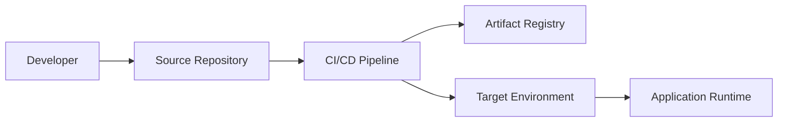
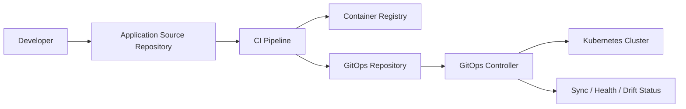

# GitOps Deploy và Deploy truyền thống từ cơ bản tới chuyên sâu

> Mục tiêu: hiểu thật rõ hai cách triển khai phần mềm phổ biến: deploy truyền thống bằng pipeline/job/script và deploy theo GitOps.  
> Trọng tâm: cách tổ chức hệ thống, luồng triển khai, lưu trữ cấu hình/trạng thái, ưu nhược điểm, bảo mật, rollback, audit và cách chọn mô hình phù hợp.

---

## 1. Tóm tắt nhanh

Deploy truyền thống thường hoạt động theo mô hình:

```text
Pipeline/CI server
  -> chạy script deploy
  -> đẩy thay đổi vào server / VM / Kubernetes / cloud service
  -> kết thúc job
```

GitOps hoạt động theo mô hình:

```text
Git repository lưu desired state
  -> GitOps controller trong môi trường chạy tự kéo cấu hình
  -> so sánh desired state với live state
  -> liên tục reconcile để hệ thống khớp với Git
```

Nói ngắn gọn:

| Tiêu chí | Deploy truyền thống | GitOps deploy |
|---|---|---|
| Trung tâm điều khiển | CI/CD pipeline, Jenkins, GitLab CI, GitHub Actions, script, release tool | Git repository + GitOps controller như Argo CD hoặc Flux |
| Cách deploy | Pipeline thường `push` thay đổi vào môi trường đích | Controller trong cluster thường `pull` desired state từ Git |
| Nơi lưu trạng thái mong muốn | Có thể nằm trong pipeline, artifact, biến CI, manifest, script, wiki, tool deploy | Git là state store chính cho desired state |
| Cách phát hiện drift | Thường cần job kiểm tra riêng, monitoring riêng hoặc kiểm tra thủ công | Controller liên tục so sánh live state với desired state |
| Rollback | Chạy lại pipeline với version cũ, revert artifact, restore server hoặc đổi traffic | Revert commit / đổi image digest / sync lại desired state |
| Audit | Dựa vào log pipeline, approval, ticket, deployment history | Dựa mạnh vào Git history, pull request, commit, controller events |
| Bảo mật | Pipeline thường cần credential đủ quyền deploy vào môi trường | CI có thể không cần quyền vào cluster production; controller có quyền scoped trong cluster |
| Phù hợp nhất | VM, bare metal, legacy app, script phức tạp, hệ thống chưa declarative | Kubernetes, cloud native, IaC, nhiều môi trường, yêu cầu audit cao |

Không nên hiểu GitOps là "có dùng Git trong pipeline". Một pipeline truyền thống cũng có thể đọc file YAML từ Git rồi chạy `kubectl apply`. GitOps đúng nghĩa cần có desired state được khai báo, được version hóa, được kéo tự động và được reconcile liên tục.

---

## 2. Các khái niệm nền

### 2.1. Deployment là gì?

Deployment là quá trình đưa một phiên bản phần mềm hoặc cấu hình mới vào môi trường chạy thật.

Một deployment hoàn chỉnh thường gồm:

- Chọn artifact cần triển khai: JAR, binary, Docker image, Helm chart, package.
- Chọn môi trường: dev, staging, production.
- Cập nhật cấu hình runtime: env vars, ConfigMap, Secret reference, resource limit, ingress, service.
- Thực thi rollout: in-place, rolling, blue/green, canary, traffic shifting.
- Kiểm tra sau deploy: health check, smoke test, log, metric, alert.
- Rollback hoặc roll-forward nếu có lỗi.
- Ghi nhận audit: ai deploy, deploy commit nào, artifact nào, lúc nào, lên môi trường nào.

Ghi chú thực tế:

- Nếu deploy kiểu truyền thống cho Java/Spring Boot trên VM/server, artifact thường là `app.jar` hoặc `app.war`.
- Nếu deploy bằng Docker/Kubernetes, artifact chạy trực tiếp thường là container image, ví dụ `registry.example.com/app:1.2.3`.
- Với Spring Boot chạy trên Kubernetes, `jar` thường vẫn được build ra trước, nhưng nó nằm bên trong Docker image. Kubernetes không deploy file `jar` trực tiếp, mà pull image từ registry rồi chạy container.
- Với GitOps, thứ được commit vào Git thường là Kubernetes manifest, Helm values hoặc Kustomize overlay có trỏ tới image tag/digest cần chạy.

### 2.2. Artifact là gì?

Artifact là đầu ra đã build và có thể deploy.

Ví dụ:

```text
Java/Spring Boot: target/app.jar
Container: registry.example.com/app:1.2.3
Container immutable: registry.example.com/app@sha256:abc...
Frontend: dist/
Helm chart: app-0.1.0.tgz
Terraform module/package: versioned module
```

Các thành phần tương đương theo kiểu triển khai:

| Kiểu triển khai | Artifact chính | Vai trò |
|---|---|---|
| Java traditional deploy | `target/app.jar`, `app.war` | Copy lên server rồi chạy bằng `java -jar` hoặc deploy vào app server như Tomcat. |
| Docker deploy | Docker/OCI image | Image đã chứa runtime, dependency và app, có thể chạy bằng `docker run`. |
| Kubernetes deploy | Docker/OCI image + YAML/Helm/Kustomize | Kubernetes chạy container từ image; YAML/Helm/Kustomize mô tả replicas, service, ingress, config, secret reference. |
| GitOps deploy | Git commit chứa desired state | Argo CD/Flux đọc Git, thấy image/chart/config version mới rồi sync vào cluster. |
| Frontend static | `dist/`, `build/` hoặc image Nginx | Có thể upload lên CDN/S3/Nginx, hoặc đóng folder build vào container image. |
| Infrastructure | Terraform module/state config version | Dùng để tạo hoặc thay đổi cloud resource như VPC, EKS, RDS, IAM. |

Flow phổ biến với Spring Boot + Docker + Kubernetes:

```text
source code
  -> build ra target/app.jar
  -> Dockerfile copy jar vào image
  -> push image lên registry
  -> server/Kubernetes pull image về
  -> tạo container từ image
  -> container chạy lệnh java -jar /app/app.jar
```

Giải thích chi tiết hơn:

1. Build `jar`

   Khi chạy Maven/Gradle, source code Java được compile và đóng gói thành `target/app.jar`.
   File `jar` này chứa code đã biên dịch, dependency cần thiết và metadata để Spring Boot có thể chạy bằng lệnh:

   ```bash
   java -jar target/app.jar
   ```

2. Đóng `jar` vào Docker image

   Docker image là một gói đầy đủ hơn `jar`. Nó thường chứa:

   - Java runtime, ví dụ JRE/JDK 17 hoặc 21.
   - File `app.jar`.
   - Cấu trúc thư mục trong container, ví dụ `/app/app.jar`.
   - Lệnh mặc định để chạy app, ví dụ `java -jar /app/app.jar`.

   Ví dụ Dockerfile:

   ```dockerfile
   FROM eclipse-temurin:21-jre
   WORKDIR /app
   COPY target/app.jar app.jar
   CMD ["java", "-jar", "/app/app.jar"]
   ```

   Lý do cần ném `jar` vào image: server hoặc Kubernetes không cần tự cài Java, tự copy file, tự biết chạy lệnh gì. Tất cả đã được đóng gói sẵn trong image, chạy ở đâu cũng giống nhau hơn.

3. Push image lên registry

   Sau khi build image, CI push image lên registry như Docker Hub, GitLab Registry, AWS ECR:

   ```text
   registry.example.com/app:1.2.3
   registry.example.com/app@sha256:abc...
   ```

   Registry giống như kho lưu image. Server hoặc Kubernetes sẽ pull image từ kho này về khi cần chạy.

4. Server hoặc Kubernetes xử lý image

   Với Docker trên một server thường:

   ```text
   docker pull registry.example.com/app:1.2.3
   docker run registry.example.com/app:1.2.3
   ```

   Docker sẽ đọc image, tạo container filesystem từ các layer của image, rồi chạy `CMD` đã khai báo trong Dockerfile. Nó không "bóc jar ra ngoài server" để chạy kiểu truyền thống; `jar` vẫn nằm trong filesystem của container.

   Với Kubernetes:

   ```text
   K8s đọc manifest Deployment
     -> thấy image cần chạy
     -> node pull image từ registry
     -> container runtime tạo container
     -> container chạy command trong image
     -> Service/Ingress đưa traffic vào Pod
   ```

   Kubernetes cũng không deploy trực tiếp `jar`. Kubernetes chỉ biết chạy container từ image. Nếu app cần cấu hình, Kubernetes gắn thêm env vars, ConfigMap, Secret, volume, resource limit, health check... vào lúc tạo Pod.

5. Vậy có cần `jar` không?

   Có, nếu app là Spring Boot thì thường vẫn cần `jar` ở bước build Java. Nhưng trong Docker/Kubernetes/GitOps, `jar` là artifact trung gian bên trong image. Artifact triển khai chính là image, còn manifest/Helm/Kustomize là cách mô tả image đó sẽ chạy như thế nào.

Helm và chart:

- Helm là công cụ package/deploy cho Kubernetes, giống package manager cho app chạy trên cluster.
- Chart là gói của Helm, chứa nhiều Kubernetes YAML template như Deployment, Service, Ingress, ConfigMap.
- `values.yaml` là file cấu hình đầu vào cho chart, ví dụ image tag, số replica, port, resource limit.
- Khi chạy Helm, Helm lấy chart + values rồi render thành YAML Kubernetes thật và apply vào cluster.
- Trong GitOps, Argo CD/Flux có thể đọc Helm chart hoặc Helm values từ Git, render ra manifest rồi sync vào Kubernetes.

Ví dụ ngắn:

```text
Docker image: registry.example.com/app:1.2.3
Helm chart: mô tả image đó chạy mấy replica, port nào, ingress nào, config nào
values.yaml: nơi đổi image tag, replica, env theo từng môi trường
```

Tóm lại: image là thứ app chạy; Kubernetes YAML mô tả cách chạy image; Helm chart đóng gói các YAML đó; Helm là tool render/deploy chart vào Kubernetes.

Nguyên tắc tốt:

- Build một lần, deploy nhiều lần.
- Không rebuild lại artifact khi promote từ dev sang staging hoặc production.
- Dùng version bất biến nếu có thể, đặc biệt là container image digest.
- Artifact không nên chứa secret thật.

### 2.3. Desired state là gì?

Desired state là trạng thái mong muốn của hệ thống.

Ví dụ với Kubernetes:

```yaml
apiVersion: apps/v1
kind: Deployment
metadata:
  name: springboot-learning
spec:
  replicas: 3
  template:
    spec:
      containers:
        - name: app
          image: 123456789012.dkr.ecr.ap-southeast-1.amazonaws.com/springboot-learning@sha256:...
```

File trên không nói "hãy SSH vào server A, stop process, copy file, restart service". Nó mô tả kết quả mong muốn: có một Deployment tên `springboot-learning`, chạy 3 replica, dùng image cụ thể.

### 2.4. Live state là gì?

Live state là trạng thái thật đang tồn tại trong môi trường chạy.

Ví dụ:

```text
Git desired state:
  replicas = 3

Cluster live state:
  replicas = 2
```

Sự khác biệt này gọi là drift.

### 2.5. Drift là gì?

Drift là khi trạng thái thật lệch khỏi trạng thái mong muốn.

Ví dụ:

- Ai đó sửa trực tiếp replica trong cluster bằng `kubectl scale`.
- Một ConfigMap bị sửa nóng ngoài Git.
- Resource limit trong Git là `512Mi`, nhưng trong cluster bị sửa thành `1Gi`.
- Một Service bị xóa thủ công.
- Một deployment job chạy lỗi giữa chừng, một nửa server lên version mới, một nửa còn version cũ.

Deploy truyền thống thường coi deploy là một job chạy xong rồi kết thúc. GitOps coi vận hành là một vòng lặp liên tục: quan sát, so sánh, sửa lệch.

---

## 3. Deploy truyền thống là gì?

Deploy truyền thống là cách triển khai trong đó một pipeline, công cụ CI/CD, release manager hoặc script chủ động đẩy thay đổi vào môi trường đích.

Ví dụ:

```text
Developer merge code vào main
  -> GitLab CI chạy test
  -> GitLab CI build Docker image
  -> GitLab CI login vào cluster
  -> GitLab CI chạy helm upgrade hoặc kubectl apply
  -> GitLab CI chạy smoke test
```

Hoặc với VM:

```text
Jenkins pipeline
  -> build app.jar
  -> copy app.jar qua SSH vào server
  -> systemctl stop app
  -> thay file jar
  -> systemctl start app
  -> kiểm tra endpoint /health
```

### 3.1. Kiến trúc tổng quan



Ý nghĩa từng dòng:

| Dòng | Ý nghĩa |
|---|---|
| `Developer -> Source Repository` | Developer push code lên Git repository, ví dụ GitLab/GitHub. Đây là nơi lưu source code và là điểm bắt đầu của pipeline. |
| `Source Repository -> CI/CD Pipeline` | Khi có commit, tag hoặc merge request, pipeline được trigger để test, build và deploy. |
| `CI/CD Pipeline -> Artifact Registry` | Pipeline build artifact rồi push lên nơi lưu artifact, ví dụ Docker Registry/ECR/GitLab Registry hoặc kho lưu `jar`. |
| `CI/CD Pipeline -> Target Environment` | Pipeline dùng credential để deploy trực tiếp vào môi trường đích như VM, server, Kubernetes cluster hoặc cloud service. |
| `Target Environment -> Application Runtime` | Môi trường đích tạo hoặc cập nhật runtime thật của app, ví dụ process Java, Docker container, Kubernetes Pod. |

Hiểu ngắn gọn: trong deploy truyền thống, pipeline không chỉ build artifact mà còn trực tiếp ra lệnh cho môi trường đích chạy version mới.

Trong mô hình này, pipeline thường là nơi biết:

- Deploy bằng command gì.
- Deploy vào đâu.
- Credential nào dùng cho môi trường nào.
- Thứ tự các bước.
- Điều kiện approval.
- Rollback command.
- Biến môi trường.
- Script migration.
- Script kiểm tra sau deploy.

### 3.2. Pipeline truyền thống thường gồm gì?

Ví dụ với GitLab CI/CD:

```yaml
stages:
  - test
  - build
  - deploy

test:
  stage: test
  script:
    - ./mvnw test

build:
  stage: build
  script:
    - docker build -t registry.example.com/app:$CI_COMMIT_SHA .
    - docker push registry.example.com/app:$CI_COMMIT_SHA

deploy_dev:
  stage: deploy
  environment:
    name: dev
  script:
    - kubectl set image deployment/app app=registry.example.com/app:$CI_COMMIT_SHA
    - kubectl rollout status deployment/app
```

Theo tài liệu GitLab, pipeline được cấu hình bằng `.gitlab-ci.yml`, gồm job và stage. Job chạy trên runner, stage quyết định thứ tự chạy. Deployment job là job gắn với environment như `dev`, `staging`, `production`.

### 3.3. Các biến thể deploy truyền thống

#### 3.3.1. Manual deploy

```text
Build artifact
  -> người vận hành SSH vào server
  -> copy file
  -> restart process
```

Ưu điểm:

- Dễ bắt đầu.
- Không cần setup nhiều tooling.
- Phù hợp hệ thống nhỏ, nội bộ, ít thay đổi.

Nhược điểm:

- Phụ thuộc con người.
- Dễ quên bước.
- Khó audit.
- Khó rollback chuẩn.
- Mỗi người có thể thao tác khác nhau.

#### 3.3.2. Scripted deploy

```text
deploy.sh production app-1.2.3.jar
```

Ưu điểm:

- Tốt hơn thao tác tay.
- Có thể lặp lại.
- Dễ đưa vào Jenkins/GitLab CI/GitHub Actions.

Nhược điểm:

- Script dễ phình to.
- Error handling thường không đầy đủ.
- Trạng thái sau khi script lỗi có thể khó đoán.
- Cần quản lý credential cẩn thận.

#### 3.3.3. CI/CD pipeline deploy

```text
Commit
  -> test
  -> build
  -> scan
  -> package
  -> deploy dev
  -> deploy staging
  -> approval
  -> deploy production
```

Ưu điểm:

- Chuẩn hóa quy trình.
- Có log pipeline.
- Có approval gate.
- Tích hợp test, scan, artifact, notification.

Nhược điểm:

- Pipeline có quyền mạnh vào môi trường đích.
- Logic deploy có thể bị trộn với logic build/test.
- Nếu pipeline server bị compromise, môi trường production có thể bị ảnh hưởng.
- Drift sau deploy không tự động được sửa nếu không có cơ chế riêng.

#### 3.3.4. Release tool hoặc orchestrator deploy

Ví dụ:

- AWS CodeDeploy.
- Octopus Deploy.
- Spinnaker.
- Harness.
- Azure DevOps Release Pipeline.
- Jenkins pipeline phức tạp.

Ưu điểm:

- Có UI quản lý release.
- Hỗ trợ approval, rollback, deployment history.
- Hỗ trợ nhiều target không chỉ Kubernetes.

Nhược điểm:

- Có thể vendor lock-in.
- Cần duy trì tool và agent.
- Source of truth đôi khi nằm trong tool UI thay vì Git.

---

## 4. GitOps deploy là gì?

GitOps là mô hình vận hành trong đó trạng thái mong muốn của hệ thống được khai báo, version hóa trong một state store như Git, được agent/controller tự động kéo về và được reconcile liên tục với trạng thái thật.

OpenGitOps mô tả GitOps bằng 4 nguyên tắc cốt lõi:

| Nguyên tắc | Ý nghĩa |
|---|---|
| Declarative | Hệ thống được mô tả bằng cấu hình khai báo, không chỉ là chuỗi command imperative |
| Versioned and immutable | Desired state được lưu trong hệ thống version control và có lịch sử bất biến |
| Pulled automatically | Agent trong hệ thống kéo desired state từ state store |
| Continuously reconciled | Agent liên tục so sánh và đưa live state về gần desired state |

### 4.1. Kiến trúc tổng quan



Ý nghĩa từng dòng:

| Dòng | Ý nghĩa |
|---|---|
| `Developer -> Application Source Repository` | Developer push code app lên Git repository chính, ví dụ repo Spring Boot. |
| `Application Source Repository -> CI Pipeline` | Commit/tag/merge request trigger CI để test, build và đóng gói app. |
| `CI Pipeline -> Container Registry` | CI build Docker image rồi push image lên registry như ECR, Docker Hub, GitLab Registry. |
| `CI Pipeline -> GitOps Repository` | CI hoặc bot cập nhật desired state trong GitOps repo, thường là đổi image tag/digest trong YAML, Helm values hoặc Kustomize. |
| `GitOps Repository -> GitOps Controller` | Argo CD/Flux chạy trong cluster, theo dõi GitOps repo và phát hiện commit mới. |
| `GitOps Controller -> Kubernetes Cluster` | Controller render/apply manifest vào cluster để live state khớp với desired state trong Git. |
| `GitOps Controller -> Sync / Health / Drift Status` | Controller báo trạng thái sync, health và drift: đã khớp Git chưa, app khỏe không, live state có bị lệch không. |

Hiểu ngắn gọn: CI vẫn build và cập nhật Git, nhưng không deploy trực tiếp vào cluster. Phần deploy do GitOps controller trong cluster tự pull desired state từ Git và reconcile liên tục.

Điểm quan trọng:

- CI build artifact.
- CI push artifact vào registry.
- CI hoặc bot tạo commit/merge request cập nhật GitOps repository.
- Argo CD hoặc Flux đọc GitOps repository.
- Controller sync manifest xuống cluster.
- Controller tiếp tục quan sát live state.

### 4.2. GitOps không phải là gì?

GitOps không chỉ là:

- Có file YAML trong Git.
- Có pipeline chạy `kubectl apply`.
- Có Jenkins deploy từ Git.
- Có Helm chart trong repo.
- Có Terraform trong Git.

Những thứ trên là nền tảng tốt, nhưng chưa đủ. Nếu không có pull-based controller và reconciliation liên tục, đó thường là CI/CD truyền thống có dùng Git, chưa phải GitOps đầy đủ.

### 4.3. Ví dụ luồng GitOps với Argo CD

```text
Developer merge code vào main
  -> GitLab CI chạy test
  -> GitLab CI build image
  -> GitLab CI push image lên ECR
  -> GitLab CI cập nhật image digest trong GitOps repo
  -> Pull request được review và merge
  -> Argo CD phát hiện GitOps repo thay đổi
  -> Argo CD render manifest
  -> Argo CD so sánh desired state với live state
  -> Argo CD sync xuống cluster
  -> Argo CD báo health/sync status
```

Theo tài liệu Argo CD, cách làm GitOps là thay đổi desired configuration trong Git trước, sau đó cluster sync về trạng thái trong Git. Tài liệu cũng khuyến nghị tách repository chứa manifest Kubernetes khỏi repository source code trong nhiều trường hợp.

### 4.4. Ví dụ luồng GitOps với Flux

```text
GitRepository source
  -> Flux source-controller lấy artifact từ Git
  -> kustomize-controller / helm-controller render và apply
  -> controller reconcile theo interval
  -> status ghi lại trong Kubernetes custom resource
```

Flux mô hình hóa nguồn desired state bằng các custom resource như `GitRepository`, `OCIRepository`, `HelmRepository`, `Bucket`; controller kiểm tra nguồn theo interval và tạo artifact cho các component khác sử dụng.

---

## 5. Khác biệt cốt lõi giữa GitOps và deploy truyền thống

### 5.1. Push vs pull

Deploy truyền thống thường là push:

```text
CI runner ở ngoài môi trường
  -> cầm credential
  -> gọi API cluster/server/cloud
  -> đẩy thay đổi vào production
```

GitOps thường là pull:

```text
Controller ở trong môi trường
  -> có quyền scoped nội bộ
  -> kéo desired state từ Git
  -> apply vào môi trường nó quản lý
```

Tác động:

| Vấn đề | Push truyền thống | Pull GitOps |
|---|---|---|
| Credential production | Thường nằm trong CI/CD system | Có thể nằm trong cluster/controller |
| Firewall/network | CI cần gọi vào cluster/server | Cluster chỉ cần outbound tới Git/registry |
| Blast radius | CI bị lộ token có thể deploy thẳng production | Token GitOps controller có thể scoped theo namespace/project |
| Drift | Không tự sửa nếu job đã kết thúc | Có vòng reconcile liên tục |
| Audit deploy | Pipeline log + deployment record | Git commit/PR + controller event/status |

### 5.2. Imperative vs declarative

Imperative là mô tả cách làm:

```bash
ssh app01
systemctl stop app
cp app.jar /opt/app/app.jar
systemctl start app
```

Declarative là mô tả trạng thái mong muốn:

```yaml
replicas: 3
image: app@sha256:...
resources:
  requests:
    cpu: 250m
    memory: 512Mi
```

Deploy truyền thống có thể dùng declarative config, ví dụ `kubectl apply -f`. Nhưng nếu pipeline chỉ apply một lần rồi kết thúc, việc giữ hệ thống khớp với desired state vẫn không tự động bằng GitOps controller.

### 5.3. Event-based pipeline vs reconciliation loop

Deploy truyền thống:

```text
Trigger xảy ra
  -> pipeline chạy
  -> pipeline kết thúc
```

GitOps:

```text
Controller chạy liên tục
  -> quan sát Git
  -> quan sát live system
  -> phát hiện diff
  -> reconcile
  -> lặp lại
```

Khác biệt lớn nằm ở chữ "liên tục". GitOps không chỉ xử lý lúc có commit mới. Nó còn có thể phát hiện khi hệ thống thật bị lệch khỏi Git.

### 5.4. Source of truth

Deploy truyền thống có thể có nhiều source of truth:

```text
Source code repo
CI/CD variables
Jenkinsfile
Helm values trong repo
Secret trong CI
Script trên server
Manual change trên production
Wiki hướng dẫn deploy
```

GitOps cố gom desired state về Git:

```text
GitOps repo
  -> app manifests
  -> environment overlays
  -> Argo CD/Flux application definitions
  -> policy references
  -> secret references, không phải secret plain text
```

Ví dụ thực tế:

Giả sử production của app `order-service` phải chạy image `order-service:1.2.3`, có 3 replica, dùng DB production.

Với deploy truyền thống, trạng thái production có thể bị rải ở nhiều nơi:

```text
Source code repo:
  code Java của order-service

Jenkinsfile:
  lệnh build image và lệnh deploy

CI/CD variables:
  PROD_NAMESPACE=order
  PROD_REPLICAS=3
  DATABASE_URL=...

Helm values trong repo:
  image.tag=1.2.3
  replicaCount=2

Script trên server:
  kubectl scale deployment/order-service --replicas=4

Manual change trên production:
  một người chạy kubectl edit để đổi replica từ 3 thành 5

Wiki:
  ghi chú "production nên chạy 3 replica"
```

Lúc này rất khó trả lời câu hỏi: production đúng ra phải chạy mấy replica, 2, 3, 4 hay 5? Source of truth bị phân tán nên dễ drift, khó audit và khó rollback.

Với GitOps, team cố đưa trạng thái mong muốn về GitOps repo:

```yaml
# gitops-repo/apps/order-service/prod/values.yaml
image:
  repository: registry.example.com/order-service
  tag: "1.2.3"

replicaCount: 3

envFrom:
  - secretRef:
      name: order-service-prod-secret
```

Nếu muốn đổi production lên version `1.2.4`, CI hoặc bot tạo pull request đổi `tag: "1.2.4"`. Sau khi merge, Argo CD/Flux đọc GitOps repo và sync cluster về đúng trạng thái trong Git. Nếu có người sửa tay trong cluster thành 5 replica, controller sẽ phát hiện drift và có thể đưa về 3 replica theo Git.

Lưu ý: GitOps không có nghĩa là lưu mọi thứ vào Git. Persistent data như dữ liệu database không nằm trong Git. Secret thật cũng không nên lưu plain text trong Git.

---

## 6. Lưu trữ khác nhau như thế nào?

Đây là phần rất quan trọng vì nhiều team nhầm GitOps với "đẩy manifest lên Git".

### 6.1. Deploy truyền thống lưu gì ở đâu?

| Loại dữ liệu | Nơi thường lưu |
|---|---|
| Source code | Git source repository |
| Pipeline definition | `.gitlab-ci.yml`, `Jenkinsfile`, GitHub Actions workflow |
| Build artifact | Package registry, container registry, S3, Nexus, Artifactory |
| Deploy script | Repo source, repo riêng, Jenkins shared library, server nội bộ |
| Runtime config | CI variables, environment variables, config server, file trên server, Helm values |
| Secret | CI/CD secret store, Vault, cloud secret manager, file local trên server |
| Deployment history | CI/CD logs, release tool database, ticket, chat notification |
| Live state | Server, VM, Kubernetes API/etcd, cloud control plane |
| Desired state | Không nhất quán; có thể nằm trong script, manifest, variable, tool UI hoặc con người |

Vấn đề hay gặp:

- Một phần cấu hình nằm trong Git.
- Một phần nằm trong CI variables.
- Một phần nằm trong Jenkins credential.
- Một phần nằm trong server.
- Một phần chỉ có trong đầu người vận hành.

Khi production có lỗi, câu hỏi "trạng thái đúng của production là gì?" đôi khi không trả lời được bằng một nơi duy nhất.

### 6.2. GitOps lưu gì ở đâu?

| Loại dữ liệu | Nơi nên lưu |
|---|---|
| Source code | Application source repository |
| Build artifact | Container registry / package registry |
| Image version bất biến | Digest trong GitOps repo hoặc automation-generated PR |
| Desired state ứng dụng | GitOps repository |
| Desired state theo môi trường | Overlay/values/env folder trong GitOps repository |
| GitOps controller config | GitOps repository hoặc bootstrap repo |
| Secret thật | Vault, AWS Secrets Manager, GCP Secret Manager, Azure Key Vault, sealed/encrypted secret |
| Secret reference | GitOps repository |
| Live state | Kubernetes API/etcd hoặc runtime control plane |
| Sync/drift/health status | Argo CD/Flux status, Kubernetes CR status, metrics/logs |
| Audit | Git commit, PR/MR, signed commit/tag, controller event |

GitOps tách rõ:

```text
Artifact registry lưu "cái gì chạy"
GitOps repo lưu "muốn chạy cái gì, chạy ở đâu, cấu hình thế nào"
Cluster lưu "đang chạy thật ra sao"
Controller lo "đưa cái đang chạy về cái mong muốn"
```

### 6.3. Có nên tách source repo và GitOps repo không?

Có 3 cách phổ biến.

#### Cách 1: Monorepo chung source và deploy config

```text
springboot-learning/
├── src/
├── Dockerfile
├── .gitlab-ci.yml
└── deploy/
    ├── base/
    └── overlays/
        ├── dev/
        ├── staging/
        └── production/
```

Ưu điểm:

- Dễ bắt đầu.
- Developer thấy code và manifest cùng một chỗ.
- Phù hợp app nhỏ, team nhỏ.

Nhược điểm:

- Quyền sửa production manifest gắn gần với quyền sửa source.
- Mỗi commit code có thể làm nhiễu GitOps history.
- Khó quản lý multi-team, multi-cluster.
- Nếu nhiều app, cấu trúc dễ rối.

#### Cách 2: Tách source repo và GitOps repo

```text
springboot-learning/
├── src/
├── Dockerfile
└── .gitlab-ci.yml

platform-gitops/
├── apps/
│   └── springboot-learning/
│       ├── base/
│       └── overlays/
│           ├── dev/
│           ├── staging/
│           └── production/
└── argocd/
    ├── projects/
    └── applications/
```

Ưu điểm:

- Tách CI và CD rõ.
- Dễ audit deployment history.
- Dễ giới hạn quyền: nhiều người được merge code, ít người được merge production config.
- Phù hợp nhiều app, nhiều team, nhiều cluster.
- Đây là cách thường được khuyến nghị khi hệ thống nghiêm túc hơn.

Nhược điểm:

- Cần automation cập nhật GitOps repo.
- Cần quy ước branch/tag/promotion rõ.
- Developer phải hiểu thêm một repo.

#### Cách 3: App repo riêng, environment repo riêng theo môi trường

```text
springboot-learning/

gitops-dev/
gitops-staging/
gitops-production/
```

Ưu điểm:

- Cô lập production rất mạnh.
- Dễ áp chính sách bảo mật khác nhau theo môi trường.
- Phù hợp tổ chức lớn, compliance cao.

Nhược điểm:

- Dễ duplicate cấu hình.
- Promote giữa môi trường phức tạp hơn.
- Cần tooling tốt để tránh dev/staging/prod lệch nhau.

Khuyến nghị thực tế:

```text
Team nhỏ:
  source repo + deploy folder cũng được

Team vừa / production nghiêm túc:
  source repo riêng, GitOps repo riêng

Enterprise / regulated:
  GitOps repo riêng, quyền riêng, policy riêng, branch protection chặt
```

### 6.4. Cấu trúc GitOps repository nên tổ chức thế nào?

Một cấu trúc dễ hiểu:

```text
platform-gitops/
├── apps/
│   └── springboot-learning/
│       ├── base/
│       │   ├── deployment.yaml
│       │   ├── service.yaml
│       │   ├── ingress.yaml
│       │   └── kustomization.yaml
│       └── overlays/
│           ├── dev/
│           │   ├── kustomization.yaml
│           │   └── values.yaml
│           ├── staging/
│           │   ├── kustomization.yaml
│           │   └── values.yaml
│           └── production/
│               ├── kustomization.yaml
│               └── values.yaml
├── platform/
│   ├── external-secrets/
│   ├── ingress-nginx/
│   ├── cert-manager/
│   └── monitoring/
└── argocd/
    ├── projects/
    │   └── springboot-learning.yaml
    └── applications/
        ├── springboot-learning-dev.yaml
        ├── springboot-learning-staging.yaml
        └── springboot-learning-production.yaml
```

Nguyên tắc:

- `base` chứa phần giống nhau.
- `overlays/dev` chứa khác biệt của dev.
- `overlays/staging` chứa khác biệt của staging.
- `overlays/production` chứa khác biệt của production.
- Không copy nguyên một bộ manifest cho mỗi môi trường nếu có thể dùng Kustomize/Helm values.
- Không để secret plain text.
- Production phải có branch protection/review nghiêm hơn dev.

### 6.5. Environment branch hay environment folder?

#### Environment folder

```text
main
└── apps/springboot-learning/overlays/
    ├── dev
    ├── staging
    └── production
```

Ưu điểm:

- Một branch chính, dễ review toàn bộ.
- Dễ so sánh bằng folder diff.
- Ít rối branch.

Nhược điểm:

- Quyền theo folder cần CODEOWNERS/rule hỗ trợ tốt.
- Một commit có thể sửa nhiều môi trường nếu không kiểm soát.

#### Environment branch

```text
dev branch
staging branch
production branch
```

Ưu điểm:

- Có thể dùng branch protection khác nhau.
- Promote bằng merge/cherry-pick giữa branch.

Nhược điểm:

- Dễ drift giữa branch.
- Merge conflict và history phức tạp.
- Khó nhìn toàn cảnh.

Khuyến nghị:

- Dùng environment folder trong một GitOps repo nếu chưa có yêu cầu compliance đặc biệt.
- Dùng CODEOWNERS để production bắt buộc platform/SRE approve.
- Chỉ dùng environment branch khi tổ chức đã quen với mô hình đó và có tooling promotion tốt.

---

## 7. So sánh chi tiết theo từng khía cạnh

### 7.1. Tổ chức team

#### Deploy truyền thống

Trong deploy truyền thống, quyền deploy thường tập trung nhiều ở pipeline, Jenkins/GitLab CI hoặc đội vận hành. App team viết code, còn bước đưa version mới lên production thường cần CI/CD owner, DevOps, SRE hoặc Operation tham gia trực tiếp.

Mô hình team thường gặp:

```text
Developer
  -> viết code
  -> merge source
  -> tạo release/tag
  -> báo DevOps/Ops deploy hoặc bấm deploy nếu được cấp quyền

CI/CD owner
  -> viết và duy trì Jenkinsfile/.gitlab-ci.yml
  -> quản lý runner/agent
  -> quản lý job build, job deploy, job rollback

DevOps/SRE/Operation
  -> giữ credential deploy
  -> quản lý server/VM/cluster
  -> approve production
  -> chạy hoặc giám sát deploy production
  -> xử lý incident nếu deploy lỗi
```

Luồng release production thường như sau:

```text
Developer merge code
  -> CI chạy test/build
  -> tạo artifact, ví dụ jar hoặc Docker image
  -> pipeline chờ approval production
  -> DevOps/Ops approve hoặc chạy job deploy
  -> pipeline dùng credential production để SSH/kubectl/helm/cloud CLI
  -> môi trường đích được cập nhật
```

Điểm cần hiểu:

- Pipeline là nơi chứa nhiều logic deploy: deploy bằng command gì, deploy vào server nào, dùng credential nào, rollback ra sao.
- Dev thường không trực tiếp sửa production, hoặc chỉ được bấm job đã định nghĩa sẵn.
- Ops/SRE thường có quyền mạnh hơn vì cần xử lý production, secret, server, network, cluster.
- Nếu deploy lỗi, app team và ops phải phối hợp: app team hiểu bug/code, ops hiểu hạ tầng/runtime.
- Knowledge deploy dễ nằm trong Jenkinsfile, script, wiki hoặc kinh nghiệm của một vài người.

Ví dụ thực tế:

```text
App team:
  merge order-service v1.2.3

CI:
  build image registry.example.com/order-service:1.2.3

Ops:
  -> approve production
  -> chạy helm upgrade hoặc kubectl apply từ pipeline
  -> kiểm tra pod/log/metric
```

Ưu điểm:

- Vai trò quen thuộc.
- Dễ áp dụng với hệ thống cũ.
- Operation kiểm soát chặt deploy production.
- Dễ làm với VM, bare metal, app legacy hoặc deploy cần nhiều bước thủ công.
- Khi có sự cố, ops có thể can thiệp trực tiếp nhanh.

Nhược điểm:

- Dễ tạo "handoff": dev xong thì ném sang ops.
- Ops có thể trở thành nút cổ chai.
- Knowledge deploy nằm nhiều trong script/tool/người.
- Pipeline cần credential mạnh để deploy vào production.
- Audit desired state không rõ bằng GitOps vì trạng thái đúng có thể nằm rải ở pipeline, biến CI, server, wiki.
- Nếu có nhiều team cùng deploy, quy trình dễ lệch nhau: team này dùng script, team kia dùng Helm, team khác sửa tay trên server.

#### GitOps

Trong GitOps, team được tổ chức quanh Git repository và pull request. CI vẫn build/test/push image, nhưng quyền thay đổi production được thể hiện bằng thay đổi desired state trong GitOps repo. Argo CD/Flux là thành phần thực thi deploy vào cluster.

Mô hình team thường gặp:

```text
Developer
  -> viết code
  -> merge source
  -> tạo artifact qua CI
  -> đề xuất thay đổi desired state bằng pull request
  -> đọc trạng thái sync/health/drift từ Argo CD/Flux

Platform/SRE
  -> thiết kế GitOps repo
  -> quản lý controller, policy, RBAC
  -> quản lý cluster baseline, namespace, ingress, secret reference
  -> review production change
  -> định nghĩa golden path cho các app team

GitOps controller
  -> thực hiện sync
  -> báo drift/health
  -> đưa live state về khớp desired state trong Git
```

Luồng release production thường như sau:

```text
Developer merge code
  -> CI test/build
  -> CI push image lên registry
  -> CI hoặc bot mở PR vào GitOps repo để đổi image tag/digest
  -> app owner và platform/SRE review PR
  -> merge PR
  -> Argo CD/Flux phát hiện Git thay đổi
  -> controller sync manifest xuống Kubernetes
  -> controller tiếp tục báo sync/health/drift
```

Điểm cần hiểu:

- App team vẫn chịu trách nhiệm về app: image version, env cần dùng, resource request/limit hợp lý, health check, migration compatibility.
- Platform/SRE chịu trách nhiệm về nền tảng: GitOps repo structure, Argo CD/Flux, RBAC, policy, cluster add-ons, cách quản lý secret reference.
- Production change nên đi qua PR/MR, có CODEOWNERS để tự động yêu cầu đúng người review.
- CI không cần credential mạnh để deploy thẳng vào cluster production; CI thường chỉ cần quyền push image và tạo PR/commit vào GitOps repo.
- Controller trong cluster có quyền sync theo phạm vi đã cấp, ví dụ chỉ namespace của app hoặc project tương ứng.
- Khi cần rollback, team revert commit hoặc đổi image digest về version cũ trong GitOps repo.
- Khi có người sửa tay trong cluster, controller phát hiện drift; tùy policy, nó có thể cảnh báo hoặc tự đưa cluster về đúng Git.

Ví dụ thực tế:

```text
App team:
  merge order-service v1.2.4

CI:
  build image registry.example.com/order-service@sha256:def...
  tạo PR đổi image digest trong gitops-repo/apps/order-service/prod

Review:
  app owner kiểm tra version app
  platform/SRE kiểm tra resource, ingress, secret reference, policy

GitOps controller:
  sau khi PR merge, sync Deployment vào Kubernetes
  báo trạng thái Synced/Healthy hoặc OutOfSync/Degraded
```

Ưu điểm:

- Dev và Ops cùng review thay đổi qua Git.
- Quy trình production minh bạch.
- Dễ chuẩn hóa golden path.
- Tách rõ "build artifact" và "deploy desired state".
- Dễ audit: ai đổi image, đổi replica, đổi config đều nằm trong Git history.
- Giảm phụ thuộc vào thao tác tay của ops khi deploy thường ngày.
- Phù hợp nhiều app, nhiều team, nhiều môi trường và nhiều cluster.

Nhược điểm:

- Cần team hiểu Kubernetes/declarative config tốt hơn.
- Nếu GitOps repo thiết kế kém, mọi thứ vẫn rối.
- Cần thống nhất ownership giữa app team và platform team.
- Cần quy ước rõ app team được sửa phần nào, platform team kiểm soát phần nào.
- Cần quy trình emergency change: khi production cần sửa nóng thì sửa trực tiếp được không, sau đó reconcile về Git thế nào.
- Nếu PR review quá nặng, GitOps repo cũng có thể trở thành nút cổ chai mới.

Một cách chia ownership thực tế:

| Thành phần | App team thường sở hữu | Platform/SRE thường sở hữu |
|---|---|---|
| Source code | Có | Không trực tiếp |
| Dockerfile | Có, platform có thể cung cấp template | Hỗ trợ chuẩn base image/security |
| Image version | Có | Review khi production quan trọng |
| Helm values của app | Có với các field app-level | Guardrail/policy cho field nhạy cảm |
| Namespace/RBAC/Ingress class | Đề xuất nhu cầu | Thiết kế và kiểm soát |
| Secret thật | Không commit plain text | Quản lý qua Vault/Secrets Manager/External Secrets |
| Argo CD/Flux | Sử dụng dashboard/trạng thái | Cài đặt, vận hành, phân quyền |
| Production approval | App owner tham gia | Platform/SRE/compliance tham gia |

Tóm lại:

```text
Deploy truyền thống:
  pipeline và ops thường là trung tâm deploy

GitOps:
  GitOps repo là trung tâm desired state
  CI build artifact
  controller trong cluster thực hiện deploy
  app team và platform team phối hợp qua PR/MR
```

### 7.2. Bảo mật

#### Deploy truyền thống

Rủi ro:

- CI/CD runner cần credential mạnh để deploy.
- Secret production nằm trong CI/CD system.
- Script deploy có thể in nhầm secret ra log.
- Một pipeline bị sửa độc hại có thể deploy thẳng vào production.
- Runner dùng chung nhiều project có thể tăng blast radius.

Biện pháp giảm rủi ro:

- Protected environments.
- Manual approval.
- Environment-scoped variables.
- Runner riêng cho production.
- Least privilege IAM/RBAC.
- Không cho pipeline từ branch thường truy cập secret production.
- Chỉ deploy từ protected branch/tag.

#### GitOps

Rủi ro:

- GitOps controller có quyền apply vào cluster.
- Nếu GitOps repo bị chiếm quyền merge, production có thể bị đổi.
- Nếu auto-sync + prune dùng sai, có thể xóa resource ngoài ý muốn.
- Secret encrypted trong Git vẫn cần quản lý key cẩn thận.

Biện pháp giảm rủi ro:

- Branch protection.
- CODEOWNERS.
- Signed commits/tags nếu cần.
- Controller RBAC theo namespace/project.
- Argo CD AppProject giới hạn source repo, destination cluster, namespace, resource kind.
- Policy engine như OPA Gatekeeper hoặc Kyverno.
- Secret dùng External Secrets Operator trỏ tới AWS Secrets Manager/Vault.
- Production nên bắt manual sync hoặc approval trong giai đoạn đầu.

Điểm mạnh của GitOps:

```text
CI không nhất thiết cần kubeconfig production.
CI chỉ cần quyền tạo MR/commit vào GitOps repo.
Cluster/controller tự kéo cấu hình sau khi change được review.
```

### 7.3. Audit và compliance

#### Deploy truyền thống

Audit thường dựa vào:

- Pipeline run.
- Job log.
- Người bấm manual job.
- Ticket/Jira.
- Release note.
- Deployment record của GitLab/GitHub/Jenkins/release tool.

Nhược điểm:

- Log có thể bị rotate/xóa.
- Một số thay đổi hotfix ngoài pipeline không hiện rõ.
- Nếu script đọc biến từ nhiều nơi, khó tái tạo chính xác desired state.

#### GitOps

Audit thường dựa vào:

- Pull request / merge request.
- Commit hash.
- Người approve.
- Diff manifest.
- Image digest.
- Argo CD/Flux sync history.
- Kubernetes event.

Ưu điểm:

- Diff cho thấy thay đổi cấu hình cụ thể.
- Revert commit là thao tác audit được.
- Git history là bằng chứng rõ cho "ai đổi cái gì".

Nhược điểm:

- Nếu cho phép sửa trực tiếp cluster, audit GitOps mất giá trị.
- Nếu dùng automation commit không rõ nội dung, history có thể nhiễu.
- Nếu dùng tag mutable như `latest`, audit artifact không chắc chắn.

### 7.4. Rollback

#### Deploy truyền thống

Rollback có thể là:

```text
Chạy lại pipeline với image cũ
Re-run deployment job cũ
Redeploy artifact cũ
Switch traffic về blue environment
Restore VM snapshot
Rollback database migration
```

Ưu điểm:

- Linh hoạt, xử lý được nhiều hệ thống không declarative.
- Release tool có thể hỗ trợ rollback sẵn.

Nhược điểm:

- Cần biết artifact cũ nào đúng.
- Nếu pipeline/script thay đổi theo thời gian, re-run job cũ chưa chắc giống lúc trước.
- Database rollback khó và thường không tự động.
- Nếu deploy lỗi giữa chừng, trạng thái có thể nửa cũ nửa mới.

#### GitOps

Rollback thường là:

```text
git revert <commit>
  -> desired state quay về version trước
  -> controller sync lại
```

Hoặc:

```text
Đổi image digest production từ sha256:new về sha256:old
  -> merge PR
  -> sync
```

Ưu điểm:

- Rõ ràng, audit được.
- Desired state quay về trạng thái cũ.
- Controller xử lý việc đưa cluster về state đó.

Nhược điểm:

- Rollback config dễ hơn rollback data.
- Nếu migration database không backward-compatible, revert manifest không đủ.
- Nếu prune/self-heal cấu hình sai, rollback có thể gây tác dụng phụ.

Nguyên tắc production:

- Migration nên backward-compatible.
- Triển khai theo expand/contract với database.
- Không để app version mới yêu cầu schema mới ngay lập tức nếu còn khả năng rollback app.
- Với thay đổi rủi ro, dùng canary/blue-green/feature flag.

### 7.5. Drift management

#### Deploy truyền thống

Drift thường được phát hiện bằng:

- Monitoring.
- Manual inspection.
- Periodic job.
- `kubectl diff`.
- Terraform plan.
- Configuration management tool.

Nếu không có cơ chế riêng, drift có thể tồn tại lâu.

Ví dụ:

```text
Production đang chạy 5 replicas do ai đó scale tay.
Pipeline lần gần nhất deploy 3 replicas.
Không ai biết vì pipeline đã kết thúc.
```

#### GitOps

Controller phát hiện:

```text
Git: replicas = 3
Cluster: replicas = 5
Diff detected
```

Tùy chính sách:

- Chỉ báo OutOfSync.
- Tự sync lại.
- Tự prune resource thừa.
- Tự self-heal field bị sửa tay.

Ưu điểm:

- Drift visible hơn.
- Có thể tự sửa drift.
- Giảm cấu hình "trôi" theo thời gian.

Rủi ro:

- Nếu có thay đổi khẩn cấp ngoài Git, controller có thể revert lại.
- Cần quy trình emergency change rõ: sửa Git nhanh, hoặc tạm disable auto-sync có kiểm soát.

### 7.6. Tốc độ deploy

Deploy truyền thống:

- Có thể rất nhanh vì pipeline gọi trực tiếp API deploy.
- Phù hợp khi cần action ngay.
- Nhưng nếu pipeline dài, deploy bị phụ thuộc build/test.

GitOps:

- Có thêm bước commit/MR vào GitOps repo.
- Controller sync theo webhook hoặc polling interval.
- Tốc độ có thể rất nhanh nếu auto-sync, webhook, image automation được cấu hình tốt.

Trade-off:

```text
Deploy truyền thống tối ưu tốc độ thao tác.
GitOps tối ưu tính kiểm soát, truy vết và trạng thái mong muốn.
```

### 7.7. Độ phức tạp vận hành

Deploy truyền thống:

- Dễ bắt đầu.
- Ít component hơn lúc đầu.
- Nhưng về lâu dài script/pipeline có thể trở thành hệ thống phức tạp ngầm.

GitOps:

- Cần cài controller.
- Cần thiết kế repo.
- Cần hiểu sync policy, health check, drift, RBAC.
- Nhưng khi đã ổn, vận hành nhiều app/môi trường có thể sạch hơn.

---

## 8. Ưu điểm và nhược điểm từng loại

### 8.1. Deploy truyền thống

#### Ưu điểm

- Dễ hiểu với hầu hết team.
- Phù hợp nhiều loại target: VM, bare metal, FTP, server legacy, ECS, Kubernetes, appliance.
- Dễ viết logic tùy biến bằng script.
- Không yêu cầu toàn bộ hệ thống phải declarative.
- Tích hợp tốt với Jenkins/GitLab/GitHub Actions/Azure DevOps.
- Có thể gom build, test, scan, deploy trong một pipeline duy nhất.
- Phù hợp giai đoạn đầu khi team còn nhỏ.

#### Nhược điểm

- Pipeline thường cần credential mạnh vào môi trường đích.
- Logic deploy dễ bị trộn với logic CI.
- Khó quản lý drift.
- Khó biết desired state cuối cùng nếu cấu hình phân tán.
- Rollback phụ thuộc script/tool/pipeline còn chạy được hay không.
- Audit có thể nằm rải rác ở log, ticket, chat, UI tool.
- Manual hotfix dễ làm production lệch khỏi Git.
- Nếu runner bị compromise, rủi ro production lớn.

#### Khi nào nên dùng?

- Ứng dụng chạy trên VM/bare metal chưa Kubernetes hóa.
- Hệ thống legacy cần thao tác imperative.
- Team chưa đủ năng lực vận hành GitOps controller.
- Deploy cần orchestration ngoài Kubernetes rất đặc thù.
- Môi trường ít thay đổi, rủi ro thấp.
- Đang ở giai đoạn học hoặc proof of concept.

### 8.2. GitOps deploy

#### Ưu điểm

- Git là nguồn sự thật rõ ràng cho desired state.
- Thay đổi production đi qua pull request/merge request.
- Dễ audit: diff, commit, approve, revert.
- Controller tự phát hiện drift.
- Có thể tách CI khỏi quyền production.
- Phù hợp Kubernetes và cloud native.
- Dễ quản lý nhiều môi trường bằng base/overlay.
- Rollback cấu hình bằng Git revert tương đối rõ ràng.
- Hỗ trợ self-healing nếu bật đúng chỗ.
- Phù hợp mô hình platform engineering.

#### Nhược điểm

- Cần hiểu declarative infrastructure.
- Cần vận hành Argo CD/Flux.
- Thiết kế GitOps repo sai sẽ gây rối lâu dài.
- Không giải quyết tự động mọi vấn đề database migration.
- Secret management phức tạp hơn nếu chưa có Vault/Secrets Manager/SOPS/ESO.
- Debug có thêm một lớp controller.
- Auto-sync/prune/self-heal cần dùng cẩn thận.
- Với hệ thống không declarative, GitOps khó áp dụng trọn vẹn.

#### Khi nào nên dùng?

- Kubernetes/EKS/AKS/GKE/OpenShift.
- Nhiều môi trường: dev, staging, production.
- Nhiều app, nhiều team, cần chuẩn hóa deploy.
- Yêu cầu audit/compliance cao.
- Muốn giảm quyền production trong CI.
- Muốn phát hiện drift liên tục.
- Muốn platform team cung cấp golden path cho app team.

---

## 9. Các chiến lược rollout trong cả hai mô hình

GitOps và deploy truyền thống là mô hình điều khiển deployment. Còn rolling, blue/green, canary là chiến lược rollout. Hai lớp này khác nhau.

### 9.1. In-place / all-at-once

```text
Stop old version
Start new version
```

Ưu điểm:

- Đơn giản.
- Nhanh.
- Ít tốn tài nguyên.

Nhược điểm:

- Có downtime.
- Rollback thường là redeploy.
- Rủi ro cao với production.

Phù hợp:

- Dev/test.
- Internal tool ít người dùng.
- Batch job không cần uptime.

### 9.2. Rolling deployment

```text
Update từng phần:
  batch 1 -> batch 2 -> batch 3
```

Ưu điểm:

- Ít hoặc không downtime.
- Không cần nhân đôi toàn bộ môi trường.
- Kubernetes Deployment hỗ trợ tốt.

Nhược điểm:

- Trong một thời gian có cả version cũ và mới.
- Cần backward compatibility.
- Rollback không tức thì bằng blue/green.

Phù hợp:

- Stateless service.
- API có version compatibility tốt.

### 9.3. Canary deployment

```text
1% traffic -> 5% -> 25% -> 50% -> 100%
```

Ưu điểm:

- Giảm rủi ro.
- Kiểm chứng bằng traffic thật.
- Có thể rollback sớm khi metric xấu.

Nhược điểm:

- Cần traffic management.
- Cần observability tốt.
- Cần metric/alert đáng tin.
- Cần xử lý session/state cẩn thận.

Phù hợp:

- High-traffic API.
- Thay đổi rủi ro.
- Team có monitoring tốt.

### 9.4. Blue/green deployment

```text
Blue: version đang chạy
Green: version mới
Validate green
Switch traffic sang green
Giữ blue để rollback nhanh
```

Ưu điểm:

- Rollback nhanh bằng switch traffic.
- Validate môi trường mới trước khi nhận traffic.
- Giảm downtime.

Nhược điểm:

- Tốn tài nguyên gần gấp đôi trong lúc rollout.
- Database migration vẫn là điểm khó.
- Cần load balancer/DNS/traffic routing.

Phù hợp:

- Production quan trọng.
- Release cần rollback nhanh.

### 9.5. Feature flag

```text
Deploy code trước
Bật/tắt tính năng bằng flag sau
```

Ưu điểm:

- Tách deploy khỏi release.
- Rollback tính năng gần như tức thì.
- Hỗ trợ thử nghiệm theo nhóm user.

Nhược điểm:

- Code có nhiều nhánh logic.
- Flag cũ cần được dọn.
- Cần quản lý quyền bật/tắt flag.

Phù hợp:

- Product experiment.
- Thay đổi UI/API cần kiểm soát dần.
- Migration lớn.

---

## 10. Thiết kế pipeline khi dùng GitOps

Một hiểu nhầm phổ biến: dùng GitOps thì không cần CI/CD nữa. Sai.

GitOps thường thay phần "CD apply vào môi trường" chứ không thay CI.

### 10.1. CI làm gì?

```text
Source commit
  -> lint
  -> unit test
  -> integration test
  -> security scan
  -> build image
  -> push image
  -> generate SBOM
  -> sign image nếu cần
  -> tạo PR cập nhật GitOps repo
```

CI không nên:

- `kubectl apply` thẳng vào production.
- Cầm kubeconfig production nếu không cần.
- Build lại artifact riêng cho từng môi trường.
- Đẩy image tag mutable vào production như `latest`.

### 10.2. CD/GitOps làm gì?

```text
GitOps repo changed
  -> Argo CD/Flux detect
  -> render manifests
  -> diff desired vs live
  -> sync
  -> health check
  -> expose status
```

### 10.3. Ví dụ luồng chuẩn cho repo này

```text
springboot-learning source repo
  -> GitLab CI test
  -> GitLab CI build Docker image
  -> Push image to Amazon ECR
  -> Update platform-gitops/apps/springboot-learning/overlays/dev
  -> Argo CD dev sync
  -> Dev nghiệm thu
  -> Promote cùng image digest sang staging
  -> Argo CD staging sync
  -> Staging nghiệm thu
  -> Promote cùng image digest sang production
  -> Argo CD production sync
```

Điểm quan trọng:

- Dev, staging, production dùng cùng image digest khi promote.
- Khác nhau ở cấu hình môi trường, không khác artifact.
- Production có approval nghiêm hơn.
- GitLab CI build/test; Argo CD deploy/sync.

---

## 11. Thiết kế repository cho deploy truyền thống

Một cấu trúc phổ biến:

```text
springboot-learning/
├── src/
├── Dockerfile
├── docker-compose.yml
├── .gitlab-ci.yml
├── scripts/
│   ├── deploy-dev.sh
│   ├── deploy-staging.sh
│   └── deploy-production.sh
└── k8s/
    ├── dev/
    ├── staging/
    └── production/
```

Hoặc nếu dùng Helm:

```text
springboot-learning/
├── chart/
│   ├── Chart.yaml
│   ├── templates/
│   └── values.yaml
├── values/
│   ├── dev.yaml
│   ├── staging.yaml
│   └── production.yaml
└── .gitlab-ci.yml
```

Pipeline deploy:

```yaml
deploy_production:
  stage: deploy
  environment:
    name: production
  when: manual
  script:
    - helm upgrade --install springboot-learning ./chart \
        -f values/production.yaml \
        --set image.tag=$CI_COMMIT_SHA
```

Lưu ý:

- Cần protected branch.
- Cần protected environment.
- Cần secret scope theo environment.
- Cần resource lock để tránh hai deployment chạy song song vào cùng môi trường.
- Cần tránh deploy job cũ chạy sau deploy job mới.

GitLab có cơ chế deployment safety như protected environment, deploy freeze, resource group để tránh concurrent deployment, và ngăn deployment cũ ghi đè deployment mới.

---

## 12. Thiết kế repository cho GitOps

### 12.1. Source repository

```text
springboot-learning/
├── src/
├── Dockerfile
├── pom.xml
└── .gitlab-ci.yml
```

Pipeline chỉ làm:

```text
test -> build -> scan -> push image -> update GitOps repo
```

### 12.2. GitOps repository

```text
platform-gitops/
├── apps/
│   └── springboot-learning/
│       ├── base/
│       │   ├── deployment.yaml
│       │   ├── service.yaml
│       │   ├── ingress.yaml
│       │   ├── external-secret.yaml
│       │   └── kustomization.yaml
│       └── overlays/
│           ├── dev/
│           │   ├── kustomization.yaml
│           │   └── patch-env.yaml
│           ├── staging/
│           │   ├── kustomization.yaml
│           │   └── patch-env.yaml
│           └── production/
│               ├── kustomization.yaml
│               └── patch-env.yaml
├── clusters/
│   ├── dev/
│   ├── staging/
│   └── production/
└── argocd/
    ├── projects/
    └── applications/
```

### 12.3. Ví dụ Argo CD Application

```yaml
apiVersion: argoproj.io/v1alpha1
kind: Application
metadata:
  name: springboot-learning-dev
  namespace: argocd
spec:
  project: springboot-learning
  source:
    repoURL: https://gitlab.example.com/platform/platform-gitops.git
    targetRevision: main
    path: apps/springboot-learning/overlays/dev
  destination:
    server: https://kubernetes.default.svc
    namespace: springboot-learning-dev
  syncPolicy:
    automated:
      prune: false
      selfHeal: false
```

Giai đoạn đầu nên thận trọng:

```text
dev:
  auto-sync có thể bật sớm

staging:
  auto-sync hoặc manual-sync tùy quy trình nghiệm thu

production:
  ban đầu nên manual sync hoặc auto-sync có gate rõ
```

Khi team đã trưởng thành:

- Bật self-heal cho resource phù hợp.
- Bật prune có kiểm soát.
- Dùng sync waves/hooks cho thứ tự apply.
- Dùng health check tùy chỉnh nếu cần.
- Dùng AppProject để giới hạn quyền.

---

## 13. Quản lý secret

### 13.1. Deploy truyền thống

Secret thường nằm ở:

- GitLab CI/CD variables.
- GitHub Actions secrets.
- Jenkins credentials.
- Vault.
- AWS Secrets Manager.
- File `.env` trên server.
- Kubernetes Secret apply từ pipeline.

Sai lầm thường gặp:

- Commit `.env` vào Git.
- Echo secret ra log.
- Dùng chung secret cho dev/staging/production.
- Cho mọi branch đọc production secret.
- Dùng runner shared cho job production.

Khuyến nghị:

- Secret theo môi trường.
- Production secret chỉ cho protected branch/tag.
- Không in command với secret.
- Rotate secret định kỳ.
- Dùng cloud secret manager hoặc Vault.
- CI chỉ có quyền đọc secret thật khi bắt buộc.

### 13.2. GitOps

Không nên lưu secret plain text trong GitOps repo.

Các cách phổ biến:

#### External Secrets Operator

Git lưu reference:

```yaml
apiVersion: external-secrets.io/v1beta1
kind: ExternalSecret
metadata:
  name: springboot-learning-secret
spec:
  secretStoreRef:
    name: aws-secrets-manager
    kind: ClusterSecretStore
  target:
    name: springboot-learning-secret
  data:
    - secretKey: DB_PASSWORD
      remoteRef:
        key: /production/springboot-learning/db
        property: password
```

Secret thật nằm trong AWS Secrets Manager/Vault.

Ưu điểm:

- GitOps repo vẫn declarative.
- Không lộ secret plain text.
- Secret lifecycle nằm trong secret manager.

#### Sealed Secrets / SOPS

Git lưu secret đã mã hóa.

Ưu điểm:

- Có thể review object trong Git.
- Phù hợp GitOps.

Nhược điểm:

- Quản lý key là điểm sống còn.
- Nếu key lộ, lịch sử Git có thể chứa secret mã hóa cũ có nguy cơ bị giải mã.

Khuyến nghị cho hệ thống AWS/EKS:

```text
AWS Secrets Manager
  + External Secrets Operator
  + IAM Roles for Service Accounts
  + GitOps repo chỉ lưu ExternalSecret reference
```

---

## 14. Quản lý hạ tầng: Terraform có phải GitOps không?

Terraform trong Git là Infrastructure as Code. Nhưng chưa chắc là GitOps.

### 14.1. Terraform truyền thống

```text
Merge Terraform code
  -> CI chạy terraform plan
  -> approve
  -> CI chạy terraform apply
```

Đây là IaC + pipeline deploy.

Ưu điểm:

- Rõ ràng, phổ biến.
- Phù hợp cloud infrastructure.
- Plan/apply kiểm soát tốt.

Nhược điểm:

- CI cần credential cloud mạnh.
- Drift cần chạy plan để phát hiện.
- Apply là job theo sự kiện, không phải reconcile loop liên tục.

### 14.2. Terraform theo GitOps-style

Có thể dùng các controller như:

- Crossplane.
- Flux + Terraform Controller.
- Atlantis không hoàn toàn GitOps, nhưng hỗ trợ PR-based workflow.
- Spacelift/env0/Terraform Cloud với VCS workflow.

Mục tiêu:

```text
Desired infra state in Git
  -> controller/operator quan sát
  -> plan/apply/reconcile
```

Lưu ý:

- Kubernetes GitOps trưởng thành hơn Terraform GitOps.
- Với production cloud infra, cần guardrail rất kỹ.
- Không nên auto-apply mọi thay đổi hạ tầng lớn vào production nếu chưa có policy/approval tốt.

---

## 15. Multi-environment promotion

### 15.1. Deploy truyền thống

Luồng hay gặp:

```text
main commit
  -> build image app:abc123
  -> deploy dev app:abc123
  -> deploy staging app:abc123
  -> deploy production app:abc123
```

Hoặc không tốt:

```text
dev build app:dev-latest
staging rebuild app:staging-latest
production rebuild app:production-latest
```

Vấn đề của rebuild:

- Không chắc production chạy đúng artifact đã test ở staging.
- Build có thể khác do dependency thay đổi.
- Audit khó hơn.

Khuyến nghị:

- Build một lần.
- Promote image digest.
- Không dùng `latest` cho production.

### 15.2. GitOps

Promotion nên là thay đổi desired state:

```text
dev overlay:
  image: app@sha256:111

staging overlay:
  image: app@sha256:111

production overlay:
  image: app@sha256:111
```

Promotion từ dev sang staging:

```text
Copy digest đã nghiệm thu ở dev
  -> tạo PR cập nhật staging overlay
  -> review
  -> merge
  -> staging sync
```

Promotion từ staging sang production:

```text
Copy digest đã nghiệm thu ở staging
  -> tạo PR cập nhật production overlay
  -> approval
  -> merge
  -> production sync
```

Ưu điểm:

- Rõ artifact nào đi qua môi trường nào.
- Production không rebuild.
- Audit bằng Git diff.

---

## 16. Observability và phản hồi sau deploy

Deploy tốt không kết thúc ở câu "job xanh".

### 16.1. Cần quan sát gì?

- Deployment success/failure.
- Pod/container readiness.
- Error rate.
- Latency.
- Saturation: CPU, memory, connection pool.
- Restart count.
- Log lỗi.
- Business metric: order failed, payment failed, login failed.
- SLO/SLA burn rate.

### 16.2. Deploy truyền thống

Pipeline có thể chạy:

```text
kubectl rollout status
curl /health
run smoke test
query metrics
notify Slack
```

Nhưng sau khi job kết thúc, monitoring dài hạn nằm ở hệ thống khác.

### 16.3. GitOps

GitOps controller báo:

- Synced/OutOfSync.
- Healthy/Degraded/Progressing.
- Sync failed.
- Resource drift.

Nhưng controller không thay thế observability.

Vẫn cần:

- Prometheus/Grafana.
- Loki/ELK/OpenSearch.
- Alertmanager/PagerDuty/Opsgenie.
- Distributed tracing.
- Synthetic check.

Nguyên tắc:

```text
GitOps cho biết hệ thống có khớp desired state không.
Observability cho biết hệ thống có hoạt động tốt cho user không.
```

---

## 17. Các lỗi thiết kế thường gặp

### 17.1. Với deploy truyền thống

- Cho pipeline production chạy từ branch không protected.
- Dùng chung credential dev/staging/prod.
- Dùng `latest` cho image production.
- Không có resource lock, hai deploy production chạy song song.
- Không có rollback plan.
- Migration database không backward-compatible.
- Log pipeline in secret.
- Deploy bằng script trên máy cá nhân.
- Không ghi deployment history.
- Không có smoke test sau deploy.
- Không biết version nào đang chạy.

### 17.2. Với GitOps

- Nghĩ rằng có manifest trong Git là GitOps.
- Argo CD/Flux có quyền quá rộng.
- GitOps repo không có CODEOWNERS.
- Production auto-sync + prune khi team chưa hiểu rõ.
- Commit secret plain text.
- Dùng image tag mutable.
- Mỗi môi trường copy-paste manifest riêng, lâu dần drift.
- Sửa nóng cluster ngoài Git thường xuyên.
- Không có quy trình emergency change.
- Không quan sát health metric, chỉ nhìn sync status.
- Dùng GitOps để xử lý mọi thứ, kể cả việc vốn không declarative.

---

## 18. Checklist chọn mô hình

### 18.1. Chọn deploy truyền thống nếu

- App chạy trên VM/bare metal.
- Deploy cần thao tác imperative khó khai báo.
- Team chưa dùng Kubernetes.
- Cần tận dụng Jenkins/release tool hiện có.
- Hệ thống nhỏ, ít môi trường.
- Compliance chưa yêu cầu audit desired state chặt.
- GitOps controller là overhead chưa đáng.

### 18.2. Chọn GitOps nếu

- App chạy trên Kubernetes.
- Có nhiều môi trường.
- Có nhiều team cùng deploy.
- Muốn tách CI khỏi quyền production.
- Muốn mọi thay đổi deployment đi qua PR/MR.
- Cần audit rõ bằng Git.
- Muốn phát hiện drift và self-heal.
- Platform team muốn chuẩn hóa cách deploy.

### 18.3. Chọn hybrid nếu

Thực tế nhiều tổ chức dùng hybrid:

```text
CI truyền thống:
  test, build, scan, push artifact

GitOps:
  deploy Kubernetes app

Pipeline truyền thống:
  database migration có kiểm soát
  one-off operational task
  legacy VM deploy

Terraform pipeline:
  provision cloud infrastructure
```

Hybrid thường là lựa chọn tốt nhất khi hệ thống vừa có workload Kubernetes, vừa có database, cloud infra và legacy component.

---

## 19. Mẫu kiến trúc đề xuất cho dự án Spring Boot + GitLab CI + EKS + Argo CD

### 19.1. Repository

```text
springboot-learning/
├── src/
├── Dockerfile
├── pom.xml
└── .gitlab-ci.yml

platform-gitops/
├── apps/
│   └── springboot-learning/
│       ├── base/
│       └── overlays/
│           ├── dev/
│           ├── staging/
│           └── production/
└── argocd/
    ├── projects/
    └── applications/
```

### 19.2. Vai trò công cụ

| Công cụ | Vai trò |
|---|---|
| GitLab | Source code, GitOps repo, MR review |
| GitLab CI | Test, build, scan, push image |
| ECR | Lưu image bằng digest |
| Argo CD | Sync desired state từ GitOps repo xuống EKS |
| EKS | Chạy workload |
| AWS Secrets Manager | Lưu secret thật |
| External Secrets Operator | Đồng bộ secret từ AWS Secrets Manager vào Kubernetes |
| Prometheus/Grafana | Metric và alert |

### 19.3. Luồng deploy dev

```text
Merge main
  -> GitLab CI test
  -> build image
  -> push ECR
  -> update overlays/dev image digest
  -> Argo CD dev sync
  -> smoke test dev
```

### 19.4. Luồng promote staging

```text
Dev nghiệm thu image digest sha256:abc
  -> tạo MR đổi overlays/staging sang sha256:abc
  -> review
  -> merge
  -> Argo CD staging sync
  -> test tích hợp staging
```

### 19.5. Luồng promote production

```text
Staging nghiệm thu image digest sha256:abc
  -> tạo MR đổi overlays/production sang sha256:abc
  -> CODEOWNERS approve
  -> security/compliance gate nếu cần
  -> merge
  -> Argo CD production manual sync hoặc controlled auto-sync
  -> canary/rolling/blue-green
  -> monitor
```

### 19.6. Chính sách production nên có

- Không deploy image tag mutable.
- Production MR bắt buộc review.
- Production namespace RBAC chặt.
- Argo CD AppProject giới hạn source/destination.
- Secret dùng AWS Secrets Manager.
- Không sửa trực tiếp production trừ emergency.
- Emergency change phải được backfill vào Git ngay.
- Có rollback plan.
- Có migration strategy.
- Có alert theo SLO.

---

## 20. Bảng so sánh sâu

| Khía cạnh | Deploy truyền thống | GitOps |
|---|---|---|
| Cách nhìn hệ thống | Chuỗi bước thực thi | Trạng thái mong muốn |
| Trigger chính | Commit, tag, manual job, schedule | Commit/MR vào GitOps repo, drift, controller interval/webhook |
| Thành phần trung tâm | CI/CD server hoặc release tool | Git + controller |
| Quyền deploy | CI/CD thường cầm credential target | Controller trong target cầm quyền scoped |
| Network | CI/CD cần reach target | Target cần reach Git/registry |
| Config | Có thể phân tán | Tập trung hơn trong GitOps repo |
| Secret | CI secret store/Vault/cloud secret/server | Secret manager + reference/encrypted secret trong Git |
| Drift | Cần cơ chế riêng | Built-in qua reconcile loop |
| Rollback | Re-run pipeline/redeploy artifact/switch traffic | Revert desired state rồi sync |
| Audit | Pipeline log + release record | Git commit/PR + sync history |
| Debug | Xem pipeline/job/server log | Xem Git diff + controller status + cluster event |
| Học ban đầu | Dễ hơn | Khó hơn |
| Scale nhiều app | Pipeline dễ lặp logic | GitOps repo chuẩn hóa tốt hơn |
| Legacy support | Tốt | Hạn chế hơn |
| Kubernetes support | Tốt nếu script/tool đúng | Rất mạnh |
| Compliance | Làm được nhưng cần quy trình | Tự nhiên hơn nhờ Git history |
| Rủi ro lớn | Credential trong CI, drift, script phức tạp | Repo/controller quyền rộng, auto-sync/prune sai |

---

## 21. Cách trưởng thành dần

Không cần nhảy ngay từ manual deploy sang GitOps hoàn chỉnh. Có thể đi theo các mức:

### Level 0: Manual

```text
SSH, copy file, restart service
```

Mục tiêu cải thiện:

- Viết checklist.
- Ghi version deploy.
- Có backup/rollback thủ công.

### Level 1: Scripted

```text
deploy.sh
```

Mục tiêu cải thiện:

- Script idempotent hơn.
- Log rõ.
- Không chứa secret.
- Có health check.

### Level 2: CI/CD pipeline

```text
test -> build -> deploy
```

Mục tiêu cải thiện:

- Artifact registry.
- Protected environment.
- Approval.
- Resource lock.
- Rollback job.

### Level 3: Declarative deploy

```text
kubectl apply / helm upgrade từ versioned manifest
```

Mục tiêu cải thiện:

- Manifest trong Git.
- Config theo môi trường rõ.
- Không dùng `latest`.
- Secret manager.

### Level 4: GitOps

```text
GitOps repo -> Argo CD/Flux -> reconcile
```

Mục tiêu cải thiện:

- GitOps controller.
- PR-based promotion.
- Drift detection.
- RBAC/AppProject.
- Observability.

### Level 5: Progressive delivery + policy

```text
GitOps + canary/blue-green + policy + SLO automation
```

Mục tiêu cải thiện:

- Canary analysis.
- Feature flags.
- Policy-as-code.
- Image signing.
- SBOM.
- Automated rollback theo metric.

---

## 22. Kết luận thực chiến

Deploy truyền thống không xấu. Nó đơn giản, linh hoạt và phù hợp với rất nhiều hệ thống, đặc biệt là VM, legacy app hoặc môi trường chưa cloud native.

GitOps cũng không phải "thuốc thần". Nó mạnh nhất khi hệ thống có thể mô tả bằng desired state, đặc biệt là Kubernetes. Giá trị lớn nhất của GitOps nằm ở:

- Git làm source of truth cho trạng thái mong muốn.
- Pull request làm cổng kiểm soát thay đổi.
- Controller tự sync và phát hiện drift.
- CI không cần trực tiếp cầm quyền production.
- Rollback cấu hình rõ hơn bằng Git history.

Với dự án Spring Boot + AWS EKS + GitLab CI + Argo CD, hướng hợp lý là:

```text
GitLab CI:
  build, test, scan, push image

GitOps repo:
  lưu Kubernetes desired state theo môi trường

Argo CD:
  sync desired state xuống EKS

AWS Secrets Manager + External Secrets Operator:
  quản lý secret

Prometheus/Grafana:
  quan sát sau deploy
```

Một câu nhớ nhanh:

```text
Deploy truyền thống hỏi: pipeline cần chạy những bước nào để deploy?
GitOps hỏi: Git đang mô tả trạng thái nào và hệ thống thật đã khớp chưa?
```

---

## 23. Nguồn tham khảo

- OpenGitOps, GitOps Principles: https://opengitops.dev/
- OpenGitOps Glossary: https://github.com/open-gitops/documents/blob/main/GLOSSARY.md
- Argo CD, Automation from CI Pipelines: https://argo-cd.readthedocs.io/en/stable/user-guide/ci_automation/
- Argo CD, Automated Sync Policy: https://argo-cd.readthedocs.io/en/stable/user-guide/auto_sync/
- Argo CD, Declarative Setup: https://github.com/argoproj/argo-cd/blob/master/docs/operator-manual/declarative-setup.md
- Flux, Core Concepts: https://fluxcd.io/flux/concepts/
- Kubernetes, Declarative Management of Kubernetes Objects Using Configuration Files: https://kubernetes.io/docs/tasks/manage-kubernetes-objects/declarative-config/
- Kubernetes, kubectl overview: https://kubernetes.io/docs/concepts/overview/kubectl/
- GitLab Docs, CI/CD pipelines: https://docs.gitlab.com/ci/pipelines/
- GitLab Docs, CI/CD jobs and deployment jobs: https://docs.gitlab.com/ci/jobs/
- GitLab Docs, Environments: https://docs.gitlab.com/ci/environments/
- GitLab Docs, Deployment safety: https://docs.gitlab.com/ci/environments/deployment_safety/
- GitHub Docs, Deployment environments: https://docs.github.com/en/actions/concepts/workflows-and-actions/deployment-environments
- AWS Whitepaper, Deployment methods: https://docs.aws.amazon.com/whitepapers/latest/practicing-continuous-integration-continuous-delivery/deployment-methods.html
- AWS Whitepaper, Deployment strategies: https://docs.aws.amazon.com/whitepapers/latest/introduction-devops-aws/deployment-strategies.html
- Atlassian, What is GitOps?: https://www.atlassian.com/git/tutorials/gitops
