# Nghiệp vụ Onboarding "Ví trả sau" — Viettel Money x Cake

> Tài liệu này giải thích luồng nghiệp vụ của file `cake-cashloan.bpmn` bằng ngôn ngữ dễ hiểu, dành cho người mới học nghiệp vụ (không cần biết code).
>
> Process trong Camunda tên là `CAKE_CASHLOAN` (tên hiển thị: *"Cashloan cake"*), nằm trong participant *"Lending Platform"*.
>
> **Cách dùng tài liệu:** mỗi bước mình giữ nguyên tên/ID y hệt như trên diagram Camunda (để bạn bấm `Ctrl+F` trong Modeler là tìm ra ngay), rồi mở ngoặc giải thích bằng lời văn bình thường ngay bên cạnh, ví dụ:
>
> `precheck_1` (lọc nhanh những hồ sơ chắc chắn không đạt, để loại sớm)

---

## 0. Một điều cần hiểu trước khi đọc tiếp

Trong luồng này, gần như bước nào cũng có dạng: **hệ thống gửi hồ sơ khách sang một bên khác xử lý (thường là Cake), rồi đứng đó chờ bên kia trả kết quả về, xong mới đi tiếp.** Trên diagram, mỗi bước như vậy được vẽ thành một khung riêng (gọi là Sub-Process), bên trong khung đó luôn có đúng 2 việc: gửi đi và chờ nhận về. Mình sẽ không mổ xẻ bên trong từng khung đó nữa vì cái nào cũng giống nhau — bạn cứ hiểu nôm na "cái khung này = gửi hồ sơ đi rồi ngồi chờ kết quả" là đủ.

---

## 1. Sơ đồ tổng quan

```mermaid
flowchart TD
    start((Bắt đầu)) --> segEval["evaluate_customer_segment<br/>(xem khách này thuộc nhóm khách hàng nào)"]
    segEval --> segGw{"gateway.check_evaluate_customer_segment_success<br/>(có xác định được nhóm khách không?)"}
    segGw -- Không --> segFail(["evaluate_customer_segment_fail<br/>❌ Từ chối: không thuộc nhóm nào phù hợp"])
    segGw -- Có --> pc1["precheck_1<br/>(lọc nhanh, loại sớm hồ sơ chắc chắn không đạt)"]

    pc1 --> pc1Gw{"gateway.check_precheck_1_qualified<br/>(lọc sơ bộ có qua không?)"}
    pc1Gw -- Không --> pc1Fail(["precheck_1_vds_fail<br/>❌ Từ chối"])
    pc1Gw -- Có --> repeatGw{"gateway.need_get_repeated_package<br/>(khách này có phải vay lại/nâng hạn mức không?)"}

    repeatGw -- Có --> repeatPkg["get_repeat_package<br/>(lấy lại thông tin gói vay cũ của khách)"]
    repeatPkg --> repeatGw2{"gateway.check_get_repeated_package_success<br/>(lấy gói cũ có thành công không?)"}
    repeatGw2 -- Không --> repeatFail(["get_repeated_package_fail<br/>❌ Từ chối"])
    repeatGw2 -- Có --> offerPkg
    repeatGw -- Không --> offerPkg["offer_package<br/>(tính toán và đề xuất một gói vay cho khách)"]

    offerPkg --> offerGw{"gateway.offer_package_success<br/>(có đề xuất được gói nào không?)"}
    offerGw -- Không --> offerFail(["offer_package_fail<br/>❌ Từ chối"])
    offerGw -- Có --> inputAmount["cust.input.application.form_1<br/>(khách tự chọn số tiền vay + kỳ hạn)"]

    inputAmount --> stdCheck["check_standardized_profile (Check CHHS)<br/>(kiểm tra hồ sơ khách đã được chuẩn hóa dữ liệu chưa)"]
    stdCheck --> stdGw{"Gateway_11dnp39<br/>(check chuẩn hóa hồ sơ có chạy được không?)"}
    stdGw -- Không --> stdFail(["check_standardized_profile_fail<br/>❌ Từ chối"])
    stdGw -- Có --> vtpGw1{"Gateway_1cx8f1k<br/>(khách có phải dùng SIM ngoài Viettel không?)"}

    vtpGw1 -- Có --> ekycReq["cust.ekyc_require_standardize<br/>(bắt buộc xác thực + chuẩn hóa hồ sơ kỹ)"]
    vtpGw1 -- Không --> stdGw2{"gateway.check_standardized_profile<br/>(hồ sơ khách có cần chuẩn hóa lại không?)"}
    stdGw2 -- Có --> ekycStd["cust.ekyc_standardize<br/>(xác thực + chuẩn hóa hồ sơ)"]
    stdGw2 -- Không --> ekycNormal["cust.ekyc<br/>(xác thực danh tính theo luồng bình thường)"]

    ekycReq --> backGw{"gateway.check_back_request<br/>(khách có muốn quay lại sửa số tiền/kỳ hạn không?)"}
    ekycStd --> backGw
    ekycNormal --> backGw
    backGw -- Có --> inputAmount
    backGw -- Không --> ekycResultGw{"gateway.check_ekyc_success<br/>(xác thực danh tính có thành công không?)"}

    ekycResultGw -- Không --> ekycFail(["ekyc_fail<br/>❌ Từ chối: xác thực danh tính thất bại"])
    ekycResultGw -- Có --> std2Gw{"gateway.check_standardized_profile_2<br/>(có cần chuẩn hóa hồ sơ ở vòng lọc tiếp theo không?)"}

    std2Gw -- Không --> pc2NoStd["precheck_2_no_standardized<br/>(lọc lần 2, dùng hồ sơ chưa chuẩn hóa)"]
    std2Gw -- Có --> pc2Std["precheck_2_standardized<br/>(lọc lần 2, dùng hồ sơ đã chuẩn hóa)"]
    pc2NoStd --> pc2Gw{"gateway.check_precheck_2_qualified<br/>(lọc lần 2 có qua không?)"}
    pc2Std --> pc2Gw
    pc2Gw -- Không --> pc2Fail(["precheck_2_vds_fail<br/>❌ Từ chối"])
    pc2Gw -- Có --> inputInfo["cust.input.application.form<br/>(khách điền thông tin cá nhân đầy đủ)"]

    inputInfo --> vtpGw2{"gateway.check_is_vtp_off_net<br/>(khách có phải dùng SIM ngoài Viettel không?)"}
    vtpGw2 -- "Có → bỏ qua chấm điểm" --> submitApp
    vtpGw2 -- Không --> scoring["scoring<br/>(chấm điểm tín dụng của khách)"]
    scoring --> decision["decision_making<br/>(Cake ra quyết định cho vay hay không)"]
    decision --> decisionGw{"gateway.check_decision_making_passed<br/>(quyết định có đồng ý cho vay không?)"}
    decisionGw -- Đồng ý --> submitApp["submit_application<br/>(chốt và nộp hồ sơ chính thức)"]
    decisionGw -- Từ chối --> reofferGw{"gateway.check_reoffer<br/>(có gói đề xuất lại thay thế không?)"}
    reofferGw -- Không --> decisionFail(["decision_making_fail<br/>❌ Từ chối"])
    reofferGw -- Có --> amountChangeGw{"gateway.check_change_amount<br/>(số tiền mới có khác số tiền cũ không?)"}
    amountChangeGw -- Không khác --> submitApp
    amountChangeGw -- Có khác --> reofferForm["cust.input.application.form_reoffer<br/>(khách xác nhận lại số tiền theo gói mới)"]
    reofferForm --> submitApp

    submitApp --> underwriting["underwriting<br/>(bên cho vay thẩm định hồ sơ lần cuối)"]
    underwriting --> uwGw{"gateway.check_underwriting_passed<br/>(thẩm định có đạt không?)"}
    uwGw -- Không --> uwFail(["underwriting_fail<br/>❌ Từ chối"])
    uwGw -- Có --> signContract["cust.sign-contract<br/>(khách ký hợp đồng vay)"]
    signContract --> pendingDisb((("pending_disbursement<br/>✅ Chờ giải ngân — xong onboarding")))
```

---

## 2. Bảng tra cứu nhanh (giữ nguyên tên Camunda, mở ngoặc giải thích)

| # | Tên/ID trong Camunda (giữ nguyên) | Giải thích dễ hiểu | Loại phần tử |
|---|---|---|---|
| 0 | `StartEvent_1` | (điểm khách bắt đầu đăng ký) | Start Event |
| 1 | `evaluate_customer_segment` | (xem khách này thuộc nhóm khách hàng nào) | Sub-Process |
| 1a | `gateway.check_evaluate_customer_segment_success` | (có xác định được nhóm khách không?) | Gateway |
| 1b | `evaluate_customer_segment_fail` | (không xác định được nhóm → dừng, từ chối) | End Event |
| 2 | `precheck_1` | (lọc nhanh, loại sớm hồ sơ chắc chắn không đạt) | Sub-Process |
| 2a | `gateway.check_precheck_1_qualified` | (lọc sơ bộ có qua không?) | Gateway |
| 2b | `precheck_1_vds_fail` | (không qua lọc sơ bộ → từ chối) | End Event |
| 3 | `gateway.need_get_repeated_package` | (khách này có phải vay lại/nâng hạn mức không?) | Gateway |
| 3a | `get_repeat_package` | (lấy lại thông tin gói vay cũ của khách) | Sub-Process |
| 3b | `gateway.check_get_repeated_package_success` | (lấy gói cũ có thành công không?) | Gateway |
| 3c | `get_repeated_package_fail` | (lấy gói cũ thất bại → từ chối) | End Event |
| 4 | `offer_package` | (tính toán và đề xuất một gói vay cho khách) | Sub-Process |
| 4a | `gateway.offer_package_success` | (có đề xuất được gói nào không?) | Gateway |
| 4b | `offer_package_fail` | (không đề xuất được gói nào → từ chối) | End Event |
| 5 | `cust.input.application.form_1` | (khách tự chọn số tiền vay + kỳ hạn) | User Task |
| 6 | `check_standardized_profile` (hiển thị: "Check CHHS") | (kiểm tra hồ sơ khách đã được chuẩn hóa dữ liệu chưa) | Sub-Process |
| 6a | `Gateway_11dnp39` | (bước check chuẩn hóa hồ sơ có chạy được không?) | Gateway |
| 6b | `check_standardized_profile_fail` | (check lỗi → từ chối) | End Event |
| 7 | `Gateway_1cx8f1k` | (khách có phải dùng SIM ngoài Viettel không?) | Gateway |
| 7a | `cust.ekyc_require_standardize` | (bắt buộc xác thực + chuẩn hóa hồ sơ thật kỹ) | User Task |
| 7b | `gateway.check_standardized_profile` | (hồ sơ khách có cần chuẩn hóa lại không?) | Gateway |
| 7c | `cust.ekyc_standardize` | (xác thực danh tính + chuẩn hóa hồ sơ) | User Task |
| 7d | `cust.ekyc` | (xác thực danh tính theo luồng bình thường) | User Task |
| 8 | `gateway.check_back_request` | (khách có muốn quay lại sửa số tiền/kỳ hạn không?) | Gateway |
| 9 | `gateway.check_ekyc_success` | (xác thực danh tính có thành công không?) | Gateway |
| 9a | `ekyc_fail` | (xác thực danh tính thất bại → từ chối) | End Event |
| 10 | `gateway.check_standardized_profile_2` | (có cần chuẩn hóa hồ sơ ở vòng lọc tiếp theo không?) | Gateway |
| 10a | `precheck_2_no_standardized` | (lọc lần 2, dùng hồ sơ chưa chuẩn hóa) | Sub-Process |
| 10b | `precheck_2_standardized` | (lọc lần 2, dùng hồ sơ đã chuẩn hóa) | Sub-Process |
| 10c | `gateway.check_precheck_2_qualified` | (lọc lần 2 có qua không?) | Gateway |
| 10d | `precheck_2_vds_fail` (tên hiển thị trên diagram: "EKYC_FAIL") | (không qua lọc lần 2 → từ chối) | End Event |
| 11 | `cust.input.application.form` | (khách điền thông tin cá nhân đầy đủ) | User Task |
| 12 | `gateway.check_is_vtp_off_net` | (khách có phải dùng SIM ngoài Viettel không? — hỏi lại lần 2) | Gateway |
| 13 | `scoring` | (chấm điểm tín dụng của khách) | Sub-Process |
| 14 | `decision_making` | (Cake ra quyết định cho vay hay không) | Sub-Process |
| 14a | `gateway.check_decision_making_passed` | (quyết định có đồng ý cho vay không?) | Gateway |
| 14b | `decision_making_fail` | (bị từ chối, không có gói thay thế → dừng hẳn) | End Event |
| 15 | `gateway.check_reoffer` | (có gói đề xuất lại thay thế không?) | Gateway |
| 16 | `gateway.check_change_amount` | (số tiền của gói mới có khác số tiền cũ không?) | Gateway |
| 16a | `cust.input.application.form_reoffer` | (khách xác nhận lại số tiền theo gói mới) | User Task |
| 17 | `submit_application` | (chốt và nộp hồ sơ chính thức đi thẩm định) | Intermediate Throw Event |
| 18 | `underwriting` | (bên cho vay thẩm định hồ sơ lần cuối) | Sub-Process |
| 18a | `gateway.check_underwriting_passed` | (thẩm định có đạt không?) | Gateway |
| 18b | `underwriting_fail` | (thẩm định không đạt → từ chối) | End Event |
| 19 | `cust.sign-contract` | (khách ký hợp đồng vay) | User Task |
| 20 | `pending_disbursement` | (hoàn tất onboarding, chờ chuyển tiền) | End Event |

---

## 3. Kể lại toàn bộ câu chuyện — đặt tên đúng y hệt trên Camunda, mở ngoặc là phần mình chú thích thêm

### Phân loại segment (`evaluate_customer_segment` — bước lọc đầu tiên, xem khách thuộc nhóm nào)

Khách mở app, bấm đăng ký vay — vậy là vào `evaluate_customer_segment`. Ở đây hệ thống cần biết: khách đang dùng số điện thoại của Viettel hay của nhà mạng khác, vì hai loại khách này sau này sẽ đi hai đường xử lý khác hẳn nhau.

Ngay sau đó là câu hỏi **Check phân loại segment thành công?** (`gateway.check_evaluate_customer_segment_success`) — nếu vì lý do gì đó không xếp được khách vào nhóm nào cả, coi như khách không hợp với sản phẩm này, dừng luôn tại **Phân loại segment thất bại** (`evaluate_customer_segment_fail`).

### Precheck (`precheck_1` — lọc nhanh, loại sớm hồ sơ chắc chắn không đạt)

Qua được vòng phân loại thì tới `precheck_1` — một bước lọc rất nhanh, kiểu như "khách này có nằm trong danh sách chắc chắn không cho vay không (nợ xấu, blacklist...)". Việc lọc sớm như này giúp đỡ tốn công cho cả khách lẫn hệ thống: nếu chắc chắn không đạt thì chặn lại luôn từ vòng gửi xe, không để khách đi tiếp rồi mới báo từ chối ở cuối.

Câu hỏi **Precheck qualified?** (`gateway.check_precheck_1_qualified`) — không qua thì dừng ở **Sàng lọc thất bại** (`precheck_1_vds_fail`).

### Lấy gói vay cũ? (`gateway.need_get_repeated_package` — hỏi khách có phải vay lại/nâng hạn mức không)

Qua lọc sơ bộ rồi, hệ thống hỏi tiếp: khách này là khách cũ đang muốn vay lại (hoặc được mời nâng hạn mức — trên diagram ghi chú thêm "Upsell/Vay lại") hay khách hoàn toàn mới?

Nếu là khách cũ, hệ thống chạy **Lấy gói vay lại đề xuất** (`get_repeat_package`) để lấy lại thông tin gói vay lần trước, đỡ phải tính từ đầu — coi như "ưu tiên" cho khách đã có lịch sử. Câu hỏi **Lấy gói vay cũ thành công?** (`gateway.check_get_repeated_package_success`) — lấy không được thì dừng ở **Lấy gói vay cũ thất bại** (`get_repeated_package_fail`); lấy được thì đi tiếp cùng đường với khách mới.

### Phân gói (`offer_package` — Cake tính toán và đưa ra một gói vay cụ thể)

Dù là khách cũ hay mới, cuối cùng ai cũng phải qua `offer_package` — đây là lúc Cake tính toán và đưa ra một đề xuất cụ thể: khách này được vay tối đa bao nhiêu, lãi suất và kỳ hạn thế nào.

Câu hỏi **Phân gói thành công?** (`gateway.offer_package_success`) — không tính ra được gói nào phù hợp thì dừng ở **Sàng lọc thất bại** (`offer_package_fail`).

### Nhập số tiền + kỳ hạn (`cust.input.application.form_1` — khách thao tác lần đầu trên màn hình)

Có gói rồi thì khách mới thật sự thao tác lần đầu tiên trên màn hình: tự chọn số tiền muốn vay và kỳ hạn (tất nhiên trong giới hạn gói vừa được đề xuất ở `offer_package`).

### Check CHHS (`check_standardized_profile` — CHHS = Chuẩn Hóa Hồ Sơ, kiểm tra hồ sơ khách đã "sạch" chưa)

Có số tiền rồi, hệ thống chạy `check_standardized_profile` để xem hồ sơ khách đã có sẵn dữ liệu định danh chuẩn hay chưa. Việc này không tự nhiên mà có: có xem trước xem hồ sơ "sạch" tới đâu thì mới biết nên bắt khách xác thực nhẹ hay xác thực nặng ở bước sau.

Câu hỏi **Check chuẩn hóa hồ sơ thành công?** (`Gateway_11dnp39`) — kiểm tra lỗi thì dừng ở **Check chuẩn hóa hồ sơ thất bại** (`check_standardized_profile_fail`).

### VTP ngoại mạng? (`Gateway_1cx8f1k` — chỗ rẽ nhánh quan trọng nhất, quyết định mức độ xác thực danh tính)

Đây là chỗ rẽ nhánh quan trọng nhất của cả luồng, dựa trên câu hỏi lặp lại: **khách có dùng SIM ngoài Viettel không?**

- Nếu có → khách phải đi **Ekyc chuẩn hóa bắt buộc CHHS** (`cust.ekyc_require_standardize`), xác thực + chuẩn hóa hồ sơ ở mức **chặt nhất**. Lý do dễ hiểu: Viettel Money vốn có sẵn rất nhiều dữ liệu về khách hàng dùng SIM Viettel (đăng ký chính chủ, lịch sử dùng dịch vụ...), còn khách dùng SIM mạng khác thì Viettel Money gần như không có gì trong tay, nên phải bắt xác thực kỹ ngay từ đầu để bù lại phần dữ liệu còn thiếu đó.
- Nếu không (khách dùng SIM Viettel), hệ thống hỏi tiếp **Chuẩn hóa hay ko?** (`gateway.check_standardized_profile`) — hồ sơ khách có cần chuẩn hóa lại không: cần thì đi **Ekyc chuẩn hóa hồ sơ** (`cust.ekyc_standardize`), không cần thì đi **Ekyc** (`cust.ekyc`, luồng bình thường, nhẹ nhàng nhất vì dữ liệu đã đủ tốt sẵn rồi).

### Có yêu cầu back lại hay không? (`gateway.check_back_request` — cho khách "cửa" quay lại sửa)

Dù đi đường nào trong 3 đường eKYC ở trên, cuối cùng đều gặp nhau ở gateway này — hỏi khách có muốn quay lại sửa số tiền/kỳ hạn đã chọn lúc nãy không.

- Có → quay lại đúng màn hình **Nhập số tiền + kỳ hạn** (`cust.input.application.form_1`) để sửa.
- Không → đi tiếp tới bước xem xác thực có thành công không.

### Ekyc success? (`gateway.check_ekyc_success`)

Câu hỏi: xác thực danh tính có ổn không. Thất bại thì dừng ở **Ekyc thất bại** (`ekyc_fail`), kèm theo lý do cụ thể để khách biết đường sửa (ảnh chưa rõ, không khớp mặt...).

### Chuẩn hóa hay ko? — lần 2 (`gateway.check_standardized_profile_2`) → Precheck 2 (`precheck_2_no_standardized` / `precheck_2_standardized`)

Xác thực xong, hệ thống lọc thêm lần 2. Gateway này chọn dùng **Precheck 2** bản không chuẩn hóa (`precheck_2_no_standardized`) hay bản đã chuẩn hóa (`precheck_2_standardized`) — về bản chất cả hai đều là "lọc lần 2", chỉ khác nhau ở việc dữ liệu đầu vào có phải là hồ sơ đã chuẩn hóa hay chưa nên tách thành hai khung riêng cho dễ xử lý.

Cả hai đều đổ về một chỗ hỏi chung: **Precheck lần 2 pass?** (`gateway.check_precheck_2_qualified`) — qua thì đi tiếp, không qua thì dừng ở `precheck_2_vds_fail` (một lưu ý nhỏ: trên diagram cái node này lại đang **ghi tên hiển thị là "EKYC_FAIL"**, dù nó thực chất là do lọc lần 2 không qua chứ không liên quan gì tới xác thực danh tính — chỗ này dễ gây hiểu nhầm khi đọc diagram, bạn nên hỏi lại đội phát triển xem có phải đặt tên nhầm không).

### Nhập thông tin khách hàng (`cust.input.application.form`)

Lọc lần 2 qua rồi, khách điền đầy đủ thông tin cá nhân (khác với lúc nãy chỉ điền mỗi số tiền + kỳ hạn ở `cust.input.application.form_1`).

### VTP ngoại mạng? — lần 2 (`gateway.check_is_vtp_off_net`) → Chấm điểm (`scoring`) → Ra quyết định (`decision_making`)

Tới đây, hệ thống hỏi lại một lần nữa: khách có dùng SIM ngoài Viettel không. Lần này câu trả lời quyết định một chuyện khác hẳn: nếu có, khách được **bỏ qua thẳng** hai bước chấm điểm và ra quyết định, đi luôn tới nộp hồ sơ chính thức. Mình chưa dám khẳng định chắc chắn lý do vì sao (có thể vì nhóm khách này đã phải xác thực rất kỹ ở bước "VTP ngoại mạng?" lần 1 rồi nên coi như đủ điều kiện, cũng có thể có thỏa thuận riêng với Cake cho nhóm khách này) — chỗ này bạn nên hỏi lại đội nghiệp vụ cho chắc.

Còn lại (khách dùng SIM Viettel) thì đi đủ hai bước: **Chấm điểm** (`scoring`, chấm điểm tín dụng dựa trên toàn bộ dữ liệu đã có) rồi **Ra quyết định** (`decision_making`, Cake dựa vào điểm đó để quyết định có cho vay không).

### Decision pass? (`gateway.check_decision_making_passed`) → Has reoffer? (`gateway.check_reoffer`) → Need to change amount? (`gateway.check_change_amount`)

- **Decision pass?** — đồng ý → đi thẳng nộp hồ sơ chính thức.
- Không đồng ý → hỏi tiếp **Has reoffer?**: Cake có đưa ra được một gói khác thay thế không (ví dụ hạn mức thấp hơn). Không có gói thay thế thì đành dừng hẳn ở **Bị từ chối bởi VDS** (`decision_making_fail`).
- Có gói thay thế → hỏi tiếp **Need to change amount?**: số tiền gói mới có khác số tiền khách đã chọn ban đầu không — nếu không khác gì thì cứ thế nộp hồ sơ luôn, còn nếu khác thì khách phải qua **Nhập thông tin reoffer** (`cust.input.application.form_reoffer`) để xác nhận lại số tiền theo gói mới trước khi nộp.

Cơ chế "bị từ chối nhưng vẫn có đường sống nếu có gói thay thế" này khá hay — nó giúp giảm tỷ lệ từ chối cứng, thay vì mất khách hoàn toàn thì vẫn cố gắng giữ lại bằng một điều kiện nhẹ hơn.

### Submit_application (`submit_application`) → Underwriting (`underwriting`) → Ký hợp đồng (`cust.sign-contract`) → Chờ giải ngân (`pending_disbursement`)

Dù đi đường nào ở trên (đồng ý ngay / khách SIM ngoài Viettel được fast-track / có gói thay thế), tất cả đều gặp nhau ở `submit_application` — đây là mốc "chốt": hồ sơ chính thức được gửi đi để thẩm định.

Sang **Underwriting** (`underwriting`) — đây là vòng thẩm định **cuối cùng, riêng biệt** do chính bên cho vay thực hiện, khác với bước Chấm điểm/Ra quyết định lúc nãy (bước đó có thể hiểu là Cake duyệt sơ bộ, còn Underwriting là thẩm định chốt trước khi thật sự cho vay). Câu hỏi **Underwriting pass?** (`gateway.check_underwriting_passed`) — không đạt thì dừng ở **Bị từ chối bởi lender** (`underwriting_fail`), đạt thì khách được **Ký hợp đồng** (`cust.sign-contract`).

Ký hợp đồng xong là hồ sơ chuyển sang **Chờ giải ngân** (`pending_disbursement`) — coi như xong phần onboarding, hồ sơ giờ ở trạng thái chờ giải ngân. Việc chuyển tiền thật sự nằm ở một quy trình khác, không thuộc phạm vi file BPMN này.

---

## 4. Vài điểm dễ nhầm, nên để ý

- Có **2 chỗ hỏi cùng một câu** "khách có dùng SIM ngoài Viettel không" (`Gateway_1cx8f1k` và `gateway.check_is_vtp_off_net`), nhưng ở hai thời điểm khác nhau và dẫn tới hai kết quả khác nhau: lần đầu quyết định mức độ xác thực danh tính, lần sau quyết định có bỏ qua chấm điểm hay không. Đừng nhầm hai node này với nhau.
- `precheck_2_vds_fail` đang hiển thị tên trên diagram là "EKYC_FAIL" nhưng thực chất là do lọc lần 2 (`precheck_2`) không qua, không liên quan tới xác thực danh tính thật sự (node fail eKYC thật là `ekyc_fail`). Nên hỏi lại đội dev xem đây có phải đặt tên nhầm khi sửa model không.
- Có 2 "cửa thoát hiểm" cho khách thay vì bị từ chối luôn: quay lại sửa số tiền sau khi xác thực xong (`gateway.check_back_request`), và nhận gói thay thế sau khi bị từ chối ở bước ra quyết định (`gateway.check_reoffer`).
- "VDS" xuất hiện trong `decision_making_fail` ("Bị từ chối bởi VDS") — mình chưa chắc VDS là viết tắt của gì, nên hỏi lại đội nghiệp vụ.
- Trong cùng thư mục còn có file `cashloan-feature-lab.bpmn`, có thể là bản mở rộng chứa chi tiết hơn (ví dụ chấm điểm có xác nhận mã OTP, ký hợp đồng có hủy/gửi lại). Nếu cần, nói mình đọc thêm rồi bổ sung vào tài liệu này.

---

## 5. Một số từ hay gặp, giải thích ngắn gọn

- **eKYC**: xác thực danh tính khách hàng qua app (chụp giấy tờ, chụp mặt, đối chiếu).
- **CHHS**: Chuẩn Hóa Hồ Sơ — làm cho dữ liệu định danh của khách theo đúng một chuẩn chung.
- **Precheck**: lọc sơ bộ, kiểm tra nhanh trước khi xử lý sâu hơn.
- **Underwriting**: thẩm định hồ sơ vay — bước đánh giá cuối cùng của bên cho vay trước khi duyệt hẳn.
- **Scoring**: chấm điểm tín dụng/rủi ro của khách.
- **Decision making**: ra quyết định có cho vay hay không dựa trên điểm số và dữ liệu khác.
- **Reoffer**: đề xuất lại một gói vay khác (thường nhẹ hơn) sau khi gói ban đầu bị từ chối.
- **Khách "ngoại mạng" / VTP ngoại mạng**: khách dùng số điện thoại không phải của nhà mạng Viettel để đăng ký trên Viettel Money.
- **Pending disbursement**: hồ sơ xong xuôi, đang chờ chuyển tiền — phần chuyển tiền nằm ở quy trình khác.

---

*Tài liệu dựa trên phân tích file BPMN, không thay thế tài liệu đặc tả nghiệp vụ chính thức. Những chỗ mình ghi "chưa chắc"/"nên hỏi lại" là do chỉ đọc được cấu trúc sơ đồ, không có ngữ cảnh đầy đủ — bạn nên xác nhận lại với đội BA/nghiệp vụ trước khi dùng để trình bày chính thức.*