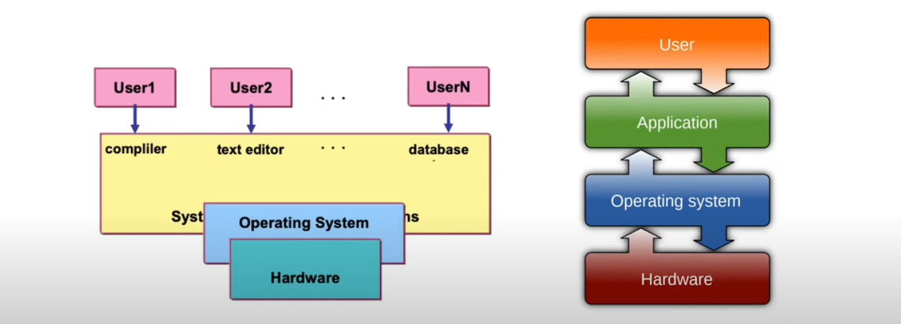
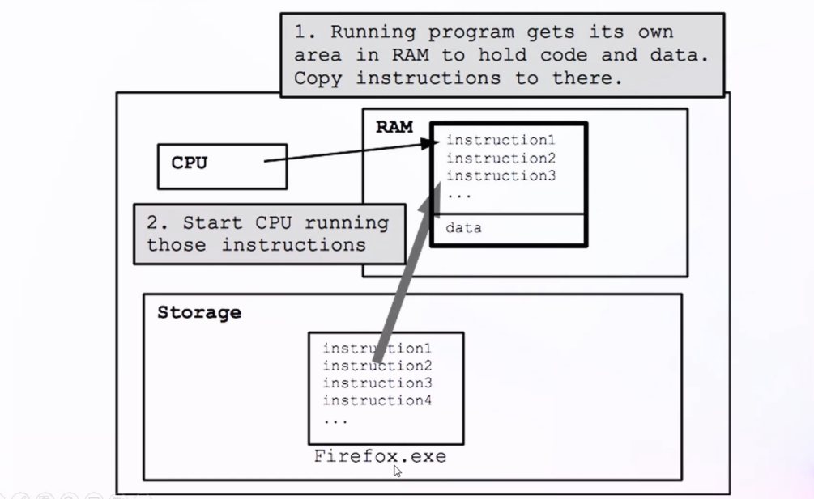
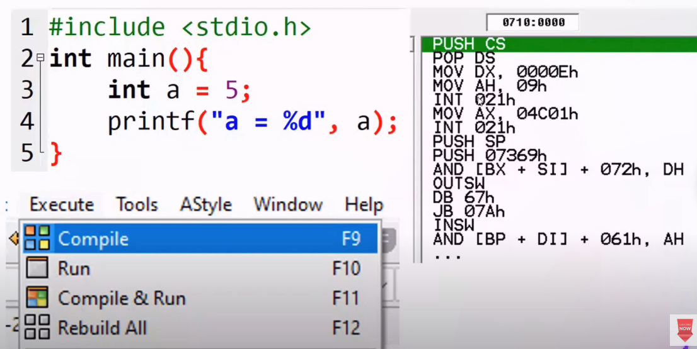
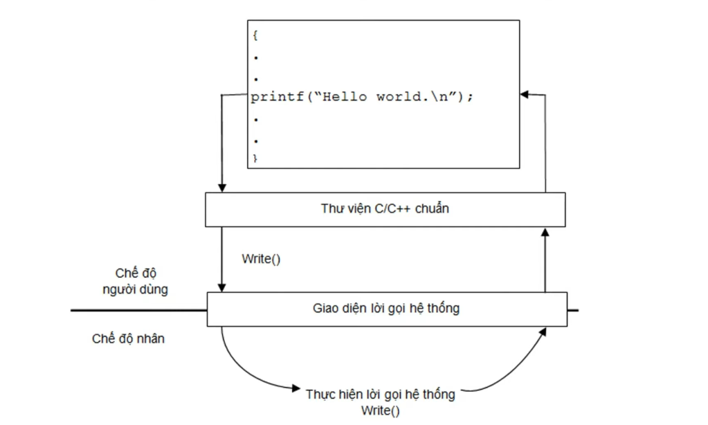
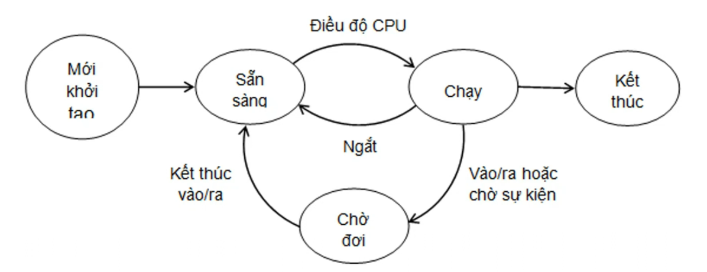

# Operation System

## 1. Computer component

- Phần cứng sử dụng để cung cấp tài nguyên cần thiết cho việc tính toán, xử lý, lưu trữ dữ liệu

- Phần mềm là các chương trình cài đặt trên máy tính

- Phần mềm hệ thống là hệ điều hành, dùng để điều hành, quản trị, điều khiển phần cứng của máy tính, tạo ra nền tảng cho các phần mềm ứng dụng hoạt động (như quản lý CPU, RAM, disk, cung cấp giao diện người dùng để tương tác với hệ thống, thực hiện các tác vụ quản lý file, bảo mật hệ thống,...)

- Phần mềm hệ thống như là hệ điều hành (window, linux, mac OS,...), phần mềm quản lý mạng (network management software), các thiết bị điều khiển thiết bị (device drivers),...

- Phần mềm ứng dụng các ứng dụng ta tải, sử dụng để xử lý thông tin cụ thể cho người dùng (word, postman,...)

- Người dùng sẽ tương tác với Phần mềm ứng dụng

- Các phần mềm chạy trên Hệ điều hành (phần mềm hệ thống)

- Phần mềm ứng dụng hoạt động gián tiếp với Phần cứng thông qua Hệ điều hành

## 2. Operation System Overview

- Hệ điều hành là hệ thống phần mềm đóng vai trò trung gian giữa người dùng/chương trình ứng dụng và phần cứng, nhằm tạo ra môi trường để chạy chương trình một cách thuận tiện, an toàn và hiệu quả

- Có thể nhìn OS theo 2 vai trò chính: resource allocator (bộ phân phối tài nguyên) và control program (chương trình điều khiển, kiểm soát việc sử dụng tài nguyên)

- Resource management tức OS giúp quản lý, đảm bảo phân phối việc sử dụng tài nguyên phần cứng của máy một cách hiệu quả, gồm CPU, main memory/RAM, secondary storage, I/O device, network device,... tới các chương trình

- Khi mở 1 chương trình, OS tạo process cho chương trình đó, cấp không gian địa chỉ bộ nhớ, nạp các phần cần thiết của chương trình vào RAM và chuẩn bị tài nguyên để CPU có thể thực thi

- Không nhất thiết toàn bộ chương trình phải được load hết vào RAM ngay từ đầu; các OS hiện đại thường dùng virtual memory/demand paging, tức là phần nào cần dùng mới được nạp vào RAM

- Tùy vào chương trình thì lượng tài nguyên yêu cầu sẽ khác nhau; OS phụ trách phân phối tài nguyên sao cho hợp lý, kiểm soát tài nguyên còn lại, kiểm tra quyền truy cập và cô lập vùng nhớ để tránh ghi đè, sai sót dữ liệu hoặc truy cập trái phép

- OS quyết định thứ tự, thời điểm và khoảng thời gian tài nguyên được cấp cho chương trình/process tùy theo thuật toán lập lịch, độ ưu tiên và trạng thái hiện tại, nhằm tối ưu hiệu năng, độ phản hồi và giảm thời gian chờ

- Program execution tức OS hỗ trợ nạp, chạy và kết thúc chương trình, đồng thời cung cấp các dịch vụ như I/O, file system, memory management, process management, protection/security và error handling

- Chương trình (program) là tập lệnh ở trạng thái tĩnh nằm trên bộ nhớ ngoài; một chương trình đang trong quá trình thực thi được gọi là tiến trình (process)

- Một chương trình có thể tạo ra nhiều process khác nhau, và một process có thể gồm nhiều thread cùng chia sẻ tài nguyên của process đó

## 3. OS Service

- OS service là các dịch vụ mà HĐH cung cấp để người dùng và chương trình ứng dụng có thể sử dụng phần cứng một cách thuận tiện, an toàn và nhất quán

- Thay vì chương trình phải tự thao tác trực tiếp với phần cứng, chương trình thường gọi API/system call do HĐH cung cấp; HĐH sẽ kiểm tra quyền, quản lý tài nguyên và thực hiện thao tác tương ứng

### 3.1. Program execution

- Program execution tức OS cho phép nạp, chạy, tạm dừng, tiếp tục và kết thúc chương trình

- Basic flow là khi ta click chuột/dùng command line để mở ứng dụng, HĐH nhận yêu cầu, tạo process, cấp không gian địa chỉ bộ nhớ, nạp các phần cần thiết của chương trình từ ổ cứng/SSD vào RAM, rồi lập lịch để CPU thực thi chương trình

- Trong quá trình chạy, OS quản lý tài nguyên mà chương trình cần như CPU, RAM, file, I/O device, network,... và cung cấp cơ chế để chương trình yêu cầu thêm/giải phóng tài nguyên

- HĐH cũng cung cấp nền tảng để chương trình hiển thị giao diện và làm việc với GPU thông qua driver/API đồ họa như DirectX trên Windows hoặc OpenGL/Vulkan tùy nền tảng

- Sau khi chương trình kết thúc, OS thu hồi tài nguyên mà process đang nắm giữ, ví dụ bộ nhớ, file descriptor/handle, socket,...

- Nếu không có OS, developer sẽ phải tự xử lý rất nhiều chi tiết thấp tầng như nạp chương trình, cấp phát bộ nhớ, điều khiển thiết bị, xử lý lỗi và bảo vệ tài nguyên

- Ví dụ: khi bật Firefox.exe, OS tạo process Firefox, nạp các phần cần thiết của file thực thi và thư viện vào RAM theo nhu cầu, cấp tài nguyên cần thiết rồi CPU thực thi các instruction của process; khi Firefox đóng, OS thu hồi tài nguyên của process đó

### 3.2. User Interface

- User Interface tức OS cung cấp cách để người dùng tương tác với HĐH và chương trình

- Command line là dạng giao diện giúp người dùng đưa ra chỉ thị bằng cách gõ các câu lệnh

- Graphic User Interface - GUI - Giao diện đồ họa thì sử dụng hệ thống cửa sổ, sử dụng thiết bị trỏ chuột, bàn phím,...

- Một số hệ thống còn có giao diện cảm ứng, voice UI hoặc remote shell/remote desktop, nhưng bản chất vẫn là lớp giao tiếp giữa người dùng và hệ thống

### 3.3. I/O operations

- I/O operations tức OS hỗ trợ chương trình đọc/ghi dữ liệu và tương tác với thiết bị ngoại vi như bàn phím, chuột, màn hình, ổ đĩa, máy in, card mạng,...

- Thông thường, chương trình không điều khiển trực tiếp phần cứng mà làm việc thông qua driver, buffer/cache, interrupt và system call do OS cung cấp

- Basic flow là thiết bị I/O phát sinh sự kiện hoặc hoàn tất thao tác -> OS/driver nhận tín hiệu -> OS chuyển thành event/dữ liệu phù hợp -> chương trình nhận event/dữ liệu và xử lý

- Ví dụ khi click chuột trong game, OS/driver nhận input từ chuột và chuyển event tới game; game tự tính toán nhân vật sẽ di chuyển thế nào, sau đó yêu cầu hệ thống đồ họa hiển thị frame mới

- Khi ta ấn vào giỏ hàng Shopee chẳng hạn, trình duyệt/app nhận input event, xử lý logic ứng dụng, sau đó OS và graphics stack hỗ trợ hiển thị giao diện mới ra màn hình

#### 3.3.1. Driver

- Driver là phần mềm trung gian giúp hệ điều hành biết cách giao tiếp và điều khiển một thiết bị phần cứng cụ thể

- Có thể hiểu driver như "người phiên dịch" giữa OS và phần cứng: OS đưa ra yêu cầu ở dạng chung hơn, driver chuyển yêu cầu đó thành lệnh mà thiết bị cụ thể hiểu được; ngược lại, driver cũng chuyển tín hiệu từ thiết bị thành dữ liệu/event mà OS và ứng dụng có thể xử lý

- Driver chủ yếu nằm trên máy tính, được cài trong hệ điều hành hoặc được OS tự động tải/cài khi phát hiện thiết bị mới

- Khi cắm thiết bị vào máy tính, thiết bị thường gửi thông tin nhận dạng cho OS, ví dụ loại thiết bị, hãng, model, vendor ID/product ID; sau đó OS tìm driver phù hợp đã có sẵn hoặc yêu cầu cài thêm driver

- Thiết bị cũng có thể có firmware nằm bên trong chính thiết bị. Firmware là phần mềm nhỏ chạy trực tiếp trên thiết bị để giúp thiết bị tự vận hành, còn driver là phần mềm nằm phía máy tính/OS để OS điều khiển thiết bị đó

- Ví dụ với chuột USB: firmware trong chuột đọc cảm biến và nút bấm; driver trên máy tính nhận dữ liệu từ chuột, chuyển nó thành hành động như di chuyển con trỏ, click trái, click phải hoặc cuộn trang

- Ví dụ với máy in: ứng dụng chỉ yêu cầu in tài liệu, OS chuyển yêu cầu đó cho driver máy in, driver biến nội dung cần in thành lệnh phù hợp với đúng model máy in

- Ví dụ với GPU/card màn hình: driver GPU giúp OS và ứng dụng đồ họa/game gửi lệnh render tới card màn hình; nếu thiếu driver phù hợp thì máy vẫn có thể hiển thị ở mức cơ bản, nhưng hiệu năng thấp và không dùng được đầy đủ tính năng tăng tốc đồ họa

- Không phải thiết bị nào cũng cần người dùng tự cài driver thủ công. Nhiều thiết bị phổ biến như chuột, bàn phím, USB storage dùng driver chuẩn có sẵn trong OS; các thiết bị phức tạp hơn như GPU, máy in, card âm thanh chuyên dụng thường cần driver riêng từ nhà sản xuất để hoạt động đầy đủ

- Tóm lại: firmware nằm trong thiết bị để thiết bị tự hoạt động; driver nằm trên máy tính/HĐH để OS có thể nhận biết, điều khiển và trao đổi dữ liệu với thiết bị

### 3.4. File-system manipulation

- File-system manipulation tức OS hỗ trợ tạo, đọc, ghi, xóa, đổi tên, di chuyển, phân quyền và quản lý file/thư mục

- File thường là đơn vị lưu trữ logic trên bộ nhớ ngoài như HDD, SSD, USB, CD/DVD,...; OS ánh xạ file/thư mục thành dữ liệu thật trên thiết bị lưu trữ

- Các thao tác: đọc, ghi, xóa, chép, di chuyển, truy cập, sao lưu,... được OS hỗ trợ thông qua file system và system call/API

- OS kiểm soát quyền truy cập file, lock file khi cần, cache dữ liệu để tăng hiệu năng và bảo vệ dữ liệu tránh ghi sai/ghi đè trái phép

### 3.5. Communication

- Communication tức OS cho phép các process trao đổi thông tin với nhau trên cùng máy hoặc qua mạng

- Trên cùng máy, các cơ chế thường gặp gồm pipe, message queue, shared memory, signal, socket,...

- Qua mạng, OS cung cấp network stack và socket API để chương trình gửi/nhận dữ liệu qua TCP/UDP/IP; còn các giao thức tầng ứng dụng như HTTP thường do ứng dụng hoặc thư viện xử lý

### 3.6. Error detection

- OS phát hiện và xử lý lỗi trong quá trình vận hành, ví dụ lỗi phần cứng, lỗi I/O, lỗi truy cập bộ nhớ, lỗi chia cho 0, lỗi chương trình bị treo hoặc kết thúc bất thường

- Khi có lỗi, OS có thể ghi log, gửi signal/exception, dừng process gây lỗi hoặc thông báo cho người dùng/chương trình

### 3.7. Resource allocation

- Khi nhiều process cùng chạy, OS phải phân phối CPU, RAM, thiết bị I/O, file, network,... sao cho hợp lý

- OS sử dụng các cơ chế như CPU scheduling, memory allocation, I/O scheduling và priority để tránh một chương trình chiếm hết tài nguyên của hệ thống

### 3.8. Accounting

- Accounting tức OS ghi nhận việc sử dụng tài nguyên của từng user/process, ví dụ thời gian CPU, lượng bộ nhớ, dung lượng lưu trữ, số thao tác I/O hoặc network

- Thông tin này có thể dùng để thống kê, tối ưu hiệu năng, giới hạn tài nguyên, tính phí hoặc điều tra lỗi

### 3.9. Protection and security

- Protection tức OS đảm bảo process này không tự ý truy cập tài nguyên của process khác hoặc tài nguyên hệ thống nếu không có quyền

- Security tức OS kiểm soát xác thực người dùng, phân quyền, cô lập process, bảo vệ bộ nhớ, file, thiết bị và network khỏi truy cập trái phép

## 4. Down and Run OS

- HĐH bản thân vẫn là phần mềm hệ thống, được lưu trên bộ nhớ ngoài như SSD/HDD; để chạy được, các thành phần cần thiết của HĐH phải được nạp vào RAM

- Quá trình khởi động HĐH gọi là booting hoặc bootstrapping. Đây là quá trình đưa máy tính từ trạng thái vừa bật nguồn đến trạng thái HĐH đã sẵn sàng cho người dùng/chương trình sử dụng

- Khi bật máy, CPU không tự biết HĐH nằm ở đâu, nên nó bắt đầu chạy firmware có sẵn trên mainboard, thường là BIOS hoặc UEFI

- Firmware sẽ kiểm tra phần cứng cơ bản, ví dụ CPU, RAM, bàn phím, ổ đĩa,... Quá trình kiểm tra ban đầu này thường gọi là POST (Power-On Self-Test)

- Sau đó firmware tìm thiết bị có thể boot được theo boot order, ví dụ SSD, HDD, USB, network boot,...

- Trên hệ thống cũ dùng BIOS/MBR, bootloader giai đoạn đầu thường nằm ở sector đầu tiên của ổ đĩa, gọi là MBR (Master Boot Record)

- Trên hệ thống hiện đại dùng UEFI/GPT, bootloader thường nằm trong EFI System Partition (ESP), không nhất thiết nằm ở sector đầu tiên của ổ đĩa

- Bootloader là chương trình mồi có nhiệm vụ nạp kernel của HĐH vào RAM, truyền các tham số cần thiết cho kernel, rồi chuyển quyền điều khiển cho kernel

- Ví dụ bootloader phổ biến: Windows Boot Manager trên Windows, GRUB trên nhiều hệ thống Linux

- Sau khi kernel được nạp và bắt đầu chạy, kernel khởi tạo các thành phần cốt lõi như memory management, process management, scheduler, driver, file system, I/O subsystem,...

- Kernel không nhất thiết nạp toàn bộ HĐH vào RAM ngay từ đầu; các module, driver hoặc service có thể được nạp theo nhu cầu trong quá trình hệ thống chạy

- Sau khi kernel sẵn sàng, HĐH khởi chạy process đầu tiên của user space, ví dụ `systemd` trên nhiều bản Linux hoặc các system service tương ứng trên Windows

- Các service nền tiếp tục được khởi động, ví dụ network service, login service, graphical interface, security service,... rồi người dùng mới thấy màn hình đăng nhập hoặc desktop

- Tóm lại flow cơ bản là: bật nguồn -> BIOS/UEFI -> chọn boot device -> bootloader -> nạp kernel -> kernel khởi tạo hệ thống -> chạy service/user interface -> HĐH sẵn sàng sử dụng

## 5. OS API

- Thông thường, chương trình ứng dụng không tương tác trực tiếp với hardware. Thay vào đó, chương trình gọi API/thư viện hoặc system call để yêu cầu HĐH thực hiện công việc liên quan tới tài nguyên hệ thống

- System call - lời gọi hệ thống là cơ chế để chương trình chuyển yêu cầu từ user mode sang kernel mode, nhờ kernel thực hiện các thao tác đặc quyền như đọc/ghi file, tạo process, cấp phát bộ nhớ, giao tiếp mạng, thao tác với thiết bị I/O,...

- Vì system call là interface thấp tầng và phụ thuộc vào từng HĐH, developer thường không gọi system call trực tiếp mà dùng OS API hoặc thư viện runtime ở mức cao hơn

- OS API là tập API mà HĐH cung cấp để chương trình yêu cầu dịch vụ từ OS. Ví dụ Windows có Win32 API, Linux/POSIX có các API như `fork`, `exec`, `open`, `read`, `write`, `socket`,...

- Một OS API có thể gọi trực tiếp một system call, gọi nhiều system call, hoặc chỉ xử lý ở tầng thư viện rồi mới gọi system call khi thật sự cần. Vì vậy không nên hiểu OS API luôn luôn là "một loạt system call gói gọn vào một hàm"

- Các ngôn ngữ bậc cao như C, C++, Java,... thường cung cấp thư viện chuẩn/runtime. Developer gọi các hàm quen thuộc ở tầng ngôn ngữ, còn thư viện/runtime sẽ gọi OS API/system call phù hợp bên dưới

- Ví dụ trong Java, khi gọi `System.out.println(...)`, code Java không tự ghi trực tiếp ra màn hình/phần cứng; JVM và thư viện Java xử lý output stream, sau đó có thể gọi API/system call của OS để ghi dữ liệu ra console/terminal

- OS API giúp chương trình dễ viết hơn, ít phụ thuộc hơn vào chi tiết kernel/system call cụ thể. Tuy nhiên chương trình vẫn có thể phụ thuộc vào HĐH nếu dùng API riêng của HĐH đó, ví dụ Win32 API chỉ có trên Windows

- Khi đổi version HĐH, chương trình dùng API ổn định thường ít phải sửa hơn so với việc gọi trực tiếp interface thấp tầng, vì HĐH/thư viện cố gắng giữ tương thích ngược cho API

### 5.1. Compile-time

- Compile-time là giai đoạn trước khi chương trình chạy, khi compiler kiểm tra và chuyển đổi mã nguồn sang dạng mà máy/runtime có thể thực thi, ví dụ machine code, bytecode hoặc intermediate representation

- Quá trình biên dịch thông qua 1 compiler

- Compile - biên dịch là quá trình chuyển đổi code của ngôn ngữ bậc cao sang dạng thấp hơn. Với C/C++ thường là mã máy trong executable file; với Java thường là bytecode `.class`; với một số ngôn ngữ khác có thể là intermediate representation

- Compile không có nghĩa là chuyển code thành system call. System call chỉ xuất hiện khi chương trình đang chạy và cần nhờ OS thực hiện thao tác đặc quyền

- Với ngôn ngữ compiled như C/C++, sau khi biên dịch xong thì executable có thể chạy mà không cần biên dịch lại, trừ khi mã nguồn thay đổi hoặc cần build lại cho nền tảng khác

- Với Java, compiler `javac` biên dịch source code thành bytecode; khi chạy, JVM có thể interpret bytecode hoặc JIT compile một phần bytecode thành machine code để tối ưu hiệu năng

- Nhược điểm của compile-time là mất thời gian build trước khi run; ưu điểm là phát hiện được nhiều lỗi sớm và thường cho hiệu năng tốt hơn khi chạy

#### 5.1.1. Machine code, bytecode khác gì với OS API, system call?

- Machine code và bytecode là dạng biểu diễn của chương trình sau khi code được biên dịch

- OS API và system call là cách chương trình đang chạy yêu cầu HĐH thực hiện một công việc nào đó

- Source code là code do developer viết, ví dụ file `.java`, `.c`, `.cpp`

- Machine code là mã máy mà CPU có thể hiểu và thực thi trực tiếp

- Bytecode là mã trung gian cho runtime/virtual machine hiểu, ví dụ Java bytecode trong file `.class`; CPU không chạy trực tiếp Java bytecode mà JVM sẽ interpret hoặc JIT compile bytecode thành machine code khi cần

- OS API là các hàm/interface mà OS hoặc thư viện hệ thống cung cấp để chương trình gọi, ví dụ Win32 API trên Windows hoặc POSIX API trên Linux/Unix-like

- System call là lời gọi xuống kernel để HĐH thực hiện thao tác đặc quyền, ví dụ đọc/ghi file, tạo process, mở socket, cấp phát/ánh xạ bộ nhớ hoặc thao tác với thiết bị I/O

- Điểm khác nhau cốt lõi: machine code/bytecode trả lời câu hỏi "chương trình được biểu diễn dưới dạng gì để máy/runtime chạy?", còn OS API/system call trả lời câu hỏi "khi chương trình đang chạy, nó nhờ HĐH làm việc gì bằng cách nào?"

- Một chương trình sau khi compile thành machine code hoặc bytecode không biến thành system call. Nó vẫn là chương trình; bên trong chương trình đó có thể có những đoạn khi chạy sẽ gọi OS API/system call

- Ví dụ với C: `printf("Hello")` nằm trong source code -> compiler biên dịch thành machine code trong executable file -> khi chương trình chạy tới `printf`, thư viện C có thể gọi OS API/system call để ghi dữ liệu ra terminal

- Ví dụ với Java: `System.out.println("Hello")` nằm trong source code `.java` -> `javac` compile thành bytecode `.class` -> JVM load bytecode vào runtime -> JVM verify bytecode để kiểm tra tính hợp lệ/an toàn -> JVM interpret bytecode hoặc JIT compile những đoạn chạy nhiều thành machine code -> CPU thực thi machine code -> khi tới đoạn in ra màn hình, JVM/thư viện Java có thể gọi OS API/system call để ghi dữ liệu ra console/terminal

- Java cần thêm bước JVM vì `javac` không compile thẳng `.java` thành machine code native như C/C++ thường làm. `javac` tạo ra bytecode trung gian, còn CPU không hiểu trực tiếp Java bytecode, nên cần JVM xử lý bytecode khi chạy

- JVM cung cấp các runtime services như class loading, bytecode verification, interpretation, JIT compilation, garbage collection, exception handling và thread management

- Nhờ bytecode chạy trên JVM, cùng một chương trình Java có thể chạy trên nhiều HĐH/CPU khác nhau nếu có JVM phù hợp cho nền tảng đó. Đây là ý tưởng "write once, run anywhere"

## 6. OS Component

OS component là các thành phần/chức năng chính bên trong HĐH để quản lý tài nguyên và cung cấp dịch vụ cho chương trình.

### 6.1. Process management

- Process - tiến trình là một chương trình đang chạy, được OS cấp tài nguyên như CPU time, RAM, file descriptor/handle, I/O resource,...

- Program là file/chương trình ở trạng thái tĩnh nằm trên bộ nhớ ngoài; process là trạng thái động của program khi đang được thực thi

- Process management phụ trách tạo process, kết thúc process, tạm dừng/khôi phục process, lập lịch CPU, chuyển ngữ cảnh (context switching), đồng bộ hóa và giao tiếp giữa các process

- OS lưu thông tin quản lý process trong cấu trúc như PCB (Process Control Block), gồm PID, trạng thái process, program counter, register, thông tin bộ nhớ, tài nguyên đang giữ,...

### 6.2. Memory management

- Memory management phụ trách quản lý bộ nhớ chính/RAM và không gian địa chỉ của process

- RAM là bộ nhớ chính, nơi chứa các phần cần thiết của process và dữ liệu đang được sử dụng để CPU có thể truy cập nhanh

- RAM được chia thành các ô nhớ/byte có địa chỉ; OS quản lý việc vùng nhớ nào đang được dùng, vùng nào còn trống, vùng nào thuộc process nào

- OS cấp phát và thu hồi bộ nhớ cho process, ánh xạ địa chỉ ảo sang địa chỉ vật lý, hỗ trợ virtual memory, paging/swapping, memory protection và ngăn process truy cập vùng nhớ không hợp lệ

- Nhờ virtual memory, mỗi process có cảm giác như sở hữu một không gian địa chỉ riêng, giúp cô lập process và tăng độ an toàn

### 6.3. I/O management

- I/O management phụ trách quản lý các thiết bị nhập/xuất như bàn phím, chuột, màn hình, ổ đĩa, máy in, card mạng, USB,...

- Chương trình thường không điều khiển trực tiếp thiết bị, mà gửi yêu cầu I/O cho OS; OS làm việc với driver để điều khiển thiết bị cụ thể

- Driver là phần mềm nằm trên máy tính/HĐH, giúp OS biết cách giao tiếp với thiết bị phần cứng cụ thể

- Buffer là vùng nhớ tạm dùng để chứa dữ liệu trong lúc truyền giữa chương trình, OS và thiết bị, giúp xử lý sự khác biệt tốc độ giữa các bên

- Cache là vùng lưu dữ liệu thường dùng hoặc vừa dùng gần đây để lần truy cập sau nhanh hơn, ví dụ disk cache

- OS cũng xử lý interrupt từ thiết bị, hàng đợi I/O, kiểm soát lỗi I/O và chia sẻ thiết bị giữa nhiều process

#### 6.3.1. I/O workflow và data transfer

- I/O là viết tắt của Input/Output, tức nhập/xuất dữ liệu giữa chương trình/máy tính với thiết bị bên ngoài hoặc tài nguyên bên ngoài CPU/RAM

- Input là dữ liệu đi từ thiết bị vào hệ thống, ví dụ bàn phím gửi phím vừa bấm, chuột gửi tọa độ di chuyển, ổ đĩa gửi dữ liệu file, card mạng nhận packet từ internet

- Output là dữ liệu đi từ hệ thống ra thiết bị, ví dụ màn hình hiển thị frame mới, loa phát âm thanh, ổ đĩa ghi file, card mạng gửi request HTTP, máy in in tài liệu

- Chương trình ứng dụng thường không nói chuyện trực tiếp với thiết bị. Workflow phổ biến là: application -> thư viện/runtime -> OS API/system call -> kernel -> driver -> controller/thiết bị -> dữ liệu/sự kiện quay ngược lại nếu cần

- Thiết bị phần cứng thường có controller riêng, ví dụ disk controller, network card controller, USB controller, GPU controller. Driver là phần mềm phía OS biết cách gửi lệnh cho controller đó

- Khi chương trình cần I/O, nó gửi yêu cầu cho OS, ví dụ "đọc file này", "ghi dữ liệu này ra socket", "in tài liệu này", "vẽ frame này ra màn hình"

- OS kiểm tra quyền truy cập, kiểm tra tài nguyên, đưa request vào hàng đợi I/O nếu cần, rồi gọi driver phù hợp

- Driver chuyển request của OS thành lệnh cụ thể cho thiết bị. Ví dụ driver ổ đĩa biết cách yêu cầu SSD đọc block dữ liệu; driver card mạng biết cách gửi packet ra network interface

- Khi thiết bị hoàn tất hoặc có dữ liệu mới, thiết bị có thể báo cho CPU/OS bằng interrupt. Interrupt là tín hiệu ngắt để OS biết rằng có sự kiện cần xử lý, ví dụ phím vừa được bấm hoặc dữ liệu từ ổ đĩa đã đọc xong

- Sau khi nhận interrupt, OS/driver lấy dữ liệu từ thiết bị hoặc xác nhận thao tác đã hoàn tất, cập nhật trạng thái request, rồi đánh thức process đang chờ nếu process bị block

- Buffer là vùng nhớ tạm để chứa dữ liệu đang được truyền. Buffer giúp cân bằng tốc độ giữa các bên, vì CPU/RAM thường nhanh hơn thiết bị I/O rất nhiều

- Cache là vùng lưu dữ liệu đã dùng hoặc có khả năng dùng lại để tăng tốc. Ví dụ đọc file lần đầu từ SSD có thể chậm hơn, nhưng lần sau OS có thể trả dữ liệu từ file cache trong RAM

- Blocking I/O là khi process gửi yêu cầu I/O rồi chờ tới khi thao tác hoàn tất mới chạy tiếp. Ví dụ chương trình gọi đọc file và đứng chờ dữ liệu đọc xong

- Non-blocking/asynchronous I/O là khi process gửi yêu cầu I/O rồi tiếp tục làm việc khác; khi I/O xong, OS sẽ báo lại bằng event, callback, future/promise, signal hoặc cơ chế tương tự tùy nền tảng

- DMA (Direct Memory Access) là cơ chế cho phép thiết bị truyền dữ liệu trực tiếp tới/từ RAM mà không cần CPU copy từng byte. CPU chỉ thiết lập request, thiết bị tự transfer dữ liệu, xong thì báo interrupt. Cách này giúp giảm tải CPU khi truyền dữ liệu lớn như đọc file, network, âm thanh, video

##### 6.3.1.1. Ví dụ 1: Gõ bàn phím

- Người dùng bấm phím `A`

- Keyboard controller phát hiện phím được bấm và gửi tín hiệu tới máy tính

- OS/keyboard driver nhận interrupt hoặc event từ thiết bị

- Driver chuyển tín hiệu phần cứng thành key event, ví dụ phím nào được bấm, đang nhấn hay thả ra

- OS đưa event này tới ứng dụng đang focus, ví dụ trình soạn thảo

- Ứng dụng xử lý event và hiển thị chữ `A`; phần hiển thị tiếp tục đi qua graphics stack/GPU để vẽ ra màn hình

##### 6.3.1.2. Ví dụ 2: Di chuyển/click chuột trong game

- Chuột gửi dữ liệu di chuyển hoặc click về máy tính qua USB/Bluetooth

- OS/driver nhận dữ liệu input và chuyển thành mouse event, ví dụ tọa độ mới, click trái, click phải

- Game nhận event từ OS

- Game tự tính toán logic, ví dụ nhân vật cần di chuyển tới vị trí nào

- Game gửi lệnh render frame mới qua graphics API; OS/driver GPU hỗ trợ đưa lệnh tới GPU để hiển thị kết quả trên màn hình

##### 6.3.1.3. Ví dụ 3: Đọc file từ SSD

- Ứng dụng gọi API đọc file, ví dụ đọc `data.txt`

- Lời gọi đi qua thư viện/runtime rồi xuống system call như `read`

- Kernel kiểm tra quyền đọc file, tìm metadata của file trong file system, xác định file nằm ở block nào trên SSD

- Nếu dữ liệu đã có trong file cache của OS thì OS có thể trả về từ RAM rất nhanh

- Nếu chưa có cache, OS gửi request đọc block cho driver ổ đĩa

- Driver giao tiếp với SSD/controller để đọc dữ liệu; dữ liệu thường được transfer vào RAM bằng DMA

- Khi đọc xong, thiết bị báo interrupt; OS cập nhật cache/buffer và copy hoặc map dữ liệu về vùng nhớ mà ứng dụng có thể đọc

- Ứng dụng nhận dữ liệu và tiếp tục xử lý

##### 6.3.1.4. Ví dụ 4: Ghi file xuống SSD

- Ứng dụng gọi API ghi file, ví dụ lưu nội dung vào `note.txt`

- Kernel kiểm tra quyền ghi, cập nhật metadata/file system nếu cần

- Dữ liệu có thể được ghi vào page cache/buffer trong RAM trước, rồi OS trả kết quả cho ứng dụng khá nhanh

- Sau đó OS flush dữ liệu từ cache xuống SSD vào thời điểm phù hợp, hoặc flush ngay nếu ứng dụng yêu cầu đồng bộ dữ liệu bằng cơ chế như `fsync`

- Driver ổ đĩa gửi lệnh ghi xuống SSD/controller; khi ghi xong thiết bị báo lại cho OS

- Vì có cache nên đôi khi ứng dụng tưởng là đã ghi xong, nhưng dữ liệu vẫn đang chờ flush xuống thiết bị. Đây là lý do mất điện đột ngột có thể làm mất dữ liệu chưa kịp ghi thật xuống ổ

##### 6.3.1.5. Ví dụ 5: Gửi request qua mạng

- Ứng dụng muốn gửi dữ liệu qua mạng, ví dụ browser gửi HTTP request

- Browser/thư viện network tạo dữ liệu HTTP, sau đó gọi socket API của OS

- OS network stack chia dữ liệu thành các packet TCP/IP phù hợp

- OS gửi packet cho driver card mạng

- Network card truyền packet ra Wi-Fi/Ethernet

- Khi có packet phản hồi từ server, card mạng nhận packet và báo interrupt cho OS

- OS network stack xử lý packet, ghép dữ liệu lại đúng stream/socket, rồi đánh thức browser nhận response

##### 6.3.1.6. Ví dụ 6: In tài liệu

- Ứng dụng gửi yêu cầu in tài liệu cho OS/print service

- Print service đưa job vào hàng đợi in, vì máy in thường xử lý chậm hơn CPU rất nhiều

- Driver máy in chuyển tài liệu thành định dạng/lệnh mà đúng model máy in hiểu được

- OS gửi dữ liệu tới máy in qua USB/Wi-Fi/network

- Máy in nhận dữ liệu, in từng trang và báo trạng thái như đang in, hết giấy, kẹt giấy hoặc hoàn tất

##### 6.3.1.7. Ví dụ 7: Phát nhạc

- Ứng dụng nghe nhạc đọc dữ liệu audio từ file hoặc network

- Dữ liệu audio được decode thành stream âm thanh

- Ứng dụng gửi buffer âm thanh cho OS/audio API

- OS/audio driver chuyển dữ liệu tới sound card hoặc chip âm thanh

- Thiết bị âm thanh phát tín hiệu ra loa/tai nghe. Vì âm thanh cần liên tục, OS phải cấp buffer đều đặn; nếu buffer bị thiếu có thể nghe bị giật/khựng

### 6.4. File-system management

- File là đơn vị lưu trữ logic gồm các dữ liệu có liên quan với nhau; file thường được lưu trên bộ nhớ ngoài như SSD/HDD/USB

- File-system management phụ trách tổ chức file/thư mục, lưu metadata, quản lý đường dẫn, quyền truy cập, dung lượng, block dữ liệu và ánh xạ file logic xuống thiết bị lưu trữ vật lý

- OS hỗ trợ các thao tác như tạo, mở, đọc, ghi, đóng, xóa, đổi tên, di chuyển, copy, lock file, backup và kiểm tra quyền truy cập

- OS cũng cache dữ liệu file để tăng hiệu năng, đồng thời cần đảm bảo dữ liệu không bị ghi sai hoặc hỏng khi mất điện/lỗi hệ thống tùy file system

### 6.5. Networking

- Networking component phụ trách quản lý thiết bị mạng và cung cấp network stack để chương trình giao tiếp qua mạng

- OS quản lý card mạng LAN, Wi-Fi, Bluetooth,... thông qua driver tương ứng

- OS thường hỗ trợ các giao thức tầng thấp/trung như Ethernet, IP, TCP, UDP và cung cấp socket API để chương trình gửi/nhận dữ liệu

- Các giao thức tầng ứng dụng như HTTP, HTTPS, FTP,... thường do ứng dụng hoặc thư viện xử lý, không phải phần cốt lõi mà OS trực tiếp thực hiện thay ứng dụng

### 6.6. Protection and security

- Protection giúp đảm bảo process này không truy cập trái phép vào vùng nhớ, file, thiết bị hoặc tài nguyên của process khác

- Security liên quan tới xác thực người dùng, phân quyền, kiểm soát truy cập, cô lập process, audit/logging và bảo vệ hệ thống khỏi hành vi không hợp lệ

- Ví dụ: user thường không được ghi vào file hệ thống nếu không có quyền admin/root; process không được đọc vùng nhớ kernel hoặc vùng nhớ riêng của process khác

### 6.7. System call interface

- System call interface là lớp giao tiếp giữa chương trình ở user mode và kernel ở kernel mode

- Khi chương trình cần thao tác đặc quyền như đọc file, tạo process, cấp phát bộ nhớ, mở socket hoặc giao tiếp thiết bị, chương trình sẽ đi qua API/thư viện rồi xuống system call

- Thành phần này giúp OS kiểm soát yêu cầu từ chương trình, kiểm tra quyền, chuyển sang kernel mode và trả kết quả/lỗi về lại chương trình

## 7. Kernel

- Nhân - kernel là thành phần quan trọng nhất của HĐH, là thành phần thực thi các chức năng cơ bản nhất của HĐH, thường xuyên được giữ trong bộ nhớ

- Kernel cơ bản là tập hợp các tập tin, câu lệnh, dòng lệnh, hàm luôn lưu giữ trong RAM để khi cần sử dụng thì thực hiện

- Thay vì load toàn bộ HĐH vào RAM (chiếm rất nhiều RAM) thì người ta chỉ chọn các thành phần quan trọng nhất, không thể thiếu để load vào RAM (chỉ load Kernel)

- Vi nhân thì chỉ load những phần thực sự cần sử dụng vào RAM (giờ tôi cần tương tác với file, tôi mới load nó vào RAM -> sử dụng RAM ít hơn tuy nhiên đánh đổi thời gian load vào RAM)

## 8. Process

- Program - chương trình là thể tĩnh, không thay đổi theo thời gian, không sở hữu tài nguyên

- Process - tiến trình là thể động, là trạng thái của chương trình khi đang thực thi, được phân bổ 1 lượng tài nguyên nhất định như CPU, RAM để thực thi tiến trình

- Process bao gồm các lệnh, chỉ thị cho CPU thực thi (tại thời điểm call api, CPU sẽ tính toán gì, làm gì, trả dữ liệu thế nào, điều khiển thiết bị thế nào,...)

- Thông tin hoạt động hiện tại của process gồm các nội dung con trỏ lệnh, nội dung các thanh ghi của CPU

- Stack của process chứa dữ liệu tạm thời, các biến cục bộ của hàm, phương thức, mỗi khi 1 hàm được gọi, stack frame được tạo ra để lưu trữ các biến cục bộ + khi hàm kết thúc, stack frame sẽ được giải phóng + stack được quản lý tự động bởi OS

- Heap là vùng tập hợp tất cả các thành phần của 1 process, lưu trữ dữ liệu mà tồn tại trong thời gian chạy của process + giả sử 1 process chỉ được cấp 200mb RAM, nhưng nó lại dùng tới 210mb RAM -> báo lỗi Out Of Memory + Heap thường sử dụng để cấp phát bộ nhớ động + mem không tự động giải phóng mà sử dụng Garbage collector để thu hồi + 1 process sẽ có 1 Heap duy nhất

- Process gồm 2 loại: process người dùng được sinh ra khi người dùng chạy chương trình ứng dụng (google, word,...) + process hệ thống được sinh ra từ các thành phần của HĐH (window driver, service host,...)

### 8.1. Trạng thái của process

- Bất kỳ process nào cũng sẽ nằm ở 1 trạng thái nhất định

- Các process có thể được chuyển đổi qua lại để CPU thực thi khi (thường xảy ra khi có ngắt/ hoạt động khiến process này đợi và CPU không cần làm gì)

- Mới khởi tạo: tức process đang được tạo ra, thông thường ở trạng thái này thì program chưa được tải vào trong RAM, chỉ như vừa khởi tạo thôi

- Lúc này HĐH sẽ gán id cho process -> tạo không gian nhớ cho process + PCB

- Kích thước không gian nhớ được tính toán dựa tr

- Sẵn sàng: sau khi program được tải vào trong RAM, nó sẽ sẵn sàng thực thi, chờ CPU thực thi các câu lệnh của nó

- Chạy: CPU thực thi các câu lệnh mà process cung cấp (tất cả các chương trình đều là những câu lệnh, hàm được sắp xếp từ trên xuống dưới)

- Chờ đợi: đôi khi process đang chạy thì nó lại chờ đợi các sự kiện như: đợi thao tác nhập xuất dữ liệu rồi thực thi tiếp chẳng hạn

- Kết thúc: process không còn nằm trong sự quản lý nhưng chưa bị xóa đi bằng cách gọi system call exit()

- Thường kết thúc do: sau khi thực thi xong/ bị parent process kết thúc/ do lỗi/ process yêu cầu nhiều memory hơn so với bộ nhớ hiện có của máy/ process thực thi lâu hơn giới hạn

### 8.2. PCB - Process Control Block

- PCB - Process Control Block chứa thông tin về process, tên gọi của khối này có thể thay đổi dựa trên từng loại HĐH

- PCB chứa id của process (PID - Process Identifier) để phân biệt giữa các process

- Trạng thái của process

- Chứa nd của 1 số thanh ghi trên CPU thực thi process này

- Chứa thông tin bộ nhớ, tài nguyên, thống kê của 1 process

## 9. Scheduling

- HĐH support scheduling (lập lịch) để quyết định thứ tự process nào được sử dụng tài nguyên phần cứng khi nào, trong bao lâu (CPU, RAM, I/O device)

- Tại 1 thời điểm thì chỉ có 1 process được cấp CPU để thực thi (máy 1 CPU) vì CPU chỉ đảm nhiệm 1 công việc tại 1 thời điểm

## 10. Thread

- Thread - luồng thực hiện = 1 đơn vị thực thi của 1 process = 1 chuỗi các lệnh được cấp phát CPU để thực thi độc lập

- Bản chất process chỉ là 1 chuỗi các câu lệnh nối tiếp nhau + CPU sẽ đọc các câu lệnh này và thực thi + nếu như 1 process mà có nhiều chuỗi lệnh và mỗi chuỗi lệnh có thể thực thi độc lập với nhau trong cùng 1 thời điểm thì ta có thể gọi nó là những thread

### 10.1. Example

- 2 api có thể call đồng thời tại 1 thời điểm + nó là 1 phần của chương trình của bạn -> có thể gọi mỗi lần call này là 1 thread

- ta vừa có thể 1 thread hiển thị giao diện lướt web, trong khi 1 thread vẫn đang tải tệp tin

- 1 server có thể access bởi nhiều người dùng trên toàn cầu, server tạo mỗi thread cho từng client mỗi lần client truy cập để có thể phục vụ đồng thời, song song

- Các HĐH hỗ trợ multi-thread, cho phép thực thi đồng thời 1 lúc nhiều thread

- Quá trình tạo thread nhanh hơn nhiều lần so với tạo mới process (tạo process thì cần load vào ram, gán id,... còn thread là lấy 1 đoạn code trong RAM, chạy song song với đoạn code khác thì tất nhiên sẽ nhanh hơn)

- Các Thread chia sẻ không gian nhớ, tài nguyên của Process mà nó nằm trong -> có thể gây race-condition

### 10.2. OS Thread - Platform Thread

- OS Thread - Platform Thread - là các thread do HĐH quản lý và tạo ra + HĐH cung cấp các API cho application có thể yêu cầu tới HĐH để yêu cầu tạo, xóa, thay đổi, scheduling tới thread do OS quản lý

- Cái gì nằm trong nhân cũng sẽ mạnh hơn tầng application -> khả năng xử lý đồng thời sẽ mạnh hơn so với thread ở tầng application tự quản

- OS Thread được cấp nhiều CPU để thực hiện song song

- Nhược điểm là cần system-call để application có thể yêu cầu HĐH quản lý thread

- Trước Java 19, Java có sử dụng OS Thread để xử lý các thread: 1 thread java truyền thống sẽ ánh xạ trực tiếp vào 1 thread + vì vậy khi handle 1 lượng lớn các request thì sẽ gặp khó khăn trong việc quản lý, tiêu tốn tài nguyên vì 1 phần cũng là do HĐH thường có giới hạn số lượng quản lý thread để trở nên hiệu quả

### 10.3. Virtual Thread

- Virtual Thread - là các thread do chính application tự tạo ra và quản lý, HĐH không biết tới sự tồn tại của các thread này

- Virtual Thread ra đời để giải quyết vấn đề giới hạn số lượng của OS Thread bị phụ thuộc quá nhiều vào các tài nguyên máy tính (CPU, kết nối mạng,...)

- Mọi thông tin nằm trong chương trình -> việc thread switching không đòi hỏi phải chuyển xuống chế độ nhân, tiết kiệm thời gian hơn (do không cần sử dụng system-call nên nó sẽ tiết kiệm thời gian hơn)

- Application tự quản, không phụ thuộc vào sự scheduling của HĐH

- Có thể sử dụng trên các HĐH không support multi-thread do nằm ở tầng application

- Từ Java 19+, default về Thread là sử dụng Virtual Thread, trước kia là sử dụng OS Thread với mỗi Thread được tạo ra: thay vì sử dụng OS Thread cho mỗi thread, mà cung cấp 1 thread dạng nhẹ, không gán với OS Thread như trước nữa + được quản lý bởi tầng application, được chính JVM quản lý => giúp scale hệ thống dễ dàng hơn, dễ tạo, dễ hủy thread mà không tốn nhiều chi phí như trước + có thể tạo và sử dụng hàng ngàn, hàng triệu thread trong application mà không làm quá tải HĐH, giúp ích trong các microservice application yêu cầu tính đồng thời cao
