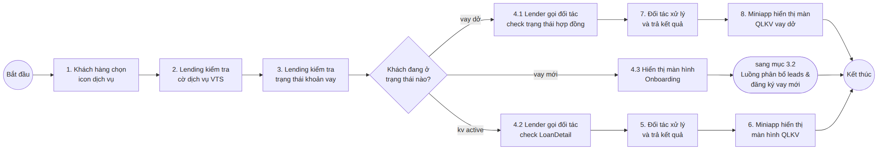
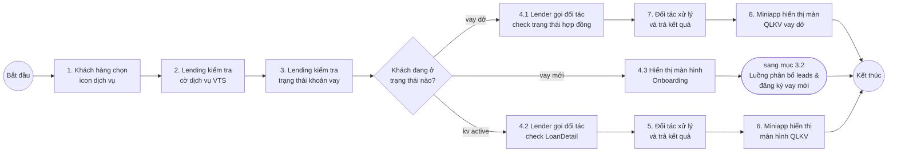
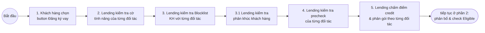
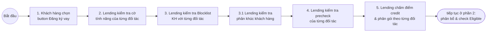
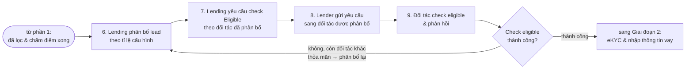
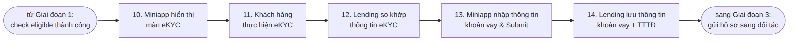
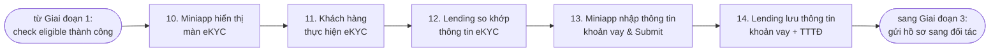
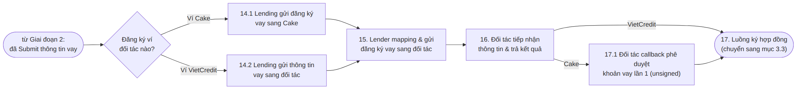
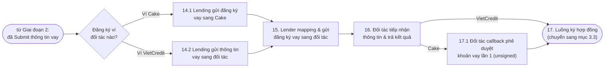

# Quy trình nghiệp vụ — Ví trả sau (mục 3)

> Tài liệu này diễn giải lại mục **3. Quy trình nghiệp vụ** trong tài liệu thiết kế *"Ví trả sau - Nền tảng"*, bằng ngôn ngữ dễ hiểu cho người mới. Bản gốc chỉ có sơ đồ activity, không có chữ giải thích, nên mình vẽ lại + viết thêm phần "vì sao lại làm vậy" theo logic nghiệp vụ chung, để đọc vào là hiểu ngay không cần đoán. File này sẽ được bổ sung dần khi đọc tới các mục con tiếp theo (3.3, 3.4...).
>
> Bối cảnh chung: Viettel Money không tự thẩm định/cho vay, mà đóng vai trò nền tảng — hệ thống **Lending** ra quyết định nghiệp vụ, còn **Lender** là lớp trung gian duy nhất được gọi thẳng sang hai đối tác cho vay thật là **Cake** và **VietCredit**. Hai mục dưới đây là hai bước đầu tiên trong hành trình vay: khách vào app thấy gì (3.1), rồi khách đăng ký vay thì hệ thống xử lý ra sao (3.2).

---

## 3.1. Luồng truy cập dịch vụ

Đây là **bước đầu tiên** khi khách hàng bấm vào icon dịch vụ vay (Ví trả sau) trên app Viettel Money. Trước khi có bất kỳ nghiệp vụ vay nào diễn ra, Lending đóng vai người gác cổng — quyết định khách sẽ được dẫn tới màn hình nào.

### Sơ đồ tổng quan

Xem mã Mermaid (nếu bạn dùng công cụ có hỗ trợ render Mermaid, hoặc muốn sửa lại sơ đồ)

**Đọc nhanh:** khách bấm icon → hệ thống check xem dịch vụ có mở không → check khách đang "ở đâu" trong hành trình vay (chưa vay / đang làm hồ sơ dở / đã có khoản vay) → tùy vào đó mà gọi đúng loại thông tin cần và đẩy khách sang đúng màn hình, không có màn hình nào là "một cho tất cả".

### Giải thích từng bước

#### Bước 1 — Khách hàng chọn icon dịch vụ

Đây là hành động khởi phát: khách mở app Viettel Money, thấy icon "Ví trả sau" (hoặc tên hiển thị tương tự) và bấm vào. Từ đây, mọi thứ phía sau đều do backend quyết định giúp khách, khách không cần biết đằng sau có bao nhiêu bước.

#### Bước 2 — Lending kiểm tra cờ dịch vụ VTS

Trước khi làm bất cứ điều gì, hệ thống Lending check một cái "cờ" (feature flag) tên VTS — nhiều khả năng là viết tắt của chính dịch vụ "Ví Trả Sau". Mục đích thường thấy của loại cờ này là để **bật/tắt dịch vụ theo từng nhóm khách, từng kênh, hoặc từng giai đoạn triển khai** (ví dụ: mở dần cho một số tỉnh/thuê bao trước khi mở toàn quốc, hoặc tắt tạm khi cần bảo trì) mà không cần deploy lại code.

> Sơ đồ gốc không vẽ nhánh "cờ tắt thì làm gì" — có thể vì trường hợp đó được xử lý từ sớm hơn (ví dụ: icon bị ẩn luôn nếu cờ tắt, nên không tới được bước này). Bạn nên hỏi lại BA/đội nghiệp vụ để chắc VTS là viết tắt của gì và nhánh "tắt" đi về đâu.

#### Bước 3 — Lending kiểm tra trạng thái khoản vay của khách hàng

Đây là bước quan trọng nhất của cả luồng: hệ thống tự hỏi "khách này đang ở giai đoạn nào trong hành trình vay?" trước khi quyết định cho khách xem cái gì. Có 3 khả năng, và mỗi khả năng dẫn tới một trải nghiệm hoàn toàn khác:

- **vay dở** — khách đã bắt đầu đăng ký nhưng chưa hoàn tất (chưa ký hợp đồng, hoặc hồ sơ đang chờ xử lý).
- **vay mới** — khách chưa từng đăng ký vay, đây là lần đầu.
- **kv active** — khách đã có khoản vay đang chạy (đã ký hợp đồng, đang trong thời gian sử dụng/trả nợ).

**Vì sao phải tách 3 nhánh riêng thay vì gọi một API chung "lấy trạng thái"?** Vì mỗi trạng thái cần một loại dữ liệu khác nhau và dẫn tới một màn hình khác nhau: khách vay dở cần biết "hồ sơ đang tới đâu" để tiếp tục điền, khách đang vay active cần biết "còn nợ bao nhiêu, khi nào phải trả" để quản lý khoản vay, còn khách mới thì chưa có gì để tra cả — chỉ cần đưa thẳng vào onboarding. Tách nhánh sớm giúp hệ thống chỉ gọi đúng API cần dùng, không tốn request dư thừa.

#### Nhánh "vay dở" — tiếp tục hồ sơ đang làm

`4.1 Lender gọi đối tác check trạng thái hợp đồng` → `7. Đối tác xử lý và trả kết quả` → `8. Miniapp hiển thị màn QLKV vay dở`

Vì hồ sơ chưa xong nên **chưa có khoản vay thật để tra** — thứ cần biết ở đây là "hợp đồng/hồ sơ đang ở bước nào" (ví dụ: đang chờ đối tác thẩm định, đang chờ khách ký...). Lender gọi sang đối tác (Cake hoặc VietCredit, tùy khách đang làm hồ sơ ở bên nào) để lấy trạng thái đó, rồi Miniapp hiển thị một màn hình QLKV riêng cho trường hợp "dở" — mục đích là để khách **tiếp tục** đúng chỗ đang làm, thay vì phải đăng ký lại từ đầu.

#### Nhánh "vay mới" — bắt đầu hành trình vay

`4.3 Hiển thị màn hình Onboarding` → chuyển sang mục 3.2 (Luồng phân bổ leads và đăng ký vay mới)

Đây là nhánh đơn giản nhất: chưa có gì để tra cứu cả nên không cần gọi đối tác ở bước này. Hệ thống chỉ việc đưa khách vào màn hình Onboarding để bắt đầu quy trình đăng ký — phần đăng ký chi tiết (chọn gói vay, điền thông tin, eKYC...) được xử lý ở một luồng riêng, mục 3.2, không nằm trong phạm vi của "Luồng truy cập dịch vụ" này. Nói cách khác, mục 3.1 chỉ làm nhiệm vụ **điều hướng (routing)**, còn nghiệp vụ vay thật sự nằm ở các mục sau.

#### Nhánh "kv active" — quản lý khoản vay đang có

`4.2 Lender gọi đối tác check LoanDetail` → `5. Đối tác xử lý và trả kết quả` → `6. Miniapp hiển thị màn hình QLKV`

Khách đã có khoản vay thật (đã ký hợp đồng), nên lần này Lender gọi đối tác để lấy **LoanDetail** — tức là chi tiết khoản vay: dư nợ hiện tại, kỳ hạn trả, ngày đến hạn, lịch sử thanh toán... Sau khi có dữ liệu, Miniapp hiển thị màn hình QLKV (Quản Lý Khoản Vay) để khách theo dõi và thao tác (trả nợ, xem lịch sử...).

#### Vì sao có "Lender" làm lớp trung gian, không để Miniapp gọi thẳng Cake/VietCredit?

Lender là một service tách riêng khỏi Lending, đóng vai trò **Service Thanh toán số** — service duy nhất được phép nói chuyện trực tiếp với đối tác (Cake, VietCredit) để: kiểm tra điều kiện vay, thẩm định/phê duyệt khoản vay, quản lý dư nợ, cập nhật trạng thái thanh toán/tất toán. Nhờ có lớp Lender này, Lending và Miniapp không cần biết Cake hay VietCredit có API khác nhau thế nào — cứ gọi Lender theo một chuẩn chung ("check trạng thái hợp đồng", "check LoanDetail"), còn việc dịch sang đúng API của từng đối tác là chuyện của Lender lo. Đây là một dạng thiết kế **adapter/gateway**, giúp thêm đối tác mới sau này (nếu có) mà không phải sửa lại Miniapp hay Lending. Nguyên tắc này sẽ lặp lại ở mục 3.2 dưới đây.

---

## 3.2. Luồng phân bổ leads và đăng ký vay

Đây là luồng chạy tiếp ngay sau nhánh **"vay mới"** ở mục 3.1 — khách bấm "Đăng ký vay" từ màn Onboarding. Vì có **2 đối tác** cùng nhận hồ sơ (Cake, VietCredit), luồng này về bản chất là một cái máy lọc nhiều lớp: lọc dần để biết khách hợp với đối tác nào, chọn một đối tác cụ thể để gửi hồ sơ sang, rồi mới cho khách xác thực danh tính và điền thông tin vay. Để dễ theo dõi, mình chia thành 3 giai đoạn nhỏ.

### Giai đoạn 1: Lọc & phân bổ đối tác

**Phần 1 — Lọc nội bộ theo từng đối tác (bước 1-5):**

Xem mã Mermaid

**Phần 2 — Phân bổ & check Eligible với đối tác (bước 6-9):**

Xem mã Mermaid

**Giải thích:** trước khi hỏi thật đối tác nào, hệ thống tự lọc nội bộ qua nhiều lớp liên tiếp — cờ tính năng theo từng đối tác (bước 2, đối tác này có đang nhận đăng ký mới không), Blocklist theo từng đối tác (bước 3, khách có bị đối tác nào từ chối thẳng không), phân khúc khách hàng (bước 3.1, khách thuộc nhóm nào), rồi precheck theo từng đối tác (bước 4, lọc nhanh loại sớm), và chấm điểm credit + phân gói theo từng đối tác (bước 5, tính điểm và gói vay khả dụng). Mỗi lớp lọc này đều làm **riêng theo từng đối tác**, vì Cake và VietCredit có điều kiện, công thức chấm điểm và gói vay khác nhau.

Sau khi lọc xong, bước 6 mới **chọn một đối tác cụ thể** để gửi hồ sơ, theo một tỉ lệ được cấu hình sẵn (ví dụ ưu tiên chia lưu lượng theo phần trăm giữa Cake và VietCredit) — đây là bước điều tiết lưu lượng, có thể chỉnh tỉ lệ mà không cần sửa code. Bước 7-8-9 mới là lúc hệ thống **thật sự hỏi** đối tác đã được chọn (qua Lender, đúng nguyên tắc "Lender là lớp trung gian duy nhất") xem có đồng ý nhận hồ sơ hay không — khác hẳn với các bước lọc nội bộ trước đó vốn chỉ là Lending tự tính toán, đây là câu trả lời chính thức từ bên ngoài.

**Vì sao có vòng lặp "phân bổ lại"?** Nếu đối tác vừa được chọn ở bước 6 từ chối ở bước 9, hệ thống không bỏ cuộc luôn — nó kiểm tra xem còn đối tác nào khác cũng đủ điều kiện không (dựa trên kết quả lọc từ bước 2-5), nếu có thì quay lại bước 6 để phân bổ hồ sơ sang đối tác còn lại. Cơ chế này giúp tăng tỉ lệ khách được duyệt, thay vì "trứng bỏ hết một giỏ" vào một đối tác duy nhất.

### Giai đoạn 2: eKYC & nhập thông tin khoản vay

Xem mã Mermaid

**Giải thích:** chỉ tới khi có một đối tác thật sự chấp nhận "eligible" ở Giai đoạn 1 thì hệ thống mới bắt khách làm eKYC (bước 10-11) — có chủ đích: eKYC khá mất công (khách phải chụp giấy tờ, chụp mặt), nên để dành nó cho sau cùng, tránh bắt khách xác thực xong rồi mới biết chẳng đối tác nào nhận hồ sơ. Sau khi Lending so khớp thông tin eKYC hợp lệ (bước 12), khách mới được vào màn hình nhập số tiền vay + kỳ hạn thật và bấm Submit (bước 13). Bước 14 lưu lại thông tin khoản vay khách vừa nhập, kèm theo một khối dữ liệu gọi là "TTTĐ".

> "TTTĐ" mình chưa chắc chắn viết tắt của gì (có thể liên quan tới thông tin thẩm định/định danh đi kèm hồ sơ) — nên hỏi lại BA/đội nghiệp vụ để ghi chú chính xác.

### Giai đoạn 3: Gửi hồ sơ đăng ký sang đối tác

Xem mã Mermaid

**Giải thích:** tùy hồ sơ thuộc ví Cake hay VietCredit (chính là đối tác đã được "phân bổ" từ Giai đoạn 1) mà Lending có một bước chuẩn bị dữ liệu riêng — `14.1` cho Cake, `14.2` cho VietCredit — trước khi cùng đổ về bước 15, nơi Lender **mapping** dữ liệu sang đúng chuẩn API của từng đối tác rồi gửi đi. Đây vẫn là nguyên tắc "Lender là lớp trung gian duy nhất nói chuyện với đối tác" đã thấy ở mục 3.1: Lending/Miniapp không cần biết Cake và VietCredit khác nhau ra sao, Lender lo phần dịch đó.

Sau khi đối tác tiếp nhận và trả kết quả (bước 16), hai đối tác lại tách đường một lần nữa: **Cake** trả kết quả qua một bước callback riêng — `17.1. phê duyệt khoản vay lần 1 (unsigned)`, nghĩa là đối tác đồng ý về nguyên tắc nhưng hợp đồng chưa được ký — trước khi cùng vào `17. Luồng ký hợp đồng`; còn **VietCredit** thì đi thẳng vào bước ký hợp đồng, không qua bước phê duyệt tạm này. Khả năng cao là do cách tích hợp/API của hai đối tác khác nhau (Cake tách riêng một bước duyệt sơ bộ, VietCredit gộp luôn vào bước ký) — nên hỏi lại BA nếu cần khẳng định chắc.

`17. Luồng ký hợp đồng` là điểm kết thúc của mục 3.2, dẫn tiếp qua mục 3.3 (nằm ngoài phạm vi phần này).

---

## Vài điểm dễ nhầm, nên để ý

- **"vay dở" khác với "kv active" (mục 3.1)** — "Vay dở" là *chưa xong việc đăng ký* (chỉ có hồ sơ, chưa có khoản vay thật), còn "kv active" là *đã xong đăng ký, đang có khoản vay thật đang chạy*.
- **Bước 5 và bước 7 ở mục 3.1 tên giống nhau ("Đối tác xử lý và trả kết quả") nhưng là hai API khác nhau** — một trả trạng thái hợp đồng, một trả LoanDetail.
- **Ba lớp lọc ở Giai đoạn 1 của mục 3.2 dễ gộp nhầm thành một:** *precheck* (bước 4 — Lending tự lọc sơ bộ, chưa hỏi đối tác), *chấm điểm credit & phân gói* (bước 5 — tính điểm và gói vay khả dụng), và *check Eligible* (bước 7-9 — hỏi thẳng đối tác xem có nhận hồ sơ không). Ba bước này diễn ra ở ba thời điểm khác nhau và có mục đích khác nhau, đừng nhầm là cùng một lượt kiểm tra.
- **Vòng lặp "phân bổ lại" (mục 3.2) không phải bug hay lặp vô hạn** — nó chỉ quay lại bước 6 khi *còn đối tác khác thỏa mãn điều kiện*; nếu không còn đối tác nào, hồ sơ dừng lại (sơ đồ gốc không vẽ rõ nhánh "hết đối tác thì sao", nên hỏi lại BA nếu cần).
- **Có 2 quyết định "chọn đối tác nào" nằm ở 2 vị trí khác nhau trong mục 3.2** — "phân bổ lead" (bước 6, chọn đối tác để hỏi eligible) và "Decision making Ví Cake/VietCredit" (bước 14, chọn đối tác để gửi hồ sơ chính thức). Về logic nhiều khả năng đây là cùng một đối tác được giữ nguyên từ bước 6 mang xuống dùng ở bước 14, nhưng trên sơ đồ chúng được vẽ là hai bước quyết định riêng — nên đọc kỹ, đừng nhầm là một.
- **Nhánh "vay mới" ở mục 3.1 không đụng tới đối tác** — Cake/VietCredit chỉ được gọi tới từ mục 3.2, còn ở màn Onboarding ban đầu (3.1) thì chưa có gì liên quan tới đối tác cả.
- **Cờ dịch vụ VTS ở mục 3.1 không thấy nhánh "không đạt"** trên sơ đồ gốc — nên hỏi lại BA xem nhánh tắt dịch vụ được xử lý ở đâu.

---

## Một số từ hay gặp, giải thích ngắn gọn

- **Lending**: hệ thống lõi quản lý nghiệp vụ vay của Viettel Money — nơi ra quyết định "đi đâu tiếp theo" trước khi đụng tới đối tác.
- **Lender (Lender Service)**: lớp trung gian giữa Lending và các đối tác cho vay (Cake, VietCredit) — service duy nhất được phép gọi trực tiếp sang đối tác, chịu trách nhiệm "dịch" dữ liệu sang đúng chuẩn API của từng đối tác (mapping).
- **Miniapp**: ứng dụng con chạy trong app Viettel Money, là phần giao diện khách hàng thực sự nhìn thấy và bấm vào.
- **QLKV**: viết tắt của "Quản Lý Khoản Vay" — màn hình cho khách xem/theo dõi khoản vay của mình.
- **LoanDetail**: chi tiết một khoản vay đang có — dư nợ, kỳ hạn, ngày đến hạn, lịch sử trả...
- **Đối tác (Partner)**: Cake hoặc VietCredit — đơn vị thực sự thẩm định, phê duyệt, và quản lý dư nợ của khoản vay. Viettel Money đóng vai nền tảng kết nối, không tự cho vay.
- **Cờ dịch vụ / cờ tính năng (feature flag)**: một kiểu "công tắc" để bật/tắt một tính năng cho một nhóm khách/kênh/đối tác nhất định mà không cần sửa code.
- **Blocklist**: danh sách khách hàng bị chặn/từ chối, quản lý riêng theo từng đối tác (thường do lịch sử nợ xấu, gian lận...).
- **Phân khúc khách hàng**: nhóm khách theo một số tiêu chí nghiệp vụ, dùng để áp precheck/chấm điểm phù hợp cho từng nhóm.
- **Precheck**: lọc sơ bộ nhanh, loại sớm hồ sơ chắc chắn không đạt trước khi làm các bước tốn công hơn (như chấm điểm hay eKYC).
- **Chấm điểm credit & phân gói**: tính điểm tín dụng của khách rồi map ra một hoặc nhiều gói vay khả dụng, làm riêng theo từng đối tác.
- **Phân bổ lead**: chọn một đối tác cụ thể để gửi hồ sơ khách hàng sang, theo tỉ lệ được cấu hình sẵn (kiểu điều tiết lưu lượng giữa các đối tác).
- **Eligible / check Eligible**: kiểm tra điều kiện nhận hồ sơ *thật* với đối tác — khác precheck ở chỗ đây là hỏi trực tiếp đối tác, không phải Lending tự lọc nội bộ.
- **eKYC**: xác thực danh tính khách hàng qua app (chụp giấy tờ, chụp mặt, đối chiếu).
- **TTTĐ**: chưa xác định chắc chắn viết tắt của gì — nên hỏi lại BA/đội nghiệp vụ.
- **Decision making (Ví Cake / Ví VietCredit)**: bước xác định hồ sơ này thuộc ví (đối tác) nào để gửi đăng ký chính thức.
- **Callback (unsigned)**: đối tác (ở đây là Cake) gọi ngược lại hệ thống để báo kết quả phê duyệt tạm, hợp đồng chưa ký ("unsigned") — khác với phê duyệt cuối cùng sau khi ký hợp đồng.

---

*Tài liệu này viết dựa trên sơ đồ activity của mục 3.1 và 3.2 trong file "Ví trả sau - Nền tảng-v25", phần "vì sao" là suy luận theo logic nghiệp vụ chung (có đối chiếu với phần mô tả vai trò của Lender ở mục Mô hình tổng quan trong cùng tài liệu), không phải trích nguyên văn đặc tả chi tiết. Bạn nên xác nhận lại với BA/đội nghiệp vụ trước khi dùng để trình bày chính thức, đặc biệt là ý nghĩa của cờ VTS, "TTTĐ", và các nhánh fail không được vẽ rõ trên sơ đồ gốc.*
