# Cache

## Tài liệu tham khảo

- [HTTP caching - MDN](https://developer.mozilla.org/en-US/docs/Web/HTTP/Caching)
- [Cache-Control - MDN](https://developer.mozilla.org/en-US/docs/Web/HTTP/Reference/Headers/Cache-Control)
- [Caching patterns - AWS Prescriptive Guidance](https://docs.aws.amazon.com/prescriptive-guidance/latest/cloud-design-patterns/caching-patterns.html)
- [Cache-aside pattern - Microsoft Azure Architecture Center](https://learn.microsoft.com/en-us/azure/architecture/patterns/cache-aside)
- [Caching best practices - AWS](https://aws.amazon.com/caching/best-practices/)
- [Distributed caching](https://medium.com/@sudheer.sandu/distributed-caching-the-only-guide-youll-ever-need-fe152357f912)
- [Cache-aside strategy](https://www.enjoyalgorithms.com/blog/cache-aside-caching-strategy)
- [Cache eviction strategies - Redis](https://redis.io/blog/cache-eviction-strategies/)

## Cache overview

🙂 **Cache** là lớp lưu trữ tạm thời đặt gần nơi sử dụng dữ liệu hơn nguồn gốc. Cache giữ bản sao của dữ liệu hoặc kết quả tính toán thường được truy cập để những lần sau không phải thực hiện lại toàn bộ công việc tốn thời gian.

Ví dụ: API lấy chi tiết sản phẩm phải query database trong 120 ms. Nếu kết quả được cache 5 phút, những request tiếp theo có thể đọc trong vài mili giây. Database vẫn là **source of truth**; cache chỉ là bản sao có thể hết hạn hoặc bị xóa.

### Cache hoạt động như thế nào?

Luồng đọc cơ bản:

1. Application kiểm tra cache bằng một cache key, ví dụ `product:1001`.
2. Nếu tìm thấy dữ liệu (**cache hit**), application trả kết quả ngay.
3. Nếu không tìm thấy (**cache miss**), application đọc từ nguồn gốc như database hoặc API bên ngoài.
4. Application lưu kết quả vào cache với TTL phù hợp rồi trả cho client.

```text
Client -> Application -> Cache
                           | hit  -> trả dữ liệu
                           | miss -> Database -> ghi Cache -> trả dữ liệu
```

Các thuật ngữ nền tảng:

| Thuật ngữ | Ý nghĩa |
| --- | --- |
| **Cache hit** | Key tồn tại và dữ liệu còn dùng được. |
| **Cache miss** | Key không tồn tại, đã hết hạn hoặc bị eviction. |
| **Hit ratio** | `số hit / tổng số lần đọc cache`; cần xem cùng latency và mức giảm tải backend. |
| **TTL** | Thời gian một entry được phép tồn tại trước khi hết hạn. |
| **Invalidation** | Chủ động xóa hoặc cập nhật cache khi dữ liệu gốc thay đổi. |
| **Eviction** | Cache tự loại entry để giải phóng bộ nhớ theo một policy. |
| **Stale data** | Dữ liệu cache cũ hơn source of truth. |

### Cache mang lại lợi ích gì?

- Giảm latency và cải thiện trải nghiệm người dùng.
- Giảm số query, CPU, RAM, I/O và connection trên nguồn dữ liệu.
- Giảm network call và băng thông tới dịch vụ bên ngoài.
- Hấp thụ các đợt tăng traffic ngắn hạn.
- Tái sử dụng kết quả tính toán đắt đỏ như báo cáo, aggregation hoặc inference.

> Cache không tự động làm mọi hệ thống nhanh hơn. Cache thêm state, yêu cầu invalidation, observability và xử lý failure. Chỉ nên thêm cache sau khi biết bottleneck nằm ở đâu và có số liệu đo trước/sau.

### Khi nào nên cache?

Phù hợp với:

- Workload đọc nhiều, ghi ít.
- Dữ liệu ít thay đổi: danh mục, cấu hình, master data.
- Kết quả tính toán tốn CPU hoặc query phức tạp.
- Dữ liệu lấy từ external service chậm, đắt hoặc có quota.
- Session, shopping cart, feature flag và rate limiting khi thiết kế consistency cho phép.
- Static assets: HTML, CSS, JavaScript, image, font, video.

Không nên cache hoặc phải rất thận trọng với:

- Dữ liệu cần real-time/strong consistency tuyệt đối.
- Dữ liệu ghi liên tục nhưng hiếm khi đọc lại.
- Dữ liệu nhạy cảm nếu tầng cache không có encryption, access control và isolation phù hợp.
- Dữ liệu có cardinality quá lớn nhưng TTL không rõ ràng.
- Tác vụ vốn đã nhanh và cache không giảm được bottleneck thực tế.

Ví dụ thực tế: danh mục sản phẩm thường đọc nhiều hơn ghi nên có thể cache 5 phút. Số dư ví thì không nên coi cache là nguồn quyết định giao dịch; bước trừ tiền phải kiểm tra trên storage có transaction/consistency phù hợp.

## Pre-warming và prefetching

### Pre-warm cache

**Pre-warming** là nạp trước các key quan trọng trước khi nhận traffic thật, thay vì chờ request đầu tiên tạo cache miss.

Use case:

- Sau deploy, nạp top 1.000 sản phẩm bán chạy.
- Trước flash sale, nạp thông tin chương trình, tồn kho hiển thị và landing page.
- Sau khi cache cluster restart, phục hồi tập key nóng từ database theo tốc độ có kiểm soát.

Không nên pre-warm toàn bộ database. Việc đó dễ làm đầy RAM, tạo cache pollution và gây tải lớn đúng lúc hệ thống đang khởi động.

### Prefetching

**Prefetching** là chủ động tải trước dữ liệu có khả năng cao sẽ được dùng ngay tiếp theo. Khác với pre-warming thường diễn ra khi khởi động hoặc trước một sự kiện lớn, prefetching được kích hoạt trong lúc người dùng đang sử dụng hệ thống.

Ví dụ: người dùng đang đọc trang 1 của danh sách sản phẩm. Trong lúc họ xem, ứng dụng âm thầm tải và cache trang 2. Nếu người dùng bấm “Trang tiếp theo”, dữ liệu đã có sẵn nên màn hình hiển thị nhanh hơn.

```text
User mở trang 1
       ├── trả dữ liệu trang 1
       └── tải trước trang 2 -> lưu cache

User mở trang 2 -> cache hit -> trả kết quả nhanh
```

Một số trường hợp phù hợp:

- Tải trước trang tiếp theo của danh sách hoặc kết quả tìm kiếm.
- Tải trước segment tiếp theo khi phát video/audio.
- Cache thông tin chi tiết khi người dùng hover hoặc sắp mở một item.
- Tải trước dữ liệu của bước kế tiếp trong quy trình checkout nhiều bước.

Chỉ nên prefetch khi xác suất sử dụng đủ cao. Nếu tải trước quá nhiều, hệ thống sẽ tốn RAM, băng thông và có thể chiếm tài nguyên của request thật. Nên giới hạn số request chạy nền, hủy prefetch không còn cần thiết và đo **prefetch hit rate** — tỷ lệ dữ liệu tải trước thực sự được sử dụng.

## Những sự cố cache thường gặp

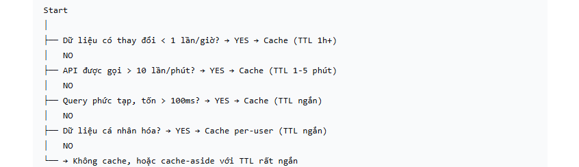

### Cache stampede / thundering herd

Cache stampede xảy ra khi một hot key hết hạn và rất nhiều request cùng cache miss, sau đó đồng loạt gọi database hoặc backend để tái tạo cùng một dữ liệu.

Ví dụ: key `homepage:campaign` hết hạn lúc 20:00, đúng lúc 20.000 user mở ứng dụng. Nếu mỗi request đều query lại, database có thể quá tải dù dữ liệu chỉ cần tính một lần.

Giải pháp:

- **Request coalescing/singleflight trong cùng application instance:** các request cùng key được gộp vào một tác vụ đang chạy. Chỉ request đầu tiên đọc backend; các request còn lại dùng chung `Future/Promise` và nhận cùng kết quả. Cách này không cần distributed lock nhưng không ngăn một instance khác đồng thời rebuild cùng key.
- **Điều phối giữa nhiều application instance:** khi toàn hệ thống chỉ được phép có một instance rebuild key, có thể dùng distributed lock hoặc một cơ chế coordinator tương đương. Instance giữ lock đọc backend và ghi cache; các instance khác chờ, đọc lại cache hoặc tạm trả stale data. Lock phải có TTL, ownership token và timeout chờ.
- **Stale-while-revalidate:** tạm trả bản cũ trong lúc một worker refresh nền.
- **Refresh-ahead:** chủ động refresh hot key trước khi TTL kết thúc.
- **TTL jitter:** cộng một khoảng ngẫu nhiên để nhiều key không hết hạn cùng lúc.
- Giới hạn concurrency, timeout, circuit breaker và backpressure ở backend.

Pseudo-code singleflight:

```java
Product getProduct(long id) {
    Product cached = cache.get("product:" + id);
    if (cached != null) return cached;

    return singleFlight.execute("product:" + id, () -> {
        Product secondCheck = cache.get("product:" + id);
        if (secondCheck != null) return secondCheck;

        Product product = repository.findById(id);
        cache.put("product:" + id, product, Duration.ofMinutes(5));
        return product;
    });
}
```

Double-check bên trong critical section rất quan trọng: trong lúc request chờ lock, request đầu tiên có thể đã nạp cache xong.

### Cache avalanche

Avalanche là trường hợp rất nhiều key hết hạn gần cùng thời điểm hoặc cả cache node/cluster gặp sự cố, khiến traffic lớn tràn xuống backend. Stampede thường nói về nhiều request tranh nhau rebuild một key; avalanche có phạm vi nhiều key hoặc cả tầng cache.

Cách giảm rủi ro: TTL jitter, phân tán lịch refresh, replication/failover phù hợp, warm-up có rate limit, local fallback và capacity planning cho backend.

### Cache penetration

Penetration xảy ra khi request liên tục hỏi các key không tồn tại, nên lần nào cũng miss và chạm database.

Ví dụ: bot gọi hàng triệu ID sản phẩm ngẫu nhiên. Giải pháp gồm validate input, negative caching trong thời gian ngắn, Bloom filter, rate limit và authentication.

```text
product:999999 -> NOT_FOUND, TTL 30 giây
```

Không negative-cache quá lâu nếu dữ liệu có thể được tạo ngay sau đó.

### Race condition và stale write

Hai request cùng đọc/ghi có thể đưa dữ liệu cũ trở lại cache:

```text
T1: Request A đọc DB, nhận version 10 nhưng chưa SET cache
T2: Request B update DB thành version 11 và xóa cache
T3: Request A SET version 10 vào cache -> cache bị cũ
```

Biện pháp tùy mức consistency: version/timestamp, compare-and-set, transaction/outbox, serialization theo key, delayed double delete hoặc chấp nhận stale trong TTL ngắn. Lock chỉ giải quyết đúng vấn đề khi mọi writer tuân thủ cùng protocol; nó không tự biến cache thành strongly consistent storage.

### Hot key và big key

- **Hot key:** một key nhận quá nhiều request, tạo bottleneck trên một node/network shard.
- **Big key:** value hoặc collection quá lớn, làm tăng network time, serialization, memory fragmentation và thời gian xóa.

Giải pháp có thể là local cache nhiều tầng, replicate read, sharding key có chủ đích, chia nhỏ value, giới hạn payload và tránh trả toàn bộ collection.

## Các tầng cache

### Local cache

Local cache nằm trong cùng process hoặc thiết bị với consumer nên rất nhanh và không cần network call.

Ví dụ:

- Java application: Caffeine cache trong heap.
- Browser cache: HTML, CSS, JavaScript, image.
- Mobile app: dữ liệu offline trong local storage/database.
- CPU cache: L1/L2/L3 gần core xử lý.
- DNS cache: ánh xạ domain sang kết quả phân giải trong một khoảng thời gian.

Ưu điểm: latency thấp, giảm traffic mạng, vẫn đọc được một phần dữ liệu khi mất kết nối. Nhược điểm: RAM hữu hạn, dữ liệu giữa nhiều application instance có thể khác nhau, khó invalidate đồng loạt và có rủi ro lưu dữ liệu nhạy cảm trên thiết bị.

### In-process cache

In-process cache là local cache nằm trong RAM của application server. Với Spring Boot có thể dùng Spring Cache + Caffeine:

```java
@Cacheable(cacheNames = "products", key = "#id")
public Product findProduct(long id) {
    return productRepository.findById(id).orElseThrow();
}
```

Nếu chạy 10 instance, mỗi instance có một bản cache riêng. Update ở instance A không tự xóa cache tại B. Có thể dùng TTL ngắn, publish invalidation event hoặc chuyển dữ liệu cần chia sẻ sang distributed cache.

### Distributed cache

Distributed cache chạy ngoài application và được nhiều instance dùng chung, ví dụ Redis hoặc Memcached.

```text
App A ─┐
App B ─┼──> Distributed Cache ──> Database
App C ─┘
```

Ưu điểm:

- Các instance nhìn thấy cùng namespace cache.
- Có thể scale capacity/throughput theo kiến trúc của sản phẩm cache.
- Dễ dùng cho session chia sẻ, cache database và rate limiting.

Đổi lại, nó có network latency, chi phí vận hành, failure mode phân tán và bài toán consistency. Cũng không nên mặc định rằng mọi distributed cache đều tự replicate hoặc luôn available; điều đó phụ thuộc topology và cấu hình cụ thể.

### Multi-level cache

Hệ thống lớn thường kết hợp L1 local cache và L2 distributed cache:

```text
Request -> L1 Caffeine -> L2 Redis -> Database
```

L1 giảm network call, L2 chia sẻ dữ liệu giữa các instance. Đổi lại, invalidation khó hơn vì phải xử lý cả hai tầng. Thường dùng TTL L1 ngắn hơn L2 và phát event để xóa L1 khi dữ liệu thay đổi.

## Client-side cache

Client-side cache lưu dữ liệu trên thiết bị người dùng. Đây thường là **private cache**, không chia sẻ giữa các user.

### Browser cache

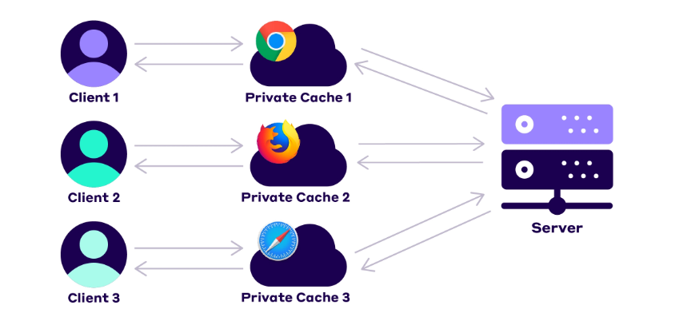

Browser dùng HTTP caching semantics để quyết định response có thể tái sử dụng hay cần revalidate. Server hướng dẫn browser qua các header như `Cache-Control`, `ETag`, `Last-Modified`, `Expires` và `Vary`.

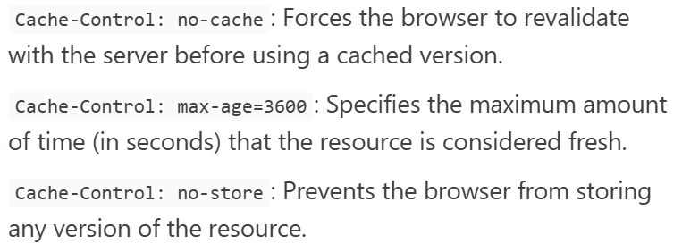

Ví dụ cho asset có tên chứa content hash:

```http
Cache-Control: public, max-age=31536000, immutable
```

Ví dụ cho HTML cần kiểm tra lại với server:

```http
Cache-Control: no-cache
ETag: "homepage-v42"
```

`no-cache` không có nghĩa là “không lưu”; nó yêu cầu revalidate trước khi reuse. `no-store` mới yêu cầu không lưu response. Với nội dung cá nhân, cần cân nhắc `private` và tránh để shared cache lưu nhầm dữ liệu user.

### Service Worker và offline cache

Service Worker là JavaScript chạy nền theo lifecycle riêng của trang, có thể intercept request và dùng Cache Storage. Các chiến lược thường gặp:

- **Cache first:** ưu tiên cache; hợp với static asset immutable.
- **Network first:** ưu tiên dữ liệu mới; fallback cache khi offline.
- **Stale-while-revalidate:** trả cache ngay và refresh nền.

Ví dụ PWA vẫn hiển thị bài viết đã xem khi offline, nhưng UI cần báo rõ dữ liệu có thể cũ.

## Server-side cache

### Page cache và fragment cache

**Page cache** lưu toàn bộ response HTML đã render. Request sau nhận trang cache mà không cần render template và query database lại. Nó hợp với trang public ít thay đổi.

**Fragment cache** chỉ lưu một phần trang, ví dụ thông tin sản phẩm; phần comment hoặc số dư người dùng vẫn render động. Không được cache chung response có dữ liệu cá nhân nếu cache key không bao gồm đúng identity/permission.

### Reverse proxy / proxy cache

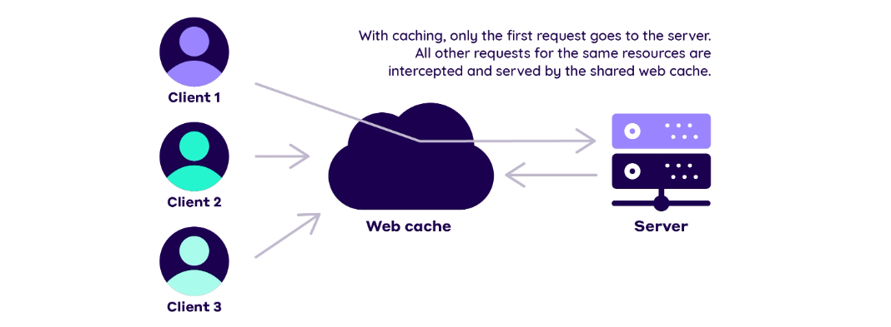

Reverse proxy như NGINX có thể cache response trước application. Nó giảm request tới origin và phù hợp với response có cache key rõ ràng.

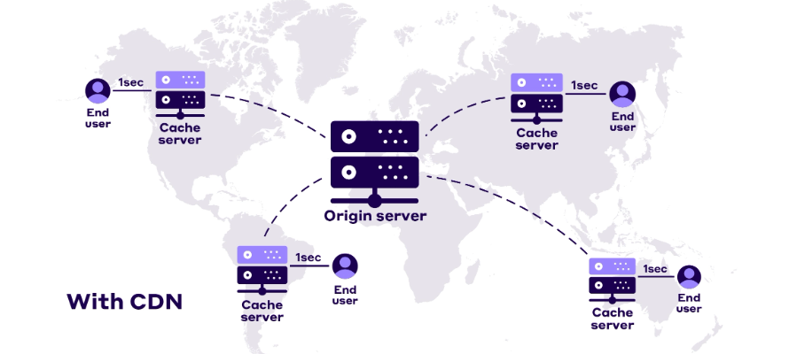

Cache key phải xét những dimension thực sự làm response khác nhau, ví dụ path, query parameter hợp lệ, locale hoặc compression. Dùng sai `Vary`, cookie hay authorization có thể làm rò dữ liệu giữa user.

### CDN

CDN là mạng edge server phân bố ở nhiều vị trí địa lý. DNS/Anycast và routing của nhà cung cấp đưa client tới edge phù hợp; nếu edge có object thì trả ngay, nếu miss thì lấy từ origin và có thể cache lại.

Luồng đơn giản:

1. User truy cập domain.
2. DNS trả endpoint do CDN quản lý; việc chọn edge cụ thể phụ thuộc kiến trúc CDN, không nhất thiết DNS luôn trả trực tiếp “IP server gần nhất”.
3. Client gửi request tới edge.
4. Edge hit thì trả; miss thì fetch từ origin.
5. Browser và edge cache theo HTTP headers, nhưng là hai cache độc lập.

CDN phù hợp với image, video, CSS, JavaScript, download và response public có thể cache. Với purge/invalidation, phải tính thời gian propagation giữa các edge.

### Database cache

Database caching có thể ở nhiều mức:

- Application cache kết quả query hoặc entity/row thường đọc.
- Database buffer pool cache page/index trong RAM.
- ORM second-level cache.
- Query result cache nếu database/engine hỗ trợ và workload phù hợp.

Không nên giả định mọi database hiện đại đều có query cache theo chuỗi SQL. Query result rất dễ invalid khi dữ liệu liên quan thay đổi; application-level entity/query cache thường cho phép kiểm soát key và TTL rõ hơn.

## Cache read/write strategies

### Cache-aside / lazy loading

Cache-aside là pattern phổ biến nhất: application tự đọc cache, đọc database khi miss, rồi tự ghi cache.

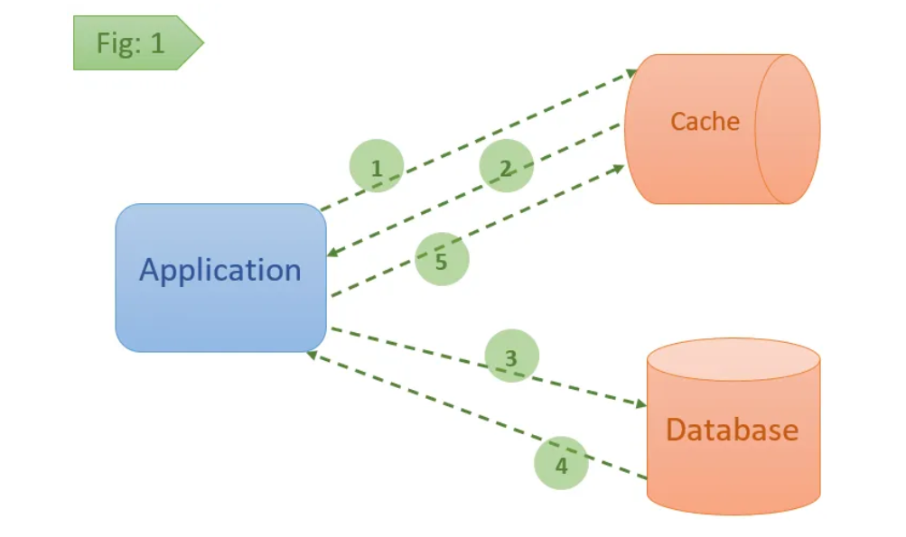

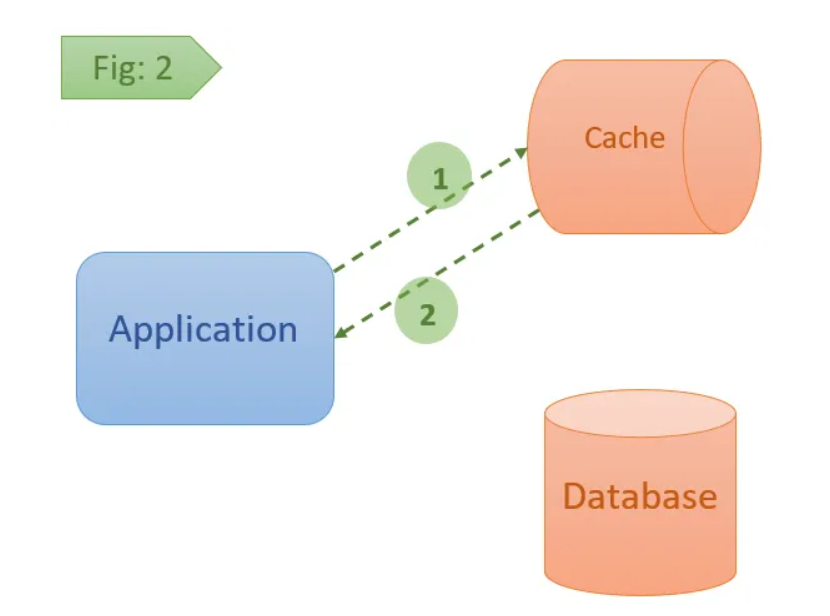

Read:

1. `GET cacheKey`.
2. Hit: trả dữ liệu.
3. Miss: query database.
4. `SET cacheKey value TTL` rồi trả dữ liệu.

Write thường dùng:

1. Update database thành công.
2. Xóa cache key liên quan.
3. Lần đọc sau sẽ repopulate cache.

```java
@Transactional
public Product updatePrice(long id, BigDecimal price) {
    Product updated = productRepository.updatePrice(id, price);
    cache.evict("product:" + id);
    return updated;
}
```

Update DB trước rồi invalidate cache thường an toàn hơn xóa cache trước. Nếu xóa trước, một reader có thể đọc DB cũ và repopulate cache ngay trước khi transaction ghi dữ liệu mới commit. Dù vậy, crash giữa hai bước vẫn có thể để cache cũ; hệ thống nghiêm ngặt cần outbox/event, version hoặc cơ chế retry invalidation.

Ưu điểm: đơn giản, chỉ cache dữ liệu thực sự được đọc, cache lỗi vẫn có thể fallback DB. Nhược điểm: request miss có latency cao, code application phức tạp hơn và dễ race condition.

### Read-through

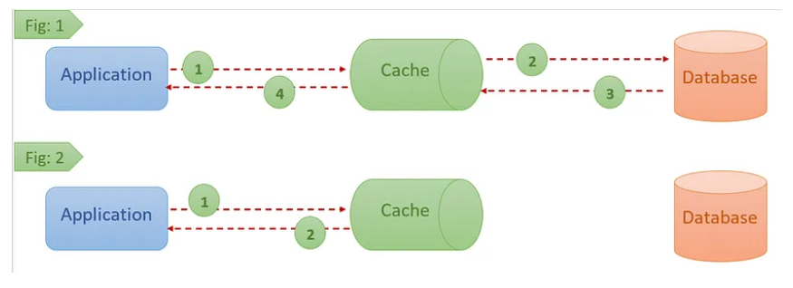

Với read-through, application gọi cache/provider như nguồn đọc duy nhất. Khi miss, cache library/provider chịu trách nhiệm load dữ liệu từ backend.

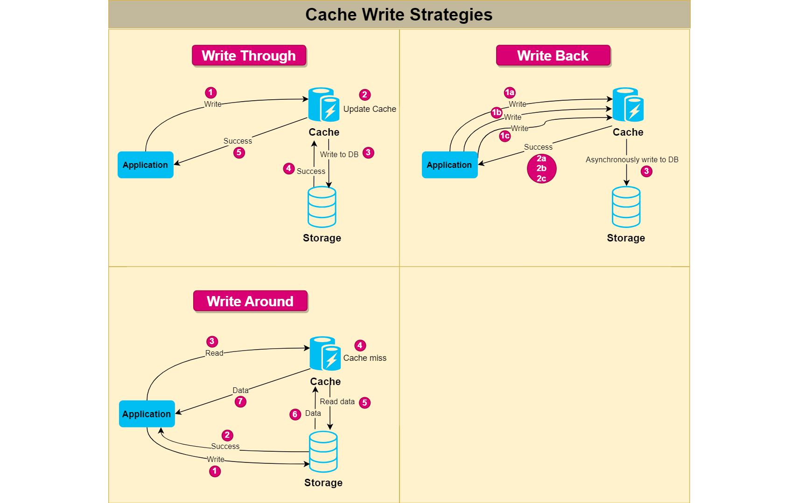

Điểm khác cache-aside nằm ở ownership của loading logic. Không nên hiểu read-through luôn đồng nghĩa “cache chết thì application chết”; khả năng fallback phụ thuộc provider và thiết kế client.

### Write-through

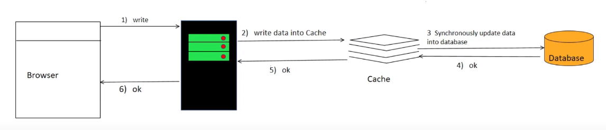

Write-through ghi qua cache layer và chỉ báo thành công sau khi dữ liệu đã được ghi xuống source of truth theo contract của hệ thống.

Ưu điểm: cache thường đã có dữ liệu mới cho lần đọc tiếp theo. Nhược điểm: write latency tăng, ghi cache cho dữ liệu có thể không bao giờ đọc và phải định nghĩa rõ hành vi khi một trong hai nơi ghi lỗi.

> Cần sửa một nhận định phổ biến: “ghi cache và database đồng thời” không tự đảm bảo atomicity. Nếu không có transaction chung, vẫn có thể một bên thành công và bên kia thất bại. Pattern phải có thứ tự, retry/idempotency và failure handling rõ ràng.

Use case: workload đọc nhiều, sau mỗi write gần như chắc chắn sẽ đọc lại. Không nên lấy số dư tài khoản hay booking làm ví dụ rằng cache tự bảo đảm consistency; transaction trên source of truth vẫn là nơi quyết định.

### Write-behind / write-back

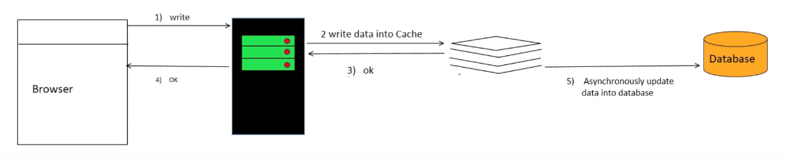

Application ghi vào cache/buffer rồi trả thành công; dữ liệu được flush xuống database bất đồng bộ, có thể theo batch.

Ưu điểm: write nhanh, gom nhiều thay đổi cùng key, giảm tải database. Rủi ro: mất dữ liệu nếu cache/queue lỗi trước khi flush, thứ tự event sai, duplicate write hoặc backlog tăng. Muốn dùng cho dữ liệu quan trọng cần durable log/queue, idempotency, retry, dead-letter handling và monitoring lag.

Use case phù hợp: metrics, lượt xem, lượt thích hoặc counter có thể tổng hợp; không phù hợp mặc định với giao dịch tài chính.

### Write-around

Write-around ghi trực tiếp database, không nạp cache ngay. Lần đọc sau miss rồi mới load dữ liệu.

Ưu điểm: tránh cache pollution khi dữ liệu ghi nhiều nhưng ít đọc. Nhược điểm: lần đọc đầu chậm và phải invalidate bản cũ nếu key đã từng được cache.

Pattern thực tế phổ biến là **write-around + cache-aside**: update DB, invalidate cache, rồi lazy-load khi có request đọc.

### So sánh nhanh

| Pattern | Ai load/ghi DB? | Điểm mạnh | Rủi ro chính |
| --- | --- | --- | --- |
| Cache-aside | Application | Linh hoạt, phổ biến, fallback DB dễ | Miss latency, race/invalidation |
| Read-through | Cache provider/loader | Application read đơn giản | Phụ thuộc provider, cần xử lý cache failure |
| Write-through | Cache layer đồng bộ xuống DB | Read sau write nhanh | Write chậm, partial failure nếu không atomic |
| Write-behind | Cache/queue flush async | Write rất nhanh, batch tốt | Data loss, backlog, ordering |
| Write-around | Application ghi thẳng DB | Tránh cache pollution | Read đầu miss, phải xóa cache cũ |

## Eviction và expiration

Cache có dung lượng hữu hạn. Nếu không giới hạn memory và lifecycle, dữ liệu lạnh sẽ chiếm chỗ của dữ liệu hữu ích — gọi là **cache pollution**.

### TTL / expiration

TTL là chính sách freshness/lifecycle: entry hết hạn sau một khoảng thời gian. Ví dụ OTP 2 phút, product detail 5 phút, configuration 1 phút. TTL không phải eviction algorithm theo mức độ hữu ích; key có thể expire kể cả khi cache còn nhiều RAM.

Chọn TTL theo:

- Mức stale mà nghiệp vụ chấp nhận.
- Tần suất dữ liệu thay đổi.
- Chi phí rebuild.
- Khả năng invalidation chủ động.
- Load backend khi key hết hạn.

Nên thêm jitter:

```text
effectiveTTL = baseTTL + random(0, 60 giây)
```

### LRU - Least Recently Used

Loại entry lâu nhất chưa được truy cập. Phù hợp khi dữ liệu vừa được dùng có khả năng tiếp tục được dùng. LRU có thể loại một key từng rất phổ biến nhưng vừa không được đọc trong khoảng gần đây.

### LFU - Least Frequently Used

Loại entry có tần suất truy cập thấp. Hợp khi muốn giữ những key phổ biến lâu dài; cần cơ chế aging để một key từng hot trong quá khứ không chiếm cache mãi.

### FIFO, random và MRU

- **FIFO:** loại entry được đưa vào sớm nhất; đơn giản nhưng không xét mức sử dụng.
- **Random:** chọn ngẫu nhiên; chi phí thấp, đôi lúc đủ tốt.
- **MRU:** loại entry vừa được dùng gần nhất; chỉ hợp một số access pattern đặc biệt.

Không nên kết luận các policy này “không được sử dụng”; mỗi policy có trade-off và hỗ trợ phụ thuộc sản phẩm cache.

### Expiration khác eviction

| Cơ chế | Kích hoạt bởi | Mục tiêu |
| --- | --- | --- |
| Expiration | TTL/deadline của entry | Kiểm soát freshness/lifecycle |
| Eviction | Thiếu memory hoặc policy capacity | Giải phóng không gian |
| Invalidation | Dữ liệu gốc/logic nghiệp vụ thay đổi | Xóa bản sao không còn hợp lệ |

## Thiết kế cache key

Cache key nên ổn định, dễ quan sát và chứa mọi yếu tố làm kết quả thay đổi:

```text
product:v2:{productId}:{locale}
search:v3:{normalizedQuery}:{page}:{sort}
permission:v1:{userId}:{resourceId}
```

Nguyên tắc:

- Có namespace và schema version.
- Normalize query parameter trước khi tạo key.
- Không đưa secret/token thô vào key loggable.
- Không bỏ sót tenant, user, locale hoặc permission nếu response phụ thuộc chúng.
- Giới hạn cardinality; tránh cache mọi tổ hợp query không kiểm soát.
- Tránh key quá dài và value quá lớn.

## Cache dữ liệu null và lỗi

Negative caching lưu kết quả “không tồn tại” trong TTL ngắn để bảo vệ backend. Tuy nhiên không nên cache mọi exception:

- Có thể cache `404/not found` ngắn nếu input hợp lệ.
- Không nên cache lỗi timeout/`500` lâu vì backend có thể phục hồi ngay.
- Nếu dùng stale-on-error, phải ghi rõ dữ liệu cũ và giới hạn thời gian stale tối đa.

## Consistency và invalidation

“There are only two hard things…” thường được nhắc vì invalidation phụ thuộc nghiệp vụ. Ba hướng chính:

- **TTL-only:** đơn giản, chấp nhận stale tối đa bằng TTL.
- **Invalidate-on-write:** xóa key khi source of truth thay đổi.
- **Update-on-write:** cập nhật cache bằng dữ liệu mới sau khi DB commit.

Với nhiều service, có thể publish domain event sau commit:

```text
ProductUpdated(id=1001, version=42)
        -> consumer xóa product:v2:1001:*
```

Event nên phát qua transactional outbox nếu không muốn DB commit thành công nhưng event invalidation bị mất. Consumer cần idempotent; version giúp bỏ qua event đến trễ.

## Failure handling

Cache thường là optimization, nên hệ thống cần quyết định rõ khi cache lỗi:

- **Fail open:** bỏ qua cache và đọc backend; giữ availability nhưng có thể làm backend quá tải.
- **Fail closed:** từ chối request; dùng khi cache giữ state bắt buộc như rate-limit/security và bỏ qua sẽ nguy hiểm.
- **Serve stale:** trả bản cũ có giới hạn trong lúc backend/cache lỗi.

Các guardrail quan trọng: timeout ngắn, connection pool hữu hạn, circuit breaker, retry có backoff/jitter, bulkhead và giới hạn số request fallback xuống DB.

## Observability

Ít nhất nên theo dõi:

- Hit/miss ratio theo cache name và endpoint.
- Latency p50/p95/p99 của cache và backend fallback.
- Memory used, item count, eviction/expiration rate.
- Error, timeout, reconnect và rejected connection.
- Hot key, big key, network bandwidth và serialization time.
- Load/rebuild duration, lock wait và singleflight coalesced requests.
- Staleness hoặc version mismatch nếu nghiệp vụ đo được.

Hit ratio cao chưa chắc tốt: cache một response 10 µs nhưng bỏ sót query database 2 giây vẫn không giải quyết vấn đề. Tối ưu theo end-to-end latency và backend load.

## Ví dụ Spring Boot thực tế

### Spring Cache với Redis

```java
@Service
public class ProductService {
    @Cacheable(cacheNames = "product", key = "#id", unless = "#result == null")
    public ProductDto findById(long id) {
        return repository.findById(id)
                .map(ProductDto::from)
                .orElseThrow(ProductNotFoundException::new);
    }

    @Transactional
    @CacheEvict(cacheNames = "product", key = "#id")
    public ProductDto update(long id, UpdateProductRequest request) {
        Product product = repository.getReferenceById(id);
        product.update(request);
        return ProductDto.from(product);
    }
}
```

Cấu hình TTL mẫu:

```java
@Bean
RedisCacheManager cacheManager(RedisConnectionFactory connectionFactory) {
    RedisCacheConfiguration defaults = RedisCacheConfiguration.defaultCacheConfig()
            .entryTtl(Duration.ofMinutes(5))
            .disableCachingNullValues();

    return RedisCacheManager.builder(connectionFactory)
            .cacheDefaults(defaults)
            .build();
}
```

Trong production cần thêm key prefix theo application/environment, serializer có version, timeout, metrics và chiến lược invalidation. Spring annotation không tự giải quyết cache stampede hoặc transaction boundary cho mọi trường hợp.

### Tình huống e-commerce

Giả sử endpoint `GET /products/{id}` có 5.000 request/giây trong flash sale:

- L1 Caffeine TTL 5 giây giữ hot product trên từng instance.
- L2 Redis TTL khoảng 5 phút + jitter 0–60 giây.
- Cache-aside load từ PostgreSQL.
- Singleflight theo `productId` khi miss.
- Event `ProductUpdated` xóa L1/L2 sau DB commit.
- Nếu Redis timeout, giới hạn concurrency fallback DB để tránh avalanche.
- Giá hiển thị có thể cache ngắn; giá dùng để checkout phải được xác nhận lại trong transaction.

Thiết kế này phân biệt rõ dữ liệu **để hiển thị nhanh** và dữ liệu **để ra quyết định giao dịch**.

## Checklist production

- Đo bottleneck trước khi thêm cache và benchmark sau khi triển khai.
- Xác định source of truth, mức stale cho phép và failure mode.
- Thiết kế key có version, tenant/user/locale/permission khi cần.
- Đặt TTL cho mọi dữ liệu cache hữu hạn; thêm jitter cho nhóm key lớn.
- Chống stampede bằng singleflight, lock có timeout hoặc stale-while-revalidate.
- Không cache lỗi tạm thời quá lâu; negative-cache có TTL ngắn.
- Giới hạn key/value size, cardinality và memory; chọn eviction policy theo workload.
- Dùng timeout, circuit breaker, backoff và giới hạn fallback xuống backend.
- Bảo vệ dữ liệu nhạy cảm bằng access control, TLS/encryption và tránh log secret.
- Theo dõi hit ratio, latency tail, eviction, error, hot key và backend load.
- Kiểm thử cache restart, node failure, invalidation bị mất và cold-start recovery.
- Với dữ liệu tiền, tồn kho hoặc booking, source of truth/transaction vẫn quyết định tính đúng đắn.

## Tóm tắt

Cache đổi **memory và độ phức tạp consistency** lấy **latency thấp hơn và backend load nhỏ hơn**. Cache tốt không chỉ là `GET/SET`; nó cần key đúng, TTL hợp lý, invalidation rõ ràng, chống stampede, failure handling và observability. Bắt đầu bằng cache-aside cho dữ liệu đọc nhiều, đo kết quả, rồi chỉ thêm multi-level cache, refresh-ahead hoặc write-behind khi workload thực sự cần.


