# Concurrency

## Multithreading

Multi-thread có nghĩa là có nhiều thread thực thi trong cùng 1 application, mỗi thread như 1 luồng xử lý độc
lập trong cùng 1 process giúp application thực thi nhiều tác vụ đồng thời.

- Trong hệ điều hành, một Process (Tiến trình) là một chương trình đang chạy với không gian địa chỉ bộ nhớ
  riêng. Một Thread là đơn vị thực thi nhỏ nhất trong Process đó.
- Các thread chạy độc lập, song song với nhau, cùng chia sẻ shared resource của process như database,
  memory,...

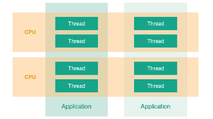

- Tất cả các luồng trong cùng một tiến trình sẽ chia sẻ: **Heap memory:** Nơi lưu trữ biến toàn cục và đối
  tượng + **Code segment:** Mã nguồn của chương trình.
- Tuy nhiên, mỗi luồng sẽ có các thành phần riêng biệt để đảm bảo tính độc lập: **Stack:** Lưu trữ biến cục bộ
  và các lời gọi hàm + **Register Set:** Trạng thái các thanh ghi hiện tại của CPU + **Program Counter (PC):**
  Địa chỉ của lệnh tiếp theo mà luồng đó sẽ thực hiện.

### Cách multithreading hoạt động trên phần cứng

Concurrency (Tính đồng thời - Trên 1 CPU Core): CPU không thực hiện các luồng cùng một lúc. Thay vào đó, nó sử
dụng cơ chế **Context Switching (Chuyển đổi ngữ cảnh)**.

- Hệ điều hành lưu trạng thái (PC, thanh ghi) của Luồng A vào bộ nhớ.
- Tải trạng thái của Luồng B lên CPU.
- Thực thi Luồng B trong một khoảng thời gian cực ngắn (Time Slice). Việc hoán đổi này diễn ra hàng triệu lần
  mỗi giây, tạo ra cảm giác các luồng đang chạy song song.
- Tất nhiên là không phải cứ 1 CPU thực thi nhiều thread thì mới context switching, cứ khi mà 1 thread block
  là sẽ thực hiện context switching.

Parallelism (Tính song song - Trên nhiều CPU Cores): Nếu máy tính có nhiều CPU core, hệ điều hành có thể phân
phối thread A cho Core 1 và thread B cho Core 2. Tại thời điểm t, cả hai thread thực sự được thực thi vật lý
cùng lúc.

### Ưu điểm

- Multi-thread mạnh mẽ khi đã tận dụng được tối đa khả năng CPU của máy tính
- Cải thiện khả năng xử lý đồng thời, tạo trải nghiệm tốt cho người dùng
- Threads của cùng process chia sẻ vùng không gian bộ nhớ, tiết kiệm hơn nhiều với việc tạo nhiều process +
  context switching giữa các thread cũng nhẹ nhàng hơn việc process switching
- Phù hợp với I/O bound, khi mà 1 thread bị block do đợi I/O thì các thread khác vẫn có thể chạy để tránh lãng
  phí thời gian CPU.
- Dễ dàng mở rộng bằng cách thêm bớt thread/ CPU khi cần.
- Fairness: Hệ điều hành chia thời gian CPU thành các lát cắt rất nhỏ (millisecond) + Nó luân chuyển CPU giữa
  các thread này → Ngay cả khi Task A nặng, Task B vẫn được CPU xử lý một phần nhỏ trong mỗi chu kỳ → Không có
  user nào phải đợi quá lâu mà không nhận được phản hồi ban đầu. Hệ thống đạt được sự "công bằng" về mặt thời
  gian xử lý.

### Nhược điểm

- Race condition khi nhiều thread cùng access, modify shared resource (sử dụng mutex lock để đảm bảo chỉ 1
  thread được access tại 1 thời điểm
  - Các thread trong cùng một process chia sẻ chung không gian địa chỉ bộ nhớ.
  - Đọc/Ghi đồng thời: Khi Luồng A đang ghi dữ liệu vào một biến, Luồng B có thể nhảy vào đọc biến đó ngay lập
    tức.
  - Một câu lệnh tưởng chừng đơn giản như `count++` thực chất gồm 3 bước ở cấp độ CPU: Đọc giá trị từ bộ nhớ
    vào thanh ghi (Register) → Tăng giá trị trong thanh ghi lên 1 → Ghi giá trị từ thanh ghi ngược lại bộ nhớ.
  - Nếu hai luồng cùng thực hiện `count++` đồng thời, chúng có thể cùng đọc giá trị cũ (ví dụ là 5), cùng tăng
    lên 6, và cùng ghi đè số 6 vào bộ nhớ. Kết quả cuối cùng là 6, trong khi đúng ra phải là 7.
  - Locking Mechanisms: là cách tiếp cận truyền thống và trực quan nhất
    - Mutex (Mutual Exclusion): Một cái "khóa" mà thread phải chiếm giữ trước khi vào Critical Section. Nếu
      thread khác đang giữ khóa, thread hiện tại phải đợi.
    - Read/Write Locks: Cho phép nhiều thread cùng "đọc" dữ liệu đồng thời, nhưng nếu có thread muốn "ghi", nó
      sẽ khóa toàn bộ để đảm bảo an toàn >< Có thể gây ra tình trạng **Write Starvation**: Nếu liên tục có
      thread đọc, thread ghi sẽ phải đợi mãi không bao giờ được thực hiện.
    - Đảm bảo an toàn tuyệt đối cho các cấu trúc dữ liệu/ transaction phức tạp + dễ triển khai và có sẵn trong
      hầu hết các ngôn ngữ lập trình >< Gây tốn chi phí quản lý (overhead) do thread phải ngủ và thức dậy
      (context switching) + nguy cơ deadlock.
  - Semaphore: giống như một bãi đậu xe có số lượng chỗ trống giới hạn.
    - Binary Semaphore: Hoạt động giống Mutex.
    - Counting Semaphore: Cho phép một số lượng thread nhất định (ví dụ: tối đa 5 thread) truy cập vào tài
      nguyên cùng lúc. Thường dùng để quản lý pool kết nối hoặc giới hạn tài nguyên.
    - Linh hoạt hơn Mutex vì có thể cho phép **n** thread cùng truy cập + có thể dùng để điều phối thứ tự chạy
      giữa các thread (Signaling) >< Khó kiểm soát hơn Mutex, dễ dẫn đến lỗi logic nếu quên "trả thẻ".
    - Usecase: Giới hạn số lượng kết nối tối đa đến một API hoặc Database để tránh quá tải + điều phối việc
      sản xuất và tiêu thụ dữ liệu trong hàng đợi (Queue).
  - Atomic Operations: thay vì dùng khóa (vốn tốn tài nguyên hệ thống), bạn sử dụng các lệnh đặc biệt được hỗ
    trợ bởi CPU. Các thao tác này đảm bảo việc "đọc-sửa-ghi" diễn ra như một bước duy nhất, không thể bị ngắt
    quãng.
    - Tốc độ cực cao, không làm thread bị ngủ (non-blocking) + Không bao giờ gây ra Deadlock >< Chỉ áp dụng
      được cho các kiểu dữ liệu nguyên thủy (số nguyên, boolean) + không thể dùng cho các logic phức tạp (ví
      dụ: nếu A đúng THÌ làm B và C).
  - Tránh dùng trạng thái chia sẻ (Avoid Shared State): Cách tốt nhất để không bị race condition là... không
    chia sẻ gì cả:
    - Immutability (Bất biến): Tạo ra các đối tượng không thể thay đổi sau khi khởi tạo. Nếu muốn thay đổi,
      hãy tạo một bản sao mới.
    - Thread-Local Storage: Mỗi thread có một bản sao dữ liệu riêng, không đụng chạm đến nhau.
    - Message Passing (Truyền thông điệp): Thay vì dùng chung bộ nhớ, các thread giao tiếp bằng cách gửi tin
      nhắn cho nhau (phổ biến trong ngôn ngữ Go hoặc Erlang với mô hình Actor).
- Deadlock khi 2 thread cùng đợi resource của nhau vô hạn do chúng giữ lock không nhả: thread 1 đang giữ lock
  X, đợi lock Y + thread 2 đang giữ lock Y, đợi lock X (sử dụng timeout để tránh giữ lock quá lâu + thứ tự lấy
  lock cố định, các thread luôn obtain lock X trước khi obtain lock Y) + tránh nested lock bên trong lock
Deadlock có thể nhìn như một vòng chờ:

```text
Thread 1 giữ Lock X -> chờ Lock Y
Thread 2 giữ Lock Y -> chờ Lock X
```

- Lock Ordering (Thứ tự khóa): Đây là kỹ thuật chủ động nhất. Nguyên nhân chính gây deadlock là khi Thread A
  giữ Lock 1 và muốn Lock 2, trong khi Thread B giữ Lock 2 lại muốn Lock 1 → Chúng ta quy định một thứ tự ưu
  tiên nhất định cho các khóa. Tất cả các luồng buộc phải lấy khóa theo đúng thứ tự đó.
- Lock Ordering thường được ưu tiên nhất, giải quyết vấn đề từ gốc rễ, phòng bệnh hơn chữa bệnh. Nếu mọi
  Thread đều tuân thủ thứ tự lấy Lock A rồi mới đến Lock B, vòng lặp đợi nhau Circular Wait đơn giản là không
  thể xảy ra + hiệu suất cao vì không mất chi phí quản lý đồ thị hay chờ đợi timeout >< Đòi hỏi lập trình viên
  phải cực kỳ kỷ luật và hiểu rõ toàn bộ luồng dữ liệu. Trong các hệ thống cực lớn, việc duy trì một thứ tự
  khóa nhất nhất quán là rất khó.
- Lock Timeout (Thời gian chờ khóa): Khi một luồng cố gắng lấy một khóa mà không được, nó sẽ chỉ chờ trong một
  khoảng thời gian nhất định (ví dụ: 500ms) → Nếu hết giờ: Luồng đó sẽ từ bỏ, giải phóng tất cả các khóa nó
  đang giữ (nếu có) và thử lại sau một khoảng thời gian ngẫu nhiên >< Có thể dẫn đến tình trạng **Livelock**
  (các luồng liên tục lấy khóa rồi nhả khóa cùng lúc, giống như hai người đi đối diện nhau cứ nhường đường qua
  lại mãi mà không ai đi được, cần thời gian chờ ngẫu nhiên)
- Vẫn nên dùng làm cơ chế bổ sung vì sai sót có thể xảy ra ngay cả khi dùng Lock Ordering → timeout giúp hệ
  thống không bị treo vĩnh viễn.
- Deadlock Detection (Phát hiện tắc nghẽn): Đây là cách tiếp cận "để nó xảy ra rồi mới xử lý". Kỹ thuật này
  thường dùng trong các hệ thống phức tạp như Cơ sở dữ liệu (Database): Hệ thống sẽ duy trì một cấu trúc dữ
  liệu (thường là một đồ thị gọi là **Wait-for Graph**) để theo dõi xem luồng nào đang giữ khóa nào và đang
  đợi khóa nào + Định kỳ, một thuật toán sẽ quét đồ thị này. Nếu phát hiện một **vòng lặp (cycle)** trong đồ
  thị, nghĩa là deadlock đã xảy ra + **Xử lý:** Khi phát hiện deadlock, hệ thống sẽ chọn một "nạn nhân"
  (thường là luồng ít quan trọng nhất) để: Buộc luồng đó phải dừng lại (Preemption), hoàn tác (Rollback) các
  thao tác của nó để giải phóng khóa cho các luồng khác.
- Lý do detector hay dùng ở database vì trong database, hàng nghìn giao dịch (transaction) xảy ra đồng thời và
  truy cập vào các bản ghi ngẫu nhiên. Việc ép người dùng viết SQL theo một thứ tự khóa nhất định là bất khả
  thi + không thể dự đoán được thứ tự các tài nguyên sẽ bị khóa + Hệ thống chấp nhận deadlock sẽ xảy ra, nhưng
  nó có đủ thông minh để hy sinh một "nạn nhân" (Rollback) nhằm cứu vãn toàn cục.
- Livelock khi 2 thread tuy không bị lock cứng như deadlock nhưng vẫn không thể hoàn thành công việc thực tế
  của chúng do chúng liên tục thay đổi trạng thái và nhường nhau để thực thi công việc (deadlock chờ lock ><
  livelock thực thi liên tục nhưng không xong được) (sử dụng độ trễ ngẫu nhiên để tránh nhường nhau cùng lúc +
  thiết kế lại logic giữa các thread + giới hạn số lần thử)

Ví dụ rút gọn:

- **Deadlock:** hai thread/process giữ tài nguyên của nhau và cùng chờ tài nguyên còn lại, nên không bên nào
  đi tiếp.
- **Livelock:** thread vẫn chạy và liên tục nhường/đổi trạng thái, nhưng không hoàn thành việc thật. Cách xử
  lý thường là backoff ngẫu nhiên, giới hạn retry, hoặc thiết kế lại protocol phối hợp.

- Starvation tức các thread gặp tình trạng “đói” do không bao giờ được run do mức độ ưu tiên thấp/ bị các
  thread khác chiếm CPU trước/ chiếm lock trước.

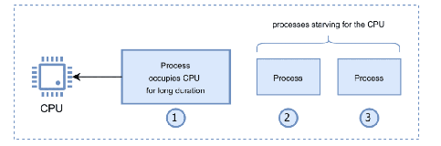

- Trong Java, mỗi luồng có một mức độ ưu tiên (từ `1` đến `10`). Theo lý thuyết, CPU sẽ ưu tiên "phục vụ" các
  ông lớn có Priority cao trước → Nếu bạn liên tục tạo ra các luồng có Priority bằng 10, các luồng có Priority
  bằng 1 (thấp hơn) sẽ mãi đứng chờ ở cuối hàng. CPU bận rộn đến mức không bao giờ ngó ngàng tới các luồng
  "thấp cổ bé họng" này >< Java không đảm bảo 100% thứ tự theo Priority (nó còn phụ thuộc vào Hệ điều hành),
  nhưng việc lạm dụng độ ưu tiên chắc chắn sẽ gây ra sự mất công bằng.
- Bị chặn bởi khối synchronized: Khi nhiều luồng cùng muốn vào một khối code được đánh dấu là `synchronized`,
  chúng phải xếp hàng chờ lấy "chìa khóa" (monitor lock) + Java không đảm bảo rằng luồng nào đến trước sẽ được
  vào trước (không có cơ chế FIFO mặc định) → Luồng A đang chờ, luồng B vừa làm xong và nhả khóa ra. Ngay lập
  tức luồng C nhào tới và "cướp" mất khóa trước khi luồng A kịp phản ứng. Nếu việc này lặp đi lặp lại, luồng A
  sẽ bị "chết đói" dù nó là đứa đợi lâu nhất.
  ⇒ Java cung cấp các công cụ mạnh mẽ hơn trong gói `concurrent.locks`, điển hình là ReentrantLock.
Tóm tắt cách giảm starvation:

| Cơ chế | Ý nghĩa |
| --- | --- |
| Fair lock | Thread chờ trước được ưu tiên trước. |
| Semaphore fair | Giới hạn số thread vào tài nguyên và có thể cấu hình công bằng. |

- Thread leak tức thread không được giải phóng, đóng lại sau khi hoàn thành thực thi (sử dụng thread pool thay
  vì tự đóng, tạo mới thread liên tục + đảm bảo thread phải được kết thúc sau khi thực thi qua thread.join(),
  daemon thread)
- Lock overhead tức lock quá nhiều, các thread phải đợi lock dẫn tới thời gian thực thi chậm đi (chỉ lock khi
  cần + Lock-free + read write lock)
- Abandoned Lock xảy ra khi 1 thread giữ lock nhưng hoàn thành/ server crash,... mà không release lock khiến
  các thread khác đợi vô hạn để obtain lock đó (timeout lock để tránh treo vĩnh viễn + watchdog: task luôn gửi
  heartbeat để thông báo nó vẫn hoạt động bình thường, nếu watchdog không nhận được tín hiệu trong thời gian
  quy định thì nó sẽ coi là lỗi và thực hiện các hành động khôi phục, Redis đang dùng watchdog để thu hồi
  lock)

### I/O-bound và CPU-bound

Trong máy tính, **CPU** và các thiết bị **I/O** (Input/Output như ổ cứng, mạng) hoạt động độc lập thông qua
các bộ điều khiển (Controllers).

- **Tốc độ chênh lệch:** CPU có thể thực hiện hàng tỷ phép tính mỗi giây, trong khi tốc độ đọc dữ liệu từ ổ
  cứng hoặc mạng chậm hơn hàng nghìn đến hàng triệu lần.
- **Trạng thái Blocked:** Trong lập trình đơn luồng (Single-threaded), khi luồng gọi lệnh đọc file, nó sẽ rơi
  vào trạng thái "chờ" (Wait). Lúc này, CPU không có việc gì để làm cho luồng đó, nó bị lãng phí chu kỳ xử lý
  → khi dùng multithread, khi I/O xảy ra sẽ thực hiện context switching để xử lý thread khác thay vì đợi.

### Chi phí của multithreading

Multithreading mang lại lợi ích nhưng cũng có chi phí:

- Complex: tuy là giúp tăng hiệu suất lên đáng kể, nhưng nó lại đòi hỏi thiết kế phức tạp hơn nhiều so với
  single-thread (shared resource có thể bị conflict khi nhiều thread thực thi đồng thời)
- Context switching overhead: multi-thread cũng tận dụng tối đa khả năng của CPU bằng cách: khi 1 thread đang
  đợi phản hồi từ server khác, đợi phản hồi database, phản hồi lại cho user,... (các hoạt động I/O không cần
  CPU xử lý) thì CPU sẽ switch sang thread khác để xử lý, tuy nhiên nó lại gây ra chậm 1 chút vì CPU cần lưu
  trữ lại context của thread hiện tại lại, load context của thread khác vào để thực thi (cần lưu trữ lại
  context của thread hiện tại lại để lần sau switch lại thì nó sẽ tiếp tục từ lúc ngừng + load context của
  thread mới vào để giúp hiểu context của thread đó và thực thi tiếp chương trình). (tổng thời gian có thể tới
  1-10ms tùy OS, CPU)
- Sleep, wake-up overhead: khi thead bị block -> thread rơi vào trạng thái sleep, OS sẽ đưa thread vào wait
  queue, cập nhật schedule để pick thread khác để chạy, data cache cho thread sẽ flush lại vào RAM + khi
  thread đã sẵn sàng, OS đánh thức nó, đưa vào ready queue, khi CPU chuẩn bị thực thi tiếp thì lại push data
  vào cache để xử lý (tổng thời gian có thể tới 5-50ms)
- Thunder herd xảy ra khi nhiều thread cùng lúc bị đánh thức dẫn tới dẫn tới giảm hiệu suất tổng thể (10
  thread đang đợi lock, khi lock được release thì 10 thread chạy tới để chiếm lock tuy nhiên chỉ có 1 thread
  thành công và còn lại thì thất bại, gây lãng phí: các thread đang sleep sẽ được OS wake up, đưa vào ready
  queue, CPU pick và thực thi tiếp 10 thread này, tuy nhiên chỉ có 1 thread thành công và 9 thread kia lại bị
  sleep ⇒ chi phí context switching, CPU là nhiều)
- Increase resource consumption: việc sử dụng multi-thread tiêu tốn tài nguyên hơn nhiều so với single-thread
  vì: mỗi thread có vùng stack riêng để lưu trữ biến, lời gọi hàm, địa chỉ trả về,... dễ gây OutOfMemory hơn
  so với dùng single thread + việc tạo và hủy thread sẽ tốn performance và resource

### Thread pool

Thread pool là một nhóm worker thread được tái sử dụng để thực thi nhiều task. Thay vì tạo một thread mới
cho mỗi request, ứng dụng đưa task vào pool; worker rảnh sẽ lấy task và xử lý.

<p align="center">
  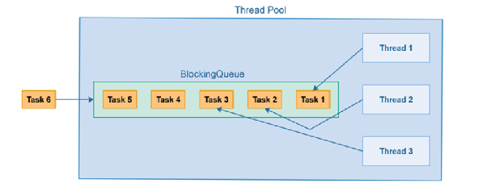
</p>

<p align="center"><em>Request được chuyển thành task, chờ trong queue và được worker lấy ra xử lý.</em></p>

#### Thread pool giải quyết vấn đề gì?

Nếu mỗi request tạo một thread mới, số request tăng đột biến có thể tạo hàng nghìn thread. Hệ thống tốn RAM
cho stack, tốn CPU cho context switching và cuối cùng có thể chậm hơn dù số thread nhiều hơn.

Thread pool đặt ra một giới hạn:

```text
Request
   │
   ▼
  Task ──► Queue ──► Worker thread ──► Kết quả
             │
             └── Chờ khi tất cả worker đang bận
```

Nó mang lại ba lợi ích chính:

- **Tái sử dụng:** worker xử lý xong không bị hủy mà quay lại lấy task tiếp theo.
- **Giới hạn concurrency:** chỉ một số task được chạy đồng thời, tránh tạo thread không kiểm soát.
- **Hấp thụ burst ngắn:** queue giữ tạm task khi request tăng trong một khoảng thời gian ngắn.

Thread pool không làm hệ thống có thêm CPU, database connection hoặc network bandwidth. Nó chỉ giúp phân phối
và giới hạn công việc phù hợp với tài nguyên đang có.

#### Các thành phần

| Thành phần | Vai trò |
| --- | --- |
| Task | Công việc cần thực thi, thường là `Runnable` hoặc `Callable`. |
| Worker | Thread lấy task và thực thi. |
| Queue | Nơi task chờ khi worker đang bận. |
| Pool limit | Giới hạn số worker được chạy đồng thời. |
| Rejection policy | Cách phản ứng khi cả worker lẫn queue đều hết chỗ. |

#### Một task đi qua pool như thế nào?

Có thể hình dung theo trình tự:

```text
1. Còn worker trong mức hoạt động bình thường?
   └─ Có → worker xử lý task

2. Tất cả worker đang bận nhưng queue còn chỗ?
   └─ Có → task chờ trong queue

3. Queue đầy nhưng pool vẫn được phép tạo thêm worker?
   └─ Có → tạo worker bổ sung

4. Worker đã đạt giới hạn và queue cũng đầy?
   └─ Task bị chuyển cho rejection policy
```

Điểm quan trọng là **queue và số worker phải được xem cùng nhau**:

- Nhiều worker giúp xử lý song song hơn nhưng làm tăng áp lực lên CPU, database và downstream.
- Queue lớn giúp ít reject hơn trong ngắn hạn nhưng làm request phải chờ lâu hơn.
- Queue nhỏ phản ứng với overload sớm hơn nhưng có thể reject cả những burst rất ngắn.

#### Khi request vượt quá khả năng xử lý

Giả sử hệ thống chỉ xử lý ổn định được 200 request/giây nhưng đang nhận 1.000 request/giây:

```text
Tốc độ request đến     = 1.000 req/s
Khả năng xử lý         =   200 req/s
Task tồn đọng mỗi giây =   800 task
```

Nếu tốc độ này kéo dài:

```text
Sau 1 giây  → tồn 800 task
Sau 10 giây → tồn 8.000 task
Sau 60 giây → tồn 48.000 task
```

Queue chỉ trì hoãn sự cố; nó không giải quyết được overload kéo dài. Queue càng lớn thì hệ thống càng lâu
reject, nhưng các request nằm cuối queue có thể chờ quá lâu và timeout trước khi được chạy.

Khi quá tải, hệ thống chỉ có một số lựa chọn thực sự:

```text
Giảm lượng request đi vào
        hoặc
Giảm lượng công việc phải làm
        hoặc
Tăng khả năng xử lý
        hoặc
Chấp nhận từ chối/chậm một phần request
```

#### Các cách xử lý overload

| Cách xử lý | Ví dụ | Ưu điểm | Nhược điểm |
| --- | --- | --- | --- |
| **Bounded queue** | Cho tối đa 200 task chờ; task thứ 201 chuyển sang reject. | Hấp thụ burst ngắn, giới hạn RAM. | Queue lớn làm latency tăng; queue nhỏ reject sớm. |
| **Fail fast** | Pool đầy thì trả `429` hoặc `503` kèm `Retry-After`. | Bảo vệ latency và tài nguyên. | Client phải xử lý lỗi, retry và idempotency. |
| **Backpressure** | Pool đầy thì thread submit tự chạy task hoặc producer tạm dừng. | Làm nguồn tạo task chậm theo consumer. | Có thể làm nghẽn request thread hoặc event loop. |
| **Rate limiting** | Mỗi tenant tối đa 100 req/s hoặc 20 request đồng thời. | Chặn tải thừa trước khi vào pool, tạo fairness. | Phải chọn limit và quản lý trên nhiều instance. |
| **Bulkhead** | Payment, email và report dùng ba pool riêng. | Một chức năng chậm không chiếm hết worker của chức năng khác. | Nhiều pool hơn, khó chia capacity tối ưu. |
| **Load shedding** | Quá tải thì bỏ recommendation, trả cache cũ hoặc giảm chất lượng response. | Giữ chức năng cốt lõi hoạt động. | Mất hoặc giảm chất lượng tính năng phụ. |
| **Message queue** | Ghi job vào Kafka/RabbitMQ rồi trả `202 Accepted`. | Chịu burst lớn, task có thể xử lý sau. | Eventual consistency; phải xử lý duplicate, retry và DLQ. |
| **Scale out** | Tăng từ 2 lên 6 application instance. | Tăng capacity nếu bottleneck ở application. | Không giúp nếu bottleneck là DB, lock hoặc partner API. |

Không có một lựa chọn dùng cho mọi tình huống. Thực tế thường kết hợp:

```text
Rate limit
    ↓
Bounded queue
    ↓
Thread pool tách theo chức năng (bulkhead)
    ↓
Timeout/circuit breaker ở downstream
    ↓
Fail fast khi không còn capacity
```

#### Ví dụ 1: API cần trả kết quả ngay

Service tìm kiếm xử lý ổn định `200 req/s`. Ta cho tối đa 100 request chờ để hấp thụ burst ngắn:

```text
Request
   │
   ├─ Còn worker         → xử lý ngay
   ├─ Worker bận         → chờ trong bounded queue
   └─ Queue đầy          → trả 503 + Retry-After
```

Kết hợp:

- Rate limit theo API key để một client không chiếm hết capacity.
- Bounded queue để hấp thụ burst vài giây.
- Fail fast khi queue đầy.
- Client retry bằng exponential backoff + jitter.

Không dùng queue quá lớn vì request ở cuối queue có thể timeout trước khi được xử lý.

#### Ví dụ 2: Tạo báo cáo chạy lâu

Một báo cáo mất 20 giây và hệ thống chỉ nên chạy đồng thời 5 báo cáo. Không nên giữ HTTP request chờ:

```text
POST /reports
   │
   ├─ Lưu job vào message queue → trả 202 + jobId
   └─ Queue đạt giới hạn        → trả 429/503

5 report worker xử lý song song

GET /reports/{jobId}
   └─ PENDING / RUNNING / COMPLETED / FAILED
```

Ở đây message queue phù hợp hơn queue trong thread pool vì job cần tồn tại ngay cả khi application restart.

#### Ví dụ 3: Partner API chỉ chịu được 20 request đồng thời

Application có 100 worker nhưng partner chỉ chịu được 20 lời gọi cùng lúc. Tăng pool lên 200 không giải quyết được;
nó chỉ làm partner quá tải nhanh hơn.

```text
Request
   │
   ▼
Semaphore/Bulkhead: tối đa 20 lời gọi partner
   │
   ├─ Có permit  → gọi partner với timeout
   └─ Hết permit → chờ ngắn hoặc fail fast
```

Kết hợp:

- Bulkhead hoặc semaphore giới hạn 20 lời gọi.
- Timeout để worker không bị giữ vô hạn.
- Circuit breaker khi partner lỗi liên tục.
- Fail fast khi vùng chờ đã đầy.

#### Theo dõi để biết đang quá tải

| Metric | Dấu hiệu |
| --- | --- |
| Active worker | Luôn chạm giới hạn pool. |
| Queue size | Tăng liên tục và không quay về mức bình thường. |
| Queue wait time | Task chờ lâu hơn thời gian thực thi. |
| Rejection count | Pool bắt đầu từ chối task. |
| End-to-end latency | Tăng dù execution time không tăng nhiều. |
| Downstream timeout | Tăng sau khi tăng số worker. |
| Throughput | Không tăng dù thêm thread. |

Nếu thêm worker nhưng throughput không tăng, bottleneck có thể nằm ở CPU, database connection, lock hoặc
downstream. Tiếp tục tăng thread thường chỉ làm số task chờ chuyển từ queue sang trạng thái đang block.

#### Những lỗi thiết kế thường gặp

1. Dùng queue không giới hạn và nghĩ rằng “request chỉ cần chờ thêm”.
2. Tăng số worker mà không kiểm tra capacity của database/downstream.
3. Chỉ theo dõi execution time nhưng không đo queue wait time.
4. Retry ngay lập tức, không có exponential backoff và jitter.
5. Dùng chung một pool cho thanh toán, email và background report.
6. Dùng policy bỏ task nhưng không có log, metric hoặc audit.
7. Nhận task quan trọng vào queue memory dù task không được phép mất khi process restart.
8. Để request timeout ở client nhưng task trong server vẫn tiếp tục chạy và chiếm worker.

### Virtual Thread

Trước đây, mỗi khi tạo một Thread trong Java, ta có một Platform Thread theo tỷ lệ 1:1 với OS Thread. Virtual
Thread tách luồng Java khỏi OS Thread.

- Mỏng nhẹ: Bạn có thể chạy hàng triệu Virtual Thread trên chỉ một vài OS Thread.
- Quản lý bởi JVM: Thay vì để hệ điều hành quản lý, chính bộ chạy Java (JVM) sẽ tự điều phối việc lên lịch
  (scheduling) cho các luồng này.
- Trong các ứng dụng web, phần lớn thời gian một luồng không "tính toán" mà chỉ **đợi**: đợi database trả kết
  quả, đợi API bên thứ ba, hoặc đợi đọc file.
  - Với Platform Threads, khi một luồng đang đợi (I/O Blocked), cái OS Thread đắt đỏ đó vẫn bị chiếm dụng
    nhưng không làm gì cả + nếu muốn xử lý 10,000 request cùng lúc, bạn cần 10,000 OS Threads → điều này khiến
    RAM cạn kiệt nhanh chóng và CPU tốn quá nhiều công sức để chuyển đổi qua lại giữa các luồng (Context
    Switching).
  - Để giải quyết việc lãng phí luồng, người ta dùng lập trình phản ứng (như WebFlux, RxJava). Tuy nhiên, nó
    cực kỳ khó viết, khó debug và làm mã nguồn trở nên rối rắm (Callback hell).
- Virtual Threads sinh ra để mang lại hiệu suất của lập trình phản ứng nhưng với phong cách viết code tuần tự,
  đơn giản của Java truyền thống.
- Virtual Threads giúp cải thiện độ thông dụng (throughput) → Nếu tác vụ của bạn thuần túy là tính toán nặng
  (CPU-bound) như giải mã video hay đào coin, Virtual Threads không giúp ích gì, thậm chí còn chậm hơn một
  chút do chi phí quản lý của JVM (nhưng vẫn có thể nhanh hơn do hạn chế context switching).
- Mọi luồng (Thread) đều cần một vùng nhớ gọi là Stack để lưu các biến cục bộ và lộ trình thực thi: Platform
  Thread thì Stack được cấp phát bởi Hệ điều hành (OS). Nó có kích thước cố định (thường là 1MB) và nằm ở vùng
  nhớ của OS. Dù code của bạn chỉ chạy một hàm `print` đơn giản, nó vẫn chiếm đúng 1MB đó >< Virtual Thread:
  Stack được lưu trữ trong Heap (vùng nhớ dữ liệu của Java) như một đối tượng bình thường. Nó có kích thước
  linh hoạt, bắt đầu chỉ từ vài KB và tự nở ra khi cần.
- Vì VT nằm trong Heap và chỉ tốn vài KB, bạn có thể chứa 1.000.000 VT trong vài GB RAM. Nếu dùng Platform
  Thread, 1.000.000 luồng sẽ ngốn 1.000 GB (1TB) RAM — điều không tưởng trên hầu hết các server.
- Virtual Thread flow (Mounting and Unmounting): Virtual Thread (VT) không thể tự chạy trên CPU. Nó cần một
  Platform Thread làm "vật chủ" (gọi là Carrier Thread):
  - Mounting: Khi bạn lệnh cho VT chạy, JVM sẽ lấy một Carrier Thread (thường nằm trong một cái Pool nhỏ, số
    lượng bằng số nhân CPU) để gánh VT đó. JVM sẽ sao chép dữ liệu từ Stack của VT trong Heap vào Carrier
    Thread để CPU xử lý.
  - Unmounting (khi bị blocking I/O): Đây là điểm khác biệt lớn nhất. Khi code gặp một lệnh I/O (ví dụ:
    `InputStream.read()` hoặc `JDBC query`): JVM nhận diện được đây là lệnh chờ → Nó thực hiện Yield: Trạng
    thái hiện tại của VT (các biến, dòng code đang chạy dở) được đóng gói lại và đẩy ngược về Heap → Virtual
    Thread này bị "tháo" (Unmounted) khỏi Carrier Thread → Carrier Thread hiện tại trở nên trống rỗng và ngay
    lập tức quay sang thực thi một Virtual Thread khác đang đợi.

⇒ Context Switching (Chuyển đổi ngữ cảnh): Với Platform Thread, việc chuyển từ luồng A sang B do OS làm, rất
tốn kém vì phải chuyển đổi giữa User Mode và Kernel Mode. Với Virtual Thread, việc "tháo/gắn" do JVM làm hoàn
toàn trong vùng nhớ Java, nhanh hơn gấp nhiều lần (Bản chất VT chỉ là 1 object java, khởi tạo, gỡ bỏ giống hệt
object java)

Critical section là đoạn code mà khi nhiều thread thực thi mà thứ tự thực thi của các threads có thể gây ra
kết quả khác nhau (nếu không có cơ chế đồng bộ hóa giữa các threads)

- Race condition xảy ra khi >= 2 thread chạy trên cùng critical section và kết quả của chúng sẽ khác nhau tùy
  thuộc vào thứ tự thực thi của chúng -> để tránh race condition, thì chỉ có 1 thread được phép thực thi
  critical section tại 1 thời điểm:
  - Read-modify-write có thể gây race condition: lấy giá trị hiện tại -> thay đổi -> ghi lại giá trị. Nó gây
    race condition khi 2 thread cùng đọc giá trị ban đầu, sau đó thay đổi rồi ghi lại, kết quả sẽ là kết quả
    của thread thay đổi kết quả cuối cùng => giải pháp là sử dụng atomic operation (như AtomicInteger), Lock
    (Mutex, Semaphore) để đảm bảo chỉ 1 thread thực thi tại 1 thời điểm.
  - Check-then-act cũng có thể gây race condition: kiểm tra điều kiện -> thực thi dựa trên kết quả kiểm tra.
    Nó gây race condition khi 2 thread cùng kiểm tra điều kiện (giả sử ngày hôm nay đã báo cáo với sếp chưa
    chẳng hạn, và kết quả trả về là true do chưa có báo cáo nào) -> 2 thread cùng thực thi (vậy là sếp đã nhận
    được báo cáo 2 lần, gây race condition) => giải pháp là sử dụng Lock, synchronized, atomic để đảm bảo
    check, act như các khối atomic.

Thread safe là đoạn code không gây race condition khi nhiều thread cùng thực thi

- Các Local variable, Primitive variable được chứa trong chính stack của thread nên nó cũng được coi là thread
  safe >< các Reference variable nằm trong heap nên có thể gây race condition, tuy nhiên nếu nó không bao giờ
  được sử dụng bởi các thread khác thì vẫn có thể coi là thread safe.
- Các thread chia sẻ cùng immutable variable thì cũng được coi là thread safe vì nó không thay đổi theo thời
  gian

### Thread signaling

Thread signal là cơ chế giao tiếp giữa các thread: một thread thông báo rằng event đã xảy ra hoặc dữ liệu đã
sẵn sàng.

- thread 1 chờ dữ liệu từ thread 2 -> thread 2 xử lý xong và muốn báo cho thread 1 là đã xử lý xong dữ liệu
  rồi -> thread 2 send signal cho thread 1.
- wait() khi 1 thread gọi synchronize trên 1 object, nó sẽ tạm dừng thực thi và nhả lock trên object đó ⇒
  thread này sẽ chờ cho tới khi có thread khác gọi notify(), notifyAll() trên cùng object + nhiều thread có
  thể wait() trên cùng 1 object
- notify() đánh thức 1 thread đang chờ (nếu có) trên object này
- notifyAll(): đánh thức tất cả thread đang chờ (nếu có) trên object này.
- wait(), notify(), notifyAll() khi gọi phải nằm trong synchronized block (tức là phải obtain lock trước) nếu
  không sẽ throw IllegalMonitorStateException.
- Không được gọi wait() trên 1 String object vì bản chất nó sẽ trỏ tới cùng 1 object String ⇒ có nhiều object
  của MyWaitNotify thì các thread sẽ sử dụng chung lock String này dù ta đang expect chỉ trong cùng 1
  instance.
Ví dụ nên tránh: không dùng `String` làm monitor lock vì String literal có thể bị intern và dùng chung ngoài ý
muốn. Nên dùng lock object riêng:

```java
private final Object lock = new Object();

synchronized (lock) {
    // wait/notify trên đúng lock nội bộ
}
```

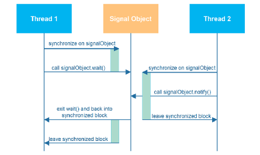

Miss signal: nếu thread 1 call notify() trước thread 2 call wait() thì thread 2 vẫn sẽ wait, và có thể là nó
sẽ bị wait mãi bởi vì tín hiệu notify() đã thực thi xong trước khi thread 2 wait() ⇒ deadlock

- Giải pháp là dùng 1 biến để kiểm tra trước khi wait()
- doNotify() đặt wasSignalled thành true trước khi gọi notify() để đảm bảo thread đích dù có wait() hay không
  thì signal vẫn được lưu -> doWait() được gọi, kiểm tra wasSignnalled == true, bỏ qua wait() và tiếp tục.
Cách tránh missed signal là lưu trạng thái signal trước khi `notify()`:

```java
private boolean wasSignalled;

public synchronized void doWait() throws InterruptedException {
    while (!wasSignalled) {
        wait();
    }
    wasSignalled = false;
}

public synchronized void doNotify() {
    wasSignalled = true;
    notify();
}
```

Spurious wakeups tức các thread đang wait() có thể wakeup ngay cả khi notify(), notifyAll() không được gọi
(nguyên nhân nằm ở hệ thống/ JVM bên dưới, không phải logic code)
Với `wait()`, luôn kiểm tra điều kiện bằng `while`, không dùng `if`, để chống spurious wakeup:

```java
while (!wasSignalled) {
    wait();
}
```

- nếu xảy ra spurious wakeup thì thread sẽ thoát khỏi wait() dù wasSignalled vẫn false ⇒ có thể gây ra lỗi
  nghiêm trọng trong application.

tryLock() , lock

## Các mô hình concurrency

Concurrency model đề cập tới các cách tổ chức các threads trong một hệ thống để chúng có thể thực thi đồng
thời 1 công việc

Parallel worker model còn gọi là mô hình Master - worker hoặc Task Parallelism, là 1 cách triển khai
multi-thread trong đó:
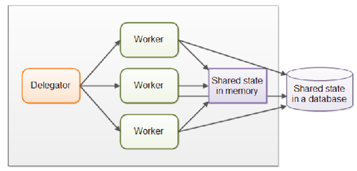

- 1 master thread phân chia công việc thành các tasks nhỏ
- n worker thread nhận tasks và xử lý song song
- Xử lý xong thì kết quả tổng hợp và trả về master thread.
- Master thread thì không làm việc nặng, mà chỉ phân phối task, không tham gia tính toán
- Ưu điểm là dễ scale (muốn tăng tốc độ thì thêm 1 worker thread), phù hợp cho bài toán chia nhỏ để xử lý, tận
  dụng tối đa khả năng xử lý của CPU
- Nhược điểm là sẽ trở nên phức tạp khi xử lý các shared resource, hiệu suất giảm do tranh chấp tài nguyên
  (resource contention) khi các worker thread xử lý trên cùng 1 resource + thứ tự thực thi task sẽ không thể
  xác định được
- Trong Java có support ExecutorService, ForkJoinPool,...

=> Nên dùng khi thực hiện các task không phụ thuộc, độc lập với nhau, không đảm bảo thứ tự thực thi giữa các
task

Assembly Line tổ chức các worker thành 1 dây chuyền công đoạn, mỗi worker nhận và xử lý 1 phần công việc, sau
đó chuyển kết quả cho các worker tiếp theo

**(Đọc khó hiểu, đọc lại sau)** tiếp

## Concurrency và Parallelism

Concurrency, Parallelism là các thuật ngữ sử dụng thường xuyên trong multi-thread, mọi người thường nhầm tưởng
rằng nó là cùng 1 concept nhưng thực sự lại khác nhau.

Concurrency có nghĩa là 1 application đang thực thi nhiều task cùng 1 thời điểm
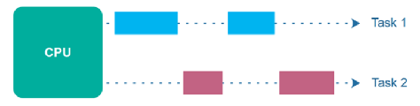

- Nếu máy tính chỉ có 1 CPU, chỉ có 1 thread được CPU thực thi tại 1 thời điểm + để thực thi trên nhiều thread
  thì CPU sẽ phải switch giữa các thread.

Parallelism xảy ra khi 1 application được thực thi > 2 CPU hoặc 1 CPU có nhiều core ⇒ các thread do đó được
thực thi cùng lúc
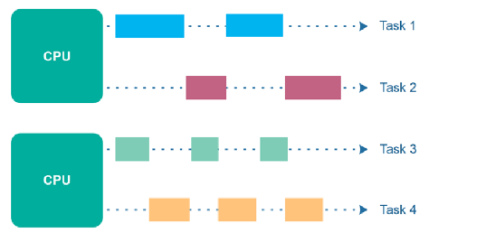

## Java Memory Model

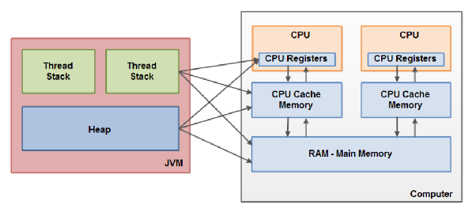
Internal Java memory model được sử dụng trong nội bộ của JVM, chia memory thành các thread stack và Heap.

- Thread Stack (1 thread - 1 thread stack) còn được gọi là Call Stack vì nó chứa thông tin về các method mà
  thread đã gọi (ngăn xếp cuộc gọi) + khi thread thực thi code, Call Stack sẽ thay đổi liên tục: method mới
  được đẩy vào Stack, kết thúc thì sẽ bị lấy ra khỏi Stack.
- Mỗi method trong Stack có các local variable của riêng nó + thread chỉ có thể truy cập vào Stack của chính
  nó, không thể truy cập vào Stack của thread khác

- Heap thì gồm toàn bộ các Object variable được tạo trong Java bất kể là do thread tạo ra
- Mặc định các Primitive variable lưu trữ hoàn toàn trên Stack của mỗi thread >< nếu nó lại đóng vai trò là
  Member variable của 1 object thì nó lại nằm trên Heap cùng với object đó.
- Object variable sẽ nằm trên Heap, nhưng references lại nằm trên Stack để trỏ tới vị trí trong Heap + Static
  cũng nằm trên Heap (trong vùng nhớ Class Metadata)
- Do Heap được dùng chung giữa các thread nên không phải Thread safe, cần cơ chế đồng bộ.

- Để tăng tốc độ, mỗi CPU thường copy dữ liệu từ RAM vào Cache riêng của nó. Nếu luồng A thay đổi giá trị của
  biến `x` trong Cache của nó, luồng B (chạy trên CPU khác) có thể vẫn thấy giá trị cũ của `x` trong RAM hoặc
  trong Cache riêng của luồng B.

⇒ JMM giải quyết hai vấn đề lớn:

- Tính hiển thị (Visibility): Khi nào một luồng thay đổi giá trị, luồng khác chắc chắn sẽ thấy?
- Sự sắp xếp lại (Instruction Reordering): Compiler và CPU đôi khi tự ý thay đổi thứ tự các dòng code để tối
  ưu tốc độ, JMM ngăn chặn điều này nếu nó làm sai lệch kết quả logic.

Hardware memory architecture là thành phần kiến trúc phần cứng về máy tính hiện đại

- Multi-core, Multi-CPU giúp xử lý song song tốt do mỗi core có thể xử lý 1 thread riêng biệt
- CPU register: bên trong CPU có các register: bộ nhớ nhanh nhất của CPU, kích thước nhỏ (xx - xxx bytes)
- CPU cache: bên ngoài CPU nhưng nhanh hơn RAM, chậm hơn CPU register + trước khi load vào CPU register phải
  load dữ liệu vào CPU Cache trước (L1, L2, L3)
- RAM: bộ nhớ chính, nhưng tốc độ lại thấp hơn so với 2 cái trên + tất cả CPU của máy dùng chung, lưu trữ dữ
  liệu chương trình đang chạy

Khi CPU muốn đọc dữ liệu -> đọc từ CPU Cache, không có -> đọc từ RAM -> load vào Cache memory -> load vào CPU
register để CPU tính toán -> ghi từ CPU register vào CPU Cache (giải phóng CPU register) -> Cache đồng bộ lại
vào RAM (không ngay lập tức mà sẽ là ở 1 thời điểm nào đó, thường là khi cần lưu trữ thêm những thứ khác trong
Cache + có thể lưu lại RAM tại 1 thời điểm, load lên Cache 1 thời điểm, không nhất thiết là phải cùng lúc)

- Tuy nhiên hardware cũng không phân biệt Heap, Stack mà quy nó về là RAM thôi

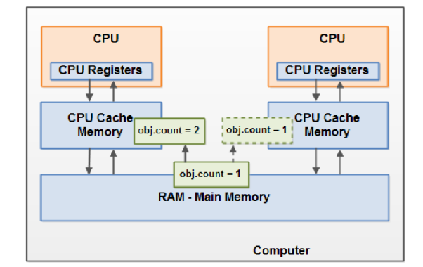

- Nếu 2 thread cùng sử dụng 1 biến mà không sử dụng các tác vụ đồng bộ hóa, khi 1 thread thực thi thay đổi giá
  trị thì các thread khác sẽ không thấy được sự thay đổi đó do đã bị load vào CPU Cache.

## Concurrency trong Java

Instruction re-ordering tức CPU, JVM có thể thay đổi thứ tự thực thi lệnh để tối ưu hiệu năng

- 1 CPU thực thi 1 thread nhưng không có nghĩa là chúng thực thi đồng bộ, mà có thể thực thi các câu lệnh
  trong đó 1 cách song song để tối ưu hóa (do 1 CPU có nhiều executive unit bên trong và chúng giúp thực thi
  song song).
- Giả sử thread thực thi 4 lệnh sau:

Ví dụ các lệnh có phụ thuộc dữ liệu:

```text
a = b + c
d = a + e
l = m + n
y = x + z
```

- Nhưng nhận thấy rằng dòng lệnh (1), (2) phải đợi nhau do dùng chung ‘a’, nên CPU quyết định thực thi (1),
  (3) trước -> (2) (4) sau một cách đồng thời để tối ưu performance (ví dụ thôi, giả sử có nhiều lệnh khác
  nữa)

CPU/compiler có thể chạy các lệnh độc lập trước để tối ưu, miễn là không phá logic trong single-thread:

```text
a = b + c
l = m + n
y = x + z
d = a + e
```

- Tuy nhiên nó lại gặp phải vấn đề trong multi-thread, sự thực thi trước và sau của câu lệnh có thể thay đổi
  kết quả sau cùng (kiểu 1 variable làm flag, nhưng nó chuyển xuống cuối cùng chẳng hạn, nhưng nó chỉ đúng khi
  code mình đặt ban đầu ở dòng 1, gây sai,...)
Trong multi-thread, reordering có thể làm thread khác thấy `flag = true` trước khi data thật được ghi xong. Vì
vậy cần happens-before qua `volatile`, `synchronized`, lock, atomic hoặc concurrent collection.

Happen - before guarantee: là một tập hợp các quy tắc cốt lõi định nghĩa mối quan hệ thứ tự giữa các thao tác
bộ nhớ (đọc và ghi).

- Nói một cách đơn giản: Nếu sự kiện A có quan hệ "happens-before" với sự kiện B, thì kết quả của A đảm bảo sẽ
  hiển thị (visible) đối với B và thứ tự thực hiện này được duy trì bất kể các tối ưu hóa của trình biên dịch
  hay phần cứng.
- Lý do cần Happen - before: Trong môi trường đa luồng, CPU và trình biên dịch thường thực hiện Reordering
  (thay đổi thứ tự lệnh) và sử dụng Caching (bộ nhớ đệm riêng của từng core) để tăng hiệu suất → Nếu không có
  Happens-Before, một Luồng 2 có thể đọc được giá trị cũ của biến mà Luồng 1 đã thay đổi, hoặc thấy các lệnh
  thực hiện sai thứ tự logic, dẫn đến lỗi dữ liệu nghiêm trọng.
- Happens-Before không chỉ nói về thời gian, nó nói về tầm nhìn dữ liệu:
  - Tính nhất quán: Khi quy tắc này được thiết lập, nó tạo ra một "rào cản bộ nhớ" (Memory Barrier).
  - Đảm bảo: Mọi thay đổi thực hiện bởi Luồng A trước khi thiết lập quan hệ Happens-Before sẽ được đẩy từ
    Cache vào Main Memory, và Luồng B sẽ buộc phải tải lại dữ liệu mới nhất từ Main Memory thay vì dùng giá
    trị cũ trong Cache của nó.

Trong Java, có những cách để đạt được Happen - before:

- synchronized (monitor lock) là cơ chế khóa độc quyền: Khi một thread thoát khỏi khối synchronize (Unlock),
  nó buộc phải đẩy (flush) toàn bộ dữ liệu từ bộ nhớ đệm (Cache) của nó vào bộ nhớ chính (Main Memory) +
  thread tiếp theo tiến vào khối synchronized đó (Lock) sẽ buộc phải xóa bộ nhớ đệm cá nhân và tải lại dữ liệu
  mới nhất từ Main Memory → Mọi hành động trước khi Unlock sẽ hiển thị với luồng sau khi Lock.
- volatile: là cơ chế đánh dấu biến không được phép lưu vào bộ nhớ đệm của CPU, tức mọi thao tác ghi vào biến
  volatile được thực hiện trực tiếp trên Main Memory. Mọi thao tác đọc biến volatile cũng được lấy trực tiếp
  từ Main Memory.
- java.util.concurrent.atomic sử dụng nguyên lý CAS (compare and swap) ở cấp độ phần cứng, chúng cung cấp các
  phương pháp đọc-ghi nguyên tử (atomic) → Việc ghi vào một biến Atomic có tác dụng về tính hiển thị tương tự
  như việc ghi vào một biến volatile.
- Concurrency collection như `ConcurrentHashMap`, `CopyOnWriteArrayList`, `BlockingQueue`,... vì nội bộ các
  lớp này đã triển khai sẵn các rào cản bộ nhớ (Memory Barriers) bằng cách kết hợp volatile và các kỹ thuật
  khóa.

Memory Barriers (fence) là các lệnh đặc biệt của CPU dùng để ép trình tự thực hiện các thao tác đọc/ ghi phải
theo 1 thứ tự nhất định.

- Để tối ưu hiệu năng, CPU thực thi các lệnh không theo thứ tự, ghi kết quả tạm vào CPU Cache, đọc dữ liệu từ
  Cache thay vì RAM dẫn tới race condition khi nhiều thread cùng truy cập dữ liệu -> Memory barriers đảm bảo
  thao tác đọc, ghi từ nhiều thread được thực thi theo đúng thứ tự, ngăn chặn lại các lỗi khó phát hiện do tối
  ưu hóa hardware (thực thi không tuần tự, CPU cache, instruction re-ordering,...)
- Load barrier (read barrier) đảm bảo tất cả các lệnh read trước barrier hoàn tất trước khi thực hiện các lệnh
  read sau barrier + tại vị trí barrier làm mới toàn bộ CPU Cache để đọc giá trị mới nhất từ RAM

Load barrier đảm bảo các lệnh đọc trước barrier hoàn tất trước các lệnh đọc sau barrier.

- Store barrier (write barrier) đảm bảo tất cả các lệnh write trước barrier hoàn tất trước khi thực hiện các
  lệnh write sau barrier + tại vị trí barrier, thực hiện đẩy toàn bộ dữ liệu từ CPU Cache vào RAM để các
  thread khác thấy được sự thay đổi.

Store barrier đảm bảo các lệnh ghi trước barrier được flush/commit trước các lệnh ghi sau barrier.

- Full barrier = Load barrier + Store barrier

Full barrier = load barrier + store barrier.

Ví dụ: `AtomicInteger` thường dựa trên volatile/CAS nên vừa có tính visibility, vừa có atomic update cho thao
tác đơn giản.

Volatile giúp việc đọc, ghi sẽ áp dụng trực tiếp lên RAM thay vì CPU cache (các giá trị thực hiện ghi ở trước
volatile đều flush xuống RAM)/

- Visibility problem resolve: giá trị áp dụng của variable sẽ là realtime, không có sự khác biệt giữa các
  thread do thread được write, read trực tiếp vào RAM
- Instruction re-ordering resolve: ngăn re-ordering với volatile đọc, ghi.
- Write Visibility Guarantee: khi một luồng ghi giá trị vào một volatile variable, Java thực hiện một hành
  động "dọn dẹp" quy mô lớn:
  - Lệnh ghi volatile: Giá trị của volatile variable được ghi thẳng vào Bộ nhớ chính (Main Memory), không giữ
    lại ở Cache của CPU.
  - Hiệu ứng đi kèm: Tất cả các biến khác (dù là biến thường) mà luồng đó đã thay đổi trước khi ghi vào
    volatile variable cũng sẽ được đẩy vào Main Memory cùng lúc.
Write visibility guarantee: ghi vào biến `volatile` sẽ flush cả các thay đổi trước đó của thread xuống main
memory.

- Read Visibility Guarantee: Tương tự, khi một luồng đọc một volatile variable, nó không chỉ lấy giá trị mới
  nhất của biến đó:
  - Lệnh đọc volatile: Luồng buộc phải đọc giá trị trực tiếp từ Bộ nhớ chính thay vì dùng giá trị cũ trong
    Cache.
  - Hiệu ứng đi kèm: Sau khi đọc volatile variable, thread đó cũng sẽ tự động làm mới (refresh) tất cả các
    biến khác mà nó có quyền truy cập từ Bộ nhớ chính.
Read visibility guarantee: đọc biến `volatile` buộc thread đọc giá trị mới nhất và refresh các dữ liệu liên
quan từ main memory.

- Tuy nhiên volatile không phải atomic, giả sử 2 thread cùng access vào i++ chẳng hạn, nhưng i++ gồm 3 step đã
  nói ở trên, 2 thread cùng read i trước, cùng tăng i nhưng vẫn giữ ở register, sau đó 2 thread mới thực thi
  write và sẽ bị conflict ⇒ chỉ phù hợp với các biến được write bởi 1 thread nhưng đọc bởi nhiều thread.
- Volatile vừa là 1 Load barrier, vừa là 1 Store barrier
- volatile rẻ hơn nhiều so với synchronized. Nó không gây ra "Lock" (khóa luồng), không làm luồng bị đưa vào
  trạng thái chờ (Waiting). Đọc một biến volatile gần như nhanh bằng đọc biến thường.

synchronized đảm bảo rằng tại một thời điểm, chỉ có duy nhất một luồng được phép truy cập vào một đoạn mã nhất
định để tránh xung đột dữ liệu.

- Là full barrier, đảm bảo từ lúc bắt đầu thực thi khối lock được lấy dữ liệu realtime từ RAM + sau khi thoát
  khỏi khối lock thì flush toàn bộ thay đổi vào RAM (thay vì CPU cache), ũng ngăn hoàn toàn instruction
  re-ordering ⇒ cần chi phí nhỏ khi vào và thoát khỏi khối synchronize.
- Reentrancy: Trong Java, `synchronized` là reentrant. Nghĩa là nếu một luồng đang giữ khóa, nó có thể gọi lại
  chính phương thức đó hoặc phương thức synchronized khác của cùng một khóa mà không bị chặn bởi chính mình.

Ví dụ `synchronized` bảo vệ thao tác `x++`:

```java
public void addValue() {
    synchronized (this) {
        x = x + 1;
    }
}
```

Khi vào block, thread lấy monitor lock; khi ra khỏi block, lock được release và thay đổi được publish theo
JMM.

- synchronize có thể gặp vấn đề deadlock nếu không xử lý đúng cách (các thread khác sẽ treo, ảnh hưởng toàn bộ
  hệ thống) + nếu thực thi đúng cách thì các thread diễn ra tuần tự, sẽ gây latency.
- synchronize là implicit lock - monitor lock, không chủ động lock(), unlock() bởi dev mà được thực hiện bởi
  java.
- Synchronized Method (Instance Level): Khi bạn đặt từ khóa này ở khai báo phương thức của một đối tượng, khóa
  sẽ được áp dụng trên chính đối tượng đó.
Synchronized instance method khóa trên chính object hiện tại:

```java
public synchronized void add(int value) {
    this.count += value;
}
```

  - Các thread khác nhau gọi phương thức này trên *cùng một đối tượng* sẽ phải xếp hàng đợi.
  - Nếu một đối tượng có hai phương thức `synchronized`, một luồng đang chạy phương thức A sẽ chặn tất cả các
    luồng khác muốn vào phương thức B của cùng đối tượng đó.
- Synchronized Static Method (Class Level): Khi áp dụng cho phương thức `static`, khóa sẽ được áp dụng trên
  đối tượng Class (ví dụ: `MyClass.class`), không phải trên từng instance cụ thể.
Synchronized static method khóa trên `Class` object:

```java
public static synchronized void log(String msg) {
    // khóa ở cấp class
}
```

  - Toàn bộ ứng dụng. Dù bạn có tạo bao nhiêu đối tượng đi nữa, tại một thời điểm chỉ có 1 luồng được thực thi
    phương thức này trong lớp đó.

- Synchronized Block (Khối đồng bộ): đây là cách tiếp cận linh hoạt và tối ưu hơn. Thay vì khóa nguyên cả
  phương thức (gây lãng phí thời gian chờ), bạn chỉ khóa đúng đoạn mã cần bảo vệ.
  - Dùng với đối tượng hiện tại (`this`): Tương đương với Synchronized Method nhưng kiểm soát tốt hơn.
Synchronized block với `this` chỉ khóa đoạn code cần bảo vệ:

```java
public void updateData() {
    synchronized (this) {
        this.count++;
    }
}
```

- Dùng với một đối tượng khóa riêng (Lock Object): Giúp tránh việc các luồng vô tình chặn nhau khi truy cập
  vào các tài nguyên không liên quan.

Lock object riêng giúp tránh khóa nhầm toàn bộ object public:

```java
private final Object lock = new Object();

public void secureMethod() {
    synchronized (lock) {
        // logic cần an toàn
    }
}
```

- Nếu `synchronized` là một chiếc "khóa cửa tự động" (bạn vào phòng là cửa tự khóa, ra là tự mở), thì `Lock`
  (được giới thiệu từ Java 5 trong gói `java.util.concurrent.locks`) giống như một bộ "khóa mã số hiện đại" –
  bạn có toàn quyền kiểm soát việc khi nào khóa, khi nào mở và mở bằng cách nào.

ThreadLocal cho phép tạo các variable mà chỉ có thể read, write bởi thread đó ⇒ nếu 2 thread chạy same code,
code chứa LocalThread thì 2 thread này sẽ không thể thấy được ThreadLocal của nhau do mỗi thread có 1
LocalThread riêng.

- ThreadLocal cũng là 1 cách để thread safe
- ThreadLocal tự động giải phóng khi thread kết thúc.
- Nếu dùng threadpool, sử dụng ThreadLocal cần gọi phương thức `.remove()` sau khi dùng xong (không thì data
  của request cũ có thể lọt qua request mới).

### CPU Cache Coherence

Mỗi core CPU có cache riêng (như L1, L2) để truy cập dữ liệu nhanh hơn so với đọc trực tiếp từ RAM. CPU không
nạp từng biến riêng lẻ vào cache mà nạp một khối bộ nhớ liền nhau, thường có kích thước **64 byte**. Khối này
được gọi là **cache line**.

Ví dụ, biến `x` chỉ chiếm 4 byte và nằm bên trong một cache line:

```text
Một cache line 64 byte
┌──────────────┬────────────┬──────────────────────┐
│ dữ liệu khác │ x (4 byte) │ dữ liệu khác         │
└──────────────┴────────────┴──────────────────────┘
```

Khi cần đọc `x`, core sẽ nạp cả cache line chứa `x` vào cache của mình. Vì mỗi core có cache riêng nên nhiều
core có thể cùng giữ các bản sao của cache line này.

Giả sử không có cơ chế đồng bộ các bản sao:

1. Ban đầu `x = 5`.
2. Core A và core B cùng nạp cache line chứa `x`; cả hai đều thấy `x = 5`.
3. Core A sửa `x` thành `10` trong cache của mình.
4. Cache của core B vẫn giữ bản cũ nên core B tiếp tục đọc được `x = 5`.

```text
                    RAM: x = 5
                        │
              ┌─────────┴─────────┐
              ▼                   ▼
        Cache core A         Cache core B
            x = 5                x = 5
              │
        core A ghi x = 10
              │
              ▼
            x = 10               x = 5  ← bản cũ
```

Như vậy, hai core có thể nhìn thấy hai giá trị khác nhau của cùng một vùng nhớ. **CPU Cache Coherence** là cơ
chế phần cứng dùng để giữ cho các bản sao của cùng một cache line trong các cache không mâu thuẫn với nhau.

Khi core A muốn ghi `x = 10`, giao thức coherence xử lý như sau:

1. Core A yêu cầu quyền ghi cache line chứa `x`.
2. Bản sao của cache line đó trong các core khác, ví dụ core B, bị đánh dấu là không hợp lệ.
3. Core A thực hiện thao tác ghi.
4. Khi core B cần đọc `x` lần nữa, nó không được dùng bản cũ mà phải lấy lại cache line mới chứa `x = 10`.

```text
Core A ghi x = 10
        │
        ├── cache line tại core A: chứa x = 10
        │
        └── cache line tại core B: Invalid
                                      │
                              core B đọc x lần nữa
                                      │
                                      ▼
                              lấy cache line mới
                              và đọc được x = 10
```

Một giao thức Cache Coherence phổ biến là **MESI**. Mỗi bản sao của một cache line tại một core được gắn một
trạng thái:

- **Modified (M):** core này đã sửa cache line và đang giữ bản mới nhất.
- **Exclusive (E):** chỉ core này giữ cache line và nội dung chưa bị sửa.
- **Shared (S):** nhiều core đang giữ các bản sao giống nhau để đọc.
- **Invalid (I):** bản sao đã hết hiệu lực và không được phép sử dụng.

Các core trao đổi thông điệp coherence qua interconnect; bus snooping là một cách triển khai. Điều quan trọng
là Cache Coherence theo dõi **cả cache line**, không theo dõi từng biến nằm bên trong nó. Do đó, một thao tác
ghi vào một biến sẽ làm vô hiệu toàn bộ cache line tương ứng ở core khác.

> Cache Coherence không thay thế `volatile`, lock hay quy tắc happens-before của Java. Cache Coherence giữ các
> bản sao cache line nhất quán ở tầng phần cứng; Java Memory Model quy định khi nào thao tác ghi của một
> thread chắc chắn nhìn thấy được bởi thread khác và kiểm soát việc sắp xếp lại lệnh.

### False Sharing

False Sharing (chia sẻ giả) là hiện tượng nhiều thread sửa **các biến khác nhau**, nhưng các biến lại nằm
chung một cache line. Vì coherence hoạt động theo cache line, mỗi lần một core ghi biến của mình, bản sao của
cả cache line ở core kia vẫn bị vô hiệu hóa. Kết quả là cache line liên tục bị chuyển qua lại giữa các core dù
không có tranh chấp dữ liệu về mặt logic.

Cache line thường có kích thước 64 byte. Giả sử hai biến `long` nằm cạnh nhau trong cùng một line:

```text
Cache line 64 byte
┌───────────────────────────────┐
│ a (8 byte) │ b (8 byte) │ ... │
└───────────────────────────────┘
      ↑             ↑
 Thread A ghi   Thread B ghi

Thread A ghi a → cache line của core B bị invalid
Thread B ghi b → cache line của core A bị invalid
                 ↺ lặp lại liên tục
```

Hai thread không dùng chung biến, nhưng vẫn tranh chấp **quyền sở hữu cache line**, làm tăng coherence traffic
và giảm hiệu năng.

Dấu hiệu thường gặp: code không có contention logic, nhưng throughput giảm khi tăng số thread. Cách khắc phục
là tách các biến được ghi thường xuyên sang những cache line khác nhau bằng padding hoặc bố trí lại dữ liệu.
Java có annotation `@Contended` để JVM chèn khoảng đệm, nhưng thường phải bật thêm tùy chọn JVM phù hợp khi
dùng cho class của ứng dụng.

## Phối hợp và truyền tín hiệu giữa các thread

Thread Signaling (Truyền tín hiệu giữa các luồng) trong Java. Đây là một khái niệm quan trọng để giải quyết
bài toán điều phối luồng, giúp các thread làm việc nhịp nhàng với nhau thay vì chạy hỗn loạn.
Mọi đối tượng (Object) trong Java đều có một "Monitor" (khóa nội tại). Ba phương thức này hoạt động dựa trên
việc chiếm hữu khóa đó:

- wait(): Buộc thread hiện tại phải dừng lại và giải phóng khóa mà nó đang giữ. Thread này sẽ rơi vào trạng
  thái "chờ" (waiting) cho đến khi một thread khác đánh thức nó.
- notify(): Đánh thức một thread ngẫu nhiên đang đợi trên đối tượng đó.
- notifyAll(): Đánh thức tất cả các thread đang đợi trên đối tượng đó. Thread nào giành được khóa trước sẽ
  chạy trước.
- wait/ notify sử dụng để nhả Lock tạm thời để thread khác làm việc.
- Workflow: thread B muốn lấy dữ liệu nhưng hộp trống, nó gọi `wait()`, lúc này, thread B tạm dừng và nhường
  quyền kiểm soát cho các thread khác → thread A nhảy vào, bỏ dữ liệu vào hộp, sau khi xong, nó gọi `notify()`
  → thread B nhận được tín hiệu, tỉnh dậy, kiểm tra lại hộp và tiếp tục xử lý.
- Bản chất synchronized, wait/ notify đều dùng để điều phối các thread, nhưng chúng giải quyết hai bài toán
  khác nhau hoàn toàn: Sự tranh chấp (Contention: đảm bảo tại một thời điểm chỉ có 1 thread được tiếp cận dữ
  liệu, tránh việc race condition.) và Sự hợp tác (Cooperation: cho phép các thread giao tiếp với nhau về tình
  trạng của tài nguyên.).
Tóm tắt `wait()`/`notify()`:

- Thread gọi `wait()` phải đang giữ monitor lock; sau đó nó nhả lock và chuyển sang WAITING.
- Thread khác gọi `notify()`/`notifyAll()` trên cùng object để đánh thức thread đang chờ.
- Sau khi được đánh thức, thread phải lấy lại lock rồi mới chạy tiếp.

So sánh nhanh:

| Cơ chế | Dùng để làm gì |
| --- | --- |
| `synchronized` | Bảo vệ critical section, tránh nhiều thread sửa cùng lúc. |
| `wait()` / `notify()` | Điều phối thread theo trạng thái dữ liệu/tài nguyên. |

Nếu chỉ dùng `synchronized`, consumer có thể giữ lock trong lúc chờ dữ liệu, làm producer không vào được để
tạo dữ liệu.

Khi dùng `wait()`/`notify()`, consumer chờ bằng `wait()` nên nhả lock; producer vào được, tạo dữ liệu rồi
`notify()` để consumer chạy tiếp.

notify() vs notifyAll(): tiếp nối câu chuyện về cơ chế điều phối Thread, việc chọn giữa notify() và
notifyAll() là một quyết định quan trọng để tránh lỗi.
`notify()` đánh thức một thread ngẫu nhiên trong wait set; `notifyAll()` đánh thức tất cả thread đang chờ rồi
để chúng tranh lock lại.

Khi nhiều Thread cùng gọi `wait()` trên một đối tượng, chúng sẽ rơi vào một danh sách chờ gọi là Wait Set.

- notify(): Chỉ đánh thức duy nhất một thread ngẫu nhiên trong danh sách chờ. Các thread còn lại vẫn tiếp tục
  ngủ >< notifyAll(): Đánh thức tất cả các thread đang đợi trong danh sách đó. Sau khi tỉnh dậy, tất cả các
  thread này sẽ tranh giành khóa (lock) để được thực thi + thực tế notifyAll() thường được ưu tiên:
`notifyAll()` thường an toàn hơn khi có nhiều loại điều kiện chờ, vì thread được đánh thức sẽ tự kiểm tra lại
điều kiện trong vòng `while`.

`notifyAll()` tốn thêm chi phí wake-up/context switching, nhưng giảm rủi ro đánh thức sai thread và treo hệ
thống.

Missed Signals (Mất tín hiệu): Nói một cách dân dã, `wait()` và `notify()` trong Java rất "vô tâm". Nếu bạn
bấm chuông (`notify`) mà lúc đó không có ai đứng đợi ở cửa, cái tiếng chuông đó sẽ tan biến vào hư không. Khi
người khách đến sau đó và đứng đợi, họ sẽ đợi mãi mãi vì tiếng chuông đã reo xong từ lâu rồi.
⇒ Giải pháp: "Ghi nhật ký" tín hiệu bằng biến wasSignalled: Để khắc phục, chúng ta cần một cái "hộp thư" để
lưu lại tín hiệu. Biến `boolean wasSignalled` chính là hộp thư đó
Mẫu lưu signal:

```java
public void doNotify() {
    synchronized (monitorObject) {
        wasSignalled = true;
        monitorObject.notify();
    }
}
```

Mẫu chờ signal:

```java
public void doWait() throws InterruptedException {
    synchronized (monitorObject) {
        while (!wasSignalled) {
            monitorObject.wait();
        }
        wasSignalled = false;
    }
}
```

## Đồng bộ dựa trên lock (blocking)

Trước Java 5, chúng ta chỉ có `synchronized`. Nó giống như một cái khóa cửa tự động: hễ bạn đi vào phòng là
cửa tự khóa, bạn ra ngoài là cửa tự mở. Tuy nhiên, nó khá cứng nhắc.
Lock (trong gói `java.util.concurrent.locks`) linh hoạt hơn vì:

- Thử khóa (Try Lock): Bạn có thể kiểm tra xem cửa có đang khóa không, nếu có thì đi làm việc khác thay vì
  đứng chờ mãi mãi.
- Thời gian chờ: Bạn có thể đợi trong 5 phút, nếu cửa không mở thì bỏ đi.
- Nhiều điều kiện (Conditions): Bạn có thể chia luồng chờ thành các nhóm khác nhau (ví dụ: nhóm chờ đọc, nhóm
  chờ ghi).
- Dù các lớp như `ReentrantLock` có vẻ cao cấp, nhưng ở tầng sâu nhất của mã nguồn, chúng vẫn cần một cơ chế
  để đảm bảo rằng các biến trạng thái bên trong nó không bị tranh chấp → bản thân cũng đang sử dụng
  `synchronized` (Đừng nghĩ `Lock` ra đời là để khai tử `synchronized`. `Lock` là một công cụ mạnh mẽ hơn dành
  cho các bài toán phức tạp, nhưng nó vẫn đứng trên vai "người khổng lồ" là `synchronized`.)
`Lock` linh hoạt hơn `synchronized` ở các điểm chính: có `tryLock()`, timeout, `lockInterruptibly()`, nhiều
`Condition`, và tùy chọn fair/non-fair lock.

Khi dùng `Lock`, luôn release trong `finally`:

```java
lock.lock();
try {
    // critical section
} finally {
    lock.unlock();
}
```

Lock-based là cơ chế đồng bộ hóa sử dụng lock như mutex, semaphore,... để đảm bảo tại 1 thời điểm chỉ có thể
có 1 thread truy cập vào shared resource.

- Nếu lock đã bị obtain từ thread khác, các thread còn lại muốn truy cập tài nguyên thì phải đợi thread kia
  release lock -> các thread còn lại tiếp tục obtain lock,... vòng lặp này xảy ra cho tới khi không còn thread
  nào đợi lock nữa.
- Thread bị chặn sẽ rơi vào trạng thái Sleep và chờ OS đánh thức → Nên sử dụng khi sự tranh chấp giữa các
  thread là ít vì nếu tranh chấp nhiều thì thread bị block dẫn tới context switching nhiều gây ra overhead.
- Nên sử dụng trong các tác vụ phức tạp hơn (đồng bộ trong 1 tập dòng code)
- Chỉ có thread obtain lock mới có khả năng release lock (thường thread đó tự rent ra 1 cái unique key, và dựa
  vào unique key này để obtain lock và release lock mà các thread khác không có được key này)
- Cơ chế: Sử dụng các công cụ như `Mutex`, `Semaphore`, hoặc `synchronized` (trong Java). Khi một luồng đang
  giữ khóa, các luồng khác muốn vào phải đứng đợi.
- Dễ hiểu, dễ code: Luồng tư duy tuyến tính, bảo vệ được các khối code phức tạp + An toàn tuyệt đối: Đảm bảo
  tính nhất quán của dữ liệu trong các thao tác dài >< Hiệu năng (Overhead): Việc chuyển đổi ngữ cảnh (Context
  Switch) giữa các luồng rất tốn kém + Deadlock: Dễ xảy ra tình trạng các luồng chờ đợi lẫn nhau vô thời hạn +
  Priority Inversion: Luồng ưu tiên thấp giữ khóa khiến luồng ưu tiên cao phải chờ.
- Usecase: Các thao tác xử lý dữ liệu kéo dài và phức tạp (như ghi file, truy vấn DB, gọi API). Nếu dùng CAS ở
  đây, luồng sẽ phải đợi quá lâu và lặp lại vô ích + Khi sự an toàn của dữ liệu là ưu tiên hàng đầu và tần
  suất truy cập không quá dày đặc + Khi bạn muốn code dễ bảo trì, dễ đọc cho team.

### Semaphore

Semaphore là cơ chế đồng bộ hóa dựa trên biến đếm để kiểm soát truy cập đồng thời vào shared resource.

- semaphore counting: tức số lượng thread tối đa có thể access vào shared resource. Với mutex lock thì
  counting = 1 (binary semaphore) do tại 1 thời điểm chỉ có 1 thread access vào được + nếu != 1 thì tại 1 thời
  điểm thì có nhiều thread cùng truy cập vào được (tại 1 thời điểm chỉ có thể có tối đa 5 thiết bị đăng nhập,
  throttling giới hạn số lượng yêu cầu xử lý trong 1 khoảng thời gian, giới hạn số lượng connection tới
  database,....)
- permit: được gọi là giấy phép, nếu permit vẫn còn (counting > 0\) thì vẫn sẽ cho thread access vào. (số
  lượng permit tối đa = semaphore counting)
- acquire(): đại diện cho request từ 1 thread yêu cầu access vào shared resource, nếu permit có sẵn (counting
  > 0\) thì cho phép vào resource và trừ biến đếm counting đi 1 (mất 1 permit) >< nếu counting = 0 tức thread
  sẽ không có quyền truy cập, bị block cho tới khi permit available.
- release(): trả lại permit cho semaphore, thường được sử dụng khi thread đã sử dụng resource xong.
- semaphore không có ownership như mutex, thread này có thể acquire() nhưng thread khác có thể release() +
  cũng không thuộc loại reentrant

### Mutex

Mutex (Mutual Exclusion) ngăn thread khác truy cập resource đang được một thread xử lý.

- mutex algorithm đảm bảo rằng nếu 1 thread đang chuẩn bị/ đang sửa đổi trên dữ liệu thì không có 1 thread nào
  khác được access, modify cho tới khi nó hoàn tất, giải phóng để các thread khác có thể tiếp tục ⇒ không thể
  xảy ra race condition.
- Tại 1 thời điểm thì chỉ có 1 thread obtain được mutex lock, chỉ có thread obtain được lock thì mới có thể
  thực thi task + các thread khác đang đợi để obtain lock thì không thể thực thi chương trình
- Mutex lock không đáp ứng được trong môi trường hiệu suất cao do các thread bị block do đợi để obtain lock
  nên sẽ xảy ra quá nhiều context switching nên sẽ gây giảm performance đi nhiều ⇒ giải pháp là sử dụng atomic
  không gây block thread, không cần context switching.
- Mutex dễ gây deadlock nếu sử dụng quá nhiều lock lồng nhau.

### Read-write lock

Read-write lock cho phép nhiều thread đọc đồng thời, nhưng chỉ cho phép một thread ghi tại một thời điểm.
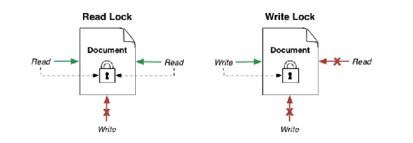

- Tối ưu hiệu suất khi có nhiều thread read dữ liệu nhưng ít thread write dữ liệu, đảm bảo consistency data
  khi có nhiều thao tác write.
- Nhiều thread có thể obtain Shared lock (read lock) + nếu có thread nào đó đã obtain read lock thì không được
  phép có thread nào obtain Exclusive lock (write lock) ⇒ quá trình read data sẽ là consistency vì trong lúc
  read không có thread nào write được data.
- 1 thread có thể obtain được Exclusive lock nếu không có thread nào đang obtain lock (kể cả Shared lock hoặc
  Exclusive lock)
- Trong Java có hỗ trợ qua class ReenTrantReadWriteLock.

#### Ưu điểm

- Hiệu suất sẽ cao khi làm việc với application mà công việc read > write nhiều, dữ liệu cực kỳ ít có sự thay
  đổi.
- Ưu điểm hơn mutex lock vì nó lock ngay cả khi chỉ có read thread.
- Đảm bảo chỉ có 1 write thread được thực thi + các read thread cũng không đọc được data trong lúc modify data
  này

#### Nhược điểm

- Có thể gây starvation cho các write thread khi có quá nhiều read thread, lúc này write thread phải đợi toàn
  bộ read thread thực thi xong thì mới có thể obtain lock + nếu read thead cứ thêm liên tục thì write thread
  sẽ không được xử lý.
- Hiệu suất tốt hơn Mutex lock khi read nhiều write >< tần suất write cao thì hiệu suất lại kém hơn Mutex

#### Khi nào sử dụng

- PostgreSQL, MySQL đang sử dụng Read-write lock trong xử lý transaction
- Redis sử dụng RW lock trong đồng bộ dữ liệu giữa các node trong Redis cluster.
- ConcurrentHashMap trước java 8 sử dụng Segment locking (một dạng RW lock tối ưu)

### Fair lock

Fair lock ưu tiên cấp lock theo thứ tự các thread đã yêu cầu.

- Sử dụng cơ chế FIFO, đảm bảo tính công bằng giữa các thread
- Java cũng sử dụng ReentrantLock với fair mode được (biến true)

Fair lock trong Java:

```java
private static final ReentrantLock lock = new ReentrantLock(true);
```

#### Ưu điểm

- Do tính công bằng này, tránh hiện tượng starvation
- Quan trọng khi cần phải xử lý các request theo thứ tự tuần tự

#### Nhược điểm

- Chi phí cao hơn do phải duy trì 1 queue và chi phí quản lý nó, nên tốc độ xử lý sẽ chậm hơn so với các loại
  unfair lock khác.

### Spinlock

Spinlock bảo vệ shared resource bằng cách để thread liên tục kiểm tra lock thay vì chuyển sang trạng thái chờ.

- Busy-waiting tức khi 1 thread muốn obtain 1 spinlock, tuy nhiên nó đã bị obtain từ thread khác thì thread
  này sẽ loop liên tục để check lock cho tới khi nó thực sự được release (tức là thread không nghỉ, sleep ngay
  cả khi nó bị block mà loop liên tục)
- Khác với các loại lock khác thì spinlock sẽ không đưa thread vào trạng thái sleep (VD: mutex) mà thread vẫn
  thực thi loop liên tục để obtain lock.

#### Ưu điểm

- Phù hợp với các case mà thời gian obtain lock của các thread khác thì ngắn ⇒ lúc này dùng spinlock có thể
  tránh được chi phí context switching nên hiệu suất sẽ cao
- Không tốn chi phí sleep, wake up (mutex, semaphore yêu cầu hđh đưa thread vào trạng thái sleep -> wake up
  lại gây tốn performance) >< spinlock chỉ loop nên phản ứng nhanh khi lock được release.
- Phù hợp với server dùng multi-core CPU thì thread dùng spinlock sẽ không ảnh hưởng tới các thread khác do có
  nhiều core mà.
- Ticket lock là 1 biến thể của spinlock để đạt được tính fair: mỗi thread muốn vào critical section phải lấy
  giá trị của biến đếm tăng dần (ticket) -> thread sau vào sẽ cũng lấy giá trị biến đếm này (và nó đã tăng so
  với thread trước 1 đơn vị nên thứ tự thực thi của nó sẽ sau thread trước). Ngoài ra còn có các biến thể khác
  như MCS Lock, Adaptive Spinlock,...
Ticket lock rút gọn:

```text
myTicket = nextTicket++
while (serving != myTicket) spin
// critical section
serving++
```

#### Nhược điểm

- Chiếm và gây lãng phí CPU, gây ảnh hưởng tới các thread còn lại nếu lock bị keep quá lâu
- Không phù hợp với các task mà thời gian obtain lock cao.

#### Khi nào sử dụng

- Thường dùng trong hệ điều hành, các application yêu cầu realtime
- Khi thời gian giữ lock cực kì ngắn, ít contention

### Intrinsic lock / Monitor lock

Mỗi object Java đều gắn với một intrinsic lock, còn gọi là monitor lock.

- Trong java, ta có thể đạt được bằng cách sử dụng synchronized + synchronized trên 1 object bản chất là đang
  obtain chính intrinsic lock của object đó.

#### Ưu điểm

- Đơn giản, dễ sử dụng mà không cần nhiều config, chỉ cần synchronized keyword + tự xử lý unlock() khi thoát
  khỏi block

#### Nhược điểm

- Không hỗ trợ các tính năng như tryLock(), lockInterruptibly(), timeout,...

#### Khi nào sử dụng

- Logic đơn giản, không yêu cầu kiểm soát nâng cao như phần nêu trên ⇒ nếu cần nâng cao hơn thì trong Java nên
  sử dụng ReentrantLock class.
- Code rõ ràng, dễ maintain hơn

abandoned lock
implicit lock
Update lock, Intent lock, Schema lock, Bulk update lock

### Distributed lock

Distributed lock mở rộng ý tưởng mutual exclusion sang môi trường có nhiều process hoặc server.

- Mutex lock truyền thống chỉ giải quyết được concurrency giữa các thread trong cùng 1 server, tuy nhiên nếu
  có nhiều server thì lại không đảm bảo được -> distributed lock là giải pháp.

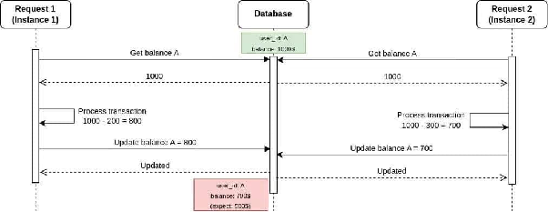
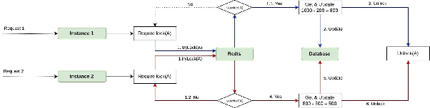

- Trong môi trường phân tán, nhiều server, thread chạy song song, việc đồng bộ hóa truy cập vào cùng 1 tài
  nguyên là rất khó -> distributed lock giúp tránh race condition khi nhiều server/ thread cùng truy cập, thay
  đổi cùng 1 tài nguyên, đảm bảo dữ liệu consistency
- Nếu tại 1 thời điểm, muốn ngăn chặn nhiều thread, server cùng access vào 1 tài nguyên thì nên dùng
  Distributed lock.
- Tại 1 thời điểm, chỉ 1 client được giữ lock và truy cập được shared resource
- Lock cần được release, ngay cả khi server crash + ngay sau khi lock được release thì các thread khác có thể
  obtain được lock, ngăn cho các thread còn lại truy cập resource.
- Thời gian obtain, release lock phải thật nhanh.
- Mỗi lock nên gắn id để tránh trường hợp thread A vô tình release lock của thread B, tức là chỉ có thread
  obtain lock mới có quyền release lock.
- Tránh để lock release trước khi task hoàn thành -> thread B có thể nhảy vào mà thực thi chương trình dù
  thread A đang thực thi.
- Các usecase phổ biến như: cronjob dùng để tránh nhiều node xử lý cùng 1 tập dữ liệu, leader election để chọn
  master node, rate limit, distributed transaction, xử lý đồng thời nhiều đơn hàng tại 1 thời điểm, tránh
  nhiều worker cùng lấy 1 message từ message queue …
- Redis dùng Lua script có tính atomic trong các câu lệnh request khi obtain (check-then-set) , release lock
  (get-then-del) + hoặc dùng “SET lock\_key client\_uuid NX EX time

😀 Tại sao không dùng database lock trực tiếp để quản lý, hoặc thậm chí tạo 1 table trong database để quản lý
lock mà lại nên dùng các hệ thống như redis, zookeeper,..

- Lý do không dùng database lock trực tiếp để quản lý là nếu dùng lock của database trực tiếp sẽ làm tăng tải
  của database
- Lý do không tạo 1 table trong database để quản lý lock là vì cần quản lý transaction rất phức tạp, 1
  transaction để lock trước, sau đó mới dùng 1 transaction khác để xử lý nghiệp vụ
- Nếu giữa chừng mà server crash thì lock vẫn nằm trong database mà không release, cũng khó có thể scale out,
  tốc độ thì chậm do lock nằm trên disk
- Redis hoạt động trên RAM, tốc độ nhanh hơn hàng trăm lần so với database nên thời gian obtain, release lock
  sẽ nhanh hơn so với database + nếu dùng Redis thì có TTL để giúp ngay cả khi server crash thì lock vẫn sẽ tự
  động hết hạn + flexing hơn, đôi khi function này cần lock nhưng function khác không cần lock.

### ReentrantLock

ReentrantLock cho phép cùng một thread lấy lại lock nhiều lần mà không tự gây deadlock.

- Reentrancy (cơ chế tái nhập) : khi khởi đầu, thread A đã obtain lock bởi method A1, A1 lại gọi A2 nhưng A2
  obtain lock sẽ không bị deadlock mà cho phép vì nó đang thực thi trong cùng 1 thread.
- Trong Java cũng cung cấp ReentrantLock, ngoài ra còn đảm bảo tính công bằng khi thead nào wait lock trước sẽ
  được ưu tiên + tryLock() để thử lock trong khoảng thời gian nhất định + lockInterruptibly() cho phép thread
  bị ngắt khi đang chờ lock
- Bản thân synchronize cũng là 1 reentrantlock nhưng mặc định sẽ sử dụng NonfairSync (lock bị release thì các
  thread có thể obtain lock dù request sau, các loại lock khác hầu như dùng cái này) >< ReentrantLock có thể
  triển khai Non/ FairSync.

ReentrantLock dùng counter để theo dõi số lần cùng một thread lấy lại lock. Thread chỉ thật sự nhả lock cho
thread khác khi số lần `unlock()` kéo counter về `0`.

#### Cách hoạt động

- Lock acquisition: 1 thread cố gắng obtain lock bằng cách check xem nó còn available không -> nếu có thì
  thread sẽ obtain lock bằng cách tăng biến đếm lên >< nếu không thì thread sẽ phải đợi cho tới khi thread
  khác thực hiện xong.
- Reentrant Behavior: nếu trong cùng 1 thread lại cố obtain lock lại thì nó sẽ tăng biến đếm lên, không gây
  deadlock trong cùng 1 thread + do là sử dụng cơ chế biến đếm nên sau mỗi lần lock() gây tăng biến đếm, thì
  phải unlock() để giảm biến đếm sao cho số lần lock() bằng số lần unlock() để biến đếm giảm về 0 để các
  thread khác có thể obtain lock được..

#### Trường hợp sử dụng

- Thay thế synchronize với nhiều tính năng linh hoạt hơn
- Đệ quy lồng nhau với nhiều method sử dụng chung lock
- Triển khai Read - write lock cho phép có nhiều thread read, nhưng chỉ có 1 thread write tại 1 thời điểm.

#### Lưu ý quan trọng

- phải xử lý khéo, nên unlock() về 0 ở thời điểm cuối thread thực thi, lỡ unlock() về 0 mà thread chưa thực
  thi xong thì có thể khiến thread khác obtain lock và thực thi, gây race condition (nên là để unlock() trong
  finally để tránh việc không unlock ngay cả khi gặp exception)
- Static và non-static

## Đồng bộ không dùng lock

Non-lock-based/ Lock-free là phương pháp không dùng lock mà thay vào đó sử dụng các cơ chế như atomic
operation, CAS,... nhưng vẫn đủ để đảm bảo tính nhất quán dữ liệu.

- Lock-based là phương pháp truyền thống, hay còn gọi là **Pessimistic Locking** (Khóa bi quan). Nó giả định
  rằng xung đột *chắc chắn sẽ xảy ra*, vì vậy luồng (thread) phải chiếm quyền sở hữu khóa trước khi chạm vào
  dữ liệu >< Lock-free giả định rằng xung đột *ít khi xảy ra*. Luồng cứ tiến hành tính toán, chỉ đến bước cuối
  cùng mới kiểm tra xem có ai thay đổi dữ liệu chưa.
- Thread không bao giờ bị chặn vô hạn, nếu conflict thì chỉ cần retry lại thôi.
- Các thread thực thi đồng thời trên shared resource mà không cần phải lock, dữ liệu vẫn sẽ đảm bảo
  consistency.
- Phù hợp với các tác vụ yêu cầu hiệu năng cao.
- Nếu có xung đột thì các thread sẽ thử lại thay vì bị block thread khi đang thực thi.
- Tránh được deadlock, priority thread, context switching do block >< nhưng không đảm bảo tránh được
  starvation nếu liên tục retry.
- Phù hợp với tác vụ đơn giản (như thực thi các thread đồng thời chỉ trên 1 biến)
- Nếu tranh chấp giữa các thread là ít thì oke, tranh chấp giữa các thread là nhiều thì vẫn oke, tuy nhiên CPU
  phải làm việc liên tục để retry lại ngay lập tức nhưng sẽ không tốn context switching như lock-based.
- Hiệu năng cực cao: Không tốn chi phí Context Switch, không làm luồng bị "ngủ” + Không Deadlock: Vì không có
  ai giữ khóa, nên không ai bị kẹt + Thân thiện với Real-time: Phản hồi nhanh vì luồng luôn được chạy >< Lập
  trình cực khó: Đòi hỏi kiến thức sâu về cấu trúc dữ liệu và bộ nhớ + Lỗi ABA: Một giá trị thay đổi từ A sang
  B rồi quay lại A khiến thuật toán tưởng là chưa đổi + Tốn CPU (Busy-spin): Nếu xung đột cao, luồng sẽ phải
  lặp đi lặp lại việc thử (retry).
- Usecase: Xây dựng các **Cấu trúc dữ liệu hiệu năng cao** (Concurrent Stack, Queue, Hashmap) + Xây dựng các
  Cấu trúc dữ liệu hiệu năng cao (Concurrent Stack, Queue, Hashmap) + Trong các hệ thống **Low-latency** (Giao
  dịch chứng khoán, Gameserver) nơi mỗi micro giây đều đáng quý + Khi hệ thống có số lượng Core CPU lớn và mức
  độ tranh chấp (contention) ở mức trung bình.

### Atomic operation

Atomic operation hoạt động như một đơn vị không thể bị chia nhỏ.

- Không thể có hoạt động nào xen vào giữa 1 atomic operation -> không thể bị ảnh hưởng bởi các thread khác
  trong hệ thống multi-thread.
- 1 atomic operation hoàn thành thì các thread khác mới nhìn thấy sự thay đổi dù là 1 tập các hoạt động.
- atomic operation thường được support trực tiếp bởi CPU qua các instruction gửi kèm.

`counter++` không atomic vì gồm read -> increment -> write:

```java
public class Counter {
    int counter;

    public void increment() {
        counter++;
    }
}
```

- Nhìn có vẻ như counter++ là 1 atomic operation nhưng thực chất nó lại gồm 3 bước là: read value -> increase
  -> write value
- Vì vậy nếu như có nhiều thread cùng thực thi increment() thì có thể dẫn tới race condition ⇒ atomic là 1
  giải pháp để 3 công việc nhỏ này như là 1 công việc
- Atomic có thể đạt được trong Java như synchronize, atomic class,...

Dùng lock/synchronized để biến cụm thao tác thành critical section:

```java
public class SafeCounterWithLock {
    private int counter;

    public synchronized void increment() {
        counter++;
    }
}
```

Test - and - set (TAS) cũng là 1 cơ chế atomic phổ biến, dùng để đọc giá trị cũ của variable -> thay đổi giá
trị (thường là true/ 1\) -> trả về giá trị ban đầu trước khi thay đổi + thường sử dụng để triển khai spinlock
(lặp vô hạn TAS(lock) cho tới khi trả về giá trị false đại diện cho lock đã được release -> chiếm lock và ngắt
vòng lặp vô hạn TAS)
Compare - and - swap (CAS) là 1 cơ chế atomic phổ biến, giúp thay đổi giá trị của 1 variable chỉ khi nó vẫn
giữ giá trị mong đợi.

- Java hỗ trợ java.util.concurrent.atomic và đều dùng CAS để đảm bảo tính nhất quán dữ liệu mà không dùng lock
  (AtomicInteger, LongAdder, ConcurrentHashMap,...)
- Ngoài CAS, còn có LL/SC, Atomic Instruction của CPU,...
- CAS(M, A, B): M là biến cần thao tác; A là giá trị mong đợi hiện tại; B là giá trị mới mong muốn được gán
  vào M.
- Cơ chế: kiểm tra giá trị hiện tại của M có là A không -> đúng thì gán M = B, sai thì không làm gì cả -> dù
  thành công hay thất bại thì CAS đều trả về giá trị M hiện tại.
- Giả sử M = 5, thread 1 và thread 2 đồng thời thực hiện increment(). Lúc này thread 1 thực thi CAS(M, 5, 6\)
  kiểm tra counter có bằng 5 không, nếu đúng thì gán nó thành 6. Thread 2 thực hiện CAS(M, 5, 6\) kiểm tra
  counter != 5 sai, thất bại và không gán. Thông thường sẽ xử lý logic retry lại cho tới khi thành công.

#### Ưu điểm

- Atomic operation giảm chi phí context switching khi thread bị block, do nó liên tục retry, nhưng lại tốn CPU
  hơn
- Không có chi phí obtain, release lock, block, unblock thread ⇒ performance sẽ tốt hơn + nên dùng trong logic
  đơn giản (lock nên dùng khi logic phức tạp), số lượng thread tranh chấp tại 1 thời điểm thấp chứ nhiều
  thread retry liên tục gây tốn CPU
- Không gây deadlock
- Hỗ trợ bởi hầu hết các ngôn ngữ lập trình phổ biến.

#### Nhược điểm

- Atomic chỉ phù hợp với các thao tác đơn giản (tăng biến đếm, swap,...) nhưng một loạt các tác vụ phức tạp
  thì vẫn nên sử dụng lock-based.
- ABA problem: khi thread 1 đọc M = A, nhưng sau đó M thay đổi thành B rồi tiếp tục bị thay đổi thành A ->
  thread 1 kiểm tra lại và thấy M vẫn bằng A -> thread 1 vẫn tiếp tục thực thi thao tác (dù M đã bị thay đổi
  gián tiếp) ⇒ giải pháp là sử dụng double-word CAS là 1 dạng mở rộng, sử dụng version\_id hoặc timestamp để
  theo dõi sự thay đổi này thay vì sử dụng M là mốc.
- CAS gây bus contention khi nhiều thread cùng thao tác
- false sharing: nhiều biến atomic nằm chung 1 cache line (thường 64 bytes) dẫn tới CPU phải đồng bộ cache
  liên tục dù các biến không liên quan ⇒ dùng padding để đảm bảo mỗi biến nằm ở 1 cache line riêng.
- Quá nhiều thread cùng thực thi atomic operation trên 1 biến, dẫn tới tình trạng retry liên tục ⇒ exponential
  backoff giúp tăng dần thời gian chờ giữa các lần retry/ queue-based lock-free (MCS lock)
- Atomic operation trên 1 biến dùng chung có thể gây bottleneck khi số lượng operation đồng thời tăng lên.

### Read-copy-update (RCU)

RCU được thiết kế cho trường hợp có rất nhiều reader nhưng ít writer.

- Read: các read thread thì truy cập dữ liệu mà không cần lock ⇒ không cần obtain, release lock nên cực kỳ
  nhanh, không bị block bởi các thread khác kể cả là write thread
- Copy: khi cần ghi, cập nhật dữ liệu thì tạo 1 bản ghi mới của dữ liệu cũ ra và sửa đổi trên đó.
- Update: sau khi bản ghi mới này được chỉnh sửa xong, con trỏ từ bản ghi cũ sẽ trỏ sang bản ghi mới này.
- Grace period: sau 1 khoảng thời gian đảm bảo rằng không còn thread nào trỏ tới bản ghi cũ thì bản ghi cũ sẽ
  được giải phóng khỏi bộ nhớ.
- RCU được sử dụng rộng rãi trong Linux kernel đặc biệt trong quản lý process, file system,... + PostgreSQL
  cũng sử dụng RCU nhưng mà là MVCC biến thể: Copy-on-write giúp tạo 1 snapshot dữ liệu khi write, còn các
  lệnh read thì từ snapshot cũ, dùng VACCUM để xóa snapshot cũ.
- Không phù hợp với các ứng dụng mà việc ghi nhiều hơn so với việc đọc do chi phí tạo mới snapshot, chi phí
  thay đổi con trỏ, chi phí GC,... + việc ghi trên cùng record thì vẫn phải dùng lock như thường để tránh race
  condition.

## Thread-per-request và Event Loop

Trong lập trình Blocking (BIO), khi một Thread thực hiện lệnh `read()` dữ liệu từ Socket, nó sẽ rơi vào trạng
thái WAITING. Thread đó bị "treo" tại Stack đó, không thể làm việc khác cho đến khi dữ liệu được nạp vào
buffer >< Trong WebFlux (NIO), Thread yêu cầu dữ liệu rồi đăng ký một Callback (hoặc một Event Handler) với OS
và quay trở lại Event Loop ngay lập tức. Thread không bao giờ bị block ở Kernel level.
WebFlux mặc định sử dụng Netty. Netty triển khai mô hình Reactor Pattern với các thành phần chính:

- **Selector (của Java NIO):** Đây là nhân tố quan trọng nhất. Một Selector có thể theo dõi hàng ngàn kết nối
  (Channels). Thay vì mỗi thread đợi một kết nối, Selector sẽ hỏi Hệ điều hành: "Trong 1000 kết nối này, cái
  nào có dữ liệu mới?".
- **Event Loop Group:** Một tập hợp rất ít các Thread (thường là số nhân CPU \* 2\)
  1 thread = 1 event loop.

Thread-per-request thường cần rất nhiều thread: mỗi request giữ một thread trong lúc xử lý, kể cả khi đang chờ
I/O.

- **Pipeline & Handlers:** Khi Selector thông báo một Channel đã sẵn sàng (có dữ liệu), Event Loop sẽ nhặt "sự
  kiện" đó và đẩy qua một chuỗi các Handlers để xử lý logic.

Event loop chỉ dùng ít thread; mỗi thread quản lý nhiều connection và chỉ chạy callback khi I/O sẵn sàng.

Trong WebFlux/Netty, request đi qua EventLoopGroup và pipeline handler. Blocking code trong event loop sẽ làm
nghẽn toàn bộ nhóm request mà thread đó phụ trách.

Quy trình xử lý một Request (Step-by-step), giả sử hệ thống của bạn có 4 Threads (Event Loop 1-4). Khi có 100
request đổ đến cùng lúc:

- Accepting: Các request này được chấp nhận và đăng ký vào Selector.
- Dispatching: Event Loop 1 nhặt Request A, chạy code logic đến đoạn gọi xuống Database (ví dụ: MongoDB
  Reactive).
- Non-blocking Call: Event Loop 1 gửi lệnh truy vấn xuống DB driver. Thay vì đợi DB trả kết quả, nó đính kèm
  một "kế hoạch xử lý tiếp theo" (chính là các toán tử `map`, `flatMap` trong `Mono`/`Flux`) rồi giải phóng
  bản thân để nhặt Request B.
- I/O Completion: Khi DB có dữ liệu, nó gửi một tín hiệu (Signal) về.
- Resuming: Selector nhận tín hiệu, Event Loop (có thể vẫn là số 1 hoặc số khác đang rảnh) sẽ nhặt tín hiệu
  này, lấy dữ liệu và chạy tiếp các toán tử `map`/`flatMap` còn lại để trả về cho Client.

⇒ 1 Thread có thể xử lý xen kẽ hàng trăm request đang ở các giai đoạn khác nhau (đang chờ I/O, đang tính toán,
đang trả kết quả).
Ví dụ blocking flow: thread nhận request, gọi DB/API, đứng chờ kết quả rồi mới trả response. Nhiều request
đồng thời sẽ cần nhiều thread.

Ví dụ event-loop flow: request đăng ký I/O không blocking, thread quay lại xử lý request khác; khi I/O xong,
callback được đưa vào event loop để tiếp tục pipeline.

Ưu nhược điểm:

- Context Switch: Trong Spring MVC, nếu bạn có 500 threads, CPU mất rất nhiều thời gian để chuyển đổi ngữ cảnh
  giữa các thread (Context Switching). WebFlux có rất ít thread nên CPU làm việc cực kỳ tập trung.
- Memory: Mỗi Thread trong Java tốn khoảng 1MB cho Stack. 1000 threads = 1GB RAM chỉ để duy trì thread.
  WebFlux chỉ tốn vài MB cho vài thread, phần RAM còn lại dành cho xử lý dữ liệu.
- Thread Starvation: Đây là điểm yếu chết người nếu bạn không hiểu WebFlux. Nếu bạn viết một đoạn code tính
  toán quá nặng (ví dụ: mã hóa file lớn) hoặc dùng thư viện Blocking (JDBC truyền thống) trong WebFlux →
  Thread đó sẽ bị chiếm dụng hoàn toàn + vì bạn chỉ có 4 thread, nếu 4 request cùng làm việc nặng, toàn bộ hệ
  thống sẽ ngừng phản hồi (vì không còn thread nào để Selector đẩy sự kiện vào).

virtual thread:
[https://jenkov.com/tutorials/java-concurrency/java-virtual-threads.html](https://jenkov.com/tutorials/java-concurrency/java-virtual-threads.html)
single-thread:
[https://jenkov.com/tutorials/java-concurrency/single-threaded-concurrency.html](https://jenkov.com/tutorials/java-concurrency/single-threaded-concurrency.html)
concept thiết kế synchronize hay nhưng để hôm khác đọc:
[https://jenkov.com/tutorials/java-concurrency/anatomy-of-a-synchronizer.html](https://jenkov.com/tutorials/java-concurrency/anatomy-of-a-synchronizer.html)

ring buffer, Fairness of a locking mechanism GIL (Global Interpreter Lock) trong Python:
TAS (test and set)

CountDownLatch, CyclicBarrier

Event waiting
ConcurrentHashMap, lock striping, rw lock toàn bộ

### Priority inversion

watchdog thread, renew lock nếu task dài hơn TTL
clock skew khi các server không đồng bộ đồng hồ
cache Stampede tránh đồng loạt rebuild khi miss cache

### Vấn đề và giải pháp

- **Deadlock**: `circular wait`, `timeout`, `deadlock detection`.
- **Liveness**: `starvation`, `fairness`, `FIFO queue`.
- **Network Partition**: `split-brain`, `CAP theorem`, `fencing token`.
- **Clock Skew**: `NTP sync`, `logical clock`, `Hybrid Logical Clock (HLC)`.

### Mô hình và pattern liên quan

- **Leader Election**: `ZooKeeper leader election`, `Raft consensus`.
- **Distributed Transactions**: `Saga pattern`, `2PC (Two-Phase Commit)`.
- **Idempotency**: `idempotent operations`, `idempotency key`.
- **Event Sourcing**: `CQRS`, `eventual consistency`.

### Các khái niệm nâng cao

- **Fencing Token**: Cơ chế chống lại stale lock (dùng timestamp hoặc version number).
- **Watchdog Thread**: Thread gia hạn lock trước khi hết hạn.
- **Distributed Semaphore**: Giới hạn số lượng concurrent processes truy cập tài nguyên.
  - Keyword: `semaphore`, `counting lock`.
