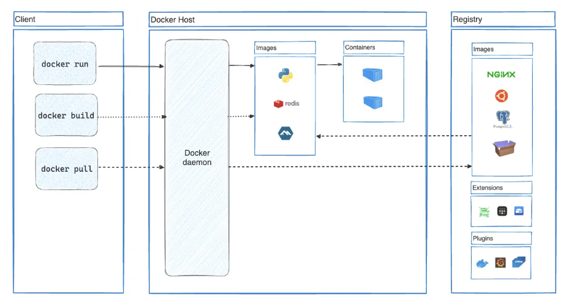

# Nền tảng Docker

## 1. Docker là gì?

Docker là một nền tảng giúp đóng gói, phân phối và chạy ứng dụng trong các môi trường tách biệt gọi là **container**.

Nói ngắn gọn:

- Docker giúp giải quyết lỗi kinh điển: "máy tôi chạy được, sao lên máy khác lại lỗi?"
- Docker đóng gói ứng dụng cùng runtime, thư viện, biến môi trường và cấu hình cần thiết.
- Gói đóng đó được gọi là **image**.
- Khi image được chạy lên, nó trở thành **container**.

Có thể hình dung:

```text
Source code + runtime + dependencies + config
        |
        v
      Image
        |
        v
 Container đang chạy
```

Docker không chỉ là công cụ "chạy app trong hộp". Nó là một cách chuẩn hóa việc phát triển, kiểm thử, triển khai và vận hành ứng dụng.

## 2. Docker giải quyết vấn đề gì?

Khi không dùng Docker, môi trường chạy ứng dụng thường phụ thuộc rất nhiều vào từng máy:

- Máy A cài Java 17, máy B cài Java 21.
- Máy A có PostgreSQL đúng version, máy B không có.
- Máy test có biến môi trường khác máy local.
- Thư viện hệ thống trên server khác máy developer.
- Deploy phải ghi nhớ nhiều bước thủ công.

Kết quả là code có thể đúng, nhưng môi trường chạy sai.

Docker đưa môi trường chạy vào một đơn vị có thể lặp lại:

- Developer chạy cùng một container.
- CI/CD chạy cùng một image.
- Production chạy image đã được test.
- Khi cần rollback, chỉ cần chạy lại image version cũ.

Điểm quan trọng nhất là: **Docker biến môi trường chạy thành một phần có thể quản lý của ứng dụng**.

## 3. Docker platform gồm những gì?


Docker không chỉ có một lệnh `docker`. Nó gồm nhiều thành phần làm việc cùng nhau:

- **Docker Engine**: phần lõi để build image, chạy container, quản lý network và volume.
- **Docker CLI**: công cụ dòng lệnh bạn dùng hằng ngày, ví dụ `docker run`, `docker build`, `docker ps`.
- **Docker daemon**: tiến trình nền xử lý các yêu cầu thật sự.
- **Docker image**: bản mẫu chỉ đọc để tạo container.
- **Docker container**: instance đang chạy hoặc đã được tạo từ image.
- **Docker registry**: nơi lưu trữ và chia sẻ image, ví dụ Docker Hub.
- **Docker Compose**: công cụ định nghĩa và chạy ứng dụng gồm nhiều container.
- **Docker Desktop**: ứng dụng cài trên Windows, macOS hoặc Linux để cung cấp Docker Engine, CLI, Compose và giao diện quản lý.

Luồng cơ bản cần nhớ:

```text
Viết Dockerfile -> build image -> run container -> push/pull image qua registry
```

## 4. Container là gì?

Container là một môi trường chạy tách biệt, nhưng nhẹ hơn máy ảo.

Một container thường có:

- File system riêng.
- Process riêng.
- Network interface riêng.
- Biến môi trường riêng.
- Giới hạn tài nguyên riêng nếu được cấu hình.

Nhưng container không mang theo cả một hệ điều hành đầy đủ như máy ảo. Nó dùng chung kernel với host.

Ví dụ: nếu host là Linux, các container Linux trên host đó cùng dùng Linux kernel của host, nhưng mỗi container nhìn thấy một không gian riêng của nó.

So sánh nhanh:

| Tiêu chí | Virtual machine | Container |
| --- | --- | --- |
| Mang theo OS riêng | Có | Không đầy đủ, dùng chung kernel host |
| Khởi động | Thường chậm hơn | Thường nhanh hơn |
| Dung lượng | Lớn hơn | Nhỏ hơn |
| Mức độ tách biệt | Rất mạnh | Mạnh, nhưng chia sẻ kernel |
| Phù hợp | Chạy nhiều OS khác nhau, cách ly rất cao | Đóng gói và triển khai ứng dụng nhanh |

Container không phải là "máy ảo nhỏ". Nó gần với **một process được cô lập** hơn là một chiếc máy tính đầy đủ.

## 5. Image là gì?

Image là bản mẫu chỉ đọc dùng để tạo container.

Nếu container là "ứng dụng đang chạy", thì image là "công thức để tạo ra ứng dụng đang chạy".

Ví dụ Dockerfile đơn giản:

```Dockerfile
FROM eclipse-temurin:21-jre
WORKDIR /app
COPY app.jar app.jar
CMD ["java", "-jar", "app.jar"]
```

Ý nghĩa:

- `FROM`: chọn image nền.
- `WORKDIR`: đặt thư mục làm việc trong image/container.
- `COPY`: copy file từ máy build vào image.
- `CMD`: lệnh mặc định khi container chạy.

Image gồm nhiều **layer**. Mỗi lệnh trong Dockerfile thường tạo ra một layer mới. Khi container chạy, Docker thêm một layer đọc-ghi ở trên cùng để container có thể ghi file tạm thời.

Nếu xóa container, các thay đổi trong layer đọc-ghi đó biến mất, trừ khi dữ liệu được lưu vào **volume** hoặc **bind mount**.

## 6. Image và container khác nhau thế nào?

Đây là điểm rất dễ nhầm:

```text
Image     = bản mẫu, chưa chạy, chỉ đọc
Container = instance được tạo từ image
```

Một image có thể tạo ra nhiều container:

```text
nginx image
   |-- container nginx-1
   |-- container nginx-2
   |-- container nginx-3
```

Có thể so sánh tạm:

- Image giống class.
- Container giống object được tạo từ class.

So sánh này chỉ để dễ hiểu, không nên hiểu quá máy móc.

## 7. Kiến trúc Docker

Docker dùng kiến trúc client-server.

```text
Người dùng
   |
   v
Docker CLI / Docker client
   |
   | Docker API
   v
Docker daemon
   |
   | quản lý
   v
Images, containers, networks, volumes
   |
   | pull/push
   v
Registry
```

Khi bạn gõ:

```bash
docker run nginx
```

Docker CLI không trực tiếp tạo container. CLI gửi request đến Docker daemon. Docker daemon mới là thành phần thật sự lấy image, tạo container, tạo network, gắn filesystem và khởi động process.

Docker client và Docker daemon có thể nằm trên cùng một máy, hoặc client có thể kết nối đến daemon từ xa.

## 8. Docker daemon là gì?

Docker daemon, thường là `dockerd`, là tiến trình nền quản lý các đối tượng Docker.

Nó phụ trách:

- Nhận lệnh từ Docker client qua Docker API.
- Build image.
- Pull image từ registry.
- Tạo và chạy container.
- Quản lý lifecycle của container: create, start, stop, restart, remove.
- Quản lý network.
- Quản lý volume.
- Giao tiếp với container runtime để khởi động container thật sự.

Khi Docker báo lỗi kiểu "Cannot connect to the Docker daemon", nghĩa là Docker CLI không kết nối được tới tiến trình daemon.

## 9. Docker client là gì?

Docker client là công cụ bạn tương tác hằng ngày, thường là lệnh `docker`.

Ví dụ:

```bash
docker ps
docker images
docker build -t my-app .
docker run -p 8080:8080 my-app
docker stop my-container
```

Mỗi lệnh này được client chuyển thành request đến Docker daemon.

Một Docker client cũng có thể kết nối đến nhiều Docker daemon khác nhau thông qua Docker context:

```bash
docker context ls
```

## 10. Docker Desktop là gì?

Docker Desktop là ứng dụng cài đặt Docker trên máy cá nhân.

Trên Linux, Docker Engine có thể chạy trực tiếp trên Linux kernel.

Trên Windows và macOS, vì container Linux cần Linux kernel, Docker Desktop thường dùng một lớp ảo hóa nhẹ để cung cấp môi trường Linux bên dưới. Trên Windows hiện đại, Docker Desktop thường tích hợp với WSL 2.

Docker Desktop thường gồm:

- Docker Engine.
- Docker CLI.
- Docker Compose.
- Docker daemon.
- Credential helper.
- Giao diện quản lý container, image, volume.
- Tích hợp Kubernetes nếu bật cấu hình này.

Khi học Docker trên Windows, cần nhớ: container Linux không chạy trực tiếp trên Windows kernel, mà chạy thông qua môi trường Linux do Docker Desktop quản lý.

## 11. Docker registry là gì?

Registry là nơi lưu trữ Docker image.

Docker Hub là public registry phổ biến nhất. Khi bạn chạy:

```bash
docker run nginx
```

Nếu máy bạn chưa có image `nginx`, Docker sẽ pull image đó từ registry mặc định.

Các thao tác cơ bản:

```bash
docker pull nginx
docker tag my-app username/my-app:1.0.0
docker push username/my-app:1.0.0
```

Một số khái niệm:

- **Repository**: nhóm image có cùng tên, ví dụ `nginx`.
- **Tag**: nhãn hoặc version của image, ví dụ `latest`, `1.27`, `alpine`.
- **Digest**: định danh nội dung bất biến của image, chính xác hơn tag.

Cần cẩn thận với tag `latest`: nó không chắc chắn có nghĩa là "mới nhất" theo cách bạn nghĩ. Nó chỉ là một tag. Trong production nên dùng tag rõ ràng, ví dụ `postgres:16.3` thay vì chỉ `postgres`.

## 12. Docker objects

Khi dùng Docker, bạn làm việc với nhiều loại đối tượng:

- **Image**: bản mẫu tạo container.
- **Container**: instance tạo từ image.
- **Network**: kênh giao tiếp giữa container với nhau và với bên ngoài.
- **Volume**: nơi lưu dữ liệu bên ngoài lifecycle của container.
- **Build cache**: cache layer khi build image.
- **Plugin**: mở rộng khả năng Docker.
- **Context**: cấu hình endpoint Docker đang thao tác.

Xem dung lượng Docker đang dùng:

```bash
docker system df
```

Dọn tài nguyên không dùng:

```bash
docker system prune
```

Lệnh prune có thể xóa container đã stop, network không dùng, build cache và image không được tham chiếu. Nên đọc kỹ prompt trước khi đồng ý.

## 13. Điều gì xảy ra khi chạy `docker run`?

Xét lệnh:

```bash
docker run -i -t ubuntu /bin/bash
```

Lệnh này chạy một container Ubuntu và mở shell Bash tương tác.

Từng phần:

- `docker run`: tạo và chạy container mới.
- `-i`: interactive, giữ stdin mở để bạn nhập lệnh.
- `-t`: cấp phát pseudo-TTY, giúp terminal hiển thị như shell bình thường.
- `ubuntu`: image được dùng.
- `/bin/bash`: command chạy trong container.

Khi lệnh này được gõ, Docker làm nhiều việc:

1. Docker client gửi request đến Docker daemon.
2. Docker daemon kiểm tra image `ubuntu` có sẵn local không.
3. Nếu chưa có, daemon pull image từ registry.
4. Docker tạo container mới từ image.
5. Docker tạo layer đọc-ghi riêng cho container.
6. Docker tạo network interface cho container.
7. Docker gắn container vào network mặc định nếu bạn không chỉ định network khác.
8. Docker khởi động process `/bin/bash` trong container.
9. Vì có `-i -t`, terminal của bạn gắn với process trong container.
10. Khi bạn gõ `exit`, Bash kết thúc, process chính của container kết thúc, container dừng lại.

Điều cực kỳ quan trọng: **container sống theo process chính của nó**.

Nếu process chính kết thúc, container stop.

Ví dụ:

```bash
docker run ubuntu echo hello
```

Container sẽ in `hello`, rồi dừng ngay. Đây không phải lỗi. Chỉ đơn giản là command chính đã chạy xong.

## 14. Lifecycle của container

Một container có thể trải qua các trạng thái:

```text
created -> running -> paused
               |
               v
            stopped -> removed
```

Lệnh hay dùng:

```bash
docker create nginx
docker start <container>
docker stop <container>
docker restart <container>
docker rm <container>
```

`docker run` thực chất là tổ hợp của:

```text
docker pull nếu cần
docker create
docker start
docker attach nếu chạy tương tác
```

Xem container đang chạy:

```bash
docker ps
```

Xem cả container đã stop:

```bash
docker ps -a
```

Chạy container tạm thời và tự xóa khi dừng:

```bash
docker run --rm alpine echo hello
```

## 15. Port mapping

Container có network riêng. Nếu ứng dụng trong container lắng nghe port 80, không có nghĩa là máy host tự động truy cập được port đó.

Cần publish port:

```bash
docker run -p 8080:80 nginx
```

Ý nghĩa:

```text
host port 8080 -> container port 80
```

Sau đó truy cập:

```text
http://localhost:8080
```

Quy tắc nhớ:

```text
-p <port_trên_host>:<port_trong_container>
```

Bên trái là port trên máy host. Bên phải là port trong container.

## 16. Docker network

Docker network giúp container giao tiếp với nhau.

Các loại network phổ biến:

- **bridge**: mặc định cho container trên một host.
- **host**: container dùng network stack của host.
- **none**: container không có network.
- **overlay**: kết nối container trên nhiều Docker host, thường dùng trong orchestration.

Khi dùng bridge network riêng, container có thể gọi nhau bằng tên container hoặc tên service trong Compose.

Ví dụ:

```bash
docker network create app-net
docker run -d --name db --network app-net postgres
docker run -d --name api --network app-net my-api
```

Container `api` có thể kết nối đến host `db` trong cùng network.

Cần nhớ:

- `localhost` bên trong container là chính container đó.
- Nếu app trong container gọi `localhost:5432`, nó đang tìm database trong cùng container.
- Nếu database ở container khác, phải gọi qua tên service/container trong cùng network.

## 17. Volume và dữ liệu bền vững

Filesystem mặc định của container là tạm thời theo container. Khi xóa container, dữ liệu trong layer đọc-ghi của container mất.

Volume dùng để lưu dữ liệu bên ngoài lifecycle của container.

Ví dụ:

```bash
docker volume create pgdata
docker run -d \
  --name postgres \
  -e POSTGRES_PASSWORD=secret \
  -v pgdata:/var/lib/postgresql/data \
  postgres
```

Ý nghĩa:

```text
volume pgdata -> /var/lib/postgresql/data trong container
```

Nếu container PostgreSQL bị xóa và tạo lại, volume vẫn còn, dữ liệu vẫn còn.

Ba kiểu mount hay gặp:

| Kiểu | Ví dụ | Khi dùng |
| --- | --- | --- |
| Volume | `pgdata:/var/lib/postgresql/data` | Dữ liệu quan trọng, để Docker quản lý |
| Bind mount | `./src:/app/src` | Dev local, map thư mục host vào container |
| tmpfs | lưu trên memory | Dữ liệu tạm thời, không cần ghi disk |

Volume thường phù hợp cho database. Bind mount thường phù hợp khi lập trình local cần code thay đổi liên tục.

## 18. Dockerfile

Dockerfile là file mô tả cách build image.

Ví dụ:

```Dockerfile
FROM node:22-alpine
WORKDIR /app
COPY package*.json ./
RUN npm ci
COPY . .
EXPOSE 3000
CMD ["npm", "start"]
```

Ý nghĩa các instruction phổ biến:

- `FROM`: image nền.
- `WORKDIR`: thư mục làm việc.
- `COPY`: copy file vào image.
- `RUN`: chạy lệnh trong lúc build image.
- `ENV`: đặt biến môi trường.
- `ARG`: biến chỉ dùng lúc build.
- `EXPOSE`: khai báo port mà app dự kiến lắng nghe.
- `CMD`: lệnh mặc định khi container chạy.
- `ENTRYPOINT`: lệnh nền bắt buộc, thường dùng cho executable image.

Phân biệt `RUN` và `CMD`:

```text
RUN = chạy khi build image
CMD = chạy khi container start
```

Ví dụ:

```Dockerfile
RUN npm ci
CMD ["npm", "start"]
```

`npm ci` chạy một lần khi build image. `npm start` chạy mỗi lần container được start.

## 19. Layer và cache khi build image

Docker build image theo layer. Nếu một layer không đổi, Docker có thể dùng cache.

Cách tốt:

```Dockerfile
COPY package*.json ./
RUN npm ci
COPY . .
```

Thường tốt hơn cách này:

```Dockerfile
COPY . .
RUN npm ci
```

Lý do:

- Dependencies chỉ cần cài lại khi `package.json` hoặc lock file thay đổi.
- Code thay đổi sẽ không làm mất cache của bước cài dependencies.

Tư duy chung:

- Đặt các bước ít thay đổi lên trước.
- Đặt code thay đổi thường xuyên xuống sau.
- Dùng `.dockerignore` để tránh copy file không cần thiết vào build context.

## 20. `.dockerignore`

`.dockerignore` giống `.gitignore`, nhưng áp dụng cho Docker build context.

Ví dụ:

```text
.git
node_modules
target
build
.idea
*.log
```

Khi build image, Docker gửi build context đến Docker daemon. Nếu context quá lớn, build chậm và có thể vô tình đưa file nhạy cảm vào image.

`.dockerignore` giúp:

- Build nhanh hơn.
- Image gọn hơn.
- Giảm nguy cơ copy secret vào image.

## 21. Docker Compose

Docker Compose dùng để định nghĩa ứng dụng gồm nhiều container trong một file YAML.

Ví dụ một ứng dụng có API và database:

```yaml
services:
  api:
    build: .
    ports:
      - "8080:8080"
    environment:
      DB_HOST: db
    depends_on:
      - db

  db:
    image: postgres:16
    environment:
      POSTGRES_DB: app
      POSTGRES_USER: app
      POSTGRES_PASSWORD: secret
    volumes:
      - db_data:/var/lib/postgresql/data

volumes:
  db_data:
```

Chạy:

```bash
docker compose up
```

Chạy nền:

```bash
docker compose up -d
```

Dừng:

```bash
docker compose down
```

Xem log:

```bash
docker compose logs -f
```

Compose sẽ tạo network mặc định cho các service. Các service có thể gọi nhau bằng tên service. Trong ví dụ trên, service `api` kết nối database qua hostname `db`.

Lưu ý: `depends_on` chỉ đảm bảo container phụ thuộc được start trước, không đảm bảo database đã sẵn sàng nhận kết nối. Nếu cần chắc chắn, dùng healthcheck hoặc cơ chế retry trong app.

## 22. Docker và CI/CD

Docker rất hợp với CI/CD vì image có thể trở thành artifact triển khai.

Flow phổ biến:

```text
Developer push code
        |
        v
CI checkout code
        |
        v
Run test
        |
        v
Build Docker image
        |
        v
Push image lên registry
        |
        v
Deploy image đó lên server/staging/production
```

Lợi ích:

- Cùng một image được test và deploy.
- Rollback bằng cách chạy lại image tag cũ.
- Môi trường local, staging, production gần nhau hơn.
- Giảm bước cài đặt thủ công trên server.

Nhưng Docker không thay thế toàn bộ quy trình vận hành. Bạn vẫn cần logging, monitoring, secret management, backup, migration, security scan và chính sách deploy.

## 23. Docker dùng công nghệ gì bên dưới?

Docker dựa vào nhiều tính năng của Linux kernel. Hai khái niệm nên nắm là **namespaces** và **cgroups**.

### Namespaces

Namespaces tạo ra các "không gian nhìn thấy riêng" cho process.

Một container có thể có:

- **PID namespace**: container có cây process riêng.
- **Network namespace**: container có network interface, route table và port riêng.
- **Mount namespace**: container có góc nhìn filesystem riêng.
- **UTS namespace**: container có hostname/domain name riêng.
- **IPC namespace**: tách các cơ chế giao tiếp giữa process.
- **User namespace**: map user trong container với user khác trên host.

Ví dụ: trong container, process có thể thấy mình là PID 1, nhưng trên host nó vẫn là một process với PID khác.

### Cgroups

Cgroups dùng để giới hạn và đo lường tài nguyên.

Docker có thể dùng cgroups để giới hạn:

- CPU.
- Memory.
- IO.
- Số process.

Ví dụ:

```bash
docker run --memory=512m --cpus=1 nginx
```

Lệnh này giới hạn container dùng tối đa 512 MB memory và khoảng 1 CPU.

Tóm lại:

```text
Namespaces trả lời: container nhìn thấy gì?
Cgroups trả lời: container được dùng bao nhiêu tài nguyên?
```

## 24. Container runtime

Docker daemon không tự mình làm mọi thứ ở mức thấp nhất. Docker dùng container runtime để tạo và chạy container theo chuẩn.

Trong hệ sinh thái hiện đại, bạn có thể gặp:

- **containerd**: runtime cấp cao quản lý lifecycle container.
- **runc**: runtime cấp thấp tạo container theo OCI spec.
- **OCI**: bộ chuẩn mở cho image và runtime container.

Góc nhìn đơn giản:

```text
docker CLI
   |
docker daemon
   |
containerd
   |
runc
   |
Linux kernel features
```

Người mới học không cần đào quá sâu ngay, nhưng nên biết Docker không phải "ma thuật". Nó là lớp công cụ thân thiện nằm trên các cơ chế thật của hệ điều hành.

## 25. Docker khác Kubernetes thế nào?

Docker và Kubernetes hay bị đặt chung, nhưng chúng giải quyết hai bài toán khác nhau.

Docker:

- Build image.
- Chạy container.
- Quản lý container trên một máy hoặc môi trường dev.
- Rất tốt cho local development và đóng gói ứng dụng.

Kubernetes:

- Điều phối nhiều container trên nhiều máy.
- Tự restart container lỗi.
- Scale replicas.
- Service discovery.
- Rolling update.
- Quản lý deployment lớn hơn.

Có thể hiểu:

```text
Docker giúp tạo và chạy container.
Kubernetes giúp điều phối container ở quy mô cluster.
```

Ngay cả khi production dùng Kubernetes, bạn vẫn cần hiểu Docker image, container, registry, port, env và volume.

## 26. Các lệnh Docker nên thuộc

Xem version:

```bash
docker version
docker info
```

Image:

```bash
docker images
docker pull nginx
docker build -t my-app .
docker rmi my-app
```

Container:

```bash
docker ps
docker ps -a
docker run nginx
docker run -d --name web -p 8080:80 nginx
docker stop web
docker start web
docker restart web
docker rm web
```

Logs và debug:

```bash
docker logs web
docker logs -f web
docker exec -it web sh
docker inspect web
```

Network:

```bash
docker network ls
docker network create app-net
docker network inspect app-net
```

Volume:

```bash
docker volume ls
docker volume create data
docker volume inspect data
```

Compose:

```bash
docker compose up
docker compose up -d
docker compose down
docker compose logs -f
docker compose ps
```

## 27. Những hiểu lầm phổ biến

### "Container là máy ảo"

Không chính xác. Container cô lập process và filesystem bằng tính năng của kernel, nhưng không mang theo full OS riêng như VM.

### "Image và container là một"

Không. Image là bản mẫu chỉ đọc. Container là instance tạo từ image.

### "`latest` là bản mới nhất"

Không nên hiểu như vậy. `latest` chỉ là một tag. Người build image có thể gắn tag `latest` cho bất kỳ bản nào.

### "Xóa container là mất hết mọi thứ"

Đúng nếu dữ liệu chỉ nằm trong writable layer của container. Sai nếu dữ liệu nằm trong volume riêng.

### "`EXPOSE` là publish port"

Không. `EXPOSE` trong Dockerfile chỉ là metadata. Muốn truy cập từ host cần `-p`.

### "`localhost` trong container là máy host"

Không. `localhost` trong container là chính container đó.

### "Docker làm app bảo mật tự động"

Không. Docker tạo lớp tách biệt, nhưng bạn vẫn cần quan tâm user permission, secret, image scan, update base image, network policy và cấu hình runtime.

## 28. Best practices nên học sớm

- Dùng image chính thức hoặc image từ nguồn đáng tin.
- Pin version rõ ràng thay vì phụ thuộc vào `latest`.
- Dùng `.dockerignore`.
- Không copy secret vào image.
- Không hard-code password trong Dockerfile.
- Chạy container bằng non-root user nếu có thể.
- Tách bước cài dependency để tận dụng cache.
- Dùng multi-stage build để image nhỏ hơn.
- Lưu dữ liệu quan trọng trong volume.
- Log ra stdout/stderr để Docker và hệ thống log thu thập được.
- Mỗi container nên phục vụ một concern chính.
- Dùng healthcheck cho service quan trọng.
- Scan image để phát hiện lỗ hổng dependency/base image.

## 29. Multi-stage build

Multi-stage build giúp tách môi trường build và môi trường runtime.

Ví dụ Java:

```Dockerfile
FROM maven:3.9-eclipse-temurin-21 AS build
WORKDIR /app
COPY pom.xml .
COPY src ./src
RUN mvn clean package -DskipTests

FROM eclipse-temurin:21-jre
WORKDIR /app
COPY --from=build /app/target/app.jar app.jar
CMD ["java", "-jar", "app.jar"]
```

Lợi ích:

- Image runtime không cần chứa Maven.
- Image nhỏ hơn.
- Giảm bề mặt tấn công.
- Tách rõ build dependencies và runtime dependencies.

## 30. Biến môi trường và secret

Container thường được cấu hình bằng environment variables:

```bash
docker run -e APP_ENV=production my-app
```

Trong Compose:

```yaml
services:
  api:
    image: my-api
    environment:
      APP_ENV: production
```

Nhưng không nên xem environment variable là nơi an toàn tuyệt đối cho secret. Nhiều hệ thống có thể log, inspect hoặc expose biến môi trường nếu cấu hình kém.

Với production, nên dùng secret manager của nền tảng deploy:

- Docker secrets nếu dùng Swarm.
- Kubernetes Secrets kết hợp encryption và RBAC nếu dùng Kubernetes.
- Cloud secret manager nếu dùng AWS/GCP/Azure.
- Vault hoặc các hệ thống quản lý secret chuyên dụng.

## 31. Healthcheck

Healthcheck giúp Docker biết container có còn "khỏe" không, không chỉ là process còn chạy hay không.

Ví dụ:

```Dockerfile
HEALTHCHECK --interval=30s --timeout=3s --retries=3 \
  CMD curl -f http://localhost:8080/actuator/health || exit 1
```

Xem trạng thái:

```bash
docker ps
docker inspect <container>
```

Healthcheck hữu ích trong Compose, CI và orchestration.

## 32. Nên học Docker theo thứ tự nào?

Thứ tự nên học:

1. Hiểu image và container.
2. Chạy các lệnh cơ bản: `run`, `ps`, `logs`, `exec`, `stop`, `rm`.
3. Hiểu port mapping.
4. Hiểu volume và vì sao database cần volume.
5. Viết Dockerfile đơn giản.
6. Hiểu build cache và `.dockerignore`.
7. Dùng Docker Compose cho app + database.
8. Hiểu network giữa các service.
9. Học multi-stage build.
10. Học security cơ bản: non-root, secret, image scan.
11. Học CI/CD với Docker image.
12. Sau đó mới đi sang Kubernetes nếu cần.

## 33. Bài tập thực hành

### Bài 1: Chạy container đầu tiên

```bash
docker run hello-world
```

Mục tiêu: thấy Docker pull image và chạy container.

### Bài 2: Chạy web server

```bash
docker run -d --name web -p 8080:80 nginx
docker ps
docker logs web
```

Mở:

```text
http://localhost:8080
```

Dừng và xóa:

```bash
docker stop web
docker rm web
```

### Bài 3: Vào shell container

```bash
docker run -it --rm ubuntu bash
```

Trong container:

```bash
ls
cat /etc/os-release
exit
```

### Bài 4: Hiểu volume

```bash
docker volume create demo-data
docker run --rm -v demo-data:/data alpine sh -c "echo hello > /data/file.txt"
docker run --rm -v demo-data:/data alpine cat /data/file.txt
```

Nếu dòng cuối in ra `hello`, nghĩa là dữ liệu tồn tại ngoài container.

### Bài 5: Hiểu network

```bash
docker network create demo-net
docker run -d --name web --network demo-net nginx
docker run --rm --network demo-net curlimages/curl http://web
```

Container thứ hai gọi container `web` bằng tên trong cùng network.

## 34. Tóm tắt

```text
Dockerfile
   |
   | docker build
   v
Image
   |
   | docker run
   v
Container
   |
   | read/write temporary layer
   | network
   | volume
   v
Running application

Registry <--- docker pull / docker push ---> Local machine
```

Cần nhớ 5 câu:

- Docker đóng gói ứng dụng và môi trường chạy thành image.
- Container là instance chạy từ image.
- Docker daemon làm việc thật sự, Docker CLI chỉ gửi lệnh.
- Registry là nơi lưu và chia sẻ image.
- Volume giúp dữ liệu sống lâu hơn container.

Nếu nắm chắc 5 câu này, phần còn lại của Docker sẽ dễ học hơn rất nhiều.
