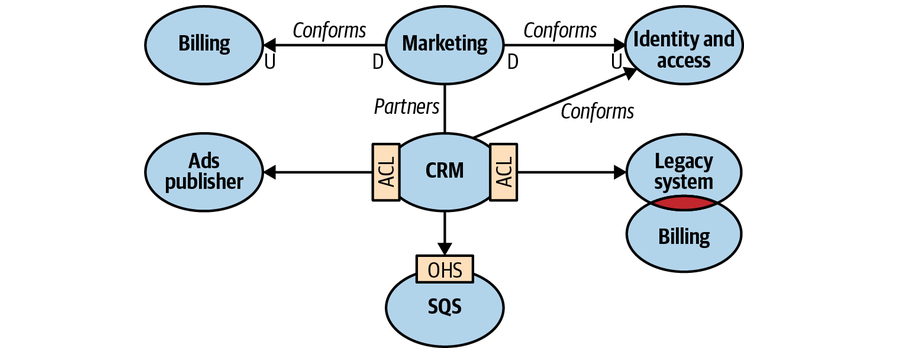
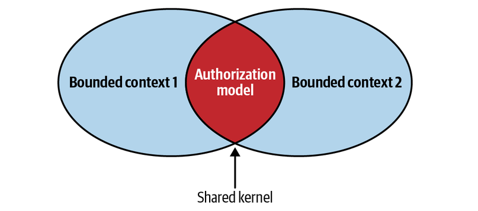
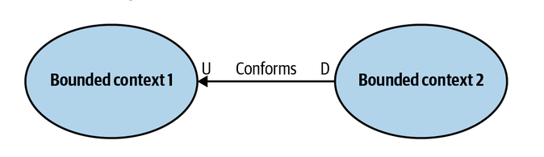
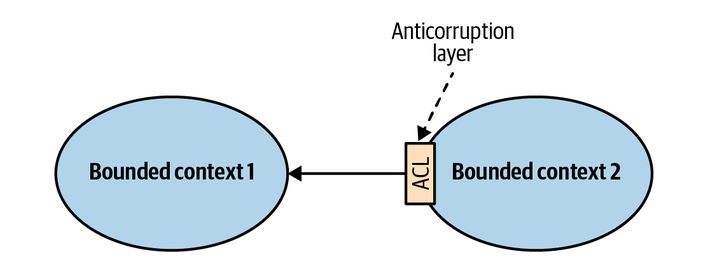
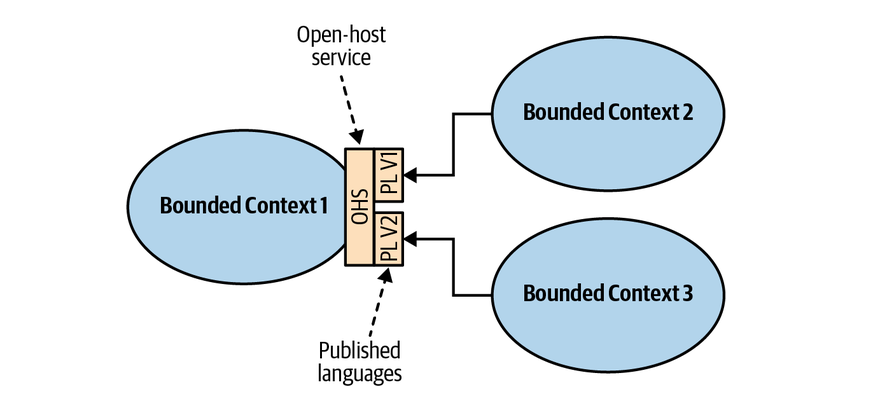
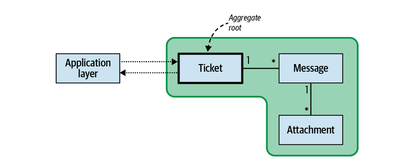
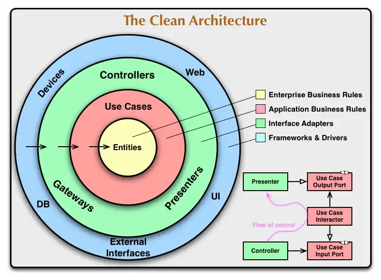

# Clean Architecture và Domain-Driven Design cho người mới

> Tài liệu này được biên tập từ ghi chú gốc **“Clean architecture & DDD”**. Nội dung đã được sắp xếp lại, sửa các chỗ dễ hiểu sai, chuyển ảnh chỉ chứa chữ thành văn bản và bổ sung ví dụ gần gũi.

## Mục lục

1. [Vì sao hệ thống lớn khó?](#1-vì-sao-hệ-thống-lớn-khó)
2. [DDD là gì và không phải là gì?](#2-ddd-là-gì-và-không-phải-là-gì)
3. [Strategic Design: chia đúng bài toán trước khi viết code](#3-strategic-design-chia-đúng-bài-toán-trước-khi-viết-code)
4. [Context Map: các Bounded Context hợp tác thế nào?](#4-context-map-các-bounded-context-hợp-tác-thế-nào)
5. [Tactical Design: đưa nghiệp vụ vào code](#5-tactical-design-đưa-nghiệp-vụ-vào-code)
6. [Layered Architecture và Clean Architecture](#6-layered-architecture-và-clean-architecture)
7. [Kết hợp DDD với Clean Architecture](#7-kết-hợp-ddd-với-clean-architecture)
8. [Khi nào nên dùng và bắt đầu từ đâu?](#8-khi-nào-nên-dùng-và-bắt-đầu-từ-đâu)

---

## 1. Vì sao hệ thống lớn khó?

Khi nghe đến “hệ thống enterprise”, nhiều người nghĩ ngay đến hàng triệu request, cache, queue, Kubernetes hay database khổng lồ. Hiệu năng đúng là quan trọng, nhưng thường không phải nỗi đau duy nhất, thậm chí chưa chắc là nỗi đau lớn nhất.

Hệ thống hoạt động lâu năm vừa phải duy trì chức năng hiện tại, vừa liên tục bổ sung và sửa đổi nghiệp vụ. Nếu các thành phần phụ thuộc tùy tiện vào nhau, một thay đổi nhỏ có thể gây lỗi ở nhiều khu vực không liên quan.

Phần mềm lớn thường phải đồng thời đáp ứng:

- **Đúng:** không làm sai nghiệp vụ và không làm lệch dữ liệu.
- **Ổn định:** gặp lỗi có thể phục hồi; chạy lại không tạo đơn trùng hoặc trừ tiền hai lần.
- **Dễ thay đổi:** thêm chính sách giá, kênh thanh toán hoặc quy định mới mà không phải sửa khắp hệ thống.
- **Dễ tích hợp:** giao tiếp được với hệ thống nội bộ, đối tác và phần mềm cũ.
- **Đủ nhanh:** đáp ứng mức tải thực tế với chi phí hợp lý.
- **Quan sát được:** khi lỗi xảy ra, có thể biết lỗi ở đâu và dữ liệu đã đi qua những bước nào.

### 1.1 Nghiệp vụ luôn thay đổi

Hôm nay cửa hàng giảm giá theo số lượng. Ngày mai có thêm hạng thành viên. Tuần sau bộ phận pháp chế yêu cầu xuất hóa đơn theo quy tắc mới. Nếu logic giảm giá nằm rải rác trong controller, service, SQL và frontend, mỗi lần đổi luật là một cuộc tìm kiếm đầy rủi ro.

Mục tiêu tốt hơn là:

- quy tắc nghiệp vụ có một nơi chịu trách nhiệm rõ ràng;
- thay đổi ở phần thanh toán không vô tình phá phần quản lý kho;
- có thể kiểm thử quy tắc mà không cần khởi động database hoặc web server;
- chi tiết kỹ thuật như PostgreSQL, MySQL, VNPAY hay MoMo có thể thay đổi mà phần nghiệp vụ ít bị ảnh hưởng.

### 1.2 “Nhanh” không đồng nghĩa với “tốt”

Một API tạo đơn trong 20 ms nhưng chỉ ghi vào Redis rồi mất dữ liệu khi Redis gặp sự cố không phải là một hệ thống tốt. Trong nghiệp vụ quan trọng, các đặc tính như độ bền dữ liệu, idempotency, khả năng retry và tính nhất quán thường quan trọng hơn việc giảm thêm vài mili giây.

Tuy vậy, cũng không nên hiểu thành “enterprise thì chậm cũng được”. Yêu cầu đúng phải là: **đạt mục tiêu hiệu năng đã đo được, trong khi vẫn bảo đảm độ tin cậy và tính đúng đắn**.

### 1.3 DDD không phải thuốc chữa hiệu năng

DDD chủ yếu giúp quản lý độ phức tạp của nghiệp vụ và giao tiếp giữa con người. Nó có thể tạo ra ranh giới tốt để từng phần được tối ưu riêng, nhưng không tự làm hệ thống nhanh hơn. Hiệu năng còn phụ thuộc vào thuật toán, mô hình dữ liệu, index, cache, I/O, concurrency, kiến trúc triển khai và cách đo tải.

---

## 2. DDD là gì và không phải là gì?

**Domain-Driven Design (DDD)** là cách phát triển phần mềm đặt hiểu biết nghiệp vụ và mô hình nghiệp vụ vào trung tâm của thiết kế.

Thứ chạy trên production không phải tri thức trong đầu chuyên gia nghiệp vụ, mà là **cách lập trình viên đã hiểu và chuyển tri thức ấy thành code**. Nếu hiểu sai khái niệm “đơn đã xác nhận”, phần mềm có thể chạy không lỗi kỹ thuật nhưng vẫn làm sai việc kinh doanh.

DDD cố thu hẹp khoảng cách đó bằng cách để chuyên gia nghiệp vụ, BA, PO và kỹ sư cùng xây dựng một mô hình chung, dùng một ngôn ngữ chung và liên tục sửa mô hình khi hiểu biết tăng lên.

DDD thường được nhìn qua hai nhóm công cụ:

- **Strategic Design:** tìm ranh giới lớn, xác định phần nào quan trọng và các phần liên hệ ra sao.
- **Tactical Design:** biểu diễn quy tắc bên trong một ranh giới bằng Entity, Value Object, Aggregate, Domain Service, Domain Event...

DDD không đồng nghĩa với:

- microservice;
- Clean Architecture;
- dùng thật nhiều design pattern;
- tạo Entity cho mọi bảng;
- biến mọi CRUD thành mô hình nghiệp vụ phức tạp.

Một ứng dụng monolith vẫn có thể áp dụng DDD rất tốt. Ngược lại, một hệ thống có 100 microservice vẫn có thể phụ thuộc chéo và khó bảo trì nếu ranh giới nghiệp vụ chia sai.

### Nếu áp dụng DDD đúng hoặc sai thì sao?

**Làm đúng:** nhóm phát triển hiểu rõ luật nghiệp vụ, đặt tên thống nhất và biết chính xác phần nào chịu trách nhiệm cho mỗi thay đổi. Khi có yêu cầu mới, phạm vi sửa code thường nhỏ hơn, test tập trung hơn và trao đổi với BA/PO ít mơ hồ hơn.

**Làm sai:** nhóm chỉ thêm các class tên `Entity`, `Aggregate`, `Repository` nhưng không làm rõ nghiệp vụ. Kết quả là số lượng file và abstraction tăng, trong khi logic vẫn nằm rải rác. Thời gian phát triển chậm hơn nhưng chất lượng không tăng.

**Ví dụ thực tế:** hệ thống bán hàng có luật “đơn đã bàn giao cho đơn vị vận chuyển thì không được hủy”. Nếu luật nằm trong `Order.cancel()`, mọi luồng web, mobile và chăm sóc khách hàng đều dùng chung một quy tắc. Nếu mỗi controller tự kiểm tra trạng thái, một API mới có thể quên kiểm tra và cho phép hủy sai.

---

## 3. Strategic Design: chia đúng bài toán trước khi viết code

Strategic Design xác định cấu trúc nghiệp vụ tổng thể trước khi thiết kế chi tiết trong code. Nó trả lời các câu hỏi:

- Doanh nghiệp đang giải quyết vấn đề gì?
- Phần nào tạo lợi thế cạnh tranh?
- Một từ có ý nghĩa khác nhau ở những khu vực nào?
- Ranh giới trách nhiệm nằm ở đâu?
- Những nhóm nào cần phối hợp và phối hợp theo cách nào?

### 3.1 Domain và Subdomain

**Domain** là lĩnh vực nghiệp vụ mà phần mềm phục vụ: thương mại điện tử, ngân hàng, logistics, y tế...

**Subdomain** là một phần của bài toán nghiệp vụ. Ví dụ domain thương mại điện tử có thể gồm:

- bán hàng;
- định giá và khuyến mãi;
- tồn kho;
- vận chuyển;
- thanh toán;
- chăm sóc khách hàng.

Subdomain thuộc về **problem space**: nó mô tả doanh nghiệp cần giải quyết vấn đề gì, kể cả khi chưa có phần mềm.

#### Phân loại Subdomain

- **Core Subdomain:** tạo lợi thế cạnh tranh, đáng đầu tư người giỏi và cải tiến liên tục. Ví dụ thuật toán ghép tài xế của một nền tảng gọi xe.
- **Supporting Subdomain:** cần để core hoạt động nhưng không tạo khác biệt lớn, chẳng hạn công cụ quản lý nội dung nội bộ.
- **Generic Subdomain:** vấn đề phổ biến đã có giải pháp tốt, như gửi email, xác thực hoặc kế toán tiêu chuẩn.

Việc phân loại không cố định cho mọi công ty. Thanh toán có thể là core của ví điện tử nhưng chỉ là generic đối với một trang tin. Một phần từng là core cũng có thể trở nên phổ thông khi thị trường trưởng thành.

Doanh nghiệp nên tập trung nguồn lực vào phần tạo lợi thế cạnh tranh, thay vì tự xây mọi chức năng phổ biến đã có giải pháp phù hợp trên thị trường.

**Làm đúng:** core được giao cho nhóm có đủ năng lực và được đầu tư test, quan sát, cải tiến. Generic Subdomain được mua hoặc dùng giải pháp sẵn có khi hợp lý, giúp doanh nghiệp tập trung nguồn lực.

**Làm sai và hậu quả:** coi mọi phần đều là core khiến đội ngũ phải tự xây đăng nhập, gửi email, logging, thanh toán và nhiều công cụ phụ trợ. Nguồn lực bị phân tán, phần thật sự tạo doanh thu lại phát triển chậm. Ngược lại, thuê ngoài nhầm Core Subdomain có thể khiến doanh nghiệp mất khả năng tự cải tiến lợi thế chính.

**Ví dụ thực tế:** với một sàn thương mại điện tử, thuật toán xếp hạng sản phẩm có thể là core; gửi email xác nhận thường là generic. Tự xây một email server không giúp xếp hạng tốt hơn, nhưng tự chủ thuật toán xếp hạng có thể ảnh hưởng trực tiếp đến tỉ lệ chuyển đổi.

### 3.2 Ubiquitous Language — ngôn ngữ chung

**Ubiquitous Language** là ngôn ngữ được dùng nhất quán trong hội thoại, tài liệu, mô hình và code bên trong một Bounded Context.

Nếu nghiệp vụ gọi hành động là “xác nhận đơn”, code nên có tên gần với `confirmOrder()` thay vì `updateStatus(3)`. Tên tốt không chỉ làm code đẹp hơn; nó làm lộ ra sự khác nhau trong cách hiểu.

Ví dụ, nhóm bán hàng nói “khách hàng” là người đặt mua. Nhóm vận chuyển lại quan tâm “người nhận”. Hai người này có thể giống hoặc khác nhau. Ép cả hai vào một class `Customer` dùng toàn hệ thống dễ tạo ra một đối tượng khổng lồ với ý nghĩa mơ hồ.

Ngôn ngữ chung:

- không chỉ là đặt tên class và method;
- bao gồm quy tắc, trạng thái, sự kiện và các câu chuyện nghiệp vụ;
- chỉ cần nhất quán **trong ranh giới phù hợp**, không bắt toàn công ty dùng một mô hình duy nhất;
- phải được cập nhật khi nhóm hiểu nghiệp vụ rõ hơn.

**Làm đúng:** từ ngữ trong cuộc họp, tài liệu, test và code khớp nhau. Người mới đọc tên method có thể hiểu ý nghĩa nghiệp vụ mà không phải dịch qua một bảng mã kỹ thuật.

**Làm sai và hậu quả:** cùng một từ mang nhiều nghĩa nhưng vẫn dùng chung một model. Điều kiện nghiệp vụ chồng chéo, field ngày càng nhiều và mỗi team phải hỏi “`status = 3` ở đây nghĩa là gì?”. Bug thường xuất hiện ở chỗ chuyển giao giữa các nhóm.

**Ví dụ thực tế:** `cancelled` trong Ordering có thể nghĩa là khách không còn mua; trong Payment, giao dịch tương ứng có thể là `voided` nếu tiền chưa capture hoặc `refunded` nếu tiền đã capture. Dùng một trạng thái `CANCELLED` cho cả hai sẽ che mất hai quy trình tài chính hoàn toàn khác nhau.

### 3.3 Bounded Context — hàng rào của ý nghĩa

**Bounded Context (BC)** là ranh giới mà bên trong đó một mô hình và ngôn ngữ có ý nghĩa nhất quán.

Ví dụ từ `Product`:

- trong **Catalog Context**, nó có mô tả, ảnh và danh mục;
- trong **Pricing Context**, nó có giá niêm yết và chính sách giảm giá;
- trong **Inventory Context**, nó liên quan đến SKU, số lượng khả dụng và vị trí kho.

Đó không nhất thiết là một object dùng chung. Mỗi context giữ mô hình phù hợp với trách nhiệm của mình.

#### Subdomain khác Bounded Context thế nào?

- **Subdomain** nói về phần của bài toán kinh doanh — “chúng ta cần giải quyết việc gì?”.
- **Bounded Context** là ranh giới của một mô hình giải pháp — “mô hình này đúng trong phạm vi nào?”.

Trong hệ thống đơn giản, một Subdomain thường được triển khai bởi một BC. Trong thực tế, quan hệ có thể không 1:1: một BC cũ có thể ôm nhiều Subdomain; một Subdomain lớn có thể cần nhiều BC. Đây là công cụ phân tích, không phải công thức đếm service.

#### Những hiểu lầm thường gặp

- BC không phải một Entity hay một nhóm bảng.
- BC không mặc định là package, module hoặc microservice, dù chúng có thể là cách triển khai ranh giới đó.
- Không có khái niệm chuẩn “BC con” như một cây kỹ thuật bắt buộc. Ta có thể phân rã hoặc nhóm context để dễ quản lý, nhưng mỗi context vẫn cần ý nghĩa và ranh giới rõ.
- “Mỗi BC phải có database vật lý riêng” là quy tắc quá cứng. Điều quan trọng là **quyền sở hữu dữ liệu**: context khác không được tùy tiện sửa schema hoặc đọc xuyên qua mô hình nội bộ. Trong monolith, các context có thể dùng chung một database server nhưng tách schema/table và truy cập qua giao diện được kiểm soát.
- Một microservice có thể tương ứng với một BC, nhưng không nên tách service chỉ để đạt tỉ lệ 1:1 trên sơ đồ.

#### Ví dụ tách hệ thống booking

Một công ty có hệ thống đặt khách sạn và đặt vé máy bay. Gộp hai hệ thống thành “đặt combo” nghe hấp dẫn, nhưng nếu chi phí tích hợp cao hơn lợi ích và hai nhóm cần phát triển độc lập, lựa chọn đúng có thể là tạm thời đi riêng. Đây là quyết định kinh doanh và tổ chức, không chỉ là quyết định code.

#### Làm đúng hoặc sai Bounded Context

**Làm đúng:** mỗi context có ngôn ngữ, model, trách nhiệm và quyền sở hữu dữ liệu rõ. Một thay đổi nội bộ không bắt context khác sửa theo nếu hợp đồng tích hợp vẫn được giữ nguyên. Nhóm có thể release và kiểm thử với mức độc lập cao hơn.

**Làm sai theo hướng quá lớn:** một model `Customer`, `Order` hoặc `Product` được dùng cho toàn hệ thống. Mỗi class có hàng chục field phục vụ nhiều team; sửa cho team này có thể phá serialization, database hoặc logic của team khác.

**Làm sai theo hướng quá nhỏ:** mỗi thao tác được tách thành một service/context riêng. Một use case phải gọi qua 7–8 service, transaction phân tán, latency tăng và debug khó hơn. Đây là “distributed monolith”: triển khai phân tán nhưng vẫn phụ thuộc chặt.

**Ví dụ thực tế:** Ordering chỉ cần `ProductId`, tên hiển thị và giá đã chốt tại lúc mua; Catalog quản lý mô tả, ảnh và danh mục; Inventory quản lý SKU và số lượng. Nếu Ordering đọc trực tiếp bảng Catalog mỗi lần hiển thị đơn cũ, việc đổi tên sản phẩm có thể làm hóa đơn lịch sử thay đổi sai. Cách phù hợp hơn là Ordering lưu snapshot cần thiết tại thời điểm đặt hàng.

---

## 4. Context Map: các Bounded Context hợp tác thế nào?

**Context Map** mô tả các Bounded Context, hướng phụ thuộc, kiểu quan hệ và trách nhiệm tích hợp giữa chúng.



### 4.1 Partnership

Hai context và hai nhóm cùng thành công hoặc cùng thất bại với một mục tiêu. Họ phối hợp roadmap, thiết kế hợp đồng tích hợp và kiểm thử chung.

Ưu điểm là giảm rủi ro lệch pha. Đổi lại, hai nhóm phải dành nhiều thời gian đồng bộ và tốc độ của một bên có thể ảnh hưởng bên kia.

**Làm đúng:** Partnership chỉ được dùng khi hai bên thật sự có mục tiêu và lịch phát hành gắn với nhau. Hai nhóm thống nhất người quyết định, contract test và cách xử lý thay đổi.

**Làm sai và hậu quả:** gọi mọi quan hệ là Partnership khiến lịch họp tăng nhưng quyền quyết định vẫn mơ hồ. Một nhóm chờ nhóm kia, deadline trượt và không ai chịu trách nhiệm cuối cùng.

**Ví dụ thực tế:** nhóm Checkout và Promotion cùng ra mắt chiến dịch giảm giá theo khung giờ. Hai bên cần thống nhất API tính giá, tải dự kiến và kế hoạch rollback; release riêng lẻ có thể làm khách nhìn thấy giá khác với lúc thanh toán.

### 4.2 Shared Kernel

Hai context cùng chia sẻ một phần mô hình hoặc code rất nhỏ và cùng chịu trách nhiệm thay đổi nó.



Shared Kernel hữu ích khi sự trùng lặp thật sự gây hại hơn sự phụ thuộc. Nó phải nhỏ, có người sở hữu, có versioning và kiểm thử chéo. Nếu thư viện `common` chứa quá nhiều thành phần, phạm vi ảnh hưởng của mỗi thay đổi sẽ tăng và trách nhiệm sở hữu trở nên không rõ ràng.

**Làm đúng:** chỉ chia sẻ phần thật sự ổn định và có cùng ý nghĩa, chẳng hạn kiểu `Money` đã thống nhất giữa hai context hợp tác chặt. Mọi thay đổi có version và được cả hai bên kiểm thử.

**Làm sai và hậu quả:** đưa DTO, JPA entity, tiện ích và business rule của nhiều context vào một package `common`. Sau một thời gian, nâng version thư viện buộc hàng loạt service release cùng lúc; quyền tự chủ của từng service biến mất.

**Ví dụ thực tế:** nếu Billing và Accounting dùng chung JPA entity `Invoice`, Accounting có thể thêm field phục vụ sổ cái khiến Billing phải migrate database dù không cần. Chia sẻ contract nhỏ hoặc Published Language thường an toàn hơn chia sẻ persistence model.

### 4.3 Customer–Supplier và Conformist

Trong quan hệ **Customer–Supplier**, upstream cung cấp dữ liệu hoặc dịch vụ; downstream phụ thuộc vào nó. Hai nhóm vẫn có thể thương lượng, nhưng upstream thường có nhiều quyền quyết định hơn.

**Conformist** xảy ra khi downstream chấp nhận nguyên mô hình của upstream vì không có đủ ảnh hưởng, thời gian hoặc lợi ích để xây lớp chuyển đổi.



Cách này nhanh nhưng làm mô hình downstream bị ảnh hưởng mạnh. Khi upstream thay đổi, downstream có thể phải đổi theo.

**Làm đúng:** chọn Conformist khi upstream ổn định, mô hình đủ phù hợp và chi phí xây ACL lớn hơn lợi ích. Nhóm downstream chấp nhận rủi ro này một cách có chủ đích.

**Làm sai và hậu quả:** copy nguyên model của một hệ thống ngoài vào domain dù ý nghĩa khác nhau. Thuật ngữ lạ lan vào code, validation phụ thuộc bên ngoài và mỗi lần upstream đổi schema phải sửa nhiều tầng.

**Ví dụ thực tế:** ứng dụng nội bộ tích hợp API thuế chuẩn, ít có khả năng tác động đến nhà cung cấp. Nếu mô hình của API đã sát nghiệp vụ kế toán, Conformist có thể hợp lý. Nhưng dùng cùng cách với một legacy CRM có dữ liệu lộn xộn sẽ làm domain mới bị nhiễm các khái niệm cũ.

### 4.4 Anti-Corruption Layer (ACL)

ACL là lớp phiên dịch bảo vệ mô hình nội bộ khỏi mô hình bên ngoài. Downstream nhận dữ liệu của upstream, chuyển nó sang ngôn ngữ của mình rồi mới đưa vào nghiệp vụ.



Ví dụ hệ thống cũ gọi trạng thái thanh toán là `P`, `S`, `X`, còn hệ thống mới dùng `Pending`, `Paid`, `Cancelled`. Adapter của ACL chịu trách nhiệm dịch. Khi hệ thống cũ đổi mã, ta sửa nơi phiên dịch thay vì để mã lạ lan khắp domain.

ACL không chỉ là một class mapper; nó có thể gồm adapter, facade, translator và cơ chế chống lỗi. Đừng biến nó thành nơi chứa nghiệp vụ cốt lõi của downstream.

**Làm đúng:** mọi kiểu dữ liệu và mã trạng thái của upstream dừng tại ACL. Domain chỉ nhận object theo ngôn ngữ của mình. Khi thay đối tác hoặc đổi version API, phần lớn thay đổi nằm ở adapter.

**Làm sai và hậu quả:** response JSON của đối tác được truyền thẳng vào use case và lưu nguyên vào Entity. Domain phải xử lý null, mã lỗi và quy ước của đối tác ở nhiều nơi; việc đổi nhà cung cấp trở nên gần như viết lại nghiệp vụ.

**Ví dụ thực tế:** cổng thanh toán A trả `00` cho thành công, cổng B trả `SUCCESS`. ACL chuyển cả hai thành `PaymentResult.succeeded()`. Use case thanh toán không cần biết mã riêng của từng cổng.

### 4.5 Open Host Service và Published Language

**Open Host Service (OHS)** là API hoặc protocol ổn định do upstream chủ động cung cấp cho nhiều downstream. **Published Language** là ngôn ngữ trao đổi được công bố rõ, chẳng hạn schema JSON, OpenAPI hoặc event schema có version.



Một API tốt nên có hợp đồng rõ, chính sách version, khả năng tương thích và thời gian ngừng hỗ trợ được thông báo. “Có endpoint HTTP” chưa đủ để trở thành OHS tốt.

**Làm đúng:** producer công bố schema, compatibility rule, SLA và migration guide. Consumer có contract test và không phụ thuộc vào field nội bộ chưa được công bố.

**Làm sai và hậu quả:** upstream sửa tên field hoặc ý nghĩa event mà không version. Nhiều downstream lỗi đồng loạt, nhưng lỗi có thể chỉ lộ ra sau vài giờ khi dữ liệu đã lệch.

**Ví dụ thực tế:** event `CustomerUpdated` ban đầu dùng `fullName`, sau đó upstream tách thành `firstName` và `lastName`. Nếu xóa `fullName` ngay, consumer cũ sẽ hỏng. Một lộ trình an toàn là thêm field mới, duy trì field cũ trong thời gian chuyển đổi rồi mới ngừng hỗ trợ theo lịch công bố.

### 4.6 Separate Ways

Hai context đi riêng khi lợi ích tích hợp không bù được chi phí, hoặc chưa có nhu cầu thực sự. Đôi khi viết lại một chức năng nhỏ ở hai nơi rẻ hơn duy trì một tích hợp phức tạp trong nhiều năm.

Đây không phải thất bại kiến trúc. Nó là lời nhắc rằng coupling tổ chức và chi phí phối hợp cũng là chi phí thật.

**Làm đúng:** chấp nhận một lượng nhỏ dữ liệu hoặc logic lặp lại khi việc tích hợp không tạo đủ giá trị; đồng thời ghi rõ hai phần không được kỳ vọng đồng bộ tuyệt đối.

**Làm sai và hậu quả:** tách riêng hai nơi nhưng business lại yêu cầu số liệu tức thời giống hệt nhau. Khi đó nhân viên nhìn thấy hai kết quả khác nhau, đối soát thủ công và mất niềm tin vào hệ thống.

**Ví dụ thực tế:** hai công cụ nội bộ có thể giữ danh sách quốc gia riêng nếu hiếm thay đổi. Nhưng số dư tài khoản không thể được duy trì độc lập ở hai hệ thống mà không có cơ chế đồng bộ và nguồn dữ liệu chuẩn.

---

## 5. Tactical Design: đưa nghiệp vụ vào code

Tactical Design là cách tổ chức các quy tắc nghiệp vụ bên trong một Bounded Context. Phần này sử dụng một ví dụ xuyên suốt: **đặt và hủy đơn hàng**.

Quy tắc của ví dụ:

- đơn mới tạo ở trạng thái `DRAFT`;
- đơn phải có ít nhất một sản phẩm mới được xác nhận;
- số lượng mỗi sản phẩm phải lớn hơn 0;
- khi xác nhận, tổng tiền phải được tính từ các dòng hàng;
- đơn đã giao không được hủy.

Mục tiêu là bảo đảm mọi API, batch job và message consumer đều tuân theo cùng các quy tắc trên.

### 5.1 Trường hợp đơn giản có cần DDD không?

Không phải chức năng nào cũng cần Entity, Value Object hay Aggregate.

Với màn hình quản trị danh mục chỉ gồm thêm, sửa và ẩn danh mục, một service đơn giản là đủ:

```java
@Transactional
public void renameCategory(long id, String newName) {
    CategoryJpaEntity category = repository.findById(id).orElseThrow();
    category.setName(newName);
}
```

Cách viết một thao tác thành một chuỗi bước như trên thường được gọi là **Transaction Script**. Nó phù hợp khi nghiệp vụ ít quy tắc và mỗi thao tác ngắn.

Với đơn hàng, logic nhanh chóng phức tạp hơn:

```java
public void cancelOrder(long orderId) {
    OrderJpaEntity order = repository.findById(orderId).orElseThrow();

    if (order.getStatus() == SHIPPED) {
        throw new IllegalStateException("Đơn đã giao không thể hủy");
    }

    order.setStatus(CANCELLED);
}
```

Đoạn code chưa sai. Vấn đề xuất hiện khi hệ thống có thêm API cho khách hàng, màn hình cho nhân viên và batch job tự hủy đơn quá hạn. Nếu cả ba nơi đều tự viết điều kiện hủy, một nơi có thể kiểm tra `SHIPPED`, nơi khác lại quên kiểm tra.

Khi cùng một quy tắc được sử dụng ở nhiều luồng hoặc số quy tắc tăng lên, nên đưa quy tắc vào Domain Model.

### 5.2 Entity: đối tượng có danh tính và có hành vi

`Order` là một **Entity** vì mỗi đơn có `OrderId` riêng và tồn tại qua nhiều trạng thái. Đơn vẫn là cùng một đơn dù chuyển từ `DRAFT` sang `CONFIRMED`.

```java
public final class Order {
    private final OrderId id;
    private OrderStatus status;
    private final List<OrderLine> lines;

    public Order(OrderId id) {
        this.id = id;
        this.status = OrderStatus.DRAFT;
        this.lines = new ArrayList<>();
    }

    public void cancel() {
        if (status == OrderStatus.SHIPPED) {
            throw new IllegalStateException("Đơn đã giao không thể hủy");
        }
        status = OrderStatus.CANCELLED;
    }
}
```

Điểm quan trọng không phải là class có field `id`, mà là class tự kiểm soát các thay đổi liên quan đến vòng đời của nó.

#### Làm đúng

Các trạng thái chỉ được thay đổi qua method có ý nghĩa như `confirm()`, `cancel()` và `markShipped()`. Tất cả nơi gọi đều dùng chung quy tắc.

#### Làm sai và hậu quả

Nếu `Order` có `setStatus()` public, bất kỳ code nào cũng có thể chuyển thẳng từ `DRAFT` sang `SHIPPED` hoặc đổi đơn đã hủy thành `CONFIRMED`. Dữ liệu trong database có thể hợp lệ về kiểu dữ liệu nhưng sai nghiệp vụ.

#### Domain Entity khác JPA Entity

`@Entity` của JPA cho biết một class được ánh xạ vào database. Nó không bảo đảm class đó chứa nghiệp vụ. Domain Entity có thể là class Java thuần; adapter persistence chịu trách nhiệm chuyển đổi giữa Domain Entity và JPA Entity nếu cần.

### 5.3 Value Object: giá trị hợp lệ ngay từ lúc tạo

Một dòng hàng cần số lượng lớn hơn 0. Nếu dùng `int`, bất kỳ nơi nào cũng có thể truyền `0` hoặc `-5`. Ta có thể tạo Value Object `Quantity`:

```java
public record Quantity(int value) {
    public Quantity {
        if (value <= 0) {
            throw new IllegalArgumentException("Số lượng phải lớn hơn 0");
        }
    }
}
```

`Quantity` là **Value Object** vì không cần ID riêng. Hai `Quantity(2)` được xem là cùng một giá trị.

Tiền cũng nên được biểu diễn rõ ràng:

```java
public record Money(BigDecimal amount, Currency currency) {
    public Money {
        if (amount.signum() < 0) {
            throw new IllegalArgumentException("Số tiền không thể âm");
        }
    }

    public Money multiply(Quantity quantity) {
        return new Money(
            amount.multiply(BigDecimal.valueOf(quantity.value())),
            currency
        );
    }
}
```

Không nên dùng `double` cho tiền vì có sai số dấu phẩy động.

#### Làm đúng

Value Object kiểm tra dữ liệu ngay khi khởi tạo và thường không cho thay đổi giá trị sau đó. Khi một method nhận `Quantity`, method đó không cần kiểm tra lại `quantity > 0`.

#### Làm sai và hậu quả

Nếu mọi giá trị đều dùng `String`, `int` hoặc `double`, dữ liệu sai có thể đi qua nhiều lớp rồi mới gây lỗi. Method có nhiều tham số cùng kiểu còn dễ bị truyền nhầm vị trí.

Ví dụ `addProduct(long productId, int quantity)` không ngăn được số lượng âm. `addProduct(ProductId productId, Quantity quantity)` chặn lỗi ngay khi tạo `Quantity`.

### 5.4 Entity con: OrderLine

`OrderLine` đại diện cho một sản phẩm trong đơn:

```java
public final class OrderLine {
    private final ProductId productId;
    private final String productName;
    private final Money unitPrice;
    private Quantity quantity;

    public Money subtotal() {
        return unitPrice.multiply(quantity);
    }

    public void changeQuantity(Quantity newQuantity) {
        this.quantity = newQuantity;
    }
}
```

Tên và giá sản phẩm được lưu tại thời điểm đặt hàng. Nếu giá trong Catalog thay đổi vào ngày hôm sau, đơn cũ vẫn phải giữ đúng giá đã mua.

Không nên cho code bên ngoài lấy `OrderLine` rồi tự sửa field. Việc thay đổi phải đi qua `Order` để kiểm tra trạng thái của cả đơn.

### 5.5 Aggregate và Aggregate Root

Trong ví dụ này, `Order` và các `OrderLine` cần nhất quán cùng nhau:

- tổng tiền phải bằng tổng các dòng hàng;
- đơn đã xác nhận không được tùy ý thêm sản phẩm;
- đơn không có sản phẩm không được xác nhận.

Ta nhóm chúng thành một **Aggregate** và chọn `Order` làm **Aggregate Root**. Code bên ngoài chỉ thay đổi dữ liệu qua `Order`.

```java
public final class Order {
    // fields và constructor được lược bớt

    public void addProduct(
        ProductId productId,
        String productName,
        Money unitPrice,
        Quantity quantity
    ) {
        ensureDraft();
        lines.add(new OrderLine(productId, productName, unitPrice, quantity));
    }

    public void changeQuantity(ProductId productId, Quantity quantity) {
        ensureDraft();
        findLine(productId).changeQuantity(quantity);
    }

    public Money total() {
        return lines.stream()
            .map(OrderLine::subtotal)
            .reduce(Money.zero(Currency.VND), Money::add);
    }
}
```



Sơ đồ trên dùng domain hỗ trợ khách hàng: `Ticket` là Aggregate Root; `Message` và `Attachment` chỉ được thay đổi thông qua `Ticket`. Với ví dụ bán hàng, vai trò tương ứng là `Order` quản lý các `OrderLine`.

#### Vì sao không đưa Payment và Shipment vào Order?

Payment và Shipment có vòng đời riêng:

- Payment có các trạng thái như `PENDING`, `CAPTURED`, `REFUNDED`;
- Shipment có mã vận đơn, đơn vị vận chuyển và trạng thái giao hàng;
- chúng có thể được cập nhật độc lập và tích hợp với hệ thống ngoài.

Vì vậy, Payment và Shipment thường là Aggregate riêng, chỉ tham chiếu `OrderId`.

#### Làm đúng

Aggregate chỉ chứa dữ liệu phải đúng cùng lúc trong một transaction. Việc khóa và cập nhật dữ liệu gọn hơn; mọi invariant của đơn tập trung tại `Order`.

#### Làm sai và hậu quả

- **Aggregate quá lớn:** `Customer` chứa toàn bộ Order, Payment và Shipment. Một thay đổi nhỏ phải tải nhiều dữ liệu, transaction kéo dài và dễ xung đột khi nhiều request cập nhật cùng khách hàng.
- **Aggregate quá nhỏ:** `OrderLine` được sửa trực tiếp mà không cập nhật tổng tiền của Order. Database có thể chứa tổng tiền không khớp với các dòng hàng.

### 5.6 Invariant: điều luôn phải đúng

**Invariant** là quy tắc không được phép bị vi phạm tại bất kỳ thời điểm hợp lệ nào của Aggregate.

Với Order:

- chỉ đơn `DRAFT` mới được thêm hoặc sửa sản phẩm;
- đơn phải có ít nhất một dòng hàng mới được xác nhận;
- đơn `SHIPPED` không được hủy.

```java
public void confirm() {
    ensureDraft();

    if (lines.isEmpty()) {
        throw new IllegalStateException("Không thể xác nhận đơn rỗng");
    }

    status = OrderStatus.CONFIRMED;
}
```

#### Tại sao không chỉ validate ở controller?

Controller chỉ bảo vệ request đi qua HTTP. Hệ thống còn có thể thay đổi Order từ batch job, message consumer, test fixture hoặc một API nội bộ khác. Nếu invariant nằm trong `Order`, mọi đường vào đều phải tuân thủ.

#### Hậu quả khi đặt invariant sai chỗ

Nếu API khách hàng có kiểm tra nhưng batch job không kiểm tra, database có thể xuất hiện đơn rỗng ở trạng thái `CONFIRMED`. Những bước sau như thanh toán, xuất hóa đơn và giữ hàng sẽ nhận dữ liệu sai.

### 5.7 Application Service: điều phối một use case

Application Service chịu trách nhiệm thực hiện trình tự của use case. Nó tải Order, gọi hành vi của Order rồi lưu lại.

```java
@Transactional
public void confirmOrder(ConfirmOrderCommand command) {
    Order order = orderRepository.findById(command.orderId())
        .orElseThrow(() -> new OrderNotFound(command.orderId()));

    order.confirm();

    orderRepository.save(order);
}
```

Quy tắc “đơn phải có sản phẩm” không nằm ở application service mà nằm trong `order.confirm()`.

Application Service thường xử lý:

- transaction;
- authorization ở mức use case;
- tải và lưu Aggregate qua repository;
- gọi hệ thống ngoài thông qua port;
- điều phối thứ tự các bước.

#### Làm sai và hậu quả

Nếu mọi điều kiện đều nằm trong `OrderService`, Entity chỉ còn getter/setter. Khi một service khác cần xác nhận hoặc hủy đơn, nhóm phát triển dễ copy lại logic và tạo ra hai phiên bản quy tắc khác nhau.

### 5.8 Domain Service: chỉ dùng khi quy tắc không thuộc một Entity cụ thể

Không phải project nào cũng cần Domain Service. Trước khi tạo một Domain Service, hãy kiểm tra xem quy tắc có thuộc tự nhiên về Entity hoặc Value Object nào không.

Ví dụ chính sách giảm giá có thể cần thông tin từ khách hàng, chương trình khuyến mãi và giá trị đơn. Nếu chính sách này không thuộc riêng `Order` hoặc `Customer`, có thể tạo:

```java
public final class DiscountPolicy {
    public Money calculateDiscount(
        CustomerLevel customerLevel,
        Money orderTotal,
        Promotion promotion
    ) {
        // Chỉ chứa quy tắc tính giảm giá
    }
}
```

Domain Service không nên tự gọi database hoặc HTTP. Application Service lấy dữ liệu cần thiết rồi truyền vào Domain Service.

#### Làm sai và hậu quả

Tạo `OrderDomainService` rồi đặt toàn bộ `confirm`, `cancel`, `changeQuantity` vào đó khiến `Order` mất khả năng tự bảo vệ trạng thái. Đây vẫn là Anemic Domain Model, chỉ đổi tên service.

### 5.9 Domain Event: thông báo một việc nghiệp vụ đã xảy ra

Sau khi Order được xác nhận, các phần khác có thể cần:

- Inventory giữ hàng;
- Notification gửi email;
- Analytics ghi nhận đơn mới.

Order không nên gọi trực tiếp cả ba hệ thống. Nó ghi nhận một sự kiện:

```java
public record OrderConfirmed(
    UUID eventId,
    OrderId orderId,
    Instant occurredAt
) {}
```

Tên event dùng thì quá khứ vì sự việc đã xảy ra. Consumer quyết định phản ứng với sự kiện đó.

#### Làm đúng

Event có ý nghĩa nghiệp vụ rõ, được phát đáng tin cậy và consumer xử lý idempotent. Nếu nhận lại cùng `eventId`, consumer không giữ hàng hoặc gửi email lần thứ hai.

#### Làm sai và hậu quả

- Order đã lưu nhưng message không được phát: khách có đơn nhưng kho không giữ hàng.
- Broker gửi trùng message và consumer không idempotent: tồn kho bị trừ hai lần.
- Event chứa toàn bộ cấu trúc database của Order: mỗi lần đổi schema nội bộ, mọi consumer phải sửa.

Trong hệ thống cần độ tin cậy cao, có thể dùng **Outbox Pattern**: cùng transaction lưu Order và một Outbox record; worker đọc Outbox để phát event. Cách này tránh trường hợp lưu Order thành công nhưng mất event do process dừng giữa hai thao tác.

### 5.10 Toàn bộ luồng xác nhận đơn

Luồng hoàn chỉnh có thể được hiểu theo thứ tự sau:

1. Controller chuyển HTTP request thành `ConfirmOrderCommand`.
2. Application Service tải `Order` qua `OrderRepository`.
3. `Order.confirm()` kiểm tra invariant và đổi trạng thái.
4. Repository lưu Order.
5. Outbox lưu `OrderConfirmed` trong cùng transaction.
6. Worker phát event.
7. Inventory và Notification xử lý event theo trách nhiệm riêng.

Mỗi thành phần có trách nhiệm cụ thể:

- `Order`, `OrderLine`, `Quantity`, `Money`: chứa và bảo vệ nghiệp vụ;
- Application Service: điều phối use case;
- Repository: cung cấp khả năng đọc và lưu Aggregate;
- adapter database/message broker: xử lý chi tiết kỹ thuật;
- Domain Event: truyền thông tin về việc nghiệp vụ đã xảy ra.

### 5.11 Cách chọn nhanh

- Chức năng CRUD đơn giản, ít luật: bắt đầu bằng Transaction Script.
- Giá trị cần tự validate và không có identity: dùng Value Object.
- Đối tượng có identity, trạng thái và vòng đời: cân nhắc Entity.
- Nhiều object phải nhất quán trong cùng transaction: xác định Aggregate và Aggregate Root.
- Quy tắc thuộc về một Entity: đặt trong Entity.
- Quy tắc không thuộc riêng Entity/VO nào: cân nhắc Domain Service.
- Trình tự tải, gọi và lưu: đặt trong Application Service.
- Thành phần khác cần biết một sự việc đã xảy ra: cân nhắc Domain Event.

Không cần dùng đủ mọi pattern. Chỉ thêm pattern khi nó giúp quy tắc nghiệp vụ rõ hơn, giảm logic trùng lặp hoặc bảo vệ dữ liệu tốt hơn.

---

## 6. Layered Architecture và Clean Architecture

### 6.1 Layered Architecture

Mô hình phân lớp quen thuộc thường gồm:

1. Presentation: controller, UI, API.
2. Business/Application: use case và nghiệp vụ.
3. Persistence/Data Access: repository implementation, ORM, SQL.
4. Database và hệ thống ngoài.

Ưu điểm là dễ học, dễ tìm code và phù hợp ứng dụng CRUD. Vấn đề xuất hiện khi nghiệp vụ phụ thuộc trực tiếp vào framework hoặc model persistence, khiến test và thay đổi khó hơn.

Không phải mọi Layered Architecture đều buộc tầng trên chỉ gọi đúng tầng ngay bên dưới, và cũng không phải đổi database luôn bắt sửa business logic. Điều đó phụ thuộc vào hướng dependency và mức rò rỉ abstraction. Một layered monolith dùng dependency inversion tốt vẫn có thể rất sạch.

**Làm đúng:** các layer có trách nhiệm rõ, dependency đơn giản và phù hợp quy mô. Với CRUD, controller → service → repository có thể là lựa chọn hiệu quả, dễ onboarding và ít boilerplate.

**Làm sai và hậu quả:** service trả thẳng JPA entity, controller truy cập lazy relation và business rule nằm trong query/trigger rải rác. Một thay đổi schema có thể lan đến API; test service phụ thuộc database và lỗi `LazyInitializationException` xuất hiện ngoài transaction.

**Ví dụ thực tế:** API danh mục sản phẩm nội bộ chỉ cần CRUD có thể dùng layered architecture. Nhưng cần map entity sang response DTO tại biên và không để controller tự sửa repository, để sau này luật phân quyền hoặc validation vẫn có nơi rõ ràng.

### 6.2 Clean Architecture

Clean Architecture đặt các policy ổn định vào trong, chi tiết dễ thay đổi ở ngoài. Quy tắc cốt lõi là **dependency của source code hướng vào trong**.



- **Entities/Domain:** quy tắc nghiệp vụ cốt lõi.
- **Use Cases/Application:** điều phối các mục tiêu cụ thể của ứng dụng.
- **Interface Adapters:** controller, presenter, mapper, gateway adapter.
- **Frameworks & Drivers:** Spring, JPA, database, broker, UI và dịch vụ ngoài.

“Hướng vào trong” là hướng phụ thuộc của code, không nhất thiết là hướng dữ liệu lúc runtime. Controller ngoài gọi use case bên trong; use case cần lưu dữ liệu nhưng chỉ phụ thuộc vào interface do lớp trong sở hữu; adapter JPA ở ngoài implement interface ấy.

```java
// Application layer sở hữu abstraction nó cần.
public interface UserRepository {
    Optional<User> findById(UserId id);
    void save(User user);
}

public final class CreateUserUseCase {
    private final UserRepository users;

    public CreateUserUseCase(UserRepository users) {
        this.users = users;
    }
}
```

```java
// Infrastructure adapter phụ thuộc vào lớp trong.
public final class JpaUserRepository implements UserRepository {
    // JPA implementation...
}
```

Lợi ích:

- test nghiệp vụ không cần web server hay database thật;
- framework là công cụ thay vì trung tâm mô hình;
- ranh giới I/O rõ;
- giảm việc DTO, JPA entity hoặc response của đối tác rò vào domain.

Chi phí:

- thêm interface, mapper và lớp điều phối;
- cần kỷ luật để không tạo abstraction vô nghĩa;
- dự án CRUD nhỏ có thể bị over-engineering.

Clean Architecture không hứa đổi MySQL sang MongoDB “không sửa một dòng nào”. Mô hình truy vấn, transaction và khả năng của hai loại database khác nhau. Kiến trúc tốt chỉ **khoanh vùng thay đổi** và giữ nghiệp vụ không phụ thuộc trực tiếp vào chi tiết không cần thiết.

**Làm đúng:** chỉ tạo port tại những biên thật sự cần đảo dependency hoặc cần test thay thế, chẳng hạn repository, payment gateway và event publisher. Domain/application không import loại dữ liệu của Spring MVC, JPA hay SDK đối tác.

**Làm sai theo hướng thiếu ranh giới:** use case nhận `HttpServletRequest`, dùng `JpaRepository` trực tiếp và trả `ResponseEntity`. Mọi test phải dựng Spring context; thay đổi giao diện hoặc persistence chạm vào logic nghiệp vụ.

**Làm sai theo hướng quá mức:** mỗi class có một interface, mỗi request có nhiều mapper giống hệt nhau dù không có rủi ro thay đổi. Số file tăng mạnh, dev phải đi qua nhiều lớp để hiểu một CRUD đơn giản và tốc độ phát triển giảm.

**Ví dụ thực tế:** use case thanh toán phụ thuộc `PaymentGateway` là hợp lý vì có thể đổi cổng, fake khi test và cần xử lý lỗi ở biên. Tạo interface `OrderNameFormatter` chỉ để bọc một phép nối chuỗi nội bộ thường không mang lại giá trị.

---

## 7. Kết hợp DDD với Clean Architecture

Hai cách tiếp cận bổ sung cho nhau:

- DDD giúp ta tìm đúng mô hình, ngôn ngữ và ranh giới nghiệp vụ.
- Clean Architecture giúp code bảo vệ mô hình ấy khỏi framework, UI và hạ tầng.

Một cấu trúc Spring Boot tham khảo:

```text
ordering/
├── domain/
│   ├── model/          # Order, OrderLine, Money...
│   ├── event/          # OrderConfirmed...
│   └── service/        # Domain service thật sự cần thiết
├── application/
│   ├── port/in/        # Use-case interfaces/commands
│   ├── port/out/       # Repository, payment, event publisher ports
│   └── service/        # Use-case implementations
├── adapter/
│   ├── in/web/         # REST controller, request/response mapper
│   └── out/
│       ├── persistence/# JPA entities, Spring Data, repository adapter
│       └── messaging/  # Kafka/RabbitMQ adapter
└── configuration/      # Wiring của Spring
```

Đây là gợi ý, không phải tên thư mục bắt buộc. Điều quan trọng là dependency:

```text
adapter/in  ──► application ──► domain
adapter/out ──► application/domain
framework  ──► các lớp bên trong qua wiring
```

Luồng tạo đơn có thể là:

1. Controller chuyển HTTP request thành command.
2. Use case tải dữ liệu cần thiết qua output port.
3. `Order` thực thi hành vi và bảo vệ invariant.
4. Use case lưu `Order` qua repository port.
5. Outbox ghi `OrderConfirmed` cùng transaction.
6. Adapter messaging phát event; consumer xử lý theo cách idempotent.

Domain không cần biết JSON, JPA, Kafka hay Spring annotation là gì.

### Kết quả khi kết hợp đúng hoặc sai

**Kết hợp đúng:** DDD xác định ranh giới và quy tắc; Clean Architecture bảo vệ chúng trong code. Unit test domain chạy nhanh, integration test tập trung ở adapter, thay đổi API đối tác chủ yếu nằm ngoài domain.

**Kết hợp sai:** package được chia theo Clean Architecture nhưng ranh giới nghiệp vụ vẫn sai. Một use case phải import model của nhiều context, transaction trải qua nhiều service và mọi release phải đồng bộ. Cấu trúc folder đẹp không giải quyết được coupling thực tế.

**Ví dụ thực tế:** Ordering định nghĩa `PaymentPort`, nhưng không nên coi mọi chi tiết thanh toán là model của Ordering. Ordering gửi yêu cầu thanh toán theo contract; Payment Context quản lý transaction, capture và refund. Nếu cổng VNPAY đổi response, adapter trong Payment thay đổi; quy tắc “chỉ xác nhận đơn sau khi thanh toán thành công” trong Ordering vẫn giữ nguyên.

---

## 8. Khi nào nên dùng và bắt đầu từ đâu?

### 8.1 Dấu hiệu DDD có ích

- Nghiệp vụ có nhiều quy tắc, ngoại lệ và trạng thái.
- Cùng một thuật ngữ đang bị các nhóm hiểu khác nhau.
- Logic bị copy giữa nhiều service.
- Một thay đổi nhỏ thường phá nhiều khu vực không liên quan.
- Nhiều nhóm cùng phát triển một hệ thống lâu dài.
- Giá trị cạnh tranh nằm trong chính logic phần mềm.

### 8.2 Dấu hiệu nên giữ đơn giản

- Ứng dụng chủ yếu CRUD và quy tắc ít.
- Tuổi thọ ngắn hoặc đang thử nghiệm thị trường.
- Nhóm còn nhỏ, ranh giới nghiệp vụ chưa đủ rõ.
- Chi phí abstraction lớn hơn rủi ro thay đổi.

“Không dùng full DDD” không có nghĩa là viết code tùy tiện. Ta vẫn có thể dùng Value Object, đặt tên theo nghiệp vụ, tách I/O và viết test ở nơi có giá trị.

### 8.3 Lộ trình thực tế cho người mới

1. **Chọn một luồng nghiệp vụ đau nhất**, không cải tổ toàn hệ thống ngay.
2. **Nói chuyện bằng ví dụ cụ thể:** “Nếu đơn đã đóng gói mà khách hủy thì chuyện gì xảy ra?”.
3. **Lập glossary:** định nghĩa các từ như “xác nhận”, “thanh toán”, “hoàn tất”.
4. **Vẽ Bounded Context sơ bộ** và xác định ai sở hữu dữ liệu nào.
5. **Vẽ Context Map:** upstream, downstream, hợp đồng và điểm cần ACL.
6. **Tìm invariant** rồi đặt chúng trong Entity/VO/Aggregate phù hợp.
7. **Giữ use case mỏng:** điều phối, không giấu toàn bộ nghiệp vụ trong service.
8. **Tách port ở biên I/O có ý nghĩa:** database, payment gateway, message broker.
9. **Viết unit test bằng ngôn ngữ nghiệp vụ.**
10. **Đo lại:** thay đổi có dễ hơn không, lỗi có giảm không, thời gian hiểu code có ngắn hơn không?

### 8.4 Checklist review thiết kế

- [ ] Tên trong code có giống cách business nói không?
- [ ] Mỗi quy tắc quan trọng có một nơi sở hữu rõ ràng không?
- [ ] Object có thể rơi vào trạng thái không hợp lệ không?
- [ ] Bounded Context nào sở hữu dữ liệu này?
- [ ] Context khác đang đọc thẳng database của nó không?
- [ ] Tích hợp dùng Conformist, ACL hay Published Language — và vì sao?
- [ ] Aggregate có quá lớn hoặc bị cập nhật đồng thời quá thường xuyên không?
- [ ] Event có xử lý duplicate, retry và lỗi giữa DB–broker chưa?
- [ ] Domain có đang import Spring/JPA/HTTP type không?
- [ ] Abstraction này giải quyết rủi ro thật hay chỉ làm code trông “kiến trúc” hơn?

---

## Kết luận

DDD bắt đầu từ việc hiểu đúng nghiệp vụ, không bắt đầu từ Entity hay Repository. Clean Architecture bắt đầu từ việc bảo vệ policy quan trọng khỏi chi tiết dễ thay đổi, không bắt đầu từ việc tạo thật nhiều folder.

Tóm lại:

- **DDD** giúp xác định mô hình, ngôn ngữ và ranh giới nghiệp vụ.
- **Clean Architecture** giúp giữ nghiệp vụ độc lập tương đối với framework, giao diện và hạ tầng.
- **Tactical patterns** giúp biểu diễn và bảo vệ các quy tắc nghiệp vụ trong code.

Thiết kế tốt không phải thiết kế có nhiều pattern nhất. Đó là thiết kế làm cho quy tắc quan trọng trở nên rõ ràng, trạng thái sai khó xuất hiện và thay đổi được giới hạn trong một vùng dễ kiểm soát.
