# Java Core

## Java Component

Java là ngôn ngữ lập trình kiểu tĩnh, hướng đối tượng và chạy chủ yếu trên JVM (Java Virtual Machine). Java thường được sử dụng để xây dựng backend, hệ thống doanh nghiệp, hệ thống xử lý giao dịch và các ứng dụng cần duy trì trong nhiều năm.

### Đặc điểm chính của Java

- **Statically typed:** kiểu dữ liệu được kiểm tra khi biên dịch. Nhiều lỗi như truyền sai kiểu tham số hoặc trả về sai kiểu có thể được phát hiện trước khi chạy chương trình.
- **Object-oriented:** hỗ trợ class, object, encapsulation, inheritance, polymorphism và abstraction. Java cũng hỗ trợ functional programming ở mức độ nhất định thông qua lambda, Stream API và functional interface.
- **Cross-platform:** source code được biên dịch thành bytecode. Bytecode có thể chạy trên hệ điều hành có JVM tương thích. Khả năng này không có nghĩa mọi chương trình Java tự động chạy đúng trên mọi hệ điều hành; code vẫn có thể phụ thuộc đường dẫn file, native library, encoding hoặc API riêng của hệ điều hành.
- **Automatic memory management:** JVM dùng Garbage Collector để thu hồi các object không còn được tham chiếu. Lập trình viên không phải giải phóng bộ nhớ thủ công, nhưng vẫn có thể gây memory leak nếu chương trình tiếp tục giữ tham chiếu đến dữ liệu không còn cần thiết.
- **Concurrent programming:** Java có `Thread`, `ExecutorService`, `CompletableFuture`, concurrent collections, lock, atomic type và virtual thread. Virtual thread phù hợp với server có nhiều tác vụ đồng thời thường xuyên chờ I/O; nó giúp tăng throughput chứ không làm một tác vụ đơn lẻ chạy nhanh hơn.
- **Hệ sinh thái lớn:** Java có Spring, Jakarta EE, Hibernate, Maven, Gradle và nhiều thư viện đã được sử dụng lâu năm trong hệ thống production.
- **Khả năng quan sát và vận hành tốt:** JVM cung cấp nhiều công cụ để xem thread, heap, Garbage Collector và hiệu năng, chẳng hạn JFR, `jcmd`, `jstack` và `jmap`.

### Điểm mạnh đáng chú ý của Java

Chỉ xét những điểm tạo khác biệt tương đối rõ:

- **Hệ sinh thái JVM và Spring đồng bộ:** Spring cung cấp một hệ thống tương đối thống nhất cho database, transaction, security, cache, message broker, metrics và cấu hình. Ngôn ngữ khác cũng có các thư viện tương ứng, nhưng không phải hệ sinh thái nào cũng tích hợp các phần này theo cùng một cách.
- **Tận dụng tài sản JVM đã có:** Java có thể dùng trực tiếp lượng lớn thư viện JAR, SDK và công cụ JVM. Kotlin, Scala và Clojure cũng có thể dùng phần lớn thư viện Java.
- **Thuận lợi khi nâng cấp hệ thống Java hiện tại:** có thể nâng JDK, thay framework hoặc áp dụng virtual thread mà không phải viết lại toàn bộ code Java và thư viện đang dùng.
- **Công cụ phân tích JVM sâu và thống nhất:** JFR, thread dump, heap dump và `jcmd` hỗ trợ phân tích thread, lock, bộ nhớ, Garbage Collector và hiệu năng trên cùng runtime.

Điểm mạnh lớn nhất của Java thường xuất hiện khi doanh nghiệp **đã dùng JVM, Spring hoặc có nhiều thư viện Java**. Nếu bắt đầu một dự án hoàn toàn mới và không có các điều kiện này, lợi thế của Java so với C#, Go hoặc TypeScript sẽ nhỏ hơn.

### Điểm yếu đáng chú ý của Java

- **Tốn RAM và khởi động chậm hơn các chương trình native nhỏ:** JVM và framework như Spring cần thời gian khởi tạo và bộ nhớ riêng. Bất lợi này dễ thấy ở CLI, serverless function và microservice rất nhỏ.
- **Code thường dài hơn Kotlin, Python hoặc TypeScript:** Java cần nhiều khai báo type, class và cấu trúc hơn. Với chức năng nhỏ, lượng code bổ sung có thể không đem lại lợi ích tương xứng.
- **Garbage Collector làm giảm khả năng kiểm soát thời điểm thu hồi bộ nhớ:** phù hợp với phần lớn backend nhưng không lý tưởng cho hệ thống cần kiểm soát bộ nhớ hoặc latency cực kỳ chặt như driver, embedded hay một số thành phần real-time. C, C++ và Rust phù hợp hơn cho nhóm bài toán này.
- **Framework enterprise có độ phức tạp cao:** Spring hỗ trợ nhiều chức năng nhưng người mới phải hiểu dependency injection, bean lifecycle, transaction proxy và cấu hình framework. Dùng Spring đầy đủ cho service quá nhỏ có thể làm dự án nặng hơn cần thiết.
- **Không có lợi thế ở một số lĩnh vực:** frontend web ưu tiên JavaScript/TypeScript; AI và data science ưu tiên Python; systems programming thường ưu tiên C/C++ hoặc Rust; CLI và cloud tool nhỏ thường thuận tiện với Go.

### Khi nào nên dùng Java?

Nên ưu tiên Java khi:

1. doanh nghiệp đã có đội ngũ, thư viện, pipeline và hệ thống giám sát JVM;
2. dự án cần dùng trực tiếp SDK hoặc thư viện Java hiện có;
3. backend cần nhiều thành phần Spring hoạt động cùng nhau;
4. đang mở rộng hoặc hiện đại hóa một hệ thống Java cũ;
5. chi phí chuyển sang ngôn ngữ khác lớn hơn lợi ích nhận được.

Ví dụ: công ty đã có hàng chục service Spring Boot, thư viện xác thực chung và dashboard JVM. Viết service mới bằng Java giúp dùng lại toàn bộ nền tảng. Chọn Go chỉ để giảm RAM có thể kéo theo việc phải xây lại thư viện, pipeline và năng lực trực production.

### Khi nào không nên ưu tiên Java?

- CLI, script hoặc automation nhỏ cần khởi động nhanh và phân phối gọn;
- serverless function ngắn, nhạy với cold start và bộ nhớ;
- frontend chạy trong trình duyệt;
- AI, notebook và thử nghiệm dữ liệu;
- embedded, driver hoặc phần mềm cần kiểm soát bộ nhớ rất chặt;
- dự án nhỏ trong khi đội ngũ và hạ tầng hiện tại đã chuẩn hóa tốt trên ngôn ngữ khác.

### Kết luận

Java không hơn rõ rệt chỉ vì có OOP, kiểu tĩnh, Garbage Collector, concurrency hoặc khả năng viết backend; nhiều ngôn ngữ khác cũng có các đặc điểm đó.

Khác biệt đáng cân nhắc nhất của Java là **hệ sinh thái JVM/Spring và khả năng tận dụng nền tảng Java đã tồn tại**. Nếu không cần hai lợi thế này, nên chọn ngôn ngữ dựa trên bài toán và kỹ năng đội ngũ thay vì mặc định chọn Java.

## Java setup environment
- Thiết lập các biến môi trường cho Java là cần thiết để giúp hệ thống xác định vị trí các công cụ chạy chương trình Java

JAVA_HOME sẽ trỏ tới thư mục, nơi JDK của máy (vd: C:\\Program Files\\Java\\jdk-17)  
  
PATH sẽ trỏ tới bin của JDK (vd: C:\\Program Files\\Java\\jdk-17\\bin), đúng hơn là trỏ tới thư mục chứa các chương trình thực thi (kết thúc bằng .exe) để giúp hđh tìm thấy các tệp thực thi để có thể chạy các lệnh Java như java, javac, jar,... nhanh hơn, gọn hơn mà không cần cung cấp đường dẫn đầy đủ.
- Nếu không thiết lập biến môi trường PATH thì mỗi lần compile, interpret chương trình Java thì phải cung cấp đường dẫn trỏ tới javac.exe, java.exe nằm trong bin của JDK để có thể chạy được chương trình. 

  
CLASSPATH sẽ trỏ tới jar/ zip file để có thể chạy chương trình.  
## Why java multi-platform
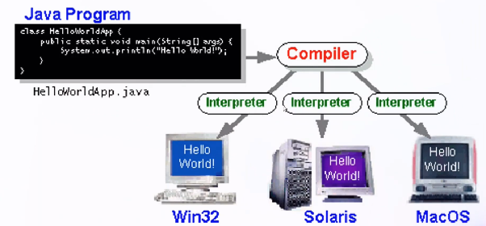  
- Platform khi chạy chương trình gồm cả kiến trúc CPU và hệ điều hành. Mỗi kiến trúc CPU có tập lệnh máy riêng; hệ điều hành cũng có ABI, system call và thư viện hệ thống riêng.
- Java tạo một lớp trung gian là **JVM bytecode**. File `.class` không chứa mã máy dành riêng cho Windows, Linux hay một kiến trúc CPU cụ thể. JVM tương thích trên từng platform chịu trách nhiệm tải, kiểm tra và thực thi bytecode đó.
- Vì vậy, cùng một file `.class` hoặc `.jar` thường có thể chạy trên nhiều platform mà không cần compile lại, miễn là platform có JVM tương thích và chương trình không phụ thuộc native library hay tài nguyên riêng của hệ điều hành.
- Cách nói chính xác không phải lúc nào Java cũng chỉ đi qua hai bước `compile -> interpret`. Khi chạy, JVM hiện đại thường kết hợp **interpreter** và **JIT compiler**.

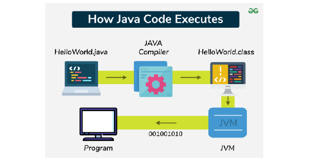  
**Java compile flow — xảy ra khi build:**
- Java compiler (thường là `javac`, thuộc JDK) biên dịch source code `.java` thành JVM bytecode trong các file `.class`; nó không tạo trực tiếp mã máy cho một CPU cụ thể.
- Ví dụ, `javac HelloWorld.java` tạo ra `HelloWorld.class`. Với dự án Maven/Spring Boot, các file `.class` thường nằm trong `target/classes`; Gradle thường đặt chúng trong `build/classes`.
- Khi nhấn **Run** trong IDE, IDE thường compile các source đã thay đổi rồi mới khởi động JVM. Nếu file `.class` đã mới nhất, bước compile có thể được bỏ qua. Chạy lại chương trình vì thế không đồng nghĩa lúc nào cũng compile lại toàn bộ source code.
- Bytecode sinh ra không phụ thuộc trực tiếp vào hệ điều hành đang compile. Tuy nhiên, phiên bản JDK, compiler option hoặc compiler implementation khác nhau có thể tạo nội dung `.class` khác nhau dù dùng cùng source code.

**Java runtime flow — xảy ra khi JVM chạy chương trình:**
1. Lệnh `java HelloWorld` khởi động JVM; class loader tải các class cần thiết và JVM kiểm tra tính hợp lệ của bytecode.
2. Ban đầu, JVM có thể dùng **interpreter** để thực thi từng bytecode instruction. Interpreter thực hiện hành vi của bytecode ngay tại runtime; không nên mô tả đơn giản rằng nó luôn tạo và lưu một file machine code tương ứng.
3. JVM theo dõi quá trình chạy. Khi một method hoặc đoạn code được thực thi nhiều và trở thành *hot code*, **JIT compiler** biên dịch đoạn bytecode đó thành native machine code dành cho CPU/platform hiện tại.
4. Native code do JIT tạo được giữ trong vùng nhớ gọi là **code cache** của tiến trình JVM và được tái sử dụng trong lần chạy hiện tại. Thông thường nó không được lưu thành executable để dùng lại sau khi tắt rồi mở ứng dụng.
5. JVM vẫn có thể tiếp tục interpret phần code ít được sử dụng, đồng thời JIT compile và tối ưu phần code nóng. Vì vậy interpreter và JIT có thể cùng tham gia trong một lần chạy.

JVM không dịch toàn bộ ứng dụng sang machine code ngay khi khởi động và cũng không xử lý trực tiếp source `.java`. JVM tải, kiểm tra file `.class`, rồi thực thi bytecode theo luồng chạy thực tế. Một method thường chỉ được interpreter thực thi khi được gọi; nếu nó trở thành *hot code*, JIT sẽ compile nó thành native machine code cho những lần thực thi tiếp theo. Method hoặc nhánh không được chạy thì không cần được interpret hay JIT compile.

```text
Build time: .java --javac--> .class (JVM bytecode)
Runtime:    .class --class loader/verifier--> interpreter
                                           \-> JIT --> native machine code --> CPU
```

Với ngôn ngữ biên dịch ahead-of-time như C/C++, compiler thường tạo native executable cho một CPU, hệ điều hành và ABI mục tiêu. Chương trình đã được build đúng platform có thể chạy nhiều lần mà **không phải compile lại mỗi lần run**; chỉ cần build lại khi source thay đổi hoặc khi cần binary cho platform mục tiêu khác. Java chủ yếu phân phối bytecode dùng chung và đặt phần thích nghi với platform vào JVM tương ứng. Java cũng có thể dùng AOT/native-image trong một số trường hợp, nên đây là mô hình thực thi phổ biến chứ không phải quy tắc duy nhất.

JDK - Java Development kit: JDK là 1 dạng SDK (Software Development kit)  của Java, là môi trường phát triển phần mềm được sử dụng để phát triển các ứng dụng Java
- JDK cung cấp JVM/runtime cùng các công cụ phát triển như Java compiler (`javac`), Java launcher (`java`), document generator (`javadoc`), archiver (`jar`), debugger và monitoring tools. Lệnh `java` là launcher dùng để khởi động JVM, không phải tên của interpreter.  
- JIT (Just-in-time Compiler) biên dịch các phần bytecode được thực thi nhiều thành native machine code và giữ chúng trong code cache của tiến trình JVM để tăng tốc lần chạy hiện tại.  
- .jar - Java ARchive là 1 định dạng lưu trữ, tệp nén zip đặc biệt, sử dụng để đóng gói nhiều tệp .class (bytecode), libraries, các tệp cấu hình tài nguyên cần thiết (image, properties,...) thành 1 tệp duy nhất để giúp phân phối ứng dụng gọn gàng, dễ dàng hơn (zip mọi thứ cần để chạy Java application).  
- jar giúp dễ dàng quản lý, phân phối các ứng dụng/ java lib + giúp deploy dễ dàng hơn chỉ với 1 file .jar  
- Mục đích sử dụng là để đóng gói ứng dụng vì jar chứa toàn bộ tệp .class của Java nên để triển khai thì chỉ cần triển khai 1 tệp .jar thay vì triển khai từng tệp .class  
- jar là 1 tệp nén định dạng tương tự .zip

JRE - Java Runtime environment = JVM + Libraries (java.lang) + support file (properties, resource): rõ ràng cái tên nói lên tất cả, sử dụng với mục đích chính là để chạy java application
- Về cơ bản, nếu chỉ muốn chạy một Java application đã được build thì cần Java runtime tương thích và bytecode; không cần compiler. JVM có thể dùng cả interpreter và JIT compiler để thực thi bytecode.   
  → nếu không cần viết code lẫn compile code mà chỉ cần run Java application khi đã có sẵn application được viết sẵn rồi thì chỉ cần JRE.

JVM - Java Virtual machine là 1 máy ảo sử dụng để chạy các java application dựa vào bytecode sau khi source code được biên dịch bởi Compiler
- 2 chức năng chính của JVM là: giúp java có thể chạy trên bất kỳ HĐH nào mà không cần thay đổi mã nguồn + quản lý, tối ưu hóa sử dụng bộ nhớ của chương trình  
- Mỗi hđh sẽ có JVM riêng để bytecode chuyển thành machine code phù hợp với hđh đó.  
- JVM được thiết kế để tạo ra 1 abstraction layer với HĐH, Hardware bên dưới giúp bytecode không cần phải thay đổi để đáp ứng với từng HĐH, khi chạy trên Window thì dùng Window OS API và POSIX OS API khi chạy trên Linux/ mac OS   
- Khi chạy chương trình, JVM sẽ call tới main method có trong code  
- JVM giúp quản lý quản lý bộ nhớ (garbage collection) giúp tự động giải phóng bộ nhớ mà chương trình không còn sử dụng, giảm leak memory + kiểm soát Heap, Stack + quản lý các threads để không gây xung đột khi run  
- Không thể cài riêng lẻ, nằm trong JRE.  
- JVM sử dụng Class Loader (lazy load + caching) + metaspace (permgen) + Executive engine
## JVM memory
- Method Area: là khu vực lưu trữ thông tin về class: thông tin về Superclass của nó, thông tin về modifier, variables, methods của class này,... của toàn bộ class sử dụng trong chương trình này (ở Class Level)  
- Heap: lưu trữ thông tin về các đối tượng, sử dụng toàn cục  
- Stack: mỗi 1 method call sẽ tạo 1 stack sử dụng để lưu trữ local variable, sử dụng cục bộ  
- PC Registers: lưu trữ địa chỉ của các lệnh thực thi hiện tại của 1 luồng + 1 luồng sẽ có 1 PC Register riêng  
- Native Method Stacks: đối với 1 luồng, 1 Native Method Stack được tạo ra để lưu trữ thông tin về phương thức gốc.
## JVM flow
Trước tiên là JVM sẽ chia vùng nhớ mà nó quản lý thành nhiều vùng dữ liệu khác nhau + mỗi vùng nhớ sẽ có vai trò riêng (stack, heap, method area,...)
- Method Area sử dụng để lưu trữ thông tin các class 

Sau khi compile các tệp .java thành các tệp .class chứa bytecode, tệp .class này sẽ trải qua nhiều bước như hình bên dưới:  
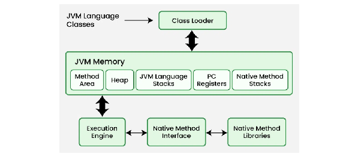  
Class Loader là 1 thành phần thuộc bộ JVM, chịu trách nhiệm tải các .class file vào RAM của JVM khi run chương trình + Class Loader sẽ chịu cách trách nhiệm như:  
  
**B1**: Class Loader sẽ đọc các .class file, lưu vào Method Area gồm các thông tin: tên của class, thông tin về Superclass của nó, thông tin về modifier, variables, methods của class này.
- Với mỗi .class file thì JVM sẽ lưu trữ các thông tin bằng cách: JVM sẽ tạo 1 object thuộc loại java.lang.Class để đại diện cho file này và lưu vào Heap + tại runtime sẽ sử dụng các thông tin này để có thể thực thi chương trình (qua các method getMethod(), getFields(),...)  
- Với ví dụ trên thì JVM sẽ tạo 1 object là Class<Demo> đại diện cho file này và lưu vào Heap, chứa các metadata về class này để sử dụng trong tương lai.

**B2**: JVM xác minh các bytecode về cấu trúc, định dạng xem có hợp lệ không  
**B3**: Khởi tạo giá trị cho static variable + gắn với giá trị trong static block (nếu có)

## Stack
- Khi mà chạy chương trình, JVM sẽ yêu cầu hđh cấp phát cho 1 vùng RAM để dùng cho việc chạy chương trình + để run application một cách tối ưu nhất, JVM chia vùng RAM này thành Stack và Heap  
- Khi declare variables/ objects/ call method,... thì JVM sẽ assign memory cho các hoạt động này từ Stack/ Heap.

Stack memory sử dụng để allocate (cấp phát) static memory (bộ nhớ tĩnh) 
- Stack bao gồm Primitive value nằm trong 1 method đang được call   
- 1 thread = 1 stack = n stack frame (mỗi method được call tạo 1 stack frame).

(Các Primitive value + các references tới object của method nằm trong Heap)
- Stack này sử dụng cơ chế LIFO (Last in first out) order tức là khi có new method được gọi, 1 new block được tạo ra và đặt lên đầu Stack + khi finish method thì block trên đầu Stack này sẽ bị remove đi và quay lại called method => lúc này các variables, references sẽ bị remove theo => auto allocated, deallocated khi finish method => tiết kiệm memory + auto memory management (Block này sẽ gồm các Primitive value + các references)  
- Việc access Stack sẽ nhanh hơn so với Heap (cụ thể là hàng trăm -> ngàn lần)  
- Stack là Thread-safe do mỗi method work trên cùng 1 Stack  
- Stack thì limit-size và size của Stack nhỏ hơn so với Heap  
- Khi số lượng memory của tổng các Stacks bị quá giới hạn memory, throw StackOverFlowException (thường là do gọi đệ quy vô hạn method) + Stack không thể resize được (static memory)  
- Kích thước của Stack là cố định, bất kể có ít hay nhiều biến sử dụng trên Stack, nó cũng giúp việc cấp phát, giải phóng bộ nhớ nhanh chóng, không cần quản lý phức tạp.  
  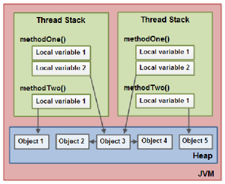
## Heap
Heap space sử dụng để allocated dynamic memory, có thể grow + shrink => flexible  
- Khi object mới được tạo, nó sẽ được tạo trong Heap + references tới object này thì nằm trong Stack  
- object nằm trong Heap thì là Global access, có thể access từ bất kì đâu trong application  
=> Non-safe Thread vì bất cứ thread nào cũng có thể access vào cùng 1 object trong Heap  
- Nếu Heap full thì application throw OutOfMemory  
- Heap không thể tự deallocated được do đó mới sinh ra khái niệm Young, Old, Permanent Generation + Heap phải cần Garbage Collector để deallocated những object không sử dụng trong 1 khoảng thời gian nhất định để optimize memory + vì việc deallocating Heap khó hơn so với Stack nên không thể auto như Stack được (Stack chỉ là add/ remove top of Stack)  
Memory leak tức memory không được deallocated sau khi hoàn thành function => memory sẽ đầy dần => OutOfMemory

  
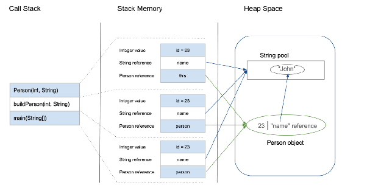  
(Giả sử buildPerson thay trực tiếp thành constructor)  
**B1** Khi vào main(), Stack của main() được tạo + Stack của main() lúc này bao gồm
- Primitive value của int “id” = 23  
- References “person” được tạo trên Stack, pointer tới object nằm trong Heap

**B2** Khi call tới constructor của Person từ main() -> tạo 1 Stack của constructor đặt trên đầu của Stack trước đó (đặt lên đầu của main() Stack) + Stack của constructor lúc này bao gồm
- this point tới person object trong Heap  
- Primitive value của int “id” = 23  
- String name point tới actual string nằm trong String Pool (Heap)

**B3** Sau khi call thành công constructor, remove Stack của constructor này  
**B4** Sau khi constructor thành công thì method main() cũng hết, remove Stack của main() 

Why Stack faster than Heap
- Java sử dụng Multi-thread, Stack là thread-safe nên kiểm soát dễ dàng, nhanh chóng >< Heap là global, cần các cơ chế đồng bộ hóa nên làm giảm hiệu năng.  
- Khi truy cập biến, CPU chỉ cần sử dụng con trỏ Stack Pointer để lấy giá trị >< Heap phải truy cập giá trị trong Stack, sau đó lại mới tìm đối tượng tương ứng trong Heap, ngoài ra nếu Heap bị phân mảnh thì quá trình này diễn ra lâu hơn.  
- Stack cấp phát trong các vùng nhớ đã sẵn của Stack >< Heap phải tìm vùng nhớ đủ để chứa giá trị đối tượng.
## Variable
Variable - biến, sử dụng để lưu trữ giá trị dữ liệu
- Mỗi biến đều có: kiểu dữ liệu + tên biến + giá trị

Variable Name là tên được đặt cho 1 vị trí bộ nhớ
- Tên biến gồm: A-Z, a-z, 0-9, (_) và ($)  
- Ký tự đầu tiên không được là số + biến không sử dụng khoảng trắng + tên biến phân biệt hoa thường + không giới hạn độ dài (khuyến khích 4-15)

Local Variable là biến được định nghĩa trong block/ method/ constructor
- Biến cục bộ được sử dụng, chỉ sử dụng được trong phạm vi trên, sau khi kết thúc hàm thì sẽ tự động dellocated.  
- Việc khởi tạo biến cục bộ là bắt buộc

Instance Variable là biến non-static được định nghĩa bên ngoài block/ method/ constructor
- Khi sử dụng biến thể hiện, các biến này được tạo ra khi tạo ra 1 object, bị hủy khi object này bị hủy + chỉ có thể truy cập thông qua object của lớp.  
- Việc khởi tạo biến thể hiện là không bắt buộc, nếu không khởi tạo thì giá trị mặc định của nó sẽ được gán.

Static Variable giống như Instance Variable, khác chỗ là nó là static.
- 1 Class chỉ có 1 phiên bản của biến tĩnh, bất kể là tạo bao nhiêu object.  
- Biến tĩnh được khởi tạo, và load vào Method Area khi bắt đầu chương trình, và tự động dellocated khi chương trình kết thúc.  
- Biến tĩnh không thể khai báo bên trong các block/ method/ constructor.  
- Việc khởi tạo biến tĩnh là không bắt buộc.  
- Nếu ta truy cập biến tĩnh qua object, Compiler sẽ tự động chuyển nó thành Class gọi biến tĩnh (và việc đặt như vậy là không khuyến khích)
## String
String là 1 class phổ biến trong java đại diện cho 1 tập ký tự + mỗi ký tự là 16bit + được lưu bằng 1 mảng các ký tự (byte\[\])
- String trong java là immutable, một khi nó đã được tạo ra thì nó sẽ không thể thay đổi + việc thay đổi nó sẽ trả về 1 đối tượng mới.  
  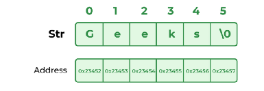

StringBuilder là 1 chuỗi có thể thay đổi được, tuy nhiên lại không thread-safe → chỉ nên sử dụng trong 1 thread, phù hợp với chuỗi thay đổi giá trị thường xuyên trong cùng 1 thread.

StringBuffer là 1 chuỗi có thể thay đổi được và thread-safe (nhiều thread có thể cùng thay đổi 1 object này vì có cơ chế synchronize tránh dẫm chân nhau).

String pool là ctdl được sử dụng rộng rãi nhất, là 1 vùng nhớ đặc biệt sử dụng để lưu trữ String bởi JVM.
- Các String giống nhau, thay vì tạo mới 1 String mới và tống vào RAM thì sẽ ánh xạ tới String có giá trị tương tự.

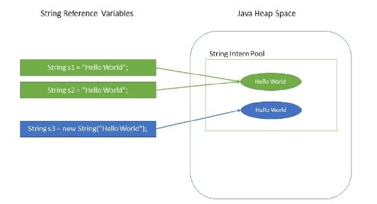
- Lý do String pool dùng String + String dạng immutable là do multi-thread, thread 1 đang sử dụng chuỗi a chả hạn, và thread 2 khác cũng đang sử dụng chuỗi a, nhưng thread 1 đã làm thay đổi giá trị của chuỗi a -> thread 2 cũng sẽ thay đổi giá trị chuỗi a theo gây sai lệch -> giải pháp là dùng immutable để giúp thread safe.
## Inheritance
Inheritance - kế thừa là 1 class cho phép inherit feature (fields + methods) của 1 class khác
- Trong Java thì kế thừa có nghĩa là tạo mới 1 class mà dựa vào 1 class khác đã tồn tại.  
- Khi kế thừa thì ta có thể reuse methods, fields của class được kế thừa đó.  
- Ngoài việc kế thừa các member có sẵn này, ta cũng có thể bổ sung fields + methods bổ sung cho class mới này.  
- Khi gọi constructor của bất kỳ class nào, đầu tiên cũng là call tới super()/ super(....) + nếu không chủ động insert thì compiler cũng sẽ tự động insert.  
- Việc call tới constructor của Superclass khi Subclass được gọi là đúng, nhưng bản thân chỉ có Subclass object được khởi tạo + lý do của việc gọi tới SuperClass constructor là sử dụng để khởi tạo các giá trị thuộc tính nằm trong Superclass  
- Ngoài ra khi call tới constructor của Superclass thì constructor này cũng sẽ call tới constructor của Superclass của nó, nếu không có thì nó sẽ call tới constructor của Object vì Object là Superclass của tất cả các class trong Java.  
- Trong Java, class không được support Multi-inheritance với class mà phải thông qua Interface + Interface có thể extends được từ nhiều Interface khác.  
- Tuy nhiên, Subclass chỉ có thể access vào Public/ Protected member, không thể access vào Private member.

Why Inheritance
- Reuse giúp việc viết những code chung ở Superclass và các Subclass sẽ kế thừa, giúp không cần phải viết thêm code, tránh boiler-code.  
- Method overriding - Run Time Polymorphism đạt được thông qua kế thừa.  
- Abstraction cho phép tạo Abstract class để define các methods sử dụng cho các Subclass, thúc đẩy thêm tính Encapsulation giúp code dễ mở rộng, maintain.

Why not support multi-inheritance
- Lý do nằm ở việc mong muốn thiết kế đơn giản, rõ ràng để có thể dễ dàng maintain do vấn đề phát sinh nhiều Superclass cho 1 Subclass -> lúc maintain sẽ gặp khó khăn, các Subclass chịu ràng buộc lớn hơn (Class A1 kế thừa B1, C2 + A2 kế thừa B1, C1, D3,... khá phức tạp, việc sửa đổi B1 dẫn tới hành vi của A1, A2 thay đổi theo mặc dù chúng không có sự liên quan với nhau)  
- Diamond Inheritance Problem: khi mà class B, C cùng kế thừa từ A + class D kế thừa B, C nếu được phép multi-inheritance. Vấn đề xảy ra là nếu B, C cùng override lại check() chả hạn, vậy cùng lúc đó D không override method này thì implement của nó sẽ là của B hay C?
## Polymorphism
Polymorphism - đa hình tức là có many form (poly = many ; morphs = form)  
- Đa hình cho phép thực thi 1 single action theo nhiều cách khác nhau  
- Đa hình có thể đạt được thông qua define 1 interface/ abstract class/ 1 class bất kỳ và có nhiều Class implement interface này, mỗi method implement theo cách khác nhau tùy theo các Class implement chúng.

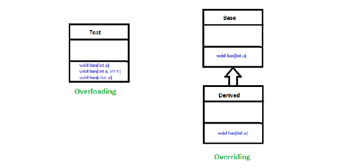  
Compile-time Polymorphism đạt được thông qua Overloading function/ constructor, xảy ra tại compile-time do lúc biên dịch đã check luôn rồi, nếu có vấn đề nó sẽ báo lỗi.
- Đại loại là các method cùng tên nhưng khác nhau về: số lượng param, kiểu dữ liệu của param, thứ tự param. (kiểu trả về khác nhau thì sẽ lỗi nếu giống các cái còn lại)  
- Mục đích là cung cấp nhiều cách sử dụng khác nhau cho cùng 1 chức năng (kiểu cùng hàm add() nhưng số lượng param, data type khác nhau nhưng mục đích đều là cộng)

Run-time Polymorphism đạt được thông qua Override method được resolve tại run-time (tức khi method được gọi, method sẽ được chọn để chạy dựa vào data type của object) + tuy nhiên nó lại gây thêm Overhead do JVM phải xử lý thêm để phát hiện method phù hợp.
- Quá trình này gọi là Dynamic method dispatch: JVM sẽ kiểm tra kiểu của đối tượng đang được call method (nó là A hoặc subclass của A -> pick method phù hợp dựa vào loại đối tượng)
- Giúp khả năng tái sử dụng mã, method nào cần override thì viết, không thì sử dụng lại giống với Superclass (apply với Class).  
- Qui các Class khác nhau về 1 Generic Type cụ thể để dễ dàng viết code handle 1 cho nhiều Type.  
- Dễ dàng maintain hơn khi sử dụng (List a = new ArrayList(), nếu muốn thay đổi datatype thì chỉ cần thay đổi vế phải, và các đoạn code bên dưới không cần phải thay đổi gì cả)  
**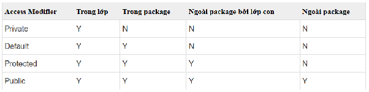**  
## Interface
Interface giống Class, có fields, default methods, static method, cũng có method nhưng chỉ có phần signatures chứ không có phần body  
Static method của Interface cũng gần giống với Class, chỉ có điều là nó không thể được inheritance như với Class  
- Tất cả các fields, methods của Interface mặc định sẽ là public (riêng với fields thì dạng public static final)  
- Các methods của Interface không có giá trị, chỉ khi được implements bởi Class thông qua keyword implements  
- Khi 1 Class implements 1 Interface, bắt buộc phải implements toàn bộ method của Interface này + các method implements của Class phải giống so với signature methods của Interface (names, params, exceptions, …)   
- 1 Interface có thể extends từ nhiều Interface khác

Interface instance  
- Polymorphism: Khi ta create 1 Class object mà implements từ 1 Interface -> object này có thể được ref như 1 instance của Interface (giống với concept của Inheritance instantiation)  
Interface không có constructor nên ta không thể tạo object từ constructor được, mà phải tạo object từ Class, sau đó ref tới object này thông qua Interface   
- Ta có thể implements nhiều Interface trong 1 Class

Interface default method  
- Trước Java 8, Interface không thể trực tiếp write implements cho method của mình  
- Giả sử ta có 1 cái Open-source và trên toàn cầu, hàng nghìn doanh nghiệp đang sử dụng của bạn => khi ta update library bằng cách add 1 signature method lên Interface của library để support tính năng mới cho library => khiến hàng ngàn doanh nghiệp này phải viết lại code của các Class mà implements từ Interface này  
- Ngoài ra nếu 1 Function Interface đang sử dụng ở nhiều nơi => việc thêm concrete method cũng sẽ ảnh hưởng tới các code khác đang chạy  
=> Default method của Interface ra đời, cho phép Interface có thể trực tiếp write implements cho Interface mà các Class implements Interface này không cần phải viết implements cho Default method => Library có thể add thêm methods mà không ảnh hưởng tới những doanh nghiệp đang sử dụng  
(Nó support Backward Compatibility - khả năng tương thích ngược tức giúp hệ thống vận hành tốt với version cũ khi update version mới mà không yêu cầu sửa đổi đáng kể/ gây gián đoạn hệ thống đang vận hành)  
- Default method cũng có thể override bởi Class implements từ Interface này
## Abstraction
Abstraction (tính trừu tượng): là kỹ thuật ẩn đi các chi tiết triển khai phức tạp (tập trung vào cái method này để làm gì chứ không tập trung vào cách thức triển khai).
- Chỉ hiển thị các tính năng cần thiết (tôi call hàm addCart, nhưng tôi chỉ cần biết nó add sản phẩm vào cart, không cần biết là chi tiết code triển khai thế nào) → dùng library nhanh hơn/ dùng hàm có sẵn của người khác viết.  
- Abstraction là nguyên tắc thiết kế, không phải là cứ dùng interface/ abstract class là đạt được abstraction.

  **Abstract class**

Abstract class là 1 class được khai báo kèm với abstract keyword, abstract class gồm concrete method + abstract method  
- abstract keyword apply với class và method, not variables + có thể apply với top-level class hoặc inner class  
- Abstract class không thể initialize được mà phải gián tiếp qua Sub-non-abstract class của nó + tuy nhiên vẫn có constructor cho abstract class  
- Abstract class có final, static method nhưng apply với concrete method, còn bản thân abstract method là để implement nên final, static là vô lý  
- Nếu A là Abstract class có abstract method m1(), m2() -> tạo 1 Class B extends từ A thì vẫn có thể chỉ implements m1(), sau đó class C lại extends từ B để implements m2()
## Interface vs Abstract class
- Interface support multi-inheritance > ta chỉ có thể inheritance 1 class duy nhất  
- Interface cung cấp abstract method và bắt buộc các class phải implements hết đống method này >< Abstract class cung cấp thêm cả concrete method, ta có thể override hoặc không (mặc dù sau này Interface cung cấp static/ default method nhưng không dùng thế)  
- Interface là no state < Abstract class là have state -> các variable của nó có thể thay đổi theo thời gian trong khi Interface thì không	

**Overview hậu Java 8**  
Interface sinh ra là để define các công việc mà 1 class có thể làm, thay vì làm nó như thế nào  
- Trong Java 8 có thêm function về Interface là default + static method, tuy nhiên nó có nhiệm vụ khá đặc biệt, không phải ta cứ define class là ngay lập tức add default/ static method vào luôn Interface, mà mục đích của nó là để maintain   
=> Tức là nếu 1 Interface đã tồn tại lâu rồi, được sử dụng bởi rất nhiều các Class khác, nhưng nếu doanh nghiệp yêu cầu thêm 1 chức năng cho hệ thống, chả lẽ ta lại thêm abstract method vào Interface -> dẫn tới hàng chục class đang implement nó sẽ break structure ? Tệ hơn là nếu ta sử dụng 1 Library có sẵn của Java support, vào 1 ngày này đó nó add thêm 1 abstract method vào và project của hàng chục doanh nghiệp đang implement nó bị break structure nếu muốn tăng version của library?   
=> Default method của Interface sinh ra làm giải pháp cho vấn đề này, ta có thể add thêm 1 method vào 1 exists Interface mà ko break structure của các classes đang implement nó + có thể override lại method này nếu muốn  
=> Static method của Interface sinh ra cũng giống như Default method mà khác 1 chỗ là implement class ko thể override lại method này
- Ngoài ra rõ ràng Interface để define các công việc class có thể làm, nên bí lắm như case trên ta mới phải chấp nhận viết implement trực tiếp lên Interface, vì nó sẽ làm dài code, mục tiêu của Interface là muốn dev nhìn vào và biết ngay lập tức chức năng của function đó => việc viết implement sẽ cản trở tính Abstraction  
=> Vậy thì Interface có là 100% abstraction không => KHÔNG

**Use Case**  
**Interface** thì sử dụng để define các chức năng có thể làm của Class chứ không hề define cách thức hoạt động của function + việc add thêm 1 abstract method vào 1 Interface đã tồn tại và sử dụng rồi thì gây nhiều vấn đề (giả sử 100 class đang implement + add thêm 1 abstract method vào thì 100 class này bị break structure, phải implement cái method vừa add vào -> sử dụng default/ static method)

**Abstract class** thì có thể sử dụng cả concrete method + abstract method + field => nên sử dụng khi các class sử dụng chung các thuộc tính (thời gian tạo, thời gian update bản ghi,…) và cùng sử dụng các method có chung implement (set thời gian tạo mới,...) + việc add thêm 1 method như concrete method là cho phép trong abstract class + nó không làm break structure của các class khác

## Upcasting và Downcasting

Casting không làm thay đổi object trong Heap; nó chỉ thay đổi kiểu reference mà compiler dùng để xác định những member nào có thể được truy cập.

```java
class Animal {
    void speak() {
        System.out.println("Animal sound");
    }
}

class Dog extends Animal {
    @Override
    void speak() {
        System.out.println("Woof");
    }

    void fetch() {
        System.out.println("Fetching the ball");
    }
}
```

### Upcasting: subtype → supertype

```java
Dog dog = new Dog();
Animal animal = dog; // tự động upcast, không cần (Animal)

animal.speak(); // "Woof" — gọi method override của Dog
// animal.fetch(); // compile error: Animal không khai báo fetch()
```

- Object thực tế vẫn là `Dog`; chỉ reference `animal` có kiểu compile-time là `Animal`.
- Upcasting an toàn và được Java thực hiện tự động vì mọi `Dog` đều là một `Animal`.
- Compiler chỉ cho truy cập member được khai báo bởi kiểu reference `Animal`. Riêng instance method bị override vẫn được chọn theo kiểu object thực tế tại runtime — đây là polymorphism.
- Upcasting giúp code làm việc với abstraction thay vì phụ thuộc vào từng implementation cụ thể.

Ví dụ thực tế: xử lý nhiều phương thức thanh toán qua cùng một interface.

```java
interface PaymentMethod {
    void pay(long amount);
}

class CreditCard implements PaymentMethod {
    public void pay(long amount) {
        System.out.println("Pay by credit card: " + amount);
    }
}

class BankTransfer implements PaymentMethod {
    public void pay(long amount) {
        System.out.println("Pay by bank transfer: " + amount);
    }
}

void checkout(PaymentMethod method, long amount) {
    method.pay(amount);
}

checkout(new CreditCard(), 500_000);   // CreditCard được upcast
checkout(new BankTransfer(), 500_000); // BankTransfer được upcast
```

`checkout()` không cần biết implementation cụ thể, nên có thể bổ sung phương thức thanh toán mới mà không phải thay đổi logic hiện tại.

### Downcasting: supertype → subtype

Downcasting dùng khi reference có kiểu cha nhưng cần truy cập hành vi chỉ có ở kiểu con. Java yêu cầu cast tường minh vì compiler không thể đảm bảo object thực tế có đúng kiểu con hay không.

```java
Animal animal = new Dog();
Dog dog = (Dog) animal; // hợp lệ vì object thực tế là Dog
dog.fetch();
```

Cast sai vẫn compile được nhưng gây `ClassCastException` tại runtime:

```java
Animal animal = new Animal();
Dog dog = (Dog) animal; // ClassCastException
```

Nên kiểm tra bằng pattern matching của `instanceof` trước khi downcast:

```java
void play(Animal animal) {
    if (animal instanceof Dog dog) {
        dog.fetch();
    }
}
```

Tóm lại:

- Upcasting: tự động, an toàn và thường dùng để đạt polymorphism.
- Downcasting: tường minh, có thể lỗi tại runtime và chỉ nên dùng khi thực sự cần hành vi riêng của subtype.
- Nếu phải liên tục dùng `instanceof` và downcast, nên cân nhắc đưa hành vi chung vào interface/abstract class để thiết kế hướng đa hình hơn.

			**Autoboxing vs Unboxing**  
Primitive lưu trực tiếp giá trị trong Stack
- Có kiểu dữ liệu cơ bản, có sẵn trong Java (int, float, double, char, boolean, byte, short, long)   
- Có giá trị mặc định (int thì là 0, boolean là false,...)  
- So sánh ==.  
- Dùng khai báo trực tiếp.  
- Khi gán biến a cho biến b, bản chất là copy giá trị và đặt trong stack → 1 cái thay đổi không làm thay đổi cái còn lại.  
- for qua 1m element rồi tính toán dùng primitive nhanh hơn (không phải phân bổ trong Heap, ko bị autoboxing, unboxing qua lại) nhiều so với reference tới 5-7 lần.

Reference lưu địa chỉ tham chiếu đến đối tượng trong Stack, giá trị thực sự nằm trong Heap.
- Có kiểu dữ liệu tham chiếu đến đối tượng trong bộ nhớ (class, array, interface, String, wrapper classes).  
- Mặc định là null nếu không gán.  
- So sánh qua equals().  
- Khai báo qua new().  
- Khi gán biến a cho biến b, bản chất là copy tham và đặt trong stack → thay đổi object làm thay đổi cả a, b.

Autoboxing, Unboxing là quá trình mà Compiler chuyển đổi tự động qua lại giữa Primitive type và Wrapper type một cách ngầm định.
- Trước Java 5 thì cần phải chuyển đổi thủ công, và giờ đã support trong java để tránh xấu code  
- Hiệu suất có thể giảm do phải chuyển đổi giữa các kiểu.  
- Tăng áp lực lên Garbage Collection do phải dọn Heap.

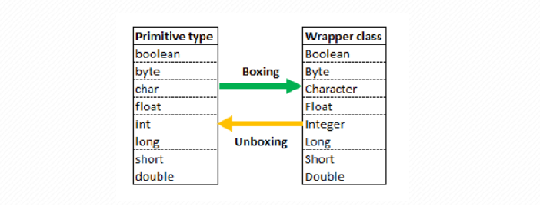  
Autoboxing là chuyển từ kiểu Primitive sang Wrapper bằng cách copy giá trị ban đầu, đặt vào trong vùng Heap
- Việc chuyển đổi này tốn thời gian và tốn dung lượng thêm do phải lưu cả Stack lẫn Heap

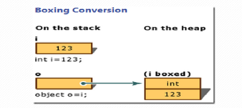  
  
Unboxing là chuyển từ kiểu Wrapper sang Primitive bằng cách copy giá trị trong Heap về Stack.
- Nếu giá trị của Wrapper là null thì sẽ NullPointerException

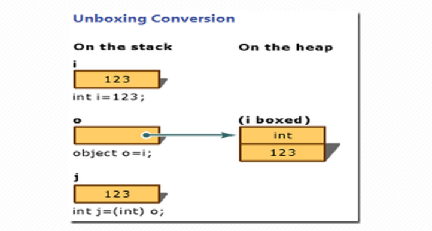  

			     **Anonymous Class**  
Anonymous Class là 1 class không được define class name, tên của nó được sinh ra sau quá trình compile
- Sử dụng để define class, đồng thời khởi tạo đối tượng luôn  
- Thông thường không nên sử dụng do không thể reuse được Anonymous class, còn làm dài code -> nếu sử dụng thì cũng nên override ít method lại.  
- Áp dụng được cả với Interface  
- Sử dụng constructor của Superclass để khởi tạo (có param thì cũng phải truyền param vào)

Local Class 
- Local Class giúp tạo các đối tượng mà không cần định nghĩa trước class, coi Class bị ghi đè là Superclass  
- Ở ví dụ bên dưới thì đang kế thừa abstract class, còn nếu là class thường thì có thể override lại bất kỳ method nào.  
  

Local Inner Class
- Local Inner Class giúp define 1 class bên trong 1 method  
## Exception
Exception - ngoại lệ, là sự kiện xảy ra trong quá trình thực thi chương trình, làm gián đoạn luồng thực thi  
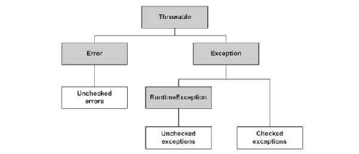
- Throwable là lớp lớn nhất trong hệ này, dành cho tất cả các object mà có thẻ sử dụng kèm với throw, try-catch.  
- Error là class đại diện cho 1 lỗi nghiêm trọng xảy ra ở cấp độ JVM mà chương trình không nên bắt trong quá trình thực thi, thường liên quan tới vấn đề môi trường chạy JVM, một số có thể xử lý, một số không thể xử lý (như StackOverFlow, OutOfMemory,...)  
- Exception là class đại diện cho ngoại lệ trong quá trình thực thi chương trình có thể dự đoán được, và nên được xử lý ngoại lệ này để chương trình tiếp tục hoạt động mà không gặp gián đoạn.  
- Unchecked Exception/ RuntimeException là các ngoại lệ xảy ra bất ngờ, thường là do logic code nên không cần bắt try-catch (NullPointerException, ArrrayIndexOutOfBoundsException,...), không thể dự đoán được tại compile + thế thì cái nào cũng phải try-catch :))  
- Checked Exception là các ngoại lệ có thể xảy ra, được dự đoán trước → buộc phải try-catch để xử lý ngoại lệ/ throws để khai báo ngoại lệ (FileNotFoundException, IOException,...), lỗi này có thể dự đoán trước được nên buộc phải xử lý để tránh lỗi.
- throw sử dụng để ném ra 1 ngoại lệ >< throws sử dụng để khai báo các ngoại lệ có thể xảy ra trong 1 method (buộc các method khác sử dụng phải xử lý Checked exception).
## Lambda Expression
Lambda Expression được Java 8 giới thiệu để viết gọn phần triển khai của một **functional interface**. Nó đặc biệt hữu ích khi ta muốn truyền một hành vi ngắn vào method khác, ví dụ: điều kiện lọc dữ liệu, cách sắp xếp, hành động khi duyệt danh sách, logic xử lý trong Stream.

Nói ngắn gọn: **lambda là cách viết ngắn cho một implementation của functional interface**.

Trước Java 8, nếu muốn truyền một hành vi ngắn, thường phải dùng anonymous class. Anonymous class đúng nhưng dài, nhất là khi interface chỉ có một method cần triển khai.

Ví dụ anonymous class:

```java
Runnable task = new Runnable() {
    @Override
    public void run() {
        System.out.println("Run task");
    }
};
```

Viết bằng lambda:

```java
Runnable task = () -> System.out.println("Run task");
```

Hai đoạn trên cùng thể hiện một ý: tạo một `Runnable`. Điểm khác là lambda bỏ bớt phần cú pháp lặp lại, chỉ giữ phần quan trọng là "khi chạy thì làm gì".

### Functional Interface
Functional interface là interface chỉ có **một abstract method**. Lambda cần functional interface vì compiler phải biết lambda đang triển khai method nào, nhận tham số gì và trả về kiểu gì.

Ví dụ:

```java
@FunctionalInterface
interface Calculator {
    int calculate(int a, int b);
}
```

Interface này là functional interface vì chỉ có một abstract method là `calculate`.

Lambda triển khai interface đó:

```java
Calculator sum = (a, b) -> a + b;
```

Ở đây `(a, b) -> a + b` chính là phần triển khai ngắn gọn cho method `calculate`.

`@FunctionalInterface` không bắt buộc, nhưng nên dùng khi tự tạo functional interface. Annotation này giúp compiler kiểm tra: nếu lỡ thêm abstract method thứ hai, code sẽ báo lỗi ngay lúc compile.

Functional interface vẫn được phép có `default method` và `static method`, miễn là chỉ có một abstract method.

```java
@FunctionalInterface
interface Printer {
    void print(String message);

    default void printTwice(String message) {
        print(message);
        print(message);
    }

    static Printer console() {
        return message -> System.out.println(message);
    }
}
```

`Printer` vẫn là functional interface vì chỉ có một abstract method là `print`. `default method` và `static method` không làm mất tính functional interface.

### Cú Pháp Lambda
Cú pháp tổng quát:

```java
(parameters) -> expression_or_body
```

Các dạng thường gặp:

```java
() -> System.out.println("Hello")
```

Không có tham số, không trả về giá trị.

```java
x -> x * 2
```

Một tham số thì có thể bỏ dấu ngoặc.

```java
(a, b) -> a + b
```

Nhiều tham số thì phải có dấu ngoặc.

```java
(a, b) -> {
    int result = a + b;
    return result;
}
```

Body nhiều dòng thì dùng `{}` và nếu cần trả kết quả thì phải dùng `return`.

Nếu lambda chỉ có một expression, Java tự lấy expression đó làm kết quả trả về:

```java
(a, b) -> a + b
```

Nếu dùng block body, phải viết `return` rõ ràng khi functional interface yêu cầu trả về giá trị:

```java
(a, b) -> {
    return a + b;
}
```

### Lambda Không Tự Đứng Một Mình
Một điểm rất quan trọng: lambda trong Java cần **target type**. Nghĩa là compiler phải biết lambda đang được gán cho functional interface nào.

Ví dụ hợp lệ:

```java
Runnable task = () -> System.out.println("Run");
```

Compiler biết `task` có kiểu `Runnable`, mà `Runnable` có abstract method `run()`, nên lambda `() -> ...` được hiểu là phần triển khai của `run()`.

Ví dụ khác:

```java
Comparator<String> byLength = (a, b) -> a.length() - b.length();
```

Compiler biết `Comparator<String>` cần method so sánh hai `String`, nên `a` và `b` được suy luận là `String`.

Lambda không phải một object độc lập có kiểu riêng rõ ràng như class. Nó phải được đặt trong ngữ cảnh mà Java suy ra được functional interface đích: gán vào biến, truyền vào method, return từ method, hoặc ép kiểu.

### Type Inference
Java thường tự suy luận kiểu tham số của lambda dựa vào target type.

```java
Comparator<String> c1 = (String a, String b) -> a.compareTo(b);
Comparator<String> c2 = (a, b) -> a.compareTo(b);
```

`c1` và `c2` có ý nghĩa giống nhau. Ở `c2`, Java tự biết `a` và `b` là `String` vì target type là `Comparator<String>`.

Tuy nhiên nếu ngữ cảnh không đủ rõ, compiler sẽ không biết lambda thuộc functional interface nào. Khi đó cần khai báo kiểu rõ hơn hoặc tránh viết quá mơ hồ.

### Lambda Và Anonymous Class Khác Nhau Ở Đâu?
Lambda thường được xem là cách viết ngắn hơn anonymous class, nhưng không hoàn toàn giống anonymous class.

Khác biệt quan trọng:
- Anonymous class tạo một class ẩn danh có thể có nhiều method override nếu parent/interface cho phép.
- Lambda chỉ dùng cho functional interface.
- Trong lambda, `this` vẫn trỏ tới object bên ngoài nơi lambda được viết.
- Trong anonymous class, `this` trỏ tới object anonymous class.
- Lambda phù hợp với hành vi ngắn, rõ ý, thường truyền vào API như Stream, Optional, Comparator, event handler.

Ví dụ dùng lambda với list:

```java
List<String> names = List.of("An", "Binh", "Cuong");
names.forEach(name -> System.out.println(name));
```

Ở đây `forEach` nhận một hành vi: với mỗi phần tử thì làm gì. Lambda `name -> System.out.println(name)` chính là hành vi đó.

### Effectively Final
Lambda có thể dùng biến local bên ngoài, nhưng biến đó phải là `final` hoặc **effectively final**.

Effectively final nghĩa là biến không cần ghi chữ `final`, nhưng sau khi gán giá trị ban đầu thì không bị gán lại.

Ví dụ hợp lệ:

```java
String prefix = "Hello";
names.forEach(name -> System.out.println(prefix + " " + name));
```

Ví dụ không hợp lệ:

```java
String prefix = "Hello";
prefix = "Hi";
names.forEach(name -> System.out.println(prefix + " " + name));
```

Lý do: lambda có thể chạy sau thời điểm method hiện tại kết thúc hoặc chạy trong ngữ cảnh khác. Java yêu cầu biến local được capture phải ổn định để tránh lỗi khó đoán. Nếu cần thay đổi trạng thái, nên cân nhắc dùng object có trạng thái rõ ràng hoặc thiết kế lại luồng xử lý.

### Các Functional Interface Có Sẵn
Java cung cấp nhiều functional interface trong package `java.util.function`, nên không phải lúc nào cũng cần tự tạo interface.

Các loại hay dùng:
- `Predicate<T>`: nhận `T`, trả về `boolean`. Dùng cho điều kiện lọc/kiểm tra.
- `Function<T, R>`: nhận `T`, trả về `R`. Dùng cho chuyển đổi dữ liệu.
- `Consumer<T>`: nhận `T`, không trả về gì. Dùng cho hành động xử lý.
- `Supplier<T>`: không nhận gì, trả về `T`. Dùng để cung cấp/tạo dữ liệu.
- `UnaryOperator<T>`: nhận `T`, trả về `T`. Dùng khi input/output cùng kiểu.
- `BinaryOperator<T>`: nhận hai giá trị cùng kiểu `T`, trả về `T`.

Ví dụ ngắn:

```java
Predicate<String> notBlank = s -> !s.isBlank();
Function<String, Integer> length = s -> s.length();
Consumer<String> print = s -> System.out.println(s);
Supplier<Long> now = () -> System.currentTimeMillis();
```

Nên dùng functional interface có sẵn khi nó diễn tả đúng ý nghĩa. Chỉ tự tạo functional interface khi tên nghiệp vụ riêng giúp code dễ hiểu hơn.

### Lambda Với Stream
Lambda thường xuất hiện nhiều trong Stream vì Stream cần truyền hành vi vào từng bước xử lý.

Ví dụ:

```java
List<String> result = names.stream()
    .filter(name -> name.length() > 2)
    .map(name -> name.toUpperCase())
    .collect(Collectors.toList());
```

Ý nghĩa:
- `filter`: giữ lại tên có độ dài lớn hơn 2.
- `map`: chuyển từng tên thành chữ hoa.
- `collect(Collectors.toList())`: gom kết quả thành list.

Lambda giúp đọc được luồng xử lý dữ liệu theo từng bước, thay vì phải viết vòng lặp dài.

### Method Reference
Method reference là cách viết gọn hơn lambda khi lambda chỉ gọi lại một method đã có sẵn. Nó dùng toán tử `::`.

Ví dụ:

```java
names.forEach(name -> System.out.println(name));
names.forEach(System.out::println);
```

Hai dòng trên có ý nghĩa tương đương. Dòng thứ hai ngắn hơn vì lambda chỉ gọi method `println` đã có.

Các loại method reference:

Static method reference:

```java
Function<String, Integer> parse = Integer::parseInt;
```

Tương đương:

```java
Function<String, Integer> parse = s -> Integer.parseInt(s);
```

Instance method của một object cụ thể:

```java
Printer printer = message -> System.out.println(message);
Consumer<String> job = printer::print;
```

Tương đương:

```java
Consumer<String> job = message -> printer.print(message);
```

Instance method của object bất kỳ thuộc một class:

```java
Comparator<String> ignoreCase = String::compareToIgnoreCase;
```

Tương đương:

```java
Comparator<String> ignoreCase = (a, b) -> a.compareToIgnoreCase(b);
```

Constructor reference:

```java
Supplier<ArrayList<String>> createList = ArrayList::new;
```

Tương đương:

```java
Supplier<ArrayList<String>> createList = () -> new ArrayList<>();
```

Nên dùng method reference khi nó làm code rõ hơn. Nếu method reference khiến người đọc khó hiểu tham số nào truyền vào đâu, dùng lambda rõ ràng sẽ tốt hơn.

### Comparable Và Comparator
`Comparable` và `Comparator` đều liên quan tới sắp xếp, nhưng ý nghĩa khác nhau.

`Comparable` dùng khi bản thân class có một thứ tự tự nhiên. Ví dụ tên sản phẩm có thể sắp xếp theo tên, ngày có thể sắp xếp theo thời gian, số có thể sắp xếp theo giá trị.

```java
class Product implements Comparable<Product> {
    private int price;

    @Override
    public int compareTo(Product other) {
        return Integer.compare(this.price, other.price);
    }
}
```

Khi dùng `Comparable`, logic sắp xếp nằm ngay trong class. Điều này phù hợp nếu class thật sự có một thứ tự tự nhiên rõ ràng. Không nên nói cứ implement `Comparable` là sai SRP. Nó chỉ có vấn đề khi class bị nhồi nhiều cách sắp xếp khác nhau hoặc thứ tự đó không thuộc trách nhiệm tự nhiên của class.

`Comparator` dùng khi muốn tách logic sắp xếp ra bên ngoài, đặc biệt khi có nhiều cách sắp xếp khác nhau.

Giả sử `Product` có `getPrice()` và `getName()`:

```java
Comparator<Product> byPrice = (p1, p2) -> Integer.compare(p1.getPrice(), p2.getPrice());
Comparator<Product> byName = (p1, p2) -> p1.getName().compareTo(p2.getName());
```

`Comparator` là functional interface, nên dùng lambda rất tiện. Nếu logic so sánh đã có method phù hợp, có thể dùng method reference hoặc helper method để code dễ đọc hơn.

Ví dụ dùng Comparator với method có sẵn:

```java
products.sort(Comparator.comparing(Product::getPrice));
products.sort(Comparator.comparing(Product::getName));
```

Ý nghĩa:
- `Product::getPrice` lấy giá để sắp xếp.
- `Product::getName` lấy tên để sắp xếp.

### Khi Nào Nên Dùng Lambda?
Nên dùng lambda khi:
- Hành vi ngắn, đọc một lần hiểu ngay.
- Method nhận functional interface như `Runnable`, `Comparator`, `Predicate`, `Function`, `Consumer`.
- Xử lý collection/stream.
- Muốn truyền điều kiện, cách chuyển đổi, cách sắp xếp hoặc hành động xử lý vào method.

Không nên lạm dụng lambda khi:
- Body quá dài, nhiều logic nghiệp vụ phức tạp.
- Có nhiều nhánh điều kiện khiến lambda khó đọc.
- Cần đặt tên rõ ràng cho business rule.
- Logic được tái sử dụng ở nhiều nơi.
- Cần debug từng bước phức tạp.

Trong các trường hợp đó, nên tách thành method/class có tên rõ ràng. Lambda tốt nhất khi nó làm code rõ hơn, không phải chỉ để code ngắn hơn.

### Lưu Ý Quan Trọng
- Lambda chỉ dùng được khi target type là functional interface.
- Functional interface chỉ có một abstract method, nhưng có thể có nhiều `default method` và `static method`.
- `@FunctionalInterface` không bắt buộc nhưng nên dùng để compiler bảo vệ ý định thiết kế.
- Lambda có thể bỏ kiểu tham số nếu Java suy luận được.
- Lambda có thể bỏ `{}` và `return` nếu body chỉ là một expression.
- Biến local dùng trong lambda phải là final hoặc effectively final.
- Method reference là dạng viết gọn khi lambda chỉ gọi method/constructor có sẵn.
- Lambda giúp viết code ngắn hơn, nhưng mục tiêu chính vẫn là làm hành vi truyền vào trở nên rõ ràng.

Nguồn tham khảo:
- Oracle Java Tutorials - Lambda Expressions: [https://docs.oracle.com/javase/tutorial/java/javaOO/lambdaexpressions.html](https://docs.oracle.com/javase/tutorial/java/javaOO/lambdaexpressions.html)
- Oracle Java Tutorials - Method References: [https://docs.oracle.com/javase/tutorial/java/javaOO/methodreferences.html](https://docs.oracle.com/javase/tutorial/java/javaOO/methodreferences.html)
- Java SE 8 API - `java.util.function`: [https://docs.oracle.com/javase/8/docs/api/java/util/function/package-summary.html](https://docs.oracle.com/javase/8/docs/api/java/util/function/package-summary.html)
- Java Language Specification - Lambda Expressions: [https://docs.oracle.com/javase/specs/jls/se21/html/jls-15.html#jls-15.27](https://docs.oracle.com/javase/specs/jls/se21/html/jls-15.html#jls-15.27)
## Stream
Stream là một tính năng quan trọng cho xử lý tập hợp dữ liệu theo phong cách lập trình hàm.
- Tạo chuỗi các thao tác xử lý liên tiếp (input → xử lý → output làm input cho thao tác tiếp theo cho tới cuối cùng) + code nhìn ngắn gọn hơn.

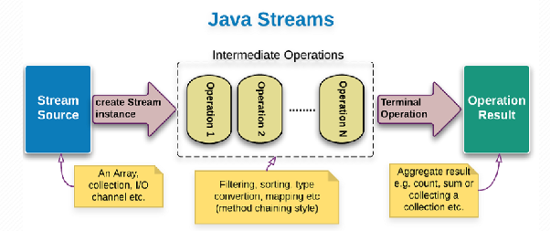
- Stream hỗ trợ các hoạt động tuần tự (stream) sử dụng 1 thread / song song (parallelStream) sử dụng nhiều thread.  
- Parallel Stream cho phép xử lý dữ liệu song song (parallel processing) bằng cách tự động chia nhỏ dữ liệu thành nhiều phần và xử lý trên nhiều luồng (threads) cùng lúc, tận dụng đa lõi CPU.  
- Tự động chia công việc thành các task nhỏ  
- Phân phối cho ForkJoinPool (thread pool)  
- Gộp kết quả lại khi hoàn thành

   

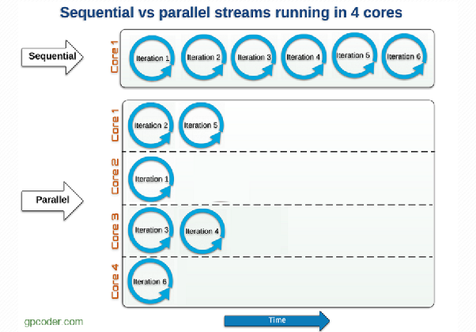
- Stream không lưu trữ các element của Collection/ Array, mà chỉ thực hiện các phép toán tổng hợp + khi lấy Collection/ Array cũ thì nhận thấy giá trị của chúng không thay đổi, mà chỉ trả về 1 Collection/ Array mới → thread safe.  
## Single Responsibility Principle (SRP)
Tên đúng là **Single Responsibility Principle**, không phải **Single Repository Principle**. SRP là chữ **S** trong SOLID. "Repository" là một design pattern dùng để gom logic truy cập dữ liệu, còn "Responsibility" nghĩa là trách nhiệm/lý do thay đổi của một module.

Theo cách hiểu phổ biến của Robert C. Martin, một class/module nên có **một và chỉ một lý do để thay đổi**. Nói dễ hiểu hơn: nếu một class đang phải sửa vì nhiều nhóm yêu cầu khác nhau, nhiều nghiệp vụ khác nhau, hoặc nhiều tầng kỹ thuật khác nhau, class đó có thể đang ôm quá nhiều trách nhiệm.

Ví dụ: một class xử lý nhân viên vừa tính lương, vừa tính số giờ làm, vừa xuất báo cáo. Ba phần này có thể thay đổi vì ba lý do khác nhau:
- Cách tính lương thay đổi do yêu cầu của bộ phận tài chính.
- Cách tính giờ làm thay đổi do yêu cầu của bộ phận nhân sự.
- Format báo cáo thay đổi do yêu cầu của người dùng hoặc hệ thống xuất file.

Nếu để chung trong một class, khi sửa cách tính lương ta có thể vô tình làm hỏng phần tính giờ hoặc phần báo cáo. Đây là vấn đề SRP muốn tránh: một thay đổi nhỏ ở một trách nhiệm không nên làm ảnh hưởng sang trách nhiệm khác.

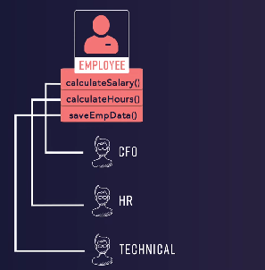

Trong ví dụ `Employee`, nếu cả chức năng tính lương và tính giờ cùng dùng chung một phần xử lý giờ làm, thì khi bộ phận tài chính yêu cầu sửa cách tính lương, ta có thể phải sửa phần xử lý chung đó. Nhưng phần tính giờ cho bộ phận nhân sự cũng đang phụ thuộc vào phần xử lý chung, nên nó có nguy cơ bị ảnh hưởng dù yêu cầu ban đầu không liên quan tới nhân sự.

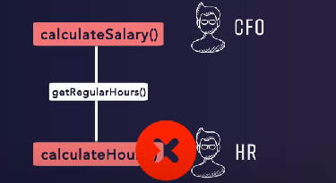

Điểm quan trọng: SRP không có nghĩa là **một class chỉ được có một method public**. Một class có thể có nhiều method public nếu các method đó cùng phục vụ một trách nhiệm rõ ràng. Ví dụ một service quản lý sản phẩm có thể có các thao tác tạo, cập nhật, đổi trạng thái, kiểm tra thông tin sản phẩm nếu tất cả đều thuộc cùng một nhóm nghiệp vụ quản lý sản phẩm.

SRP cũng không có nghĩa là cứ thấy method dài là tách class ngay. Việc tách nhỏ method giúp code dễ đọc hơn, nhưng đó mới là refactor ở cấp method. SRP quan tâm nhiều hơn tới việc **tách trách nhiệm thay đổi**. Nếu một class thay đổi vì nghiệp vụ sản phẩm thì để ở nhóm xử lý sản phẩm; nếu thay đổi vì database thì để ở repository; nếu thay đổi vì HTTP request/response thì để ở controller.

Ví dụ thực tế trong Java/Spring:
- `Controller` nên tập trung nhận request, gọi service phù hợp và trả response.
- `Service` nên tập trung xử lý nghiệp vụ, kiểm tra rule, điều phối các bước cần thiết.
- `Repository` nên tập trung truy cập dữ liệu như tìm, lưu, cập nhật, xóa dữ liệu trong database.

Nếu controller tự viết luôn rule nghiệp vụ và tự thao tác database, nó có nhiều lý do để thay đổi: API thay đổi, nghiệp vụ thay đổi, database thay đổi. Khi đó controller khó đọc, khó test và dễ phát sinh lỗi khi sửa.

Repository pattern liên quan tới SRP nhưng không phải là SRP. Martin Fowler mô tả Repository là lớp trung gian giữa domain và data mapping, giúp code nghiệp vụ nhìn dữ liệu gần giống một tập hợp object thay vì phải biết chi tiết database. Spring Data cũng dùng khái niệm repository để giảm boilerplate ở tầng data access. Vì vậy trong Spring, repository là một cách giúp giữ SRP tốt hơn: service không cần biết chi tiết truy vấn database, còn repository không nên chứa business logic phức tạp.

Khi áp dụng SRP, có thể tự hỏi:
- Class này thay đổi vì ai hoặc vì nhóm yêu cầu nào?
- Nếu database đổi, class này có cần sửa không?
- Nếu nghiệp vụ đổi, class này có cần sửa không?
- Nếu format response/API đổi, class này có cần sửa không?
- Tên class có đang khó đặt vì nó làm quá nhiều việc không?

Nếu câu trả lời cho nhiều loại thay đổi đều là "có", đó là dấu hiệu nên tách trách nhiệm ra rõ hơn.

Nguồn tham khảo:
- Robert C. Martin/SRP: "một module nên có một lý do để thay đổi" là cách diễn đạt phổ biến của Single Responsibility Principle.
- Martin Fowler - Repository pattern: [https://martinfowler.com/eaaCatalog/repository.html](https://martinfowler.com/eaaCatalog/repository.html)
- Spring Data JPA - Repository interfaces: [https://docs.spring.io/spring-data/jpa/reference/repositories/definition.html](https://docs.spring.io/spring-data/jpa/reference/repositories/definition.html)
- Spring Data project: [https://spring.io/projects/spring-data/](https://spring.io/projects/spring-data/)
## Open/Closed Principle (OCP)
Tên đầy đủ là **Open/Closed Principle**, thường viết tắt là **OCP**. Đây là chữ **O** trong SOLID. Ý chính: **software entities như class, module, function nên mở để mở rộng, nhưng đóng với việc sửa đổi**.

Nói dễ hiểu hơn: khi hệ thống có yêu cầu mới, ta nên thiết kế sao cho có thể thêm hành vi mới bằng cách thêm phần mới, thay vì liên tục sửa vào phần code cũ đã chạy ổn. Mục tiêu là giảm nguy cơ làm hỏng chức năng cũ, giảm số lượng nơi phải sửa và giúp việc test lại nhẹ hơn.

"Open for extension" nghĩa là module vẫn có thể hỗ trợ thêm hành vi mới. Ví dụ hệ thống thanh toán ban đầu hỗ trợ thanh toán bằng tiền mặt, sau đó cần thêm chuyển khoản, ví điện tử hoặc thẻ. Nếu thiết kế tốt, ta có thể thêm một cách thanh toán mới mà không phải sửa nhiều logic xử lý đơn hàng đang có.

"Closed for modification" không có nghĩa là code cũ bị cấm sửa tuyệt đối. Nếu có bug, sai nghiệp vụ, sai tên, sai thiết kế hoặc requirement cũ thay đổi trực tiếp, ta vẫn sửa code cũ. OCP chủ yếu nói về trường hợp **mở rộng tính năng**: khi thêm loại hành vi mới, nên tránh phải chỉnh sửa liên tục vào những class trung tâm đã ổn định.

Ví dụ thực tế:
- Hệ thống giảm giá ban đầu có giảm theo phần trăm.
- Sau đó thêm giảm theo số tiền cố định.
- Sau nữa thêm mã freeship, mã theo hạng thành viên, mã theo chiến dịch.

Nếu mỗi lần thêm loại giảm giá mới ta đều phải mở class tính tiền chính và thêm một nhánh xử lý mới, class đó càng ngày càng dài, khó đọc và dễ lỗi. Nó cũng dễ gây ảnh hưởng tới các loại giảm giá cũ. Đây là dấu hiệu vi phạm OCP.

Cách làm phù hợp hơn về mặt concept là tách phần "chiến lược giảm giá" thành một abstraction chung. Mỗi loại giảm giá là một implementation riêng. Class tính tiền chính chỉ làm việc với abstraction đó. Khi có loại giảm giá mới, ta thêm implementation mới và đăng ký nó vào luồng xử lý, thay vì sửa sâu vào logic tính tiền cũ.

Trong Java/Spring, OCP thường được áp dụng bằng:
- Interface hoặc abstract class để định nghĩa hành vi chung.
- Polymorphism để gọi đúng implementation phù hợp.
- Composition/Dependency Injection để inject implementation từ bên ngoài.
- Strategy pattern khi có nhiều thuật toán cùng mục đích nhưng khác cách xử lý.
- Factory hoặc configuration khi cần chọn implementation theo loại request, loại nghiệp vụ hoặc cấu hình.

OCP không bắt buộc lúc nào cũng phải dùng inheritance. Dùng kế thừa và override quá nhiều có thể tạo tight coupling: superclass đổi thì subclass bị ảnh hưởng. Trong Java/Spring, cách dễ bảo trì hơn thường là dùng interface kết hợp composition, nghĩa là class nghiệp vụ phụ thuộc vào abstraction thay vì phụ thuộc trực tiếp vào class cụ thể.

Một ví dụ khác: chức năng đăng bài ban đầu chỉ hỗ trợ bài text, sau đó thêm bài có ảnh, video, lịch đăng hoặc kiểm duyệt. Nếu service đăng bài có một chuỗi điều kiện lớn để tự xử lý tất cả loại bài viết, mỗi loại mới lại phải sửa service đó. Theo OCP, ta nên để service chính ổn định, còn từng loại xử lý bài viết được tách thành các implementation riêng theo cùng một hợp đồng xử lý.

Khi áp dụng OCP, có thể tự hỏi:
- Mỗi lần thêm một loại nghiệp vụ mới, mình có phải sửa class trung tâm không?
- Class này có đang có nhiều nhánh điều kiện tăng dần theo số loại nghiệp vụ không?
- Có thể tách điểm thay đổi thành interface/strategy riêng không?
- Code cũ đã ổn định có bị mở ra sửa liên tục khi thêm tính năng không?
- Nếu thêm một loại mới, mình có chỉ cần thêm class/cấu hình mới là đủ không?

OCP nên áp dụng ở những nơi có khả năng thay đổi lặp lại. Không cần thiết kế quá phức tạp ngay từ đầu cho mọi chỗ. Nếu hệ thống chỉ có một trường hợp đơn giản và chưa thấy dấu hiệu mở rộng, viết thẳng rõ ràng có thể tốt hơn. Khi bắt đầu xuất hiện nhiều loại xử lý giống nhau về mục đích nhưng khác cách làm, đó là thời điểm hợp lý để áp dụng OCP.

Nguồn tham khảo:
- Bertrand Meyer là người giới thiệu phát biểu nổi tiếng: software entities nên open for extension, closed for modification.
- Baeldung - Open/Closed Principle in Java: [https://www.baeldung.com/java-open-closed-principle](https://www.baeldung.com/java-open-closed-principle)
- Baeldung - SOLID Principles: [https://www.baeldung.com/solid-principles](https://www.baeldung.com/solid-principles)
- Microsoft Learn - Patterns in Practice: The Open Closed Principle: [https://learn.microsoft.com/en-us/archive/msdn-magazine/2008/june/patterns-in-practice-the-open-closed-principle](https://learn.microsoft.com/en-us/archive/msdn-magazine/2008/june/patterns-in-practice-the-open-closed-principle)
## Liskov Substitution Principle (LSP)
Tên đầy đủ là **Liskov Substitution Principle**, thường viết tắt là **LSP**. Đây là chữ **L** trong SOLID, được đặt theo tên Barbara Liskov. Ý chính: **object của class con phải có thể thay thế object của class cha mà không làm sai chương trình**.

Nói dễ hiểu hơn: nếu một đoạn xử lý đang nhận một object theo kiểu cha, thì khi truyền vào object thuộc bất kỳ class con nào, đoạn xử lý đó vẫn phải chạy đúng theo kỳ vọng ban đầu. Code gọi bên ngoài không cần biết object thật sự là class con nào, và cũng không cần viết logic đặc biệt để né lỗi của từng class con.

Điểm khó của LSP là nó không chỉ nói về cú pháp kế thừa. Trong Java, chỉ cần `extends` hoặc `implements` là compiler cho phép dùng class con thay class cha/interface. Nhưng LSP hỏi sâu hơn: **class con có giữ đúng ý nghĩa/hành vi mà class cha đã hứa không?**

Ví dụ một interface/class cha tên là `WithdrawableAccount` thể hiện loại tài khoản có thể rút tiền. Nếu một class con là tài khoản tiết kiệm linh hoạt, nó có thể rút tiền theo rule của ngân hàng, vậy nó phù hợp. Nhưng nếu một class con là tài khoản tiền gửi kỳ hạn không cho rút trước hạn, mà vẫn bị ép kế thừa hành vi rút tiền rồi khi gọi rút tiền lại báo "không hỗ trợ", thì class con đó vi phạm LSP. Lý do: nơi gọi đang tin rằng mọi `WithdrawableAccount` đều có thể rút tiền hợp lệ, nhưng class con lại phá vỡ kỳ vọng đó.

Một cách nhớ chuẩn: **class con không chỉ phải "là một loại của" class cha theo tên gọi, mà còn phải "hành xử như" class cha trong mọi nơi class cha được dùng**.

Ví dụ dễ gặp:
- `Bird` có hành vi `fly`.
- `Eagle` bay được, phù hợp.
- `Penguin` là chim ngoài đời, nhưng không bay được.

Nếu thiết kế `Bird` bắt buộc mọi bird đều có hành vi bay, rồi cho `Penguin` kế thừa `Bird`, chương trình có thể lỗi khi gọi hành vi bay trên `Penguin`. Vấn đề không nằm ở việc "penguin có phải bird không" ngoài đời, mà nằm ở **hợp đồng của class `Bird` trong phần mềm đang nói rằng bird phải bay được**. Nếu không phải mọi bird đều bay được, hành vi bay không nên đặt ở class cha chung cho tất cả bird.

LSP liên quan chặt với khái niệm **contract**. Contract là những gì class cha/interface hứa với code đang dùng nó. Contract thường gồm:
- Method này có ý nghĩa gì.
- Input nào được chấp nhận.
- Sau khi method chạy xong, điều gì phải đúng.
- Trạng thái object có những điều kiện nào luôn phải được giữ.
- Method có thể thất bại trong trường hợp nào.

Class con phải tôn trọng contract đó. Nếu class con làm khác ý nghĩa, yêu cầu input khắt khe hơn, trả kết quả yếu hơn, hoặc phá trạng thái hợp lệ của object, thì dù compiler không báo lỗi, nó vẫn vi phạm LSP.

Các dấu hiệu vi phạm LSP:
- Class con override method rồi ném lỗi kiểu "không hỗ trợ".
- Class con để method chạy nhưng không làm gì, trong khi class cha hứa là method đó có tác dụng.
- Code gọi phải kiểm tra class cụ thể trước khi dùng, ví dụ phải hỏi "nếu là loại A thì xử lý thế này, nếu là loại B thì né method kia".
- Class con đổi ý nghĩa của method so với class cha.
- Class con yêu cầu điều kiện đầu vào chặt hơn class cha.
- Class con không đảm bảo kết quả đầu ra hoặc trạng thái sau xử lý như class cha đã hứa.

Ví dụ thực tế về "không được yêu cầu input chặt hơn": giả sử class cha hứa rằng hệ thống giao hàng nhận mọi đơn hàng có địa chỉ hợp lệ trong Việt Nam. Nếu một class con chỉ nhận đơn ở Hà Nội và từ chối các tỉnh khác, nó không thay thế được class cha trong mọi ngữ cảnh. Code bên ngoài đang tin rằng mọi implementation đều xử lý được đơn hợp lệ toàn quốc, nhưng class con lại thu hẹp phạm vi nhận vào.

Ví dụ thực tế về "không được hứa kết quả yếu hơn": giả sử một service cha hứa rằng sau khi xác nhận đơn hàng, trạng thái đơn chắc chắn chuyển sang "đã xác nhận". Nếu một class con nhận request nhưng đôi khi không đổi trạng thái mà vẫn báo thành công, class con phá contract. Code phía sau có thể tiếp tục gửi email, trừ kho, xuất hóa đơn dựa trên trạng thái đáng lẽ đã được đảm bảo, và toàn bộ luồng bị sai.

Ví dụ thực tế trong Java/Spring:
- Nếu một interface `PaymentProcessor` thể hiện việc xử lý thanh toán, mọi implementation như thanh toán thẻ, ví điện tử, chuyển khoản đều phải giữ cùng ý nghĩa: nhận yêu cầu thanh toán hợp lệ, xử lý theo rule của nó, và trả kết quả rõ ràng.
- Nếu một implementation chỉ "ghi log cho vui" rồi báo thành công nhưng không thực sự xử lý thanh toán, nó vi phạm LSP.
- Nếu một implementation yêu cầu field đặc biệt mà contract chung không nói tới, khiến code gọi phải biết riêng loại đó để set thêm dữ liệu, thiết kế cũng có mùi vi phạm LSP.

LSP giúp OCP hoạt động đúng. OCP nói rằng ta nên thêm hành vi mới bằng cách thêm class/implementation mới. Nhưng nếu implementation mới không thể thay thế implementation cũ một cách an toàn, thì code gọi sẽ phải sửa để xử lý riêng. Khi đó OCP cũng bị phá.

Cách sửa khi thấy vi phạm LSP:
- Đừng ép class con kế thừa hành vi mà nó không thật sự hỗ trợ.
- Tách interface/class cha nhỏ hơn theo năng lực thật sự. Ví dụ không phải mọi tài khoản đều rút tiền được, vậy hành vi rút tiền nên thuộc nhóm tài khoản có thể rút tiền.
- Đặt tên abstraction theo đúng contract. Nếu contract là "có thể rút tiền", tên nên thể hiện khả năng đó thay vì dùng tên quá rộng.
- Ưu tiên composition/interface khi kế thừa làm class con bị ép nhận hành vi sai.
- Viết contract rõ: method này nhận gì, đảm bảo gì, trường hợp nào được coi là lỗi hợp lệ.

Khi áp dụng LSP, có thể tự hỏi:
- Nếu thay class cha bằng class con này, code đang dùng class cha có cần sửa không?
- Code gọi có phải kiểm tra class cụ thể bằng điều kiện đặc biệt không?
- Class con có method nào bị "không hỗ trợ" không?
- Class con có làm yếu đi lời hứa của class cha không?
- Class con có bắt input khắt khe hơn class cha không?
- Tên class cha/interface có đang quá rộng so với hành vi nó yêu cầu không?

Tóm lại: **LSP là nguyên tắc bảo vệ sự đúng đắn của kế thừa và đa hình**. Kế thừa đúng không phải là "ngoài đời A là một loại B", mà là "trong chương trình, A có thể đứng vào mọi vị trí của B và vẫn giữ đúng contract của B".

Nguồn tham khảo:
- Barbara Liskov và Jeannette Wing - A New Definition of the Subtype Relation: [https://www.cs.cmu.edu/afs/cs/project/venari/www/ecoop93.html](https://www.cs.cmu.edu/afs/cs/project/venari/www/ecoop93.html)
- Baeldung - Liskov Substitution Principle in Java: [https://www.baeldung.com/java-liskov-substitution-principle](https://www.baeldung.com/java-liskov-substitution-principle)
- Baeldung CS - The Liskov Substitution Principle: [https://www.baeldung.com/cs/liskov-substitution-principle](https://www.baeldung.com/cs/liskov-substitution-principle)
- Baeldung - SOLID Principles: [https://www.baeldung.com/solid-principles](https://www.baeldung.com/solid-principles)
## Interface Segregation Principle (ISP)
Tên đầy đủ là **Interface Segregation Principle**, thường viết tắt là **ISP**. Đây là chữ **I** trong SOLID. Ý chính: **client không nên bị ép phụ thuộc vào những method mà nó không sử dụng**.

Trong câu này, **client** không nhất thiết là người dùng cuối. Client ở đây là phần code đang dùng một interface, ví dụ service, controller, use case, class test, hoặc một module khác. Nếu client chỉ cần một vài hành vi, nó không nên phải biết và phụ thuộc vào cả một interface rất lớn chứa nhiều hành vi không liên quan.

Nói dễ hiểu hơn: interface nên mô tả một **vai trò rõ ràng** hoặc một **nhóm năng lực thật sự đi cùng nhau**. Không nên gom quá nhiều method vào một interface chỉ vì các method đó thuộc cùng một class hoặc cùng một domain lớn.

Ví dụ thực tế: hệ thống thanh toán có các hành vi xem trạng thái thanh toán, tạo thanh toán ngân hàng, xử lý khoản vay, hoàn tiền, đối soát, xuất báo cáo. Nếu gom tất cả vào một interface `Payment`, thì class nào implement `Payment` cũng phải xử lý cả những method không liên quan tới nó. Một class chỉ làm thanh toán ngân hàng có thể bị ép implement method xử lý khoản vay. Một class chỉ làm báo cáo có thể bị ép implement method tạo giao dịch. Đây là dấu hiệu interface quá béo.

Khi interface quá lớn, vấn đề xảy ra ở hai phía:
- **Phía implement**: class bị bắt buộc implement method không phù hợp. Nó có thể phải để trống, trả giá trị giả, hoặc báo "không hỗ trợ". Điều này làm abstraction sai và dễ kéo theo vi phạm LSP.
- **Phía sử dụng**: client phụ thuộc vào một interface chứa nhiều thứ nó không dùng. Khi một method không liên quan trong interface thay đổi, client vẫn có thể bị ảnh hưởng về compile, test, mock hoặc dependency.

Ví dụ về tài khoản:
- Có loại tài khoản cho phép nạp tiền.
- Có loại tài khoản cho phép rút tiền.
- Có loại tài khoản chỉ dùng để xem số dư.
- Có loại tài khoản kỳ hạn không cho rút tự do.

Nếu tạo một interface chung bắt mọi tài khoản đều phải nạp, rút, khóa, mở khóa, tính lãi, xuất sao kê, thì nhiều loại tài khoản sẽ bị ép nhận hành vi không đúng với nó. Thiết kế tốt hơn là tách interface theo năng lực: phần nào cần rút tiền thì phụ thuộc vào contract rút tiền; phần nào chỉ cần xem số dư thì phụ thuộc vào contract đọc số dư.

Ví dụ về đăng ký user: nếu một service chỉ gọi chức năng tạo user, thì interface mà service đó phụ thuộc không nên bắt nó biết thêm các chi tiết nội bộ như tạo salt, hash password, gửi email, ghi audit log. Những thứ nội bộ đó có thể là private method hoặc dependency riêng bên trong implementation. Interface public nên thể hiện năng lực mà bên ngoài thật sự cần dùng, không phải toàn bộ các bước nhỏ bên trong.

ISP không có nghĩa là **mỗi interface chỉ được có một method**. Một interface có thể có nhiều method nếu các method đó cùng thuộc một vai trò chặt chẽ và client thường cần dùng chúng cùng nhau. Ví dụ một contract đọc dữ liệu có thể có nhiều cách đọc khác nhau nếu chúng cùng phục vụ vai trò read-only. Vấn đề không nằm ở số lượng method tuyệt đối, mà nằm ở việc các method có liên quan chặt với nhau không và client có thật sự cần chúng không.

ISP cũng không yêu cầu tách interface cực nhỏ ở mọi nơi. Nếu tách quá vụn, hệ thống có thể khó đọc vì có quá nhiều interface. Nên tách khi có dấu hiệu rõ ràng: nhiều client chỉ dùng một phần nhỏ của interface, nhiều implementation phải bỏ trống method, hoặc mỗi lần sửa một method lại ảnh hưởng nhiều module không liên quan.

Trong Java/Spring, ISP thường xuất hiện khi thiết kế service interface, repository interface, gateway interface hoặc các adapter kết nối hệ thống ngoài. Ví dụ:
- Module báo cáo chỉ cần đọc dữ liệu, nên phụ thuộc vào interface đọc.
- Module cập nhật đơn hàng cần ghi dữ liệu, nên phụ thuộc vào interface ghi.
- Module export file chỉ cần lấy dữ liệu đã chuẩn bị, không nên phụ thuộc vào cả interface quản trị đơn hàng.

Áp dụng ISP giúp test dễ hơn. Khi test một service chỉ cần đọc dữ liệu, mock của nó chỉ cần contract đọc dữ liệu. Nếu service phụ thuộc vào interface quá lớn, test có thể phải giả lập cả những method không liên quan, làm test dài và khó hiểu.

ISP liên quan tới SRP ở cấp interface. SRP nói class nên có một lý do chính để thay đổi. ISP nói interface nên đại diện cho một vai trò rõ ràng để client không bị kéo vào những thay đổi không liên quan. ISP cũng liên quan tới LSP: nếu interface ép implementation nhận method không phù hợp, implementation dễ phải ném lỗi "không hỗ trợ", từ đó phá khả năng thay thế của LSP.

Dấu hiệu vi phạm ISP:
- Interface có quá nhiều method thuộc nhiều nhóm nghiệp vụ khác nhau.
- Implementation có method để trống, trả giá trị giả hoặc báo "không hỗ trợ".
- Một client chỉ dùng 1-2 method nhưng phải phụ thuộc vào interface có rất nhiều method.
- Khi thêm một method mới vào interface, nhiều class không liên quan bị buộc phải sửa.
- Test/mock phải implement nhiều method không liên quan tới case đang test.
- Tên interface quá chung như `Manager`, `Handler`, `Service`, `Processor` nhưng bên trong gom rất nhiều trách nhiệm khác nhau.

Cách sửa khi vi phạm ISP:
- Tách interface theo vai trò của client, không tách máy móc theo từng method.
- Đặt tên interface theo năng lực rõ ràng, ví dụ đọc, ghi, thanh toán, hoàn tiền, gửi thông báo, xuất báo cáo.
- Client nào cần vai trò nào thì phụ thuộc vào interface của vai trò đó.
- Một class concrete vẫn có thể implement nhiều interface nếu nó thật sự có nhiều năng lực.
- Không đưa private/internal helper method vào interface public.
- Với legacy interface không thể sửa ngay, có thể tạo adapter/facade nhỏ hơn để client mới chỉ phụ thuộc vào phần cần dùng.

Khi áp dụng ISP, có thể tự hỏi:
- Client này thật sự cần những method nào?
- Interface này đang mô tả một vai trò hay đang gom mọi thứ của một class?
- Có implementation nào phải báo "không hỗ trợ" không?
- Có test nào phải mock nhiều method không liên quan không?
- Nếu sửa một method, các module không dùng method đó có bị ảnh hưởng không?
- Có thể tách interface theo read/write, command/query, hoặc theo từng use case rõ ràng không?

Tóm lại: **ISP giúp interface nhỏ đúng nghĩa, tập trung theo vai trò, giảm phụ thuộc thừa và tránh ép class làm những việc nó không nên làm**. Interface tốt không phải là interface càng ít method càng tốt, mà là interface khiến client chỉ thấy đúng những hành vi nó cần.

Nguồn tham khảo:
- Robert C. Martin/ISP: clients should not be forced to depend upon interfaces that they do not use.
- Baeldung - Interface Segregation Principle in Java: [https://www.baeldung.com/java-interface-segregation](https://www.baeldung.com/java-interface-segregation)
- Baeldung CS - Systems Design: Interface Segregation Principle: [https://www.baeldung.com/cs/systems-design-interface-segregation-principle](https://www.baeldung.com/cs/systems-design-interface-segregation-principle)
- Baeldung - SOLID Principles: [https://www.baeldung.com/solid-principles](https://www.baeldung.com/solid-principles)
## Dependency Inversion Principle (DIP)
Tên đầy đủ là **Dependency Inversion Principle**, thường viết tắt là **DIP**. Đây là chữ **D** trong SOLID. Ý chính gồm hai phần:
- Module cấp cao không nên phụ thuộc trực tiếp vào module cấp thấp. Cả hai nên phụ thuộc vào abstraction.
- Abstraction không nên phụ thuộc vào detail. Detail nên phụ thuộc vào abstraction.

Nói dễ hiểu hơn: phần code quan trọng về nghiệp vụ không nên bị dính chặt vào chi tiết kỹ thuật như database cụ thể, thư viện gửi email cụ thể, API thanh toán cụ thể, hệ thống file cụ thể hoặc framework cụ thể. Nghiệp vụ nên nói rằng nó cần một **khả năng** nào đó, còn chi tiết triển khai khả năng đó có thể thay đổi phía sau.

**Module cấp cao** là phần chứa policy/business logic/use case quan trọng. Ví dụ: xử lý đặt hàng, tính tiền, xác nhận thanh toán, tạo tài khoản, duyệt đơn, gửi thông báo nghiệp vụ.

**Module cấp thấp** là phần chi tiết kỹ thuật để thực hiện việc cụ thể. Ví dụ: lưu bằng MySQL, gọi Redis, gửi email qua SMTP, gửi SMS qua Twilio, gọi cổng thanh toán VNPay, đọc file Excel, gọi HTTP API bên ngoài.

Nếu module cấp cao phụ thuộc trực tiếp vào module cấp thấp, code sẽ bị tight coupling. Khi đổi database, đổi nhà cung cấp email, đổi SDK thanh toán hoặc đổi cách lưu file, phần business logic cũng bị kéo vào sửa. Điều này làm code khó test, khó thay thế, khó bảo trì và dễ lỗi lan sang nghiệp vụ.

Ví dụ thực tế: service đặt hàng cần gửi thông báo sau khi đơn được tạo. Nếu service này gọi thẳng một class gửi email cụ thể, service đặt hàng bị phụ thuộc vào email. Sau này muốn gửi qua SMS, push notification hoặc một hệ thống message queue, ta phải sửa service đặt hàng. Theo DIP, service đặt hàng chỉ nên phụ thuộc vào một abstraction kiểu "gửi thông báo". Email, SMS, push notification là các detail triển khai abstraction đó.

Điểm gọi là **inversion** nằm ở hướng phụ thuộc. Cách truyền thống thường là nghiệp vụ gọi thẳng chi tiết kỹ thuật. Với DIP, nghiệp vụ định nghĩa hoặc phụ thuộc vào contract cần thiết, còn chi tiết kỹ thuật phải đi theo contract đó. Nói cách khác: detail phải phục vụ nhu cầu của business logic, không phải business logic bị thiết kế theo detail.

DIP không phải là chỉ cần tạo interface là xong. Nếu interface được thiết kế theo đúng class kỹ thuật cụ thể, ví dụ interface chỉ phản ánh từng method của một SDK bên ngoài, thì business logic vẫn bị kéo xuống tầng detail. Abstraction tốt nên gần với ngôn ngữ nghiệp vụ/use case hơn là gần với thư viện kỹ thuật.

Ví dụ: nếu nghiệp vụ cần "lưu đơn hàng", abstraction nên thể hiện khả năng lưu/tìm đơn hàng theo cách nghiệp vụ hiểu. Không nên để service nghiệp vụ biết chi tiết câu SQL, entity JPA, session database hoặc request format của API bên ngoài.

Phân biệt DIP, DI và IoC:
- **DIP** là nguyên lý thiết kế: module cấp cao và cấp thấp cùng phụ thuộc vào abstraction; detail phụ thuộc vào abstraction.
- **DI** là kỹ thuật cung cấp dependency từ bên ngoài object, thay vì object tự tạo dependency của nó.
- **IoC** là ý tưởng đảo quyền điều khiển: framework/container quản lý vòng đời object và gọi code của mình khi cần.

DI thường giúp áp dụng DIP, nhưng DI không tự động đảm bảo DIP. Nếu một service dùng constructor injection nhưng vẫn nhận trực tiếp một class cụ thể thuộc tầng kỹ thuật, thì nó có DI nhưng chưa chắc có DIP tốt. DIP đạt được khi dependency được biểu diễn bằng abstraction phù hợp và tầng nghiệp vụ không bị phụ thuộc vào detail.

Trong Spring Boot, container có thể tạo bean và inject dependency vào class. Spring hỗ trợ constructor injection, setter injection, field injection và method injection. Spring Boot documentation thường khuyến nghị constructor injection cho dependency bắt buộc, vì dependency rõ ràng ngay khi tạo object, có thể dùng field bất biến, dễ test và dễ phát hiện thiếu dependency.

Các kiểu Dependency Injection:
- **Constructor injection**: dependency được truyền vào khi object được tạo. Phù hợp với dependency bắt buộc.
- **Setter injection**: dependency được set sau khi object đã được tạo. Phù hợp hơn với dependency tùy chọn hoặc có thể thay đổi.
- **Field injection**: framework gán dependency trực tiếp vào field. Viết ngắn, nhưng dependency bị ẩn, khó test thuần, khó tạo object thủ công và khó thể hiện object cần gì để hợp lệ.
- **Method injection**: dependency được truyền vào qua một method cụ thể. Dùng khi dependency chỉ cần cho một bước xử lý hoặc cấu hình đặc biệt.

Ví dụ thực tế trong Java/Spring:
- `OrderService` không nên phụ thuộc trực tiếp vào `MySqlOrderRepository` nếu nghiệp vụ chỉ cần lưu và tìm đơn hàng.
- `PaymentService` không nên phụ thuộc trực tiếp vào SDK của một cổng thanh toán nếu hệ thống có khả năng đổi cổng hoặc hỗ trợ nhiều cổng.
- `UserRegistrationService` không nên tự tạo class gửi email cụ thể bên trong nó nếu việc gửi email có thể thay bằng message queue hoặc provider khác.
- `ReportService` không nên biết chi tiết file được lưu ở local disk, S3 hay Google Drive nếu nghiệp vụ chỉ cần "lưu báo cáo".

DIP làm test dễ hơn. Khi business service phụ thuộc vào abstraction, unit test có thể thay detail thật bằng fake/mock đơn giản. Ví dụ test đăng ký user không cần gửi email thật, không cần gọi database thật, không cần gọi API thật. Test chỉ kiểm tra business logic có yêu cầu gửi thông báo/lưu dữ liệu đúng thời điểm không.

DIP cũng giúp thay thế detail dễ hơn. Nếu ngày mai đổi từ gửi email qua SMTP sang gửi qua provider khác, ta thêm hoặc đổi implementation ở tầng thấp. Phần use case đăng ký user không cần biết provider nào đang được dùng, miễn contract gửi thông báo vẫn giữ nguyên.

Dấu hiệu vi phạm DIP:
- Service nghiệp vụ trực tiếp khởi tạo class kỹ thuật cụ thể.
- Business logic import nhiều class từ framework, SDK vendor, database client hoặc HTTP client.
- Đổi database/provider/file storage làm phải sửa nhiều use case.
- Unit test nghiệp vụ bắt buộc phải chạy database, gọi network hoặc tạo framework context nặng.
- Tên abstraction quá kỹ thuật, phản ánh SDK/detail thay vì phản ánh nhu cầu nghiệp vụ.
- Module cấp thấp quyết định hình dạng API mà module cấp cao phải chạy theo.

Cách áp dụng DIP:
- Xác định phần nào là business logic cấp cao, phần nào là detail kỹ thuật cấp thấp.
- Đặt abstraction ở phía gần business logic hoặc ở layer dùng chung phù hợp.
- Business logic phụ thuộc vào abstraction, không phụ thuộc trực tiếp vào implementation cụ thể.
- Implementation cụ thể ở tầng thấp implement abstraction đó.
- Dùng DI để truyền implementation cụ thể vào runtime.
- Giữ abstraction đủ gần domain/use case, không để abstraction lộ chi tiết kỹ thuật không cần thiết.

Khi áp dụng DIP, có thể tự hỏi:
- Nếu đổi database hoặc provider bên ngoài, use case có phải sửa không?
- Business logic có đang biết quá nhiều về framework/SDK không?
- Dependency này là năng lực nghiệp vụ cần, hay chỉ là detail kỹ thuật?
- Interface này được thiết kế theo nhu cầu của service hay copy từ implementation cụ thể?
- Unit test business logic có thể chạy mà không cần database/network/framework nặng không?
- Có thể thay implementation thật bằng fake/mock mà không sửa business logic không?

Tóm lại: **DIP giúp business logic đứng trên abstraction ổn định, còn detail kỹ thuật phụ thuộc ngược lại vào abstraction đó**. DI và IoC là công cụ thường dùng để hiện thực hóa thiết kế này trong Spring, nhưng phần quan trọng nhất vẫn là chọn đúng abstraction và giữ dependency không chảy từ nghiệp vụ xuống chi tiết cụ thể.

Nguồn tham khảo:
- Robert C. Martin/DIP: high-level modules should not depend on low-level modules; both should depend on abstractions; abstractions should not depend on details; details should depend on abstractions.
- Baeldung - Dependency Inversion Principle in Java: [https://www.baeldung.com/java-dependency-inversion-principle](https://www.baeldung.com/java-dependency-inversion-principle)
- Baeldung CS - Dependency Inversion Principle: [https://www.baeldung.com/cs/dip](https://www.baeldung.com/cs/dip)
- Spring Framework - Dependency Injection: [https://docs.spring.io/spring-framework/reference/core/beans/dependencies/factory-collaborators.html](https://docs.spring.io/spring-framework/reference/core/beans/dependencies/factory-collaborators.html)
- Spring Boot - Beans and Dependency Injection: [https://docs.spring.io/spring-boot/reference/using/spring-beans-and-dependency-injection.html](https://docs.spring.io/spring-boot/reference/using/spring-beans-and-dependency-injection.html)
