# Apache Kafka

## Tài liệu tham khảo

- <https://kafka.apache.org/documentation/>
- <https://developer.confluent.io/courses/kafka-connect/intro/>
- <https://developer.confluent.io/learn/kafka-transactions-and-guarantees/>
- <https://piotrminkowski.com/2022/01/24/distributed-transactions-in-microservices-with-kafka-streams-and-spring-boot/>
- <https://romanglushach.medium.com/the-evolution-of-kafka-architecture-from-zookeeper-to-kraft-f42d511ba242>

## Kafka vs RabbitMQ Overview

- Message: Kafka persistence >< RabbitMQ xóa ngay sau khi nhận ACK từ consumer.
- Kafka dùng batching nên thông lượng cao hơn >< RabbitMQ từng message.
- Performance: Kafka performance tốt hơn, hàng triệu messages 1s, thiết kế để hoạt động trong môi trường distributed để xử lý song song >< RabbitMQ cũng tốt nhưng không bằng Kafka, khoảng 10000 message 1s.
- Độ tin cậy, durability: Kafka độ tin cậy cao, persist message trên disk, hỗ trợ replica để đảm bảo dữ liệu không bị mất nếu node bị lỗi, ACK >< RabbitMQ cũng dùng ACK, replica.
- Consume: Kafka dùng pull >< RabbitMQ mặc định dùng push, có thể chuyển sang pull
- Usecase: Kafka dùng trong xử lý big data, real time, monitoring >< RabbitMQ hạn chế hơn, phù hợp với truyền thông giữa các service, tác vụ không yêu cầu thông lượng cao.
- Scale: Kafka dễ scale hơn RabbitMQ.

## Pipeline

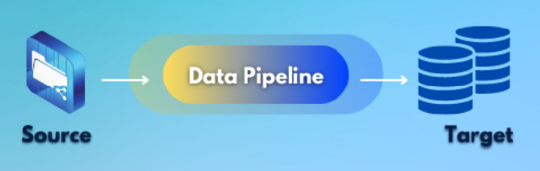

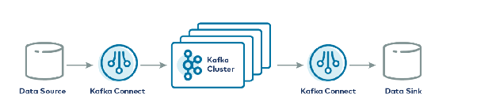

**Data pipeline** là một luồng xử lý dữ liệu tự động hoặc bán tự động. Nó lấy dữ liệu từ một hoặc nhiều nguồn, xử lý/biến đổi dữ liệu đó, rồi đưa kết quả tới một hoặc nhiều nơi nhận.

Trong context Kafka, pipeline thường là **event streaming pipeline**: dữ liệu được ghi nhận dưới dạng các event, lưu vào Kafka topic, sau đó nhiều consumer hoặc connector có thể đọc cùng dòng event đó để xử lý theo mục đích riêng.

Nói đơn giản:

- **Data source**: nơi phát sinh hoặc lưu dữ liệu gốc, ví dụ MySQL, PostgreSQL, MongoDB, log file, API, app backend.
- **Kafka topic**: nơi Kafka lưu dòng event. Topic giống một dòng dữ liệu có tên, ví dụ `order-created`, `payment-succeeded`, `user-clicked-product`.
- **Pipeline processor**: phần xử lý ở giữa, có thể dùng Kafka Streams, Flink, consumer service tự viết, hoặc job xử lý dữ liệu khác.
- **Data sink**: nơi nhận dữ liệu sau xử lý, ví dụ Elasticsearch, Redis, Data Warehouse, S3, dashboard realtime, service khác.
- **Source connector**: connector đọc dữ liệu từ hệ thống ngoài rồi ghi vào Kafka, ví dụ đọc thay đổi từ PostgreSQL vào topic.
- **Sink connector**: connector đọc dữ liệu từ Kafka rồi ghi ra hệ thống ngoài, ví dụ đẩy event từ Kafka sang Elasticsearch hoặc S3.

Ví dụ thực tế trong hệ thống bán hàng:

```text
Order Service
  -> Kafka topic: order-created
  -> Fraud Check Service
  -> Payment Service
  -> Data Warehouse
  -> Realtime Dashboard
```

Khi user đặt hàng, `Order Service` không cần gọi trực tiếp tất cả service còn lại. Nó chỉ publish event `order-created` vào Kafka. Các service khác subscribe event đó và xử lý theo nhu cầu riêng. Cách này giúp hệ thống dễ mở rộng hơn, vì thêm service mới chỉ cần subscribe topic, không phải sửa lại flow chính của `Order Service`.

Pipeline quan trọng vì:

- Giảm thao tác thủ công khi di chuyển/xử lý dữ liệu.
- Tách rời source và sink, giúp hệ thống bớt phụ thuộc trực tiếp vào nhau.
- Kafka có thể đóng vai trò buffer ở giữa, giúp hệ thống chịu tải tốt hơn khi consumer xử lý chậm.
- Dễ scale từng phần: producer, Kafka broker, partition, consumer, connector, storage.
- Có thể replay dữ liệu trong thời gian Kafka còn giữ log, hữu ích khi downstream service lỗi hoặc cần xử lý lại.
- Phù hợp cho logging, analytics, monitoring, CDC, notification, recommendation, fraud detection.

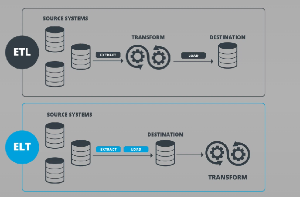

### ETL và ELT

**ETL** là viết tắt của `Extract -> Transform -> Load`.

- **Extract**: lấy dữ liệu từ source.
- **Transform**: xử lý, chuẩn hóa, lọc, join, aggregate dữ liệu.
- **Load**: ghi dữ liệu đã xử lý vào sink.

Ví dụ: lấy order từ MySQL, đổi currency về VND, tính total revenue theo ngày, rồi ghi vào Data Warehouse.

**ELT** là `Extract -> Load -> Transform`. Dữ liệu được đưa thô vào nơi lưu trữ trước, sau đó mới transform bên trong Data Warehouse hoặc Lakehouse. ELT thường hợp với hệ thống analytics lớn, nơi storage/compute đủ mạnh để xử lý dữ liệu sau khi load.

Với Kafka, có thể gặp cả hai kiểu:

- **Streaming ETL**: source connector đưa data vào Kafka, stream processor transform, sink connector ghi data đã xử lý ra ngoài.
- **Streaming ingestion/ELT**: source connector đưa data thô vào Kafka hoặc Data Lake trước, sau đó các job analytics xử lý sau.

### Batch Processing

**Batch Processing** là cách xử lý dữ liệu theo từng lô. Hệ thống gom dữ liệu trong một khoảng thời gian rồi mới chạy job xử lý.

Ví dụ:

- Mỗi đêm tính doanh thu trong ngày.
- Mỗi 30 phút đồng bộ tồn kho từ database sang Elasticsearch.
- Mỗi giờ tổng hợp log để tạo report.

Ưu điểm:

- Dễ triển khai, dễ debug.
- Phù hợp với report, thống kê, backup, data warehouse.
- Có thể xử lý dữ liệu lớn nhưng không yêu cầu realtime.

Nhược điểm:

- Dữ liệu không phải mới nhất tại thời điểm user xem.
- Nếu job chạy lâu hoặc lỗi, dữ liệu bị trễ.
- Có thể phải scan cả dataset, kể cả phần không thay đổi.
- Không hợp với use case cần phản ứng ngay như fraud detection, notification realtime, tracking tài xế.

MapReduce là một mô hình xử lý batch nổi tiếng cho dữ liệu lớn. Tuy nhiên với hệ thống hiện đại, batch job cũng có thể dùng Spark, Flink batch, SQL job trong Data Warehouse, hoặc scheduler như Airflow.

### Stream Processing - Event Driven Architecture

**Stream Processing** là cách xử lý dữ liệu ngay khi dữ liệu vừa xuất hiện dưới dạng event. Thay vì đợi đủ một lô lớn như batch, hệ thống xử lý liên tục.

Ví dụ:

```text
User click product
  -> click event vào Kafka
  -> Recommendation Service cập nhật gợi ý
  -> Analytics Service cập nhật dashboard realtime
  -> Fraud Service kiểm tra hành vi bất thường
```

Đặc điểm quan trọng:

- **Continuous processing**: pipeline chạy liên tục, có event tới là xử lý.
- **Low latency**: độ trễ thấp, thường tính bằng mili giây hoặc dưới vài giây.
- **Event-time processing**: xử lý dựa trên thời điểm event thật sự xảy ra, không chỉ dựa trên thời điểm event đến hệ thống. Điểm này quan trọng khi event đến trễ hoặc đến không đúng thứ tự.
- **Change Data Capture (CDC)**: bắt thay đổi từ database rồi đẩy thành event, ví dụ user update email, order đổi status, product đổi stock.

Use case thực tế:

- Realtime dashboard: số order, doanh thu, active user cập nhật liên tục.
- Notification: gửi email/push notification khi order được tạo hoặc payment thành công.
- Fraud detection: phát hiện giao dịch bất thường ngay lúc nó xảy ra.
- Search indexing: update Elasticsearch khi product/user/order thay đổi.
- Log monitoring: gom log từ nhiều service để alert khi error tăng đột biến.
- Recommendation: cập nhật gợi ý dựa trên hành vi vừa xảy ra của user.

Tư duy chọn nhanh:

- Dữ liệu xử lý theo lịch, không cần realtime: dùng **Batch Processing**.
- Dữ liệu cần phản ứng ngay khi phát sinh: dùng **Stream Processing**.
- Cần tách rời nhiều service và cho nhiều consumer đọc cùng dữ liệu: Kafka rất hợp làm trung tâm event pipeline.

## Kafka Concept

🙂 Apache Kafka là một nền tảng phân phối dữ liệu theo thời gian thực (Real-time Event Streaming Platform).

- **Netflix:** Dùng Kafka để gợi ý phim cho bạn ngay lập tức dựa trên những gì bạn vừa xem.
- **Uber:** Sử dụng Kafka để tính toán lộ trình, giá tiền và vị trí tài xế theo thời gian thực.

🙂 Log-based: Kafka là hệ thống **Log-based** (dựa trên nhật ký dữ liệu), không phải Queue-based truyền thống (như RabbitMQ hay ActiveMQ).

- Trong Kafka, mỗi Topic được chia thành các Partition + Mỗi Partition thực chất là một file log có cấu trúc append-only (chỉ ghi thêm vào cuối).
- Ghi dữ liệu: Khi có tin nhắn mới, Kafka chỉ đơn giản là "dán" nó vào cuối file log, Append-only log, nhanh hơn Random write hàng ngàn lần, thậm chí có khi lại nhanh hơn cả Random write trong RAM.
- Đọc dữ liệu: Consumer giữ một "dấu trang" gọi là Offset (số thứ tự) để biết mình đã đọc đến đâu.
- Hiệu suất cực cao (High Throughput), vì chỉ ghi vào cuối file (Sequential I/O), Kafka tránh được việc phải tìm kiếm vị trí trên đĩa (Disk seek), giúp tốc độ ghi cực nhanh + khả năng "Phát lại" (Replayability), ở hệ thống Queue, tin nhắn thường bị xóa sau khi Consumer nhận xong nhưng ở Kafka, tin nhắn vẫn nằm đó, nếu ứng dụng của bạn bị lỗi, bạn có thể chỉnh Offset quay lại để đọc và xử lý lại dữ liệu từ 2 ngày trước + hỗ trợ nhiều Consumer (Fan-out), nhiều ứng dụng khác nhau có thể đọc cùng một file log tại các vị trí (Offset) khác nhau mà không ảnh hưởng đến nhau + Hệ thống thoát ly hoàn toàn (Decoupling): Producer cứ ghi, Consumer cứ đọc theo tốc độ của riêng mình, nếu Consumer chậm (Slow Consumer), nó không làm nghẽn hệ thống vì dữ liệu đã được lưu an toàn trong file log + khôi phục sau thảm họa (Event Sourcing), nếu database của bạn bị hỏng, bạn có thể chạy lại toàn bộ log từ Kafka để tái thiết lập trạng thái cuối cùng của dữ liệu.
- Tốn tài nguyên lưu trữ, vì không xóa tin nhắn ngay lập tức, bạn cần một dung lượng đĩa lớn hơn để lưu trữ log + độ phức tạp phía Client, consumer phải tự quản lý hoặc phối hợp với Kafka để theo dõi Offset, đòi hỏi logic xử lý phức tạp hơn một chút so với việc chỉ "nhận và quên" như Queue.

## Why Kafka Fast?

- Partition detach: giúp các Partition có thể nằm riêng biệt trên các Broker khác nhau + consume/ produce message 1 cách độc lập với từng Partition → hệ thống sẽ nhanh hơn >< đánh đổi là thứ tự consume message trong các Partition sẽ không đồng đều (nhưng giải pháp dùng message key).
- Compress message: giúp tốc độ truyền message trên network xảy ra nhanh hơn + lúc lưu message trên disk của Broker sẽ tốn ít dung lượng hơn.
- Batch publish: giúp gom các message lại rồi mới truyền đi trong 1 request, nhìn chung lúc send request có vẻ sẽ chậm hơn nhưng hiệu suất tổng thể nhìn chung sẽ nhanh hơn, traffic network cũng tốt hơn.
- In-memory Buffering: các message gửi tới Kafka, nó sẽ nằm trong vùng nhớ này trước, tổng hợp nhiều message rồi flush xuống disk để giảm số lần system call.
- I/O sequence: là quá trình write/ read data từ các block liên tiếp -> tốc độ nhanh hơn nhiều với Random I/O + Data ở concept này thì liên tục, không có fragment nên chỉ cần đọc dọc theo chiều data là sẽ lấy được data tiếp theo → do vậy mà lúc write thì đầu đọc của disk chỉ cần di chuyển 1 lần và write liên tục; data cũng được đọc liên tục trên disk thay vì tìm kiếm ở nhiều block khác nhau)
- No application-level caching: Thay vì tự quản lý bộ nhớ đệm (Cache) trong RAM của ứng dụng (làm tăng gánh nặng cho Garbage Collection trong Java), Kafka tận dụng luôn Page Cache của hệ điều hành.
- Nếu một Consumer đọc dữ liệu vừa mới được ghi, dữ liệu đó chắc chắn vẫn còn nằm trong Page Cache của hệ điều hành, Kafka sẽ lấy trực tiếp từ RAM ra gửi đi mà không cần chạm vào đĩa cứng.
- Việc này giúp Kafka "đứng trên vai khổng lồ" là khả năng quản lý bộ nhớ cực tốt của nhân Kernel (Linux).
- Zero-copy: Kafka sử dụng hàm `sendfile()` của hệ điều hành để thực hiện Zero-copy. Dữ liệu đi thẳng từ Read Buffer sang Socket Buffer, bỏ qua bước sao chép vào bộ nhớ ứng dụng (User Space). Điều này giảm tải CPU và tiết kiệm băng thông bộ nhớ một cách khủng khiếp.

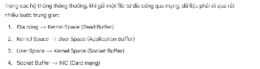

## RabbitMQ vs Kafka

- Model: Push Model (RabbitMQ - Broker đẩy tin): Ngay khi có tin nhắn mới, Broker sẽ chủ động "nhồi" tin nhắn đó xuống Consumer, **Độ trễ cực thấp:** Tin nhắn được chuyển đi ngay lập tức khi vừa đến Broker + **Tiết kiệm tài nguyên Consumer:** Consumer không phải tốn công "hỏi" xem có tin mới hay chưa + **Dễ gây "ngợp" (Overwhelmed):** Nếu Consumer xử lý chậm mà Broker cứ đẩy dồn dập, Consumer có thể bị treo hoặc tràn bộ nhớ. (Để khắc phục, RabbitMQ dùng cơ chế `Quality of Service - QoS` để giới hạn số tin nhắn chưa Ack) >< Pull Model (Kafka - Consumer kéo tin): Consumer tự quyết định khi nào nó sẵn sàng để lấy dữ liệu từ Broker, **Tự chủ về tốc độ (Flow Control):** Consumer xử lý theo khả năng của mình. Nếu hệ thống đang quá tải, nó có thể chậm lại mà không sợ bị Broker ép chết + **Batching (Gộp tin):** Consumer có thể kéo một lúc hàng ngàn tin nhắn để xử lý đồng loạt, giúp tối ưu hóa hiệu suất mạng và I/O + **Độ trễ nhất định:** Nếu Consumer không kiểm tra thường xuyên, tin nhắn sẽ nằm chờ ở Broker lâu hơn một chút.
- Throughput: **RabbitMQ:** Coi Queue là một cấu trúc dữ liệu phức tạp trong bộ nhớ (In-memory). Khi tin nhắn được gửi đi và Ack, nó phải cập nhật trạng thái liên tục. Việc quản lý trạng thái của từng tin nhắn riêng lẻ tốn rất nhiều CPU >< **Kafka:** Sử dụng cơ chế **Sequential Log (Ghi nhật ký tuần tự)**. Dữ liệu chỉ được ghi nối đuôi vào cuối file trên đĩa cứng. Việc ghi tuần tự nhanh hơn rất nhiều so với ghi ngẫu nhiên. Ngoài ra, Kafka dùng kỹ thuật **Zero-copy**, cho phép dữ liệu đi thẳng từ đĩa cứng ra card mạng mà không cần đi qua CPU của ứng dụng + vẫn có độ trễ do phải ghi disk.
- Scalability: RabbitMQ (Dọc - Vertical): Một Queue trong RabbitMQ về cơ bản là đơn luồng (Single-threaded) trên một Node để đảm bảo thứ tự tin nhắn. Nếu bạn muốn xử lý nhiều tin hơn, bạn cần CPU mạnh hơn trên chính Node đó. Việc chia nhỏ một Queue ra nhiều Server rất phức tạp >< Kafka (Ngang - Horizontal) nhờ Partition: Một Topic trong Kafka được chia thành nhiều Partition + Mỗi Partition có thể nằm trên một Server (Broker) khác nhau.
- Persistence: RabbitMQ được thiết kế để chuyển tiếp tin nhắn, không phải để lưu trữ lâu dài, khi tin nhắn đến, nó được đưa vào một cấu trúc hàng đợi (Queue) trong bộ nhớ (RAM). Nếu cấu hình "persistent", nó sẽ được ghi xuống đĩa cứng + Broker phải theo dõi sát sao trạng thái của từng tin nhắn (Đang chờ, Đã gửi, Đã nhận Ack) + Ngay khi Consumer xác nhận đã xử lý xong (`Acknowledgment`), tin nhắn đó sẽ bị xóa hoàn toàn khỏi hàng đợi để giải phóng tài nguyên >< Kafka coi dữ liệu là một chuỗi các sự kiện (Events) không thể thay đổi, được ghi tuần tự vào các file log trên đĩa, tin nhắn (Message) được ghi nối đuôi vào cuối một Partition. Nó không bị xóa đi sau khi Consumer đọc xong + Thay vì Broker phải nhớ Consumer đã đọc đến đâu, chính Consumer sẽ giữ một "dấu trang" gọi là Offset + Dữ liệu được giữ lại dựa trên cấu hình (ví dụ: giữ trong 7 ngày hoặc giữ đến khi đạt 100GB). Sau thời gian đó, Kafka mới tự động xóa các đoạn log cũ → Bạn có thể yêu cầu Consumer đọc lại dữ liệu từ 3 ngày trước nếu gặp sự cố. Điều này là không thể với RabbitMQ + Hiệu suất của Kafka không phụ thuộc vào việc bạn lưu 1GB hay 1TB dữ liệu, vì việc ghi chỉ là ghi nối đuôi (Sequential I/O).
- Routing: là điểm mà RabbitMQ tỏa sáng rực rỡ hơn hẳn so với Kafka.
- RabbitMQ: "Bộ định tuyến" thông minh, Producer không gửi tin nhắn trực tiếp vào Queue. Thay vào đó, nó gửi vào một **Exchange**. Exchange này đóng vai trò như một cảnh sát giao thông, nhìn vào "nhãn" (Routing Key) của tin nhắn để quyết định đẩy nó vào đâu.

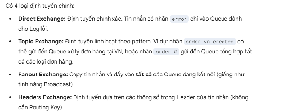

- Apache Kafka: Định tuyến đơn giản (Key-based): Kafka không có khái niệm Exchange. Khả năng định tuyến của nó thô sơ hơn và tập trung vào việc phân chia dữ liệu (Partitioning).

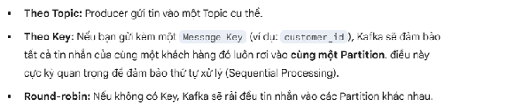

## Broker + Topic + Partitions + Segment + Offset

- 1 Cluster = n Brokers (node)
- 1 Broker = n Partitions
- 1 Topic = n Partitions.
- 1 Partition = n Segments
- 1 Segments = n Offsets

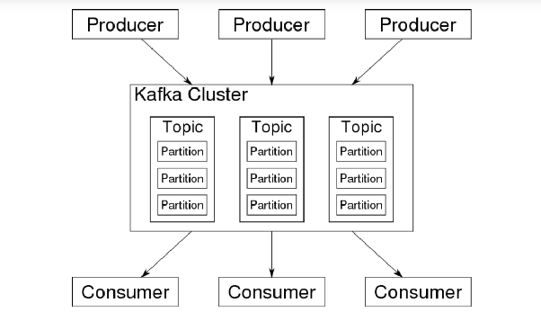

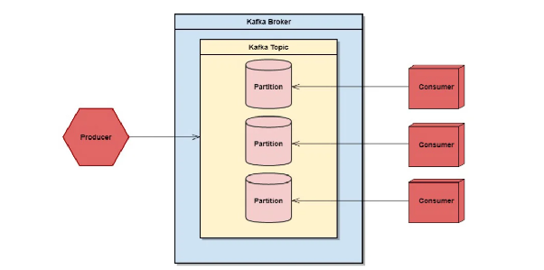

Broker thực chất là một tiến trình (process) chạy trên một máy chủ vật lý hoặc máy chủ ảo, một hệ thống Kafka thường bao gồm nhiều Broker kết hợp lại với nhau để tạo thành một Kafka Cluster + các messages sẽ được lưu trữ trong các Partitions của Broker dưới dạng bytes trong disk của Broker.

- Mỗi Broker trong Cluster sẽ có 1 id giá trị số khác nhau để phân biệt các Broker.
- Mỗi Broker có khả năng lưu trữ nhiều Partition.
- Mặc dù Broker lưu trữ dữ liệu, nhưng nó không theo dõi việc Consumer đã đọc đến đâu (việc này do Consumer hoặc Metadata quản lý), giúp nó giữ được hiệu năng cực cao.
- Chịu trách nhiệm nhận tin nhắn từ Producer, lưu trữ chúng xuống đĩa cứng và trả lại cho Consumer khi được yêu cầu + Quản lý partition, mỗi Topic trong Kafka được chia nhỏ thành các Partition, các Partition này sẽ được phân tán (distributed) đều trên các Broker trong Cluster.
- Trong một cụm (Cluster), sẽ có một Broker được bầu làm Controller. Broker này có quyền lực cao nhất: nó theo dõi trạng thái của các Broker khác, quản lý việc bầu chọn Leader cho các Partition và đảm bảo sự cân bằng trong hệ thống.

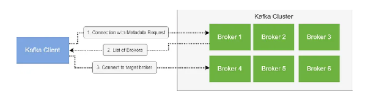

- Kafka có tính năng tốt là khi bất kỳ Producer, Consumer nào mà connect được với 1 Broker trong Cluster thì sẽ biết cách connect tới toàn bộ Cluster này → chỉ cần connect với 1 Broker thì Client sẽ tự động biết cách connect với các Broker khác

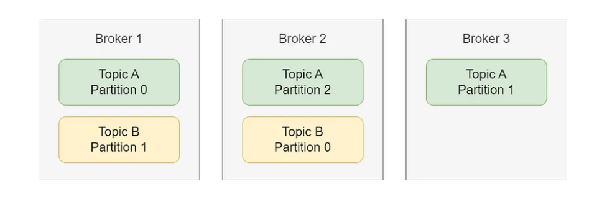

Topic sử dụng để lưu trữ, tổ chức các events, là 1 datastream (đại diện cho luồng dữ liệu giúp duy trì thứ tự message).

- Topic khá giống với database table, các events như là các row trong table này vậy nhưng không có query mà sử dụng thông qua Producer, Consumer + cũng không có constraint.
- Topic có thể handle nhiều loại message type như là: JSON, Avro, text files, binary,...
- Các events có chung mục đích sẽ được đặt trong cùng 1 Topic: giả sử Topic “user” sẽ chỉ có thông tin events của user; Topic “payment” sẽ chỉ có thông tin events của payment thôi
- 1 Topic chứa 1 tập các Partitions (tuy nhiên các Partition này phải chung mục đích của Topic đã phân tách ra chúng) + mỗi Partitions chứa các events và mỗi khi events tới nó sẽ được add vào cuối danh sách của Partition (tức là các events sẽ order theo time)
- Các events sau khi add vào Topic sẽ không thể thay đổi được
- 1 Topic có thể có 0,1,n Consumers read events/ Publishers write events từ Topic đó

=> Scalable vì 1 application server có thể read/ write data từ nhiều Topics khác nhau tại 1 thời điểm + việc ta thêm Topic mới không ảnh hưởng tới các Topic cũ

Partition tức là 1 phần của 1 Topic sau khi nó được chia nhỏ ra + partitions này có thể đặt trên các Brokers riêng biệt trong hệ thống Kafka cluster nhưng nó vẫn chung mục đích với Topic gốc, chỉ là nhân bản ra để xử lý đồng thời → sẽ giảm thời gian handle đi thay vì xử lý các events trên 1 node, việc handle events sẽ diễn ra trên nhiều Brokers/ nodes, làm hệ thống dễ scale hơn, performance cũng sẽ tốt hơn.

- Mặc định thì 1 Topic được tạo mà không chỉ định rõ số lượng Partition thì Topic đó chỉ gồm 1 Partition.
- Partition ra đời để giải quyết hạn chế tính chất của Topic là: 1 Topic chỉ nằm trên 1 Broker/ node nên sẽ làm giảm khả năng scale của cả hệ thống, việc process trên 1 Topic lúc này chỉ xảy ra trên 1 node nên sẽ gây quá tải => nhờ đó mà ta có thể write, read, process trên nhiều node, giúp các process này xảy ra nhanh hơn.
- Thông thường nếu message không có key, các events sẽ được phân phối đều giữa tất cả các Partitions (tức mỗi Partitions sẽ nhận được 1 phần data đồng đều)
- Tuy nhiên giữa nhiều Partition như thế này, chắc chắn không đảm bảo được thứ tự read của Consumer tới toàn bộ Partition + tuy nhiên với 1 Partition thì vẫn luôn đảm bảo thứ tự read.
- Việc xóa Partition là không thể, không ổn do khi được add thì các events đã tới và việc xóa sẽ làm mất events.

Leader Partition tức là trong hệ thống Partition cần được replica, sẽ có 1 Partition làm Leader, nhận mọi request từ Producer và Consumer, sau đó đồng bộ tới các Slave Partition khác.

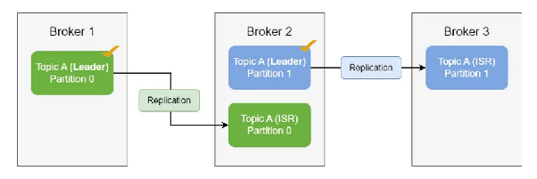

- Tuy nhiên từ Kafka >= 2, có 1 chức năng là Kafka Consumer Replica Fetching cho phép Consumer read được bất kỳ Partition nào, miễn là tốc độ xử lý cao (do là vấn đề địa lý, network).

### Event Key

- Khi có 1 event được send tới Topic, bản thân là nó được append vào một trong các partition của Topic thay vì toàn bộ partition + nếu events same key thì chúng sẽ được bắn tới cùng 1 partition + Kafka cũng đảm bảo rằng Consumer đã subscribe partition nào thì sẽ chỉ đọc được những events ở partition ấy và đọc các events theo đúng thứ tự chúng được write
- Để đảm bảo thêm tính fault-tolerant, mỗi Topic cần replicated để khi có hỏng 1 Topic, vẫn còn những nơi khác xử lý.

### Segment

- 1 Partition có nhiều Segment (được biểu diễn bằng 1 file) + Mặc dù về mặt logic, một Partition là một file log dài vô tận, nhưng thực tế hệ điều hành không thể quản lý một file lớn đến hàng Terabyte một cách hiệu quả. Do đó, Kafka chia nhỏ một Partition thành các Segment.

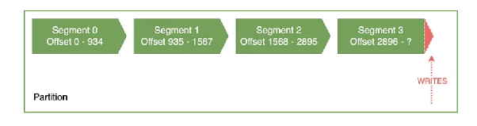

- Segment cuối cùng là Segment đang được hoạt động, hiện đang được ghi vào nên Offset cuối cùng của nó vẫn chưa được xác định
- Ta có thể config size tối đa cho 1 Segment thông qua config log.segment.bytes, và mặc định của nó là 1 Gb + nếu vượt quá 1Gb thì Segment sẽ bị đóng và 1 Segment mới được tạo ra
- Ta có thể config thời gian tạo 1 Segment mới ngay cả khi chưa vượt quá size tối đa của nó thông qua config log.segment.ms + mặc định sẽ là 1 tuần + khi apply thì nó sẽ tính mốc thời gian từ thời gian của offset cuối cùng thuộc Segment để quyết định thời gian clean Segment
- Dựa vào Retention Policy (chính sách lưu trữ), Segment cũ sẽ bị xóa nếu vượt quá thời gian lưu trữ (log retention period) hoặc kích thước lưu trữ tối đa (log retention size)
- Dọn dẹp dữ liệu (Data Retention): Đây là lý do chính. Kafka không xóa từng tin nhắn riêng lẻ vì quá tốn kém hiệu năng. Thay vào đó, nó xóa nguyên một Segment cũ khi Segment đó vượt quá thời gian lưu trữ hoặc kích thước cho phép + Hiệu năng: Làm việc với các file có kích thước vừa phải giúp hệ điều hành quản lý bộ nhớ đệm (Page Cache) tốt hơn và việc tìm kiếm dữ liệu qua Index nhanh hơn + An toàn: Nếu một file log bị hỏng, nó chỉ ảnh hưởng đến một Segment nhỏ thay vì làm hỏng toàn bộ dữ liệu của cả một Partition.

### Offset

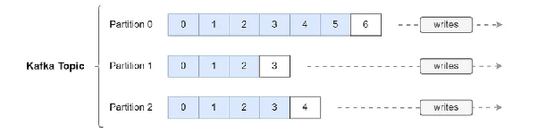

- Mỗi Partition có 1 tập offset riêng + offset không thể thay đổi, luôn giữ giá trị cố định.
- Offset bắt đầu từ 0 với mỗi Partition và tăng dần lên theo số lượng message nạp vào, đại diện cho vị trí của 1 message trong 1 Partition.
- Sử dụng Offset với mục đích chính là giúp Consumer theo dõi vị trí đọc bằng cách đánh dấu Offset đã đọc (vị trí đã đọc rồi) để đảm bảo không tiêu thụ 1 message 2 lần.

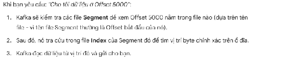

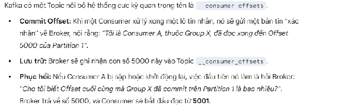

### Event / Message / Record / Data

- Với context của Apache Kafka hay là Event-Driven Architecture thì event nghĩa là có 1 sự thay đổi liên quan tới data và nó sẽ cần các bên khác xử lý khi data này có sự thay đổi = something happened

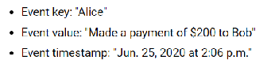

- Event có key, value, timestamp, optional metadata headers
- Các Events trong Kafka không bị xóa sau khi sử dụng + ta có thể config thời gian sống của các events một cách độc lập với từng Topics/ sẽ xóa nếu vượt quá size của Partition + performance của Kafka không ảnh hưởng bởi số lượng events đang có trong Topic nên việc lưu data trong thời gian dài là ổn.

## Producer

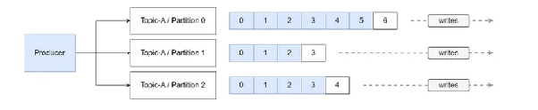

Producer sử dụng để create và publish message tới Topics.

- Message gửi tới Topic được tuần tự hóa + message được gắn với Offset.
- Topic, Partition không quyết định việc nhận messages nào, nó được quyết định bởi Producer (dựa trên các strategy bên dưới).
- Ta có thể dễ dàng thêm/ bỏ 1 Producer mà không ảnh hưởng tới các services khác.

### Producer Message Key

Nói về message trong Kafka, mỗi message sẽ có 3 thành phần chính gồm:

- key: là key của message, thường biểu diễn dạng String
- value: giá trị của message
- partition: partition để message gửi tới, thường biểu diễn dạng số thứ tự của partition.

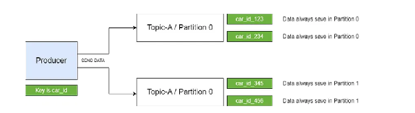

- Key của message có thể null được, nếu null thì sẽ sử dụng Round robin.
- Các message mà same key sẽ được đặt chung vào 1 Partition dựa vào thuật toán hashing đơn giản murmur 2 algorithm: partition = hash(key) % số lượng partition => nếu hashing mà dữ liệu cùng key sẽ luôn nằm trên cùng 1 partition trừ khi số lượng partition thay đổi.

### Kafka Message Serializer

- Tuy nhiên ở Producer, Consumer ta không viết message dạng byte -> ta cần quá trình serialization để giúp convert object sang byte trước khi send tới Kafka + convert sang object khi Consumer nhận message

Ví dụ: Tôi khi send message từ Producer có key-value là 123-helloworld nhưng tất nhiên nó không ở dạng byte trong ngôn ngữ lập trình -> chỉ định Integer Serializer cho key, giúp chuyển 123 sang dạng chuỗi byte + đối với value cũng tương tự vậy

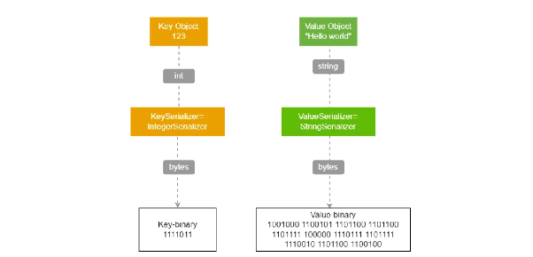

### Producer Partition Strategy

#### Round-Robin Partition Strategy

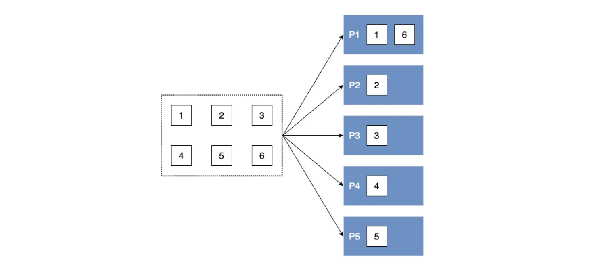

- Round-robin apply với message không có key/ dev lựa chọn rõ ràng strategy này với project + mỗi message sẽ được nạp vào 1 request và send tới 1 Partition cụ thể (1 message/ 1 request)
- Round-robin bỏ qua Hash function bất kể có giá trị key message hay không -> Strategy này phù hợp khi workload hầu hết tập trung vào 1 hash key value của message -> dẫn tới Kafka chỉ work trong 1 Partition duy nhất -> dẫn tới chỉ work trong 1 Consumer duy nhất (trong cùng 1 Consumer Group) + nếu khác group thì lại chỉ work trong các Consumers được assign với Partition đó

#### Default Partition Strategy

- Nếu key null, messages được gửi theo thuật toán Round Robin/ Sticky tùy theo version. (Mặc định với Kafka, từ version <= 2.3, sử dụng Round-robin, và từ version >= 2.4 sử dụng Sticky partition)
- Nếu có key, Kafka sẽ hash key này và dựa vào hash key value này.

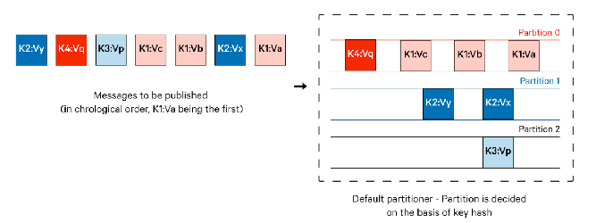

=> Tức là nếu cùng 1 message key, message sẽ nằm trên cùng 1 partition >< nếu số lượng partition thay đổi thì nếu trùng message key với các message mà trước khi bị thay đổi thì có thể bị nằm trên 1 partition khác.

#### Why Sticky Partition Strategy?

- Nếu mà send nhiều messages tới cùng 1 Partitions thì ta có thể sử dụng Batching để send các messages này tới Topic cùng 1 thời điểm + rõ ràng là các Batch mà gửi 1 số lượng messages nhỏ (tức sẽ cần nhiều requests, queue hơn để handle -> sẽ gây latency cao hơn) thì nó sẽ không tối ưu bằng việc Batch gửi 1 số lượng lớn messages.

batch.size tức là số lượng messages/ batch, khi đạt tới giới hạn này, ngay lập tức batching với số lượng messages này tới Topic
linger.ms tức là thời gian batching diễn ra mà không cần lấp đầy batch.size
=> tức là ngay sau khi đạt tới batch.size / linger.ms thời gian đã trôi qua thì sẽ ngay lập tức batching

- Việc sử dụng linger.ms chấp nhận 1 lượng delay khá nhỏ, nhưng lại giúp giảm đáng kể latency của toàn bộ quá trình, tăng thông lượng do vì số lượng request ít hơn
- Mặc định với Kafka, batch.size = 16.384 bytes ; linger.ms = 0ms
- Việc linger.ms = 0 thì không phải là cứ lần nào generate ra message bởi Producer thì sẽ send 1 message đơn lẻ đó ngay lập tức đến Topic mà Producer cần 1 khoảng thời gian n (rất nhỏ) để xử lý và send các messages + trong n thời gian này thì nếu các messages được tạo ra để gửi đến cùng Partition thì chúng sẽ được nhóm vào chung 1 Batch và gửi đi trên 1 request + nhưng việc đặt như thế này thì thông thường Batch sẽ có ít messages do => linger.ms sẽ không ngăn chặn Batching

Sticky partition strategy sẽ giải quyết vấn đề bằng cách đặt ra 1 Batch + sau khi Batch đó lấp đầy bằng các messages thì sẽ Batching nó tới 1 Partition

- Điều này giúp hạn chế tình trạng 1 request 1 message mà sử dụng Batching với số lượng nhỏ messages.
- Trong nhiều lần như vậy thì các Partitions sẽ không đồng đều về số lượng.

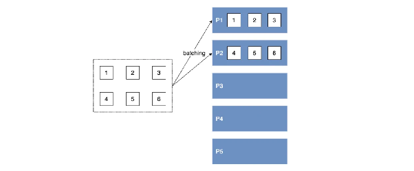

- Sticky partition strategy apply khi key message = null/ dev lựa chọn rõ ràng strategy này với project.
- Nếu message có key, thì ta vẫn phải đảm bảo nó gửi tới đúng Partition, còn không có key thì nó sẽ chọn 1 Sticky Partition + việc pick Partition thường là round-robin giữa các Partition để đảm bảo cân bằng giữa các Partitions
- Sticky khá giống với Round-robin, nhưng ưu điểm của nó là Batching 1 số lượng lớn cho 1 Partition + sau khi Batching xong nó sẽ chọn 1 Sticky Partition khác để Batching turn2 => nó sẽ giảm số lượng request + giảm switch Partition so với Round-robin

### Producer ACK

Producer Acknowledgement tức là 1 sự confirm từ phía Broker là messages đã được send từ Producer tới Broker thành công/ thất bại.

acks = 0 thì ở mode này, thì Producer không chờ Broker gửi ack về, chỉ cần biết là messages đã gửi đi rồi nhưng không biết nó đã thành công/ thất bại + mode này giúp tăng throughput đáng kể nhưng không đảm bảo rằng messages gửi đi có thành công/ mất messages

- 1 case khá phổ biến là Broker offline trước khi nhận được message/ exception sẽ gây mất message


acks = 1 là mode default của Kafka từ v1.0 tới v2.8 + Producer sẽ chờ cho tới khi Broker phản hồi acks + nó sẽ sent luôn ack ngay sau khi write thành công vào Leader Broker, không đợi quá trình replica có thành công hay thất bại -> vẫn có khả năng mất message nhưng có giới hạn.

- Nếu như việc sent message không thành công bị phản hồi thông qua ack, Producer sẽ retry request
- 1 case khá phổ biến là Replica Broker offline/ gây exception thì sẽ gây mất message ở các Replica nhưng vẫn thông báo thành công tới Producer

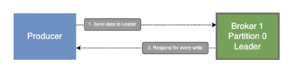

- TH1 Message đã persist xuống Leader Broker + Leader Broker chết trước khi gửi ACK về Producer
- TH1.1 Message đã persist xuống Leader Broker mới + lúc này Producer retry send message cũ này tới Leader Broker mới -> consume 2 lần message này

  (at least once)

- TH1.2 Message chưa persist xuống Leader Broker mới + Producer retry thì message chỉ bị consume 1 lần -> hợp lý
- TH2 ACK trả về Producer thành công trước khi Leader Broker chết + chưa persist xuống các ISR Broker -> Leader Broker mới sẽ không có message này và gây mất message (at most once)

acks = all, ack = -1 là mode default từ v3.0 đổ lên + có level reliability cao nhất + Producer chỉ nhận được ack sau quá trình all in-sync replica (ISR - quá trình đồng bộ message tới toàn bộ replica) + tức là nếu nó ghi vào Leader Broker thành công nhưng đồng bộ xuống các Replica thất bại thì cả quá trình sẽ thất bại + tất nhiên là nó sẽ tăng đáng kể latency do phải network call

- Trước khi gửi về Producer, Broker Leader sẽ xem các ack của các Replica xem có thành công/ thất bại -> send ack về cho Producer
- Ta phải config thêm min.insync.replicas = value (value tức là số lượng Broker đã nhận message thành công, tính cả Leader thì sẽ send ack thành công cho Producer)
- Khá giống với các TH trong acks = 1, nhưng khác chỗ là TH2 luôn success là at least once

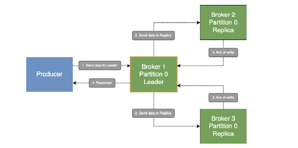

- TH1 Message đã persist xuống Leader Broker cùng các ISR Broker tuy nhiên Leader Broker bỗng nhiên sập -> Producer chưa nhận được ACK -> send lại message dẫn tới duplicate message.

### Idempotent Producer

Idempotent Producer sinh ra để giải quyết vấn đề duplicate message ở phía trên

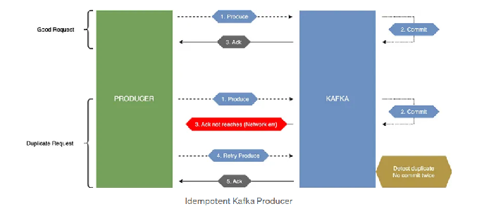

- Từ Kafka 3.0 đổ lên thì mode này đặt là mặc định.
- Mỗi lần send message, nó sẽ gửi kèm message sequence + producer id -> Partition sẽ lưu thông tin này lại -> giả sử truyền ACK lại nhưng Producer không nhận được thì nó send lại message cùng với message sequence + producer id cũ -> Partition nhận ra và không persist lại message này nhưng vẫn gửi ACK trở lại cho Producer để nó ngừng send lại (message sequence này bắt đầu từ 0, và message mới sẽ thêm 1 đơn vị).
- Mỗi lần đồng bộ dữ liệu xuống Slave Partition, cũng sẽ copy giá trị message sequence + producer id để lỡ mà Lead Partition die thì khi nó lên làm Lead vẫn có dấu message này nên cũng không thể duplicate message được.
- Cũng có support transaction trong Kafka Producer, đặt transaction lên 1 method khiến: 1 là message có thể truyền hết đến các Broker hoặc không message nào được truyền tới.

### Producer Retry

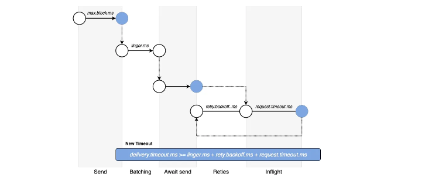

- Dùng retry.backoff.ms (default 100ms) để chỉ định thời lượng tạm dừng trước khi retry
- request.timeout.ms (default 30s) để chỉ định thời gian chờ tối đa phản hồi từ Broker sau khi Producer request message.
- delivery.timeout.ms (default 2p) để chỉ định thời gian chờ tối đa cho 1 message được gửi thành công (bao gồm thời gian từ khi gửi request đầu tiên, tính cả time retry)

### High Load Producer

Bandwidth tức băng thông - là số lượng data có thể truyền tải trong 1s (Mbps/s) - là tốc độ tối đa mà data có thể truyền qua mạng
ThroughPut tức thông lượng - là lượng data thực tế được truyền qua hệ thống trong 1 khoảng thời gian nhất định + Bandwidth > ThroughPut do ThroughPut là thực tế, chịu ảnh hưởng bởi các yếu tố: nhiễu, tắc mạng,...

High Load Producer tức tại 1 thời điểm, quá nhiều events phải truyền qua mạng để gửi tới Broker + Broker/ Producer không thể handle được nhiều events như vậy tại 1 thời điểm (là do config batch nên có nhiều message chưa được gửi đi)

- Ta có thể lưu các events này trên RAM của Producer + ta có thể cài đặt thông qua buffer.memory (default 32Mb) để config kích thước mặc định RAM dùng để lưu tạm thời các events trước khi send chúng tới Broker giúp hệ thống mượt hơn ngay cả tại thời điểm nhu cầu cao
- Tuy nhiên khi vượt quá dung lượng cho phép thì dẫn tới tình trạng tắc nghẽn + ta sẽ thiết lập max.block.ms, khi mà quá dung lượng RAM config kia mà send thêm messages, thay vì trả về exception luôn thì quá trình send messages này phải đợi 1 khoảng thời gian max.block.ms + nếu RAM config vẫn đầy sau khoảng thời gian này thì sẽ trả về exception

### Producer Compression

Producer Message Compression tức trước khi send message tới Broker, Producer sẽ compress message để giảm size cho message, đặc biệt là khi Batching 1 tập messages lớn làm cho tốc độ truyền message lên Broker sẽ nhanh hơn + cần ít dung lượng để lưu message trên Broker (giảm tới 4 lần)

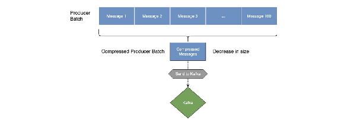

- compression.type sử dụng để config type compress cho Producer với các định dạng như none (default), lz4, gzip, snappy, zstd
- Tuy nhiên nó lại yêu cầu nhiều hơn CPU cho các phép tính toán compress trước khi send message.

## Consumer

Consumer sử dụng để consume message từ Topic

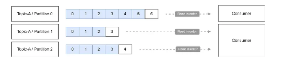

- Consumer sử dụng pull model, tức là Consumer chủ động request message từ Kafka Broker và nhận messages từ response thay vì Kafka Broker send message tới các Broker + nếu có message thì trả về luôn + nếu không có message thì chờ trong 1 khoảng thời gian cấu hình rồi mới phản hồi.
- Việc read data từ Partition theo thứ tự Offset tăng dần

Consumer Deserializer cũng tương tự như Producer Serializer nhưng khác ở chỗ là lúc nhận byte thì chuyển sang dạng object để Consumer có thể work được

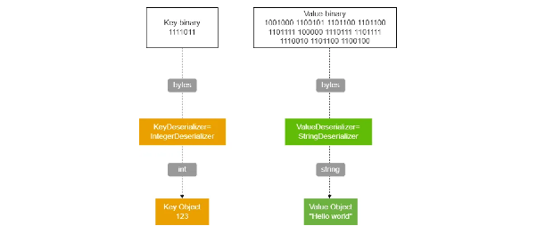

Consumer Group tức là 1 tập các Consumer đều read events từ cùng 1 Topic có nhiều partition tuy nhiên 1 message chỉ được tiêu thụ bởi 1 Consumer.

- Kafka sử dụng property group.id để đặt tên cho Consumer Group

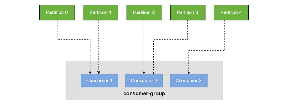

- Nếu >= 2 Consumers cùng subscribe same Topic và cùng same Consumer Group thì chúng sẽ chia ra để xử lí các events của Topic đó mà không consumer trùng events với nhau -> ngoài partition ra thì Consumer Group là một cách để scale, performance cũng sẽ tốt hơn
- Nếu ta không sử dụng Consumer Group, thì với mỗi Consumer đều phải consume mọi message từ Topic -> các Consumer này sẽ consume message giống nhau.
- Consumer Group sẽ chia các Consumer tới để tiêu thụ với các Partitions riêng biệt (đây chính là lý do mà các events không thể trùng trong 1 Consumer group)

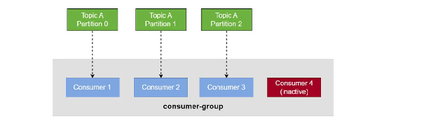

- Nếu mà số lượng Consumer trong cùng 1 Consumer Group > số lượng Partitions của 1 Topic thì sẽ có Consumer rảnh

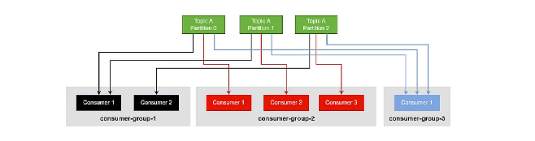

- Cho phép nhiều Consumer Groups focus vào chung Partition (bởi các Consumer Groups khác nhau có thể subscribe cùng 1 Topic)

Consumer Offset sử dụng để tracking messages nào được xử lý thành công gần nhất trong 1 Consumer Group dựa trên \_\_consumer\_offsets Topic

- Hầu hết các Consumer đều tự động commit offset theo định kỳ thay vì mỗi message được consume thành công để đảm bảo performance + Kafka Broker chịu trách nhiệm đảm bảo ghi vào \_\_consumer\_offsets Topic

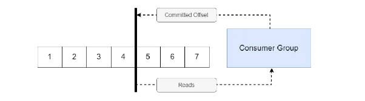

- Consumer Offset là quan trọng vì giả sử các Consumer bị crash và restart/ 1 Consumer mới được thêm vào Group thì chúng sẽ consume từ latest commit offset thay vì consume toàn bộ message trong Partition từ offset 0
- Theo mặc định, Java sẽ tự động commit các Consumer Offset được kiểm soát bởi property enable.auto.commit=true sau mỗi auto.commit.interval.ms (mặc định là 5s) khi poll() được gọi

### Consumer Offset Commit Strategy

Commit Offset có nghĩa là quá trình ghi lại offset (= message id) cuối cùng đã đọc để giúp Consumer biết vị trí đọc message tiếp theo + khi Consumer mới đọc Partition này thì nó sẽ biết vị trí đọc của message thay vì đọc lại từ đầu.

- nên nhớ rằng poll() được message thì phải xử lý xong trước đã, rồi mới poll() lần tiếp theo.

Auto Offset Commit tức cơ chế tự động commit offset sau khi poll message về.

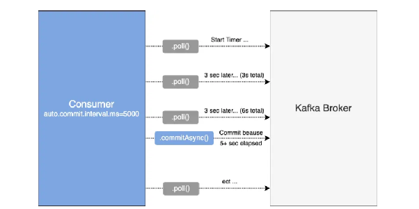

- Sử dụng enable.auto.commit=true thì sau mỗi khi poll được message, sau khoảng thời gian auto.commit.interval.ms thì Consumer sẽ gửi request tới Partition để tự động commit offset đã consume với offset có giá trị cao nhất. (Commit không tự thực hiện bởi dev, mà thực hiện tự động bởi Consumer ở chế độ background -> low latency)
- Nhưng trường hợp mà Consumer commit nhưng thực sự chưa xử lý xong message đó, Consumer offline + Consumer chưa commit và message đã xử lý xong, Consumer offline -> sẽ gây mất message/ duplicate message.
- Phù hợp với các dữ liệu ít quan trọng như log, monitoring hoặc giảm thời gian autocommit đi.

Sync Commit tức manual commit bởi dev, sử dụng blocking

- Do sử dụng Blocking nên thread executive message sẽ bị Block tới khi nhận được ACK từ Broker để báo commit thành công
- Blocking sẽ tốn performance
- Tuy nhiên đây là phương pháp đáng tin cậy nhất, phù hợp khi sử dụng với financial transactions/ các processing quan trọng

Async Commit cũng là manual commit bởi dev, nhưng sử dụng non-blocking

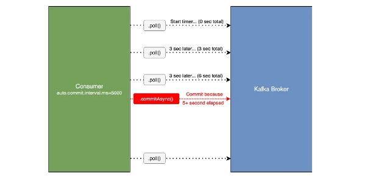

- Do sử dụng Non-blocking nên thread executive message sẽ không bị Block do không đợi ACK từ Broker để báo commit thành công
- Non-blocking nhanh do không phải đợi ACK, performance ổn hơn với Sync
- Tuy nhiên nó cũng gặp nhiều rủi ro như khi exe thành công ở Consumer nhưng Broker offline, do Non-blocking nên nó cũng sẽ không biết ACK thành công/ thất bại -> messages có thể bị duplicate

### Partition Rebalancing

Partition Rebalancing là quá trình phân phối lại quyền sở hữu các Partitions giữa các Consumer trong cùng một Consumer Group.

- Rebalancing được kích hoạt bởi Group Coordinator (một broker đóng vai trò quản lý group) khi có sự thay đổi về trạng thái của Group: Một Consumer mới startup và tham gia vào Group + Một Consumer bị crash, shutdown, hoặc không gửi heartbeat đúng hạn (session timeout) + Thêm Partition mới vào Topic hoặc Consumer thay đổi danh sách Topic đăng ký (regex subscription) + Consumer mất quá nhiều thời gian để xử lý bản ghi giữa các lần gọi `.poll()`, dẫn đến `max.poll.interval.ms` bị quá hạn.
- Sử dụng partition.assignment.strategy để cấu hình chiến lược phân vùng lại.

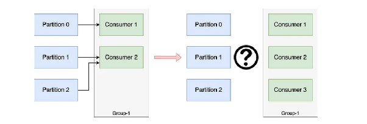

Eager Rebalance tức là nếu mà Consumers được add vào Consumer Group thì tất cả các Consumers trong Consumer Group cần assigned lại với Partitions nào

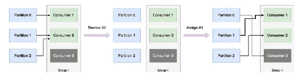

- Stop the world là drawback lớn nhất của nó là trong lúc nó assigned lại như vậy, Kafka sẽ ngừng hoạt động trong lúc assigned này + quá trình assigned diễn ra thường xuyên sẽ có tác động tiêu cực tới hệ thống + nếu như việc assigned với số lượng Partitions quá lớn sẽ gây dừng lại Server trong 1 thời gian khá dài để assigned.
- Sử dụng chiến lược tái cân bằng: Ranger Assignor (default), Round Robin, Sticky Assignor, Cooperative Sticky Assignor (tối ưu nhất).

Cooperative Rebalance (Incremental Rebalance, Kafka 2.4+) không giống như strategy trước mà chỉ assigned lại các Partitions thuộc 1 Consumer cũ sang Consumer mới này.

- Ưu điểm của strategy này là tránh được Stop the world tuy nhiên vẫn sẽ làm dừng lại Partition được assigned này.

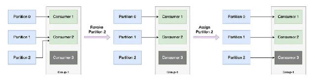

Trong Kafka truyền thống (kafka 2.3-), mỗi khi một Consumer khởi động lại, nó được coi là một "thành viên mới" hoàn toàn. Điều này kích hoạt một đợt Rebalancing ngay lập tức >< Static Group Membership sinh ra để hạn chế tối đa sự rebalance do Consumer chỉ bị lỗi tạm thời trong khoảng thời gian ngắn và có thể restart để sử dụng lại ngay.

- Thông thường nếu 1 Consumer không phải là 1 Static Group Membership, khi tham gia 1 Consumer Group nó sẽ nhận được 1 member id do Kafka cấp phát + nếu rời Consumer Group nhưng tham gia lại thì nó sẽ nhận được 1 member id mới và yêu cầu rebalancing lại.
- Hiểu đơn giản: Đây là tính năng cho phép một Consumer giữ nguyên "danh tính" của mình kể cả sau khi shutdown và restart, giúp Group Coordinator nhận diện được "người cũ" và **không kích hoạt Rebalance**.
- Static Group Membership giúp duy trì member id, giúp Kafka nhận diện Consumer ngay cả khi khởi động lại và tiếp tục consume partitions cũ, tránh tình trạng rebalancing không cần thiết + member id này phải là duy nhất trong 1 Group nếu không sẽ báo lỗi + thấy có thể tự định nghĩa member id qua group.instance.id

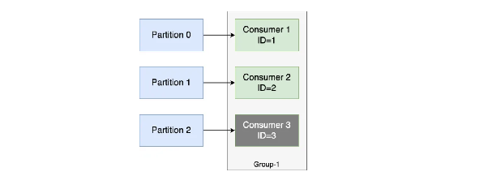

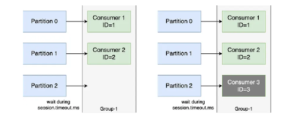

- Nếu không sử dụng Static Group Membership thì khi offline xong tái online thì phải trải qua 2 lần Partition Rebalancing + việc này cũng làm cho hệ thống dừng hoạt động một phần trong 1 khoảng thời gian + việc restart lại Consumer này khiến nó lấy 1 Member Id mới trong Group Consumer + new Partitions assigned.
- Mỗi Consumer ta sẽ gán 1 group.instance.id + nếu Consumer bị offline và restart trước 1 khoảng thời gian session.timeout.ms thì Consumer sẽ không được coi là offline -> rebalancing sẽ không xảy ra.
- Tuy nhiên ta phải chấp nhận rằng việc các Partitions đang được gán cho Consumer vừa bị offline đó không được consume do Consumer Group không nhận ra rằng 1 Consumer vừa offline và phải gán các Partitions của nó cho Consumer mới -> các events sẽ cứ nằm ở đó không được consume cho tới khi vượt quá session.timeout.ms để rebalancing hoặc đợi Consumer này restart được.

### Consumer Offset Reset Config

- Bằng cách lưu trữ last offset success commit thì mỗi khi first read/ create/ restart/ rebalance/ offline 1 khoảng thời gian dài, message bị clean mất do retention policy,... với Consumer thì sẽ giúp Consumer biết để read message tiếp theo từ vị trí nào
- Mỗi Partitions sẽ có 1 offset riêng để dễ dàng tracking

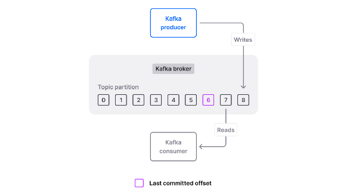

auto.offset.reset.earliest tức nếu không tìm thấy last commit offset, sẽ read từ message đầu tiên của Partition đó

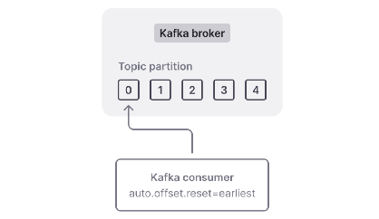

- Config này phù hợp với việc muốn lấy data từ đầu của Partition + vừa tạo
- Sử dụng config này -> cần retention lâu hơn để đảm bảo data có sẵn từ lúc đầu khi cần -> đòi hỏi dung lượng disk cao hơn
- Việc read từ đầu của 1 Partitions có quá nhiều messages sẽ gây ra quá tải cho Consumer -> giảm hiệu suất
- Ngoài ra còn có thể khiến các messages xử lý nhiều lần -> cần consider khi dùng

auto.offset.reset.latest tức nếu không tìm thấy last commit offset, sẽ read từ các message sau message cuối cùng hiện có trong Partition (default) - tức thay vì read từ các message đã có, ta sẽ read các message từ thời điểm Consumer này bắt đầu subscribe với Partitions này

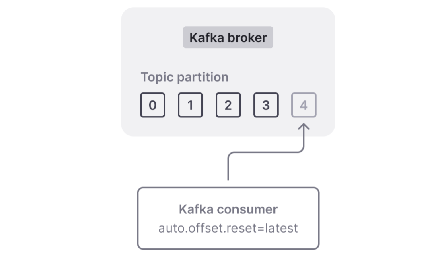

- Config này tốt khi chỉ quan tâm tới các messages mới được tạo, không cần xử lí lịch sử
- Config này cần thêm thời gian config cho retention policy để cấp thêm thời gian, tránh xóa \_\_consumer\_offsets trước khi Consumer restart (bản thân consumer\_offsets cũng nằm trong phạm vi quản lý của retention policy)

auto.offset.reset.none tức nếu không tìm thấy last commit offset, sẽ throw exception

### Consumer Internal Thread

Consumer Group Coordinator là 1 thành phần nằm trong Group Consumer (1 Group Consumer sẽ có 1 Coordinator) với chức năng chính là kiểm tra trạng thái của các Consumer xem chúng có đang hoạt động hay không.

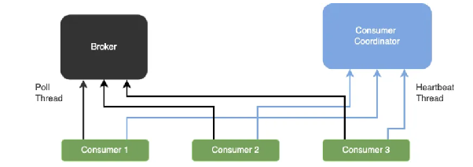

Heartbeat mechanism tức Consumer sẽ định kỳ gửi 1 signal tới để xác nhận rằng nó đang còn sống.

- heartbeat.interval.ms (default 3s) tức khoảng thời gian định kỳ gửi heartbeat. (truyền thống thì đặt = ⅓ session.timeout.ms)
- session.timeout.ms (default 45s cho Kafka >= 3.0, trước là 10s) tức khoảng thời gian mà không nhận được heartbeat sẽ coi Consumer die.

Pool mechanism tức sẽ nhận ra do Consumer poll() tới để lấy message.

- max.poll.interval.ms (default 5p) là khoảng thời gian giữa 2 lần poll() lớn hơn giá trị này thì sẽ coi như Consumer die. (quan trọng trong khuôn khổ dữ liệu lớn như Spark, nơi xử lý dữ liệu có thể tốn thời gian >< nếu ứng dụng nhanh thì có thể cài thời gian thấp đi)
- max.poll.records (default 500) xác định số lượng message tối đa được lấy trong 1 poll()

Chưa đọc: [https://medium.com/apache-kafka-from-zero-to-hero/apache-kafka-guide-39-consumer-replica-fetch-and-rack-awareness-setup-c86004d4ab80](https://medium.com/apache-kafka-from-zero-to-hero/apache-kafka-guide-39-consumer-replica-fetch-and-rack-awareness-setup-c86004d4ab80)

## Kafka Delivery Semantics

### Producer Delivery

At most once là semantic mà message chỉ được async send đi tối đa 1 lần bởi Producer, không bao giờ có chuyện lặp lại message.

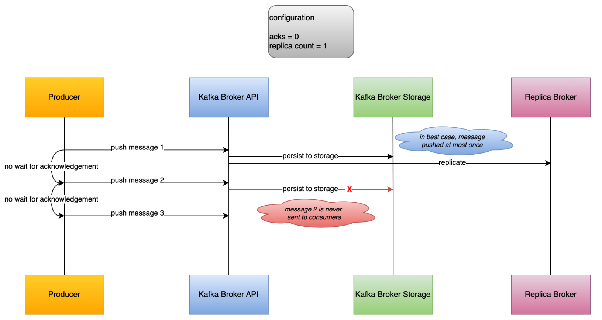

- Kafka sử dụng At most once làm default + config acks = 0
- Fire and forget không cần kiểm tra xem có nhận được Ack từ Broker hay không/ nếu nhận được cũng sẽ không kiểm tra xem Ack là thành công hay không
- Sử dụng khi chấp nhận việc mất 1 message sẽ không ảnh hưởng tới hệ thống làm việc (như metric collections lock, logging,...)
- Việc sử dụng gửi đi không check Ack sẽ làm tăng throughput, giảm latency

At least once là semantic mà message được gửi đi >= 1 lần và message sẽ không bao giờ bị mất + có thể bị lặp lại message.

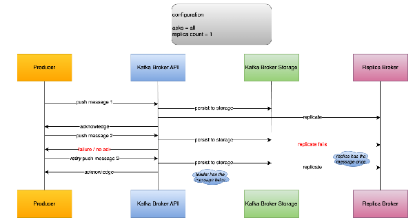

- Producer gửi tin nhắn và chờ xác nhận (ACK). Nếu không nhận được ACK, nó sẽ gửi lại cho đến khi thành công. Nếu lỗi mạng xảy ra sau khi Broker đã lưu tin nhưng chưa kịp gửi ACK, tin nhắn sẽ bị trùng.
- Chế độ phổ biến nhất, config acks = all

Exactly once là semantic mà message được sử dụng 1 lần mặc dù nó được gửi nhiều lần

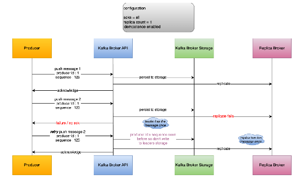

- enable.idempotent = true thì tự động attach producer\_id vào mỗi message từ Producer để tránh duplicate message
- config acks = all

### Consumer Delivery

At most once: trong chế độ này, Consumer có thể làm mất dữ liệu nhưng không bao giờ xử lý trùng.

- Consumer nhận tin nhắn → Commit offset ngay lập tức → Sau đó mới bắt đầu xử lý logic (save DB, tính toán...).
- Nếu sau khi commit offset mà ứng dụng bị crash trước khi kịp xử lý xong dữ liệu, thì khi khởi động lại, Consumer sẽ đọc từ vị trí offset mới và bỏ qua tin nhắn cũ chưa xử lý xong.
- Config enable.auto.commit = true (auto.commit.interval đặt ở giá trị rất thấp để commit liên tục).

At least once Đây là chế độ mặc định và an toàn nhất cho hầu hết ứng dụng. Dữ liệu có thể bị xử lý lại nhưng không bị mất.

- Consumer nhận tin nhắn → Xử lý logic xong xuôi → Tiến hành commit offset.
- Tắt tự động commit, finally sẽ commit.

## Kafka Replica

Kafka Replica chính là "xương sống" giúp Kafka trở thành hệ thống chịu lỗi (fault-tolerant) cực kỳ mạnh mẽ mà các ông lớn công nghệ tin dùng.

- Hãy tưởng tượng Kafka Replica giống như việc bạn có nhiều bản sao của một cuốn sổ ghi chép quan trọng đặt ở các tòa nhà khác nhau; nếu một tòa nhà cháy, bạn vẫn còn bản sao ở chỗ khác để tiếp tục công việc.
- Trong Kafka, dữ liệu được chia thành các **Partition**. Mỗi Partition sẽ có nhiều bản sao (Replica) nằm trên các Broker khác nhau.
- Mất dữ liệu (Data Loss): Nếu một Broker hỏng ổ cứng, dữ liệu vẫn còn ở các Broker khác + Ngừng hoạt động (Downtime): Nếu Broker chứa Leader bị sập, Kafka sẽ tự động bầu một Follower trong ISR lên làm Leader mới ngay lập tức. Hệ thống gần như không bị gián đoạn.
- Replication là sự đánh đổi giữa Hiệu suất và Sự an toàn. Nếu bạn cần tốc độ bàn thờ và dữ liệu có mất một chút cũng không sao, bạn có thể giảm số lượng Replica. Nhưng với đa số hệ thống sản xuất (Production), con số `replication-factor = 3` là "tỉ lệ vàng".

Replica Factor là hệ số replica, cho biết số lượng bản sao (tính cả bản gốc) của Partition

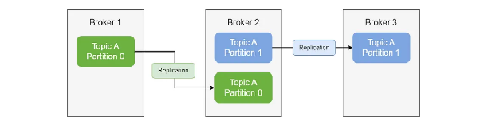

- Ở các example local, replica factor là 1 do chỉ có 1 triển khai duy nhất của Partition; tuy nhiên trên thực tế thì Kafka work trên 1 Cluster và replica factor sẽ >= 1, thường là 2, 3 và often sẽ là 3
- Việc sử dụng Replica trong Kafka để đảm bảo rằng khi 1 Broker bị offline thì các Broker khác vẫn còn tồn tại để operation hệ thống

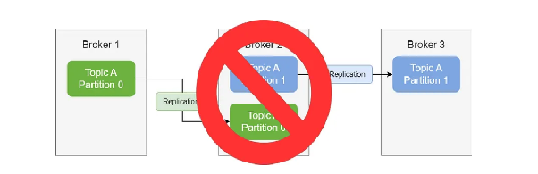

- Ở example bên trên có replica factor = 2 tức là sẽ có 1 bản sao cho tất cả các Partitions trong hệ thống, giả sử như Broker2 bị offline thì ta vẫn có thể operation vì vẫn đủ số lượng Partitions (do replica factor = 2, việc mất đi 1 Broker: 2-1 = 1 > 0 thì hệ thống vẫn work bình thường)
- Lúc này thì TopicA Partition1 sẽ trở thành Partition Leader mới do Leader cũ đã bị offline

Partition Leader là bản sao "đội trưởng". Mọi thao tác đọc (Read) và ghi (Write) từ phía Client mặc định đều đi qua Leader.

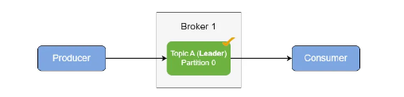


- 1 Partition cụ thể chỉ có 1 Partition Leader

Partition Follower là các bản sao "thực tập sinh". Chúng không phục vụ Client mà chỉ có nhiệm vụ duy nhất: Copy dữ liệu từ Leader để giữ mình luôn cập nhật.

- In-sync replica (ISR) là nhóm các Follower đang đuổi kịp Leader một cách sát sao. Nếu một Follower bị chậm hoặc chết, nó sẽ bị đá ra khỏi ISR.

## Log Retention + Cleanup Policy

Log còn gọi là nơi lưu trữ message trong các Partition, mỗi khi message tới thì sẽ được ghi vào cuối file mà không cần sửa đổi nội dung trước đó (append-log only).

- Kafka lưu trữ các message/ log này trên disk nên sẽ tăng đáng kể lưu lượng nên cần phải dọn dẹp.

Kafka Retention Policy  là 1 chính sách sử dụng để quyết định thời gian, kích thước tối đa cho phép để message tồn tại trong 1 Partition.

- Sử dụng khi muốn tối ưu hóa bộ nhớ Kafka để tránh chiếm nhiều dung lượng.
- Nhược điểm là nếu trong từng đó thời gian/ dung lượng mà message chưa được tiêu thụ thì vẫn sẽ mất message.
- Time based Retention tức khi đạt tới thời gian nhất định (default 7 days) thì những Segments được lưu trữ vượt quá thời gian này sẽ bị Delete/ Compact


- Size based Retention tức khi đạt tới kích thước nhất định của toàn bộ log của 1 Partition thì sẽ loại bỏ bớt Segments theo Delete/ Compact


Kafka Cleanup Policy tức chính sách mà Kafka sử dụng để xử lý message cũ trong 1 Partition, nó ảnh hưởng trực tiếp tới Kafka Retention Policy giúp kiểm soát việc xóa, giữ lại dữ liệu.

- Delete Policy (default) tức các message cũ sẽ bị xóa đi hoàn toàn khi đạt tới ngưỡng được cấu hình trong Kafka Retention Policy (thường phù hợp khi sử dụng Logging)
- Compact Policy tức sẽ xóa các message cũ đi nếu các message mới trùng với key của logs cũ + đẩy thứ tự message xuống cuối cùng của list message (tức coi như nó sẽ được tiêu thụ cuối cùng)   (thường phù hợp với trạng thái mới nhất của message mà không quan tâm tới lịch sử: Cache, CDC)


## Kafka Resolve Problem

Kafka xử lý 1 triệu message/ s: cần có chiến lược tối ưu toàn diện từ hạ tầng, producer, broker cho tới consumer:

### Tối ưu Kiến Trúc

- Mở rộng ngang (Horizontal Scaling): Để xử lý 1 triệu messages/ s, bạn sẽ cần một cụm (cluster) nhiều broker vì không một máy chủ đơn lẻ nào có thể gánh nổi khối lượng công việc này + số lượng broker cụ thể phụ thuộc vào nhiều yếu tố (kích thước message, nhân bản, ...), nhưng việc thiết kế hệ thống để có thể thêm broker một cách dễ dàng là yêu cầu tiên quyết.
- Partitions - Đơn vị của song song (Parallelism): Số lượng partition trong topic là yếu tố quyết định mức độ xử lý song song. Bạn cần đủ partitions để phân tán dữ liệu đều trên tất cả các broker, và cũng đủ để nhiều consumer có thể đọc cùng lúc. Một rule of thumb cho 1 triệu messages/s là bắt đầu với 50-100 partitions cho topic của bạn . Hãy nhớ rằng, đây là con số khởi điểm và cần được điều chỉnh dựa trên thực tế.

### Tối ưu Hạ Tầng

- Lưu trữ: Sử dụng SSD hoặc NVMe là bắt buộc để đảm bảo tốc độ đọc/ghi I/O, giảm độ trễ và tăng thông lượng. Hệ thống tệp XFS được khuyến nghị cho Kafka
- Kafka được quảng cáo là sử dụng đĩa cứng (HDD) rất hiệu quả nhờ cơ chế đọc/ghi tuần tự (sequential I/O). Tuy nhiên, khi bước vào mức hiệu năng cực cao như 1 triệu message/giây, những hạn chế cố hữu của HDD bộc lộ rõ.
- HDD: Cần thời gian để quay đĩa và di chuyển đầu đọc (seek time) ~ 5-10ms. Dù Kafka chủ yếu ghi tuần tự (append), giảm thiểu seek, nhưng các hoạt động nền như làm sạch log (log compaction), đồng bộ bộ nhớ đệm xuống đĩa (flush), hay đọc dữ liệu từ các phân đoạn cũ (nếu consumer bị tụt hậu) vẫn có thể gây ra các thao tác tìm kiếm ngẫu nhiên. Ở tần suất 1 triệu messages/s, chỉ cần một vài thao tác tìm kiếm chậm cũng đủ tạo ra độ trễ lớn và làm giảm thông lượng tổng thể.
- HDD: IOPS rất thấp, thường chỉ vài trăm. Khi có nhiều producer ghi vào các partition khác nhau, hoặc nhiều consumer đọc từ nhiều partition, hệ thống phải xử lý song song nhiều luồng I/O. HDD sẽ nhanh chóng bị quá tải.
- HDD: Băng thông tuần tự có thể đạt 150-200 MB/s.
- SSD/NVMe: Không có bộ phận chuyển động cơ học. Thời gian truy cập dữ liệu gần như tức thời và nhất quán cho cả đọc/ghi tuần tự lẫn ngẫu nhiên (thường dưới 0.1ms). Điều này đảm bảo độ trễ cực thấp và ổn định, một yếu tố sống còn cho hệ thống thời gian thực.
- SSD/NVMe: IOPS cực kỳ cao. Một ổ NVMe hiện đại có thể đạt hàng trăm ngàn, thậm chí hàng triệu IOPS. Điều này cho phép Kafka xử lý một cách thoải mái hàng ngàn kết nối producer/consumer đồng thời, mỗi kết nối thực hiện các thao tác đọc/ghi nhỏ lẻ.
- NVMe: Băng thông có thể lên tới 3000-7000 MB/s hoặc hơn. Với kích thước message trung bình 1KB, 1 triệu message tương đương với ~1GB dữ liệu. Bạn cần băng thông ghi lớn để producer ghi nhanh, và cũng cần băng thông đọc lớn để consumer đọc kịp (đặc biệt trong các tình huống bù dữ liệu hoặc nhiều consumer group đọc cùng lúc)
- Với 1 triệu messages/s, luồng dữ liệu đổ vào và đọc ra là cực kỳ lớn. HDD không thể đáp ứng được cả về tốc độ (IOPS) lẫn băng thông cần thiết, gây ra tắc nghẽn I/O, làm chậm toàn bộ hệ thống. SSD, đặc biệt là NVMe, là lựa chọn duy nhất để có đủ hiệu năng I/O cho khối lượng công việc này.
- Mạng: Băng thông mạng thường là nút thắt cổ chai đầu tiên. Hãy trang bị card mạng tốc độ cao (10GbE hoặc cao hơn). Việc Kafka 0.10 thêm 8 byte timestamp cho mỗi message đã từng làm bão hòa mạng và giảm 33% thông lượng trong một bài kiểm tra, cho thấy tầm quan trọng của việc dự phòng băng thông .
- Chúng ta đang nói về việc xử lý 1 triệu message/giây, thì Card mạng (Network Interface Card - NIC) chính là "cánh cửa" duy nhất để dữ liệu đi vào và đi ra khỏi máy chủ Kafka. Nếu "cánh cửa" này quá nhỏ, dù bên trong máy có CPU mạnh, SSD nhanh đến đâu, dữ liệu cũng không thể chui qua kịp, gây ra tắc nghẽn.
- Nói một cách đơn giản, Card mạng là phần cứng kết nối máy tính của bạn với mạng. Nó là cầu nối giao tiếp, chuyển đổi dữ liệu từ dạng byte trong máy tính thành tín hiệu để truyền qua cáp mạng (hoặc ngược lại) + Băng thông của card mạng (tính bằng Gbps - Gigabit trên giây) quyết định lượng dữ liệu tối đa có thể truyền qua mỗi giây + giảm CPU.
- CPU & RAM: CPU đa nhân giúp xử lý các tác vụ đồng thời . RAM đủ lớn giúp giảm tải I/O đĩa nhờ cơ chế page cache của Kafka.

### Tinh Chỉnh Producer

- Batching và Nén (Batching & Compression): Đây là hai kỹ thuật quan trọng nhất.
- Tăng batch.size (mặc định 16KB) lên 128KB hoặc lớn hơn để cho phép gộp nhiều message hơn trong một lần gửi, giảm số lượng request mạng .
- Tăng linger.ms (mặc định 0) lên một giá trị nhỏ như 10ms để producer chờ thêm một chút, giúp lấp đầy batch dù không vội, cân bằng giữa thông lượng và độ trễ.
- Bật nén với compression.type là lz4 hoặc zstd. Việc này giảm kích thước dữ liệu truyền tải, tiết kiệm băng thông, tiết kiệm không gian lưu trữ và tăng thông lượng hiệu dụng.
- Xử lý 1m message/ s thì tài nguyên mạng và đĩa thường là nút thắt cổ chai đầu tiên và dễ bão hòa nhất, chứ không phải CPU → đánh đổi việc nén tốn CPU nhưng lại khiến băng thông tổng thể của mạng tốt hơn.
- Tốc độ CPU vs. Tốc độ mạng/đĩa: CPU có thể nén và giải nén dữ liệu với tốc độ cực kỳ nhanh (hàng GB/s). Trong khi đó, băng thông mạng (dù là 10GbE) và tốc độ ghi đĩa có giới hạn cứng. Việc hy sinh một chút CPU để giảm tải cho mạng và đĩa là một sự đánh đổi có lợi.
- Nó giúp giảm tải cho broker: Broker nhận dữ liệu nhanh hơn, ghi đĩa nhanh hơn. Với 1 triệu message/s, việc giảm 75% dung lượng ghi xuống đĩa có thể là yếu tố sống còn để SSD không bị quá tải.
- Nó giúp toàn bộ hệ thống mạng (từ producer đến broker, giữa các broker với nhau, từ broker đến consumer) đỡ tắc nghẽn.
- Nó giúp consumer nhanh hơn: Consumer tải dữ liệu về nhanh hơn do dung lượng nhỏ hơn, và chỉ tốn thêm một chút CPU để giải nén.
- Gửi Bất đồng bộ (Asynchronous Send): Luôn sử dụng cơ chế gửi bất đồng bộ với callback để xử lý lỗi, thay vì gọi producer.send(...).get() đồng bộ làm chậm tiến trình .
- acks=1: Cung cấp sự cân bằng tốt giữa hiệu năng và độ bền dữ liệu. Chỉ cần leader ghi nhận là producer sẽ tiếp tục gửi message tiếp theo .
- max.in.flight.requests.per.connection=5: Cho phép gửi nhiều request cùng lúc trên một kết nối, tăng tốc độ .
- Mở rộng ngang (Horizontal Scaling): Đối với các hệ thống yêu cầu cực kỳ cao, bạn có thể chạy nhiều instance producer trong cùng một ứng dụng để tăng thêm mức độ song song.

### Tinh Chỉnh Broker

- Luồng Xử lý: Tăng num.network.threads và num.io.threads để broker có thể xử lý nhiều request hơn từ producer và consumer . Giá trị này phụ thuộc vào số nhân CPU và tải hệ thống, hãy bắt đầu với 8 cho network threads và 16 cho io threads .
- Cấu hình Log và Đĩa: Tăng log.segment.bytes lên 1GB để giảm số lượng tệp tin cần quản lý và tần suất thực hiện các thao tác đóng/mở file + config log.flush.interval.ms và log.flush.interval.messages ở giá trị cao để hệ điều hành tự quản lý việc ghi đệm (flush), tối ưu hiệu năng đĩa.
- Khi Kafka đóng một file segment cũ và mở một file segment mới, nó không đơn giản chỉ là "đóng" và "mở". Nó kéo theo một loạt các thao tác nặng nề, có thể gây ra hiện tượng "khựng" (hiccup) hoặc tụt hiệu năng tạm thời trong hệ thống:		 fsync() (Đồng bộ xuống đĩa): Kafka yêu cầu hệ điều hành đảm bảo toàn bộ dữ liệu trong bộ nhớ đệm (page cache) của segment đó đã được ghi thực sự xuống ổ đĩa. Đây là một thao tác I/O đồng bộ và có thể rất chậm (hàng chục tới hàng trăm mili giây) + Đóng file descriptor: Thông báo với hệ điều hành rằng không còn thao tác ghi nào nữa trên file này.
- Khi Kafka Mở một file segment mới thì mọi chuyện nặng nề hơn: Cấp phát không gian đĩa: Kafka (thông qua hệ điều hành) phải tìm một vùng không gian trống trên đĩa đủ lớn (ví dụ 1GB) để chứa file mới + Cập nhật metadata của hệ thống file: Hệ điều hành phải ghi lại thông tin về file mới này (tên file, kích thước, vị trí trên đĩa) vào cấu trúc dữ liệu của hệ thống file (inode, directory entry...). Đây là các thao tác ghi metadata + Cấp phát các block (phân mảnh): Nếu dùng ext4, việc cấp phát nhiều block nhỏ lẻ cho file lớn có thể gây phân mảnh và chậm. XFS làm tốt hơn nhưng vẫn có chi phí.
- Khi Kafka thực hiện fsync() để đóng segment cũ, nó đang yêu cầu một thao tác ghi đồng bộ xuống đĩa. Trong lúc đó, các thao tác ghi khác (cho các partition khác, cho segment hiện tại) có thể phải xếp hàng chờ đợi.

### Tinh Chỉnh Consumer

- Tăng Kích thước Fetch (Fetch Size): Cấu hình fetch.min.bytes=1048576 (1MB) và fetch.max.wait.ms=500 để consumer chỉ tải dữ liệu về khi đã có ít nhất 1MB, thay vì tải từng message nhỏ lẻ . Điều này giảm tải cho broker và mạng.


- Tăng Số lượng Consumer: Quy tắc cơ bản là số lượng consumer trong một group không thể vượt quá số lượng partition của topic mà chúng subscribe. Vì vậy, với 100 partitions, bạn có thể chạy tối đa 100 consumer song song .
- Xử lý Song song trong Consumer: Nếu việc xử lý message tốn thời gian, hãy xem xét việc xử lý song song trong cùng một consumer. Bạn có thể dùng một thread pool để xử lý các record từ các partition khác nhau, nhưng cần đảm bảo commit offset một cách an toàn sau khi tất cả các thread xử lý xong.

## Zookeeper

Zookeeper sử dụng để managing, maintaining các Kafka Brokers

- Nó đóng vai trò quan trọng trong Kafka, đặc biệt là: Leader election cho Partition, thông báo khi add new Topics, delete Topics, Broker up, down,...
- Từ version 2.x, Kafka muốn run bắt buộc phải có Zookeeper ; nhưng từ version 3.x đổ lên thì Kafka work mà không cần tới Zookeeper thông qua cơ chế Kafka Raft
- Zookeeper thường tổ chức dạng Cluster với 1 số lượng instance lẻ (1, 3, 5, 7) + không được vượt quá 7 Zookeeper instance
- Zookeeper Cluster sẽ có 1 Zookeeper Leader cho writing + các Zookeeper Follower cho reading

## Kafka Without Zookeeper

Từ 2020, Kafka đã được initiated mà không phụ thuộc vào Zookeeper và sáng kiến này được gọi là KIP-500 + lí do một phần nữa là Kafka Cluster khó khăn việc scaling hệ thống tới 100.000 partitions

- Bằng cách loại bỏ Zookeeper giúp handle hàng triệu partitions, đơn giản hóa việc thiết lập, nâng cao ổn định + việc quản lí security chỉ config trên Kafka + restart Kafka sẽ nhanh hơn do chỉ cần restart Kafka


Zookeeper là 1 open-source sử dụng để cung cấp sự điều khiển cho sự phối hợp của Distributed System thông qua 1 kho lưu trữ các key-value phân cấp
Zookeeper cung cấp các dịch vụ:	distributed config service + synchronize service + leadership election service + naming registry

- Zookeeper trong context của Kafak thì sử dụng để managing tất cả Brokers của Kafka cluster
- Data trong Kafka được divide thành các partitions + các partitions sẽ có 1 leader để chịu trách nhiệm handle read, write request cho các partitions đó + Zookeeper sẽ giúp leader election (bầu chọn leader - Paxos Algorithm)
- Zookeeper cần cài đặt trên tất cả các Node/Host của Cluster
- Zookeeper support quản lí config cho các Topics, Partitions
- Zookeeper cung cấp Distributed lock
- Zookeeper giúp send notification tới Kafka (new topic, broker die, delete topic,...)
- Kafka 2.x không thể work nếu không có Zookeeper + Kafka 3.x có thể work mà không có Zookeeper (KIP 500) mà thay vào đó sử dụng Kafka Raft + Kafka 4.x không cần tới Zookeeper
