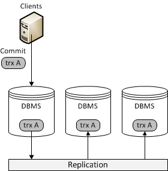
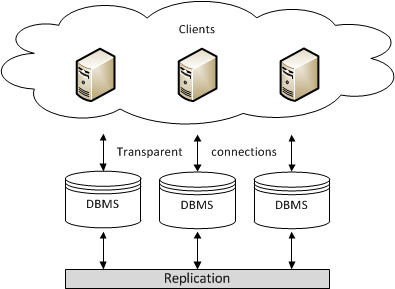

# MariaDB Topologies

## Overview

Trong MariaDB, **topology** là cách sắp xếp các database node, replication, proxy/router và storage để phục vụ một mục tiêu cụ thể.

Tài liệu của MariaDB chia topology theo workload chính:

- **Transactional / OLTP**: phục vụ giao dịch, CRUD, order, payment, inventory, user account.
- **Analytical / OLAP**: phục vụ báo cáo, data warehouse, query lớn, aggregate nhiều dữ liệu.
- **Hybrid / HTAP**: kết hợp transaction và analytics trong cùng một stack.
- **Spider**: federation hoặc sharding qua nhiều MariaDB node.

File này trước mắt chỉ tổng hợp phần **OLTP** với hai topology phổ biến:

- Primary/Replica Topology
- Galera Cluster Topology

---

# Transactional / OLTP

## OLTP là gì?

**OLTP** là viết tắt của **Online Transaction Processing**. Đây là nhóm workload xử lý nhiều giao dịch nhỏ, diễn ra liên tục và cần độ chính xác cao.

Ví dụ OLTP:

- tạo đơn hàng
- thanh toán
- cập nhật số dư tài khoản
- cập nhật tồn kho
- đăng nhập user
- tạo booking
- cập nhật profile

Đặc điểm thường gặp của OLTP:

- transaction ngắn
- đọc/ghi theo primary key hoặc index
- insert/update/delete thường xuyên
- cần ACID transaction
- cần latency thấp
- cần consistency tốt cho dữ liệu nghiệp vụ
- thường dùng row-based storage như InnoDB

Trong MariaDB, hai topology OLTP thường gặp là **Primary/Replica** và **Galera Cluster**.

### Lưu ý về chữ "scale" trong OLTP

Khi MariaDB đặt **Primary/Replica** và **Galera Cluster** dưới nhóm **Transactional / OLTP**, không nên hiểu là hai topology này giúp **scale write throughput tuyến tính** cho nhiều transaction ngắn.

Với OLTP, đặc biệt là các transaction ngắn nhưng ghi thường xuyên, bottleneck thường nằm ở:

- lock hoặc row contention
- commit latency và `fsync`
- network round-trip
- replication overhead
- certification/conflict detection nếu dùng multi-primary
- retry transaction khi có conflict

Vì vậy, thêm node không tự động làm `INSERT`, `UPDATE`, `DELETE` nhanh hơn. Trong nhiều trường hợp, write tập trung vào một Primary còn nhanh và dễ kiểm soát hơn vì commit path ngắn hơn và không phải trả thêm chi phí đồng bộ/certification giữa nhiều node.

Cách hiểu chính xác hơn:

- **Primary/Replica** scale **read**, tăng availability và hỗ trợ failover; write vẫn tập trung ở Primary.
- **Galera** tăng availability, giúp failover write nhanh hơn và cho phép nhiều node có thể nhận write; nhưng mỗi write vẫn phải replicate/certify trong cluster.
- Cả hai phù hợp cho OLTP production chủ yếu vì **HA, failover và read scalability**, không phải vì chúng là lời giải mặc định cho scale write.

Nói ngắn gọn:

```text
Scale OLTP topology != scale write tuyến tính
Scale đúng ở đây thường là scale read + availability + failover
```

---

## 1. Primary/Replica Topology

Primary/Replica là mô hình truyền thống và phổ biến nhất cho database OLTP.



Trong mô hình này:

- **Primary** nhận write: `INSERT`, `UPDATE`, `DELETE`.
- **Replica** nhận bản sao dữ liệu từ Primary.
- Replica thường được dùng để scale read.
- Nếu Primary chết, có thể promote một Replica lên làm Primary mới.
- Có thể dùng MaxScale, ProxySQL, Orchestrator hoặc tooling khác để route traffic và tự động failover.

### Replication hoạt động như thế nào?

Luồng ghi cơ bản:

```text
1. Application ghi dữ liệu vào Primary
2. Primary commit transaction
3. Primary ghi thay đổi vào binary log
4. Replica đọc log từ Primary
5. Replica apply lại thay đổi
```

Replication có thể là:

- **Asynchronous**: Primary commit xong và trả kết quả cho app, Replica apply sau.
- **Semi-synchronous**: Primary chờ ít nhất một Replica xác nhận đã nhận log rồi mới trả kết quả.
- **Synchronous-style**: cố gắng đảm bảo Replica đồng bộ chặt hơn, nhưng đổi lại latency và độ phức tạp tăng.

### Replica lag là gì?

**Replica lag** là độ trễ giữa dữ liệu trên Primary và Replica.

Ví dụ:

```text
10:00:00 User đổi email trên Primary
10:00:01 App đọc từ Replica
Replica chưa apply transaction mới
App vẫn thấy email cũ
```

Replica lag có thể xảy ra khi:

- Primary ghi quá nhiều
- Replica yếu hơn Primary
- network chậm
- transaction lớn
- query trên Replica quá nặng
- Replica apply log không kịp

Ảnh hưởng của replica lag:

- đọc thấy dữ liệu cũ
- user vừa update nhưng reload chưa thấy đổi
- report sai tạm thời
- failover sang Replica đang lag có thể mất transaction mới nhất

### Split-brain là gì?

**Split-brain** là tình huống hệ thống bị chia tách do lỗi network, nhưng nhiều node cùng nghĩ mình là node hợp lệ và tiếp tục nhận write.

Ví dụ:

```text
Node A và Node B mất kết nối với nhau
Node A vẫn nhận write
Node B cũng vẫn nhận write
Khi network hồi phục, dữ liệu hai bên đã khác nhau
```

Trong database, split-brain rất nguy hiểm vì có thể gây:

- dữ liệu lệch giữa các node
- duplicate transaction
- conflict constraint
- mất dữ liệu khi phải chọn một node làm nguồn đúng
- trạng thái nghiệp vụ không thể merge tự động

### Ưu điểm của Primary/Replica

- Đơn giản, dễ hiểu, dễ vận hành.
- Phổ biến, tài liệu và tooling nhiều.
- Phù hợp với đa số backend CRUD.
- Scale read tốt bằng cách thêm Replica.
- Write path dễ kiểm soát vì chỉ có một Primary nhận ghi.
- Ít gặp conflict ghi hơn Galera vì chỉ có một writer chính.
- Phù hợp với hot row/hot table hơn Galera.

### Nhược điểm của Primary/Replica

- Write tập trung vào Primary.
- Replica có thể bị lag.
- Nếu Primary chết, cần promote Replica thành Primary mới.
- Failover cần xử lý cẩn thận để tránh mất dữ liệu hoặc split-brain.
- Async replication có nguy cơ mất transaction nếu Primary chết trước khi Replica nhận/apply log.
- Semi-sync giảm rủi ro nhưng không loại bỏ toàn bộ độ phức tạp khi failover.

### Khi nào nên dùng Primary/Replica?

Nên dùng Primary/Replica khi:

- hệ thống chỉ cần một node nhận write
- workload đọc nhiều hơn ghi
- cần scale read
- chấp nhận replica lag nhỏ
- failover vài giây đến vài chục giây là chấp nhận được
- muốn kiến trúc đơn giản, dễ debug
- app chưa có retry transaction tốt
- workload có hot row hoặc hot table

Với đa số hệ thống OLTP thông thường, Primary/Replica là lựa chọn mặc định tốt.

---

## 2. Galera Cluster Topology

Galera Cluster là topology **multi-primary** cho MariaDB. Nhiều node trong cluster có thể nhận write, và dữ liệu được replicate giữa các node theo cơ chế gần đồng bộ.



Trong Galera:

- các node đều có thể nhận write
- các node nằm trong cùng một cluster
- transaction được replicate bằng write-set
- cluster dùng certification để kiểm tra conflict trước khi commit
- nếu một node chết, các node còn lại vẫn có thể phục vụ nếu cluster còn quorum

### Galera commit transaction như thế nào?

Luồng ghi cơ bản:

```text
1. Client gửi transaction đến Node A
2. Node A execute transaction local bằng InnoDB
3. Trước khi commit, Node A tạo write-set
4. Write-set được gửi sang cluster
5. Cluster certification kiểm tra conflict
6. Nếu pass, transaction commit
7. Các node khác apply write-set
```

Điểm quan trọng: Galera không lock row trên tất cả node ngay từ đầu. Nó xử lý theo hướng **optimistic concurrency control** ở cấp cluster.

Nếu hai transaction cùng sửa một row nhưng chạy trên hai node khác nhau:

```text
Node A: UPDATE accounts SET balance = balance - 100 WHERE id = 1;
Node B: UPDATE accounts SET balance = balance - 200 WHERE id = 1;
```

Thì InnoDB local lock chỉ biết giao dịch trong từng node. Node A không thể dùng local row lock để chặn transaction trên Node B ngay từ đầu.

Đến bước certification:

```text
Transaction trên Node A pass certification -> commit
Transaction trên Node B conflict -> rollback / deadlock error
```

Vì vậy app dùng Galera cần có khả năng retry transaction khi gặp certification failure.

### Multi-primary có phải để scale write không?

Không nên hiểu Galera là giải pháp scale write tuyến tính.

Galera cho phép nhiều node nhận write, nhưng mỗi write vẫn phải:

- gửi write-set trong cluster
- certification
- apply trên các node khác
- chịu ảnh hưởng của network latency

Nếu workload có nhiều transaction cùng sửa một row hoặc một vùng dữ liệu, conflict sẽ tăng và performance có thể xấu hơn Primary/Replica.

Galera nên được xem là giải pháp:

- high availability
- fast failover
- consistency tốt hơn async replication
- multi-primary cho workload ít conflict

Không nên xem Galera là cách mặc định để load balance write.

### Ưu điểm của Galera Cluster

- High availability tốt.
- Các node còn sống đã có khả năng nhận write.
- Failover nhanh hơn Primary/Replica vì không cần promote Replica theo cách truyền thống.
- Giảm rủi ro replica lag kiểu async replication.
- Commit được gắn với cluster membership và certification.
- Phù hợp với transaction ngắn, ít conflict.
- Node mới có thể join lại cluster bằng IST/SST.

### Nhược điểm của Galera Cluster

- Phức tạp hơn Primary/Replica.
- Write latency cao hơn vì network nằm trên commit path.
- Mỗi write phải replicate/certify/apply trong cluster.
- Có thể rollback transaction do certification conflict.
- Không phù hợp hot row/hot table.
- Không scale write tuyến tính.
- Một node chậm có thể gây flow control và làm chậm cả cluster.
- Cần quản lý quorum, bootstrap, SST/IST.
- App nên có retry logic tốt.

### Khi nào nên dùng Galera?

Nên cân nhắc Galera khi:

- cần high availability cao hơn Primary/Replica
- downtime khi Primary chết là rất nhạy cảm
- muốn failover write nhanh
- không muốn promotion-based failover
- workload OLTP gồm transaction ngắn
- conflict thấp
- node nằm gần nhau, network latency thấp
- app xử lý retry transaction tốt
- team có khả năng vận hành cluster

### Khi nào không nên dùng Galera?

Không nên dùng Galera khi:

- chỉ cần một writer là đủ
- mục tiêu chính là scale write lớn
- workload có hot row như counter, balance tổng, inventory hot SKU
- node đặt xa nhau qua WAN latency cao
- app không retry transaction
- team muốn kiến trúc đơn giản
- failover vài giây đến vài chục giây là chấp nhận được

---

## Primary/Replica vs Galera

| Tiêu chí | Primary/Replica | Galera Cluster |
| --- | --- | --- |
| Mô hình write | Một Primary nhận write | Nhiều node có thể nhận write |
| Độ phức tạp | Thấp hơn | Cao hơn |
| Chi phí resource | Thấp hơn | Cao hơn |
| Read scaling | Tốt | Tốt |
| Write scaling | Không scale theo Replica | Không scale tuyến tính, dễ conflict |
| Failover | Cần promote Replica | Node còn lại đã writable |
| Replica lag | Có thể có | Ít gặp kiểu async lag |
| Rủi ro conflict write | Thấp hơn do single-writer | Cao hơn nếu multi-node write cùng data |
| Hot row workload | Phù hợp hơn | Không phù hợp |
| Network latency ảnh hưởng write | Ít hơn, tùy replication mode | Ảnh hưởng trực tiếp hơn |
| Vận hành | Dễ hơn | Khó hơn |

## Kết luận

Với phần lớn hệ thống OLTP thông thường, **Primary/Replica** là lựa chọn mặc định hợp lý hơn vì đơn giản, rẻ hơn, dễ vận hành và dễ debug.

**Galera Cluster** chỉ nên được chọn khi cần high availability và failover write nhanh đến mức xứng đáng với chi phí cluster. Galera phù hợp nhất với workload OLTP transaction ngắn, ít conflict, node gần nhau và application có retry logic tốt.

Điểm quan trọng là không nên đọc chữ **Transactional / OLTP topology** thành **scale write OLTP**. MariaDB recommend hai topology này cho hệ thống OLTP production vì chúng giải quyết bài toán availability, failover, consistency trade-off và scale read qua MaxScale. Nếu workload chính là write-heavy, nhiều hot row/hot table hoặc cần tăng write throughput thật sự, thì chỉ thêm replica hoặc dùng multi-primary thường không giải quyết được bottleneck, thậm chí có thể làm latency và conflict tăng.

Không nên chọn Galera chỉ vì lý do "nhiều node ghi được". Multi-primary là lợi thế về HA và khả năng tiếp tục phục vụ khi node chết, không phải là lời giải mặc định cho scale write.
