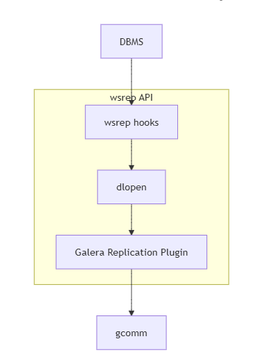
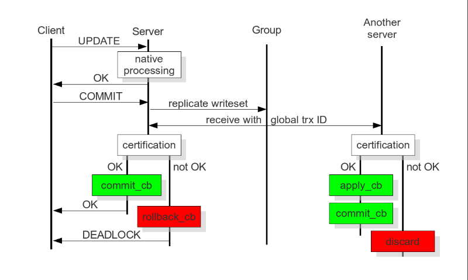
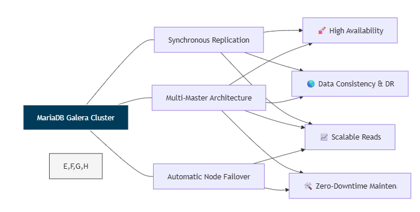

Full tutorial: https://mariadb.com/docs/galera-cluster

# Galera Replication trong MariaDB

## 1. Galera giải quyết vấn đề gì?

Galera Cluster là cơ chế replication **multi-primary** cho MariaDB. Trong một cluster Galera, nhiều node MariaDB cùng tham gia một cụm và đều có thể nhận ghi:


Mục tiêu chính của Galera:

- tăng **high availability**: một node lỗi thì ứng dụng vẫn có thể dùng node khác
- giữ dữ liệu nhất quán giữa các node
- cho phép ghi trên nhiều node thay vì chỉ có một master
- giảm nguy cơ mất transaction mới nhất so với asynchronous replication

Điểm cần hiểu ngay từ đầu: Galera không phải kiểu "mỗi node tự commit xong rồi báo cho node khác sau". Transaction phải đi qua replication group, được xếp thứ tự toàn cục và pass certification trước khi origin node trả `COMMIT success` cho client.

---

## 2. Synchronous, asynchronous và virtually synchronous replication

### 2.1. Asynchronous replication

Trong asynchronous replication, primary commit transaction trước, sau đó mới gửi thay đổi sang replica:

```text
Client ghi vào Primary
  -> Primary commit ngay
  -> Sau đó thay đổi mới được replicate sang Replica
```

Ưu điểm:

- commit nhanh hơn
- kiến trúc đơn giản hơn
- dễ scale read bằng replica

Nhược điểm:

- có replication lag
- replica có thể đọc dữ liệu cũ
- nếu primary crash trước khi replica nhận đủ log, một số transaction mới nhất có thể mất

### 2.2. Synchronous replication truyền thống

Trong synchronous replication, transaction thường phải chờ các node khác xác nhận trước khi commit:

```text
Client ghi vào Node A
  -> Node A gửi thay đổi sang Node B/C
  -> Node B/C xác nhận
  -> Node A mới commit success
```

Về lý thuyết, synchronous replication có consistency và durability tốt hơn. Nhưng trong triển khai database truyền thống, nó thường dựa vào **2-phase commit** hoặc **distributed locking**, nên dễ chậm và phức tạp.

### 2.3. Galera là virtually synchronous

Galera được gọi là **virtually synchronous replication**. Nghĩa là nó đồng bộ ở mức quyết định commit của cluster, nhưng không đồng nghĩa mọi node remote đã apply vật lý xong vào InnoDB tại cùng một micro-thời điểm.

Khi client nhận `COMMIT success`, có thể hiểu:

```text
Đúng:
  - write-set đã được đưa vào replication group
  - cluster đã thống nhất global order / seqno
  - transaction đã pass certification
  - origin node đã commit local
  - transaction không còn là thay đổi riêng của một node

Không nên hiểu là:
  - tất cả remote node đã fsync/apply xong đúng cùng thời điểm
  - đọc ngay từ bất kỳ node nào cũng luôn thấy dữ liệu mới nếu không cấu hình đồng bộ đọc
```

Vì vậy Galera nằm giữa hai cực:

| Kiểu replication | Đặc điểm chính |
|---|---|
| Asynchronous | Commit nhanh, có lag, có thể mất thay đổi mới nhất khi primary crash |
| Synchronous truyền thống | Consistency mạnh, nhưng thường chậm do 2PC/distributed lock |
| Galera virtually synchronous | Replicate/order/certify trước khi origin commit, tối ưu hơn sync truyền thống trong workload phù hợp |

Galera không mặc định nhanh hơn asynchronous replication. Ý tài liệu là Galera tránh một số điểm chậm của synchronous replication truyền thống bằng **write-set replication**, **group communication**, **total order** và **certification-based replication**.

---

## 3. Kiến trúc Galera replication library

Galera được implement như một **shared library**. MariaDB tích hợp với Galera thông qua **wsrep API**.

Ở tầng trên cùng vẫn là **MariaDB Server** thông thường, thường dùng InnoDB làm storage engine. Client kết nối, gửi SQL và nhận kết quả như khi làm việc với một MariaDB server đơn lẻ. Điểm khác biệt là bên trong MariaDB có các `wsrep hooks` để biến thay đổi của transaction thành write-set và đưa write-set đó sang replication provider.

Trong một node:



Ví dụ cấu hình:

```ini
wsrep_on=ON
wsrep_provider=/usr/lib/galera/libgalera_smm.so
wsrep_cluster_address=gcomm://node-a,node-b,node-c
```

Các thành phần chính:

| Thành phần | Vai trò |
|---|---|
| MariaDB Server / DBMS | Nhận kết nối client, execute SQL và quản lý storage engine local |
| `wsrep API` | Interface giữa DBMS và replication provider |
| `wsrep hooks` | Điểm tích hợp trong database engine để gọi wsrep |
| `dlopen()` | Cơ chế load Galera provider shared library để các hook gọi được implementation wsrep |
| Galera provider | Implement wsrep API cho Galera |
| Certification layer | Chuẩn bị write-set và kiểm tra conflict |
| Replication layer | Quản lý replication protocol và total ordering |
| GCS framework | Plugin architecture cho group communication systems |

MariaDB không tự gửi từng gói replication tới từng node. MariaDB gọi wsrep API, còn Galera provider xử lý membership, broadcast, ordering, certification, flow control, quorum, IST/SST và apply write-set.

Có thể hiểu `wsrep API` nhìn database như một **state machine**: mỗi transaction làm thay đổi state của database, và Galera cần đảm bảo các node cùng nhận cùng chuỗi state changes theo cùng thứ tự serial. Vì vậy transaction không chỉ là một câu SQL local; khi tới bước commit, thay đổi đó được biểu diễn thành write-set, được total-order, được certification, rồi mới trở thành một phần của lịch sử cluster.

Luồng kỹ thuật rút gọn:

```text
1. Transaction tạo ra state change trên một node
2. wsrep hooks trong MariaDB chuyển state change thành write-set
3. Galera provider được load qua wsrep_provider xử lý write-set
4. Provider broadcast write-set qua group communication
5. Các node nhận cùng global order, certification rồi apply write-set
```

### 3.1. MariaDB Enterprise Cluster và MaxScale

Trong MariaDB Enterprise Cluster, Galera thường không đứng một mình mà đi cùng **MariaDB Enterprise Server** và **MariaDB MaxScale**.

MaxScale đóng vai trò proxy/router ở phía trước cluster:

```text
Application
    |
MariaDB MaxScale
    |
    +--> Node A - MariaDB Enterprise Server + Galera
    +--> Node B - MariaDB Enterprise Server + Galera
    +--> Node C - MariaDB Enterprise Server + Galera
```

Ứng dụng kết nối tới MaxScale thay vì tự chọn từng database node. MaxScale có thể route read/write tới node phù hợp, còn việc replicate dữ liệu giữa các MariaDB node vẫn do Galera xử lý. Nếu một write được gửi tới Node A, write đó vẫn phải đi qua write-set, total order và certification trước khi trở thành một phần của lịch sử cluster.

Điểm quan trọng: MaxScale không thay thế Galera. MaxScale xử lý tầng kết nối và routing từ application vào cluster; Galera xử lý replication, ordering, certification và consistency giữa các node.

MaxScale cũng là tầng thường dùng cho failover ở phía client. Galera tự quản lý replication, quorum và node state, nhưng application vẫn cần một endpoint ổn định để kết nối. MaxScale hiểu trạng thái Galera tốt hơn load balancer TCP thông thường, nên có thể loại khỏi pool các node:

- down hoặc mất kết nối
- không thuộc Primary Component
- đang chạy blocking SST
- đang flow control quá nặng
- chưa ở trạng thái synced để nhận traffic an toàn

Vì vậy failover trong kiến trúc MariaDB Enterprise Cluster thường là:

```text
Galera: quyết định node/partition nào hợp lệ ở tầng cluster
MaxScale: route connection/query của application tới node hợp lệ
```

---

## 4. Các khái niệm lõi

### 4.1. Write-set

Write-set là dữ liệu mô tả transaction đã thay đổi những gì. Nó không đơn giản là câu SQL gốc.

Một write-set thường chứa:

- transaction metadata
- table bị thay đổi
- primary key / unique key của row bị thay đổi
- row change cần apply
- thông tin phục vụ certification
- origin node

Ví dụ:

```sql
UPDATE account
SET balance = balance - 100
WHERE id = 1;
```

Write-set sẽ thể hiện transaction này ghi vào key:

```text
account.id = 1
```

Thông tin key rất quan trọng vì certification cần biết transaction nào ghi vào cùng dữ liệu.

### 4.2. Group communication

Group communication là lớp giao tiếp giữa các Galera provider trong cùng cluster.

Ví dụ cluster có 3 node:

```text
Provider A <----> Provider B
Provider A <----> Provider C
Provider B <----> Provider C
```

Khi Node A có transaction cần commit, provider A đưa write-set vào group communication. Nói đơn giản là A gửi write-set tới B và C, nhưng chính xác hơn là group communication đảm bảo message được deliver theo cơ chế cluster, có membership và ordering rõ ràng.

Trong Galera, lớp này thường được gọi là GComm/GCS. Nó gom các vấn đề delivery, membership và ordering vào một mô hình thống nhất để provider không phải tự xử lý từng kết nối như một cơ chế point-to-point đơn giản. GComm cũng là nền tảng để Galera duy trì QoS gần đồng bộ, phát hiện node chậm hoặc mất kết nối, và phối hợp với flow control khi một node không theo kịp tốc độ write-set của cluster.

### 4.3. Total order broadcast

Network có thể làm packet đến các node theo thứ tự khác nhau:

```text
Node A broadcast T_A
Node B broadcast T_B

Node A thấy T_A trước T_B
Node B thấy T_B trước T_A
Node C thấy T_B trước T_A
```

Nếu mỗi node commit theo thứ tự packet đến, dữ liệu có thể lệch. Galera dùng **total order broadcast** để tất cả node thống nhất một thứ tự toàn cục:

```text
seqno 500 = T_A
seqno 501 = T_B
```

Điểm quan trọng:

```text
packet arrival order != transaction delivery order
```

Packet có thể đến loạn thứ tự, nhưng Galera deliver write-set lên certification theo global order đã thống nhất.

### 4.4. Certification



Certification là bước kiểm tra transaction có conflict với các transaction đã được xác nhận trước đó hay không. Đây là nền tảng của **certification-based replication** trong Galera: transaction execute trước trên một node theo kiểu optimistic, nhưng chỉ được commit khi write-set của nó pass kiểm tra deterministic trên cluster.

Cơ chế này cần database có một số khả năng tối thiểu:

| Yêu cầu | Vì sao cần |
|---|---|
| Transactional database | Nếu certification fail, transaction local phải rollback được |
| Atomic changes | Write-set phải được apply như một đơn vị: hoặc toàn bộ thay đổi xảy ra, hoặc không thay đổi nào xảy ra |
| Global ordering | Mọi node phải apply/certify replication events theo cùng một thứ tự |

Ý tưởng chính là transaction chạy gần như transaction local bình thường cho tới lúc `COMMIT`. Galera không lock row trên tất cả node ngay từ đầu. Thay vào đó, nó giả định transaction có thể thành công nếu không có conflict, rồi kiểm tra conflict tại commit time.

Khi client gọi `COMMIT`, nhưng trước khi commit thật xảy ra, node origin thu thập các thay đổi của transaction và các key định danh row bị thay đổi, thường là primary key hoặc unique key, thành một write-set. Write-set này được broadcast tới các node khác qua group communication và được gán global order / `seqno`.

Certification dựa trên:

- write-set của transaction hiện tại
- global order / seqno
- lịch sử các transaction đã pass certification trước đó
- primary key / unique key của các row đã thay đổi

Nếu hai transaction cùng ghi vào cùng một key, transaction đứng sau trong global order sẽ fail:

```text
seqno 100 = T_A update account.id = 1
seqno 101 = T_B update account.id = 1

T_A pass
T_B fail vì conflict với T_A
```

Nếu ghi vào key khác nhau:

```text
seqno 100 = T_A update account.id = 1
seqno 101 = T_B update account.id = 2

T_A pass
T_B pass
```

Certification chạy trên **mỗi node**, bao gồm cả node origin của write-set. Vì mọi node có cùng write-set, cùng global order và cùng rule certification, kết quả certification giống nhau trên toàn cluster. Đây là tính deterministic của certification test: cùng input và cùng thứ tự thì mọi replica phải đi tới cùng một quyết định pass/fail.

Khi một write-set có `seqno` mới, node kiểm tra nó với các transaction đã pass trong khoảng lịch sử liên quan kể từ lần transaction bắt đầu quan sát state cho tới vị trí `seqno` hiện tại. Nếu trong khoảng đó có transaction đã pass và ghi cùng key, certification fail. Nếu không có conflict, certification pass.

Kết quả xử lý:

| Kết quả certification | Hành động |
|---|---|
| Pass | Origin node commit local; remote node apply write-set theo hàng đợi apply |
| Fail | Origin node rollback transaction local; remote node drop/discard write-set |

Vì vậy lỗi certification không phải lỗi replication bị lệch dữ liệu. Nó là cách Galera bảo vệ global consistency khi nhiều node cùng nhận write optimistic.

### 4.5. Global Transaction ID

Để biết mỗi node đang ở trạng thái nào so với phần còn lại của cluster, Galera dùng Global Transaction ID, thường được biểu diễn dưới dạng:

```text
45eec521-2f34-11e0-0800-2a36050b826b:94530586304
```

GTID của Galera có hai phần:

| Thành phần | Ý nghĩa |
|---|---|
| State UUID | Định danh của một lịch sử trạng thái cluster |
| `seqno` | Số thứ tự 64-bit của write-set trong lịch sử đó |

Phần `seqno` chính là global sequence number được nhắc trong total order broadcast. Nó tăng theo thứ tự transaction đã được cluster đưa vào global order. Khi so sánh trạng thái các node trong cùng một state UUID, node có `seqno` cao hơn thường biết nhiều write-set mới hơn.

Điểm cần phân biệt: GTID/`seqno` ở đây là khái niệm của Galera cluster, không phải transaction id local của InnoDB và cũng không nên nhầm với MariaDB GTID dùng cho binary log replication truyền thống.

---

## 5. Luồng commit một transaction

Giả sử client ghi vào Node A:

```sql
BEGIN;
UPDATE account SET balance = balance - 100 WHERE id = 1;
COMMIT;
```

Luồng xử lý:

```text
1. Client gửi SQL tới Node A
2. mysqld trên Node A execute transaction local bằng InnoDB
3. Transaction chưa commit thật ở cấp cluster
4. Khi client gọi COMMIT, Node A tạo write-set
5. mysqld gọi wsrep API để đưa write-set cho Galera provider local
6. Galera provider broadcast write-set vào replication group
7. Group communication gán global order / seqno
8. Các node deliver write-set theo cùng thứ tự
9. Các node chạy certification
10. Nếu pass:
    - origin node commit local
    - remote nodes đưa write-set vào receive queue rồi apply
11. Nếu fail:
    - origin node rollback
    - remote nodes discard write-set
12. Origin node trả kết quả cho client
```

Điểm dễ nhầm:

```text
Node A không commit trước rồi mới gửi sang node khác.
Node A gửi write-set trước, sau đó chỉ commit nếu write-set pass certification.
```

---

## 6. Ví dụ conflict: hai node cùng ghi một row

Giả sử có bảng:

```sql
CREATE TABLE account (
  id BIGINT PRIMARY KEY,
  balance INT NOT NULL
) ENGINE=InnoDB;

INSERT INTO account(id, balance) VALUES (1, 1000);
```

Hai client ghi đồng thời:

```text
Client 1 -> Node A
Client 2 -> Node B
```

Client 1:

```sql
BEGIN;
UPDATE account SET balance = balance - 100 WHERE id = 1;
COMMIT;
```

Client 2:

```sql
BEGIN;
UPDATE account SET balance = balance - 200 WHERE id = 1;
COMMIT;
```

Gọi:

```text
T_A = transaction từ Node A
T_B = transaction từ Node B
```

Hai transaction đều tạo write-set ghi vào cùng key:

```text
T_A writes account.id = 1
T_B writes account.id = 1
```

Group communication thống nhất global order, ví dụ:

```text
seqno 500 = T_A
seqno 501 = T_B
```

Certification trên mọi node:

```text
Certify T_A:
  chưa có transaction trước đó conflict
  => pass

Certify T_B:
  T_A đã pass và ghi cùng account.id = 1
  => fail
```

Kết quả:

```text
Node A là origin của T_A:
  T_A pass
  Node A commit local
  Client 1 nhận COMMIT success
  Node B/C apply write-set T_A

Node B là origin của T_B:
  T_B fail
  Node B rollback local transaction
  Client 2 nhận lỗi
  Node A/C discard T_B
```

Kết quả cuối cùng:

```text
account.id = 1
balance = 900
```

Application cần có retry logic nếu nghiệp vụ cho phép retry transaction thua certification.

---

## 7. Ví dụ không conflict: hai node ghi hai row khác nhau

Ví dụ:

```sql
-- Node A
UPDATE account SET balance = balance - 100 WHERE id = 1;

-- Node B
UPDATE account SET balance = balance - 200 WHERE id = 2;
```

Write-set:

```text
T_A writes account.id = 1
T_B writes account.id = 2
```

Global order:

```text
seqno 600 = T_A
seqno 601 = T_B
```

Certification:

```text
T_A pass
T_B pass vì không ghi cùng key với T_A
```

Kết quả:

```text
Client trên Node A success
Client trên Node B success
Node A, B, C cuối cùng đều có cả hai thay đổi
```

Đây là lý do Galera có thể scale tốt với workload ít conflict. Nếu các transaction ghi vào các vùng dữ liệu khác nhau, certification cho phép chúng cùng thành công.

---

## 8. Vì sao Galera không cần một master tập trung?

Galera không có một database master duy nhất nhận toàn bộ write.

Thay vào đó:

- mỗi node có Galera provider local
- các provider cùng tham gia một replication group
- group communication thống nhất membership
- total order broadcast thống nhất thứ tự write-set
- certification chạy trên từng node

Cách hiểu đúng:

```text
Không có master DB tập trung.
Nhưng có giao thức phân tán để thống nhất thứ tự transaction.
```

Galera có thể có vai trò điều phối nội bộ trong protocol hoặc cluster view, nhưng đó không phải là một database master nhận mọi SQL write.

---

## 9. Read-after-write và apply trên remote node

Khi client nhận `COMMIT success`, transaction đã được replicate vào group, được total-order, pass certification và origin node đã commit.

Tuy nhiên, remote node không nhất thiết đã apply xong vào InnoDB đúng tại micro-thời điểm đó. Write-set có thể đang nằm trong receive queue và chờ Galera slave thread apply.

Ví dụ:

```text
T_A commit thành công trên Node A
seqno 900 = T_A

Node A:
  đã commit local và trả success

Node B:
  đã nhận/order T_A nhưng apply thread có thể đang chậm vài ms

Node C:
  đang apply T_A theo đúng seqno 900
```

Nếu client vừa write vào Node A rồi lập tức đọc từ Node B, có thể gặp read-after-write chưa chặt nếu Node B chưa apply kịp.

Cách xử lý:

```sql
SET SESSION wsrep_sync_wait = 1;
```

Hoặc route request theo rule:

```text
Write ở node nào thì đọc lại từ node đó trong cùng workflow cần consistency mạnh.
```

---

## 10. Galera slave threads

Mặc dù Galera provider certify write-set ở commit time trên mỗi node, write-set không nhất thiết được apply ngay lập tức trên remote node. Nó được đưa vào receive queue, sau đó một hoặc nhiều **Galera slave threads** sẽ apply vào database local.

Luồng trên node nhận:

```text
Node nhận write-set
  -> certify theo global order
  -> đưa vào receive queue
  -> Galera slave thread lấy ra apply vào InnoDB
```

Số lượng thread có thể cấu hình bằng:

```text
wsrep_slave_threads
```

Các slave threads có thể xác định write-set nào an toàn để apply song song. Ví dụ:

```text
Transaction 1 sửa account.id = 1
Transaction 2 sửa account.id = 2
=> có thể apply song song nếu không có dependency
```

Nếu cluster thường xuyên gặp vấn đề consistency, giảm `wsrep_slave_threads` về `1` có thể giúp apply tuần tự hơn, đổi lại throughput thấp hơn.

Khi node đang ở trạng thái `JOINED` và cần bắt kịp cluster, tăng số slave threads có thể giúp node apply backlog nhanh hơn. Một gợi ý thường gặp là đặt khoảng hai lần số CPU cores, nhưng cần đo thực tế theo workload.

---

## 11. Streaming replication trong Galera 4

Streaming replication được giới thiệu trong Galera 4 để xử lý transaction lớn.

Trước đó, node thường chờ đến commit mới replicate và certify transaction. Với transaction rất lớn, điều này có rủi ro:

```text
Transaction chạy lâu
  -> sửa rất nhiều dữ liệu
  -> trong lúc đó transaction nhỏ ở node khác có thể sửa trúng cùng key
  -> đến commit mới replicate/certify
  -> phát hiện conflict
  -> rollback toàn bộ transaction lớn
```

Streaming replication chia transaction lớn thành nhiều fragment nhỏ hơn và replicate dần khi transaction đang chạy:

```text
Transaction lớn
  -> Fragment 1 replicate/certify
  -> Fragment 2 replicate/certify
  -> Fragment 3 replicate/certify
  -> Commit cuối
```

Khi một fragment đã được certified, nó không còn dễ bị transaction khác abort vì conflict sau đó. Cách này giúp giảm rủi ro rollback muộn cho transaction lớn.

Nhưng streaming replication không nên bật bừa cho mọi transaction. Nó có thể ảnh hưởng performance trong lúc chạy và khi rollback. Nó phù hợp hơn với:

- batch update lớn
- migration dữ liệu
- transaction lâu
- thao tác ít khả năng conflict

Nếu workload thường xuyên đụng hot row/hot key, streaming replication không giải quyết gốc rễ conflict.

---

## 12. Group commit trong Galera 4

Group Commit gom nhiều transaction lại để flush xuống disk cùng lúc, thay vì mỗi transaction tự flush riêng:

```text
Không group commit:
  Transaction 1 -> flush disk
  Transaction 2 -> flush disk
  Transaction 3 -> flush disk

Có group commit:
  Transaction 1 \
  Transaction 2  -> flush disk một lần
  Transaction 3 /
```

Trong MariaDB bình thường, group commit giúp giảm chi phí I/O và tăng throughput. Trước Galera 4, MariaDB Cluster khó tận dụng tính năng này vì nó có thể can thiệp vào global ordering của transaction trong replication.

Từ Galera 4, MariaDB Cluster có thể tận dụng Group Commit mà vẫn giữ được global transaction order. Đây là tối ưu performance, đặc biệt với nhiều transaction nhỏ commit liên tục.

Điểm cần phân biệt: Group Commit không biến Galera thành asynchronous replication. Galera vẫn phải replicate write-set, total-order, certify và apply theo protocol. Group Commit chỉ tối ưu phần commit/flush local.

---

## 13. Flow control

Mỗi write trong Galera cuối cùng phải được các node khác apply. Nếu một node apply chậm hơn quá nhiều, receive/apply queue trên node đó tăng lên. Khi vượt ngưỡng, Galera dùng **flow control** để làm chậm các node đang ghi.

Mục tiêu:

```text
Không để node chậm tụt quá xa cluster.
```

Hệ quả:

```text
Một node chậm có thể làm chậm cả cluster.
```

Nguyên nhân thường gặp:

- node yếu CPU/I/O hơn
- disk chậm
- transaction lớn
- network kém
- query nặng trên node đó
- backup hoặc maintenance gây tải

### 13.1. Eviction

Flow control là cách Galera cố giữ node chậm ở lại cluster bằng cách giảm tốc độ replication. Nhưng nếu một node mất phản hồi, network quá kém hoặc liên tục không theo kịp, cluster không thể để node đó kéo cả cụm xuống mãi.

Galera dùng EVS protocol để theo dõi membership, kết nối mạng và thời gian phản hồi giữa các node. Node có vấn đề có thể bị đưa vào delayed list. Nếu tình trạng cải thiện đủ lâu, node được bỏ khỏi delayed list. Nếu số lần hoặc thời gian delay vượt ngưỡng của cluster, node đó có thể bị **evict** khỏi cluster.

Node bị evict trở thành non-operational component. Nó không còn là thành viên hợp lệ của Primary Component và thường cần restart MariaDB để join lại. Khi join lại, node phải bắt kịp state bằng IST nếu còn đủ write-set trong gcache, hoặc SST nếu đã tụt quá xa.

---

## 14. Quorum và Primary Component

Galera cần tránh **split-brain**.

Split-brain là tình huống cluster bị chia thành nhiều phần do lỗi network, nhưng nhiều phần vẫn nghĩ mình còn quyền xử lý ghi. Nếu điều này xảy ra trong database cluster, mỗi phần có thể sinh ra một lịch sử dữ liệu khác nhau.

Nếu network partition xảy ra:

```text
Partition 1: Node A, Node B
Partition 2: Node C
```

Nếu không có cơ chế chống split-brain, cả hai partition có thể cùng nhận write:

```text
Partition A+B:
  UPDATE account SET balance = balance - 100 WHERE id = 1;

Partition C:
  UPDATE account SET balance = balance - 200 WHERE id = 1;
```

Khi network hồi phục, cluster sẽ có hai lịch sử dữ liệu khác nhau:

```text
A/B tin rằng account.id = 1 đã trừ 100
C tin rằng account.id = 1 đã trừ 200
```

Hai lịch sử này không thể tự merge an toàn, vì database không biết nghiệp vụ nào đúng. Đây là lý do split-brain nguy hiểm hơn replication lag thông thường: nó tạo ra **data divergence**, không chỉ chậm đồng bộ.

### 14.1. Galera giải quyết split-brain bằng quorum

Galera dùng quorum để quyết định partition nào còn quyền hoạt động. Nhóm node còn đủ đa số được gọi là **Primary Component**.

Với 3 node:

```text
A + B còn thấy nhau => có quorum => tiếp tục
C đứng một mình => không có quorum => không được ghi
```

Nhóm không còn quorum sẽ rơi khỏi Primary Component và không được xử lý write. Nhờ đó chỉ có một lịch sử dữ liệu tiếp tục phát triển:

```text
A/B tiếp tục nhận write
C dừng nhận write
=> không có hai lịch sử dữ liệu độc lập
```

Khi network hồi phục, node C phải join lại cluster và bắt kịp state từ Primary Component bằng IST hoặc SST.

### 14.2. Vì sao nên dùng số node lẻ?

Cluster số node lẻ giúp quorum rõ ràng hơn. Với 3 node:

```text
2/3 node => có đa số
1/3 node => không có đa số
```

Với 2 node, nếu mất kết nối giữa hai node:

```text
Node A không thấy Node B
Node B không thấy Node A
```

Không node nào có đa số rõ ràng. Nếu cho cả hai cùng ghi thì split-brain; nếu chặn cả hai thì mất availability. Vì vậy Galera cluster production thường dùng 3 node hoặc dùng thêm arbitrator như `garbd` để tạo quorum.

`garbd` là **Galera Arbitrator**: một process riêng tham gia bỏ phiếu quorum nhưng không chứa data, không nhận SQL và không replicate write-set. Nó hữu ích khi muốn có thêm một vote ở failure domain độc lập mà không chạy thêm một database node đầy đủ.

Ví dụ:

```text
Node A
Node B
Arbitrator
```

Nếu Node B mất kết nối, Node A vẫn có thể thấy Arbitrator:

```text
Node A + Arbitrator = 2/3 vote => có quorum
Node B = 1/3 vote => không có quorum
```

Arbitrator không tăng read/write capacity và không thay thế backup. Nó chỉ giúp cluster quyết định Primary Component rõ ràng hơn.

Khi thiết kế cluster, "số node lẻ" không chỉ là số lượng database server. Cần nhìn theo failure domain như switch, rack, availability zone hoặc data center. Nếu một lỗi đơn lẻ làm mất phần majority, cluster vẫn có thể mất Primary Component dù tổng số server ban đầu là số lẻ.

Một số nguyên tắc thực tế:

- mỗi server cần đủ disk để chứa toàn bộ database, vì mỗi Galera node là một bản dữ liệu đầy đủ
- giới hạn dung lượng hiệu dụng của cluster bị kéo xuống bởi node có disk nhỏ nhất
- nên dùng số server lẻ, tối thiểu là 3, để majority/quorum rõ ràng
- nếu cluster trải qua nhiều switch, không nên để toàn bộ majority nằm trên cùng một switch
- nếu cluster trải qua nhiều data center, nên cân nhắc quorum khi một data center mất kết nối
- mỗi data center nên có kế hoạch backup riêng, có thể là một Galera node chuyên backup hoặc một replica server riêng được đồng bộ bằng MariaDB Replication

Ví dụ với 3 node ở 3 failure domains khác nhau:

```text
DC1: Node A
DC2: Node B
DC3: Node C
```

Nếu một DC mất kết nối, hai DC còn lại vẫn có thể tạo Primary Component. Ngược lại, nếu đặt 2 node trong một DC và 1 node ở DC khác, khi DC chứa 2 node gặp sự cố thì node còn lại sẽ không có quorum và cluster không thể tiếp tục nhận write.

Mục tiêu là tránh tình huống một lỗi đơn lẻ như mất server, mất switch hoặc mất data center làm cluster mất Primary Component.

### 14.3. Weighted quorum

Mặc định mỗi Galera node có trọng số vote là `1`. Trong một số topology phức tạp, đặc biệt khi cluster trải qua nhiều site hoặc có node quan trọng hơn node khác, có thể dùng **weighted quorum** để điều chỉnh node nào quan trọng hơn khi tính Primary Component.

Trọng số quorum của node được cấu hình bằng provider option `pc.weight`, giá trị từ `0` tới `255`:

```sql
SET GLOBAL wsrep_provider_options='pc.weight=3';
```

Ý nghĩa:

| Giá trị | Ý nghĩa thực tế |
|---|---|
| `0` | Node tham gia cluster nhưng không đóng góp vote quorum |
| `1` | Trọng số mặc định |
| `2..255` | Node có ảnh hưởng lớn hơn khi tính Primary Component |

Quorum được giữ khi tổng weight của component hiện tại lớn hơn một nửa tổng weight của Primary Component trước đó, sau khi trừ các node đã rời cluster một cách graceful. Nói đơn giản, Galera không chỉ đếm số node; nó đếm tổng trọng số của các node còn thấy nhau.

Ví dụ ưu tiên một node trong cluster 3 node:

```text
node1: pc.weight = 2
node2: pc.weight = 1
node3: pc.weight = 0
```

Nếu `node2` và `node3` mất, `node1` vẫn có đủ weight để giữ Primary Component. Nhưng nếu `node1` mất, `node2` và `node3` không đủ trọng số để tiếp tục làm Primary Component.

Ví dụ primary/replica failover đơn giản với 2 node:

```text
node1 primary: pc.weight = 1
node2 replica: pc.weight = 0
```

Khi network split, `node1` là node có quyền giữ Primary Component; `node2` không tự trở thành primary chỉ vì nó còn sống một mình. Cách này hữu ích khi muốn một node phụ trợ có data nhưng không quyết định quorum.

Ví dụ primary site và secondary site:

```text
Primary site:
  node1: pc.weight = 2
  node2: pc.weight = 2

Secondary site:
  node3: pc.weight = 1
  node4: pc.weight = 1
```

Nếu WAN link tới secondary site đứt, primary site vẫn giữ quorum. Primary site cũng có thể mất một node mà vẫn tiếp tục hoạt động. Ngược lại, secondary site không dễ tự tạo Primary Component riêng khi bị tách khỏi primary site.

Điểm cần cẩn thận: thay đổi `pc.weight` là một membership event của toàn cluster. Nếu network partition xảy ra đúng lúc message thay đổi weight đang được deliver, có thể gặp corner case khiến cả cluster tạm thời rơi vào non-Primary. Vì vậy không nên thay đổi weight tùy tiện trong giờ cao điểm; nên thiết kế trước, áp dụng có kiểm soát và monitor trạng thái `wsrep_cluster_status`.

Weighted quorum không thay thế thiết kế failure domain tốt. Nó chỉ là công cụ tinh chỉnh quyền bỏ phiếu khi topology cần ưu tiên một site, một nhóm node hoặc một vai trò cụ thể.

### 14.4. Primary Component không phải master

Primary Component không có nghĩa là có một master database mới. Nó chỉ là partition còn đủ quorum và được phép tiếp tục xử lý transaction.

Trong Primary Component, Galera vẫn là multi-primary:

```text
A và B cùng thuộc Primary Component
=> cả A và B vẫn có thể nhận write
=> write-set vẫn đi qua total order và certification
```

Điểm quan trọng là các node ngoài Primary Component không được tự tạo một lịch sử write riêng.

### 14.5. Vì sao bootstrap từ node có seqno cao nhất?

Khi toàn bộ cluster đã dừng và cần bootstrap lại, node đầu tiên được chọn sẽ trở thành điểm bắt đầu cho Primary Component mới. Vì vậy phải chọn node có state mới nhất.

Trong Galera, `seqno` là global sequence number của write-set trong lịch sử cluster. Mỗi transaction đã pass certification và được đưa vào global order sẽ có một `seqno` tăng dần:

```text
seqno 1001
seqno 1002
seqno 1003
```

Node có `seqno` cao hơn thường là node đã biết nhiều transaction mới hơn. Ví dụ:

```text
Node A: seqno 100
Node B: seqno 105
Node C: seqno 103
```

Nếu bootstrap từ Node A, cluster mới bắt đầu từ state ở `seqno 100`. Các transaction `101..105` đang có trên Node B có nguy cơ bị bỏ qua hoặc bị ghi đè khi Node B join lại cluster mới. Đó là một dạng mất dữ liệu do chọn node bootstrap cũ hơn.

Nếu bootstrap từ Node B, cluster mới bắt đầu từ state mới nhất:

```text
Bootstrap từ Node B seqno 105
  -> Node A join lại và sync phần thiếu
  -> Node C join lại và sync phần thiếu
```

Vì vậy khi shutdown toàn bộ cluster một cách graceful, cần kiểm tra `seqno` trong:

```text
/var/lib/mysql/grastate.dat
```

và bootstrap bằng `galera_new_cluster` từ node có `seqno` cao nhất. Nếu cluster crash toàn bộ và `grastate.dat` hiển thị `seqno: -1`, không được chọn bừa node. Khi đó cần chạy recovery trên từng node:

```bash
mysqld --wsrep-recover
```

Sau đó chọn node có recovered seqno cao nhất, đặt `safe_to_bootstrap: 1` cho node đó nếu cần, rồi mới bootstrap cluster.

Điểm cần nhớ: `seqno` không phải transaction id local của InnoDB. Nó là thứ tự toàn cục của Galera cluster, nên phù hợp để so sánh node nào đang giữ lịch sử cluster mới hơn.

### 14.6. Deployment variants

Galera Cluster có thể triển khai theo nhiều topology khác nhau. Ba pattern thường gặp là cluster LAN trong một data center, cluster WAN nhiều data center, và cluster 2 data node kèm Galera Arbitrator.

| Variant | Mục tiêu chính | Điểm cần chú ý |
|---|---|---|
| Standard LAN cluster | High availability, read scaling, maintenance trong một data center | Không bảo vệ khỏi outage toàn bộ data center |
| WAN multi-site cluster | Disaster recovery và phục vụ user gần site hơn | Nhạy với latency, network partition và thiết kế quorum |
| Two-node + `garbd` | HA tiết kiệm chi phí khi chỉ có 2 data node | Arbitrator phải chạy ở máy/site thứ ba và cần được monitor |

#### Standard LAN cluster

Đây là mô hình phổ biến nhất cho high availability trong một data center. Các node thường nằm cùng LAN tốc độ cao, latency thấp, và số node nên là số lẻ như 3 hoặc 5:

```text
Data Center 1
  Node A
  Node B
  Node C
```

Mục tiêu chính:

| Mục tiêu | Ý nghĩa |
|---|---|
| High availability | Cluster chịu được lỗi một hoặc nhiều node, tùy kích thước cluster |
| Read scalability | Read traffic có thể được phân phối sang nhiều node synced |
| Maintenance | Có thể đưa từng node ra khỏi cluster để upgrade hoặc bảo trì rolling |

Điểm yếu của topology này là toàn bộ cluster vẫn phụ thuộc vào một data center. Nếu data center, switch core hoặc storage/network chung gặp sự cố lớn, cả cluster có thể mất Primary Component hoặc mất khả năng phục vụ.

#### WAN multi-site cluster

Trong WAN topology, các node được đặt ở hai hoặc nhiều địa điểm vật lý. Mục tiêu thường là disaster recovery hoặc giảm latency đọc cho user ở nhiều vùng địa lý:

```text
DC1: Node A
DC2: Node B
DC3: Node C
```

Topology này cần thiết kế quorum kỹ hơn LAN cluster. Nên có số node lẻ và, nếu có thể, số location lẻ để khi một site mất kết nối, phần còn lại vẫn có cơ hội tạo Primary Component rõ ràng.

Mục tiêu chính:

| Mục tiêu | Ý nghĩa |
|---|---|
| Disaster recovery | Nếu một data center mất hoàn toàn, cluster có thể tiếp tục ở các location còn lại nếu còn quorum |
| Reduced read latency | Application có thể đọc từ node gần user hơn, nếu chính sách consistency cho phép |

Các rủi ro chính:

| Rủi ro | Ảnh hưởng |
|---|---|
| Network latency | Round-trip time giữa các site ảnh hưởng trực tiếp tới commit latency |
| Network stability | Partition hoặc packet loss thường xuyên có thể gây eviction, flow control hoặc non-Primary |
| Quorum layout | Nếu majority nằm sai failure domain, mất một site có thể làm cluster dừng ghi |

Với WAN cluster, có thể dùng `gmcast.segment` để nhóm các node cùng site vào cùng segment. Segment giúp Galera tối ưu đường truyền group communication, ưu tiên traffic local trong site khi có thể, nhưng nó không loại bỏ chi phí latency của commit xuyên site.

#### Two-node cluster với Galera Arbitrator

Một biến thể thực tế là chỉ chạy hai MariaDB Galera data node và thêm một `garbd` ở máy thứ ba:

```text
Node A - MariaDB + Galera
Node B - MariaDB + Galera
Node C - garbd only
```

`garbd` không chứa data, không nhận SQL, không tăng read/write capacity và không replicate write-set như một database node. Nó chỉ tham gia vote quorum. Nhìn từ góc độ quorum, cluster có 3 thành viên; nếu một data node chết, data node còn lại cộng với arbitrator vẫn đạt 2/3 vote và giữ Primary Component.

Topology này phù hợp khi muốn HA tốt hơn cluster 2 node thuần túy nhưng chưa muốn trả chi phí cho data node thứ ba. Tuy nhiên, arbitrator phải nằm ở failure domain độc lập. Nếu `garbd` chạy chung máy, chung rack hoặc chung site với một data node, nó có thể không giúp được gì trong đúng failure scenario cần quorum nhất.

Điểm vận hành quan trọng: node chạy `garbd` cũng phải được monitor. Nếu arbitrator chết, cluster quay về bài toán 2 node; khi đó mất kết nối giữa hai data node sẽ không còn automatic failover/quorum rõ ràng.

---

## 15. Failure và recovery scenarios

Phần này tách riêng các tình huống cluster bị tắt, crash, mất quorum hoặc split-brain. Điểm quan trọng nhất khi recovery Galera là không chỉ start lại MariaDB, mà phải bảo vệ một lịch sử dữ liệu duy nhất của cluster.

### 15.1. Một node được stop graceful

Với cluster 3 node:

```text
Node A
Node B
Node C
```

Nếu stop Node C đúng cách để maintenance, Node C gửi thông báo rời cluster. Node A và Node B cập nhật membership, tính lại quorum và tiếp tục chạy:

```text
Node A + Node B = còn quorum
Node C = stopped
```

Khi Node C start lại, nó dùng `wsrep_cluster_address` để kết nối lại cluster. Nếu donor còn đủ write-set trong GCache, Node C dùng IST. Nếu không còn đủ, Node C phải dùng SST.

### 15.2. Hai node được stop graceful

Nếu stop Node B và Node C đúng cách, Node A có thể tiếp tục là Primary Component vì các node kia đã rời cluster có chủ đích:

```text
Node A = running
Node B = stopped graceful
Node C = stopped graceful
```

Tuy vậy không nên vận hành lâu với một node:

- không còn high availability
- nếu node còn lại crash thì toàn cluster down
- khi node khác join lại, node còn lại phải làm donor
- nếu joiner cần SST, node donor có thể bị tải I/O/network nặng
- proxy/load balancer có thể tạm loại donor nếu nó bị chậm hoặc blocking SST

### 15.3. Tất cả node được stop graceful

Khi toàn bộ cluster được tắt đúng cách, cần bootstrap lại từ node có state mới nhất. Kiểm tra `seqno` trong:

```text
/var/lib/mysql/grastate.dat
```

Ví dụ:

```text
Node A: seqno 1200
Node B: seqno 1205
Node C: seqno 1203
```

Bootstrap từ Node B vì Node B có `seqno` cao nhất:

```bash
galera_new_cluster
```

Sau khi Node B tạo Primary Component mới, start Node A và Node C bình thường để chúng join lại bằng IST hoặc SST.

Nguyên tắc:

```text
Toàn cluster đã down
  -> chọn đúng một node mới nhất
  -> bootstrap từ node đó
  -> các node còn lại join vào sau
```

### 15.4. Một node crash

Nếu một node biến mất đột ngột do mất điện, process crash hoặc lỗi hardware, các node còn lại sẽ phát hiện sau timeout và loại node đó khỏi membership.

Với 3 node:

```text
Node A + Node B = còn quorum 2/3
Node C = crash
```

Cluster vẫn tiếp tục phục vụ. Khi Node C được restart, nó join lại và bắt kịp bằng IST nếu GCache còn đủ, hoặc SST nếu đã tụt quá xa.

### 15.5. Hai node crash, một node còn sống

Nếu Node B và Node C crash đột ngột, Node A chỉ còn một mình:

```text
Node A = 1/3 vote
Node B = down
Node C = down
```

Node A không có quorum, nên nó chuyển sang non-Primary để tránh data divergence. Query vào node này có thể gặp lỗi dạng:

```text
ERROR 1047 (08S01): WSREP has not yet prepared node for application use
```

Recovery có hai hướng:

- nếu Node B/C chỉ tạm thời down, chờ chúng quay lại để cluster tự re-form
- nếu Node B/C đã chết vĩnh viễn và chắc chắn không còn partition nào khác đang active, có thể ép Node A thành Primary Component mới

Lệnh ép Primary Component:

```sql
SET GLOBAL wsrep_provider_options='pc.bootstrap=true';
```

Chỉ dùng lệnh này khi chắc chắn các node còn lại không còn hoạt động. Nếu dùng khi một partition khác vẫn đang nhận write, bạn có thể tạo split-brain.

### 15.6. Tất cả node crash không shutdown sạch

Nếu toàn bộ cluster crash do mất điện data center hoặc lỗi nghiêm trọng, file `grastate.dat` có thể không được cập nhật đúng và hiển thị:

```text
seqno: -1
```

Khi đó không được chọn bừa node để bootstrap. Cần chạy recovery trên từng node:

```bash
mysqld --wsrep-recover
```

Lệnh này đọc log của database và in ra vị trí transaction cuối cùng mà node biết. So sánh recovered seqno của từng node, chọn node có recovered seqno cao nhất.

Sau đó trên node được chọn, nếu cần, sửa:

```text
/var/lib/mysql/grastate.dat
```

và đặt:

```text
safe_to_bootstrap: 1
```

Rồi bootstrap:

```bash
galera_new_cluster
```

Cuối cùng start các node còn lại bình thường để chúng join vào cluster mới.

### 15.7. Split-brain hoặc tất cả partition đều non-Primary

Split-brain risk xuất hiện khi network partition chia cluster thành nhiều nhóm và không nhóm nào có quorum rõ ràng. Ví dụ cluster 4 node bị chia đôi:

```text
Partition 1: Node A, Node B
Partition 2: Node C, Node D
```

Mỗi bên chỉ có 2/4 vote, nên không bên nào có majority. Các node có thể chuyển sang non-Primary và từ chối phục vụ query.

Recovery:

1. Chọn đúng một partition làm Primary Component mới.
2. Trên một node trong partition được chọn, chạy:

```sql
SET GLOBAL wsrep_provider_options='pc.bootstrap=true';
```

3. Khi network phục hồi, các node từ partition còn lại join vào Primary Component được chọn.

Cảnh báo quan trọng:

```text
Không bao giờ bootstrap cả hai bên partition.
```

Nếu bootstrap cả hai bên, bạn sẽ tạo hai cluster độc lập cùng nhận write. Khi mạng nối lại, Galera không thể tự merge hai lịch sử dữ liệu đã diverge.

### 15.8. Phân biệt galera_new_cluster và pc.bootstrap=true

Hai thao tác này đều liên quan đến tạo Primary Component, nhưng dùng trong bối cảnh khác nhau:

| Thao tác | Dùng khi nào |
|---|---|
| `galera_new_cluster` | toàn bộ cluster đang down, cần start cluster mới từ node đúng |
| `pc.bootstrap=true` | mysqld đang chạy nhưng node/partition đang non-Primary và cần ép thành Primary Component |

Quy tắc an toàn:

- `galera_new_cluster` chỉ chạy trên một node, thường là node có `seqno` hoặc recovered seqno cao nhất
- `pc.bootstrap=true` chỉ chạy trên một partition được chọn duy nhất
- không bootstrap đồng thời nhiều node hoặc nhiều partition
- nếu không chắc partition khác còn sống hay không, dừng lại kiểm tra trước

---

## 16. IST và SST

Khi một node rời cluster rồi join lại, nó cần bắt kịp dữ liệu.

Galera có hai cơ chế chính:

### 16.1. IST

IST là **Incremental State Transfer**.

Node chỉ lấy phần write-set bị thiếu kể từ lúc nó rời cluster. IST nhanh hơn và nhẹ hơn, nhưng chỉ dùng được nếu donor node còn giữ đủ history trong gcache.

Ví dụ:

```text
Node C đang ở global seqno 1000
Cluster hiện tại ở global seqno 1200

Nếu donor còn write-set 1001..1200 trong gcache
=> Node C dùng IST để replay phần thiếu
```

### 16.2. SST

SST là **State Snapshot Transfer**.

Node nhận một bản snapshot đầy đủ từ donor node. SST nặng hơn vì phải copy nhiều dữ liệu hơn. Nó thường cần khi:

- node join lần đầu
- node mất dữ liệu quá lâu
- gcache không còn đủ write-set cho IST
- state local không còn tương thích

Sau khi copy snapshot xong, joiner vẫn phải apply tiếp các write-set phát sinh trong lúc SST chạy. Vì vậy SST không chỉ là copy file; nó là quá trình đưa node về một snapshot nhất quán rồi bắt kịp phần thay đổi mới hơn.

### 16.3. Vì sao không đọc từ transaction log thay cho gcache?

GCache không chỉ là cache dữ liệu mới nhất. Nó là lịch sử write-set theo **global seqno** mà Galera cần để replay IST:

```text
seqno 1001 -> write-set đã pass certification
seqno 1002 -> write-set đã pass certification
seqno 1003 -> write-set đã pass certification
```

Khi một node bị tụt, nó cần đúng chuỗi write-set theo global order đó. Disk database hiện tại thường chỉ chứa trạng thái cuối cùng, không chứa đầy đủ chuỗi thay đổi đã xảy ra.

Không nên nhầm gcache với các log khác:

| Loại log | Mục đích chính | Có thay thế gcache cho IST không? |
|---|---|---|
| InnoDB redo log | crash recovery ở mức storage engine | Không |
| InnoDB undo log | rollback và MVCC snapshot | Không |
| MariaDB binary log | replication/PITR theo cơ chế binlog | Không phải nguồn IST chuẩn của Galera |
| Galera gcache | giữ write-set history theo global seqno | Có |

Lý do quan trọng nhất là transaction id của InnoDB là khái niệm local trên từng node, còn Galera cần global seqno của toàn cluster. Trong multi-primary cluster, transaction có thể originate từ nhiều node khác nhau:

```text
seqno 1001 từ Node B
seqno 1002 từ Node A
seqno 1003 từ Node C
```

Một donor không thể chỉ nhìn transaction id local hoặc trạng thái disk cuối cùng để dựng lại chắc chắn chuỗi write-set đã được certification theo đúng thứ tự toàn cục. Nếu muốn tránh SST lâu nhất có thể, hướng vận hành thực tế là sizing `gcache.size` đủ lớn theo tốc độ ghi và khoảng thời gian node có thể offline:

```text
gcache cần giữ được >= write-set rate * offline window * safety factor
```

---

## 17. Scale-out, backup và encryption

### 17.1. Scale-out

Khi thêm một MariaDB node mới vào Galera cluster, node mới cần cấu hình cùng `wsrep_cluster_name` và `wsrep_cluster_address` trỏ tới các node đang chạy. Sau khi kết nối được vào cluster, node mới sẽ xin state transfer để đồng bộ local database.

Luồng tổng quát:

```text
Start node mới
  -> kết nối tới cluster qua wsrep_cluster_address
  -> join cluster membership
  -> chạy IST hoặc SST để bắt kịp dữ liệu
  -> chuyển sang synced
  -> MaxScale mới nên đưa node vào phân phối traffic
```

Điểm dễ nhầm: Galera là multi-primary, nhưng thêm node không làm write throughput tăng tuyến tính. Mỗi write cuối cùng vẫn phải được mọi node apply:

```text
Write vào Node A
  -> Node B apply
  -> Node C apply
  -> Node D apply
```

Scale-out trong Galera thường giúp nhiều hơn ở high availability, phân phối read traffic và bảo trì rolling node. Có thể tách hai hướng scaling như sau:

| Hướng scaling | Ý nghĩa thực tế |
|---|---|
| Read scaling | Vì các node giữ cùng dữ liệu, có thể phân phối read query qua nhiều node, thường qua MaxScale hoặc load balancer hiểu trạng thái Galera |
| Write scaling | Nhiều node có thể nhận write, nhưng mỗi write vẫn phải replicate, total-order, certify và apply trên toàn cluster |

Vì vậy read scaling thường là lợi ích performance rõ hơn. Với workload đọc nhiều, việc rải read query sang nhiều node giúp giảm tải từng server và tận dụng tốt hơn tài nguyên cluster.

Write scaling chỉ tốt trong một số workload ít conflict, ví dụ nhiều transaction ngắn ghi vào các vùng key khác nhau. Nếu workload ghi vào hot row, hot counter, inventory SKU nóng hoặc batch lớn, việc nhận write từ nhiều node có thể làm tăng certification failure và flow control. Khi đó cluster vẫn multi-primary về mặt khả năng nhận write, nhưng throughput tổng có thể không tăng, thậm chí giảm.

Trong production, tầng phân phối traffic thường là MaxScale hoặc một load balancer có health check phù hợp. Nếu dùng MaxScale, có thể route read/write cẩn thận hơn, ví dụ ưu tiên read từ node synced, tránh node đang SST hoặc flow control nặng, và xử lý read-after-write theo chính sách consistency của ứng dụng.

### 17.2. Backup

Mỗi Galera node chứa bản sao đầy đủ của database, nên về nguyên tắc có thể backup từ bất kỳ node nào. Tuy nhiên backup vẫn tiêu tốn I/O, CPU và network. Nếu node backup apply chậm lại, nó có thể làm tăng receive/apply queue và kích hoạt flow control.

Thiết kế thực tế thường dành một node ít nhận traffic hơn cho backup/reporting, hoặc dùng replica riêng ngoài Galera nếu workload backup nặng. Dù backup chạy trên node nào, vẫn cần monitor flow control và replication lag nội bộ trong thời gian backup.

### 17.3. Encryption

MariaDB Enterprise Cluster có hai nhóm encryption cần phân biệt:

| Nhóm | Bảo vệ phần nào |
|---|---|
| Data-at-rest encryption | dữ liệu nằm trên disk, tablespace và có thể gồm cả GCache |
| Data-in-transit encryption | traffic qua network, gồm client traffic, Galera replication traffic và SST traffic |

Mã hóa GCache quan trọng vì GCache chứa write-set history tạm thời của cluster. Nếu dữ liệu tablespace đã được mã hóa nhưng GCache không được mã hóa, một phần thay đổi vẫn có thể xuất hiện trong file cache trên disk.

Với replication traffic và SST traffic, các node cần cấu hình TLS tương thích với nhau. Không nên thiết kế cluster kiểu một phần node dùng TLS và phần còn lại không dùng TLS, vì Galera traffic yêu cầu các node trong cluster nói cùng một cấu hình bảo mật.

---

## 18. Khi nào dễ conflict?

Conflict thường xảy ra khi nhiều transaction từ nhiều node cùng ghi vào cùng row/key.

Ví dụ dễ conflict:

```sql
UPDATE account SET balance = balance + 100 WHERE id = 1;
UPDATE inventory SET quantity = quantity - 1 WHERE sku = 'HOT-SKU';
UPDATE counter SET value = value + 1 WHERE name = 'ORDER_NO';
```

Những pattern dễ gây conflict:

- counter table
- inventory hot SKU
- balance/account hot row
- một row tổng hợp bị update liên tục
- queue table nhiều worker cùng update trạng thái
- transaction dài giữ nhiều thay đổi
- batch update lớn

Khi conflict, transaction thua certification bị rollback. Application phải retry transaction nếu thao tác có thể retry an toàn.

---

## 19. Tóm tắt cơ chế đồng bộ

Luồng commit trong Galera:

```text
Client COMMIT
  -> mysqld tạo write-set
  -> Galera provider broadcast vào group
  -> total order broadcast gán global seqno
  -> mỗi node certification theo cùng thứ tự
  -> pass thì origin commit, remote apply
  -> fail thì origin rollback, remote discard
  -> origin trả kết quả cho client
```

Cơ chế chống conflict:

```text
Write-set cho biết transaction ghi vào key nào.
Total order cho biết transaction nào được xét trước.
Certification quyết định transaction có conflict không.
Transaction đứng sau và ghi cùng key với transaction đã pass sẽ fail.
```

Điểm quan trọng:

- Node origin không commit trước rồi mới thông báo.
- Write-set phải đi qua group communication trước commit.
- Network có thể làm packet đến loạn thứ tự, nhưng Galera deliver theo global order.
- Certification chạy trên từng node.
- Kết quả certification giống nhau vì các node có cùng write-set và cùng global order.
- Khi client nhận success, transaction đã pass cluster certification và origin đã commit.
- Remote node có thể chưa apply xong đúng tại micro-thời điểm đó, nhưng write-set đã nằm trong global order của cluster.
- Đây là lý do Galera được gọi là virtually synchronous replication: đồng bộ ở mức cluster order/certification, nhưng không phải chờ mọi node apply vật lý xong rồi mới trả success.

---

## 20. Galera use cases



Các use case của Galera xuất phát từ ba đặc tính chính: virtually synchronous replication, multi-primary và khả năng failover node trong Primary Component. Khi kết hợp với proxy như MaxScale, application có thể được che bớt khỏi lỗi node đơn lẻ và traffic được route tới node còn khỏe.

Quan hệ tổng quát:

```text
Galera Cluster
  -> virtually synchronous replication
     -> high availability
     -> data consistency tốt hơn async replication
  -> multi-primary
     -> active-active write capability
     -> scalable reads qua nhiều node
  -> quorum + node state
     -> automatic node failover qua proxy/router
     -> rolling maintenance ít downtime hơn
```

### 20.1. High availability cho ứng dụng quan trọng

Use case mạnh nhất của Galera là high availability cho hệ thống không muốn mất service khi một database node chết. Ví dụ:

| Loại hệ thống | Vì sao phù hợp |
|---|---|
| Billing / CRM | Dữ liệu khách hàng và giao dịch cần luôn sẵn sàng, cập nhật liên tục |
| E-commerce | Giỏ hàng, đơn hàng và tồn kho cần consistency tốt, downtime thấp |
| Internal operations | Nhiều ứng dụng nội bộ cần database online trong giờ vận hành |
| Financial / trading workloads chọn lọc | Có thể phù hợp nếu transaction ngắn, ít hot row và application chịu được retry |

Luồng failover thường là:

```text
Application
  -> MaxScale / load balancer
    -> Node A chết
    -> Node B/C vẫn thuộc Primary Component
    -> traffic được route sang node khỏe
```

Galera tự xử lý membership, quorum và node state; MaxScale hoặc load balancer xử lý endpoint cho application. Không nên hiểu Galera tự làm thay toàn bộ tầng client failover. Application vẫn nên kết nối qua một endpoint ổn định thay vì hard-code một node duy nhất.

### 20.2. Use case sâu: e-commerce inventory control

Giả sử hệ thống chỉ còn một sản phẩm `SUPER-WIDGET` trong kho, nhưng hai khách hàng click Buy gần như đồng thời và request đi vào hai Galera node khác nhau:

```text
Customer 1 -> Node A
Customer 2 -> Node B
```

Với replication truyền thống kiểu asynchronous, nếu Node A và Node B không cùng nhìn thấy thay đổi mới nhất do replication lag, hệ thống có rủi ro bán cùng một item hai lần.

Với Galera, cả hai transaction đều phải đi qua certification trước khi commit:

```sql
UPDATE inventory
SET stock = stock - 1
WHERE sku = 'SUPER-WIDGET'
  AND stock > 0;
```

Hai transaction cùng tạo write-set liên quan tới cùng key inventory:

```text
T_A writes inventory.sku = SUPER-WIDGET
T_B writes inventory.sku = SUPER-WIDGET
```

Cluster gán global order, ví dụ:

```text
seqno 700 = T_A
seqno 701 = T_B
```

Kết quả certification:

```text
T_A pass certification
  -> commit
  -> stock giảm từ 1 xuống 0

T_B fail certification vì conflict cùng inventory key
  -> rollback
  -> client nhận lỗi dạng deadlock/certification failure
```

Kết quả nghiệp vụ là data integrity được giữ: chỉ một transaction được commit. Nhưng application phải xử lý lỗi thua certification đúng cách, thường là retry có kiểm soát hoặc trả thông báo hết hàng cho user sau khi đọc lại trạng thái mới.

Trade-off của use case này:

| Điểm | Ý nghĩa |
|---|---|
| Consistency | Galera giúp tránh hai node cùng commit hai lịch sử tồn kho khác nhau |
| Latency | Commit phải đi qua group communication, ordering và certification nên có thêm latency |
| Application retry | Ứng dụng phải xử lý deadlock/certification failure như một kết quả có thể xảy ra |
| Hot item | Nếu nhiều request cùng ghi một SKU nóng, conflict tăng và throughput có thể giảm |

Thiết kế thực tế vẫn nên đặt MaxScale hoặc proxy cluster-aware phía trước database. Application không nên tự chọn node bằng danh sách hard-code, vì failover, node đang SST, node non-Primary và read-after-write đều cần routing có trạng thái.

### 20.3. Disaster recovery theo site

Khi triển khai nhiều data center, Galera có thể hỗ trợ disaster recovery nếu topology, quorum và latency được thiết kế đúng. Nếu một site mất hoàn toàn, các site còn lại có thể tiếp tục phục vụ nếu vẫn giữ Primary Component.

Use case này phù hợp khi:

- cần RPO thấp hơn asynchronous replication
- có network giữa các site đủ ổn định
- workload không ghi nặng vào hot key
- chấp nhận commit latency bị ảnh hưởng bởi WAN round-trip time

Điểm cần nhấn mạnh: WAN Galera không phải giải pháp miễn phí về performance. Latency giữa các site ảnh hưởng trực tiếp tới commit path vì write-set phải đi qua group communication, global ordering và certification trước khi origin trả success.

### 20.4. Zero-downtime maintenance tương đối

Galera hỗ trợ rolling maintenance tốt hơn single-node database vì có thể đưa từng node ra khỏi cluster, bảo trì, rồi cho join lại bằng IST hoặc SST:

```text
1. Loại Node C khỏi pool traffic
2. Stop/upgrade/restart Node C
3. Node C join lại cluster
4. Node C bắt kịp bằng IST hoặc SST
5. Chỉ đưa Node C lại vào pool khi đã synced
```

Quy trình graceful hơn trong production:

```text
Start maintenance
  -> isolate Node 1 khỏi MaxScale/load balancer
  -> stop MariaDB trên Node 1
  -> patch OS hoặc upgrade MariaDB binaries
  -> start MariaDB trên Node 1
  -> Node 1 resync bằng IST nếu gcache còn đủ
  -> chờ Node 1 synced
  -> add Node 1 lại vào proxy pool
  -> lặp lại từng node còn lại
End maintenance
```

Các bước chi tiết:

| Bước | Việc cần làm |
|---|---|
| Isolate node | Dừng route connection mới vào node, ví dụ loại node khỏi MaxScale service |
| Drain traffic | Chờ connection quan trọng hoàn tất hoặc chuyển traffic sang node khác |
| Stop service | Stop MariaDB có kiểm soát, ví dụ `systemctl stop mariadb` |
| Patch/upgrade | Cập nhật OS package, config hoặc MariaDB binary theo kế hoạch |
| Restart & resync | Start lại MariaDB, để node join cluster và bắt kịp bằng IST hoặc SST |
| Rejoin proxy | Chỉ đưa node lại vào pool khi `wsrep_local_state_comment` là `Synced` |
| Repeat | Làm từng node một, không đưa nhiều node ra khỏi cluster cùng lúc nếu làm mất quorum |

Điều này không có nghĩa mọi thao tác đều zero-downtime tuyệt đối. Schema migration lớn, SST blocking, backup nặng hoặc flow control vẫn có thể ảnh hưởng service. Cần phối hợp với MaxScale/load balancer và monitor `wsrep_local_state_comment`, receive/apply queue, flow control.

Use case này phù hợp với môi trường có SLA nghiêm ngặt, không muốn maintenance window dài, hoặc cần scale out/in từng node mà không dừng toàn bộ service. Điều kiện là cluster vẫn phải giữ quorum trong suốt quá trình và proxy phải route traffic đúng trạng thái node.

### 20.5. Read scaling cho workload đọc nhiều

Vì mỗi node Galera giữ một bản dữ liệu đầy đủ, read query có thể được phân phối sang nhiều node. Đây thường là lợi ích performance rõ hơn write scaling.

Read scaling phù hợp khi:

- workload đọc nhiều hơn ghi
- application chấp nhận chính sách read-after-write rõ ràng
- proxy có thể tránh node chưa synced, đang SST hoặc flow control nặng
- query reporting/analytics nhẹ không làm node apply chậm

Nếu workflow yêu cầu vừa write xong phải đọc ngay dữ liệu mới nhất, nên đọc lại từ cùng node hoặc cấu hình cơ chế đồng bộ đọc phù hợp như `wsrep_sync_wait`, thay vì mặc định đọc ngẫu nhiên từ node khác.

### 20.6. Nuance của chữ "synchronous"

Trong use case HA, Galera thường được mô tả là synchronous multi-master. Cách hiểu chính xác trong tài liệu này là **virtually synchronous**:

```text
1. Client COMMIT vào một node
2. Origin node tạo write-set
3. Write-set được broadcast vào group communication
4. Cluster thống nhất global order / seqno
5. Certification quyết định pass/fail
6. Origin node commit và trả kết quả
7. Remote node apply write-set theo hàng đợi apply
```

Khi client nhận `COMMIT success`, transaction đã pass cluster ordering/certification và không còn là thay đổi riêng của origin node. Nhưng không nên diễn giải rằng mọi node đã fsync/apply xong tại cùng một millisecond. Đây là khác biệt quan trọng khi thiết kế read-after-write, monitoring lag nội bộ và failover behavior.

---

## 21. Checklist khi dùng Galera

Application nên:

- có retry logic cho deadlock/certification failure
- tránh transaction dài
- tránh batch update quá lớn
- tránh hot row/hot counter
- route read-after-write cẩn thận nếu đọc từ node khác
- dùng primary key/unique key rõ ràng cho bảng
- monitor flow control
- monitor wsrep receive/apply queue
- monitor IST/SST frequency để biết node có thường xuyên phải snapshot lại không
- sizing `gcache.size` theo tốc độ ghi và thời gian node có thể offline
- monitor eviction/delayed node nếu network hoặc node response time không ổn định
- đưa node mới vào MaxScale pool sau khi node đã synced
- chọn node backup cẩn thận để không gây flow control
- cấu hình TLS/encryption nhất quán giữa các node nếu mã hóa replication/SST traffic
- đặt các node trong network latency thấp
- vận hành quorum/bootstrap đúng quy trình, đặc biệt là bootstrap từ node có `seqno` hoặc recovered seqno cao nhất khi toàn cluster phải khởi động lại
- nếu `grastate.dat` có `seqno: -1`, chạy `mysqld --wsrep-recover` trên từng node trước khi chọn node bootstrap
- không chạy `galera_new_cluster` hoặc `pc.bootstrap=true` trên nhiều node/partition cùng lúc

Galera phù hợp nhất với workload:

- OLTP transaction ngắn
- ít conflict
- node gần nhau về network
- cần high availability
- cần consistency tốt hơn asynchronous replication
- application có retry transaction tốt

Galera kém phù hợp hơn với:

- nhiều hot row/hot counter
- transaction lớn và lâu chạy liên tục
- cluster trải rộng qua network latency cao
- workload ghi nặng vào cùng một tập key nhỏ
- application không chịu được retry khi certification failure
