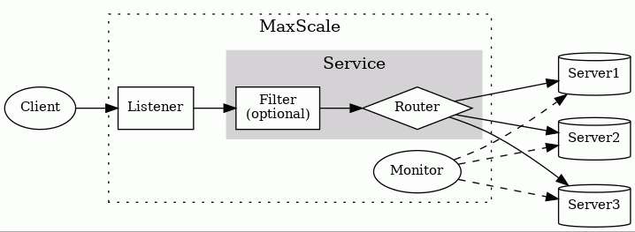

Full tutorial: https://mariadb.com/docs/maxscale

# MariaDB MaxScale

MaxScale là database proxy/router/load balancer đứng giữa application và MariaDB Server. Nó hiểu MariaDB/MySQL protocol, nhận connection từ client rồi forward SQL statement tới một hoặc nhiều backend server dựa trên rule, trạng thái server và loại workload.



## 1. MaxScale dùng để làm gì?

| Nhóm chức năng | Mục đích |
| --- | --- |
| Routing / Load balancing | Route query tới server phù hợp; `readwritesplit` gửi write về primary và phân phối read sang replica. |
| High availability / Failover | Monitor backend, phát hiện server lỗi, hỗ trợ chuyển traffic sang server còn khỏe. |
| Maintenance | Có thể đưa backend vào maintenance mode để patch/upgrade mà giảm ảnh hưởng tới client. |
| Security / Traffic control | Có thể lọc query, ghi audit log, giới hạn traffic, hỗ trợ authentication proxying. |
| Cache SELECT | Cache filter có thể cache và tái sử dụng kết quả `SELECT` để giảm tải backend. |
| Kafka / CDC / ETL | Có router/importer để stream dữ liệu giữa MariaDB và Kafka, hoặc hỗ trợ luồng ETL. |
| Protocol compatibility | Client MariaDB/MySQL thường không cần đổi code, chỉ đổi host/port sang MaxScale. |
| Deployment | Có thể chạy on-premises hoặc cloud, miễn network/backend được cấu hình đúng. |

## 2. Các thành phần chính

| Thành phần | Mục đích |
| --- | --- |
| `server` | Khai báo MariaDB backend thật phía sau MaxScale. |
| `monitor` | Theo dõi trạng thái server: Running, Down, Master, Slave/Replica. |
| `listener` | Mở port để client/application kết nối vào MaxScale. |
| `service` | Xử lý connection và route query tới backend server. |
| `router` | Quyết định query đi đâu, ví dụ `readwritesplit`. |
| `filter` | Chèn vào pipeline để log, block, rewrite hoặc inspect query. |
| `maxctrl` / GUI / REST API | Công cụ quản trị, xem trạng thái, chỉnh cấu hình, maintenance. |

## 3. Kiến trúc plugin/module

MaxScale có kiến trúc linh hoạt dựa trên module. Nhiều chức năng được load runtime dưới dạng shared object module, cùng tuân theo một interface cố định gọi là module object.

| Loại module | Mục đích |
| --- | --- |
| `protocol` | Xử lý giao tiếp giữa client và MaxScale, hoặc giữa MaxScale và backend server. |
| `router` | Inspect query và chọn backend phù hợp dựa trên rule, server role và server status. |
| `filter` | Xử lý dữ liệu đi qua MaxScale, thường dùng để log query hoặc chỉnh query/response. |

Một số router/filter thường gặp:

| Module | Mục đích |
| --- | --- |
| `readwritesplit` router | Route theo từng query: write về primary, read sang replica. |
| `readconnroute` router | Route theo từng connection: mỗi connection gắn với một primary/replica tùy cấu hình. |
| `KafkaCDC` router | Stream dữ liệu từ MariaDB database products sang Kafka broker. |
| `KafkaImporter` router | Stream dữ liệu từ Kafka vào MariaDB database products. |
| `cache` filter | Cache kết quả `SELECT` để cải thiện performance. |
| `qlafilter` | Ghi log query, phục vụ audit hoặc phân tích traffic. |
| `regexfilter` | Match query bằng regex để log, modify hoặc route query tới server cụ thể. |

Về runtime, MaxScale tận dụng asynchronous I/O của Linux. `epoll` cung cấp event-driven I/O qua socket, kết hợp với số lượng worker thread cố định hoặc tự động theo `threads=auto`.

## 4. Config read-write service cơ bản

File cấu hình thường nằm ở:

```text
/etc/maxscale.cnf
```

```ini
[maxscale]                    # Cấu hình global của MaxScale process
threads=auto                  # Tự động chọn số worker threads

[server1]                     # MariaDB backend server thứ nhất
type=server                   # Section này là một database server
address=127.0.0.1             # Địa chỉ MariaDB Server
port=3306                     # Port MariaDB Server

[MariaDB-Monitor]             # Monitor theo dõi các MariaDB backend
type=monitor                  # Section này là monitor
module=mariadbmon             # Module monitor dành cho MariaDB
servers=server1               # Danh sách server được monitor
user=maxscale                 # User MaxScale dùng để connect vào MariaDB
password=maxscale_passwd      # Password của user trên
monitor_interval=2s           # Tần suất kiểm tra trạng thái server

[Read-Write-Listener]         # Cổng lắng nghe cho client/application
type=listener                 # Section này là listener
service=Read-Write-Service    # Connection vào listener sẽ được đẩy vào service này
port=4006                     # Client kết nối tới MaxScale qua port 4006

[Read-Write-Service]          # Service xử lý và route query
type=service                  # Section này là service
router=readwritesplit         # Router chia read/write khi có primary + replicas
cluster=MariaDB-Monitor       # Lấy danh sách server/trạng thái từ monitor
user=maxscale                 # User dùng để đọc user account và auth info
password=maxscale_passwd      # Password của user trên
```

Với một server duy nhất, `readwritesplit` chưa chia read/write thật sự. Tất cả query vẫn đi về `server1`.

## 5. User cần tạo trong MariaDB

```sql
CREATE USER 'maxscale' IDENTIFIED BY 'maxscale_passwd'; -- User cho MaxScale đăng nhập vào MariaDB
GRANT ALL PRIVILEGES ON *.* TO 'maxscale';              -- Quyền demo; production nên cấp quyền tối thiểu
```

User này được dùng cho:

- monitor server
- đọc thông tin user/host để MaxScale xác thực client
- service/router làm việc với backend

## 6. Mở rộng thành read-write split thật

Khi có primary và replicas, khai báo thêm backend server. Monitor sẽ biết server nào là Primary/Master và server nào là Replica/Slave; router dùng thông tin đó để quyết định nơi gửi query.

```ini
[server1]                     # Primary
type=server
address=127.0.0.1
port=3306

[server2]                     # Replica 1
type=server
address=127.0.0.1
port=3307

[server3]                     # Replica 2
type=server
address=127.0.0.1
port=3308

[MariaDB-Monitor]             # Monitor cả cụm replication
type=monitor
module=mariadbmon
servers=server1,server2,server3 # Các server trong replication topology
user=maxscale
password=maxscale_passwd
monitor_interval=2s
```

Lúc này `readwritesplit` có thể route như sau:

| Query | Nơi đi |
| --- | --- |
| `INSERT`, `UPDATE`, `DELETE` | Primary/Master |
| `SELECT` thông thường | Replica/Slave, có thể load balance qua nhiều replica |
| Query trong transaction | Thường về Primary để giữ consistency |
| Query phụ thuộc session state | Thường về Primary |

Nếu primary lỗi, MaxScale có thể phát hiện qua monitor và hỗ trợ failover/switchover tùy cấu hình topology.

## 7. Thêm query log filter

Filter được chèn vào service pipeline để log, kiểm soát hoặc xử lý query. Ví dụ dưới dùng `qlafilter` để ghi log query đi qua MaxScale, phục vụ audit hoặc phân tích traffic.

```ini
[MyLogFilter]                         # Filter dùng để ghi log query
type=filter                           # Section này là filter
module=qlafilter                      # Query Log All Filter
filebase=/var/log/maxscale/query_log  # Tên file log gốc
log_type=unified                      # Ghi vào một file .unified
flush=true                            # Flush mỗi query, để xem log gần realtime

[Read-Write-Service]                  # Service cần gắn filter
type=service
filters=MyLogFilter                   # Tất cả query qua service sẽ chạy qua filter này
router=readwritesplit
cluster=MariaDB-Monitor
user=maxscale
password=maxscale_passwd
```

File log tạo ra:

```text
/var/log/maxscale/query_log.unified
```

## 8. Bật GUI quản trị

```ini
[maxscale]                    # Cấu hình global của MaxScale
threads=auto
admin_secure_gui=false        # Cho phép mở GUI bằng HTTP khi test local
```

Truy cập:

```text
http://127.0.0.1:8989
```

Tài khoản demo:

```text
username: admin
password: mariadb
```

GUI dùng để xem status, server, monitor, service, listener, filter, cấu hình MaxScale và một số thao tác quản trị.

## 9. Listener có thành SPOF không?

`listener` chỉ là cổng lắng nghe trong một MaxScale process. SPOF thực tế thường là MaxScale instance hoặc server đang chạy MaxScale.

```text
Application
    |
    v
VIP / Load Balancer / DNS
    |
    +--> MaxScale node 1
    |
    +--> MaxScale node 2
    |
    +--> MaxScale node 3
    |
    v
MariaDB backend cluster
```

Production nên chạy ít nhất 2 MaxScale instances trên các host khác nhau. Phía trước có thể dùng:

| Cách | Mục đích |
| --- | --- |
| HAProxy/nginx stream/cloud load balancer | Active-active hoặc active-standby TCP load balancing cho MaxScale. |
| Keepalived + VIP | Một IP ảo trỏ vào MaxScale active; node lỗi thì VIP chuyển sang node khác. |
| DNS failover | Đổi endpoint khi MaxScale node lỗi, thường phụ thuộc TTL và client behavior. |
| Kubernetes Service | Dùng khi MaxScale chạy trong Kubernetes. |

Với database traffic, connection là stateful. Load balancer nên chạy TCP mode, health check đúng port/listener, và không tự ý cắt connection đang dùng.

## 10. Nên có mấy service?

Nguyên tắc: một service đại diện cho một policy routing/security/filter riêng.

```text
1 service = 1 kiểu behavior
1 listener = 1 cổng vào trỏ tới service
```

Không cần tạo service theo từng table hoặc từng app nếu behavior giống nhau. Chỉ tách service khi cần routing, quyền truy cập, filter hoặc mục đích vận hành khác nhau.

| Service | Router thường dùng | Mục đích |
| --- | --- | --- |
| `RW-Service` | `readwritesplit` | App traffic bình thường, vừa read vừa write. |
| `RO-Service` | `readconnroute` tới replicas | Reporting, dashboard, batch read-heavy, không ghi. |
| `Admin-Service` | `readconnroute` tới primary | Migration, admin tool, job cần đi thẳng primary. |
| `Audit-Service` | `readwritesplit` + filter | Traffic cần log/audit/security rule riêng. |

Mapping port thường gặp:

```text
:4006 -> RW-Service    -> readwritesplit -> primary + replicas
:4007 -> RO-Service    -> readconnroute  -> replicas
:4008 -> Admin-Service -> readconnroute  -> primary
```

Baseline nhỏ có thể chỉ cần một `Read-Write-Service`. Production thường bắt đầu với `RW-Service` và `RO-Service`, rồi thêm `Admin-Service` hoặc `Audit-Service` khi có nhu cầu rõ.

## 11. Giới hạn cần nhớ

Không cần thuộc hết limitations, nhưng khi dùng MaxScale trong môi trường thật nên nhớ các điểm sau:

| Nhóm | Ghi chú |
| --- | --- |
| Config | Bản MaxScale rất cũ từng giới hạn độ dài dòng config và tên section; bản mới đã nới rộng đáng kể. |
| Nhiều MaxScale cùng server | Có thể chạy nhiều instance, nhưng thư mục runtime/config/log phải tách rõ để tránh conflict connection/port. |
| SQL parser / firewall | Một số cú pháp phức tạp như `WITH` hoặc query lồng sâu có thể làm MaxScale không nhận diện đủ column/table cho rule bảo mật. |
| Default MariaDB values | MaxScale giả định một số default như `autocommit` bật và transaction mặc định có `READ WRITE`. |
| Transaction detection | MaxScale suy luận transaction state bằng cách parse SQL; prepared statement hoặc cú pháp phức tạp có thể làm state nội bộ lệch với database thật. |
| XA transaction | MaxScale xử lý khoảng giữa `XA START` và `XA END` gần giống transaction thường; XA và transaction thường có thể gây tình huống state khó đoán nếu dùng lẫn. |
| Prepared statement | Không nên commit/rollback transaction hoặc đổi `autocommit` bằng prepared statement nếu muốn MaxScale route chính xác. |
| Protocol / `KILL` | Một số dạng `KILL`, `KILL QUERY ID`, prepared `KILL`, `COM_CHANGE_USER` có behavior đặc biệt hoặc giới hạn. |
| Authenticator | Password kiểu MySQL rất cũ không được hỗ trợ; user có password khác nhau theo host có thể làm MaxScale không biết nên dùng password nào tới backend. |
| Filter | Tee filter không đảm bảo prepared statement binary protocol chạy giống nhau trên service chính và branch service. |
| Monitor | Một server chỉ nên được monitor bởi một monitor; nhiều monitor cùng theo dõi một server bị xem là lỗi. |
| Galera monitor | Chọn master mặc định dựa trên `wsrep_local_index`, có thể điều chỉnh bằng priority. |
| ETL | ETL dùng MariaDB Connector/ODBC; driver cũ có thể crash/memory leak, một số object PostgreSQL không migrate tự động. |

## 12. Lệnh kiểm tra nhanh

```bash
sudo systemctl start maxscale       # Start MaxScale
sudo systemctl status maxscale      # Kiểm tra process có running không
sudo systemctl stop maxscale        # Stop MaxScale
sudo systemctl restart maxscale     # Restart sau khi sửa config

maxctrl list servers                # Xem danh sách server và trạng thái
maxctrl show servers                # Xem chi tiết server
maxctrl show monitors               # Xem chi tiết monitor

tail -f /var/log/maxscale/maxscale.log          # Xem log chính của MaxScale
tail -f /var/log/maxscale/query_log.unified     # Xem query log nếu bật qlafilter
```

## 13. Cách đọc nhanh config

```text
[serverX]       = database backend thật
[Monitor]       = người quan sát backend
[Listener]      = cổng vào cho client
[Service]       = logic route query
router=...      = cách route query
filters=...     = các bước xử lý/log query chèn thêm
```

## 14. Tham khảo khi cần đào sâu

| Chủ đề | Gợi ý đọc |
| --- | --- |
| Cài đặt MaxScale | MariaDB MaxScale Installation Guide |
| Tham số cấu hình | MariaDB MaxScale Configuration Guide |
| Router `readwritesplit` | ReadWriteSplit documentation |
| Router khác | ReadConnRoute, KafkaCDC, KafkaImporter documentation |
| Filter | QLAFilter, RegexFilter, Cache filter documentation |
| Monitor/failover | MariaDB Monitor documentation |
| Limitations | MaxScale limitations and known issues theo đúng version đang dùng |
| Báo bug | MariaDB Jira |
| Thảo luận cộng đồng | MariaDB MaxScale Google Group hoặc forum |
