<!--
Nguồn: Google Docs
Nội dung câu chữ và hình ảnh được giữ nguyên; chỉ bổ sung Markdown để dễ đọc.
-->

- **DevOps (Development and Operations: phương pháp kết hợp phát triển phần mềm với vận hành):** https://chat.deepseek.com/a/chat/s/121532f4-df5d-4dfc-9714-3d4fb1139016

- **Subnet (mạng con), network address (địa chỉ đại diện cho subnet), broadcast address (địa chỉ IPv4 gửi tới mọi host trong subnet).**

- **CCNA (Cisco Certified Network Associate: chứng chỉ kiến thức mạng nền tảng của Cisco).**

- https://www.geeksforgeeks.org/computer-networks/computer-network-tutorials/

- https://vnpro.vn/chuong-trinh-dao-tao/khoa-hoc-ccna-online-200301-78.html

# Computer Network

- **Computer network:** hệ thống kết nối nhiều thiết bị để chúng trao đổi dữ liệu và dùng chung tài nguyên. Mục đích là giúp thiết bị không phải hoạt động cô lập; ví dụ laptop có thể dùng Internet, truy cập file trên server và in qua máy in mạng.

- **Node:** một điểm tham gia mạng, có thể tạo, nhận hoặc chuyển tiếp dữ liệu. Máy tính và điện thoại là node đầu cuối; switch và router là node trung gian.

- **Communication link/media:** phương tiện thực sự mang tín hiệu giữa hai điểm, ví dụ cáp đồng, cáp quang hoặc sóng Wi-Fi. Nó giải quyết bài toán “dữ liệu đi bằng gì”; còn protocol giải quyết “hai bên phải gửi và hiểu dữ liệu theo quy tắc nào”.

- **Resource sharing:** cho phép nhiều thiết bị dùng chung tài nguyên thay vì mỗi máy phải có một bản riêng; ví dụ cả văn phòng dùng chung máy in, đường Internet, file server hoặc database.

- **Port vật lý:** cổng trên thiết bị để gắn một đường kết nối, ví dụ port Ethernet trên switch. **Port logic TCP/UDP** lại là con số giúp hệ điều hành chuyển dữ liệu tới đúng ứng dụng; ví dụ cùng một server nhưng port `443` dành cho HTTPS và port `22` dành cho SSH.

## Interface trong ngữ cảnh network

- **Network interface (giao diện mạng):** điểm mà một thiết bị kết nối với một mạng để gửi và nhận dữ liệu. Có thể hiểu interface là “cửa ra/vào mạng” của thiết bị. Hệ điều hành và router chọn một interface đầu ra khi cần chuyển packet tới đích.

- Một thiết bị có thể có nhiều interface và mỗi interface nối thiết bị với một môi trường hoặc mạng khác nhau. Ví dụ laptop có interface Ethernet và Wi-Fi; router gia đình có interface LAN hướng vào mạng nội bộ và interface WAN hướng tới ISP.

### Các loại interface

| Loại | Giải thích | Ví dụ |
|---|---|---|
| **Physical interface (interface vật lý)** | Gắn với phần cứng truyền/nhận tín hiệu qua cáp hoặc sóng vô tuyến | Card Ethernet, Wi-Fi; tên thường gặp như `eth0`, `enp0s3`, `wlan0` |
| **Virtual/logical interface (interface ảo/logic)** | Do hệ điều hành hoặc phần mềm tạo ra, không nhất thiết tương ứng với một card mạng riêng | Loopback `lo`, VPN `tun0`, VLAN subinterface, bridge, Docker interface |

### Interface liên quan tới IP và MAC như thế nào?

- **IP thường được gán cho interface, không phải gán chung chung cho toàn bộ thiết bị.** Vì một thiết bị có nhiều interface nên nó có thể có nhiều IP; ví dụ Wi-Fi dùng `192.168.1.20`, Ethernet dùng `10.0.0.20`.
- Interface Ethernet/Wi-Fi thường có **MAC address** để giao tiếp trên link Layer 2. Interface ảo có thể có MAC hoặc không, tùy loại và công nghệ.
- **Routing table** ánh xạ mạng đích tới next hop và interface đầu ra. Khi gửi packet, hệ điều hành chọn route phù hợp nhất, lấy source IP thích hợp của interface đó rồi chuyển packet qua interface.
- Interface thường có thêm cấu hình như subnet prefix, MTU, trạng thái `up/down` và có thể thuộc một VLAN hoặc security zone.

Ví dụ laptop truy cập Internet qua Wi-Fi:

1. Hệ điều hành thấy route mặc định đi qua interface Wi-Fi.
2. Packet dùng IP nguồn của interface Wi-Fi.
3. Interface Wi-Fi tạo frame và gửi tới default gateway qua sóng vô tuyến.
4. Nếu người dùng bật VPN, route tới một số đích có thể chuyển sang interface ảo như `tun0`; phần mềm VPN tiếp tục đóng gói dữ liệu và gửi packet bên ngoài qua interface Wi-Fi.

> **Không nên nhầm các khái niệm:** network interface là điểm kết nối của thiết bị với mạng; port vật lý là đầu cắm/cổng phần cứng; port TCP/UDP xác định ứng dụng hoặc process; còn API/interface trong lập trình là hợp đồng để các thành phần phần mềm tương tác.

### Node được chia làm 2 loại:

| Loại node | Nội dung nguyên bản |
|---|---|
| End nodes | **End node/end system/host:** nơi ứng dụng tạo ra hoặc sử dụng dữ liệu. Ví dụ trình duyệt trên laptop tạo HTTP request, còn web server là nơi xử lý request đó. |
| Intermediary nodes | **Intermediary node:** thiết bị giúp dữ liệu đi từ nguồn tới đích nhưng thường không phải nơi sử dụng nội dung cuối cùng. Switch chuyển frame trong LAN, router đưa packet sang mạng khác, firewall kiểm soát packet có được đi qua hay không. |

### Phân loại network (mỗi một vùng xanh xanh bên dưới sẽ đại diện cho 1 network)

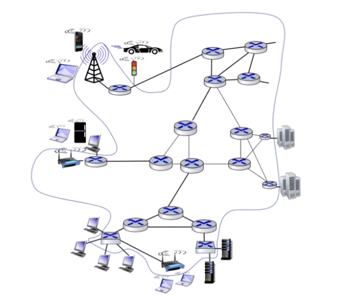

*Phân loại các network trong Internet*

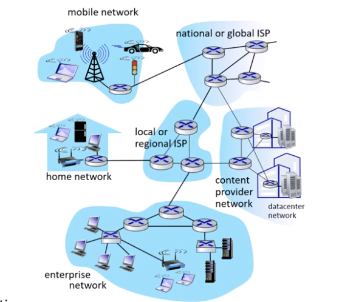

*Phân loại các network trong Internet*

| Loại network | Nội dung nguyên bản |
|---|---|
| Home network | **Home network (mạng gia đình):** mạng kết nối các thiết bị trong nhà như máy tính, điện thoại, TV và thiết bị IoT. |
| Enterprise network | Mạng phục vụ một tổ chức, cần phân chia phòng ban, quản lý tập trung, dự phòng và kiểm soát truy cập. VLAN thường được dùng để tạo nhiều mạng logic trên cùng hệ thống switch. |
| Mobile network | **Mobile network (mạng di động):** mạng vô tuyến cho phép thiết bị di chuyển giữa các vùng phủ sóng, ví dụ mạng 4G/5G. |
| Content provider network | **Content provider network (mạng của nhà cung cấp nội dung):** hạ tầng riêng của công ty như YouTube hoặc Netflix để lưu trữ, xử lý và đưa lượng nội dung lớn tới người dùng. |

- Vì vậy, Internet thường được gọi là **network of networks (mạng của các mạng)**: rất nhiều mạng độc lập kết nối và trao đổi dữ liệu với nhau.

## Phân loại quy mô

Mạng có thể được phân loại theo phạm vi địa lý mà nó kết nối. Ranh giới giữa các loại chỉ mang tính tương đối; không có một số mét, số km hoặc tốc độ cố định để quyết định mạng thuộc loại nào.

| Loại mạng | Phạm vi điển hình | Mục đích và ví dụ | Công nghệ/thiết bị thường gặp | Chủ thể quản lý |
|---|---|---|---|---|
| **PAN (Personal Area Network)** | Xung quanh một người, thường trong vài mét | Kết nối các thiết bị cá nhân ở khoảng cách ngắn, ví dụ điện thoại với tai nghe Bluetooth hoặc đồng hồ thông minh | Bluetooth, NFC, USB, Wi-Fi Direct | Một cá nhân |
| **LAN (Local Area Network)** | Nhà ở, phòng làm việc, một tầng hoặc một tòa nhà | Tạo một miền mạng nội bộ tốc độ cao để máy tính, máy in và server giao tiếp trực tiếp | Ethernet, switch, router, access point | Cá nhân hoặc một tổ chức |
| **WLAN** | Phạm vi tương tự LAN nhưng thiết bị kết nối bằng sóng vô tuyến | Giúp thiết bị di động vào LAN mà không cần cáp; ví dụ Wi-Fi tại nhà hoặc văn phòng | Wi-Fi và access point | Cá nhân hoặc một tổ chức |
| **CAN (Campus Area Network)** | Nhiều tòa nhà trong cùng khuôn viên | Gom các LAN của trường, bệnh viện hoặc nhà máy thành một mạng do cùng tổ chức quản lý | Ethernet tốc độ cao, cáp quang, switch Layer 3, router | Một tổ chức |
| **MAN (Metropolitan Area Network)** | Một đô thị hoặc khu vực liên đô thị | Nối nhiều cơ sở trong cùng thành phố, thường qua hạ tầng Metro Ethernet của nhà cung cấp | Metro Ethernet, cáp quang, microwave link | ISP, chính quyền hoặc tổ chức lớn |
| **WAN (Wide Area Network)** | Nhiều tỉnh, quốc gia hoặc châu lục | Kết nối các LAN ở xa nhau qua hạ tầng của nhà mạng; ví dụ nối trụ sở Hà Nội với chi nhánh TP.HCM | MPLS, leased line, SD-WAN, cáp quang đường dài/cáp biển, microwave, vệ tinh | Một hoặc nhiều nhà mạng/tổ chức |
| **GAN (Global Area Network)** | Toàn cầu | Mô tả hệ thống hoạt động toàn thế giới bằng cách ghép nhiều WAN | Kết hợp nhiều công nghệ WAN | Nhiều tổ chức và nhà mạng |

### Những điểm cần phân biệt

- **Phạm vi, không phải tốc độ, là tiêu chí chính:** LAN thường có **latency/độ trễ (thời gian dữ liệu đi từ nguồn tới đích)** thấp và **bandwidth/băng thông (dung lượng truyền tối đa lý thuyết của đường truyền)** cao hơn WAN, nhưng một WAN hiện đại vẫn có thể nhanh hơn một LAN cũ. Vì vậy không thể phân loại chỉ dựa vào **Mbps/Gbps (megabit/gigabit mỗi giây)**.
- **Internet không phải một WAN đơn lẻ:** Internet dùng TCP/IP làm ngôn ngữ chung để rất nhiều mạng độc lập có thể kết nối và chuyển dữ liệu qua nhau.
- **CAN và GAN không phổ quát bằng LAN/MAN/WAN:** các tài liệu có thể bỏ qua hai thuật ngữ này. `CAN` trong phần này là **Campus Area Network**, không phải giao thức **Controller Area Network** dùng trong ô tô và hệ thống nhúng.
- **LAN hiện đại:** thiết bị có dây thường kết nối qua switch; thiết bị không dây kết nối qua access point. Hub và bridge rời chủ yếu có ý nghĩa lịch sử hoặc phục vụ học nguyên lý.
- **Kết nối nhiều mạng:** router hoặc switch Layer 3 đọc IP để chuyển packet sang mạng khác. Switch Layer 2 đọc MAC để chuyển frame trong cùng LAN/VLAN. Nói ngắn gọn: Layer 2 xử lý một chặng cục bộ, Layer 3 đưa dữ liệu đi qua nhiều mạng.
- **Quyền sở hữu không quyết định tuyệt đối loại mạng:** LAN thường do một cá nhân/tổ chức quản lý, còn MAN/WAN thường phải thuê hoặc dùng hạ tầng của nhà cung cấp dịch vụ.
- **VPN không phải một loại mạng theo quy mô:** nó tạo tunnel trên hạ tầng có sẵn để nối người dùng hoặc địa điểm từ xa, bất kể mạng gốc là LAN hay WAN.

### VPN (Virtual Private Network)

**VPN (Virtual Private Network)** tạo một đường truyền logic trên một mạng không tin cậy như Internet. Mục đích là để hai thiết bị/mạng giao tiếp như có một đường riêng và có thể bảo vệ dữ liệu khỏi người quan sát ở giữa. Ví dụ: laptop ở nhà dùng VPN để truy cập server nội bộ của công ty.

- **Tunnel:** đóng packet gốc vào một packet khác để chở qua mạng trung gian. Tunnel giải quyết việc vận chuyển traffic của một mạng qua mạng khác, nhưng không mặc nhiên bảo mật.
- **Encryption:** làm nội dung không đọc được nếu không có khóa; dùng để bảo vệ bí mật dữ liệu.
- **Authentication:** xác minh đầu bên kia thực sự là ai, tránh kết nối nhầm kẻ giả mạo.
- **Integrity:** phát hiện packet đã bị sửa trên đường truyền.

Ví dụ GRE tạo tunnel nhưng không tự mã hóa; IPsec có thể bổ sung mã hóa, xác thực và integrity.

#### Thành phần chính

| Thành phần | Vai trò |
|---|---|
| **VPN client/peer (máy khách/đầu ngang hàng VPN)** | Phần mềm hoặc thiết bị khởi tạo/kết thúc tunnel, mã hóa và giải mã traffic. **Peer** là một đầu tham gia giao tiếp ngang hàng; trong site-to-site, hai đầu thường được gọi là VPN peer/gateway. |
| **VPN gateway/server (cổng/máy chủ VPN)** | Xác thực peer/người dùng, kết thúc tunnel, cấp cấu hình mạng và chuyển tiếp packet theo chính sách. **Gateway** là điểm nối/chuyển traffic giữa các mạng. |
| **Virtual network interface (giao diện mạng ảo)** | Interface logic như `tun0`, được hệ điều hành coi gần giống card mạng để đưa traffic phù hợp vào tunnel. **Interface** là điểm mà thiết bị gửi/nhận dữ liệu với mạng. |
| **VPN protocol** | Quy định hai đầu tìm nhau, xác thực, tạo khóa và đóng gói packet như thế nào. Nếu hai đầu không dùng cùng protocol/cấu hình, tunnel không thể được thiết lập; ví dụ WireGuard, OpenVPN hoặc IKEv2/IPsec. |
| **Routing và policy** | Quyết định traffic nào được đưa vào tunnel và người dùng được truy cập đích nào. Ví dụ chỉ route `10.0.0.0/8` qua VPN, đồng thời dùng DNS nội bộ để phân giải tên server công ty. |

> **OpenVPN không chỉ là VPN client:** đây là phần mềm và giao thức VPN mã nguồn mở có cả phía client lẫn server. UDP `1194` là cổng mặc định phổ biến nhưng có thể cấu hình cổng và transport khác; TCP `443` không phải yêu cầu bắt buộc.

#### Các loại VPN phổ biến

| Loại | Kết nối | Trường hợp sử dụng |
|---|---|---|
| **Remote-access VPN (VPN truy cập từ xa)** | Một thiết bị người dùng ↔ VPN gateway | Nhân viên từ nhà truy cập server, **database (cơ sở dữ liệu)** hoặc máy tính trong công ty |
| **Site-to-site VPN (VPN nối hai mạng)** | Gateway của mạng A ↔ gateway của mạng B | Kết nối LAN trụ sở với LAN chi nhánh; máy người dùng thường không chạy VPN client |
| **Consumer VPN (VPN cho người dùng cá nhân)** | Thiết bị người dùng ↔ máy chủ nhà cung cấp VPN | Bảo vệ traffic trên mạng không tin cậy hoặc thay đổi địa chỉ IP thoát ra Internet |
| **Host-to-host VPN (VPN giữa hai máy)** | Một máy ↔ một máy | Bảo vệ trực tiếp traffic giữa hai host cụ thể |

Remote-access và site-to-site là hai mô hình khác nhau, không nên gộp thành một loại.

#### Client-to-server VPN

**Client-to-server VPN** là mô hình nhiều VPN client chủ động kết nối tới một VPN server/gateway trung tâm. Server xác thực client, cấp IP/route/DNS, kết thúc tunnel và chuyển tiếp traffic tới mạng nội bộ hoặc Internet. Mô hình này còn thường được gọi là **client-server VPN**; remote-access VPN và consumer VPN thường được triển khai theo cách này.

```text
Laptop/điện thoại -- tunnel mã hóa --> VPN server/gateway --> Mạng nội bộ hoặc Internet
```

**Ví dụ thực tế:**

- Nhân viên làm việc tại nhà chạy Cisco AnyConnect, OpenVPN hoặc WireGuard client để kết nối tới VPN gateway của công ty, sau đó truy cập GitLab, database, file server hoặc máy tính nội bộ.
- Người dùng điện thoại kết nối tới máy chủ của một consumer VPN. Website trên Internet nhìn thấy public IP thoát của VPN server thay vì public IP của mạng di động.
- Quản trị viên tự đặt WireGuard server trên VPS để dùng một điểm truy cập bảo mật khi quản trị các hệ thống của mình.

**Use case phù hợp:**

- Tổ chức cần quản lý tập trung người dùng, quyền truy cập, route và nhật ký.
- Thiết bị client thường nằm sau NAT hoặc đổi mạng liên tục và chỉ cần chủ động kết nối ra một server có địa chỉ ổn định.
- Muốn tất cả hoặc một phần traffic đi qua một điểm kiểm soát chung như firewall, IDS/IPS hoặc Internet gateway.

| Ưu điểm | Nhược điểm |
|---|---|
| Cấu hình, xác thực, thu hồi quyền và logging tập trung | VPN server có thể trở thành điểm lỗi đơn hoặc nút thắt băng thông nếu không có dự phòng/mở rộng |
| Client chỉ cần biết địa chỉ server; dễ hoạt động qua NAT hơn kết nối trực tiếp giữa các client | Traffic giữa hai client có thể phải đi vòng qua server, làm tăng latency và tải gateway |
| Dễ áp firewall policy, DNS và route thống nhất | Server có khả năng quan sát traffic sau khi giải mã nên phải được bảo vệ và tin cậy |
| Phù hợp với số lượng lớn người dùng từ xa | Chi phí vận hành tăng theo số connection, throughput và yêu cầu high availability |

#### Peer-to-peer VPN

**Peer-to-peer VPN (P2P VPN)** là mô hình các đầu tham gia được xem là **peer ngang hàng** và có thể tạo tunnel trực tiếp với nhau, thay vì mọi traffic bắt buộc phải đi qua một VPN server trung tâm. Mỗi peer vừa có thể gửi vừa có thể nhận traffic VPN.

```text
Peer A <========== tunnel trực tiếp ==========> Peer B
             \                               /
              \=========> Peer C <==========/
```

Thuật ngữ này cần hiểu theo ngữ cảnh:

- Tunnel trực tiếp giữa hai máy là **host-to-host VPN**.
- Tunnel giữa hai router/gateway để nối hai LAN là **site-to-site VPN**; hai gateway là hai peer.
- Nhiều peer kết nối trực tiếp hoặc tạo **mesh VPN (VPN dạng lưới)** để các máy/site giao tiếp với nhau mà không luôn đi qua một gateway trung tâm.
- Hệ thống P2P vẫn có thể dùng một **coordination/control server** để đăng nhập, phân phối public key, policy và giúp các peer tìm nhau. Server này quản lý control plane nhưng traffic dữ liệu có thể truyền trực tiếp giữa các peer. Nếu NAT/firewall không cho kết nối trực tiếp, hệ thống có thể phải dùng relay.

**Ví dụ thực tế:**

- Hai router tại trụ sở và chi nhánh tạo IPsec site-to-site tunnel để hai mạng `10.1.0.0/16` và `10.2.0.0/16` giao tiếp.
- Hai server tạo WireGuard tunnel trực tiếp để đồng bộ database hoặc backup qua Internet.
- Các thiết bị trong một mạng Tailscale/ZeroTier tạo kết nối trực tiếp khi có thể; dịch vụ điều phối hỗ trợ nhận diện và phân phối cấu hình, còn relay được dùng khi kết nối trực tiếp thất bại.

**Use case phù hợp:**

- Nối hai hoặc nhiều văn phòng, cloud VPC/VNet hoặc server cần giao tiếp thường xuyên.
- Cần đường truyền trực tiếp để giảm latency và tránh đưa toàn bộ traffic qua một gateway trung tâm.
- Xây dựng overlay network giữa nhiều máy ở các vị trí khác nhau.

| Ưu điểm | Nhược điểm |
|---|---|
| Đường dữ liệu trực tiếp thường có latency thấp và không tạo nút thắt tại gateway trung tâm | Số tunnel và cấu hình tăng nhanh khi số peer lớn; full mesh có tối đa `n(n-1)/2` kết nối |
| Một peer/gateway lỗi không nhất thiết làm toàn bộ các peer khác mất kết nối | NAT traversal, firewall và IP động có thể khiến kết nối trực tiếp khó thiết lập |
| Phân tán tải và có thể giảm chi phí bandwidth của server trung tâm | Quản lý key, policy, route, logging và thu hồi quyền phức tạp nếu không có control plane |
| Phù hợp với site-to-site, host-to-host và mesh | Peer bị xâm nhập có thể trở thành đường vào các peer/mạng khác nếu phân quyền quá rộng |

> **Điểm khác nhau cốt lõi:** client-to-server tập trung data plane qua một gateway; peer-to-peer ưu tiên tunnel trực tiếp giữa các peer. Tuy nhiên đây không phải ranh giới tuyệt đối: một sản phẩm có thể dùng server để quản lý nhưng vẫn truyền dữ liệu P2P, hoặc dùng P2P trước rồi chuyển sang relay khi không kết nối trực tiếp được.

#### VPN để truy cập nội bộ và VPN để truy cập Internet

VPN không chỉ có một mục đích. Cùng là client-to-server VPN nhưng route và policy khác nhau sẽ tạo ra hai cách sử dụng chính.

##### 1. Truy cập tài nguyên nội bộ

Mục tiêu là cho người dùng ở bên ngoài truy cập các tài nguyên private không được công khai trực tiếp trên Internet, ví dụ:

- Server, database, GitLab, Jenkins, file share, API nội bộ.
- Máy tính văn phòng qua RDP/SSH.
- Dịch vụ chỉ có private IP hoặc DNS nội bộ như `app.internal.company`.

Luồng điển hình:

```text
Laptop ở nhà --> VPN gateway công ty --> Server nội bộ
YouTube       --> Router/ISP tại nhà --> Internet
```

VPN client thường được cấp route tới các subnet công ty, ví dụ `10.0.0.0/8`, và có thể nhận DNS nội bộ. Đây thường là **split tunnel**: traffic tới mạng nội bộ đi qua VPN, còn traffic Internet thông thường đi trực tiếp qua router/ISP của người dùng.

**Ưu điểm:**

- Không phải public trực tiếp từng database, SSH hoặc RDP ra Internet.
- Tiết kiệm bandwidth và tải cho VPN gateway vì traffic Internet không phải đi vòng qua công ty.
- Truy cập Internet công cộng thường có latency thấp hơn.

**Nhược điểm/rủi ro:**

- Thiết bị client đồng thời nối Internet và mạng công ty, nên máy bị malware có thể trở thành cầu nối tấn công nếu endpoint security và firewall yếu.
- Công ty không quan sát hoặc áp policy lên phần traffic Internet đi trực tiếp.
- Route, DNS hoặc subnet trùng nhau có thể làm tài nguyên nội bộ không truy cập được.
- Kết nối VPN chỉ tạo đường tới mạng; firewall/ACL vẫn phải giới hạn người dùng được vào đúng dịch vụ cần thiết.

##### 2. Truy cập Internet thông qua VPN

Mục tiêu là đưa traffic Internet của client tới VPN gateway trước, sau đó gateway NAT và chuyển tiếp traffic ra Internet:

```text
Laptop/điện thoại --> tunnel VPN --> VPN gateway/exit node --> Website Internet
```

Đây thường là **full tunnel** hoặc cấu hình **exit node**. Website nhìn thấy public IP của VPN gateway; ISP hoặc Wi-Fi cục bộ chủ yếu thấy client đang kết nối tới VPN gateway nhưng vẫn thấy metadata như thời gian và dung lượng.

**Use case thực tế:**

- Consumer VPN đưa traffic ra Internet qua máy chủ ở một vị trí khác.
- Công ty bắt buộc máy nhân viên từ xa truy cập Internet qua firewall/proxy công ty để lọc malware, URL và ghi log.
- Người dùng tự vận hành VPN tại nhà/VPS để bảo vệ đoạn kết nối trên Wi-Fi không tin cậy.

**Ưu điểm:**

- Bảo vệ traffic trên đoạn client tới VPN gateway khỏi mạng Wi-Fi/ISP cục bộ; HTTPS vẫn cần thiết để bảo vệ và xác thực tới website cuối.
- Có thể áp chính sách Internet tập trung tại gateway.
- Website thường thấy IP của gateway thay vì IP mạng hiện tại của client.

**Nhược điểm/rủi ro:**

- Traffic đi vòng qua gateway nên có thể tăng latency, giảm throughput và tốn bandwidth.
- VPN gateway/provider trở thành bên có khả năng quan sát metadata và một số traffic chưa được mã hóa; người dùng phải tin cậy đơn vị vận hành.
- Gateway lỗi có thể làm mất cả truy cập Internet nếu không có failover hoặc policy phù hợp.
- VPN không tạo ẩn danh tuyệt đối và không tự chống phishing, malware, cookie hoặc browser fingerprint.

| Mục đích | Route thường dùng | Điểm thoát traffic | Ví dụ |
|---|---|---|---|
| **Truy cập nội bộ** | Chỉ các subnet private đi qua VPN | Traffic nội bộ kết thúc tại mạng công ty; Internet thường thoát tại mạng nhà | Nhân viên truy cập database `10.0.1.20` |
| **Truy cập Internet qua VPN** | Default route `0.0.0.0/0` và/hoặc `::/0` đi qua VPN | VPN gateway/exit node | Consumer VPN hoặc Internet filtering của công ty |
| **Kết hợp cả hai** | Subnet nội bộ và default route đều qua VPN | Mạng công ty xử lý nội bộ và đưa Internet ra ngoài | Công ty yêu cầu full tunnel cho máy làm việc từ xa |

#### Full tunnel (đường hầm toàn phần) và split tunnel (đường hầm phân tách)

| Chế độ | Lưu lượng đi qua VPN | Đặc điểm |
|---|---|---|
| **Full tunnel** | Hầu hết traffic, kể cả truy cập Internet công cộng, đi qua VPN | Công ty/VPN provider kiểm soát được toàn bộ traffic nhưng gateway chịu tải lớn hơn |
| **Split tunnel** | Chỉ traffic tới các mạng được chỉ định đi qua VPN | Truy cập tài nguyên công ty qua VPN, còn YouTube hoặc website công cộng đi trực tiếp để tiết kiệm băng thông |

Vì vậy, bật VPN công ty không nhất thiết làm mọi truy cập Internet đi qua công ty. Điều này phụ thuộc vào routing policy được cấp cho client.

#### Luồng hoạt động của remote-access VPN

1. **Kết nối và xác thực:** client liên hệ VPN gateway. Certificate liên kết danh tính với public key để client kiểm tra đúng server; MFA yêu cầu nhiều bằng chứng đăng nhập; session key là khóa ngắn hạn dùng mã hóa traffic của riêng phiên đó.
2. **Cấp cấu hình:** client có thể nhận một IP ảo, DNS và các route được phép. IP ảo này không nhất thiết thuộc cùng subnet Layer 2 với máy công ty; VPN gateway có thể định tuyến giữa subnet VPN và các subnet nội bộ.
3. **Đóng gói:** hệ điều hành chọn interface VPN theo routing table. VPN client mã hóa packet gốc rồi đóng nó trong một packet ngoài có đích là VPN gateway.
4. **Truyền qua Internet:** packet ngoài rời laptop với source IP của interface mạng laptop. Nếu đó là private IPv4, router nhà thực hiện NAT/PAT và thay source IP:port bằng IP:port phía WAN. IP WAN có thể là public IPv4 hoặc có thể tiếp tục bị ISP dịch qua CGNAT. ISP thấy **metadata (dữ liệu mô tả như địa chỉ, thời gian và dung lượng)** nhưng không đọc được **payload (phần nội dung packet mang theo)** đã mã hóa.
5. **Tháo gói và kiểm soát truy cập:** gateway giải mã packet. Firewall/ACL áp rule để quyết định user hoặc IP đó được truy cập đúng dịch vụ nào; kết nối được VPN không có nghĩa được phép vào toàn bộ mạng.
6. **Phản hồi:** packet trả về được gateway mã hóa và đóng gói ngược về client.

Packet có hai lớp địa chỉ khi nằm trong tunnel:

| Lớp packet | IP nguồn | IP đích | Ý nghĩa |
|---|---|---|---|
| **Packet trong (inner)** | IP ảo của VPN client, ví dụ `10.0.5.100` | Máy nội bộ, ví dụ `10.0.1.20` | Giao tiếp logic mà ứng dụng muốn thực hiện |
| **Packet ngoài (outer), sau NAT nhà** | IP WAN của router nhà; trên Internet cuối cùng là public IP sau lớp NAT cuối | Public IP của VPN gateway | Vận chuyển phần dữ liệu đã mã hóa qua Internet |

#### Truy cập Remote Desktop qua VPN

Công ty có thể giữ máy nội bộ không truy cập trực tiếp được từ Internet và chỉ công khai VPN gateway. Sau khi client kết nối:

- Route tới subnet công ty được đưa qua virtual interface.
- Firewall chỉ cho phép đúng người dùng/nhóm và dịch vụ cần thiết, ví dụ RDP cho phép xem và điều khiển desktop Windows từ xa qua port `3389`.
- Người dùng kết nối RDP tới IP/DNS nội bộ của máy đích mà không cần port-forward trực tiếp cổng RDP trên router công ty.
- VPN gateway vẫn phải có một endpoint có thể truy cập từ Internet, hoặc dùng kiến trúc overlay/relay khác; không thể nói rằng “không public gì ra Internet”.

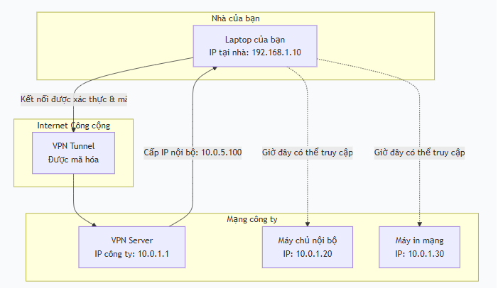

*Mô hình remote-access VPN. Việc truy cập từng máy chủ vẫn phụ thuộc vào route và firewall policy.*

#### VPN bảo vệ và không bảo vệ điều gì?

| Nhận định | Đánh giá chính xác |
|---|---|
| VPN bảo vệ trên Wi-Fi công cộng | **Đúng nhưng cần điều kiện:** VPN bảo vệ đoạn thiết bị → VPN gateway; TLS/HTTPS tiếp tục bảo vệ và xác thực đoạn thiết bị → website, nên vẫn cần dùng HTTPS |
| ISP không biết website đang truy cập | **Không tuyệt đối:** với full tunnel và DNS không bị leak, ISP chủ yếu thấy kết nối tới VPN gateway. ISP vẫn thấy metadata và có thể suy luận; split tunnel hoặc DNS leak có thể làm lộ thêm thông tin. |
| Website thấy IP của VPN server | **Thường đúng với consumer full-tunnel:** gateway thường NAT lưu lượng Internet sang exit IP. Với VPN công ty chỉ định tuyến tài nguyên nội bộ, truy cập website công cộng có thể vẫn dùng IP mạng nhà. |
| VPN giúp vượt giới hạn địa lý | **Có thể, không bảo đảm:** dịch vụ có thể phát hiện/chặn IP VPN; việc sử dụng còn phụ thuộc điều khoản dịch vụ và pháp luật tại nơi sử dụng. |
| VPN làm người dùng ẩn danh | **Sai:** website vẫn có **cookie (dữ liệu nhỏ lưu trạng thái/nhận diện trình duyệt)**, tài khoản và **browser fingerprint (dấu vân tay trình duyệt tạo từ nhiều đặc điểm thiết bị/phần mềm)**. VPN chỉ chuyển điểm phải tin cậy từ ISP sang đơn vị vận hành VPN. |
| Có VPN là an toàn trước malware/phishing | **Sai:** VPN không tự chặn **malware (phần mềm độc hại)**, **phishing (giả mạo để lừa lấy thông tin)**, lộ mật khẩu hay thiết bị đã bị xâm nhập. |
| Kết nối VPN nghĩa là thuộc hoàn toàn vào LAN từ xa | **Không chính xác:** quyền thực tế vẫn do **network segmentation (phân đoạn mạng thành các vùng tách biệt)**, firewall, ACL và **zero trust (mô hình không mặc định tin cậy chỉ vì thiết bị đã ở trong mạng)** quyết định. |

#### Hạn chế và rủi ro cần nhớ

- Mã hóa/đóng gói làm tăng **overhead (phần dữ liệu và công xử lý phụ thêm)**, có thể giảm **throughput (tốc độ dữ liệu hữu ích thực tế)** và tăng latency.
- **MTU:** kích thước packet lớn nhất một interface/link chở được trong một frame. Tunnel thêm header nên packet cũ có thể trở nên quá lớn; giảm tunnel MTU hoặc TCP MSS giúp tránh phân mảnh và lỗi “kết nối được nhưng tải dữ liệu lớn bị treo”.
- **DNS leak/IPv6 leak (rò rỉ truy vấn DNS hoặc traffic IPv6 ra ngoài VPN)** hoặc route sai có thể khiến một phần traffic không đi qua tunnel.
- **Kill switch (cơ chế tự chặn traffic khi VPN mất kết nối)** giúp tránh rò rỉ nhưng phải được cấu hình và kiểm thử đúng.
- Không nên dùng giao thức cũ/yếu như PPTP cho nhu cầu bảo mật hiện đại.
- VPN gateway là điểm truy cập nhạy cảm: cần cập nhật bản vá, MFA, certificate/khóa mạnh, giới hạn quyền, **logging (ghi nhật ký sự kiện)** và thu hồi **credential (thông tin dùng để xác thực như mật khẩu, token hoặc khóa)** khi cần.
- Hai đầu mạng site-to-site không nên dùng các dải IP bị trùng nhau; ví dụ cả hai bên cùng dùng `192.168.1.0/24` sẽ gây xung đột định tuyến.

## Network Edge (rìa mạng)

- **Internet Edge (End system/ Hosts/ End nodes):** là các thiết bị cuối, sử dụng để khởi tạo và gửi request và là nơi cuối cùng nhận dữ liệu (máy tính, điện thoại, máy in, VoIP phone, credit card, barcode scanner, web server, ô tô kết nối mạng, ...).

- Điểm chung là chúng đều chạy các ứng dụng mạng, nằm ở phần rìa của mạng, không phải thành phần trung gian nào nên được gọi là thiết bị cuối.

- **Access network (mạng truy nhập):** phần hạ tầng nối end system tới router đầu tiên và từ đó vào network core. Ví dụ: Wi-Fi và đường cáp quang từ router gia đình tới ISP.

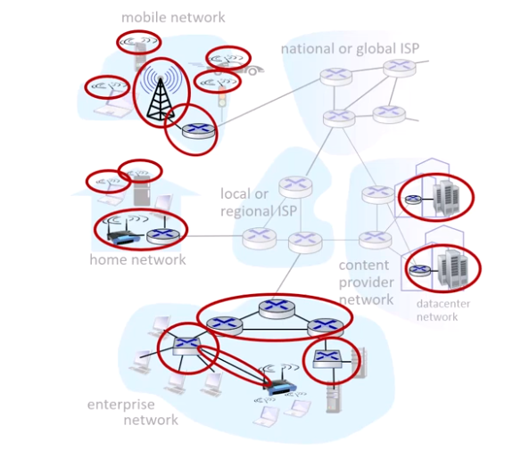

*Access network*

- **Ví dụ Access network dựa vào Mobile network theo hình:** các máy tính, điện thoại, ô tô kết nối internet tới trạm sóng cố định qua sóng do nó có thể di chuyển theo thời gian + trạm này lại nối tới router đầu tiên qua dây ⇒ lúc này Trạm sóng chính là Access network.

## Network Core (lõi mạng)

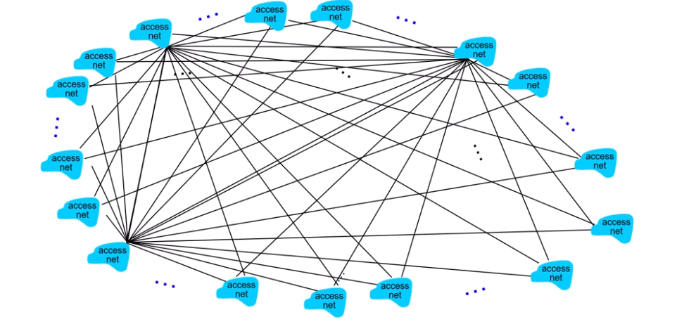

*Network Core và các access network*

**Network Core:** tập hợp router, switch tốc độ cao, đường truyền và hệ thống điều khiển nằm giữa các access network. Lõi mạng vận chuyển packet qua nhiều mạng trung gian để kết nối các end system ở những vị trí khác nhau.

“Core” là một khái niệm kiến trúc, không phải một mạng trung tâm duy nhất do một tổ chức sở hữu. Internet không có một router trung tâm hay một “Global ISP” duy nhất; nó được hình thành từ hàng chục nghìn mạng độc lập kết nối với nhau.

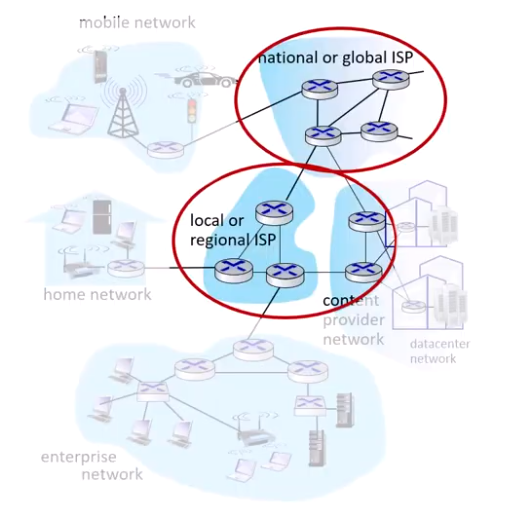

*Các router trong Network Core*

### Thành phần và chức năng

| Thành phần/khái niệm | Vai trò |
|---|---|
| **Core router (router lõi)** | Chuyển tiếp packet giữa các đường truyền tốc độ cao dựa trên forwarding table |
| **Backbone link (đường truyền trục)** | Link dung lượng lớn tạo xương sống của mạng, thường dùng cáp quang mặt đất hoặc cáp quang biển |
| **PoP (Point of Presence)** | Địa điểm vật lý nhà mạng đặt router để đưa dịch vụ tới một khu vực và làm điểm khách hàng/mạng khác kết nối vào; PoP gần người dùng thường giúp giảm quãng đường truy nhập |
| **Autonomous System (AS)** | Một mạng hoặc nhóm mạng do cùng tổ chức kiểm soát và áp dụng chung chính sách định tuyến. AS là đơn vị để Internet chia nhỏ quyền quản lý; ví dụ ISP A và Google vận hành các AS riêng |
| **ASN** | Mã số giúp phân biệt các AS trong BGP, giống mã định danh của một tổ chức mạng |
| **Routing protocol** | Giúp router trao đổi thông tin để học đường đi thay vì người quản trị phải nhập mọi route thủ công. OSPF/IS-IS thường tìm đường trong một tổ chức; BGP trao đổi khả năng đi tới các prefix giữa các tổ chức |
| **Forwarding plane/data plane** | Phần xử lý từng packet theo bảng đã có; mục tiêu là chuyển packet thật nhanh |
| **Control plane** | Phần học, tính toán và lựa chọn route; kết quả của nó được cài cho forwarding plane sử dụng |

Các nhiệm vụ chính của network core:

- Vận chuyển lượng lớn packet giữa các access network.
- Chọn đường phù hợp theo **metric (chỉ số dùng để so sánh route, như cost hoặc độ trễ)** và policy, không nhất thiết là đường ngắn nhất về địa lý.
- Cung cấp nhiều đường đi dự phòng để có thể hội tụ lại khi link/router gặp lỗi.
- Quản lý traffic bằng queue, scheduling, traffic engineering và QoS: packet phải chờ khi link bận, scheduling chọn packet gửi trước, traffic engineering phân bố luồng lên các đường, còn QoS bảo đảm traffic quan trọng nhận mức phục vụ phù hợp.
- Kết nối nhiều công nghệ; tại lõi nhà mạng có thể gặp IP/MPLS, Ethernet tốc độ cao và **OTN (Optical Transport Network: mạng truyền tải quang)**.

Network core giúp tăng độ tin cậy nhưng **không bảo đảm tuyệt đối** tránh nghẽn mạng, packet loss hoặc sự cố. Khi lưu lượng tới nhanh hơn khả năng xử lý/truyền đi, queue có thể tăng và packet vẫn có thể bị loại bỏ.

### Vì sao các mạng không kết nối trực tiếp với tất cả mạng khác?

Nếu `N` mạng đều cần một kết nối vật lý riêng tới mọi mạng còn lại, số liên kết cực đại là:

`N × (N - 1) / 2`

Mô hình **full mesh (liên kết toàn phần: mỗi mạng nối trực tiếp với mọi mạng còn lại)** tăng gần theo `N²`, tốn cổng, đường truyền và khó quản trị. Internet mở rộng bằng cách tổ chức mạng thành AS, dùng quan hệ nhà cung cấp/khách hàng và peering.

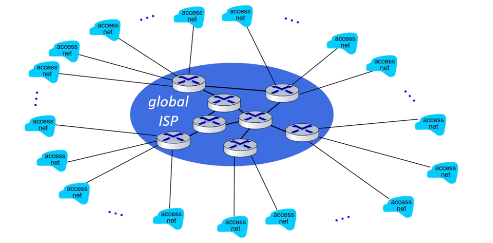

*Mô hình đơn giản hóa: access network kết nối qua một ISP. Trong thực tế có nhiều ISP và nhiều tầng kết nối.*

### ISP, transit, peering và IXP (Internet Exchange Point: điểm trao đổi Internet)

| Quan hệ | Cách hoạt động | Chi phí/đặc điểm |
|---|---|---|
| **Transit** | Một mạng trả tiền cho provider để provider đưa traffic tới cả những mạng mà khách hàng không kết nối trực tiếp | Dùng khi cần khả năng đi tới phần còn lại của Internet |
| **Private peering/PNI** | Hai mạng nối riêng với nhau để traffic giữa họ không phải vòng qua transit provider | Có lợi khi hai bên trao đổi lượng traffic lớn, ví dụ ISP kết nối trực tiếp với Google |
| **Public peering tại IXP** | Nhiều mạng cùng cắm vào một hạ tầng Layer 2 và tự thỏa thuận trao đổi route bằng BGP | Giảm số dây nối riêng, chi phí transit và đôi khi giảm độ trễ |

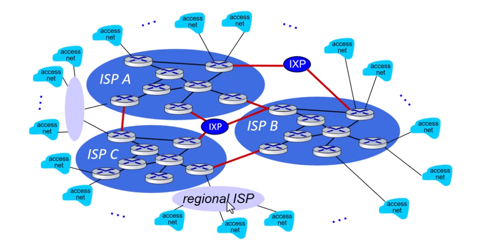

*Các mạng có thể mua transit hoặc peering tại IXP/private interconnect.*

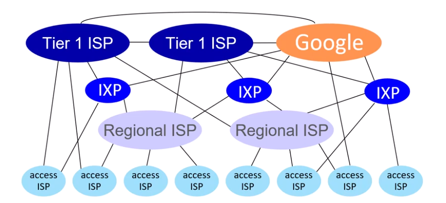

*Mô hình phân cấp ISP mang tính khái quát; Internet thực tế có nhiều kết nối chéo và không phải một cây phân cấp cứng.*

**IXP:** hạ tầng Layer 2 chung nơi nhiều AS cắm kết nối để peering. Mục đích là cho traffic giữa các thành viên đi trực tiếp hơn thay vì luôn mua transit qua mạng thứ ba.

- Không phải “Internet trung tâm” và không bắt buộc mọi ISP phải đi qua.
- Thường không tự quyết định route cho các thành viên; từng mạng vẫn dùng BGP và chính sách riêng.
- Không đồng nghĩa với transit provider. Thành viên thường trả phí cổng/thành viên, còn việc peering phụ thuộc thỏa thuận giữa các mạng.
- Có thể rút ngắn đường đi, giảm chi phí transit và giữ traffic nội vùng, nhưng không phải lúc nào cũng là đường tốt nhất.

Các mạng lớn có thể đặt cache/CDN gần người dùng. Cache giữ bản sao resource đã có; CDN tổ chức nhiều máy chủ phân tán để chọn nơi phục vụ gần hoặc phù hợp nhất, nhờ đó giảm latency và tải cho origin server.

### Routing (định tuyến) và forwarding (chuyển tiếp)

| Khái niệm | Câu hỏi cần trả lời | Phạm vi/thời gian |
|---|---|---|
| **Routing** | Quá trình học và chọn đường để hình thành bảng định tuyến | Ví dụ BGP chọn nhà mạng nào sẽ được dùng để tới prefix của Google |
| **Forwarding** | Dùng bảng đã có để xử lý một packet cụ thể | Ví dụ router nhìn IP đích rồi chuyển packet ra cổng nối tới next hop |

Router thường không lưu “toàn bộ hành trình cố định” trong mỗi packet. Nó tra IP đích theo quy tắc **longest prefix match**, chọn next hop/interface rồi chuyển packet tới chặng tiếp theo. Mỗi router lặp lại quá trình này.

### Circuit switching (chuyển mạch kênh)

**Circuit switching:** mạng dành trước một phần tài nguyên cho phiên trước khi truyền dữ liệu. Mục đích là cung cấp băng thông và độ trễ dễ dự đoán, đổi lại tài nguyên vẫn bị giữ ngay cả khi người dùng tạm không gửi gì. Ví dụ cuộc gọi điện thoại TDM truyền thống được cấp một time slot riêng.

| Đặc điểm | Ý nghĩa |
|---|---|
| **Dành trước tài nguyên** | Băng thông của circuit có tính dự đoán, ít phải cạnh tranh queue với kết nối khác |
| **Có giai đoạn thiết lập** | Phải tạo circuit trước khi truyền và giải phóng sau khi kết thúc |
| **Đường logic tương đối ổn định** | Dữ liệu của phiên đi theo circuit đã thiết lập cho tới khi circuit đổi hoặc bị lỗi |
| **Hiệu quả với traffic liên tục** | Phù hợp thoại truyền thống; kém hiệu quả khi nguồn gửi dữ liệu theo từng đợt vì tài nguyên vẫn bị giữ lúc rảnh |

Circuit switching vẫn có **propagation delay (độ trễ do tín hiệu lan truyền trên đường truyền)**, **transmission delay (thời gian đẩy toàn bộ bit lên link)**, **processing delay (thời gian thiết bị xử lý dữ liệu)** và thời gian thiết lập circuit. Ưu điểm là delay và **jitter (mức dao động của độ trễ)** dễ dự đoán hơn sau khi dành tài nguyên.

IP của người dùng chủ yếu dùng packet switching, nhưng hạ tầng bên dưới có thể dùng circuit hoặc **lightpath (đường quang logic được cấp tài nguyên qua mạng quang)**. MPLS tạo đường chuyển tiếp logic nhưng vẫn là packet switching.

### Packet switching (chuyển mạch gói)

**Packet switching:** chia dữ liệu thành các packet độc lập để nhiều người dùng chia sẻ động cùng đường truyền. Mục đích là tận dụng link tốt hơn với traffic lúc có lúc không; đổi lại packet có thể phải xếp hàng, trễ hoặc mất khi nghẽn. Internet ở tầng IP chủ yếu dùng mô hình này.

| Ưu điểm | Hạn chế |
|---|---|
| Tận dụng đường truyền tốt với traffic gửi theo từng đợt | Queue làm delay và jitter thay đổi |
| Nhiều người dùng chia sẻ cùng hạ tầng | Có thể packet loss khi buffer đầy |
| Linh hoạt khi topology/route thay đổi | Header và xử lý mỗi packet tạo overhead |
| Có thể định tuyến lại khi một đường gặp lỗi | Không mặc định bảo đảm băng thông hoặc thời gian giao hàng |

#### Những điểm cần hiểu chính xác

- **Load balancing:** phân phối traffic qua nhiều link hoặc server để tránh một nơi quá tải và tăng khả năng dự phòng. Tùy thuật toán, các flow khác nhau hoặc thậm chí packet khác nhau có thể đi đường khác nhau.
- IP cung cấp dịch vụ best-effort: packet có thể đến trễ, mất, lặp hoặc sai thứ tự.
- IP không tự ghép file theo thứ tự. TCP dùng **sequence number (số thứ tự byte/segment)**, **ACK (Acknowledgment: xác nhận đã nhận dữ liệu)** và **retransmission (truyền lại dữ liệu bị mất)** để cung cấp **byte stream (luồng byte liên tục)** tin cậy; UDP không có các bảo đảm đó.
- Không phải mọi packet đều có số thứ tự. IPv4 có **checksum (giá trị kiểm tra giúp phát hiện lỗi bit)** cho header; TCP/UDP có checksum theo quy tắc riêng.
- Router thường chỉ kiểm tra/chuyển tiếp packet và không biết nó thuộc file, video hay email nào.
- Có thể nói **Internet ở tầng IP dựa trên packet switching**, nhưng “100% Internet chỉ dùng packet switching” bỏ qua các công nghệ circuit/quang ở hạ tầng bên dưới.

### So sánh circuit switching và packet switching

| Tiêu chí | Circuit switching | Packet switching |
|---|---|---|
| Cấp phát tài nguyên | Dành trước cho circuit | Chia sẻ động giữa nhiều luồng |
| Thiết lập trước khi gửi | Thường có | IP datagram không cần thiết lập circuit; giao thức khác có thể vẫn cần handshake |
| Băng thông/delay | Dễ dự đoán hơn | Thay đổi theo tải mạng |
| Hiệu quả với traffic burst | Thấp hơn nếu circuit nhàn rỗi | Cao hơn nhờ statistical multiplexing |
| Khi nghẽn | Có thể từ chối thiết lập circuit mới | Queue tăng, delay tăng và có thể loss |
| Ví dụ | **PSTN (Public Switched Telephone Network: mạng điện thoại chuyển mạch công cộng)** truyền thống, circuit TDM | IP/Ethernet và phần lớn traffic Internet |

## Repeater, Hub, Bridge, Switch, Router

### Repeater (bộ lặp/tái tạo tín hiệu)

- **Repeater:** nhận tín hiệu đã yếu hoặc biến dạng, tái tạo rồi phát tiếp để tăng khoảng cách truyền. Nó chỉ xử lý tín hiệu/bit, không biết IP, MAC hay ứng dụng nào đang gửi dữ liệu.

- **CRC:** giá trị được tính từ các bit của frame để phía nhận phát hiện frame đã bị lỗi trên đường truyền. CRC phát hiện lỗi nhưng không tự sửa hoặc truyền lại frame.

- **Amplifier (bộ khuếch đại)** tăng biên độ cả tín hiệu gốc lẫn nhiễu. Repeater số cố gắng **decode (giải mã tín hiệu thành bit)** rồi tạo lại một tín hiệu sạch hơn trước khi phát tiếp.

- Các router (wifi), switch hầu như đều tích hợp Repeater, nếu không thì cần phải đầu tư 1 thiết bị Repeater riêng + trong hạ tầng ISP, dọc theo đường trục cáp quang thì cứ khoảng 80-100km lại có bộ khuếch quang để bù đắp sự suy hao của tín hiệu ánh sáng trong sợi quang để đảm bảo đi hàng ngàn km dữ liệu không bị lỗi.

- **Cái kích wifi hàng xóm chính là Repeater:** đặt Repeater tại nơi mà vẫn còn bắt được sóng wifi từ router chính (bản thân sẽ kết nối không dây với router chính) sau đó phát lại sóng wifi đó → sóng wifi sẽ được đẩy đi xa hơn tới các khu vực khác >< nhược điểm là chậm hơn, do phải nghe tín hiệu từ wifi chính rồi nói với device của mình (thường là chỉ đạt 50% về tốc độ). Lý do là đây là các repeater giá rẻ, chỉ có 1 bộ thu-phát radio, không thể vừa nghe, nói cùng lúc >< Repeater ISP thì khác biệt, gần như không hề có độ trễ nào.

- **Nhiễu:** tín hiệu không mong muốn trộn lẫn vào tín hiệu gốc. Nguyên nhân có thể là do nhiệt (gây nhiễu nhiệt), từ trường, xung đột tín hiệu từ các device khác, bức xạ từ mặt trời, sóng vô tuyến, nhiễu xuyên âm giữa các cặp dây trong cùng bó cáp → gây tiếng rè rè khi nghe radio, nghe điện thoại (bản chất là do biến dạng tín hiệu gốc, các bit 1 có thể hiểu nhầm thành bit 0 và ngược lại)

- **Suy hao/ mất:** năng lượng của tín hiệu gốc bị giảm dần trên đường truyền. Nguyên nhân có thể là do: điện trở của vật làm cáp, khoảng cách xa,... → làm giảm biên độ của tín hiệu gốc, tín hiệu trở nên nhỏ hơn, yếu hơn

### Hub (bộ chia tín hiệu nhiều cổng)

- **Hub:** bộ lặp nhiều cổng; tín hiệu vào một cổng được phát ra tất cả cổng còn lại. Nó dùng để nối nhiều máy trên Ethernet đời cũ nhưng lãng phí băng thông và tạo chung một collision domain, nên hiện gần như được switch thay thế.

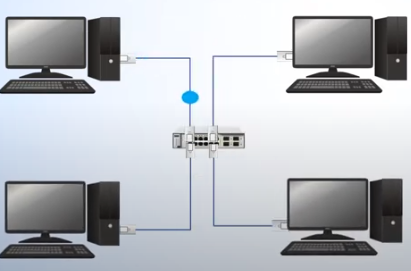

*Hub và miền truyền tín hiệu*

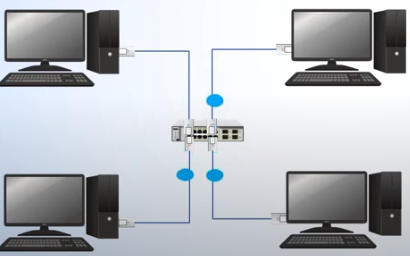

*Hub và miền truyền tín hiệu*

- 1 Hub thường có từ 4, 8, 12, 24 cổng, mỗi cổng chỉ có thể được kết nối tới 1 thiết bị (khi máy 1 đưa dữ liệu vào cổng 1 của Hub, nó sẽ sao chép nguyên tín hiệu và phát ra các cổng khác trong mạng ngoại trừ cổng nhận tín hiệu → các thiết bị kết nối đến Hub sẽ nhận được cùng tín hiệu. Tuy nhiên khi tới các thiết bị, thiết bị sẽ kiểm tra địa chỉ MAC trong tín hiệu có khớp không, nếu không thì bỏ tín hiệu đi → chỉ có đúng máy đích xử lý tín hiệu)

- Hub chỉ nhận tín hiệu rồi phát đi, không kiểm tra dữ liệu

- Băng thông chia sẻ cho tất cả thiết bị kết nối vào Hub + dù các thiết bị không phải thiết bị đích nhưng vẫn nhận được tín hiệu → hiệu suất sẽ thấp, lãng phí băng thông, thậm chí còn gây ra các vấn đề bảo mật khi sniff

- **Collision domain (miền xung đột):** tập thiết bị cùng chia sẻ môi trường truyền, nơi hai thiết bị gửi đồng thời có thể làm tín hiệu va chạm. Hub Ethernet cũ dùng **half-duplex (bán song công: tại một thời điểm chỉ gửi hoặc nhận)**; switch hiện đại thường dùng **full-duplex (song công toàn phần: gửi và nhận đồng thời)** nên không có collision kiểu này trên từng link.

### Bridge (cầu nối mạng)

- **Bridge:** nối hai hoặc vài segment LAN và chỉ chuyển frame sang segment khác khi cần. Mục đích là giảm traffic không cần thiết so với hub bằng cách học MAC nằm ở phía nào.

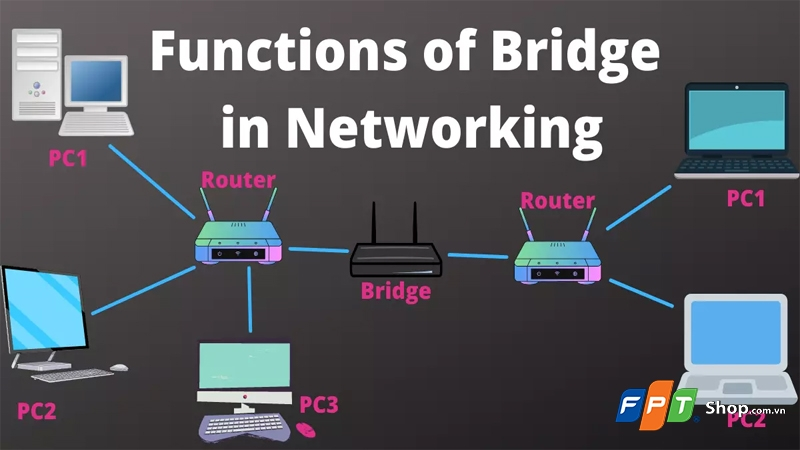

*Bridge trong mạng*

- **Learning:** bridge/switch nhìn MAC nguồn của frame để học thiết bị đang nằm sau port nào. Nhờ đó, frame sau có thể được chuyển đúng port thay vì phát khắp mạng.

- **Filtering (lọc):** nếu bridge biết đích nằm cùng phía với nguồn, nó không chuyển frame sang segment còn lại.

- **Forwarding:** chuyển frame từ LAN này qua LAN khác nếu MAC address đích nằm khác LAN với thiết bị gửi.

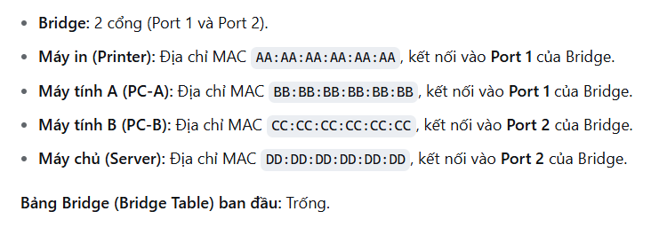

*Hình 18*

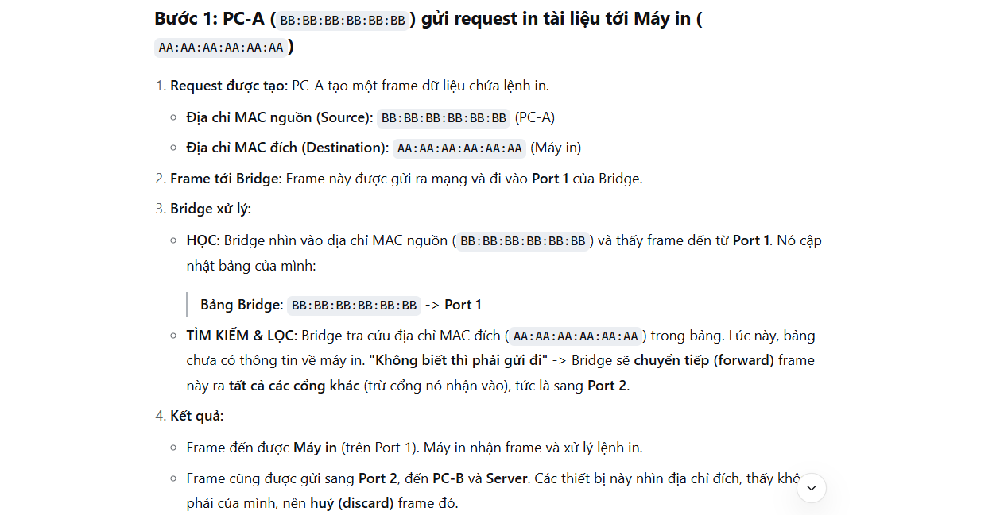

*Hình 19*


*Hình 20*

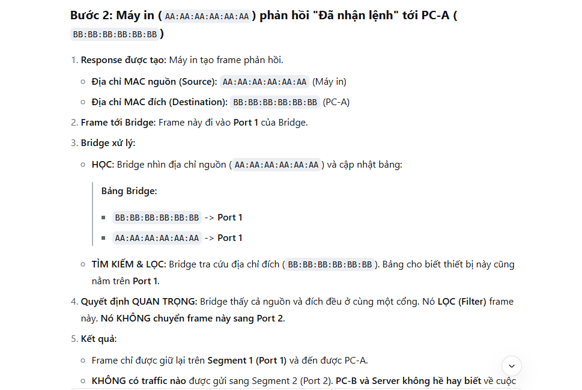

*Hình 21*


*Hình 22*

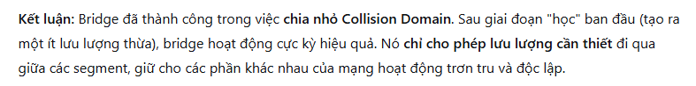

*Hình 23*

### Switch (bộ chuyển mạch)

- **Switch:** bridge nhiều cổng dùng MAC table để chuyển frame tới đúng port thay vì phát cho mọi thiết bị. Nó là thiết bị trung tâm phổ biến để kết nối máy trong cùng LAN/VLAN.

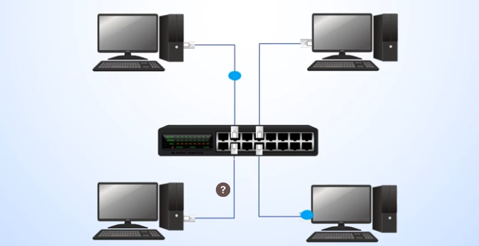

*Switch trong mạng LAN*

- Nhiệm vụ chính là kết nối các thiết bị trong cùng mạng LAN + sử dụng MAC address để forward dữ liệu thông minh hơn Hub, Bridge để đến đúng thiết bị (mỗi MAC address mapping tới 1 port kết nối tới thiết bị cụ thể trong mạng)

- **Aging (làm cũ và xóa entry):** switch không giữ một mapping trong **MAC table (bảng ánh xạ MAC với port)** mãi mãi; entry không được quan sát trong một thời gian sẽ hết hạn.

- **Full-duplex:** sử dụng cáp xoắn đôi, 1 dây chuyên nhận tín hiệu đến, 1 dây chuyên nhận tín hiệu đi nên không xảy ra hiện tượng collision.

- Trong khi 1 port của bridge kết nối tới segment (1 tập các device) thì 1 port của Switch sẽ kết nối tới 1 device → khi sent tới 1 device thì không cần thiết phải sent tới toàn bộ device thuộc 1 port, mà chỉ cần sent tới chính device cần tín hiệu. Đây chính là ưu điểm lớn nhất của Switch so với Bridge.

- Ngày nay họ sử dụng Switch để thay hoàn toàn cho Hub, Bridge + nếu sử dụng mạng gia đình, Switch được tích hợp trong Wifi router.

- **Router:** là thiết bị mạng quan trọng bậc nhất, giúp kết nối các mạng khác lại với nhau hoạt động ở Network layer trong mô hình OSI.

### Router (bộ định tuyến)

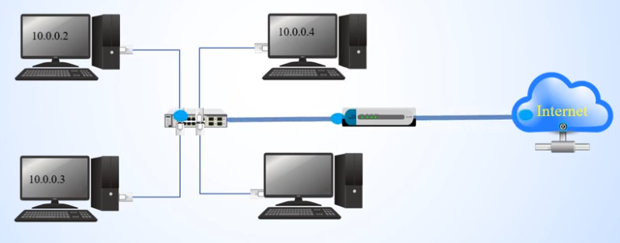

*Router kết nối LAN với Internet*

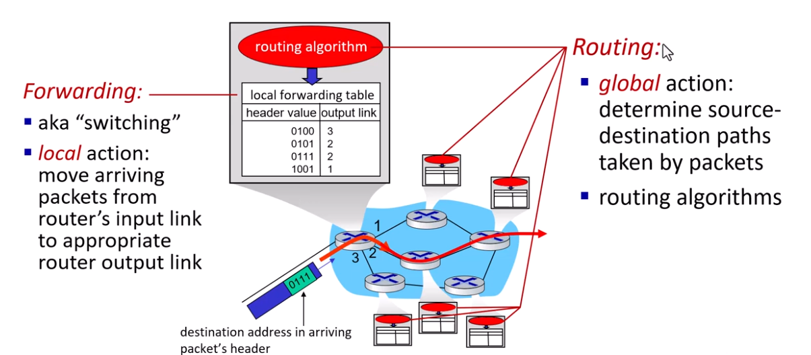

*Routing và forwarding*

- Switch kết nối các thiết bị trong cùng mạng >< Router kết nối các mạng khác nhau lại.

- Khi các packet được truyền đi từ máy, bản chất nó sẽ truyền đi qua các router cho tới khi tới đích + Network core gồm 1 tập các router kết nối với nhau

- **Router:** kết nối các mạng IP khác nhau. Nó tra IP đích trong routing table để chọn next hop; ví dụ router gia đình nối LAN `192.168.1.0/24` với mạng của ISP.

- **DHCP:** tự cấp cho thiết bị các thông tin cần để tham gia mạng như IP, subnet mask, default gateway và DNS. Nhờ DHCP, điện thoại vào Wi-Fi không cần người dùng nhập cấu hình IP thủ công.

### Forwarding, store-and-forward (lưu rồi chuyển) và queue (hàng đợi)

- **Local forwarding table (bảng chuyển tiếp cục bộ):** ánh xạ prefix/header cần tra cứu với interface hoặc next hop đầu ra. Router chỉ cần biết chặng kế tiếp, không lưu toàn bộ hành trình trong từng packet.

- **Store-and-forward (lưu rồi chuyển):** thiết bị nhận đủ frame/packet vào **buffer (vùng nhớ đệm tạm thời)**, kiểm tra và tra bảng trước khi gửi tiếp. Cách này tạo thêm delay nhưng cho phép kiểm tra lỗi và xếp hàng. Một số switch còn hỗ trợ **cut-through (bắt đầu chuyển frame trước khi nhận hết frame)** để giảm độ trễ.

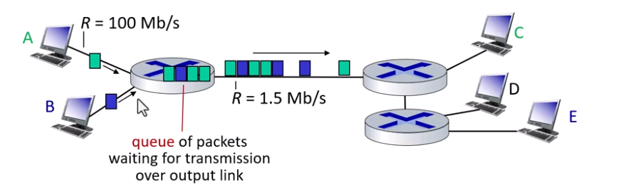

*Queue tại router*

- **Input queue (hàng đợi đầu vào)** giữ packet chờ xử lý; **output queue (hàng đợi đầu ra)** giữ packet đã chọn được cổng nhưng đang chờ link rảnh. Queue tăng khi tốc độ traffic đến lớn hơn tốc độ xử lý hoặc truyền đi.

- **Packet loss (mất gói):** packet bị loại bỏ trước khi tới đích, thường do buffer đầy, lỗi đường truyền, lỗi thiết bị hoặc policy.

- **Port vật lý:** là những cổng có thể chạm, nhìn thấy ở phía sau router

- **WAN port/Internet port:** cổng nối router gia đình tới **modem (thiết bị chuyển đổi tín hiệu để kết nối đường truy nhập của ISP)** hoặc thiết bị đầu cuối đường truyền.

- **LAN port:** thường có 2-4 cổng dùng để kết nối có dây tới các thiết bị trong mạng nội bộ

- **Port logic:** là số từ `0` đến `65535` nằm trong header TCP hoặc UDP. Port giúp hệ điều hành chuyển dữ liệu tới đúng socket/process. Router thông thường không dùng port để định tuyến packet; router NAT/PAT mới đọc và có thể thay đổi port để quản lý các ánh xạ.

- Khi một máy nội bộ truy cập website, phản hồi từ website được gửi tới public IP và port phía ngoài của router. Chỉ public IP chưa đủ để router biết máy nội bộ nào cần nhận. Router tra ánh xạ NAT/PAT, xác định IP và port nội bộ tương ứng, sửa packet rồi chuyển nó vào LAN.

- **Bảng NAT/PAT** không phải nhật ký lưu vĩnh viễn “toàn bộ kết nối”. Nó chứa các ánh xạ đang còn hiệu lực, thường gồm protocol, IP:port nội bộ, IP:port phía ngoài và đôi khi cả IP:port đích. Ánh xạ động bị xóa khi kết nối kết thúc hoặc hết thời gian chờ. Nhật ký hệ thống có thể ghi lại một phần sự kiện NAT nếu router được cấu hình logging, nhưng đó là dữ liệu khác với bảng NAT đang hoạt động.

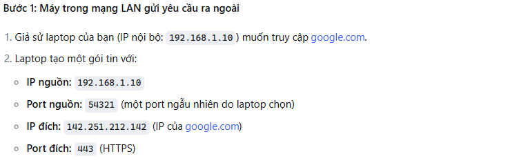

*Hình 28*

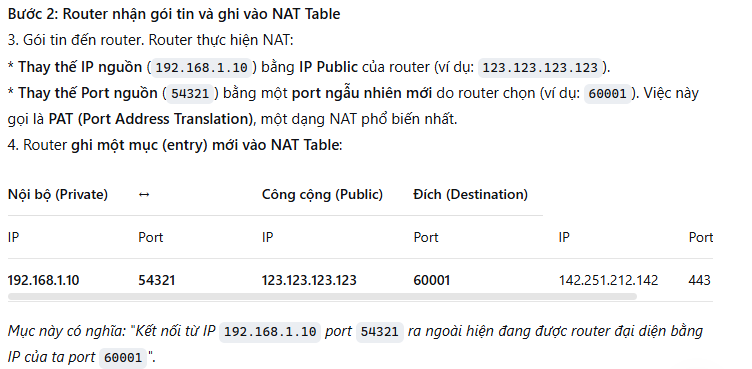

*Hình 29*

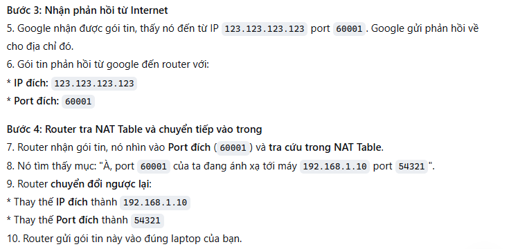

*Hình 30*

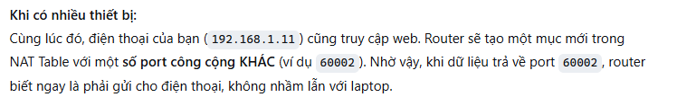

*Hình 31*

### Network Firewall (tường lửa mạng)

**Firewall:** thiết bị/phần mềm kiểm soát traffic nào được phép đi qua một ranh giới mạng. Mục đích là giảm quyền truy cập không cần thiết; ví dụ cho user truy cập web server qua port `443` nhưng không cho truy cập trực tiếp database qua port `5432`.

Firewall chỉ kiểm soát được traffic **đi qua đường xử lý của nó**. Nếu hai máy trong cùng VLAN giao tiếp trực tiếp qua switch, firewall đặt ở cổng Internet sẽ không nhìn thấy traffic đó. Muốn kiểm soát traffic nội bộ cần phân đoạn mạng và buộc traffic giữa các zone/VLAN đi qua firewall hoặc cơ chế lọc tương đương.

#### Cách firewall xử lý một kết nối

Giả sử firewall có rule:

| Source | Destination | Protocol/port | Action |
|---|---|---|---|
| Mạng nhân viên `10.0.10.0/24` | Web server `10.0.20.10` | TCP `443` | Allow |
| Mạng nhân viên `10.0.10.0/24` | Database `10.0.30.10` | TCP `5432` | Deny |

Máy nhân viên `10.0.10.25` thực hiện hai kết nối:

1. Kết nối tới `10.0.20.10:443`: firewall thấy nguồn, đích và port khớp rule Allow nên cho packet đi qua.
2. Kết nối tới `10.0.30.10:5432`: firewall thấy kết nối khớp rule Deny nên loại packet.

Firewall không tự biết kết nối nào là hợp lệ về mặt nghiệp vụ. Người quản trị phải khai báo rule dựa trên yêu cầu thực tế.

#### Ví dụ stateful firewall (tường lửa lưu trạng thái kết nối)

Máy `10.0.10.25:53000` truy cập website `203.0.113.20:443`:

1. Packet đầu tiên đi từ máy nội bộ ra Internet.
2. Firewall kiểm tra rule outbound. Nếu được phép, nó lưu trạng thái kết nối.
3. Website phản hồi từ `203.0.113.20:443` về `10.0.10.25:53000`.
4. Firewall nhận ra đây là packet phản hồi của kết nối đã được cho phép nên cho quay vào.
5. Nếu một máy Internet tự gửi packet mới tới `10.0.10.25:53000` mà không có trạng thái tương ứng, firewall chặn packet đó.

Vì vậy, việc cho phép máy nội bộ mở kết nối ra ngoài không đồng nghĩa với việc mọi máy bên ngoài được tự do mở kết nối vào trong.

#### Ví dụ firewall không nhìn thấy traffic

Máy A và máy B đều nằm trong VLAN 10 và kết nối vào cùng switch:

`Máy A → switch → Máy B`

Nếu firewall chỉ đặt giữa switch và Internet, traffic A–B không đi qua firewall nên rule trên firewall không áp dụng được. Muốn kiểm soát A–B cần một trong các cách:

- Tách A và B sang các VLAN/security zone khác nhau rồi route qua firewall.
- Dùng host firewall trên A/B.
- Dùng **microsegmentation (phân đoạn rất nhỏ, áp chính sách gần từng workload)** hoặc policy trên switch/**hypervisor (lớp phần mềm vận hành máy ảo)**.

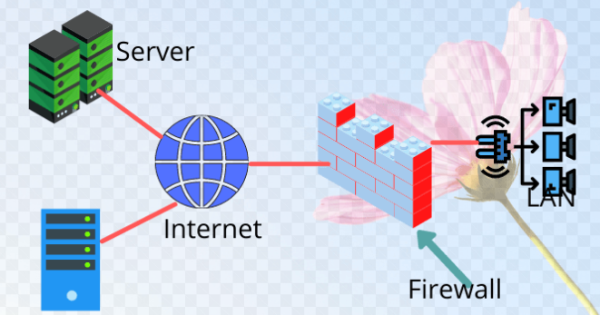

*Network Firewall*

#### Firewall có thể đặt ở đâu?

| Vị trí/loại | Phạm vi bảo vệ | Ví dụ |
|---|---|---|
| **Perimeter/network firewall (tường lửa biên/mạng)** | Biên giữa mạng nội bộ và Internet hoặc mạng đối tác | **Firewall appliance (thiết bị chuyên dụng)**, virtual firewall, router có ACL/stateful firewall |
| **Internal segmentation firewall (tường lửa phân đoạn nội bộ)** | Traffic giữa user, server, **production (môi trường hệ thống đang phục vụ thật)**, database, **OT (Operational Technology: hệ thống điều khiển/vận hành công nghiệp)** hoặc VLAN | Firewall giữa các security zone |
| **Host-based firewall (tường lửa trên máy)** | Một máy cụ thể, kể cả traffic từ máy khác trong cùng LAN | Windows Defender Firewall, Linux nftables/iptables |
| **Cloud firewall (tường lửa đám mây)** | Tài nguyên trong **VPC/VNet (mạng riêng ảo trên nền tảng cloud)** và traffic Internet/cloud-to-cloud | **Security group (bộ rule gắn với tài nguyên cloud)**, network ACL, managed cloud firewall |
| **Container/Kubernetes policy** | Traffic giữa **workload (đơn vị ứng dụng/tác vụ đang chạy)**, **pod (đơn vị triển khai nhỏ của Kubernetes)** và service | Kubernetes NetworkPolicy, **CNI (Container Network Interface: chuẩn plugin mạng cho container)** policy |
| **Distributed/microsegmentation firewall** | Chính sách gần từng workload/**VM (Virtual Machine: máy ảo)** thay vì chỉ tại biên | Hypervisor firewall, **endpoint agent (phần mềm bảo vệ chạy trên máy cuối)** |

Router gia đình thường tích hợp stateful firewall, NAT, DHCP, Wi-Fi access point và switch. Tuy nhiên NAT và firewall là hai chức năng khác nhau: NAT dịch địa chỉ; firewall quyết định traffic có được phép hay không.

#### Firewall kiểm tra những gì?

Khả năng kiểm tra phụ thuộc loại firewall:

| Mức kiểm tra | Thuộc tính có thể dùng |
|---|---|
| **Layer 3** | Source/destination IP, subnet, interface, zone, IP protocol |
| **Layer 4** | TCP/UDP source/destination port và TCP flag. Flag như SYN, ACK, FIN cho biết packet đang mở, xác nhận hay đóng kết nối |
| **State/session** | Kết nối mới hay phản hồi, trạng thái TCP, **timeout (thời gian chờ trước khi state hết hạn)** |
| **Identity/device** | User, group, máy được quản lý, certificate hoặc **security posture (mức đáp ứng yêu cầu bảo mật của thiết bị)** |
| **Layer 7/application** | **HTTP method (loại thao tác như GET/POST)**, host, **DNS query (truy vấn tên miền)**, TLS metadata hoặc chữ ký giao thức |
| **Threat/content** | **IPS signature (mẫu nhận diện tấn công)**, malware/file type, URL category, **reputation intelligence (dữ liệu đánh giá độ tin cậy của IP/domain)** |
| **Time/context** | Thời gian, vị trí, **tenant (khách hàng/không gian dùng chung nhưng tách biệt)**, tag cloud hoặc nhãn workload |

**NGFW:** firewall bổ sung khả năng nhận diện ứng dụng/người dùng và kiểm tra sâu hơn packet filter truyền thống. Nó thường tích hợp IDS/IPS, URL filtering, threat intelligence hoặc TLS inspection để policy không chỉ dựa trên IP/port.

#### Stateless (không lưu trạng thái) và stateful firewall (có lưu trạng thái)

| Loại | Cách hoạt động | Ưu/nhược điểm |
|---|---|---|
| **Stateless packet filter** | Xét từng packet riêng dựa trên IP, port và protocol | Phù hợp với luật đơn giản nhưng không biết packet có phải phản hồi của kết nối hợp lệ hay không |
| **Stateful firewall** | Ghi nhớ trạng thái kết nối để liên hệ packet đi và về | Khi client mở HTTPS ra ngoài, firewall tự nhận ra response tương ứng và cho quay lại |
| **Proxy/application firewall** | Đứng giữa, kết thúc kết nối từ client rồi tạo kết nối khác tới server | Có thể kiểm tra nội dung giao thức sâu hơn nhưng tốn tài nguyên và phức tạp hơn |

Ví dụ với stateful firewall:

1. Client nội bộ `10.0.10.25:53000` mở TCP tới web server `203.0.113.20:443`.
2. Rule cho phép kết nối HTTPS outbound và firewall tạo connection-tracking entry.
3. Response từ `203.0.113.20:443` về `10.0.10.25:53000` được nhận diện là traffic `ESTABLISHED` và được phép quay lại.
4. Một packet từ Internet tự ý gửi tới `10.0.10.25:53000` nhưng không khớp state hợp lệ sẽ bị chặn.
5. State bị xóa khi phiên kết thúc hoặc hết timeout.

Stateful không có nghĩa firewall hiểu đầy đủ logic ứng dụng. Một kết nối TCP hợp lệ vẫn có thể mang **SQL injection (chèn câu lệnh SQL độc hại qua dữ liệu đầu vào)**, malware hoặc dữ liệu bị đánh cắp.

#### Connection tracking (theo dõi kết nối) và trạng thái

Firewall thường nhận diện **flow (luồng packet có chung các thuộc tính nguồn, đích, port và protocol)** bằng các trường như:

`source IP + destination IP + source port + destination port + protocol`

Một số trạng thái khái niệm thường gặp:

| Trạng thái | Ý nghĩa |
|---|---|
| **NEW** | Packet bắt đầu một flow mới hoặc chưa có state khớp |
| **ESTABLISHED** | Packet thuộc flow đã được theo dõi |
| **RELATED** | Flow mới có liên hệ với flow đã biết, tùy protocol/helper |
| **INVALID** | Packet không thể gắn vào trạng thái hợp lệ |

UDP không có handshake như TCP nhưng firewall vẫn tạo state theo flow và timeout. **ICMP** mang thông báo lỗi/chẩn đoán mạng; **PMTUD** dựa vào các thông báo này để tìm kích thước packet phù hợp trên toàn đường đi, nên chặn toàn bộ ICMP có thể làm kết nối bị treo.

#### Security zone (vùng bảo mật) và network segmentation (phân đoạn mạng)

**Security zone:** nhóm mạng/interface có cùng vai trò và mức tin cậy để viết policy dễ hơn. Mục đích là không coi toàn bộ “mạng nội bộ” đều an toàn như nhau; user, server, database và guest nên nằm ở các zone khác nhau.

| Zone ví dụ | Tài nguyên | Chính sách gợi ý |
|---|---|---|
| **Internet/Untrusted** | Mạng công cộng | Mặc định không được khởi tạo kết nối vào nội bộ |
| **User** | Laptop, desktop nhân viên | Chỉ truy cập dịch vụ cần thiết; hạn chế kết nối ngang |
| **Server/Application** | **API (Application Programming Interface: giao diện để phần mềm gọi chức năng/dữ liệu của phần mềm khác)**, application server | Chỉ nhận từ reverse proxy/user/service được phép |
| **Database** | Database, cache nhạy cảm | Chỉ nhận từ application server trên đúng port |
| **DMZ** | Reverse proxy, VPN gateway, mail gateway | Chứa dịch vụ buộc phải công khai nhưng tách khỏi LAN; nếu dịch vụ bị chiếm quyền, attacker vẫn chưa đứng thẳng trong mạng nội bộ |
| **Management** | SSH, RDP, hypervisor | Tách đường quản trị khỏi user traffic; bastion host làm điểm trung gian duy nhất để ghi log và kiểm soát admin |
| **Guest/IoT** | Khách, camera, cảm biến và thiết bị ít được tin cậy | Cho ra Internet có giới hạn; chặn vào mạng nội bộ để thiết bị yếu bảo mật không trở thành đường tấn công |

Ví dụ luồng ba tầng:

`Internet → Reverse proxy:443 → Application:8080 → Database:5432`

Firewall không nên cho Internet truy cập thẳng database.

- **Least privilege:** chỉ cho đúng nguồn truy cập đúng dịch vụ cần thiết; ví dụ chỉ application server được vào database port `5432`.
- **Defense in depth:** bố trí nhiều lớp bảo vệ để một lớp hỏng không làm mất toàn bộ hệ thống; ví dụ WAF → reverse proxy → firewall → authentication → database policy.

Segmentation hạn chế **lateral movement (di chuyển ngang: từ một máy đã chiếm quyền sang các máy khác)**.

#### Inbound (đi vào), outbound (đi ra) và east-west traffic (traffic ngang nội bộ)

| Hướng | Ví dụ | Vì sao cần kiểm soát |
|---|---|---|
| **Inbound (traffic đi vào)** | Internet truy cập web/VPN gateway | Giảm **attack surface (bề mặt tấn công: các điểm có thể bị khai thác)** |
| **Outbound/egress (traffic đi ra)** | Server hoặc user kết nối Internet | Hạn chế malware gọi **C2 (Command and Control: máy chủ điều khiển mã độc)**, tải payload hoặc **exfiltrate (đưa trái phép dữ liệu ra ngoài)** |
| **East-west/lateral traffic (traffic ngang nội bộ)** | User ↔ server, service ↔ database | Ngăn di chuyển ngang và cô lập sự cố |
| **North-south traffic (traffic vào/ra môi trường)** | Traffic vào/ra **data center (trung tâm dữ liệu)** hoặc cloud | Kiểm soát ranh giới giữa các môi trường |

Chỉ lọc inbound là chưa đủ. **Egress filtering (lọc traffic đi ra)** còn giúp ngăn IP spoofing, giới hạn DNS hoặc **SMTP (Simple Mail Transfer Protocol: giao thức truyền email)** trực tiếp và phát hiện kết nối bất thường.

#### Cách firewall xử lý rule

Nhiều firewall đánh giá rule từ trên xuống và dừng ở rule khớp đầu tiên, nhưng hành vi cụ thể tùy sản phẩm. Một rule thường gồm:

| Trường | Ví dụ |
|---|---|
| Source zone/address/identity | `User`, `10.0.10.0/24`, nhóm `Developers` |
| Destination zone/address | `Application`, `10.0.20.15` |
| Service/application | TCP `443`, HTTPS |
| Direction/interface | User → Application |
| Action | Allow, reject, drop, log |
| Schedule/profile | Giờ làm việc, IPS profile, URL category |
| Description/owner/expiry | Lý do nghiệp vụ, người chịu trách nhiệm, ngày rà soát |

Ví dụ policy:

| Thứ tự | Source | Destination | Service | Action | Mục đích |
|---:|---|---|---|---|---|
| 10 | Admin VPN | Management subnet | SSH, RDP | Allow + log | Quản trị qua VPN |
| 20 | Reverse proxy | Application server | TCP 8080 | Allow | Chuyển request ứng dụng |
| 30 | Application server | Database | TCP 5432 | Allow | Kết nối PostgreSQL |
| 40 | Guest | Internal networks | Any | Deny + log | Cô lập khách |
| 1000 | Any | Any | Any | Deny | Default deny |

Nguyên tắc quan trọng:

- Bắt đầu từ **default deny**, rồi chỉ allow nhu cầu đã xác định.
- Dùng subnet/host/service cụ thể; tránh `Any → Any → Allow`.
- Đặt rule cụ thể trước rule rộng nếu firewall dùng **first-match (dừng tại rule đầu tiên khớp)**.
- Không dựa vào source IP như bằng chứng danh tính duy nhất.
- Ghi mô tả, ticket/owner và thời hạn cho rule tạm thời.
- Loại bỏ rule trùng, **shadowed (không bao giờ được xét vì rule trước đã khớp hết)**, hết hạn hoặc không còn **hit (không có traffic khớp)**.
- Kiểm thử cả chiều đi, chiều về, **failover (chuyển sang hệ thống dự phòng khi hệ thống chính lỗi)** và luồng quản trị khẩn cấp.

#### Allow (cho phép), drop (loại im lặng) và reject (từ chối có phản hồi)

| Action | Hành vi | Khi nào phù hợp |
|---|---|---|
| **Allow/accept** | Cho traffic đi qua | Flow đã được phê duyệt |
| **Drop/deny silently** | Loại packet, không phản hồi | Giảm thông tin lộ ra cho nguồn không tin cậy; client phải chờ timeout |
| **Reject** | Loại packet và gửi **TCP RST (cờ reset để kết thúc/từ chối kết nối)** hoặc ICMP error phù hợp | Mạng nội bộ hoặc khi muốn client thất bại nhanh |
| **Log** | Ghi sự kiện, thường đi kèm allow/deny | Điều tra và giám sát; không nên log mù quáng mọi packet |

Drop không làm host trở nên “vô hình” tuyệt đối; timing, các dịch vụ khác và nhiều tín hiệu mạng vẫn có thể tiết lộ sự tồn tại.

#### Firewall, NAT, IDS/IPS, WAF (Web Application Firewall: tường lửa ứng dụng web) và proxy khác nhau thế nào?

| Công nghệ | Mục tiêu chính | Không nên nhầm với |
|---|---|---|
| **Firewall** | Thực thi policy cho flow/traffic | Không tự động hiểu mọi lỗ hổng ứng dụng |
| **NAT/PAT (Port Address Translation: biên dịch địa chỉ và port)** | Dịch IP/port | Không phải cơ chế bảo mật thay thế firewall |
| **IDS** | Quan sát traffic để phát hiện dấu hiệu tấn công và gửi cảnh báo | Giống camera báo động; thường không trực tiếp chặn |
| **IPS** | Đặt trên đường đi để vừa phát hiện vừa chặn traffic khớp mẫu/hành vi nguy hiểm | Có thể chặn nhầm nên cần điều chỉnh rule |
| **WAF** | Hiểu HTTP và bảo vệ ứng dụng web trước một số request độc hại như SQL injection | Không bảo vệ SSH, SMTP hay sửa được code ứng dụng có lỗi |
| **Forward proxy/SWG** | Đại diện cho client khi truy cập web để lọc URL, malware hoặc áp policy | Dùng để kiểm soát chiều user đi ra Internet |
| **Reverse proxy** | Đứng trước server, nhận request từ client rồi chuyển vào backend | Dùng để công bố, cân bằng tải hoặc bảo vệ server |
| **EDR** | Chạy trên endpoint để quan sát process, file và hành vi sau khi traffic đã tới máy | Bổ sung góc nhìn mà firewall mạng không có |

Các chức năng có thể nằm chung trong một sản phẩm NGFW, nhưng về mặt khái niệm chúng vẫn giải quyết các bài toán khác nhau.

#### TLS/HTTPS ảnh hưởng thế nào?

Khi traffic dùng HTTPS, firewall thông thường vẫn thấy metadata như IP, port, lưu lượng và một phần thông tin bắt tay TLS, nhưng không đọc được HTTP payload đã mã hóa.

**TLS inspection/decryption (kiểm tra/giải mã TLS)** cho phép firewall giải mã, kiểm tra rồi mã hóa lại traffic. Đổi lại:

- **CA:** bên phát hành/ký certificate để thiết bị kiểm tra public key có thuộc đúng danh tính hay không. TLS inspection cần CA riêng được thiết bị tin cậy vì firewall phải tạo certificate thay thế khi đứng giữa kết nối.
- Có thể phá vỡ **certificate pinning (ứng dụng chỉ tin một certificate/public key đã định trước)** hoặc **mTLS (Mutual TLS: hai phía cùng trình certificate để xác thực)**.
- Tạo rủi ro riêng tư và pháp lý; không nên giải mã tùy tiện dữ liệu y tế, ngân hàng hoặc thiết bị cá nhân.
- Firewall trở thành điểm nắm **plaintext (dữ liệu dạng rõ chưa mã hóa)** và khóa rất nhạy cảm.

Không thể kết luận “dùng HTTPS thì firewall không kiểm soát được gì”, nhưng khả năng kiểm tra nội dung phụ thuộc kiến trúc và chính sách giải mã.

#### Firewall có thể và không thể bảo vệ điều gì?

| Nhận định | Đánh giá |
|---|---|
| Firewall chặn truy cập trái phép | **Đúng nếu** traffic đi qua firewall và rule được thiết kế đúng |
| Firewall ngăn mọi malware/hacker | **Sai:** malware có thể đi qua traffic được allow, HTTPS, email, USB hoặc credential hợp lệ |
| Firewall chặn website độc hại | **Chỉ khi** có DNS/URL/application filtering phù hợp; packet filter Layer 3/4 đơn thuần không biết đầy đủ URL |
| Firewall chặn DDoS | **Có giới hạn:** có thể **rate limit (giới hạn tốc độ)** hoặc drop traffic, nhưng khi link đã bão hòa phải xử lý **upstream (ở mạng phía trước/gần nguồn hơn)** qua ISP/CDN/**scrubbing service (dịch vụ lọc traffic tấn công quy mô lớn)** |
| NAT bảo vệ giống firewall | **Sai:** NAT có thể làm inbound khó tiếp cận hơn nhưng không thay thế policy và stateful inspection |
| Có firewall thì không cần vá lỗi | **Sai:** vẫn cần **patching (cập nhật bản vá)** và **hardening (giảm bề mặt tấn công bằng cấu hình an toàn)** |
| Host firewall không cần nếu đã có perimeter firewall | **Sai:** host firewall bảo vệ khi roaming và trước lateral traffic trong cùng LAN |
| Chặn toàn bộ ICMP là an toàn | **Sai:** có thể gây lỗi PMTUD và làm chẩn đoán mạng khó khăn |

#### Logging (ghi log), monitoring (giám sát) và vận hành

Firewall không chỉ là tập rule; vận hành mới quyết định nó có hữu ích lâu dài hay không:

- **NTP:** đồng bộ đồng hồ các thiết bị để log từ firewall, server và ứng dụng có thể ghép đúng thứ tự khi điều tra.
- **SIEM:** thu thập log từ nhiều hệ thống, liên kết sự kiện và cảnh báo mẫu bất thường; ví dụ một IP đăng nhập thất bại ở VPN rồi quét nhiều server.
- Theo dõi deny spike, scan, login/VPN bất thường, rule change và traffic tới đích hiếm gặp.
- Log session start/end hoặc deny có chọn lọc; log mọi packet có thể gây quá tải và che lấp tín hiệu.
- Bảo vệ log khỏi sửa/xóa và đặt **retention (thời gian lưu giữ)** theo yêu cầu điều tra/**compliance (tuân thủ quy định)**.
- Sao lưu cấu hình, dùng **version control (quản lý phiên bản)** hoặc **audit (ghi nhận/kiểm tra thay đổi)**.
- Kiểm thử bằng **flow log (nhật ký tóm tắt luồng mạng)**, **packet capture (ghi lại packet để phân tích)** và **port scan (quét tìm cổng/dịch vụ đang mở)** có ủy quyền.
- Cập nhật **firmware (phần mềm hệ thống chạy trên thiết bị)** và signature.

#### High availability - HA (tính sẵn sàng cao) và lỗi kiến trúc thường gặp

Firewall có thể trở thành **bottleneck (điểm nghẽn giới hạn hiệu năng)** hoặc **single point of failure - SPOF (một điểm lỗi có thể làm hỏng toàn hệ thống)**. Hệ thống quan trọng thường dùng:

- Cặp firewall **active/passive (một máy chạy, một máy chờ)** hoặc **active/active (cả hai cùng xử lý)**.
- Đồng bộ connection state để failover ít làm rớt phiên.
- **Redundant (dự phòng nhiều thành phần)** link, switch, nguồn điện và đường ISP.
- **Capacity planning (lập kế hoạch năng lực/tải)** theo throughput thực khi bật IPS/TLS inspection.

Các lỗi phổ biến:

- Có đường mạng phụ bypass firewall.
- Asymmetric routing khiến hai chiều của một flow đi qua firewall stateful khác nhau.
- Rule quá rộng, rule tạm thời không bao giờ bị xóa.
- Management interface mở từ Internet hoặc dùng chung với user traffic.
- Chỉ bảo vệ biên mạng, không segment hệ thống nội bộ.
- Tin rằng traffic trong VPN mặc nhiên an toàn.
- Public dịch vụ quản trị như RDP/SSH trực tiếp thay vì qua VPN/bastion và MFA.

#### Checklist thiết kế firewall

1. Lập sơ đồ zone, subnet, tài sản và **trust boundary (ranh giới nơi mức tin cậy thay đổi)**.
2. Ghi rõ các flow nghiệp vụ cần thiết: ai kết nối tới đâu, bằng protocol/port nào.
3. Chọn default-deny giữa các zone và cho phép tối thiểu theo least privilege.
4. Tách management, user, server, database, guest/IoT và DMZ.
5. Kiểm soát cả inbound, outbound và east-west traffic.
6. Bật logging/alert có chọn lọc và gắn owner cho từng rule.
7. Dùng MFA, bastion/VPN và giới hạn nguồn cho đường quản trị.
8. Rà soát rule, firmware, certificate, backup và capacity định kỳ.
9. Kết hợp firewall với patching, **IAM (Identity and Access Management: quản lý danh tính và quyền truy cập)**, EDR, IDS/IPS, WAF, **backup (bản sao lưu phục hồi)** và giám sát.
10. Kiểm thử chính sách từ góc nhìn attacker lẫn luồng nghiệp vụ hợp lệ.

## IP, ISP

### ISP

- **ISP (Internet Service Provider):** nhà cung cấp dịch vụ Internet, là tổ chức vận hành hạ tầng và cung cấp khả năng kết nối Internet cho cá nhân, doanh nghiệp hoặc một mạng khác.

- **Kết nối người dùng (access network):** ISP triển khai cáp quang, DSL, cáp đồng trục, mạng di động hoặc vệ tinh để nối nhà ở, văn phòng và thiết bị của khách hàng vào mạng ISP.

- **Kết nối tới phần còn lại của Internet:** Internet không có một ISP trung tâm. Mỗi ISP thường vận hành một Autonomous System (AS) và trao đổi traffic với các mạng khác bằng:

  - **IP transit:** trả phí cho một mạng khác để có đường tới phần còn lại của Internet.
  - **Public peering:** kết nối và trao đổi traffic với các mạng khác tại Internet Exchange Point (IXP).
  - **Private peering:** hai mạng thiết lập kết nối trực tiếp, thường khi lượng traffic giữa chúng đủ lớn.

- IXP là địa điểm/hạ tầng giúp nhiều mạng kết nối và trao đổi traffic hiệu quả; không phải mọi traffic Internet đều phải đi qua IXP.

- **Định tuyến lưu lượng:** khi gửi request tới `google.com`, packet thường đi qua router mặc định rồi vào mạng ISP. Từ đó, ISP chọn đường tới mạng đích theo bảng định tuyến và chính sách BGP. Traffic có thể đi qua transit, peering trực tiếp hoặc tới một máy chủ cache/CDN được đặt ngay trong mạng ISP.

- **Phân bổ địa chỉ IP:** chuỗi IANA → RIR → ISP/tổ chức giúp public IP không bị các mạng tự ý dùng trùng. IANA điều phối kho toàn cầu; RIR như APNIC quản lý theo khu vực; ISP/tổ chức nhận prefix để sử dụng hoặc cấp tiếp.

- **WHOIS/RDAP:** dịch vụ tra cứu tổ chức nào được phân bổ prefix/ASN và thông tin liên hệ đăng ký. Nó phục vụ vận hành, xử lý abuse và kiểm tra ownership; không xác định chính xác vị trí người dùng.

- Khi đăng ký Internet, khách hàng có thể được cấp IPv4 public, IPv4 private/shared phía sau **CGNAT (Carrier-Grade NAT: NAT quy mô nhà mạng)**, prefix IPv6 hoặc kết hợp nhiều loại.

- **ISP có thể quan sát những gì:** ISP thấy metadata của các kết nối đi qua hạ tầng của họ, gồm IP nguồn/đích, thời gian, dung lượng và mẫu traffic. Với HTTP hoặc DNS không mã hóa, ISP có thể đọc thêm nội dung tương ứng. Với HTTPS, ISP thường không đọc được URL path, request body, mật khẩu hoặc payload đã mã hóa, nhưng hostname vẫn có thể lộ qua DNS hoặc một số thông tin bắt tay TLS. VPN chuyển phần lớn khả năng quan sát traffic từ ISP sang nhà cung cấp VPN, chứ không tạo ra sự ẩn danh tuyệt đối.

- **Các loại dịch vụ truy cập phổ biến:**

  - **FTTH/FTTP (Fiber To The Home/Premises: cáp quang tới nhà/cơ sở):** dùng sợi quang tới gần hoặc tận địa điểm khách hàng.
  - **DSL (Digital Subscriber Line: đường thuê bao số):** truyền dữ liệu trên đường dây điện thoại bằng đồng.
  - **Cáp đồng trục:** dùng hạ tầng truyền hình cáp và thường chia sẻ dung lượng trong một khu vực.
  - **Internet di động 3G/4G/5G:** truy cập qua mạng vô tuyến của nhà mạng.
  - **Internet vệ tinh:** phù hợp với nơi khó triển khai hạ tầng mặt đất; độ trễ phụ thuộc loại quỹ đạo vệ tinh.

- Dịch vụ doanh nghiệp thường có thêm IP/prefix tĩnh và **SLA (Service Level Agreement: cam kết mức dịch vụ như uptime, thời gian hỗ trợ hoặc băng thông)**.

### Địa chỉ IP

- **IP (Internet Protocol):** giao thức tạo hệ thống địa chỉ logic và định dạng packet để router có thể đưa dữ liệu qua nhiều mạng khác nhau. IP giải quyết bài toán “packet cần đi tới máy/mạng nào”, không giải quyết dữ liệu có đến đủ và đúng thứ tự hay không.

- IP là giao thức **connectionless (không thiết lập trạng thái kết nối trước khi gửi)** và **best-effort (cố gắng chuyển nhưng không bảo đảm giao hàng)**. Độ tin cậy, nếu cần, do giao thức tầng trên như TCP hoặc **QUIC (giao thức transport bảo mật chạy trên UDP, được HTTP/3 sử dụng)** đảm nhiệm.

- IP không phải routing protocol. IP cung cấp địa chỉ đích để router thực hiện forwarding; các giao thức như BGP, OSPF hoặc IS-IS giúp router học và lựa chọn route để xây dựng bảng định tuyến.

- **Địa chỉ logic:** địa chỉ IP được gán cho interface trong phạm vi mạng và có thể thay đổi khi thiết bị chuyển mạng. Một thiết bị có thể có nhiều interface và nhiều địa chỉ IP; một địa chỉ public cũng có thể đại diện cho nhiều thiết bị thông qua NAT, proxy hoặc load balancer. Vì vậy, IP giống một địa chỉ nhận thư hiện tại hơn là CCCD cố định của thiết bị.

- **Longest prefix match (khớp prefix dài nhất):** khi nhiều route cùng khớp IP đích, router chọn route có prefix cụ thể nhất; ví dụ `/24` được ưu tiên hơn `/16`.

- Có địa chỉ IP không đồng nghĩa một kết nối đã được thiết lập. IP chỉ cung cấp nền tảng để trao đổi packet; ứng dụng còn cần port, giao thức transport, DNS và các cơ chế khác tùy trường hợp.

### Public IP và Private IP

- **IPv4:** địa chỉ dài 32 bit, thường được viết thành 4 số thập phân từ `0` đến `255`, ví dụ `192.0.2.10`. Không gian địa chỉ IPv4 hạn chế nên không thể cấp một IPv4 public riêng cho mọi thiết bị.

- **IPv6:** địa chỉ dài 128 bit, viết dạng **hexadecimal (hệ thập lục phân dùng ký số `0–9`, `a–f`)**, ví dụ `2001:db8::10`. Interface có thể có **global unicast (địa chỉ định tuyến toàn cục một-đến-một)**, **link-local (chỉ dùng trên link cục bộ)** và **temporary address (địa chỉ tạm giúp giảm theo dõi)**.

- **Public IP:** địa chỉ mà Internet công cộng có thể định tuyến tới hoặc dùng làm địa chỉ nguồn/đích toàn cục. Nó cần duy nhất trong phạm vi Internet để router không nhầm hai mạng; ví dụ web server công khai cần một public IP hoặc dịch vụ đại diện có public IP.

- Trong mạng IPv4 gia đình dùng NAT/PAT, nhiều thiết bị private thường dùng chung một địa chỉ public khi ra Internet. Tuy nhiên, không phải mọi mạng đều dùng NAT và với IPv6, thiết bị có thể dùng địa chỉ global riêng mà vẫn được bảo vệ bằng firewall.

- Có public IP không đồng nghĩa thiết bị tự động truy cập được từ Internet. Khả năng truy cập còn phụ thuộc route, firewall, ACL, dịch vụ đang lắng nghe và chính sách của ISP. NAT cũng không phải cơ chế thay thế firewall.

- Sự khan hiếm IPv4 thúc đẩy việc dùng private address, NAT/PAT, CGNAT và triển khai IPv6.

- **Dynamic IP (IP động):** địa chỉ cấp theo **lease (thời hạn thuê địa chỉ)**, thường qua DHCP; có thể được gia hạn hoặc thay đổi.

- **Static IP:** địa chỉ được cấu hình hoặc được nhà cung cấp cam kết duy trì ổn định trong thời gian cung cấp dịch vụ. Nó phù hợp với server, VPN gateway, DNS và các hệ thống cần địa chỉ dễ dự đoán, nhưng vẫn có thể thay đổi khi đổi hợp đồng hoặc nhà cung cấp.

- **Private IPv4:** địa chỉ dành cho mạng nội bộ và được phép tái sử dụng ở nhiều tổ chức. Mục đích là tiết kiệm IPv4 public; ví dụ hàng triệu gia đình đều có thể dùng `192.168.1.10` mà không xung đột vì các mạng được tách biệt.

- Private IPv4 không được định tuyến trên Internet công cộng, nhưng có thể được định tuyến giữa nhiều subnet, VLAN, chi nhánh hoặc qua VPN trong một hệ thống riêng.

- Các mạng khác nhau thì các thiết bị có thể có Private IP trùng nhau → tiết kiệm được IPv4.

- Thiết bị dùng private IP thường đi ra Internet qua NAT/PAT. Kết nối từ ngoài vào cần port forwarding, NAT tĩnh, reverse proxy, VPN hoặc cơ chế công bố dịch vụ tương ứng.

- **CGNAT:** ISP đặt thêm một lớp NAT ngoài router nhà để nhiều thuê bao chia sẻ public IPv4. Nó tiết kiệm địa chỉ nhưng làm inbound connection, port forwarding, một số game/P2P và việc truy vết theo IP phức tạp hơn.

### Các dải địa chỉ IPv4

- **Các dải Private IP phổ biến như:**

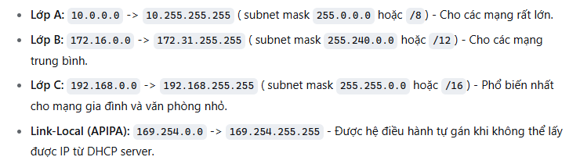

*Các dải địa chỉ IPv4*

### NAT (Network Address Translation)

#### NAT là gì?

**NAT** là chức năng sửa địa chỉ IP nguồn hoặc địa chỉ IP đích trong header của packet khi packet đi qua một thiết bị, thường là router hoặc firewall. Thiết bị NAT phải sửa thêm các trường kiểm tra liên quan để packet sau khi thay đổi vẫn hợp lệ.

NAT không tự mã hóa dữ liệu, không tự xác thực người dùng và không tự quyết định packet an toàn hay độc hại. Đây là chức năng dịch địa chỉ. Firewall là chức năng áp rule để cho phép hoặc chặn traffic. Router gia đình thường thực hiện cả NAT và firewall nên hai chức năng này dễ bị nhầm là một.

Trong mạng gia đình dùng IPv4:

- Máy trong LAN có private IP, ví dụ `192.168.1.5`.
- Router có một IP ở phía LAN, ví dụ `192.168.1.1`.
- Interface WAN của router có một địa chỉ do ISP cấp. Địa chỉ này có thể là public IPv4, hoặc có thể là địa chỉ nằm sau CGNAT của ISP.
- Private IPv4 không được định tuyến trực tiếp trên Internet công cộng. Router phải thay địa chỉ nguồn private bằng địa chỉ có thể sử dụng ở phía WAN.

#### Phân biệt NAT và PAT/NAPT

| Cơ chế | Trường bị thay đổi | Mục đích |
|---|---|---|
| **NAT thuần** | Địa chỉ IP | Dịch một địa chỉ hoặc một dải địa chỉ sang địa chỉ/dải khác |
| **PAT/NAPT** | Địa chỉ IP và port TCP/UDP | Cho nhiều máy và nhiều kết nối dùng chung một public IPv4 |

Trong cách nói hằng ngày, “NAT của router gia đình” thường thực sự là **PAT/NAPT**. Router không chỉ thay private IP bằng public IP mà còn có thể thay source port để mỗi luồng có một ánh xạ riêng.

Ví dụ:

```text
Laptop A: 192.168.1.5:54321  \
                                  Router PAT: 198.51.100.10:62001 --> Web server
Laptop B: 192.168.1.6:54321  /
                                  Router PAT: 198.51.100.10:62002 --> Web server
```

Hai laptop có thể tình cờ dùng cùng source port `54321`. Router vẫn phân biệt được vì nó cấp hai port phía ngoài khác nhau là `62001` và `62002`.

#### Một kết nối đi ra Internet qua PAT

Giả sử:

| Thành phần | Địa chỉ |
|---|---|
| Laptop | `192.168.1.5` |
| Router phía LAN | `192.168.1.1` |
| Router phía WAN | `198.51.100.10` |
| Web server | `203.0.113.20:443` |

1. Ứng dụng trên laptop tạo kết nối TCP từ `192.168.1.5:54321` tới `203.0.113.20:443`.
2. Laptop thấy server không nằm trong subnet LAN nên gửi packet tới default gateway `192.168.1.1`. IP đích trong packet vẫn là `203.0.113.20`; chỉ frame Ethernet của chặng LAN có MAC đích là MAC của router.
3. Router nhận packet và tạo một ánh xạ PAT, ví dụ:

   ```text
   TCP 192.168.1.5:54321 <-> 198.51.100.10:62345
       đích từ xa: 203.0.113.20:443
   ```

4. Router sửa source IP và source port:

   ```text
   Trước PAT: 192.168.1.5:54321  -> 203.0.113.20:443
   Sau PAT:   198.51.100.10:62345 -> 203.0.113.20:443
   ```

5. Web server chỉ thấy kết nối đến từ `198.51.100.10:62345`. Server không biết private IP `192.168.1.5` chỉ bằng packet này.
6. Server gửi phản hồi tới `198.51.100.10:62345`.
7. Router tìm thấy ánh xạ, sửa destination IP và destination port:

   ```text
   Trước dịch ngược: 203.0.113.20:443 -> 198.51.100.10:62345
   Sau dịch ngược:   203.0.113.20:443 -> 192.168.1.5:54321
   ```

8. Router dùng ARP/neighbor cache để tìm MAC của laptop, tạo frame mới và gửi packet vào LAN.

Địa chỉ IP và port của server không bị thay đổi trong ví dụ này. Router chủ yếu sửa phía nguồn khi packet đi ra và sửa phía đích khi packet phản hồi đi vào.

#### Bảng NAT/PAT lưu gì?

Một entry có thể chứa:

```text
protocol
IP:port phía trong trước khi dịch
IP:port phía ngoài sau khi dịch
IP:port của máy từ xa
thời điểm hết hạn hoặc trạng thái liên quan
```

Chi tiết chính xác tùy hệ điều hành và thiết bị. TCP thường được theo dõi theo trạng thái kết nối; UDP không có handshake nên thiết bị thường giữ ánh xạ trong một khoảng timeout sau packet cuối. ICMP không có TCP/UDP port, vì vậy thiết bị có thể dùng các trường như ICMP identifier để phân biệt luồng.

Bảng NAT/PAT có dung lượng hữu hạn. Nếu có quá nhiều ánh xạ đồng thời hoặc hết port phía ngoài khả dụng, router có thể không tạo được kết nối mới dù đường truyền Internet vẫn đang hoạt động.

#### Các kiểu NAT thường gặp

| Kiểu | Thay đổi chính | Trường hợp dùng |
|---|---|---|
| **SNAT (Source NAT)** | Sửa source IP | Packet đi từ mạng trong sang mạng ngoài |
| **DNAT (Destination NAT)** | Sửa destination IP | Chuyển traffic đi vào tới một máy/dịch vụ khác |
| **Static NAT** | Ánh xạ cố định một địa chỉ với một địa chỉ | Công bố một máy bằng một public IP riêng |
| **Dynamic NAT** | Chọn địa chỉ từ một pool khi cần | Nhiều máy dùng một nhóm public IP |
| **PAT/NAPT** | Sửa IP và port | Nhiều kết nối dùng chung một public IP |

**Masquerade** thường là một dạng SNAT lấy địa chỉ hiện tại của interface WAN, phù hợp khi IP WAN được cấp động. Tên và cách cấu hình cụ thể phụ thuộc hệ điều hành/router.

#### Port forwarding hoạt động thế nào?

**Port forwarding** thường là DNAT có rule cấu hình trước. Ví dụ:

```text
198.51.100.10:8080/TCP -> 192.168.1.10:80/TCP
```

Khi packet từ Internet tới `198.51.100.10:8080`, router đổi đích thành `192.168.1.10:80` và chuyển vào LAN. Khi server nội bộ phản hồi, router thực hiện phép dịch ngược để phía client Internet tiếp tục thấy đầu bên kia là `198.51.100.10:8080`.

Port forwarding không tự bảo đảm dịch vụ truy cập được. Cần đồng thời thỏa mãn:

- Traffic Internet thực sự được định tuyến tới địa chỉ WAN đó.
- Không bị CGNAT phía ISP chặn trước khi tới router nhà.
- Firewall cho phép protocol/port tương ứng.
- Dịch vụ nội bộ đang chạy và listen đúng IP/port.
- Máy nội bộ có route phản hồi phù hợp, thường qua chính router NAT.

Mở port forwarding làm dịch vụ nội bộ nhận traffic từ Internet. Chỉ nên mở port cần thiết, cập nhật phần mềm và áp authentication phù hợp.

#### CGNAT: hai lần dịch địa chỉ

Nếu ISP dùng CGNAT, đường đi có thể là:

```text
192.168.1.5
  -> router nhà dịch thành 100.64.10.20
  -> router CGNAT của ISP dịch thành 203.0.113.50
  -> Internet
```

Trong trường hợp này, `100.64.10.20` không phải public IPv4 trực tiếp của gia đình. Rule port forwarding trên router nhà chỉ điều khiển lớp NAT thứ nhất; người dùng thường không điều khiển được lớp CGNAT của ISP. Vì vậy kết nối chủ động từ Internet vào nhà thường không hoạt động nếu ISP không cung cấp public IP, cơ chế mở port, hoặc giải pháp thay thế.

Dải `100.64.0.0/10` được dành cho shared address space của nhà mạng. Tuy nhiên ISP cũng có thể triển khai theo cách khác, nên chỉ nhìn một địa chỉ không phải lúc nào cũng đủ để kết luận toàn bộ kiến trúc.

#### NAT không phải firewall

- NAT sửa header để dịch địa chỉ hoặc port.
- Firewall kiểm tra rule và quyết định cho phép/chặn.
- Một packet có thể được NAT nhưng vẫn bị firewall chặn.
- Một packet có thể được firewall cho phép mà không cần NAT, ví dụ traffic được định tuyến giữa hai subnet private.
- Việc kết nối mới từ Internet thường không vào được router gia đình là kết quả của cả việc không có ánh xạ NAT phù hợp và policy firewall, không nên gọi chung là “NAT bảo vệ mạng”.

#### Hạn chế của NAT/PAT

- Kết nối từ ngoài vào cần rule hoặc cơ chế NAT traversal phù hợp.
- Một số giao thức ghi IP/port bên trong payload có thể cần xử lý bổ sung và dễ gặp lỗi.
- P2P, VoIP, game online và VPN có thể cần STUN, TURN, ICE, UDP hole punching, relay hoặc cấu hình riêng.
- Log chỉ có public IP thường chưa đủ xác định máy nội bộ; cần thêm port, protocol, thời gian chính xác và log ánh xạ NAT.
- NAT làm packet bị thay đổi giữa hai endpoint, khiến việc phân tích packet và xử lý sự cố phức tạp hơn.
- NAT không thay thế TLS, VPN, authentication, cập nhật phần mềm hoặc firewall.

#### NAT và IPv6

IPv6 có không gian địa chỉ lớn nên thiết bị có thể dùng global IPv6 riêng; cách triển khai phổ biến không cần PAT để tiết kiệm địa chỉ như IPv4. Điều này không có nghĩa máy IPv6 phải mở ra Internet. Firewall vẫn có thể chặn kết nối đi vào và chỉ cho phép traffic phản hồi của kết nối đã được cho phép.

NAT66 tồn tại nhưng không phải yêu cầu mặc định của IPv6. Không nên coi “không dùng NAT” là “không có bảo mật”; bảo mật truy cập do firewall, policy, phân đoạn mạng và cấu hình dịch vụ quyết định.

### Default gateway

- **Default gateway:** router mà host gửi packet tới khi đích không nằm trên mạng trực tiếp và không có route cụ thể hơn. Nó là “lối ra mặc định” sang mạng khác, không nhất thiết luôn là Internet.

- Trong mạng gia đình, default gateway thường là interface LAN của router.

- **On-link (nằm trực tiếp trên cùng link/prefix):** đích mà host có thể gửi frame trực tiếp không cần router trung gian.

- IPv4 dùng ARP để tìm MAC của IPv4 on-link; IPv6 dùng Neighbor Discovery để tìm hàng xóm/router, phân giải địa chỉ link-layer và kiểm tra khả năng truy cập.

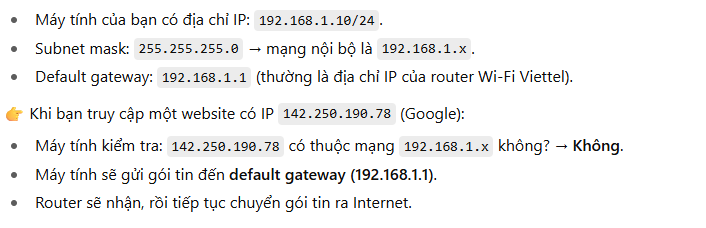

*Hình 34*

### Subnet, subnet mask và CIDR (Classless Inter-Domain Routing: định tuyến liên miền không phân lớp)

#### Subnet là gì?

**Subnet (mạng con)** là một tập địa chỉ IP có chung một số bit đầu, gọi là **network prefix**. Prefix xác định mạng; các bit còn lại dùng để tạo địa chỉ cho các interface trong mạng đó.

Ví dụ `192.168.1.0/24`:

- IPv4 có tổng cộng 32 bit.
- `/24` cho biết 24 bit đầu là phần prefix.
- 8 bit còn lại là phần host.
- Dải địa chỉ của subnet là `192.168.1.0` đến `192.168.1.255`.

Một địa chỉ đầy đủ nên được viết kèm prefix, ví dụ `192.168.1.20/24`. Chỉ viết `192.168.1.20` chưa đủ để xác định subnet của interface, vì cùng địa chỉ đó có thể được cấu hình với `/24`, `/25`, `/26` hoặc prefix khác.

Subnet được dùng để:

- Xác định một route tới một nhóm địa chỉ thay vì tạo route cho từng địa chỉ.
- Cho host biết địa chỉ nào được coi là on-link theo cấu hình routing.
- Chia một khối địa chỉ lớn thành nhiều khối nhỏ phù hợp với từng mạng.
- Tách user, server, thiết bị quản trị hoặc môi trường khác nhau để có thể áp routing, firewall và ACL giữa chúng.

Subnet là khái niệm Layer 3. **VLAN/broadcast domain** là khái niệm Layer 2. Thiết kế thông thường ánh xạ một IPv4 subnet với một VLAN, nhưng chúng không phải cùng một thứ. Một VLAN về kỹ thuật có thể chứa nhiều IP subnet, dù cách này thường làm thiết kế và xử lý sự cố khó hơn.

Việc chia subnet không tự tạo ra bảo mật. Muốn ngăn hoặc giới hạn traffic giữa các subnet phải có router, firewall, ACL hoặc policy tương ứng.

#### Subnet mask là gì?

**Subnet mask** là cách IPv4 đánh dấu bit nào thuộc network prefix và bit nào thuộc phần host:

- Bit prefix là `1`.
- Bit host là `0`.
- Với subnet mask thông thường, các bit `1` phải liên tiếp từ trái sang phải, sau đó mới đến các bit `0`.

Ví dụ `/24`:

```text
Prefix length:  /24
Binary mask:    11111111.11111111.11111111.00000000
Decimal mask:   255.255.255.0
```

Ví dụ `/26`:

```text
Prefix length:  /26
Binary mask:    11111111.11111111.11111111.11000000
Decimal mask:   255.255.255.192
```

`255.255.255.192` có 26 bit `1`: ba octet đầu có 24 bit `1`, octet cuối `11000000` có thêm 2 bit `1`.

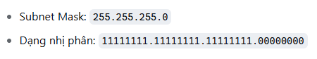

*Hình 35*

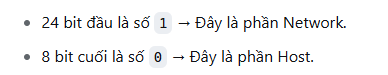

*Hình 36*

#### CIDR là gì?

**CIDR** là phương pháp biểu diễn, cấp phát và định tuyến địa chỉ bằng độ dài prefix thay đổi. Cú pháp:

```text
địa-chỉ/prefix-length
```

Ví dụ:

```text
192.168.1.0/24
10.10.8.0/21
2001:db8:1234::/48
```

Trong IPv4, prefix length nằm từ `/0` đến `/32`. Trong IPv6, nó nằm từ `/0` đến `/128`.

- Prefix càng nhỏ thì khối địa chỉ càng lớn. `/16` chứa nhiều địa chỉ hơn `/24`.
- Prefix càng lớn thì khối địa chỉ càng nhỏ. `/28` chứa ít địa chỉ hơn `/24`.
- `/0` không cố định bit nào và khớp mọi địa chỉ; route `0.0.0.0/0` thường là default route IPv4.
- `/32` cố định cả 32 bit và chỉ biểu diễn đúng một địa chỉ IPv4; nó thường được dùng làm host route.

Trước CIDR, IPv4 được cấp phát và định tuyến chủ yếu theo class A, B, C với các kích thước cố định. CIDR cho phép dùng prefix như `/20`, `/23`, `/27`, nhờ đó cấp phát sát nhu cầu hơn và tổng hợp nhiều route khi các prefix phù hợp.


*Hình 37*

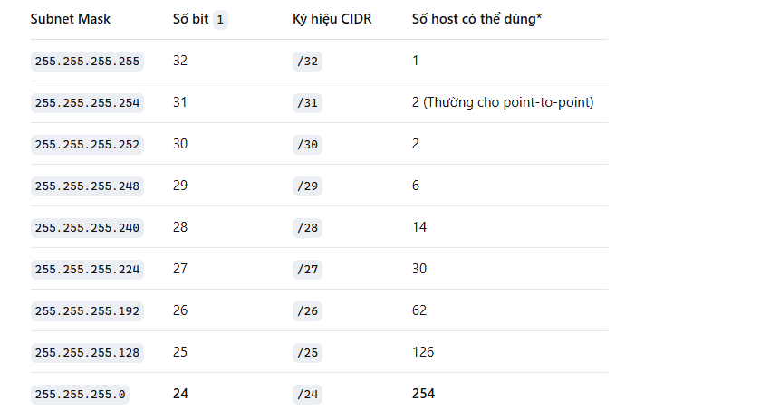

*Hình 38*

#### Cách tìm network address bằng phép AND

Network address được tính bằng:

```text
IPv4 address AND subnet mask = network address
```

Ví dụ với `192.168.1.70/26`:

```text
IP:       192.168.1.70  = 11000000.10101000.00000001.01000110
Mask:     255.255.255.192
                         = 11111111.11111111.11111111.11000000
AND result:
          192.168.1.64  = 11000000.10101000.00000001.01000000
```

Vì vậy `192.168.1.70/26` thuộc subnet `192.168.1.64/26`, không thuộc `192.168.1.0/26`.

Với `/26`, 6 bit cuối là phần host. Mỗi subnet chứa:

```text
2^(32 - 26) = 2^6 = 64 địa chỉ
```

Các subnet `/26` nằm trong `192.168.1.0/24` bắt đầu tại:

| Subnet | Toàn bộ dải |
|---|---|
| `192.168.1.0/26` | `.0` – `.63` |
| `192.168.1.64/26` | `.64` – `.127` |
| `192.168.1.128/26` | `.128` – `.191` |
| `192.168.1.192/26` | `.192` – `.255` |

Khoảng cách giữa hai network address liên tiếp là 64. Con số này thường được gọi là **block size**.

#### Network address, broadcast address và địa chỉ host

Trong một IPv4 subnet thông thường:

- **Network address:** tất cả bit host bằng `0`; dùng để biểu diễn subnet trong routing.
- **Directed broadcast address:** tất cả bit host bằng `1`; biểu diễn việc gửi tới toàn bộ host trong subnet đó.
- Các địa chỉ nằm giữa hai địa chỉ trên có thể được gán cho interface.

Với `192.168.1.64/26`:

| Loại | Địa chỉ |
|---|---|
| Network address | `192.168.1.64` |
| Host đầu tiên | `192.168.1.65` |
| Host cuối cùng | `192.168.1.126` |
| Broadcast address | `192.168.1.127` |

Số địa chỉ có thể gán cho host trong IPv4 subnet thông thường:

```text
2^(số bit host) - 2
```

Với `/26`, kết quả là `64 - 2 = 62` địa chỉ host.

Công thức trừ 2 không áp dụng máy móc cho mọi trường hợp:

- `/31` có 2 địa chỉ và được phép dùng cả hai đầu trên link point-to-point theo RFC 3021; không dùng network/broadcast theo cách subnet truyền thống.
- `/32` biểu diễn một địa chỉ duy nhất, thường dùng cho host route hoặc loopback; không phải một LAN có số host bằng `2^0 - 2`.
- IPv6 không có broadcast address và không dùng công thức “trừ network và broadcast” như IPv4.

Router thường không chuyển tiếp directed broadcast mặc định vì nó có thể bị lạm dụng. IPv6 dùng multicast cho các chức năng cần gửi tới một nhóm node.

#### Bảng quy đổi prefix IPv4 thường gặp

| Prefix | Subnet mask | Tổng địa chỉ | Host dùng được theo cách truyền thống |
|---|---|---:|---:|
| `/16` | `255.255.0.0` | 65,536 | 65,534 |
| `/20` | `255.255.240.0` | 4,096 | 4,094 |
| `/24` | `255.255.255.0` | 256 | 254 |
| `/25` | `255.255.255.128` | 128 | 126 |
| `/26` | `255.255.255.192` | 64 | 62 |
| `/27` | `255.255.255.224` | 32 | 30 |
| `/28` | `255.255.255.240` | 16 | 14 |
| `/29` | `255.255.255.248` | 8 | 6 |
| `/30` | `255.255.255.252` | 4 | 2 |
| `/31` | `255.255.255.254` | 2 | 2 trên point-to-point |
| `/32` | `255.255.255.255` | 1 | 1 địa chỉ/host route |

#### Host quyết định gửi trực tiếp hay qua router

Quyết định thực tế dựa trên **routing table**, không chỉ dựa vào việc người học nhìn hai IP và thấy chúng có vẻ giống nhau.

Khi cấu hình `192.168.1.70/26` trên interface, hệ điều hành thường tạo connected/on-link route cho `192.168.1.64/26`. Khi gửi packet, hệ điều hành:

1. Tìm tất cả route khớp destination IP.
2. Chọn route có prefix dài nhất.
3. Nếu route được đánh dấu on-link, tìm địa chỉ Layer 2 của destination bằng ARP rồi gửi trực tiếp.
4. Nếu route chỉ định next hop, tìm địa chỉ Layer 2 của next hop rồi gửi frame cho next hop. IP đích của packet vẫn là IP đích cuối cùng.

Cách kiểm tra đơn giản xem hai IPv4 address có nằm trong cùng một prefix:

```text
IP A AND mask == IP B AND mask
```

Ví dụ với mask `/26`:

```text
192.168.1.70  AND /26 = 192.168.1.64
192.168.1.100 AND /26 = 192.168.1.64  -> cùng prefix
192.168.1.130 AND /26 = 192.168.1.128 -> khác prefix
```

Phép tính này giúp xác định cùng prefix, nhưng route cụ thể hơn, policy routing, proxy ARP hoặc cấu hình đặc biệt vẫn có thể làm hành vi thực tế khác với mô hình cơ bản.

#### Longest prefix match

Nếu nhiều route cùng khớp destination IP, router hoặc host chọn route có prefix dài nhất vì route đó mô tả tập địa chỉ cụ thể hơn.

Ví dụ routing table:

| Route | Next hop |
|---|---|
| `0.0.0.0/0` | Router A |
| `10.0.0.0/8` | Router B |
| `10.20.0.0/16` | Router C |
| `10.20.30.0/24` | Router D |

Packet tới `10.20.30.40` khớp cả bốn route, nhưng `/24` dài nhất nên được gửi tới Router D. Packet tới `10.50.1.2` chỉ khớp `/8` và `/0`, vì vậy `/8` qua Router B được chọn.

“Dài nhất” nói về số bit prefix, không nói về khoảng cách vật lý, số router phải đi qua hoặc latency.

#### Chia một subnet lớn thành các subnet nhỏ

Muốn chia `192.168.1.0/24` thành 4 subnet có kích thước bằng nhau:

1. Cần 4 subnet, tức `2^2`; mượn 2 bit từ phần host.
2. Prefix mới là `/24 + 2 = /26`.
3. Mỗi `/26` có 64 địa chỉ, trong trường hợp truyền thống có 62 địa chỉ host.
4. Kết quả là:

   ```text
   192.168.1.0/26
   192.168.1.64/26
   192.168.1.128/26
   192.168.1.192/26
   ```

Không bắt buộc mọi subnet phải có kích thước bằng nhau. **VLSM (Variable Length Subnet Mask)** cho phép dùng các prefix khác nhau, ví dụ cấp `/25` cho mạng cần khoảng 100 host, `/27` cho mạng cần khoảng 20 host và `/30` hoặc `/31` cho link nhỏ. Các khối phải không chồng lấn và network address phải nằm đúng biên của kích thước khối.

#### Tổng hợp route

CIDR còn cho phép gộp nhiều prefix liên tiếp thành một route ngắn hơn nếu chúng:

- Có kích thước phù hợp.
- Liên tiếp.
- Cùng chia sẻ đủ bit prefix đầu.
- Bắt đầu đúng ranh giới của prefix tổng hợp.

Ví dụ:

```text
192.168.0.0/24
192.168.1.0/24
```

có thể được tổng hợp thành:

```text
192.168.0.0/23
```

Nhưng `192.168.1.0/24` và `192.168.2.0/24` không thể gộp chính xác thành một `/23`, vì một khối `/23` phải bắt đầu ở octet thứ ba là số chẵn: `.0`, `.2`, `.4`, ...

Tổng hợp route làm routing table nhỏ hơn, nhưng route tổng hợp chỉ nên được quảng bá khi router thực sự có đường tới toàn bộ dải được tổng hợp hoặc có cách xử lý phần không tồn tại để tránh chuyển packet sai hướng.

#### Các lỗi cấu hình và cách hiểu thường gặp

- **Hai IP có ba octet đầu giống nhau nên cùng subnet:** sai nếu chưa biết prefix. `192.168.1.70/26` và `192.168.1.100/26` cùng thuộc `192.168.1.64/26`, nhưng `192.168.1.10/26` thuộc subnet khác là `192.168.1.0/26`.
- **Mọi địa chỉ kết thúc bằng `.0` là network address:** sai. Với `192.168.0.0/16`, địa chỉ `192.168.1.0` là một địa chỉ nằm trong subnet và về mặt subnet có thể gán cho host. Vai trò của địa chỉ phụ thuộc prefix, không phụ thuộc riêng octet cuối.
- **Mọi địa chỉ kết thúc bằng `.255` là broadcast:** sai vì cùng lý do. Ví dụ broadcast của `192.168.1.0/23` là `192.168.1.255`, nhưng `192.168.0.255` chỉ là một địa chỉ nằm giữa dải `/23`.
- **Hai máy cấu hình mask khác nhau vẫn luôn giao tiếp bình thường:** không đúng. Một máy có thể cho rằng đích là on-link và ARP trực tiếp, trong khi máy kia cho rằng phải gửi qua gateway. Kết quả có thể là giao tiếp một chiều hoặc phụ thuộc proxy ARP.
- **Default gateway có thể đặt tùy ý:** trong cấu hình Ethernet IPv4 thông thường, gateway phải reachable qua một route on-link để host có thể ARP lấy MAC của gateway. Cấu hình gateway ngoài subnet cần cơ chế hoặc route đặc biệt.
- **Chia subnet đồng nghĩa đã chặn traffic:** sai. Nếu router/firewall cho phép, các subnet vẫn giao tiếp được với nhau.
- **Một prefix dài hơn luôn là route tốt hơn:** prefix dài hơn chỉ được ưu tiên khi cùng khớp destination. Nó cụ thể hơn, nhưng không bảo đảm đường truyền nhanh hơn hoặc ổn định hơn.

#### IPv6 prefix

IPv6 dùng prefix length nhưng không dùng subnet mask dạng thập phân như `255.255.255.0`. Ví dụ:

```text
2001:db8:1234:10::/64
```

Trong thiết kế IPv6 thông thường, một LAN được cấp `/64`. 64 bit đầu là subnet prefix và 64 bit cuối là interface identifier. Không nên áp dụng công thức đếm host IPv4 hay tự ý dùng subnet nhỏ hơn `/64` cho LAN nếu chưa hiểu ảnh hưởng tới SLAAC, Neighbor Discovery và các cơ chế IPv6 liên quan.

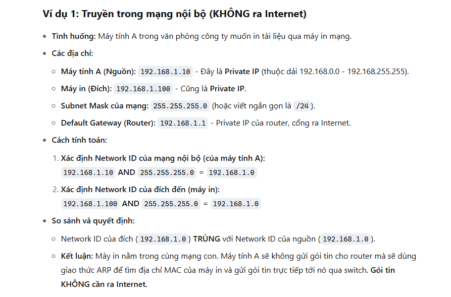

*Hình 39*

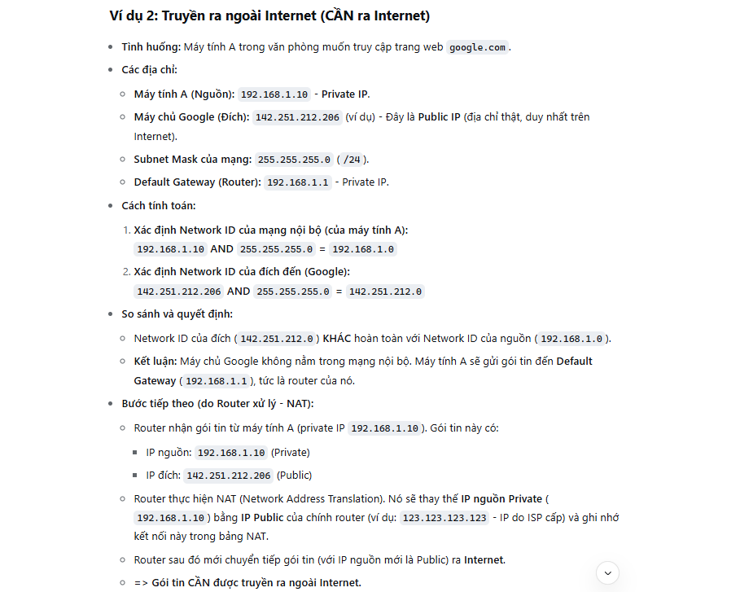

*Hình 40*

## UDP, TCP

### TCP

- **TCP:** giao thức vận chuyển tạo một luồng byte đáng tin cậy giữa hai ứng dụng. Nó dùng sequence number, ACK, truyền lại, flow control và congestion control để ứng dụng không phải tự xử lý các packet mất hoặc sai thứ tự. TCP phù hợp với web truyền thống, SSH, email và truyền file.

- **Connection-oriented (hướng kết nối):** hai đầu thiết lập trạng thái logic bằng handshake trước khi trao đổi dữ liệu. Đây không phải đường vật lý riêng; hai bên chỉ ghi nhớ sequence number, cửa sổ truyền và trạng thái của phiên.

- **Reliable delivery (truyền đáng tin cậy):** TCP phát hiện mất/lỗi, truyền lại và sắp xếp byte đúng thứ tự. TCP không bảo đảm ứng dụng đích xử lý thành công dữ liệu.

- **Flow control (kiểm soát luồng):** điều chỉnh tốc độ theo khả năng nhận của máy đích. **Congestion control (kiểm soát tắc nghẽn):** giảm tốc độ khi mạng có dấu hiệu nghẽn.

- Phù hợp với ứng dụng mà đảm bảo độ tin cậy cao nhất có thể, chấp nhận chậm một chút cũng không sao (gửi mail, truyền file, SSH,...)

- **Three-way handshake:** ba packet `SYN → SYN-ACK → ACK` dùng để hai đầu thống nhất trạng thái ban đầu và kiểm tra rằng cả hai chiều đều liên lạc được trước khi truyền dữ liệu.

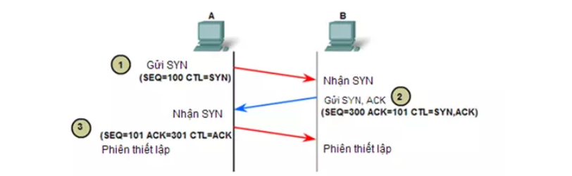

*TCP three-way handshake*

- Giả sử A muốn truyền dữ liệu tới B qua 1 TCP connection, trước khi truyền A cần thiết lập TCP connection trước qua 3 - way handshake như sau:

1. **B1:** A gửi **SYN (Synchronize: cờ yêu cầu mở kết nối và đồng bộ sequence number)** với sequence number ban đầu, ví dụ `100`.

1. **B2:** B gửi **SYN-ACK (vừa yêu cầu đồng bộ phía B, vừa xác nhận SYN của A)** với sequence number `300` và acknowledgment number `101`.

1. **B3:** Sau khi TCP connection được thiết lập, gửi lại B 1 packet seq = 101, ACK = 301 (301 = ACK B + 1) để báo rằng đã nhận được packet seq = 300 của B. (đảm bảo A có khả năng nhận)

- **Four-way termination (đóng kết nối bốn bước):** thường dùng chuỗi `FIN → ACK → FIN → ACK` vì mỗi chiều của TCP được đóng độc lập.

1. **B1:** A gửi **FIN (Finish: cờ báo phía A đã gửi xong)**; A vẫn có thể nhận dữ liệu từ B.

1. **B2:** B gửi packet có cờ ACK với ý nghĩa: oke A, tôi đã nhận được yêu cầu đóng kết nối của bạn, nhưng tôi vẫn còn đang xử lý → connection vẫn còn mở

1. **B3:** B gửi packet có cờ FIN tới A với ý nghĩa: này A, tôi đã xử lý xong rồi, tôi sẽ đóng channel gửi dữ liệu của tôi tới bạn

1. **B4:** A gửi packet có cờ ACK tới B với ý nghĩa: đồng ý, tôi đã nhận được, chúng ta hãy cùng đóng kết nối an toàn.

### UDP

- **UDP:** giao thức vận chuyển gửi từng thông điệp độc lập mà không thiết lập kết nối hay tự truyền lại. Mục đích là giảm overhead và cho ứng dụng tự quyết định cách xử lý độ tin cậy; thường dùng cho DNS, thoại/video thời gian thực, game và làm nền cho QUIC.

- Đơn vị dữ liệu của UDP gọi là **datagram (thông điệp độc lập có ranh giới rõ ràng)**, không phải “diagram”.

- **Connectionless (không kết nối):** UDP không thiết lập kết nối trước khi gửi dữ liệu, máy cứ thế phóng các gói tin đi mà không cần biết gói nhận có đang sẵn sàng hay không → tiết kiệm thời gian, tài nguyên hơn TCP

- **Unreliable/best-effort:** UDP không tự ACK, truyền lại, sắp xếp thứ tự hay kiểm soát tắc nghẽn; ứng dụng có thể tự bổ sung nếu cần.

- Phù hợp với các ứng dụng ưu tiên tốc độ, thời gian thực hơn là độ chính xác tuyệt đối (streaming video, game online, DNS,...)

- **Socket:** đối tượng/API mà process dùng để nói chuyện với network stack của hệ điều hành. Nó là điểm giao giữa code ứng dụng và TCP/UDP; ví dụ web server tạo socket, bind port `8080`, listen và nhận kết nối từ client.

### Socket

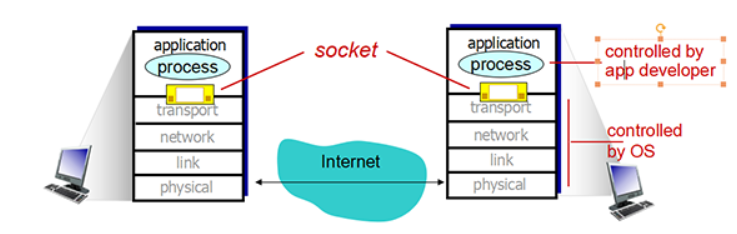

*Socket giữa hai process*

- Giữa 2 chương trình chạy trên mạng cần liên kết 2 chiều để kết nối 2 chương trình này với nhau, điểm cuối của liên kết này được gọi là Socket (biểu diễn kết nối giữa Client và Server, Socket thì như điểm đầu, điểm cuối của connection)

- Socket giúp TCP, UDP định danh ứng dụng mà dữ liệu sẽ được gửi tới qua port

- Socket hỗ trợ hầu hết các hđh (Window, Linux,...) + được sử dụng với nhiều ngôn ngữ lập trình phổ biến (C, C++, Java,…)

- **Stream socket (socket luồng):** socket thường dùng với TCP, cung cấp một luồng byte hai chiều sau khi kết nối được thiết lập.

### Stream socket (socket luồng)


*Stream socket*

- Stream Socket chỉ hoạt động khi server, client đã được kết nối với nhau

- Dữ liệu truyền đi đảm bảo đến đúng nơi nhận, đúng thứ tự và thời gian nhanh chóng.

- Mỗi thông điệp gửi đi đều có xác nhận trả về để thông báo về thông tin truyền tải.

- **Phía Server:**

1. **B1:** Server gọi `socket()` để tạo socket, `bind()` để gắn local IP/port và `listen()` để tạo **listening socket (socket chờ kết nối mới)**.

1. **B2:** `accept()` tạo **connected socket (socket dành riêng cho một kết nối TCP)**; listening socket tiếp tục chờ client khác.

- **Phía Client:**

1. **B1:** Khi Client send request, sẽ khởi tạo Socket: socket()

1. **B2:** connect() Client gửi yêu cầu kết nối tới Server dựa vào IP, port

1. **B3:** Sau khi kết nối được thiết lập, cả 2 bên có thể gửi, nhận dữ liệu qua socket của mình.

1. **B4:** Khi giao tiếp xong, 2 bên sẽ close() để đóng connection, Client sẽ close socket đi.

- **Datagram socket (socket datagram):** thường dùng với UDP; mỗi lần gửi/nhận xử lý một datagram và giữ nguyên ranh giới thông điệp.

### Datagram socket (socket datagram)

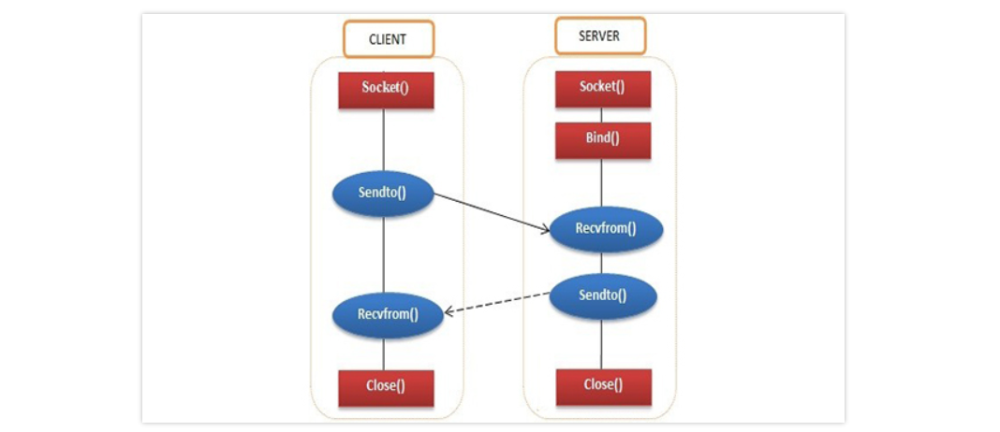

*Datagram socket*

- Khác ở chỗ chỉ cần 1 main socket ở phía server để handle toàn bộ request từ các client (không cần tạo socket mới vì không nắm giữ thông tin như TCP: số lượng packet, ACK number, trạng thái kết nối,...)

- **Channel (kênh truyền):** con đường vật lý hoặc logic để dữ liệu đi từ điểm này tới điểm khác.

- Có thể hình dung nó như đường ống/ làn đường dành riêng cho việc vận chuyển dữ liệu + mỗi Channel cho phép luồng thông tin riêng biệt di chuyển giữa các thiết bị.

### Physical channel (kênh vật lý) và logical channel (kênh logic)

- **Physical channel (kênh vật lý):** phương tiện/tài nguyên truyền tín hiệu thực như cáp, sợi quang, tần số vô tuyến hoặc khe thời gian.

- **Logical channel (kênh logic):** luồng giao tiếp được giao thức phân biệt trên cùng hạ tầng vật lý, ví dụ nhiều kết nối TCP cùng dùng một link Ethernet. Logical channel không nhất thiết chỉ tồn tại ở Transport layer.

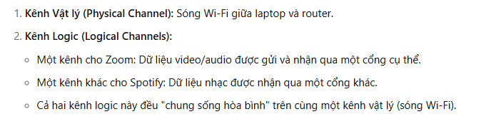

*Hình 45*


*Hình 46*

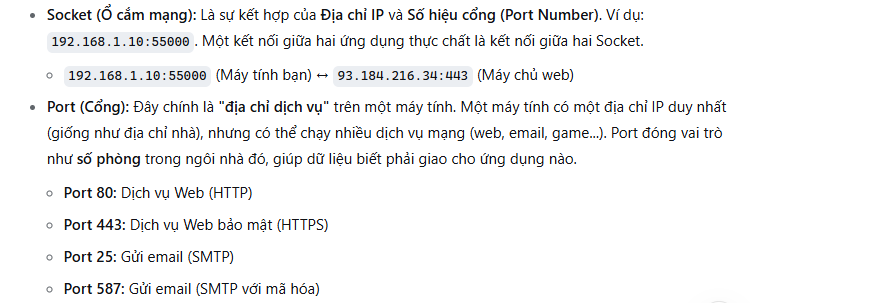

*Hình 47*

- **Wi-Fi channel (kênh Wi-Fi):** một dải tần con trong băng tần như `2.4 GHz`, `5 GHz` hoặc `6 GHz`. Các mạng gần nhau dùng kênh trùng/chồng lấn có thể phải chia sẻ airtime và giảm hiệu năng.

- **Channel trong lập trình mạng:** trong lập trình, 1 channel riêng biệt thể hiện như 1 Socket connection giữa Client và Server.

### Simplex (đơn công), half-duplex (bán song công) và full-duplex (song công toàn phần)

- **Simplex (đơn công):** dữ liệu chỉ truyền theo một hướng, ví dụ đài phát thanh quảng bá tới máy thu.

- **Half-duplex (bán song công):** dữ liệu có thể truyền theo 2 hướng, nhưng không đồng thời (bộ đàm: một người nói “over” để báo hiệu kết thúc và chuyển sang chế độ nghe, cho phép người kia trả lời), chỉ 1 thiết bị được phát tại 1 thời điểm (xảy ra khi tín hiệu cùng tồn tại trên 1 channel chung: nếu 2 đầu cùng send message thì sẽ bị collision gây biến dạng mà 2 đầu không thể nhận biết được message → giải pháp là chờ tới lượt nhau)

- **Full-duplex (song công toàn phần):** hai phía gửi và nhận đồng thời, ví dụ Ethernet switched hiện đại hoặc cuộc gọi điện thoại.

### Multiplexing (ghép kênh)

#### Multiplexing là gì?

**Multiplexing** là việc nhận dữ liệu từ nhiều nguồn hoặc nhiều luồng, thêm thông tin để phân biệt chúng, rồi cho chúng dùng chung một tài nguyên truyền hoặc một giao thức bên dưới.

Multiplexing không chỉ có một dạng. Thông tin dùng để phân biệt phụ thuộc tầng:

| Phạm vi | Nhiều thành phần dùng chung | Thông tin phân biệt |
|---|---|---|
| Ghép kênh vật lý | Một đường truyền hoặc dải tần | Tần số, khe thời gian, bước sóng hoặc mã |
| Ethernet | Một Ethernet link | Trường EtherType, VLAN tag và địa chỉ MAC |
| IP | Một IP interface/đường truyền | Source/destination IP và trường protocol/next header |
| TCP/UDP | Một network stack và interface | Protocol, source/destination IP và source/destination port |
| HTTP/2 | Một TCP connection | Stream ID trong HTTP/2 frame |

Các cơ chế trong bảng cùng có tên “multiplexing” vì đều cho nhiều luồng dùng chung tài nguyên, nhưng chúng hoạt động ở các tầng khác nhau và dùng bộ định danh khác nhau. Không nên dùng tần số hoặc khe thời gian để giải thích trực tiếp cách TCP phân biệt application.

#### Transport-layer multiplexing

Ở tầng transport, hệ điều hành nhận dữ liệu từ nhiều socket/process và tạo TCP segment hoặc UDP datagram. Mỗi segment/datagram có source port và destination port để phía nhận có thể giao dữ liệu tới socket phù hợp.

Ví dụ laptop đồng thời chạy:

```text
Trình duyệt 1: 192.168.1.20:51000 -> 203.0.113.10:443 TCP
Trình duyệt 2: 192.168.1.20:51001 -> 203.0.113.10:443 TCP
Ứng dụng DNS: 192.168.1.20:53000 -> 192.168.1.1:53 UDP
```

Ba luồng dùng chung card mạng và IP của laptop nhưng vẫn khác nhau nhờ protocol, địa chỉ IP và port.

Source port của client thường là **ephemeral port (port tạm thời)** do hệ điều hành chọn từ một dải cấu hình. Hai kết nối tới cùng server và cùng destination port phải có bộ định danh khác nhau; trong ví dụ trên, `51000` và `51001` giúp phân biệt hai TCP connection.

Multiplexing xảy ra mỗi khi một host gửi dữ liệu của nhiều socket xuống network stack. Một thiết bị có thể đồng thời multiplex dữ liệu gửi đi và demultiplex dữ liệu nhận về; đây không phải hai vai trò cố định dành riêng cho client và server.

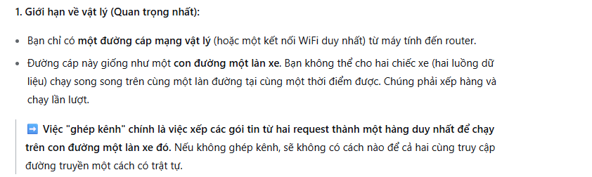

*Hình 48*

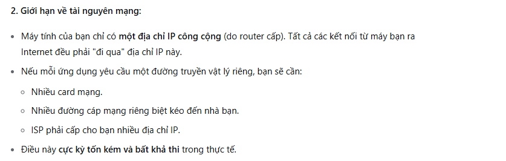

*Hình 49*

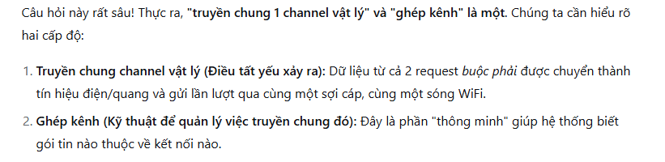

*Hình 50*

### Demultiplexing (tách kênh)

#### Demultiplexing là gì?

**Demultiplexing** là việc phía nhận đọc các trường trong header để chuyển dữ liệu lên đúng giao thức, socket hoặc luồng ứng dụng.

Quá trình nhận có nhiều bước demultiplexing:

1. Card mạng và Ethernet xử lý frame dành cho interface/VLAN phù hợp.
2. Trường EtherType cho biết payload là IPv4, IPv6, ARP hoặc giao thức khác.
3. IP kiểm tra destination IP và đọc trường protocol/next header để giao payload cho TCP, UDP, ICMP hoặc giao thức tương ứng.
4. TCP/UDP dùng địa chỉ và port để tìm socket nhận.
5. Ứng dụng có thể tiếp tục tách dữ liệu thành request, session hoặc stream riêng, ví dụ HTTP/2 dùng stream ID.

Demultiplexing không phải routing. **Routing/forwarding** quyết định packet cần đi qua interface hoặc next hop nào. **Demultiplexing** trên máy nhận quyết định thành phần nào trong máy sẽ xử lý dữ liệu.

#### TCP demultiplexing

Một TCP connection thường được nhận diện bằng:

```text
source IP
source port
destination IP
destination port
transport protocol = TCP
```

Bốn giá trị địa chỉ/port thường được gọi là **4-tuple**. Nếu tính cả protocol thì đó là **5-tuple**.

Ví dụ web server `10.0.0.10:443` phục vụ hai client:

```text
198.51.100.20:51000 -> 10.0.0.10:443 TCP
203.0.113.30:52000  -> 10.0.0.10:443 TCP
```

Cả hai segment có destination port `443`, nhưng chúng thuộc hai connection khác nhau vì source IP và source port khác nhau. Vì vậy câu “TCP chỉ nhìn destination port để giao dữ liệu” là không đầy đủ.

Ở server:

- **Listening socket** được bind vào local IP/port, ví dụ `0.0.0.0:443`, để nhận yêu cầu mở connection mới.
- Khi handshake thành công, hệ điều hành tạo trạng thái/connected socket cho connection cụ thể.
- Listening socket tiếp tục nhận connection mới; các connected socket xử lý dữ liệu của từng connection.
- Nhiều connected socket có thể cùng local port `443` vì remote IP/port của chúng khác nhau.

`0.0.0.0:443` thường có nghĩa socket lắng nghe trên mọi IPv4 local address phù hợp, không phải server có địa chỉ IP thật là `0.0.0.0`.

#### UDP demultiplexing

UDP không thiết lập connection bằng handshake như TCP. Một UDP server thường bind một socket vào local IP/port, ví dụ `10.0.0.10:53`, và nhận datagram từ nhiều client trên cùng socket.

Mỗi lần nhận, hệ điều hành cung cấp cả payload và địa chỉ nguồn để ứng dụng biết cần phản hồi cho client nào:

```text
Client A: 198.51.100.20:53000 -> 10.0.0.10:53 UDP
Client B: 203.0.113.30:54000  -> 10.0.0.10:53 UDP
```

Cả hai datagram có thể được giao vào cùng UDP socket `10.0.0.10:53`. Ứng dụng đọc source IP:port đi kèm từng datagram và gửi response về đúng nguồn.

UDP cũng có thao tác `connect()` ở nhiều hệ điều hành, nhưng thao tác này không tạo handshake hay biến UDP thành TCP. Nó có thể đặt remote peer mặc định và khiến kernel chỉ giao datagram từ peer phù hợp cho socket đó.

Quy tắc chọn socket chính xác còn phụ thuộc hệ điều hành và các tùy chọn như bind vào wildcard address, `SO_REUSEPORT`, connected UDP hoặc nhiều địa chỉ local. Mô hình cơ bản cần nhớ là TCP demultiplex theo từng connection, còn UDP server thường có thể dùng một socket để nhận datagram từ nhiều nguồn.

#### Nếu không tìm thấy socket phù hợp

- Với UDP, host thường loại datagram và có thể gửi ICMP Destination Unreachable/Port Unreachable, nếu policy cho phép.
- Với TCP, packet SYN tới port không có listener thường nhận TCP RST, nếu firewall không âm thầm loại packet.
- Firewall có thể drop packet trước khi transport layer thực hiện demultiplexing, nên phía gửi có thể chỉ thấy timeout.

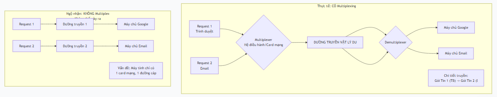

*Hình 51*

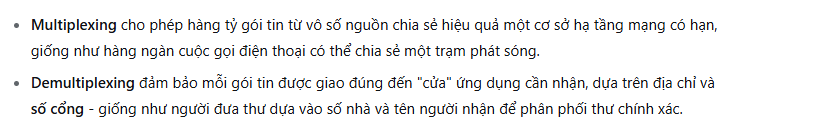

*Hình 52*

### Workflow (luồng xử lý)

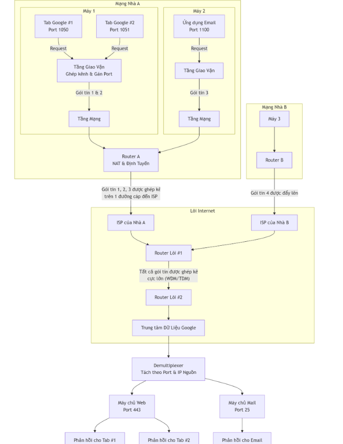

*Hình 53*

#### Các khái niệm cần phân biệt

| Khái niệm | Nội dung |
|---|---|
| **Process** | Chương trình đang chạy, ví dụ trình duyệt hoặc web server |
| **Socket** | Đối tượng/API để process gửi và nhận dữ liệu qua network stack |
| **Port** | Số 16 bit trong TCP/UDP header, từ `0` đến `65535` |
| **Socket endpoint** | Một đầu giao tiếp, thường mô tả bằng protocol + local IP + local port |
| **TCP connection** | Quan hệ giữa hai endpoint TCP, nhận diện bằng 4-tuple; thêm protocol thành 5-tuple |
| **Flow** | Nhóm packet có chung bộ thuộc tính; cách định nghĩa có thể tùy thiết bị và mục đích |

Port không trực tiếp định danh vĩnh viễn một process. Process phải tạo socket và bind socket vào port. Khi process đóng socket hoặc kết thúc, port có thể được process khác sử dụng nếu không còn ràng buộc hoặc trạng thái hệ điều hành ngăn cản.

#### Workflow TCP: client gửi request tới server

Giả sử:

```text
Client IP:   192.168.1.20
Client port: 51000
Server IP:   203.0.113.10
Server port: 443
Protocol:    TCP
```

1. Server tạo socket, bind vào local port `443`, gọi `listen()` và chờ connection.
2. Client tạo socket và gọi `connect(203.0.113.10, 443)`.
3. Nếu client chưa bind source port cụ thể, hệ điều hành chọn ephemeral port, ví dụ `51000`.
4. TCP thực hiện three-way handshake cho connection:

   ```text
   192.168.1.20:51000 -> 203.0.113.10:443  SYN
   203.0.113.10:443   -> 192.168.1.20:51000 SYN-ACK
   192.168.1.20:51000 -> 203.0.113.10:443  ACK
   ```

5. Server `accept()` connection và nhận một connected socket. Listening socket vẫn tồn tại để nhận client khác.
6. Application client đưa dữ liệu vào socket. TCP chia byte stream thành segment phù hợp; mỗi segment có source/destination port.
7. IP bọc TCP segment trong IP packet có source/destination IP.
8. Link layer bọc IP packet trong frame cho chặng hiện tại. MAC source/destination có thể thay đổi qua mỗi chặng Layer 2; IP và TCP endpoint thường giữ nguyên nếu không có NAT hoặc cơ chế sửa packet.
9. Trên server, Ethernet/IP/TCP lần lượt demultiplex frame, packet và segment.
10. TCP dùng connection tuple để đưa byte vào receive buffer của đúng connected socket.
11. Process server đọc dữ liệu từ socket, xử lý request và gửi response qua cùng TCP connection.

Với nhiều client, server có thể có:

```text
Listening socket:
local 203.0.113.10:443

Connected socket 1:
192.168.1.20:51000 <-> 203.0.113.10:443 TCP

Connected socket 2:
198.51.100.30:52000 <-> 203.0.113.10:443 TCP
```

Hai connected socket dùng cùng server port `443` nhưng không bị nhầm vì remote endpoint khác nhau.

#### Workflow UDP: nhiều client dùng một server socket

Giả sử DNS server bind UDP socket tại `203.0.113.53:53`:

1. Client tạo UDP socket; hệ điều hành chọn source port, ví dụ `53000`.
2. Client gọi `sendto()` để gửi một datagram:

   ```text
   192.168.1.20:53000 -> 203.0.113.53:53 UDP
   ```

3. UDP không thực hiện handshake và không chờ tạo connected socket ở server.
4. IP và link layer đóng gói rồi chuyển datagram tới server.
5. Server demultiplex theo protocol/local address/local port và đưa datagram vào receive queue của UDP socket phù hợp.
6. Process server gọi `recvfrom()`, nhận payload cùng source `192.168.1.20:53000`.
7. Server gọi `sendto()` để gửi response tới source đó.

Nếu datagram bị mất, UDP không tự truyền lại. DNS hoặc ứng dụng phía trên có thể đặt timeout, gửi lại hoặc thử server khác.

#### Multiplexing và demultiplexing trên hai chiều

Luồng request:

```text
Nhiều client socket
    -> multiplexing ở các client
    -> mạng
    -> demultiplexing ở server
    -> đúng server socket/connection
```

Luồng response:

```text
Nhiều server socket/connection
    -> multiplexing ở server
    -> mạng
    -> demultiplexing ở các client
    -> đúng client socket
```

Vì traffic thường đi hai chiều, client và server đều thực hiện cả multiplexing lẫn demultiplexing.

#### NAT ảnh hưởng thế nào?

Nếu client nằm sau NAT/PAT, bộ địa chỉ/port quan sát ở hai phía có thể khác nhau:

```text
Phía LAN:
192.168.1.20:51000 -> 203.0.113.10:443 TCP

Phía Internet sau PAT:
198.51.100.5:62000 -> 203.0.113.10:443 TCP
```

Client vẫn demultiplex response vào socket local `192.168.1.20:51000`. Server lại thấy remote endpoint là `198.51.100.5:62000`. Router PAT dùng bảng ánh xạ để dịch giữa hai cách biểu diễn.

#### Những cách hiểu sai thường gặp

- **Destination port đủ để nhận diện một TCP connection:** sai; nhiều connection cùng dùng server port `443`. Cần xét cả hai endpoint và protocol.
- **Mỗi client TCP cần một server port riêng:** sai; các client có thể cùng kết nối tới một server port.
- **UDP server phải tạo socket mới cho từng client:** thường không cần; một socket có thể nhận datagram từ nhiều source.
- **Một port luôn thuộc cố định một application:** sai; quyền sử dụng phụ thuộc socket đang bind, địa chỉ bind, protocol, namespace mạng và trạng thái hệ điều hành.
- **TCP port `53` và UDP port `53` là cùng một endpoint:** sai; TCP và UDP là hai transport protocol khác nhau và có không gian socket riêng.
- **Demultiplexing là tìm đường qua Internet:** sai; đó là nhiệm vụ routing/forwarding. Demultiplexing giao dữ liệu tới đúng thành phần sau khi dữ liệu tới thiết bị.
- **Multiplexing luôn là trộn tín hiệu vật lý:** sai; transport layer, HTTP/2 và nhiều tầng khác cũng multiplex nhưng dùng header/identifier thay vì tần số.

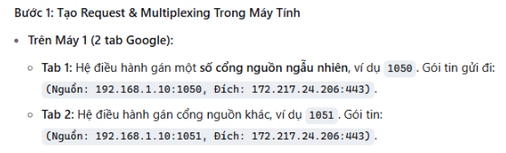

*Hình 54*


*Hình 55*

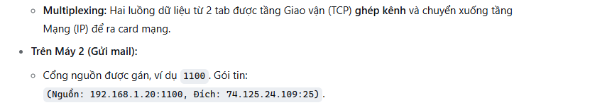

*Hình 56*

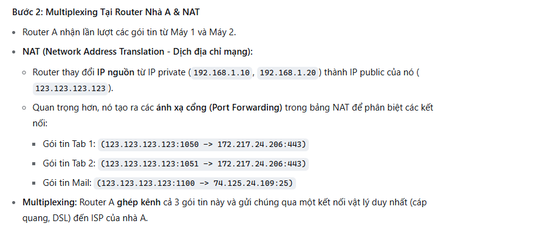

*Hình 57*

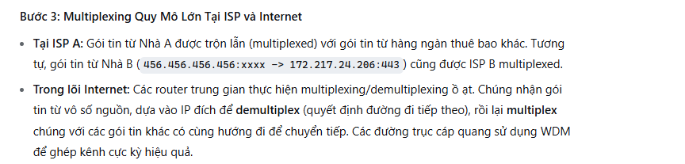

*Hình 58*

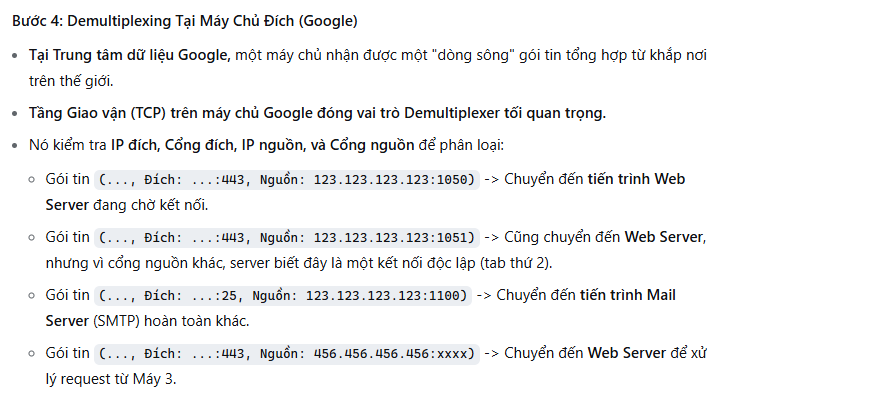

*Hình 59*

## Basic Characteristics (các đặc tính cơ bản)

- **Fault tolerance (khả năng chịu lỗi):** hệ thống tiếp tục cung cấp dịch vụ ở mức chấp nhận được khi một thành phần lỗi, thường nhờ đường đi hoặc thiết bị dự phòng. Điều này không bảo đảm mọi packet đang truyền đều không mất.

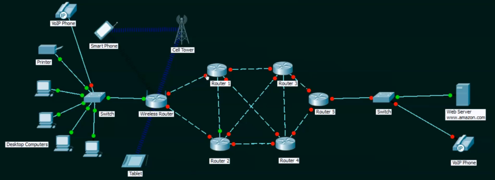

*Mạng có nhiều đường đi dự phòng*

- Giả sử Computer ta muốn communication với Web Server amazon kia thì

- Computer -> Switch -> Wireless Router -> Router1 -> Router3 -> Router5 -> Switch -> WebServer

- Tuy nhiên khi mà link/ Router1 gone down thì request vẫn tiếp tục thực hiện và hệ thống mạng máy tính này vẫn sẽ hoạt động, request vừa rồi thay vì được rout tới Router1 thì sẽ được rout tới Router2 -> Router4 -> Router5 ->…

- **Scalability (khả năng mở rộng):** khả năng tăng số người dùng, thiết bị hoặc traffic mà hệ thống vẫn vận hành được sau khi bổ sung tài nguyên/thiết kế phù hợp.

- Giả sử tôi connect 100 computer vào Router3 thì mạng vẫn hoạt động bình thường

- Thêm mạng mới thì hệ thống mạng toàn cầu vẫn hoạt động bình thường.

- **Quality of Service (QoS: chất lượng dịch vụ):** tập cơ chế phân loại, ưu tiên, xếp hàng hoặc giới hạn traffic để đáp ứng mục tiêu delay, jitter, bandwidth và packet loss cho từng loại ứng dụng.

- **Khi giữa 2 request:** nói chuyện điện thoại và gửi email và việc handle request này đều trải qua Router1 tại cùng 1 thời điểm + Router có khả năng nhận ra rằng việc nói chuyện điện thoại là realtime nên nó sẽ ưu tiên xử lý trước để routing tới Router khác

### Security (bảo mật)

- Giả sử ta send 1 request với thông tin khá nhạy cảm, trong quá trình routing thì tại Router3, hacker đã steal được request của ta tại Router3

- **Confidentiality** ngăn người không được phép đọc dữ liệu; **integrity** phát hiện dữ liệu bị sửa; **availability** giữ dịch vụ hoạt động khi người dùng hợp lệ cần. Ba mục tiêu giải quyết ba loại rủi ro khác nhau.

## Network Protocols & Communication (giao thức và truyền thông mạng)

### Protocol

- **Data communication (truyền thông dữ liệu):** sự trao đổi dữ liệu giữa các node qua một **transmission medium (môi trường truyền dẫn)** như cáp đồng, sợi quang hoặc sóng vô tuyến.

- Link chỉ sự kết nối giữa 2 thiết bị, có thể là logic/ vật lý (chỉ mang tính chất là nói về connection) >< Transmission medium (form of Link) là bản chất của phương tiện truyền dẫn (cáp, dây đồng, sóng vô tuyến,...)

- **Protocol (giao thức):** tập quy tắc về định dạng, thứ tự, thời điểm và cách xử lý lỗi để các hệ thống có thể hiểu nhau. Ví dụ HTTP quy định cách client biểu diễn web request và server biểu diễn response.

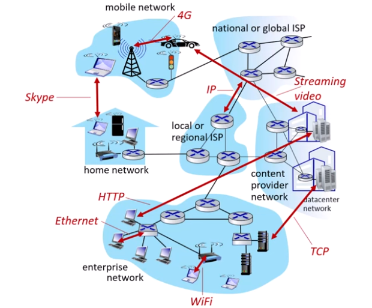

*Internet là network of networks*

- Protocol xác định cách data được định dạng, truyền đi, nhận về, cách các lỗi được xử lý trong quá trình truyền nhận dữ liệu

- Bất kể là liên lạc qua đường bưu điện, whatsapp, sms,... đều phải có protocol nhất định

- Các nodes phải chấp thuận các quy tắc đặt ra của protocol để các nodes có thể hiểu thông điệp đưa ra từ mỗi bên

- **Các protocols phổ biến có thể kể tới như:** HTTP, TCP, IP, 4/5G, Ethernet, Skype, Wifi,…

- Nhiều giao thức Internet được mô tả trong **RFC (Request for Comments: tài liệu kỹ thuật/tiêu chuẩn của cộng đồng Internet)** do **IETF (Internet Engineering Task Force: tổ chức phát triển tiêu chuẩn Internet)** công bố; tiêu chuẩn web còn có **W3C (World Wide Web Consortium)**.

- Why need protocol

### Syntax (cú pháp), semantics (ngữ nghĩa) và synchronization (đồng bộ)

- **Syntax (cú pháp):** cấu trúc và định dạng bit/trường dữ liệu. **Semantics (ngữ nghĩa):** ý nghĩa của từng trường và hành động cần thực hiện. **Synchronization/timing (đồng bộ/thời điểm):** khi nào gửi, tốc độ nào và thứ tự trao đổi.

- Nếu không tuân thủ các quy tắc đặt ra của protocol thì các nodes sẽ không biết cách trao đổi dữ liệu với nhau, nodes nhận được data có thể sẽ không hiểu/ giải được data đó dẫn đến việc truyền tải không thể chính xác

- Data có thể hỏng/ mất data trong quá trình truyền tải do không tuân thủ nguyên tắc

- Không có cách nào để quản lý luồng dữ liệu, dẫn tới data có thể truyền quá nhanh/ quá chậm làm tắc nghẽn mạng/ gây delay đáng kể

- Protocol có thể quy định **message encoding (cách mã hóa dữ liệu thành bit/ký tự)**, **message formatting (bố cục thông điệp)**, **encapsulation (đóng gói dữ liệu tầng trên vào đơn vị của tầng dưới)**, timing và message size.

- Protocol giúp xác thực các bên tham gia giao tiếp, nếu không có protocol thì không có cách nào mà đảm bảo rằng thông tin đến từ 1 nguồn hợp lệ/ người nhận có quyền nhận thông tin đó

- Các protocol như TCP/ IP là nền tảng của internet, nếu không có protocol này thì Internet và các hệ thống mạng khác sẽ không thể hoạt động

- Bandwidth (băng thông) dùng để chỉ tốc độ truyền dữ liệu/ tiêu thụ tối đa của 1 kết nối mạng trong 1 khoảng thời gian nhất định (2 người dùng trên 2 thiết bị khác nhau, gói mạng khác nhau thì băng thông là khác nhau cho mỗi thiết bị >< nếu 2 người dùng chung 1 wifi thì băng thông sẽ được chia sẻ) >< Throughput (thông lượng) là tốc độ truyền dữ liệu thực tế của 1 kết nối mạng trong 1 khoảng thời gian nhất định.

- Được dùng để đo lường lượng dữ liệu có thể truyền qua 1 kênh truyền (có dây/ không dây) trong 1 giây

- Đơn vị thường dùng: **Kbps/Mbps/Gbps (kilobit/megabit/gigabit mỗi giây)**. Chữ `b` thường là bit; chữ `B` trong `MB/s` là byte và `1 byte = 8 bit`.

- **Các yếu tố có thể ảnh hưởng tới băng thông như:** loại kết nối, gói cước nhà mạng, số lượng người dùng chung,...

### Các dạng truyền dữ liệu

- **Khi tải 1 file 10GB với gói mạng 100Mbps:**

- 10GB = 10 * 1024 = 10240MB

- 1MB = 8Mb ⇒ 10240MB = 81920Mbs

- Thời gian tải = 81920Mb / 100Mbps = 13p 39s

- Ngoài ra thực tế mạng không bao giờ đạt 100% như lý thuyết trên, thường delay thêm nhiều.

- Khi xem 1 video netflix 4K (25Mbps)

- Giả sử ta đang dùng gói 50Mbps, xem phim 4K cần 25Mbps

- Băng thông còn lại = 50 - 25 = 25Mbps + khi xem thêm 1 video (35Mbps), lướt web (3Mbps) tổng là 38Mbps dẫn tới vượt giới hạn, video có thể bị giật.

- Giả sử 1 row 50kb.

- Tổng kích thước

- • 1 row = 50 KB → 1,000,000 rows = 50,000,000 KB = 48,828.125 MB = ≈47.68 GiB.

### Bandwidth (băng thông), throughput (thông lượng), delay (độ trễ) và packet loss (mất gói)

- **Nếu đọc toàn bộ:**

- • HDD (seq) ≈ 150 MB/s → 48,828 / 150 ≈ 325 s ≈ 5.4 min.

- • SATA SSD ≈ 500 MB/s → 48,828 / 500 ≈ 98 s ≈ 1.6 min.

- • NVMe high-end ≈ 3000 MB/s → 48,828 / 3000 ≈ 16 s.

- • RAM (nếu dữ liệu đã cached) ~20,000 MB/s → 48,828 / 20,000 ≈ 2.4 s.

- **Tốc độ truyền:**

- • Network 1 Gbps = 125 MB/s → 48,828 / 125 ≈ 391 s ≈ 6.5 min.

- • Network 10 Gbps = 1250 MB/s → 48,828 / 1250 ≈ 39 s.

- **Nếu để xử lý cho người dùng thật thì sẽ kết hợp:** phân trang truy vấn + cache app + client thì dùng lazy load. Não người không load nổi 1M rows đâu nên khỏi lo.

- Nếu để xử lý để export cần tốc độ thì bắt buộc chơi stream cả phía app lẫn client, query cũng không cần phân trang nữa. App phải đọc từng gói tin nhỏ gửi từ stream của db sau đó gửi cho client cũng đọc từng cục nhỏ lấy từ stream.

- Tại sao lại phải chia nhỏ dữ liệu thành các package để truyền qua mạng:

- Dữ liệu lớn khi gửi 1 lần sẽ gây nghẽn mạng >< chia nhỏ thành các packet sẽ tận dụng được băng thông tốt hơn + packet có thể di chuyển theo nhiều cách chỉ cần đến được đích, tránh tắc nghẽn mạng (phù hợp với kiến trúc phân tán)

- Dữ liệu lớn khi gửi gặp lỗi sẽ phải gửi lại toàn bộ >< nếu 1 packet lỗi thì chỉ cần gửi lại packet đó.

- Dữ liệu nguyên khối lớn sẽ chiếm toàn bộ đường truyền >< chia packet thì dữ liệu packet từ nhiều người dùng có thể dùng chung được

- Có một số trường hợp đặc biệt truyền thẳng mà không chia packet như: truyền dữ liệu thời gian thực dùng UDP gửi nguyên khối, không đảm bảo tin cậy nhưng nhanh hơn;  Hoặc trong mạng nội bộ tốc độ cao, đôi khi truyền nguyên frame lớn

## TCP/IP model (mô hình TCP/IP)

### Application Layer (tầng ứng dụng)

- **OSI:** mô hình tham chiếu chia giao tiếp mạng thành 7 tầng để dễ học, thiết kế và khoanh vùng lỗi. Nó không phải một phần mềm chạy trong máy; đây là khung tư duy, ví dụ lỗi cáp thuộc Physical layer còn lỗi IP route thuộc Network layer.

- OSI chia quy trình truyền dữ liệu qua mạng thành 7 layer nhỏ hơn, mỗi layer là một chức năng, nhiệm vụ riêng biệt.

- Lý do chia làm nhiều layer là để phân nhiệm vụ cụ thể cho từng layer + dễ dàng quản lý, khắc phục lỗi xem lỗi nằm ở layer nào thay vì kiểm tra toàn bộ hệ thống + các hãng khác nhau có thể phát triển thiết bị/ phần mềm cho từng layer riêng biệt miễn là chúng tuân theo quy chuẩn chung của layer đó thì vẫn có thể hoạt động được với nhau.

- → Tuy nhiên trong thực tế, mô hình sử dụng phổ biến là TCP/IP chỉ có 4 layer còn OSI thường sử dụng để làm chuẩn để giảng dạy, tham chiếu.

- Trong mô hình TCP/IP, Application layer thường gộp chức năng của ba tầng OSI: **Application (dịch vụ cho ứng dụng)**, **Presentation (biểu diễn/mã hóa dữ liệu)** và **Session (quản lý phiên giao tiếp)**.

- Layer này tương tác trực tiếp với người dùng, cung cấp giao diện thân thiện cho người dùng + nhận yêu cầu của người dùng, chuyển thành các message đại diện cho yêu cầu của người dùng.

- Không phải các ứng dụng như trình duyệt, zoom, … mà là tập hợp các giao thức, dịch vụ mà những ứng dụng đó sử dụng để giao tiếp qua mạng → hoạt động nằm giữa ứng dụng người dùng và dịch vụ mạng phức tạp bên dưới, xác định cách ứng dụng yêu cầu và sử dụng mạng (xác định cách ứng dụng trao đổi dữ liệu) >< trong khi các layer bên dưới chỉ là phương tiện để truyền dữ liệu một cách tin cậy, hiệu quả.

- **VD:** khi mở trình duyệt lên, bật google lên -> trình duyệt sử dụng HTTP để gửi request tới máy chủ google -> máy chủ phản hồi bằng trang web google

- Giao thức thường gặp gồm HTTP, **IMAP (Internet Message Access Protocol: truy cập và đồng bộ email trên server)**, SMTP, DNS, **Telnet (giao thức terminal từ xa không mã hóa)** và SSH.

### Transport Layer (tầng vận chuyển)

- **Đơn vị dữ liệu:** message/ data, là dữ liệu thuần túy của application, chưa thêm thông tin gì

- **Dạng dữ liệu:** ở dạng con người có thể hiểu được (email, file, video, web request,...), dữ liệu dần chuyển thành dữ liệu nhị phân trước khi xuống các tầng thấp hơn

- ⇒ Có thể nói layer này là cầu nối giữa người sử dụng và mạng máy tính, cung cấp các giao thức để ứng dụng giao tiếp qua mạng, xác định cách ứng dụng trao đổi dữ liệu qua mạng.

- **Transport layer:** nối process nguồn với process đích bằng port. Nó giải quyết “ứng dụng nào trên máy cần nhận dữ liệu” và, với TCP, cung cấp độ tin cậy cùng kiểm soát luồng/tắc nghẽn.

- **Sử dụng các giao thức như:** UDP (không kết nối nên không cần 3-way handshake, không kiểm tra lỗi, không chờ xác nhận, phù hợp với application real-time), TCP (an toàn hơn, kiểm tra lỗi dùng checksum, yêu cầu gửi lại nếu mất packet nhưng chậm hơn, dùng cho web, email, download file)

- **Protocol Data Unit - PDU (đơn vị dữ liệu giao thức):** ở Transport layer thường gọi là **segment** với TCP và datagram với UDP.

- Mỗi application đang chạy có 1 port riêng, Transport layer sử dụng port này để định tuyến message tới đúng process đang chạy này.

- Kiểm soát luồng điều chỉnh theo máy nhận; kiểm soát tắc nghẽn điều chỉnh theo tình trạng mạng — hai khái niệm liên quan nhưng không giống nhau.

- ⇒ Layer này giúp gửi message giữa các application trên các thiết bị khác nhau + quyết định cách message được gửi đi + đảm bảo application nhận đúng dữ liệu dựa vào port + không quan tâm máy đích là máy nào, chỉ quan tâm là ứng dụng nào cần nhận thông điệp

### Network Layer (tầng mạng)

- **Network layer:** đưa packet từ host nguồn tới host đích qua nhiều router bằng địa chỉ IP và routing. Nó giải quyết phạm vi liên mạng, nơi MAC/Link layer đơn lẻ không thể đi xuyên nhiều mạng.

- **Giải quyết vấn đề của Link layer không làm được là:** định tuyến xuyên qua các mạng vật lý khác nhau

- **Sử dụng giao thức như:** IP, ICMP (internet control message protocol), routing protocol, IPSec (bảo mật IP packet), ARP

- Packet IP có header gồm source/destination IP, **TTL (Time To Live: giới hạn số router packet được đi qua)** hoặc Hop Limit ở IPv6 và các trường điều khiển khác.

- Xác định đường đi tối ưu cho packet qua nhiều mạng trung gian (Router dựa vào destination IP, bảng định tuyến để gửi packet sang bước tiếp theo)

- **Forwarding:** hành động thực tế của router, nhận packet từ cổng này và chuyển tiếp nó ra cổng khác dẫn tới router tiếp theo cho tới đích

- **Logical addressing (địa chỉ logic):** dùng địa chỉ IP để xác định interface/prefix. Địa chỉ có thể là private hoặc public, IPv4 hoặc IPv6; Network layer không mặc nhiên “gán private IP”.

- ⇒ Layer này giúp xác định đường đi (routing), tìm đường đi ngắn nhất, phù hợp nhất với tình trạng mạng + thực hiện truyền packet từ nguồn tới đích qua nhiều mạng trung gian + chia nhỏ packet nếu cần + quan tâm máy đích là máy nào, không quan tâm ứng dụng nào của máy đích nhận thông điệp.

### Link Layer (tầng liên kết)

- **Link layer:** vận chuyển frame qua một chặng/link cụ thể, ví dụ laptop → access point hoặc switch → router. Mỗi khi packet đi sang link mới, frame và địa chỉ MAC có thể được tạo lại.

- Vai trò chính là thiết lập, duy trì, quản lý việc truyền dữ liệu giữa 2 thiết bị trên 1 đường truyền vật lý + nhận packet từ network và chuẩn bị chúng để truyền đi trên phương tiện vật lý.

- **Sử dụng giao thức như:** Wifi, Ethernet,... + các thiết bị như: Switch, Bridge

- **Đơn vị dữ liệu:** frame; Link layer nhận packet từ Network layer, gán source destination MAC header, destination MAC header của máy liền kề (next hop), tính CRC

- Mỗi card mạng (Ethernet, Wifi) có 1 địa chỉ MAC duy nhất do nhà sản xuất gán

- IP là địa chỉ logic, dùng để xác định đích cuối cùng >< MAC là địa chỉ vật lý, dùng để chuyển dữ liệu trong mạng cục bộ (Switch, card mạng hoạt động ở Link layer, không hiểu IP)

- **Framing (đóng khung):** bọc packet thành frame và thêm header/trailer tầng liên kết, ví dụ source/destination MAC và CRC.

- **Trong mỗi liên kết vật lý:** Host -> router -> router -> … Sau mỗi lần chuyển tới thiết bị tiếp theo, source & destination MAC sẽ được thay đổi lại.

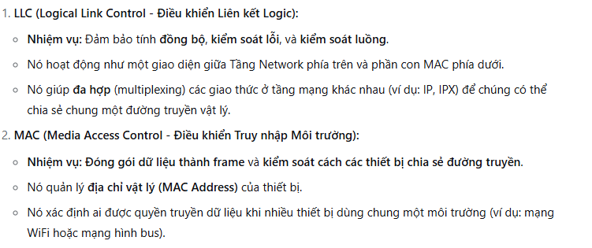

*Link Layer*

### Physical Layer (tầng vật lý)

- **Physical layer:** biến bit thành tín hiệu điện, ánh sáng hoặc sóng vô tuyến và truyền qua môi trường vật lý. Nó giải quyết đầu nối, tần số, điện áp, tốc độ tín hiệu và cách mã hóa bit, không hiểu IP hay ứng dụng.

- **Dạng dữ liệu:** chuyển đổi các bit nhị phân 1, 0 thành tín hiệu vật lý (điện, ánh sáng, sóng radio,...) để truyền qua môi trường truyền dẫn (có dây/ không dây)

- Xác định đặc tính vật lý của phương tiện truyền dẫn → quyết định cách thức các bit được mã hóa tín hiệu dựa trên phương tiện truyền dẫn vừa xác định + xác định số lượng bit được truyền đi trong 1s

- Thiết bị thường gặp gồm repeater, hub, modem và **media converter (bộ chuyển đổi loại môi trường truyền, ví dụ Ethernet đồng sang quang)**.

- **Sử dụng các giao thức như:** Ethernet, Wifi, USB, HDMI, Bluetooth,...

### Workflow (luồng xử lý) khi truy cập một website

- **Workflow:** khi mở trình duyệt, truy cập vào https://www.google.com và nhấn enter

1. **B1:** Application layer tạo 1 HTTP/ HTTPS request GET gửi tới máy chủ google

- **DNS phân giải tên miền thành IP (VD:** 142.250.70.206)

- Message được di chuyển xuống Transport layer

1. **B2:** Transport layer thiết lập kết nối dùng TCP 3-way handshake (vì HTTP/ HTTPS sử dụng TCP)

- Trình duyệt gửi gói SYN tới google (tôi muốn kết nối, SEQ = 100)

- Google nhận SYN, phản hồi SYN-ACK (tôi đồng ý, SEQ = 300, ACK = 101)

- Trình duyệt nhận SYN-ACK, gửi ACK (đã nhận SYN-ACK, bắt đầu truyền dữ liệu)

- Lúc này TCP connection đã được thiết lập

- Transport layer đóng gói HTTP request vào TCP segment (source port, destination port, sequence number: 101, ACK number: 301,...)

- TCP segment được chuyển tiếp xuống Network layer để định tuyến google.

1. **B3:** Network layer đóng gói TCP segment vào IP packet (source IP, destination IP)

- Gửi IP packet qua router, ISP, Internet tới máy chủ google.

## Application Layer

- Các ứng dụng mạng hoạt động trên các End system, liên lạc với nhau qua hệ thống mạng máy tính (VD: web server chạy trên máy tính chủ cũng là ứng dụng + các ứng dụng khác chạy trên máy người dùng đều có thể liên lạc với web server)

- Bất cứ khi nào vào trình duyệt, gõ 1 trang ra bản thân là ứng dụng trình duyệt sẽ gửi yêu cầu tới web server.

- Các máy nằm trên Network core sẽ không chạy ứng dụng người dùng mà chỉ để routing.

- **Peer-to-peer (P2P):** các máy tham gia có thể vừa tải vừa cung cấp dữ liệu cho nhau. Mục đích là phân tán tải và tài nguyên thay vì mọi thứ đi qua một server trung tâm; BitTorrent là ví dụ điển hình.

- BitTorrent, Blockchain,...

- **Client-server:** server tập trung cung cấp dịch vụ, còn client chủ động yêu cầu. Mô hình này giúp quản lý dữ liệu, quyền và cập nhật tập trung; ví dụ trình duyệt gọi API của web server.

- **Server (máy chủ/chương trình phục vụ):** process lắng nghe request và trả response. Server không bắt buộc phải có domain cố định hay nằm trong data center, dù dịch vụ công khai thường được triển khai như vậy.

- **Client (máy khách/chương trình khách):** process thường chủ động khởi tạo request hoặc kết nối tới server; ví dụ trình duyệt, ứng dụng email hoặc app điện thoại.

- **Process (tiến trình):** một chương trình đang chạy cùng vùng nhớ, tài nguyên và trạng thái thực thi của nó.

- Hai process cùng máy có thể dùng **IPC (Inter-Process Communication: cơ chế giao tiếp liên tiến trình)** như pipe, shared memory hoặc local socket do **OS (Operating System: hệ điều hành)** cung cấp.

- Nếu 2 process khác thiết bị muốn communicate với nhau thì phải thông qua message.

- IP giúp biết chuyển message tới thiết bị nào >< Port giúp biết chuyển message tới process nào (bản thân DNS sẽ phân giải cả IP, Port để biết cần gửi cho máy nào, process nào)

### Mối quan hệ giữa Application Layer và Transport Layer

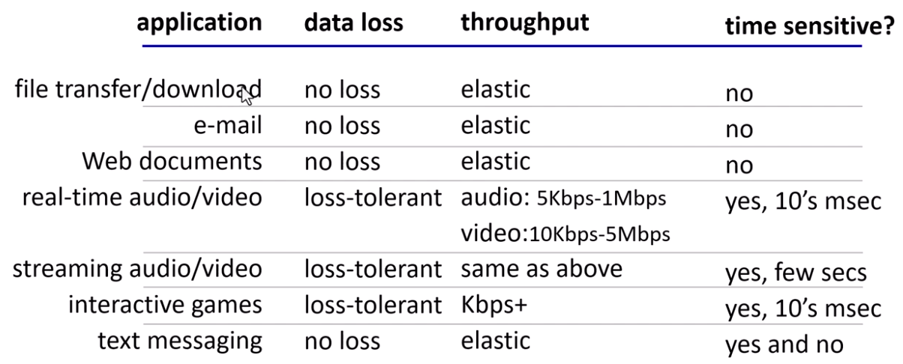

*Yêu cầu truyền tải của các ứng dụng*

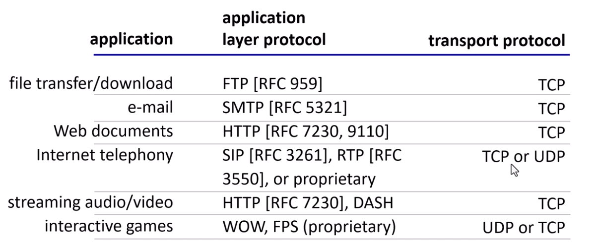

*Hình 64*

- Các dịch vụ ở tầng trên phụ thuộc vào dịch vụ của Transport Layer bên dưới.

- **Data integrity (tính toàn vẹn dữ liệu):** dữ liệu nhận không bị thay đổi ngoài ý muốn so với dữ liệu gửi; ví dụ file tải về phải có nội dung chính xác.

- **Timing (yêu cầu thời gian):** ứng dụng tương tác như gọi điện hoặc game nhạy với delay/jitter và có thể chấp nhận một lượng mất mát nhỏ hơn là dữ liệu đến quá muộn.

- **Throughput:** một vài ứng dụng yêu cầu thông lượng tối thiểu như xem phim online, streaming,... truyền đi dữ liệu lớn hỗn hợp cả hình ảnh, âm thanh,... yêu cầu băng thông đạt tới mức độ nhất định.

## Web and HTTP (Web và giao thức HTTP)

### Web page (trang web), website và web object (tài nguyên web)

- **Web page (trang web):** tài liệu/tài nguyên được trình duyệt hiển thị, thường có tài liệu **HTML (HyperText Markup Language: ngôn ngữ đánh dấu cấu trúc nội dung web)** làm nền.

- **Website (trang mạng):** tập hợp web page và tài nguyên liên quan, thường được truy cập dưới cùng một domain.

- **Web object/resource (đối tượng/tài nguyên web):** một đơn vị có URL riêng như HTML, **CSS (Cascading Style Sheets: ngôn ngữ định kiểu giao diện)**, **JavaScript/JS (ngôn ngữ lập trình chạy trên web)**, ảnh **JPEG**, font hoặc audio.

- **URL:** chỉ ra cách và nơi lấy một resource: `https` là scheme, `example.com` là host và `/images/logo.png` là path. Trình duyệt dùng các phần này để chọn protocol, tìm server và yêu cầu đúng object.

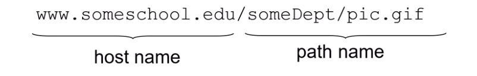

*Cấu trúc URL*

- Trình duyệt gửi HTTP request tới server, nhận các resource rồi **render (phân tích và dựng giao diện hiển thị)** HTML/CSS/JS thành trang hoàn chỉnh.

### Hosting (dịch vụ lưu trữ/vận hành)

- **Hosting (dịch vụ lưu trữ/vận hành website):** cung cấp server, storage, network và môi trường chạy để website có thể phục vụ người dùng.

- Khi gõ tên miền vào trình duyệt, trình duyệt sẽ kết nối tới máy chủ hosting, tải toàn bộ dữ liệu từ hosting về trình duyệt

- **Shared hosting (lưu trữ dùng chung):** nhiều website dùng chung hệ điều hành/tài nguyên server; chi phí thấp nhưng khả năng kiểm soát và cách ly hạn chế.

- **VPS (Virtual Private Server: máy chủ riêng ảo):** máy ảo có hệ điều hành và phần tài nguyên riêng, chạy cùng máy vật lý với các VPS khác.

- **Virtualization (ảo hóa):** dùng hypervisor chia tài nguyên máy vật lý thành nhiều VM cách ly tương đối. **CPU** là bộ xử lý, **RAM** là bộ nhớ làm việc và **SSD** là ổ lưu trữ thể rắn.

- Mỗi VPS có hđh riêng (Window server/ các bản phân phối linux như CentOS, Ubuntu,...) + một phần CPU, RAM, ổ cứng được cấp phát riêng cho từng VPS

- **Dedicated server (máy chủ vật lý thuê riêng):** toàn bộ máy vật lý dành cho một khách hàng.

- **Cloud hosting (lưu trữ trên hạ tầng đám mây):** chạy website trên tài nguyên ảo hóa có thể cấp phát/co giãn qua nền tảng cloud; độ ổn định vẫn phụ thuộc thiết kế nhiều vùng, backup và cách triển khai.

### Domain (tên miền)

- **Domain (tên miền):** là địa chỉ website, là phần mà mọi người gõ vào thanh địa chỉ của trình duyệt để truy cập website (VD: google.com, youtube.com, facebook.com,…)

- Nếu website là ngôi nhà → domain như địa chỉ của ngôi nhà đó → hosting (dịch vụ lưu trữ) là mảnh đất mà ngôi nhà đó được xây lên.

- Thiết bị và server giao tiếp thông qua IP, domain tạo ra để thay thế cho địa chỉ IP khó nhớ đó + DNS sẽ chuyển đổi domain thành IP tương ứng để trình duyệt có thể tải website.

- **Cấu trúc:** subdomain . second-level-domain . top-level-domain . (root)

- **DNS root (gốc DNS):** đỉnh của cây tên miền, biểu diễn bằng dấu chấm cuối trong tên miền đầy đủ như `www.example.com.`; trình duyệt thường không hiển thị dấu chấm này.

- **TLD (Top-Level Domain: tên miền cấp cao nhất):** nhãn ngay dưới root như `.com`, `.org`, `.vn`.

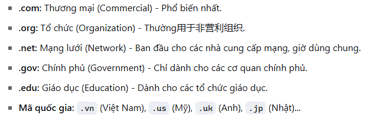

*Hình 66*

- **SLD (Second-Level Domain: tên miền cấp hai):** nhãn ngay bên trái TLD, ví dụ `example` trong `example.com`.

- **Subdomain (tên miền con):** nhãn nằm bên trái domain cha, ví dụ `api` trong `api.example.com`.

- Khi có Domain chính rồi, ta có thể tạo vô hạn subdomain hoàn toàn miễn phí + và subdomain có thể trỏ tới server khác tùy vào cấu hình

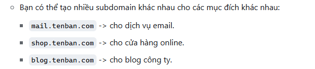

*Hình 67*

### HTTP

- **HTTP:** giao thức quy định client biểu diễn request và server biểu diễn response như thế nào. Mục đích là tạo một ngôn ngữ chung cho Web và API; ví dụ trình duyệt gửi `GET /products/1`, server trả status `200`, header và JSON/HTML trong body.

- Mỗi khi nhấp vào 1 link/ nhập 1 địa chỉ web vào trình duyệt, ta đang khởi tạo 1 HTTP request và gửi tới server → sau đó thì server sẽ xử lý và gửi lại HTTP response.

- **HTTP request (yêu cầu HTTP)** gồm method, URL/path, header và body tùy chọn. **HTTP response (phản hồi HTTP)** gồm **status code (mã kết quả như `200`, `404`)**, header và body. HTTP/1.1 và HTTP/2 thường chạy trên TCP; HTTP/3 chạy trên QUIC/UDP.

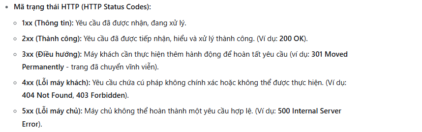

*HTTP status code*

- HTTP hoạt động dựa trên giao thức TCP/IP: HTTP là nội dung request + TCP đóng vai trò chia nhỏ, đánh số request để đảm bảo request đến đúng nơi nhận + IP đóng vai trò làm người chỉ dẫn request tới đúng nơi nhận (routing). Lý do phải dựa trên TCP/IP là vì HTTP không quan tâm dữ liệu được vận chuyển thế nào, chỉ định ra nội dung giao tiếp → cần TCP/IP để nội dung này đến đúng nơi nhận.

- **Stateless:** bản thân HTTP không yêu cầu server nhớ request trước để hiểu request sau. Điều này giúp request dễ phân phối qua nhiều server; nếu ứng dụng cần đăng nhập hoặc giỏ hàng, nó bổ sung cookie, token hoặc session.

### HTTP/0.9

- HTTP 0.9: là phiên bản đầu tiên của HTTP, cực kỳ thô sơ chỉ với mục đích duy nhất là truyền HTML qua internet.

- Chỉ sử dụng HTTP GET mà không có bất kỳ phương thức nào khác

- Request, response không có phần header → không thể gửi metadata như: loại dữ liệu, loại mã hóa, ngôn ngữ,...; không thể gửi cookie, không có khả năng xác thực, server không thể biết được loại trình duyệt/ hđh mà client đang sử dụng

- Response chỉ chứa duy nhất dữ liệu HTML, không thể chứa hình ảnh, CSS, JS hay bất kỳ định dạng nào khác + nếu có lỗi thì server sẽ trả về HTML mô tả lỗi đó chứ không có HTTP status code.

- Ngay sau khi server phản hồi HTML file, TCP connection ngay lập tức bị đóng

- ⇒ Ngày nay HTTP 0.9 không còn được sử dụng nữa vì nó quá đơn giản, chỉ phù hợp với thời kỳ đầu của web vì lúc đó mọi thứ quá thô sơ và HTTP 0.9 là đủ rồi >< Website hiện đại thì HTTP 0.9 là không đủ.

### HTTP/1.0

- HTTP 1.0: là phiên bản update của HTTP 0.9, biến nó từ giao thức đơn giản thành giao thức linh hoạt cho web

- Ra đời là để khắc phục những hạn chế lớn của HTTP 0.9

- Giờ đây mỗi khi request cần phải chỉ ra là HTTP version mấy

- Hỗ trợ HTTP status code để giúp client có thể biết chính xác kết quả của request

- Hỗ trợ HTTP header để cung cấp thêm context cho cả request, response: loại trình duyệt, hệ điều hành đang sử dụng của thiết bị, loại dữ liệu mà server cần xử lý, loại dữ liệu trong response, kích thước response,... → nhờ Content-Type header, web không chỉ còn là văn bản mà có thể chứa cả hình ảnh, âm thanh và các định dạng khác → biến website trở thành nền tảng đa phương tiện

- **HTTP method (phương thức HTTP):** biểu thị hành động mong muốn; `GET` lấy resource, `HEAD` lấy header không lấy body, `POST` gửi dữ liệu/xử lý một yêu cầu.

- Tuy nhiên vẫn còn nhược điểm là kết nối không liên tục như HTTP 0.9, 1 TCP mới được thiết lập cho mỗi request và bị đóng ngay sau khi hoàn thành → gây hiệu suất thấp do mỗi lần request đều phải 3-way handshake.

### HTTP/1.1

- HTTP 1.1: là phiên bản update, khắc phục những điểm yếu về hiệu suất, tính năng của HTTP 1.0, là phiên bản sử dụng phổ biến suốt gần 2 thập kỷ qua.

- **Persistent connection/keep-alive:** giữ TCP connection để nhiều HTTP request dùng lại. Mục đích là tránh lặp lại handshake và slow start cho từng resource.

- **HTTP pipelining:** client gửi nhiều request liên tiếp trên HTTP/1.1 trước khi nhận response. Nó định giảm thời gian chờ nhưng response vẫn phải đúng thứ tự, nên request đầu chậm sẽ giữ các request sau; vì vậy ít được dùng.

- **Host header:** cho biết domain mà client muốn truy cập. Nó hỗ trợ **virtual hosting (nhiều website/domain dùng chung một IP hoặc server)**.

- **Caching:** giữ bản sao response gần người dùng để không phải tải hoặc xử lý lại mỗi lần. Nó giảm latency, bandwidth và tải server; `Cache-Control` quy định thời gian dùng lại, còn `ETag` giúp kiểm tra bản sao đã cũ chưa.

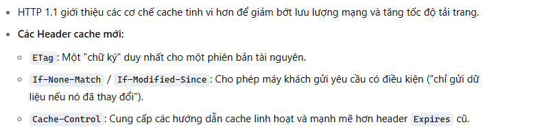

*Hình 69*

- **Chunked Transfer Encoding (mã hóa truyền theo từng khối):** HTTP/1.1 cho phép server gửi body dần khi chưa biết trước tổng kích thước.


*Hình 70*

- **Cung cấp các method bổ sung:**


*Hình 71*

### HTTP/2

- HTTP 2.0 xuất bản 2015, là bước đột phá lớn trong hiệu suất web, giải quyết các vấn đề của HTTP 1.1

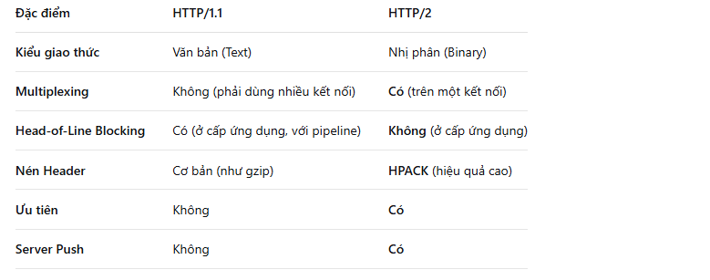

*So sánh HTTP/1.1 và HTTP/2*

- HTTP/2 kế thừa nhiều ý tưởng từ **SPDY (giao thức thử nghiệm của Google nhằm tăng tốc Web)**, dùng framing nhị phân và multiplexing.

- **HTTP/2 multiplexing:** chia request-response thành frame có stream ID rồi xen kẽ nhiều stream trên một TCP connection. Mục đích là request chậm ở tầng HTTP không phải chặn toàn bộ request khác; tuy nhiên mất packet TCP vẫn có thể làm mọi stream chờ truyền lại.

- **Stream ID (mã luồng):** số định danh giúp HTTP/2 ghép các frame về đúng request-response logic.

- HTTP 2 được chuyển sang hệ nhị phân, các frame được thiết kế để máy tính phân tích nhanh, hiệu quả hơn nhiều

- **HPACK:** cơ chế nén header của HTTP/2 bằng bảng tĩnh/động và mã hóa hiệu quả để tránh lặp lại toàn bộ header.

- **Server Push (đẩy tài nguyên chủ động):** HTTP/2 từng cho phép server gửi resource trước khi client request; tính năng này ít được dùng và nhiều browser đã ngừng hỗ trợ do hiệu quả thực tế hạn chế.

## Email, SMTP, IMAP

### Trong hệ thống thư điện tử gồm các thành phần chính:

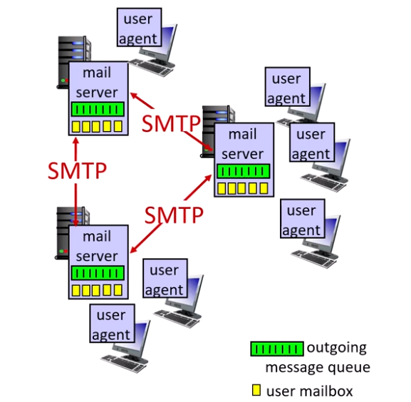

*Hệ thống thư điện tử*

- **Mail user agent - MUA (ứng dụng thư của người dùng):** phần mềm soạn, gửi, đọc và quản lý email, ví dụ Outlook hoặc ứng dụng Gmail.

- **Mail server (máy chủ thư):** hệ thống nhận, chuyển tiếp và lưu email cho domain/người dùng.

- **Outgoing message queue (hàng đợi thư đi):** giữ email chờ gửi; **retry queue (hàng đợi thử lại)** giữ thư tạm thời khi server đích chưa nhận được.

- **Mailbox (hộp thư):** vùng lưu email và trạng thái thư của một người dùng trên mail server.

### Workflow trong hệ thống thư điện tử:

1. **B1:** email soạn rồi gửi thư từ user@gmail.com tới user@outlook.com

1. **B2:** Mail server của người gửi (google server) nhận được thư, verify tính hợp lệ của thư, lưu thư vào Outgoing message queue

1. **B3:** Mail server (google server) tra DNS MX record của domain đích qua outlook.com, kết nối tới Mail server này (microsoft server) qua SMTP rồi gửi thư.

1. **B4:** Mail server (microsoft server) của người nhận kiểm tra giả mạo, spam, tính hợp lệ rồi thư lưu lại thư vào User mailbox

1. **B5:** Người nhận mở user agent, kết nối mail server qua IMAP hoặc **POP3 (Post Office Protocol version 3: giao thức tải email về client)**.

### Lý do phải có nhiều Mail server vì:

- Tất cả người dùng không thể dùng chung 1 server, nó sẽ quá tải

- Việc có nhiều server sẽ đặt ở nhiều nơi khác nhau, gần người dùng sẽ giảm độ trễ mạng.

- Mỗi mail server sẽ phục vụ cho một nhóm người dùng nhất định theo domain + sự triển khai server của các công ti là khác nhau (VD: gmail.com dùng server google, ptit.com dùng server của riêng họ,…)

- Nếu 1 server gặp sự cố, chỉ ảnh hưởng tới 1 phần người dùng.

- Các công ty lớn như Google, Outlook, Yahoo,... xây dựng hệ thống mail phân tán, kết hợp với nhau qua các giao thức chuẩn để tạo thành mạng lưới thư điện tử toàn cầu

- **MX record (Mail Exchanger record: bản ghi máy chủ nhận thư):** bản ghi DNS chỉ định mail server nhận email cho một domain và giá trị preference/priority giữa các server.

### SMTP

- **SMTP:** giao thức dùng để đẩy email từ ứng dụng gửi lên mail server và giữa các mail server. Nó giải quyết khâu gửi/chuyển tiếp, không phải khâu đồng bộ hộp thư về thiết bị người dùng.

- Sử dụng để truyền tải thư điện tử từ User agent tới Mail server hoặc giữa các Mail server

- Thiết kế để gửi mail, không phải sử dụng để nhận mail.

- SMTP thường sử dụng TCP ở Transport layer để truyền byte tin cậy; mã hóa đường truyền cần thêm TLS.

- **Pull (kéo dữ liệu):** client chủ động yêu cầu lấy dữ liệu. **Push (đẩy dữ liệu):** bên gửi chủ động chuyển dữ liệu tới bên nhận; SMTP là giao thức push giữa các mail server.

- **MIME (Multipurpose Internet Mail Extensions):** chuẩn biểu diễn nội dung email ngoài văn bản ASCII, gồm loại nội dung, encoding, attachment và **multipart (một message chứa nhiều phần)**.

- **ASCII (American Standard Code for Information Interchange):** bảng mã ký tự 7 bit lịch sử; email hiện đại có thể mang Unicode/nội dung nhị phân nhờ MIME và các mở rộng SMTP.

- SMTP sử dụng TCP persistent connection, giữ nguyên connection sau khi gửi message để tái sử dụng để gửi nhiều email thay vì mở gửi đóng liên tục (VD: khi gửi 1 mail nhưng cho nhiều người dùng thay vì mỗi lần gửi mail cho 1 user thì tạo 1 connection).

- Trong mail, gồm 2 phần là body là nội dung thư điện tử + header để chỉ gửi từ đâu tới đâu (Lúc đầu From là user@gmail.com, To là user@outlook.com. Tuy nhiên khi đã tới Mail server của google nó sẽ đổi From là từ Mail server của google, To là Mail server của microsoft)

### IMAP và POP3

- **IMAP:** để ứng dụng email đọc và quản lý hộp thư vẫn nằm trên server. Mục đích là giữ thư mục, trạng thái đã đọc và thao tác đồng bộ giữa điện thoại, laptop và webmail.

- **POP3:** cách lấy email đơn giản, truyền thống thường tải thư về một client và ít khả năng đồng bộ trạng thái. Nó phù hợp hơn với mô hình dùng một máy hoặc lưu thư cục bộ.

- **Đồng bộ nhiều device:** do lưu mail trên server, mở ứng dụng thư điện tử trên nhiều thiết bị đều sẽ có chung trạng thái.

## DNS

### Cách DNS hoạt động

- Các thiết bị trong mạng internet có số định danh là IP (định dạng số) + con người thì không giỏi nhớ những con số, mong muốn sử dụng chuỗi có ý nghĩa để dễ nhớ hơn >< các máy tính chỉ hiểu và giao tiếp qua IP.

- **DNS:** cơ sở dữ liệu phân tán giúp ứng dụng tìm thông tin từ tên miền. Mục đích là tách tên ổn định, dễ nhớ khỏi IP có thể thay đổi; ngoài IP, DNS còn chỉ ra mail server, alias và nhiều thông tin dịch vụ khác.

- **Sử dụng giao thức DNS ở Application layer:** khi người dùng gõ google.com thì gọi tới DNS để mapping sang IP

- **Distributed database (cơ sở dữ liệu phân tán):** dữ liệu DNS được chia và sao chép trên nhiều server do nhiều tổ chức quản lý, không nằm trong một cơ sở dữ liệu trung tâm duy nhất.

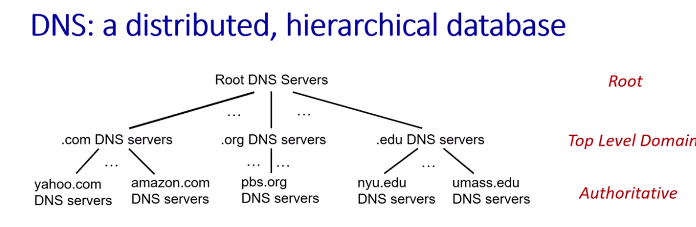

*Hệ thống DNS phân cấp*

- **Root name server:** điểm bắt đầu khi resolver chưa biết phải hỏi ai. Nó không giữ IP của mọi website mà chỉ giới thiệu name server phụ trách TLD như `.com` hoặc `.vn`.

- Thông thường browser hỏi **recursive resolver (máy phân giải đệ quy: server thay client thực hiện chuỗi truy vấn và cache kết quả)**. Resolver mới lần lượt hỏi root, TLD và authoritative server khi cache chưa có dữ liệu.

- **TLD name server:** quản lý delegation cho miền cấp cao như `.com`, `.org`, `.edu`, `.vn` và giới thiệu resolver tới authoritative server.

- **Authoritative name server:** nguồn trả lời chính thức cho record của một zone. Ví dụ khi hỏi IP `www.example.com`, đây là server cuối cùng có quyền trả record do chủ domain cấu hình.

## Video streaming và Content Delivery Network

### Video streaming

- **Video streaming:** tải và phát video từng phần thay vì chờ toàn bộ file. Mục đích là giảm thời gian bắt đầu phát và thích nghi với mạng thay đổi; hệ thống dùng nén video, segment, buffer và nhiều mức bitrate.

- Chiếm phần lớn băng thông của internet (80% vào 2020) ⇒ thách thức là làm sao để mở rộng quy mô, tăng số lượng người truy cập đồng thời + sự ổn định khi người dùng ở từng khu vực địa lý, từng cách kết nối mạng (khu vực xa xôi hẻo lánh, 4G, dây,...) ⇒ cần xây dựng hệ thống phân tán trải rộng ra nhiều nơi + người dùng sẽ kết nối tới server gần mình nhất để xem.

- Video bản chất là chuỗi các hình ảnh (> 30 images/ s) và mỗi ảnh chỉ khác nhau 1 chút thôi + mỗi ảnh được cắt ra thành các hàng, các cột tạo thành 1 tập hợp các ô (pixel được thể hiện bằng lượng bit nhất định)

- Khi muốn truyền dữ liệu ảnh này đi thì cần mã hóa để số lượng bit phải truyền ít hơn với lượng bit mô tả hình ảnh này

- **Mã hóa theo không gian:** ở trên 1 bức ảnh, có những điểm ảnh giống nhau cả về màu sắc, hình ảnh, độ sáng ⇒ Thay vì gửi toàn bộ thì những điểm ảnh giống nhau sẽ gửi 1 đi thôi để thể hiện cho toàn bộ điểm ảnh giống nhau.

- **Mã hóa theo thời gian:** video là chuỗi các hình ảnh, các hình sau khác một chút so với hình trước ⇒ Thay vì gửi toàn bộ các ảnh riêng biệt, ta chỉ gửi các phần khác nhau giữa các ảnh.

- Băng thông sẽ thay đổi liên tục (mức độ tắc nghẽn tùy thời điểm sử dụng) + packet loss, delay do tắc nghẽn dẫn tới video bị vỡ, chậm, xoay tròn.

- **Client-side buffer (bộ đệm phía client):** vùng nhớ giữ trước vài giây video để hấp thụ dao động tốc độ mạng. Buffer cạn gây **rebuffering (video dừng để tải thêm)**.

### DASH (Dynamic Adaptive Streaming over HTTP: truyền video thích ứng qua HTTP)

- **DASH:** chia video thành các segment ngắn, mỗi segment có nhiều mức bitrate. Client tự chọn bản phù hợp ở từng thời điểm: mạng nhanh thì tải chất lượng cao, mạng chậm hoặc buffer sắp cạn thì hạ chất lượng để tránh đứng hình.

- Server chia video thành **chunk/segment (đoạn nhỏ của nội dung)**, mỗi đoạn được mã hóa ở nhiều **bitrate (số bit dữ liệu mỗi giây, thường tương ứng mức chất lượng)**.

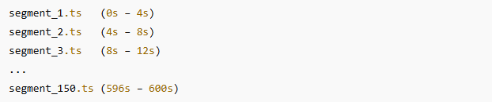

*Hình 75*

- **Adaptive bitrate streaming - ABR (phát thích ứng bitrate):** client đổi mức chất lượng giữa các segment dựa trên tốc độ tải, buffer và điều kiện phát.

- Các file nhỏ này được lưu ở nhiều CDN (Content delivery network) → client thường lấy ở server gần client nhất để tải được nhanh + giảm tải cho server gốc. Ví dụ thư mục sẽ nằm trên CDN như:

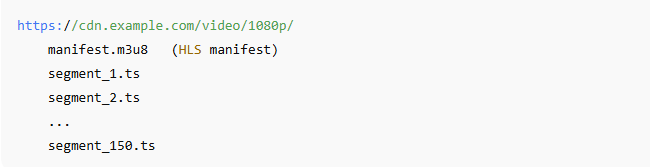

*Hình 76*

- **Manifest file (tệp mô tả luồng):** liệt kê các mức chất lượng, codec, URL và segment mà client có thể tải.

- **Master manifest (manifest chính):** liệt kê các **variant/representation (phiên bản chất lượng/bitrate khác nhau)**.

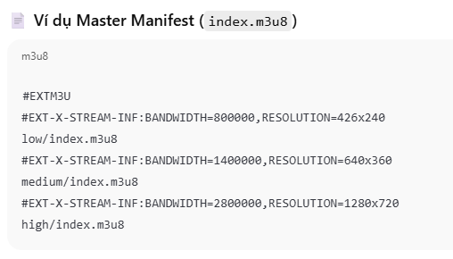

*Hình 77*

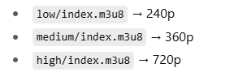

*Hình 78*

- **Variant manifest/playlist:** liệt kê URL các segment của một phiên bản chất lượng cụ thể.

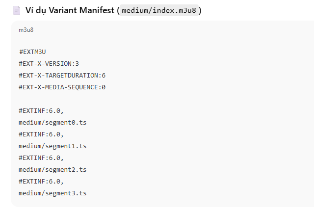

*Hình 79*

- Client tải Manifest file về khi người dùng bấm play

- Client dựa vào tốc độ mạng hiện tại sẽ quyết định tải chunks ở tốc độ nào

- Client liên tục đo tốc độ mạng để điều chỉnh adaptive theo thời gian thực + dựa vào buffer để có tiếp tục tải nữa không.

## Network Topology (cấu trúc liên kết mạng)

- **Network topology:** mô hình mô tả các node nối với nhau ra sao và dữ liệu đi theo cấu trúc nào. Nó giúp đánh giá chi phí dây/cổng, khả năng mở rộng và hậu quả khi một link hoặc node bị lỗi.

- **Physical topology (cấu trúc vật lý):** mô tả dây, cổng và thiết bị thực sự kết nối thế nào.

- **Logical topology (cấu trúc logic):** mô tả dữ liệu hoặc quyền truy cập môi trường truyền di chuyển thế nào, có thể khác cách nối dây vật lý.

### Bus topology (cấu trúc đường trục)

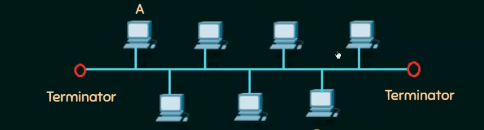

*Bus topology*

- Bus topology thì có 1 transmission medium chung + tất cả các nodes sẽ được connect tới nó

- Node A muốn send data qua node B thì truyền nhận thông qua transmission medium này (tuy nhiên các nodes trong network này sẽ đều nhận được copy của data này đồng thời với B -> không security)

- **Bidirectional (hai chiều):** dữ liệu có thể truyền theo cả hai hướng trên bus, dù không nhất thiết đồng thời.

- Rẻ, chỉ cần 1 wire cho toàn bộ nodes -> phù hợp khi xây dựng 1 mạng tạm thời

- Các node nối độc lập với transmission medium chung -> việc hỏng 1 node sẽ không ảnh hưởng tới toàn bộ network >< tuy nhiên nếu transmission medium chung mà lỗi thì tất cả các nodes sẽ bị hỏng

- Khó scale khi cable như cũ nhưng số lượng nodes tăng lên

### Ring topology (cấu trúc vòng)


*Ring topology*

- Bản thân nó chính là Bus topology nhưng trong 1 vòng tròn khép kín

- Dạng Peer-to-peer LAN

- Mỗi nodes sẽ có 2 connections đến mỗi node hàng xóm

- Một số ring truyền **unidirectional (một chiều)** quanh vòng; các thiết kế dual ring có thể có đường dự phòng ngược chiều.

- Ổn định hơn so với Bus + đứt tại 1 nơi thì vẫn có khả năng mạng vẫn work tốt trong 1 số trường hợp (đứt ở C thì A vẫn communicate với B được)

- Giả sử việc node A muốn giao tiếp với node D + thứ tự kim đồng hồ là A -> B -> C -> D -> E -> A và chu kì là chiều kim đồng hồ + giả sử node A muốn communicate với node D thì node A send data tới node B -> node B send data tới node C -> node C send data tới node D và kết thúc quá trình send data

### Star topology (cấu trúc hình sao)


*Star topology*

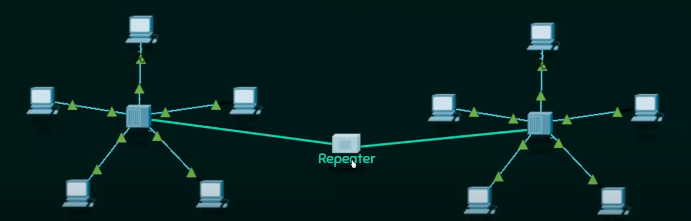

*Hình 83*

- Các nodes được connect với nhau gián tiếp qua 1 central node (hub/ switch) + tất cả các data đều phải thông qua central node này

- Nhờ có central node, nó giúp xác định path mà data phải đi thay vì bắn toàn bộ data tới toàn bộ node như Bus

- Dễ scale + dễ implement

- Tuy nhiên có thể gây overload tới Switch/ Hub + chi phí tăng do phải sử dụng Switch/ Hub + việc hỏng central node sẽ gây hỏng toàn bộ hệ thống

### Mesh topology (cấu trúc lưới)

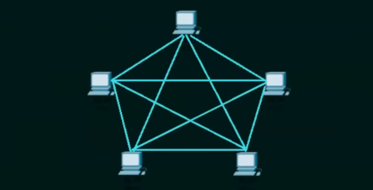

*Mesh topology*

- Dạng lưới, các nodes sẽ link tới toàn bộ các nodes còn lại của network

- 1 link bị lỗi không ảnh hưởng, hệ thống vẫn làm việc bình thường + giả sử node A và C bị lỗi connection, tuy nhiên chúng vẫn có thể communicate với nhau gián tiếp qua node khác, miễn là có đường đi với nhau

- Full mesh có số link tăng rất nhanh; mesh không đồng nghĩa mọi traffic đều broadcast.

## MAC Addressing (đánh địa chỉ MAC)

### MAC address (địa chỉ tầng liên kết)

- **MAC address:** địa chỉ mà Ethernet/Wi-Fi dùng để nhận diện interface trên một link Layer 2. Mục đích là giúp switch chuyển frame tới đúng port trong LAN; MAC không được router dùng làm địa chỉ đích xuyên Internet.

- MAC thường dài 48 bit và được thiết kế để có tính duy nhất, nhưng có thể bị thay đổi/spoof và không phải định danh toàn cục đáng tin cậy. Switch **forward frame**, không routing Internet dựa trên MAC.

- Router cần IP để routing đúng + Switch cần MAC address để forward data đúng tới thiết bị cần nhận data

- Khi gửi dữ liệu ra ngoài subnet, IP packet giữ IP đích cuối cùng, còn Ethernet frame trên chặng LAN có MAC đích là MAC của default gateway. Khi phản hồi quay về, router NAT/PAT tra ánh xạ để tìm private IP và port nội bộ, tra ARP cache để tìm MAC của máy đó, rồi tạo một frame mới có MAC đích là MAC của máy nội bộ. Switch đọc MAC đích của frame để chuyển frame tới đúng port.

- Nếu request trong mạng, tìm private IP, MAC address của máy đích (nếu chưa cache) → gán IP đích, MAC đích vừa tìm được vào packet → gửi tới switch, switch tra MAC address table để biết port nào của switch kết nối tới thiết bị đích → truyền packet trực tiếp tới đúng port của thiết bị đích.

- Mọi switch đều giữ MAC address table để biết được node nào cần forward data

- **NIC (Network Interface Card/Controller: card/bộ điều khiển giao tiếp mạng):** phần cứng hoặc interface ảo nối thiết bị với mạng. Một thiết bị có nhiều NIC thì có thể có nhiều MAC; hệ điều hành cũng có thể dùng MAC ngẫu nhiên.

- Lọc theo MAC chỉ là kiểm soát yếu vì MAC có thể bị giả mạo; không nên dùng nó thay cho authentication, certificate hoặc chính sách truy cập mạnh hơn.

- MAC cũng sử dụng để tracking, khắc phục sự cố mạng, khi này dùng MAC để tracking luồng dữ liệu trong mạng, xác định nguồn gốc của sự cố mạng

- Cần phân biệt ba bảng:

  - **ARP/neighbor cache trên host hoặc router:** ánh xạ IP on-link → MAC để thiết bị tạo frame tới next hop.
  - **MAC address table trên switch/access point:** ánh xạ MAC → port để chuyển frame đúng cổng.
  - **NAT/connection table trên router NAT:** ánh xạ kết nối phía trong ↔ phía ngoài để đưa response về đúng IP/port nội bộ.

  Ví dụ khi laptop gửi packet ra Internet, laptop dùng ARP tìm MAC của default gateway; switch dùng MAC table chuyển frame tới router; khi response quay về, router dùng bảng NAT/PAT tìm IP và port của laptop rồi dùng ARP cache để tạo frame có MAC đích của laptop.

### ARP

- **ARP:** giúp IPv4 host biến một IP on-link thành MAC để có thể tạo frame Ethernet. Ví dụ laptop biết gateway là `192.168.1.1` nhưng phải ARP để tìm MAC của router trước khi gửi frame cho gateway.

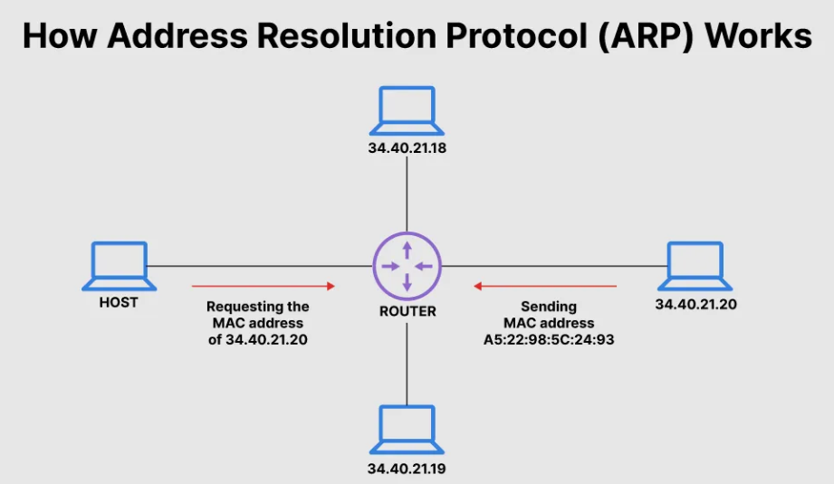

*ARP*

## Security

### Packet sniffing (bắt và phân tích packet)

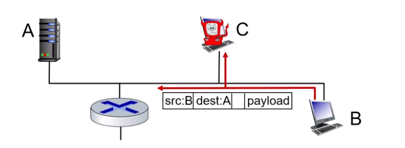

*Packet sniffing*

- **Packet sniffing:** thu packet/frame để xem header, nội dung và trình tự giao tiếp. Quản trị viên dùng nó để tìm lỗi như retransmission hoặc DNS chậm; kẻ tấn công có thể dùng để nghe lén traffic không mã hóa.

- **Promiscuous mode (chế độ hỗn tạp):** NIC chuyển lên hệ điều hành mọi frame mà nó nhận được, nhưng chế độ này không tự khiến switch gửi toàn bộ traffic tới NIC đó.

### IP spoofing (giả mạo IP nguồn)

- **IP spoofing:** ghi source IP giả vào packet. Mục đích thường là che nguồn hoặc khiến hệ thống thứ ba gửi response tới nạn nhân; nó không dễ dùng cho giao tiếp TCP hai chiều vì response không quay lại kẻ gửi.

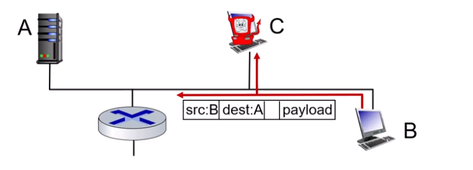

*IP spoofing*

- Bởi IP protocol là giao thức best-effort, chỉ quan tâm gửi packet từ nguồn tới đích, không kiểm tra IP nguồn có thật hay không

- Khi gửi tới đích, đích sẽ phản hồi dựa trên IP nguồn được ghi trên packet

- **Reflection attack (tấn công phản xạ):** kẻ tấn công gửi request mang source IP của nạn nhân để server phản hồi về nạn nhân. **Amplification (khuếch đại):** response lớn hơn request làm tăng lượng traffic đánh vào nạn nhân.

### DoS

- **DoS:** làm dịch vụ không còn đủ tài nguyên phục vụ người dùng hợp lệ. Kẻ tấn công có thể làm đầy bandwidth, connection table, thread, CPU hoặc tài nguyên ứng dụng; mục tiêu là phá tính sẵn sàng chứ không nhất thiết đánh cắp dữ liệu.

- **DDoS (Distributed Denial of Service: từ chối dịch vụ phân tán):** DoS phát sinh từ nhiều nguồn. **Botnet (mạng máy bị chiếm quyền)** có thể đồng thời gửi traffic tới mục tiêu, nhưng DDoS còn có các nguồn/kỹ thuật khác.
