# Network I/O, Socket, Buffer và App hoạt động thế nào?

Tài liệu này giải thích luồng dữ liệu mạng tổng quát cho một app bất kỳ: web server, Redis, PostgreSQL, message broker, API service,... Điểm chính cần nhớ: app không đọc/ghi trực tiếp ra dây mạng. App làm việc với **socket** do hệ điều hành cung cấp; còn kernel, TCP/IP stack, socket buffer, NIC driver và card mạng mới là các lớp thật sự đưa bytes vào/ra network.

## Bức tranh tổng quan

```mermaid
flowchart LR
    ClientApp[Client app/browser] --> ClientSocket[Client socket]
    ClientSocket --> ClientKernel[Client kernel TCP/IP stack]
    ClientKernel --> ClientNIC[NIC driver/card mạng]
    ClientNIC --> Network[Network: Wi-Fi/LAN/Internet]
    Network --> ServerNIC[Server NIC driver/card mạng]
    ServerNIC --> ServerKernel[Server kernel TCP/IP stack]
    ServerKernel --> SocketBuffer[Socket receive/send buffers]
    SocketBuffer --> ServerSocket[Server socket file descriptor]
    ServerSocket --> ServerApp[Server app]
```

Một request đi qua nhiều lớp:

- **App**: code của mình, ví dụ Spring Boot, Node.js, Redis, Nginx.
- **Socket API**: interface app dùng để `read`, `write`, `send`, `recv`, `accept`.
- **Kernel TCP/IP stack**: phần hệ điều hành xử lý TCP, packet, congestion control, retransmit, ACK,...
- **Socket buffer**: vùng nhớ trong kernel giữ dữ liệu nhận/gửi cho từng connection.
- **NIC driver / card mạng**: driver và phần cứng gửi/nhận frame qua Ethernet/Wi-Fi.
- **Network**: switch, router, internet, load balancer, firewall,...

## Bộ khung đầy đủ hơn của một request

Trong thực tế, request hiếm khi đi thẳng từ client vào app. Nó thường đi qua nhiều thành phần trước, trong và sau app.

```mermaid
flowchart LR
    User[User/browser/mobile app] --> DNS[DNS resolver]
    DNS --> CDN[CDN/edge optional]
    CDN --> WAF[WAF/firewall optional]
    WAF --> LB[Load balancer]
    LB --> Proxy[Reverse proxy/API gateway]
    Proxy --> HostKernel[Server OS kernel]
    HostKernel --> Runtime[Runtime/framework]
    Runtime --> AppCode[Application code]
    AppCode --> Pool[Thread/event loop/worker pool]
    Pool --> Downstream[DB/cache/message broker/external API]
    Downstream --> Pool
    Pool --> Runtime
    Runtime --> HostKernel
    HostKernel --> Proxy
    Proxy --> LB
    LB --> User
```

Không phải hệ thống nào cũng có đủ tất cả thành phần này, nhưng đây là khung hay gặp:

| Lớp | Ví dụ | Vai trò chính |
| --- | --- | --- |
| Client | Browser, mobile app, service client | Tạo request, giữ connection, đọc response |
| DNS | Local resolver, public DNS, Route 53, Cloudflare DNS | Đổi domain thành IP |
| CDN/Edge | Cloudflare, CloudFront, Fastly | Cache static content, terminate TLS, route gần user |
| WAF/Firewall | WAF, security group, iptables, cloud firewall | Chặn request độc hại hoặc port/IP không hợp lệ |
| NAT/Router | Home router, cloud NAT gateway | Dịch địa chỉ IP/port khi đi qua network |
| Load balancer | Nginx, HAProxy, ALB/NLB, Envoy | Chọn backend, health check, phân phối traffic |
| Reverse proxy/API gateway | Nginx, Kong, Spring Cloud Gateway, Envoy | Routing, auth, rate limit, header rewrite, timeout |
| OS kernel | Linux/Windows kernel | TCP/IP stack, socket, buffer, queue, scheduler |
| NIC/driver | Ethernet/Wi-Fi card, virtio, ENA | Nhận/gửi packet ở tầng phần cứng/driver |
| Runtime/framework | JVM/Tomcat/Netty, Node.js, Go runtime, .NET Kestrel | Parse protocol, quản lý thread/event loop, serialize |
| App code | Controller/service/handler | Business logic |
| Downstream | DB, Redis, Kafka, HTTP service | Nơi app gọi tiếp để lấy/ghi dữ liệu |
| Observability | Logs, metrics, tracing, profiling | Biết request đang chậm ở đâu |

Một request chậm có thể không hề chậm ở code app. Nó có thể chậm ở DNS, TLS handshake, load balancer queue, kernel accept queue, thread pool, DB connection pool, hoặc lúc client đọc response quá chậm.

## Trước khi request chạm tới app

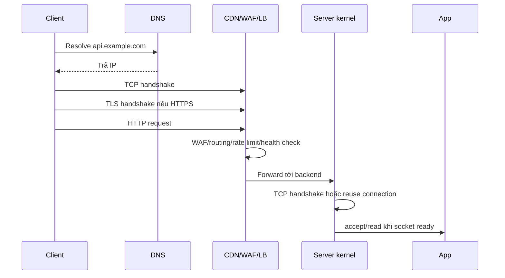

Các bước hay bị bỏ sót:

1. **DNS lookup**: client phải biết IP của server/CDN/load balancer.
2. **TCP handshake**: tạo connection bằng SYN/SYN-ACK/ACK.
3. **TLS handshake**: nếu HTTPS, hai bên thương lượng khóa mã hóa và certificate.
4. **Proxy/load balancer routing**: request có thể bị route, queue, rate limit, auth hoặc reject.
5. **Backend connection**: proxy có thể mở connection mới tới app hoặc reuse connection cũ.
6. **Kernel accept/readiness**: OS nhận connection và báo app khi có socket/data sẵn sàng.

```text
User click
-> DNS
-> TCP
-> TLS
-> CDN/WAF/LB/proxy
-> server kernel
-> socket/accept queue
-> app/framework
```

Vì vậy khi nói "request tới app", thực ra có hai nghĩa:

- Tới **machine/backend port**: packet đã đến server hoặc proxy.
- Tới **application handler**: framework đã parse xong và gọi controller/handler.

Hai thời điểm này có thể cách nhau đáng kể nếu queue đầy hoặc app bận.

## Socket là gì?

Socket là endpoint giao tiếp mạng do OS quản lý. App thường chỉ cầm một số gọi là **file descriptor** hoặc **handle** đại diện cho connection.

Ví dụ server đang lắng nghe port `8080`:

```text
App không trực tiếp nói chuyện với card mạng.
App gọi OS:

listen socket: "Tôi muốn nhận connection ở port 8080"
connection socket: "Đây là connection cụ thể giữa client A và server"
```

Một TCP connection thường được nhận diện bằng 4 thông tin:

```text
client_ip:client_port -> server_ip:server_port
```

Ví dụ:

```text
192.168.1.10:53124 -> 10.0.0.5:8080
```

Server có thể có hàng nghìn connection cùng tới port `8080`. OS phân biệt chúng bằng cặp IP/port của hai phía, không chỉ bằng port server.

## Buffer là gì?

Buffer là vùng nhớ tạm để giữ dữ liệu khi tốc độ giữa các bên không khớp nhau.

Trong network I/O thường có nhiều loại buffer:

| Buffer | Nằm ở đâu | Dùng để làm gì |
| --- | --- | --- |
| Application buffer | Trong process app | Mảng byte/string/object mà code app tạo ra hoặc đọc vào |
| Socket receive buffer | Trong kernel | Giữ bytes đã nhận từ network nhưng app chưa đọc |
| Socket send buffer | Trong kernel | Giữ bytes app đã gửi cho OS nhưng chưa gửi hết ra network |
| NIC ring buffer | Driver/card mạng | Hàng đợi packet/frame giữa kernel và card mạng |
| Protocol/framework buffer | Trong library/framework | Ví dụ HTTP parser buffer, TLS buffer, Netty ByteBuf |

Điều quan trọng: khi app gọi `write()`, thường không có nghĩa bytes đã ra internet ngay. Nó thường có nghĩa là bytes đã được copy vào **kernel send buffer** hoặc được OS nhận để xử lý tiếp.

## Luồng nhận request vào server

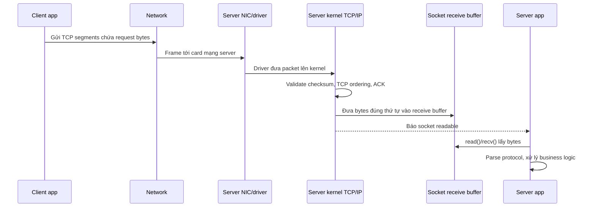

Chi tiết từng bước:

1. Client tạo request, ví dụ HTTP request.
2. Client kernel chia dữ liệu thành TCP segments.
3. Dữ liệu đi qua network tới server.
4. NIC server nhận frame, driver đưa packet lên kernel.
5. Kernel kiểm tra checksum, TCP sequence number, gom lại đúng thứ tự.
6. Kernel đặt bytes vào **socket receive buffer** của connection tương ứng.
7. Kernel báo cho app biết socket đã có dữ liệu đọc được.
8. App gọi `read()`/`recv()` để copy bytes từ kernel buffer sang application buffer.
9. App parse protocol, ví dụ HTTP parser đọc method/path/header/body.
10. App xử lý logic, gọi DB/cache/service khác nếu cần.

Điểm hay bị nhầm: request đã tới server machine chưa chắc app đã xử lý ngay. Nó có thể đang nằm trong NIC queue, kernel backlog, socket receive buffer, event loop queue, thread pool queue, hoặc framework buffer.

## Luồng gửi response ra ngoài

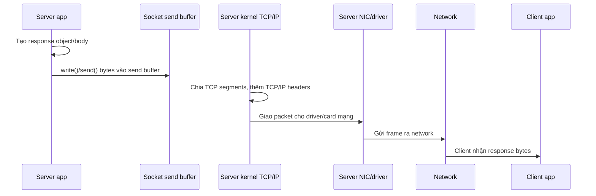

Chi tiết từng bước:

1. App tạo response: status code, headers, body.
2. Framework serialize response thành bytes, ví dụ JSON string hoặc binary.
3. App gọi `write()`/`send()` trên socket.
4. Kernel nhận bytes và đưa vào **socket send buffer**.
5. Kernel TCP/IP stack chia bytes thành segments, thêm TCP/IP headers.
6. NIC driver/card mạng gửi frame ra ngoài.
7. Client nhận bytes, kernel client đưa vào receive buffer.
8. Client app đọc bytes và parse response.

Nếu response quá lớn hoặc client/network chậm, send buffer có thể đầy. Khi đó:

- Với blocking I/O, `write()` có thể block.
- Với non-blocking I/O, `write()` có thể chỉ ghi được một phần hoặc trả `EAGAIN`/`EWOULDBLOCK`.
- Framework phải nhớ phần còn lại để ghi tiếp khi socket writable.

## Blocking I/O, non-blocking I/O và event loop

### Blocking I/O

```text
thread gọi read()
  nếu chưa có dữ liệu -> thread ngủ/chờ
  khi có dữ liệu -> thread tỉnh dậy và xử lý
```

Mô hình này dễ hiểu, nhưng nếu mỗi connection giữ một thread thì app có thể tốn nhiều memory và context switch khi có rất nhiều connection.

### Non-blocking I/O

```text
thread gọi read()
  nếu có dữ liệu -> đọc được ngay
  nếu chưa có dữ liệu -> trả về "chưa có", thread không bị treo lâu
```

App thường kết hợp non-blocking socket với cơ chế event notification:

- Linux: `epoll`
- macOS/BSD: `kqueue`
- Windows: IOCP

### Event loop

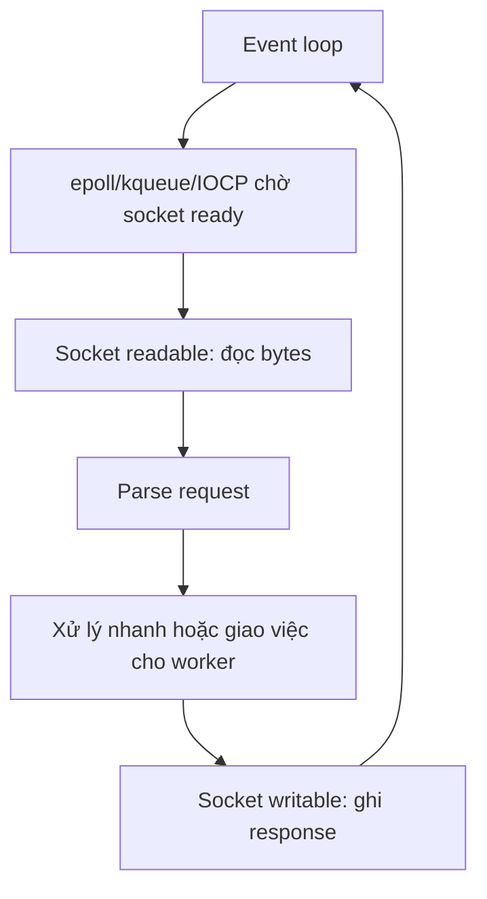

Event loop không tự làm mọi thứ nhanh hơn một cách kỳ diệu. Nó nhanh khi mỗi task nhỏ và không block lâu. Nếu code trong event loop làm CPU nặng, parse object quá lớn, serialize response quá lớn, hoặc gọi I/O blocking, toàn bộ loop có thể bị chậm.

## Thread pool / worker pool nằm ở đâu?

Nhiều app tách việc ra các nhóm thread:

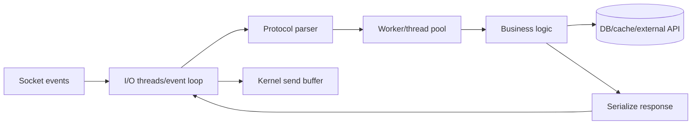

Một số mô hình thường gặp:

- **Thread per request**: thường thấy trong app server truyền thống. Mỗi request được một worker thread xử lý.
- **Event loop + worker pool**: event loop lo network I/O, worker lo CPU/blocking task.
- **Reactor pattern**: event loop nhận readiness event rồi dispatch handler.
- **Proactor pattern**: OS làm async I/O, app nhận completion event.

Ví dụ trong Java/Spring Boot dùng Tomcat truyền thống, request thường được worker thread xử lý. Với Netty/WebFlux, event loop xử lý network và pipeline async; nếu có việc blocking thì nên đưa sang scheduler/worker riêng.

## Bên trong app server thường có những lớp nào?

Khi bytes đã được đọc khỏi socket, app framework thường còn phải đi qua nhiều lớp trước khi vào business code.

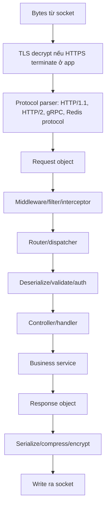

Tùy framework, tên gọi khác nhau:

| Khái niệm | Java/Spring ví dụ | Node.js ví dụ | Vai trò |
| --- | --- | --- | --- |
| Protocol parser | Tomcat/Netty HTTP parser | Node HTTP parser | Đọc bytes thành request |
| Middleware/filter | Servlet filter, Spring interceptor | Express middleware | Auth, logging, CORS, rate limit |
| Router/dispatcher | DispatcherServlet | Express router/Fastify router | Chọn handler |
| Deserializer | Jackson | JSON.parse/body parser | Chuyển body bytes thành object |
| Validator | Bean Validation | zod/joi/custom validation | Kiểm tra input |
| Handler/controller | `@RestController` | route handler | Nhận request ở tầng app |
| Serializer | Jackson | JSON.stringify | Chuyển response object thành bytes |

Các lớp này cũng có thể làm request chậm:

- Body quá lớn làm parse/deserialization chậm.
- Middleware gọi DB/auth service chậm.
- Logging quá nhiều hoặc log body lớn.
- Compression response lớn tốn CPU.
- JSON serialize object lớn gây CPU và memory pressure.
- Runtime GC pause khi tạo nhiều object/buffer lớn.

## Khi app gọi DB/cache/service khác

Một request vào app thường kéo theo request khác đi ra ngoài. Ví dụ API nhận request rồi gọi Redis, PostgreSQL và một service HTTP khác.

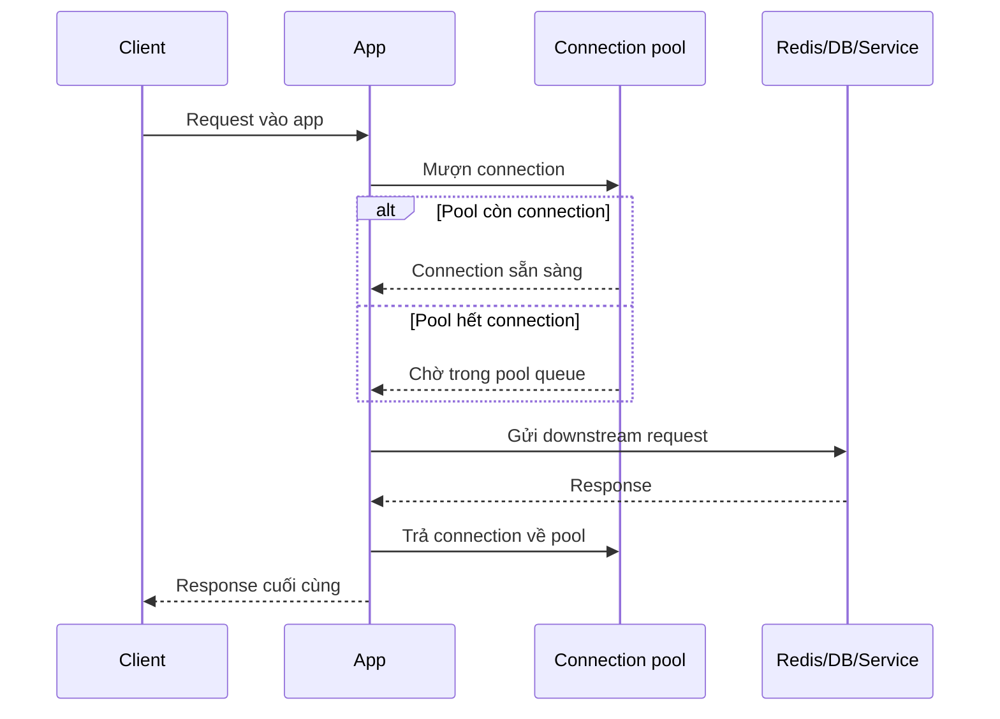

Các thành phần thêm ở phía downstream:

- **Connection pool**: giữ sẵn connection tới DB/cache/service để không phải handshake lại liên tục.
- **Pool queue**: nếu hết connection, request phải chờ trước khi thật sự gọi DB.
- **Timeout**: giới hạn thời gian chờ connect/read/write.
- **Retry**: thử lại khi lỗi tạm thời, nhưng retry sai có thể nhân tải lên.
- **Circuit breaker**: ngắt bớt request tới downstream đang lỗi để tránh sập dây chuyền.
- **Bulkhead**: tách pool/tài nguyên theo nhóm để một downstream chậm không kéo chết toàn app.

Một API có thể chậm dù network vào app rất nhanh, chỉ vì:

```text
request vào app nhanh
-> worker lấy request
-> chờ DB connection pool 500 ms
-> query DB 50 ms
-> serialize response 20 ms
-> client nhận sau tổng cộng 570+ ms
```

## OS scheduler, CPU, memory và GC cũng nằm trong câu chuyện

Network I/O không sống một mình. App còn phụ thuộc tài nguyên máy:

| Thành phần | Ảnh hưởng |
| --- | --- |
| CPU scheduler | Thread sẵn sàng chạy nhưng chưa được CPU cấp thời gian thì vẫn chậm |
| Context switch | Quá nhiều thread/connection có thể tăng chi phí chuyển ngữ cảnh |
| Memory allocation | Tạo nhiều object/buffer lớn làm tăng memory pressure |
| GC | JVM/.NET/Node.js có thể pause hoặc tốn CPU để dọn memory |
| Page cache | File/static content có thể nhanh hơn nếu nằm trong OS page cache |
| Disk I/O | Log sync, file upload/download, DB local disk có thể làm request chậm |
| Container/cgroup limit | CPU quota/memory limit làm app nghẽn dù host còn tài nguyên |

Ví dụ response JSON lớn trong JVM:

```text
DB trả nhiều rows
-> app tạo nhiều object
-> Jackson serialize thành byte/string lớn
-> heap tăng nhanh
-> GC chạy
-> write ra socket bị chậm thêm
```

## TLS/HTTPS nằm ở đâu?

Nếu dùng HTTPS, còn thêm lớp TLS:

```text
Network bytes
-> kernel socket receive buffer
-> app/framework đọc encrypted bytes
-> TLS engine decrypt
-> HTTP parser thấy plain HTTP bytes
-> app xử lý request
```

Chiều response:

```text
app tạo HTTP response
-> TLS engine encrypt
-> write encrypted bytes vào socket
-> kernel gửi ra network
```

TLS có buffer riêng và tốn CPU cho encrypt/decrypt. Vì vậy HTTPS request lớn/response lớn không chỉ tốn network mà còn tốn CPU mã hóa/giải mã.

## Backlog, accept queue và connection mới

Trước khi app đọc request, TCP connection phải được accept.

```mermaid
flowchart LR
    Client[Client SYN] --> Kernel[Kernel TCP handshake]
    Kernel --> SynQueue[SYN queue]
    Kernel --> AcceptQueue[Accept queue]
    AcceptQueue --> App[App accept()]
    App --> ConnSocket[Connection socket]
```

Các queue liên quan:

- **SYN queue**: giữ connection đang trong quá trình TCP handshake.
- **Accept queue**: giữ connection đã handshake xong nhưng app chưa `accept()`.
- **Socket receive buffer**: giữ request bytes sau khi connection đã tồn tại.
- **App/framework queue**: request đã được đọc nhưng chưa có worker xử lý.

Khi server quá tải, request có thể chậm hoặc rớt ở bất kỳ queue nào trong chuỗi này.

## Một request HTTP đơn giản đi qua những bước nào?

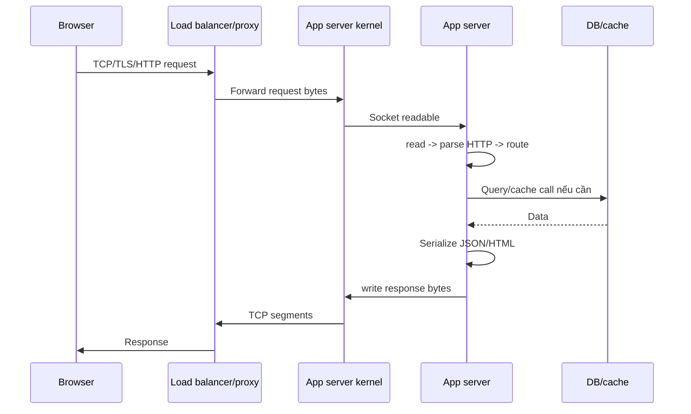

Nếu request chậm, nguyên nhân có thể nằm ở nhiều chỗ:

- DNS lookup chậm.
- TCP handshake chậm.
- TLS handshake chậm.
- Load balancer/proxy queue.
- Server accept queue đầy.
- Socket receive buffer có dữ liệu nhưng app chưa đọc.
- App thread pool hết thread.
- Event loop bị block.
- Business logic chậm.
- DB/cache/external API chậm.
- Serialize response lớn.
- Kernel send buffer đầy do client/network chậm.
- Network bandwidth nghẽn.

## Object lớn / response lớn ảnh hưởng thế nào?

Một object lớn không chỉ chậm ở lúc "gửi ra network". Nó có thể tốn thời gian ở nhiều pha:

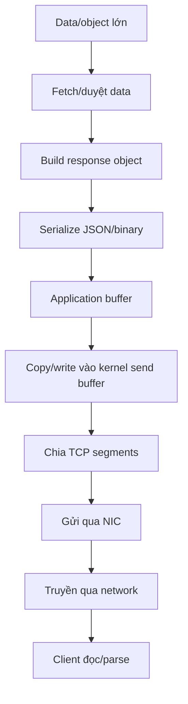

Các chi phí thường gặp:

- **CPU**: serialize JSON, compress, encrypt TLS.
- **Memory**: tạo object, byte array, buffer lớn.
- **Copy cost**: copy giữa application buffer và kernel buffer.
- **GC pressure**: với runtime managed như JVM/Node.js/.NET nếu tạo nhiều object/buffer lớn.
- **Network bandwidth**: response càng lớn càng mất thời gian truyền.
- **Backpressure**: client đọc chậm làm send buffer đầy, app phải chờ hoặc ghi tiếp sau.

Vì vậy câu "main thread chỉ gửi địa chỉ buffer cho I/O thread" chỉ đúng ở một số mô hình và chỉ mô tả một phần nhỏ. Trước khi có buffer để giao, app vẫn phải tạo dữ liệu. Sau khi giao, hệ thống vẫn phải thực sự truyền bytes qua kernel, NIC và network.

## Backpressure là gì?

Backpressure là tín hiệu "phía sau đang chậm, đừng đẩy thêm nhanh quá".

Ví dụ server gửi response 100 MB cho client mạng yếu:

```text
app write nhanh
-> kernel send buffer đầy
-> socket không writable
-> app phải chờ hoặc lưu phần còn lại
-> request/connection chiếm memory lâu hơn
```

Nếu app không xử lý backpressure tốt, nó có thể tạo quá nhiều buffer trong memory và tự làm mình hết RAM.

## Timeout, retry và queue liên kết các thành phần ra sao?

Các thành phần trong hệ thống thường không chỉ nối với nhau bằng socket, mà còn nối bằng **queue**, **buffer**, **timeout** và **retry policy**.

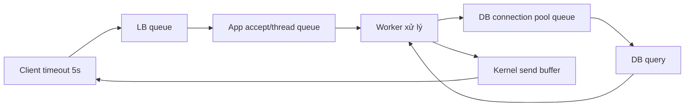

Nếu một đoạn bị chậm, các queue phía trước bắt đầu phình ra:

```text
DB chậm
-> connection pool bị giữ lâu
-> request mới chờ pool
-> worker thread bị giữ lâu
-> app queue tăng
-> load balancer thấy backend chậm
-> client timeout/retry
-> traffic tăng thêm vì retry
```

Retry cần rất cẩn thận. Retry có ích với lỗi tạm thời, nhưng nếu downstream đang quá tải, retry có thể làm quá tải nặng hơn.

Các cơ chế thường đi kèm:

- **Timeout ngắn và rõ ràng**: connect timeout, read timeout, write timeout, request timeout.
- **Retry có giới hạn**: số lần retry ít, có backoff/jitter.
- **Circuit breaker**: khi downstream lỗi nhiều, fail fast thay vì tiếp tục dồn request.
- **Rate limit**: chặn bớt request trước khi hệ thống quá tải.
- **Load shedding**: chủ động bỏ bớt request ít quan trọng để giữ phần lõi sống.
- **Backpressure**: báo ngược lên phía trước rằng app đang xử lý không kịp.

## Các điểm nghẽn thường gặp và nên nhìn metric nào?

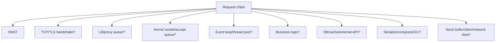

Một số dấu hiệu để khoanh vùng:

| Dấu hiệu | Có thể nghẽn ở đâu |
| --- | --- |
| DNS time cao | DNS resolver/cache/config |
| Connect time cao | Network, firewall, SYN backlog, server accept |
| TLS time cao | Certificate, CPU TLS, TLS handshake, proxy |
| Time to first byte cao | App queue, worker pool, business logic, downstream |
| Download time cao | Response lớn, bandwidth thấp, client đọc chậm |
| CPU cao | Serialize, compression, TLS, business logic, GC |
| Memory tăng | Buffer lớn, queue phình, leak, client chậm |
| Thread pool full | Blocking I/O, downstream chậm, pool quá nhỏ |
| Connection pool full | DB/cache/service chậm hoặc pool quá nhỏ |
| Retries tăng | Downstream/network lỗi, timeout quá thấp/cao, overload |

Các công cụ quan sát thường dùng:

- **Logs**: request log, error log, slow query log.
- **Metrics**: latency percentiles, RPS, error rate, queue length, pool usage.
- **Tracing**: xem request mất thời gian ở service/span nào.
- **Profiling**: CPU profile, allocation profile, flame graph.
- **OS/network tools**: `ss`, `netstat`, `top`, `pidstat`, `iostat`, `tcpdump`, `iftop`.
- **Runtime metrics**: JVM GC, heap, thread count; Node.js event loop lag; Go goroutines/GC.

## Mental model hoàn chỉnh

Khi phân tích một request, đừng chỉ nghĩ:

```text
client -> app -> response
```

Nên nghĩ theo chuỗi:

```text
DNS
-> TCP/TLS
-> CDN/WAF/LB/proxy
-> server NIC/driver
-> kernel TCP/IP stack
-> SYN queue / accept queue / socket buffers
-> event loop hoặc worker thread
-> framework parser/middleware/router
-> business code
-> downstream connection pool
-> DB/cache/service
-> serialize/compress/encrypt
-> kernel send buffer
-> network
-> client receive buffer/parser/render
```

Mỗi mũi tên gần như đều có thể có queue, buffer, timeout, retry hoặc giới hạn tài nguyên. Hiểu các điểm nối này giúp mình debug latency thực tế tốt hơn nhiều so với chỉ nhìn code handler.

## Tóm lại

- App không trực tiếp gửi/nhận từ network; app dùng socket API của OS.
- Kernel giữ receive buffer và send buffer cho từng connection.
- NIC driver/card mạng mới là lớp đưa packet/frame vào ra phần cứng.
- `read()` thường copy bytes từ kernel receive buffer vào app buffer.
- `write()` thường copy bytes từ app buffer vào kernel send buffer, chưa chắc đã ra network ngay.
- Event loop/I/O thread giúp quản lý nhiều socket hiệu quả, nhưng không làm biến mất chi phí parse, business logic, serialize, copy, TLS, compression và network bandwidth.
- Object lớn hoặc collection lớn có thể chậm ở nhiều pha: lấy dữ liệu, build object, serialize, copy buffer, encrypt, truyền network và client parse.
- Muốn app ổn định, cần nghĩ theo cả chuỗi: DNS -> TCP/TLS -> proxy/load balancer -> kernel -> socket buffer -> runtime/framework -> app -> worker -> downstream -> serialize -> socket buffer -> network -> client.
