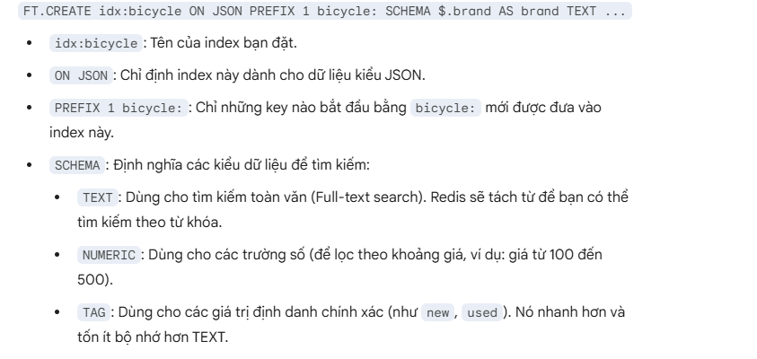
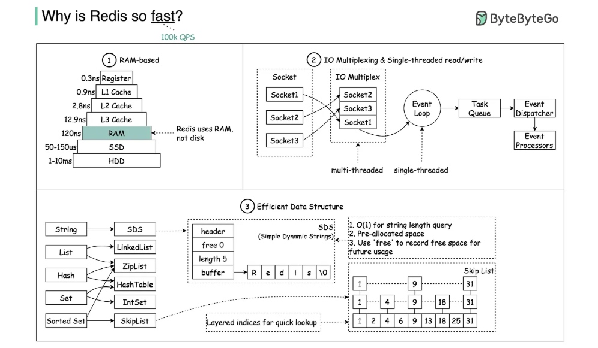
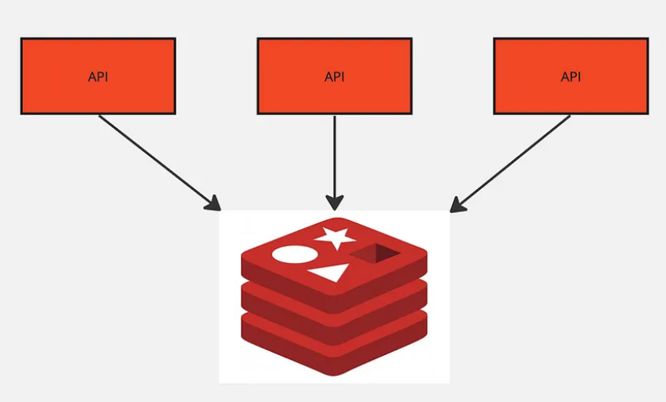
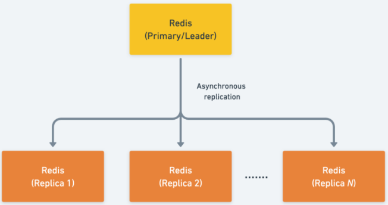
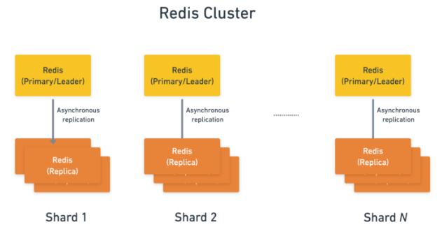
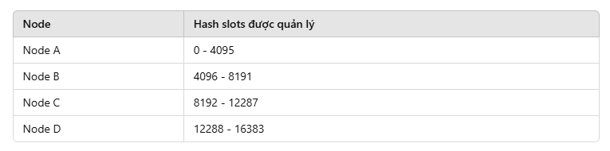
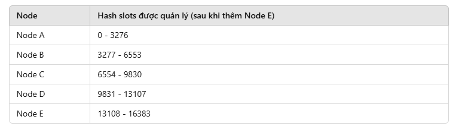

# Redis

## Tài liệu tham khảo

- [What's new? | Docs](https://redis.io/docs/latest/develop/whats-new/)
- <https://redis.io/docs/latest/develop/data-types/>
- <https://redis.io/docs/latest/operate/oss_and_stack/management/persistence/>
- <https://redis.io/docs/latest/develop/data-types/json/>
- <https://redis.io/docs/latest/operate/oss_and_stack/stack-with-enterprise/search/>
- <https://redis.io/docs/latest/develop/clients/jedis/vecsearch/>
- <https://redis.io/docs/latest/operate/oss_and_stack/management/optimization/latency/>
- <https://redis.io/docs/latest/operate/oss_and_stack/management/optimization/latency-monitor/>
- <https://redis.io/docs/latest/develop/using-commands/pipelining/>
- <https://redis.io/docs/latest/develop/using-commands/transactions/>
- <https://redis.io/docs/latest/commands/>
- <https://redis.io/docs/latest/operate/oss_and_stack/management/scaling/>
- <https://redis.io/docs/latest/operate/oss_and_stack/reference/cluster-spec/>
- <https://redis.io/docs/latest/integrate/redis-data-integration/>
- <https://redis.io/technology/redis-enterprise-cluster-architecture/>
- <https://blog.bytebytego.com/p/a-crash-course-in-redis>

## Redis Overview

🙂 Redis (REmote DIctionary Server) là một **in-memory data structure store/server** hiệu suất cao. Nói ngắn gọn, Redis lưu dữ liệu theo dạng `key -> value`, nhưng value không chỉ là string đơn giản mà có thể là nhiều cấu trúc dữ liệu khác nhau như `String`, `Hash`, `List`, `Set`, `Sorted Set`, `Stream`, `JSON`, `Time series`, `Vector set`,... Vì vậy Redis thường được dùng như **cache**, **database**, **message broker**, **stream/event engine**, **search engine**, hoặc **vector database** tùy theo use case.

Nguồn chuẩn để đối chiếu: Redis docs mô tả Redis là một **data structure server**, hỗ trợ nhiều data types cho các bài toán từ caching, queuing đến event processing; Redis cũng có cơ chế persistence xuống disk bằng RDB/AOF nếu cần lưu dữ liệu bền vững.

### 1. In-memory database

**In-memory database** nghĩa là Redis ưu tiên lưu và xử lý dữ liệu trong RAM, nên thao tác đọc/ghi thường có độ trễ rất thấp. Tuy nhiên, vì RAM là volatile memory, nếu muốn dữ liệu không mất khi restart/crash thì cần bật persistence. Redis hỗ trợ nhiều lựa chọn persistence:

- **RDB**: snapshot dataset tại một thời điểm theo interval cấu hình.
- **AOF**: append lại các write command vào log để replay khi restart.
- **No persistence**: tắt persistence, thường hợp với cache thuần.
- **RDB + AOF**: kết hợp cả snapshot và append-only log.

Ví dụ thực tế:

- Cache profile user: `user:1001 -> JSON/string/hash profile`, đặt TTL 10 phút để giảm query xuống MySQL/PostgreSQL.
- Cache access token/session: `session:{token} -> userId`, TTL theo thời gian sống của session.
- Lưu counter realtime: `INCR product:123:view_count` để tăng view count nhanh, sau đó batch sync về database chính.

```redis
SET user:1001:name "Tony" EX 600
GET user:1001:name

INCR product:123:view_count
```

### 2. Data structure store

**Data structure store** là điểm làm Redis khác cache key-value đơn giản. Redis không chỉ lưu blob text, mà cung cấp command tối ưu cho từng cấu trúc dữ liệu. Nhờ đó, nhiều thao tác có thể làm trực tiếp ở Redis thay vì kéo toàn bộ data về application rồi tự xử lý.

Một số ví dụ thực tế và vì sao nên dùng:

| Data type | Dùng khi nào | Vì sao hợp |
| --- | --- | --- |
| **String** | Cache HTML/API response, token, counter, feature flag | Value là một chuỗi/bytes đơn giản, thao tác `GET/SET` rất nhanh. Nếu value là số, Redis hỗ trợ tăng/giảm atomic bằng `INCR`, `DECR`, `INCRBY`. |
| **Hash** | Object phẳng như user profile, cart summary, product stock | Mỗi key Redis chứa nhiều field-value nhỏ. Khi cần sửa `city` hoặc `stock`, ta sửa đúng field đó bằng `HSET`, không cần đọc và ghi lại toàn bộ object. |
| **List** | Queue đơn giản, timeline theo thứ tự insert | List giữ thứ tự phần tử. Có thể push/pop hai đầu danh sách, phù hợp hàng đợi đơn giản hoặc danh sách sự kiện gần nhất. |
| **Set** | Danh sách unique như user đã like bài viết, user online, blacklist token | Set tự đảm bảo không trùng phần tử. Kiểm tra một phần tử có tồn tại không bằng `SISMEMBER`, phù hợp các bài toán membership. |
| **Sorted Set** | Leaderboard, ranking, feed score, delayed job theo timestamp | Mỗi member có một score. Redis tự giữ thứ tự theo score, nên lấy top N hoặc range theo điểm/thời gian rất tiện. |
| **Stream** | Event log, message stream, consumer group | Stream giống append-only log cho event. Hợp khi nhiều consumer cần đọc event theo thứ tự và có tracking đã xử lý tới đâu. |

Tư duy chọn nhanh:

- Nếu chỉ cần `key -> value` đơn giản: dùng `String`.
- Nếu value là object phẳng và hay sửa từng field: dùng `Hash`.
- Nếu cần danh sách có thứ tự insert và push/pop: dùng `List`.
- Nếu cần tập phần tử không trùng và check tồn tại nhanh: dùng `Set`.
- Nếu cần sắp xếp theo điểm, rank, timestamp: dùng `Sorted Set`.
- Nếu dữ liệu là dòng event cần consumer xử lý: dùng `Stream`.

```redis
HSET user:1001 name "Tony" age 25 city "HCM"
HGET user:1001 name

SADD post:99:liked_users 1001 1002 1003
SISMEMBER post:99:liked_users 1001

ZADD leaderboard 9500 user:1001 8700 user:1002
ZREVRANGE leaderboard 0 9 WITHSCORES
```

Giải thích ví dụ:

- `HSET user:1001 name "Tony" age 25 city "HCM"`: tạo một Hash đại diện cho user `1001`, gồm các field `name`, `age`, `city`.
- `HGET user:1001 name`: lấy riêng field `name`, không cần lấy toàn bộ object user.
- `SADD post:99:liked_users 1001 1002 1003`: thêm các user đã like post `99` vào Set. Nếu thêm lại `1001`, Redis không tạo bản ghi trùng.
- `SISMEMBER post:99:liked_users 1001`: kiểm tra user `1001` đã like post `99` chưa.
- `ZADD leaderboard 9500 user:1001 8700 user:1002`: thêm user vào leaderboard, mỗi user có score riêng.
- `ZREVRANGE leaderboard 0 9 WITHSCORES`: lấy top 10 user có score cao nhất kèm điểm.

Điểm quan trọng ở đây là Redis không bắt application phải tự xử lý mọi thứ. Ví dụ nếu lưu danh sách user like bằng một JSON string, app phải `GET`, parse JSON, kiểm tra trùng, thêm user, serialize rồi `SET` lại. Với `Set`, Redis làm đúng bài toán membership bằng command chuyên dụng.

> Lưu ý chỉnh lại so với ghi chú cũ: `Integer` không nên xem là một data type riêng độc lập trong Redis. Redis `String` có thể chứa số và dùng các command như `INCR`, `DECR`, `INCRBY` để thao tác atomic. `Linked List` cũng không nên viết như data type public; ở góc nhìn Redis command/API thì data type là `List`.

### 3. Document database / JSON field query

Redis có hỗ trợ **JSON** như một Redis data type: có thể `JSON.SET`, `JSON.GET`, cập nhật theo path, thao tác trên field/array/object bên trong document. Khi kết hợp với Redis Search/Query, JSON document có thể được **index** và query theo field text, numeric, tag, geo, full-text, fuzzy, vector,...

Vì vậy có thể hiểu Redis có khả năng làm **document-style database** cho các use case cần JSON linh hoạt và latency thấp. Tuy nhiên nên nói chính xác là: Redis hỗ trợ lưu/query JSON document thông qua RedisJSON + Redis Search/Query, chứ không nên hiểu Redis mặc định giống MongoDB ở mọi khía cạnh như query planner, transaction model, storage model, hoặc workload tối ưu.

Ví dụ thực tế: lưu product catalog dạng JSON và index các field hay query.

```redis
JSON.SET product:1001 $ '{
  "name": "iPhone 15",
  "brand": "Apple",
  "price": 19990000,
  "category": "phone",
  "stock": 42
}'

JSON.GET product:1001 $.price
JSON.NUMINCRBY product:1001 $.stock -1
```

Để query nhanh theo field như `brand`, `price`, `category`, ta cần tạo index cho các field đó bằng Redis Search/Query. Nếu không có index, Redis vẫn có thể lấy document theo key rất nhanh, nhưng không tự nhiên query field giống SQL/document DB.



### 4. String vs Hash vs JSON khi lưu object

Trong Redis, dùng `String`, `Hash`, hoặc `JSON` để lưu object đều được, nhưng nên chọn theo cách mình cần đọc/ghi:

| Cách lưu | Khi nào hợp | Điểm cần chú ý |
| --- | --- | --- |
| `String` chứa JSON serialized | Object nhỏ, thường đọc/ghi nguyên khối, làm cache response/API payload | Muốn sửa 1 field thường phải deserialize -> sửa -> serialize -> ghi đè toàn bộ |
| `Hash` | Object phẳng, field ít nested, cần đọc/sửa từng field nhanh | Không tự nhiên cho object nested sâu |
| `JSON` | Object nested, array, schema linh hoạt, cần update/query theo path | Muốn query theo field nhanh thì nên kết hợp index |

Ví dụ:

```redis
# String: cache nguyên response
SET cache:user:1001 '{"id":1001,"name":"Tony","city":"HCM"}' EX 600

# Hash: sửa field riêng lẻ
HSET user:1001 id 1001 name "Tony" city "HCM"
HSET user:1001 city "Da Nang"

# JSON: object nested
JSON.SET order:9001 $ '{
  "id": 9001,
  "customer": {"id": 1001, "name": "Tony"},
  "items": [{"sku": "A01", "qty": 2}]
}'
JSON.GET order:9001 $.customer.name
```

### 5. Vector database

**Vector database**: Redis có khả năng lưu trữ và tìm kiếm vector embeddings. Embedding là mảng số biểu diễn ý nghĩa của text, hình ảnh, audio,... Redis Search có thể index vector field trong Hash hoặc JSON object; khoảng cách giữa hai vector thể hiện mức độ giống nhau về mặt ngữ nghĩa.

Ví dụ thực tế:

- Semantic search: user search "điện thoại chụp ảnh đẹp", hệ thống tìm product description gần nghĩa nhất.
- RAG chatbot: lưu embedding của document chunks vào Redis, khi user hỏi thì tìm các chunk liên quan nhất để đưa vào context.
- Recommendation: tìm item/user có vector gần nhau để gợi ý sản phẩm/nội dung.

```redis
# Pseudo flow:
# 1. App tạo embedding từ text bằng model AI.
# 2. Lưu embedding vào Redis Hash/JSON.
# 3. Tạo vector index bằng FT.CREATE.
# 4. Query top K vector gần nhất bằng FT.SEARCH.
```

### Đánh giá lại ghi chú cũ

- Đúng: Redis là NoSQL, key-value oriented, thường dùng làm cache/message broker/database/stream engine; dữ liệu chủ yếu xử lý trong RAM; có persistence để phục hồi sau restart.
- Cần sửa: Redis không chỉ là key-value string store mà là data structure store. Không nên liệt kê `Integer` như data type riêng; nên dùng `String` + atomic numeric commands. Không nên viết `Linked List` như data type public; nên viết `List`.
- Cần nói cẩn trọng hơn: Redis có thể đóng vai trò document-style database khi dùng JSON + Search/Query, nhưng không nên nói "giống MongoDB" theo nghĩa thay thế hoàn toàn. Cách chuẩn hơn là: Redis hỗ trợ lưu JSON, cập nhật bằng JSONPath, index/query JSON document, và phù hợp khi cần latency thấp.

## 😀 Use case

- Thường được sử dụng để đặt trước main database (MySQL, PostgreSQL,...) để cải thiện hiệu năng của hệ thống do Redis dùng RAM nên nhanh hơn + giảm số lượng truy vấn tối đa xuống main database.
- Sử dụng làm rate limit.
- Sử dụng làm distributed lock.
- Sử dụng làm blacklist.

## Why is Redis fast?



Redis nhanh vì nhiều yếu tố cộng lại, không phải chỉ vì “dùng RAM”. Nói chuẩn hơn: Redis tối ưu cho các thao tác dữ liệu nhỏ, command đơn giản, data structure phù hợp, event loop ít overhead, và giảm chi phí network round-trip khi dùng đúng cách.

### 1. Dữ liệu chủ yếu nằm trong RAM

Redis ưu tiên xử lý dữ liệu trong memory. So với database chính phải đọc page từ disk, kiểm tra buffer pool, xử lý storage engine,... Redis thường truy cập trực tiếp dữ liệu đang nằm trong RAM nên latency rất thấp.

Ví dụ:

```redis
GET user:1001:name
```

Với cache hit, Redis chỉ cần tìm key trong memory rồi trả value. Nếu không có Redis, application có thể phải query DB:

```sql
SELECT name FROM users WHERE id = 1001;
```

Query DB vẫn có thể nhanh nếu index tốt và data nằm trong cache của DB, nhưng nó thường phải đi qua nhiều tầng hơn: SQL parser, optimizer, executor, storage engine, lock/MVCC, network, connection pool,... Redis thì command đơn giản hơn nhiều.

### 2. Key-value lookup thường rất nhanh

Redis lookup key bằng cấu trúc hash table nội bộ, nên các command như `GET` thường có time complexity `O(1)`. Điều này nghĩa là Redis không scan toàn bộ dữ liệu để tìm `user:1001:name`; nó tính hash của key rồi tìm vị trí tương ứng.

```redis
SET user:1001:name "Tony"
GET user:1001:name
```

Vì sao nhanh:

- Không cần parse SQL phức tạp.
- Không cần join nhiều bảng.
- Không cần query planner chọn execution plan.
- Không phải đọc record theo nhiều tầng index/table như RDBMS.

Lưu ý: `O(1)` không có nghĩa là “luôn nhanh tuyệt đối”. Nếu value quá lớn, network chậm, key bị hot, hoặc server thiếu RAM thì latency vẫn tăng.

### 3. Command được thiết kế theo data structure

Redis nhanh vì mỗi data type có command chuyên dụng. Thay vì lấy cả object/list về app rồi tự xử lý, ta đẩy đúng thao tác xuống Redis.

Ví dụ `Hash`:

```redis
HSET user:1001 name "Tony" age 25 city "HCM"
HGET user:1001 city
```

Redis lấy đúng field `city`, không cần trả toàn bộ object user.

Ví dụ `Sorted Set`:

```redis
ZADD leaderboard 9500 user:1001 8700 user:1002
ZREVRANGE leaderboard 0 9 WITHSCORES
```

Redis giữ thứ tự theo score, nên bài toán leaderboard không cần app tự sort toàn bộ danh sách user. Tuy nhiên không phải command nào cũng `O(1)`: `GET`, `HGET` thường `O(1)`, `LPUSH` thường `O(1)`, còn `ZADD` là `O(log N)` vì phải duy trì thứ tự trong sorted set. Vẫn nhanh vì Redis chọn cấu trúc dữ liệu phù hợp cho từng command.

### 4. Redis xử lý command chủ yếu bằng một event loop

Redis thường được mô tả là **mostly single-threaded** ở góc nhìn **command execution**: một Redis process dùng event loop để nhận request từ nhiều client, rồi xử lý command trên main thread theo thứ tự. Redis docs gọi kỹ thuật này là **multiplexing**: nhiều connection cùng được phục vụ bởi một event loop, nhưng tại một thời điểm Redis chỉ execute một command trên shared data.

**Multiplexing khác gì khi không có nó?**

```text
Không multiplexing (blocking đơn giản):
đọc socket A và chờ A gửi đủ dữ liệu → B, C dù đã gửi request vẫn phải chờ

Có multiplexing (non-blocking + event loop):
OS báo socket nào đang sẵn sàng → Redis chỉ xử lý A/B/C khi socket đó đọc hoặc ghi được
```

Ví dụ A mở kết nối nhưng gửi request rất chậm, còn B đã gửi đủ `GET user:1`. Không có multiplexing và chỉ một thread blocking, Redis có thể mắc ở A; với multiplexing, Redis bỏ qua A lúc chưa sẵn sàng và xử lý B. Nhờ vậy một event loop có thể quản lý hàng nghìn connection mà không cần một thread cho mỗi connection. Multiplexing chỉ giúp **không chờ socket vô ích**; command của các socket sẵn sàng vẫn được main thread execute lần lượt.

Điểm quan trọng: Redis không nhanh vì “một thread luôn nhanh hơn nhiều thread”. Redis nhanh vì workload của Redis thường là command nhỏ, chạy rất ngắn, thao tác trên memory, và không cần nhiều lock phức tạp quanh shared data.

#### Vì sao single event loop lại giúp Redis nhanh?

- **Ít lock hơn**: nếu nhiều worker thread cùng sửa shared data, hệ thống phải dùng lock/mutex để tránh race condition. Lock làm code phức tạp hơn và có overhead. Redis execute command tuần tự trên main thread nên tránh được phần lớn overhead này.
- **Atomic ở mức command**: một command đang chạy thì command khác không chen vào giữa được. Vì vậy các command như `INCR`, `HSET`, `LPUSH` có tính atomic tự nhiên ở mức một command.
- **Predictable hơn**: vì request được xử lý tuần tự, ta dễ lý luận thứ tự thay đổi dữ liệu hơn so với nhiều thread cùng ghi.
- **Không block trên socket I/O theo kiểu đơn giản**: Redis được thiết kế quanh event loop/non-blocking I/O, nên một client chậm không nên làm Redis đứng chờ socket theo cách blocking thông thường.

Ví dụ counter:

```redis
INCR product:123:view_count
```

Nếu 100 request cùng `INCR product:123:view_count`, Redis xếp chúng vào event loop và execute lần lượt:

```text
view_count = 0
request 1: INCR -> 1
request 2: INCR -> 2
request 3: INCR -> 3
...
request 100: INCR -> 100
```

Kết quả counter tăng đúng 100 lần mà application không cần tự dùng distributed lock cho thao tác cộng đơn giản này.

Nếu làm ở application theo kiểu đọc rồi ghi:

```text
App A đọc view_count = 10
App B đọc view_count = 10
App A ghi 11
App B ghi 11
```

thì có thể mất update nếu không có lock/transaction. Còn `INCR` là một command atomic trong Redis, nên Redis tự đảm bảo mỗi lần tăng được áp dụng tuần tự.

#### Nhưng single event loop cũng là con dao hai lưỡi

Vì Redis xử lý command tuần tự, nếu một command chạy lâu thì các request khác phải chờ. Redis docs nhấn mạnh đây là hệ quả trực tiếp của single-threaded command execution.

Ví dụ nguy hiểm:

```redis
KEYS *
```

`KEYS *` scan toàn bộ keyspace, nếu production có hàng triệu key thì command này có thể block Redis trong thời gian đáng kể. Trong lúc đó, các command nhanh như sau cũng phải xếp hàng chờ:

```redis
GET user:1001:name
INCR product:123:view_count
SET session:abc user:1001 EX 1800
```

Cách đúng hơn là dùng `SCAN`, vì `SCAN` duyệt keyspace theo từng batch nhỏ:

```redis
SCAN 0 MATCH user:* COUNT 100
```

Tương tự, các command xử lý collection lớn như `SORT`, `SUNION` trên set rất lớn, `LREM` trên list lớn, hoặc Lua script chạy lâu đều có thể làm latency tăng vì chúng giữ event loop bận.

Ví dụ transaction/Lua cũng cần cẩn thận:

```redis
MULTI
SINTER huge:set:1 huge:set:2
ZREMRANGEBYSCORE huge:zset 0 100000
EXEC
```

Các command trong transaction được execute tuần tự khi `EXEC`, và request khác không chen vào giữa transaction đó. Đây là tính isolation tốt, nhưng nếu gom các command nặng vào một transaction thì main event loop cũng bị giữ lâu hơn.

#### Ví dụ thực tế: vì sao app thỉnh thoảng bị spike latency?

Giả sử bình thường API login dùng Redis để check session:

```redis
GET session:token:abc
```

Command này rất nhanh. Nhưng cùng lúc có một job admin chạy:

```redis
KEYS session:*
```

Nếu Redis có rất nhiều session key, `KEYS` có thể chiếm main thread. API login không chậm vì `GET` chậm, mà chậm vì `GET` phải chờ command trước đó chạy xong. Đây là kiểu latency spike rất phổ biến khi dùng Redis sai command trong production.

#### Redis có thật sự chỉ có một thread không?

Không nên hiểu máy móc là Redis “chỉ có đúng một thread cho mọi thứ”. Câu chuẩn hơn là:

> Redis chủ yếu dùng một main thread để execute command trên dữ liệu Redis, nhưng Redis vẫn có thể dùng thêm thread/process khác cho một số việc nền như network I/O, disk I/O, lazy free, AOF fsync, RDB/AOF rewrite.

Tách ra 3 phần sẽ dễ hiểu hơn:

| Thành phần | Có thể multi-thread/process không? | Làm nhiệm vụ gì |
| --- | --- | --- |
| **Main thread / event loop** | Chủ yếu 1 thread | Nhận event từ client, parse command, execute command trên dữ liệu Redis, trả response. Đây là phần quyết định tính tuần tự/atomic của Redis command. |
| **Background thread** | Có | Làm một số việc nền như lazy freeing, AOF fsync, một số I/O tùy version/config. Mục tiêu là giảm việc nặng khỏi main event loop. |
| **Background child process** | Có | `BGSAVE`, `BGREWRITEAOF` thường fork child process để ghi RDB hoặc rewrite AOF, tránh parent process phải trực tiếp ghi toàn bộ dataset xuống disk. |
| **I/O threads từ Redis 6** | Có nếu bật cấu hình | Hỗ trợ đọc/ghi network I/O tốt hơn, nhất là workload nhiều connection/traffic lớn. Nhưng command execution trên dữ liệu vẫn chủ yếu ở main thread. |

##### 1. Main thread là gì?

Main thread là nơi Redis execute command thật sự lên dữ liệu.

Ví dụ:

```redis
SET stock:iphone15 10
INCR product:123:view_count
HSET user:1001 name "Tony" city "HCM"
GET user:1001
```

Các command này khi đến Redis sẽ đi qua event loop và được execute tuần tự. Tại một thời điểm, main thread đang chạy một command thì command khác phải chờ. Chính điều này tạo ra tính atomic ở mức command.

Ví dụ 2 request cùng giảm tồn kho nếu dùng command atomic:

```redis
DECR stock:iphone15
DECR stock:iphone15
```

Redis không chạy 2 command này song song trên cùng dữ liệu. Nó chạy lần lượt:

```text
stock = 10
request A: DECR -> 9
request B: DECR -> 8
```

Không có chuyện cả A và B cùng đọc `10`, rồi cùng ghi `9` như lỗi race condition kiểu read-modify-write ở application.

##### 2. Vì sao không dùng nhiều worker thread để execute command song song?

Nếu Redis cho nhiều thread cùng sửa dữ liệu memory, nó phải giải quyết các bài toán rất khó:

- Thread A đang sửa `stock:iphone15`, thread B cũng sửa `stock:iphone15` thì ai thắng?
- Thread A đang đọc Hash, thread B đang resize/rehash object đó thì có race không?
- Command trên nhiều key như `MSET`, `SUNION`, transaction, Lua script cần lock bao nhiêu key?
- Lock quá nhỏ thì code phức tạp; lock quá lớn thì multi-thread cũng không còn nhiều lợi ích.

Redis chọn hướng khác: execute command rất nhanh trên một main thread, tránh lock phức tạp. Với workload Redis thông thường là command nhỏ và chạy trong memory, cách này cho latency thấp và behavior dễ đoán.

Có thể nghĩ đến cách **mỗi key chỉ do một worker thread xử lý**, để key `A` và `B` chạy song song. Tuy nhiên, nhiều command lại tác động lên nhiều key, ví dụ:

```redis
MSET A 1 B 2
RENAME A B
```

Nếu `A` và `B` thuộc hai worker khác nhau, Redis vẫn phải phối hợp hoặc lock cả hai để client không nhìn thấy trạng thái chỉ cập nhật được một nửa. Transaction, Lua script, TTL, eviction, replication và AOF cũng dùng trạng thái/thứ tự chung, nên thiết kế này phức tạp và có thể tốn chi phí hơn chính các command vốn chạy rất nhanh. Redis thường scale theo ý tưởng đó ở cấp **Redis Cluster**: mỗi node giữ một nhóm hash slot và các node chạy song song, thay vì nhiều worker cùng sửa shared memory trong một instance.

Nhưng trade-off là: nếu một command chạy lâu, nó giữ main thread, command khác phải đợi.

##### 3. Background thread/process làm gì?

Redis vẫn cần làm một số việc nặng ngoài command execution. Ví dụ:

- Ghi dữ liệu xuống disk cho persistence.
- Rewrite AOF để file log nhỏ lại.
- Free object lớn mà không muốn main thread đứng lâu.
- Làm một số thao tác I/O nền.

Ví dụ `BGSAVE`:

```redis
BGSAVE
```

`BGSAVE` có thể do admin/script gọi hoặc được Redis tự kích hoạt theo cấu hình `save`. **Dataset** là toàn bộ key-value Redis đang giữ trong RAM. Quy trình ngắn gọn:

> `fork()` tạo một **child process** mới, không phải thread. Parent và child là hai process có PID riêng.

```text
Redis tạm dừng rất ngắn để fork child
  ├─ parent tiếp tục xử lý command
  └─ child ghi trạng thái dataset lúc fork thành file RDB
```

Ở đây có hai chi phí khác nhau:

- **Ngay lúc `fork`**: luôn có. Main thread phải chờ OS tạo child, sao chép page table và thiết lập Copy-on-Write. OS không copy toàn bộ value, nhưng dataset càng lớn thì metadata/page table thường càng lớn nên Redis có thể khựng ngắn.
- **Sau khi fork**: parent và child dùng chung memory page; chỉ khi parent sửa dữ liệu, OS mới copy riêng page bị sửa. Đây mới là chi phí Copy-on-Write, làm write tốn thêm CPU và RAM.

Vì vậy `BGSAVE` không chặn Redis suốt thời gian ghi file, nhưng vẫn có thể gây latency spike lúc `fork` và trong lúc child tranh chấp CPU, RAM, disk với parent. Production Redis lớn cần theo dõi `latest_fork_usec`.

Kiểm tra bằng:

```redis
INFO persistence
```

Trong output chú ý các field như:

```text
rdb_bgsave_in_progress
latest_fork_usec
aof_rewrite_in_progress
```

##### 4. Redis 6 I/O threading là gì?

**Socket** có thể hiểu đơn giản là đầu kết nối mạng giữa một client và Redis. Redis phải đọc bytes request từ socket, execute command rồi ghi bytes response trở lại socket. Multiplexing đã giúp main thread chỉ chọn socket sẵn sàng, nhưng trước Redis 6 chính main thread vẫn phải làm phần đọc/ghi cho các socket đó:

```text
Nhiều client socket
        ↓
Main thread: đọc request → parse → execute command → ghi response
```

Khi traffic nhỏ, cách này rất nhanh. Nhưng nếu 10.000 client cùng gửi request hoặc Redis phải trả nhiều value lớn, main thread tốn nhiều CPU để copy bytes, làm chậm cả việc execute command. Từ Redis 6, có thể bật I/O threads để chia phần network I/O:

```text
Nhiều client socket
        ↓
I/O threads: đọc request / ghi response song song
        ↓
Main thread: parse và execute command tuần tự trên dữ liệu
```

Ví dụ 4 client cùng `GET` value 5 MB:

```text
Không I/O threads: main thread lần lượt ghi 4 response ra 4 socket
Có I/O threads:     nhiều thread cùng ghi các response, giúp pha I/O hoàn thành sớm hơn
```

I/O threads **không** cùng execute `GET`, `SET`, `INCR` trên dataset. Vì vậy chúng giúp khi nghẽn ở đọc/ghi network, nhưng không cứu được `KEYS *` hoặc Lua script lâu vì command vẫn giữ main thread. Tính năng này cần được cấu hình (`io-threads`; muốn thread hóa cả đọc socket thì bật thêm `io-threads-do-reads`).

##### 5. Vì sao giao response cho I/O thread vẫn nhanh hơn?

Main thread phải “giao việc”, nhưng nó **không copy toàn bộ response sang I/O thread**. Quy trình thường là:

1. Main thread execute command như `GET` và tạo response buffer trong memory.
2. Main thread đưa tham chiếu tới client/response buffer vào hàng đợi của I/O thread.
3. I/O thread gọi `write()` để đẩy bytes từ buffer ra socket.

```text
Giao việc:
đưa một pointer/tham chiếu nhỏ → chi phí thấp

Ghi socket:
copy hàng MB vào kernel, xử lý nhiều lần write,
socket buffer đầy/chưa sẵn sàng → chi phí lớn hơn
```

Ví dụ có 4 response, mỗi response 5 MB:

```text
Không I/O threads:
main thread ghi socket A → B → C → D

Có I/O threads:
thread 1 ghi A    thread 2 ghi B
thread 3 ghi C    thread 4 ghi D
```

Tổng cộng vẫn phải truyền 20 MB, nhưng công việc network I/O được xử lý trên nhiều CPU core và nhiều socket song song. Chi phí giao bốn tham chiếu nhỏ hơn nhiều so với tự ghi 20 MB.

Tuy nhiên, Redis xử lý I/O theo các pha và main thread có thể phải đợi I/O threads hoàn thành; không nên hiểu rằng main luôn execute command song song với chúng. Lợi ích chính là **rút ngắn pha I/O**, để main thread sớm quay lại pha execute command. Nếu response nhỏ và traffic thấp, chi phí điều phối có thể khiến I/O threads không nhanh hơn đáng kể; chúng hữu ích nhất khi có nhiều connection hoặc request/response lớn.

##### 6. Object lớn / collection lớn có còn chậm khi dùng I/O threads không?

Có, vẫn có thể chậm. I/O threads chỉ giúp Redis chia bớt phần **network read/write**, đặc biệt là khi phải ghi response lớn ra nhiều socket. Nhưng trước khi I/O thread có thể ghi response ra socket, main thread vẫn phải tạo được response đó.

Với một command trả về dữ liệu lớn, main thread thường vẫn phải làm các việc sau:

1. Execute command trên data structure.
2. Tìm key hoặc duyệt collection trong memory.
3. Tạo response theo Redis protocol.
4. Copy/serialize dữ liệu vào output buffer.
5. Quản lý memory và output buffer của client.

Ví dụ `GET big_json_key` trả về một string/JSON vài MB. Lookup key có thể là `O(1)`, nhưng Redis vẫn phải đưa vài MB dữ liệu vào response buffer, rồi network vẫn phải truyền vài MB đó về client. I/O thread có thể phụ trách ghi bytes ra socket, nhưng tổng lượng bytes lớn vẫn tốn CPU, memory bandwidth, network bandwidth và có thể làm latency tăng.

Với collection lớn thì còn rõ hơn. Các command như:

```redis
LRANGE big_list 0 -1
HGETALL huge_hash
SMEMBERS huge_set
ZRANGE huge_zset 0 -1
```

đều có thể bắt main thread duyệt rất nhiều phần tử và build một response lớn. I/O thread không biến phần **duyệt collection** và **build response** thành xử lý song song hoàn toàn; nó chủ yếu giúp pha ghi response ra network nhanh hơn.

Nói ngắn gọn:

```text
I/O thread giúp phần network write.
Không giúp nhiều cho command nặng, collection scan, hoặc serialize response lớn.
```

Vì vậy `key/value quá lớn` hoặc command trả về collection lớn vẫn là nguồn gây latency spike. Cách dùng tốt hơn là chia nhỏ dữ liệu bằng pagination/range nhỏ, dùng `SCAN`, `HSCAN`, `SSCAN`, `ZSCAN` thay vì lấy hết một lần, và tránh lưu một object JSON/string quá lớn trong một key nếu nó thường xuyên được đọc/ghi nguyên khối.

Tóm lại:

- Redis execute command trên dữ liệu chủ yếu bằng main thread, nên command atomic và ít lock overhead.
- Redis vẫn có background thread/process cho việc nền.
- Redis 6 I/O threading hỗ trợ network read/write, không biến Redis thành multi-threaded data execution engine.
- Muốn Redis nhanh ổn định thì tránh command nặng block event loop, kiểm tra command complexity, dùng `SCAN` thay `KEYS`, dùng slow log/latency monitor để bắt spike.

#### Khi nào cần cẩn thận?

- Command complexity là `O(N)` hoặc tệ hơn trên collection lớn.
- Key/value quá lớn, ví dụ một key chứa JSON/string vài MB.
- Lua script hoặc transaction gom quá nhiều việc.
- Dùng `KEYS` trong production.
- RDB/AOF rewrite/fork trên dataset lớn gây latency spike.
- Một hot key bị quá nhiều request cùng đánh vào.

#### Cách quan sát và xử lý

- Kiểm tra độ phức tạp command trong Redis command docs trước khi dùng với collection lớn.
- Dùng `SCAN`, `SSCAN`, `HSCAN`, `ZSCAN` thay cho kiểu scan/block toàn bộ.
- Dùng Redis Slow Log để xem command nào thực thi lâu.
- Dùng latency monitor/`redis-cli --latency` để quan sát latency spike.
- Nếu cần chạy query nặng phục vụ admin/report, cân nhắc chạy trên replica thay vì primary đang phục vụ traffic realtime.

### 5. Network round-trip thường là bottleneck lớn

Redis xử lý nhiều command rất nhanh, đến mức thời gian client gửi request qua network rồi chờ response có thể trở thành phần tốn kém hơn bản thân command. Redis docs gọi chi phí này là **RTT (Round Trip Time)**.

Ví dụ không tối ưu:

```redis
SET k1 v1
SET k2 v2
SET k3 v3
```

Nếu client gửi từng command và chờ từng response, nó phải trả 3 lần RTT.

Cách tốt hơn là dùng command gom nhóm hoặc pipeline:

```redis
MSET k1 v1 k2 v2 k3 v3
```

Hoặc pipeline nhiều command để gửi một batch, giảm số lần đi-về qua network. Đây là lý do cùng một Redis server nhưng app dùng pipeline/MGET/MSET đúng cách có thể nhanh hơn rất nhiều so với app gọi từng command lẻ trong vòng lặp.

### 6. Redis nhanh nhưng vẫn có giới hạn

Các thứ cần quan tâm khi dùng Redis:

- **RAM giới hạn**: Redis lưu dữ liệu trong memory nên dataset lớn sẽ tốn chi phí cao.
- **Network bandwidth**: value lớn hoặc request quá nhiều có thể nghẽn mạng.
- **Hot key**: một key bị truy cập quá nhiều có thể tạo bottleneck.
- **Slow command**: command `O(N)` trên collection lớn có thể làm tăng latency.
- **Persistence/fork**: RDB/AOF rewrite có thể ảnh hưởng tài nguyên nếu dataset lớn.

=> Tóm lại, Redis nhanh vì nó đưa dữ liệu nóng vào RAM, dùng key lookup và command chuyên dụng cho data structure, giảm overhead xử lý query phức tạp, và có mô hình event loop đơn giản. Nhưng muốn nhanh thật trong production thì còn phải thiết kế key, TTL, data size, command complexity, pipeline/batching và memory policy cho đúng.

### Đánh giá lại ghi chú cũ

- Đúng: Redis nhanh vì in-memory, key-value lookup nhanh, data structures tối ưu, command đơn giản, và phần execute command chủ yếu single-thread nên ít overhead lock/context switching.
- Cần sửa: Không nên nói `List` được triển khai dạng `LinkedList` như một kết luận học thuộc. Ở mức Redis API, nên nhớ `List` hỗ trợ push/pop hai đầu nhanh; chi tiết internal encoding có thể thay đổi theo version.
- Cần bổ sung: tốc độ Redis trong thực tế còn phụ thuộc network RTT. Nếu gọi Redis từng command trong loop, app vẫn có thể chậm; nên dùng `MGET/MSET`, command variadic, Lua script hoặc pipeline khi phù hợp.

## Redis mechanism

Redis không chỉ nhanh vì "lưu trong RAM". Redis có nhiều cơ chế phối hợp với nhau: event loop, command execution tuần tự, data structure encoding, TTL, eviction, transaction/Lua, replication, persistence, pub/sub/stream và observability.

Mục này đóng vai trò bản đồ cơ chế. Những phần đã có mục riêng sẽ chỉ tóm tắt ngắn và ghi chú nơi giải thích chi tiết; những phần chưa có mục riêng sẽ giải thích kỹ hơn ngay tại đây.

### 1. Command execution và atomicity

**Atomic** nghĩa là một command Redis được xử lý như một đơn vị không bị command khác chen vào giữa. Ví dụ `INCR counter` gồm đọc value hiện tại, cộng thêm 1, ghi lại value mới; nhưng với Redis, toàn bộ thao tác đó là một command atomic.

Redis chủ yếu execute command trên main thread theo thứ tự:

```text
client A: INCR product:123:view_count
client B: INCR product:123:view_count
client C: INCR product:123:view_count

Redis main thread:
  execute A -> counter = 1
  execute B -> counter = 2
  execute C -> counter = 3
```

Vì vậy nếu 100 request cùng tăng một key bằng `INCR`, kết quả sẽ tăng đúng 100 đơn vị mà app không cần tự dùng distributed lock cho thao tác cộng đơn giản này.

Điểm cần hiểu đúng:

- Atomic ở đây là **atomic trong phạm vi một command**.
- Nếu app tự làm `GET counter` rồi cộng trong code rồi `SET counter`, đó là nhiều command riêng lẻ và có thể mất update.
- Nếu cần gom nhiều command thành một đơn vị logic, có thể dùng `MULTI/EXEC`, Lua script hoặc Redis Function tùy bài toán.

### 2. Event loop và multiplexing

Redis dùng event loop để quản lý nhiều connection cùng lúc. Kernel báo socket nào đang đọc/ghi được, Redis đọc request từ nhiều client, parse command, rồi execute command trên main thread.

Ghi chú: phần này đã giải thích chi tiết ở `Why is Redis fast?` -> `Redis xử lý command chủ yếu bằng một event loop`, bao gồm single event loop, background thread/process, Redis 6 I/O threading và object/collection lớn.

### 3. Data structure và internal encoding

Redis expose các data type như `String`, `Hash`, `List`, `Set`, `Sorted Set`, `Stream`, `JSON`,... Nhưng bên trong Redis có thể dùng các encoding khác nhau để tối ưu memory và tốc độ.

Điểm quan trọng: chọn đúng data type giúp Redis xử lý trực tiếp ở server, không bắt app kéo dữ liệu về rồi tự parse/sort/filter. Ghi chú: phần data type đã giải thích chi tiết ở `Redis Overview` -> `Data structure store`, `String vs Hash vs JSON khi lưu object`, và phần command complexity ở `Why is Redis fast?`.

### 4. TTL và expiration

Redis hỗ trợ đặt thời gian sống cho key:

```redis
SET session:abc user-1001 EX 1800
EXPIRE cart:1001 3600
TTL session:abc
```

Redis xóa key hết hạn bằng hai cơ chế phối hợp:

- **Lazy expiration**: khi client truy cập key, Redis kiểm tra key đã hết hạn chưa; nếu hết hạn thì xóa.
- **Active expiration**: Redis định kỳ lấy mẫu các key có TTL để xóa bớt key đã hết hạn.

Vì vậy key hết hạn không nhất thiết biến mất đúng từng millisecond. Redis ưu tiên cân bằng giữa độ chính xác TTL và chi phí CPU.

Hai cơ chế này không phải để app chọn dùng trực tiếp, mà là cách Redis tự phối hợp để vừa đúng logic TTL vừa không tốn CPU quá nhiều.

| Cơ chế | Redis dùng khi nào | Use case / ý nghĩa thực tế |
| --- | --- | --- |
| **Lazy expiration** | Khi client truy cập một key | Đảm bảo app không đọc nhầm dữ liệu đã hết hạn. Ví dụ `GET session:abc` sau TTL thì Redis kiểm tra, thấy expired, xóa key và trả nil. Cách này rẻ vì chỉ kiểm tra key đang được dùng. |
| **Active expiration** | Redis chạy định kỳ ở background/main loop theo chu kỳ | Dọn các key đã hết hạn nhưng không còn ai truy cập. Ví dụ hàng triệu `otp:*`, `cache:*`, `rate:*` hết hạn rồi không được `GET` lại; nếu chỉ có lazy thì chúng có thể nằm trong memory lâu hơn. Active expiration giúp thu hồi memory dần. |

Ví dụ thực tế:

```text
session:abc TTL 30 phút
```

Nếu user quay lại sau 40 phút và app gọi `GET session:abc`, **lazy expiration** xử lý ngay tại thời điểm đọc: Redis phát hiện session đã hết hạn, xóa key, trả nil.

```text
otp:phone:0901234567 TTL 5 phút
```

Nếu user không bao giờ nhập OTP nữa, app sẽ không `GET` key này. Khi đó **active expiration** sẽ giúp Redis chủ động lấy mẫu và dọn key đã hết hạn để tránh giữ rác trong memory.

Nói ngắn gọn:

```text
Lazy expiration: bảo vệ correctness khi app đọc key.
Active expiration: bảo vệ memory khi key hết hạn nhưng không ai đọc lại.
```

### 5. Eviction khi memory đầy

TTL là "key tự hết hạn theo thời gian"; còn **eviction** là "Redis chủ động đuổi key khi đạt giới hạn memory".

Các policy hay gặp:

| Policy | Ý nghĩa |
| --- | --- |
| `noeviction` | Không đuổi key, write mới có thể lỗi khi hết memory |
| `allkeys-lru` | Đuổi key ít được dùng gần đây trong toàn bộ keyspace |
| `volatile-lru` | Chỉ đuổi key có TTL, ưu tiên key ít dùng gần đây |
| `allkeys-lfu` | Đuổi key ít được dùng thường xuyên |
| `volatile-ttl` | Chỉ đuổi key có TTL, ưu tiên key sắp hết hạn |
| `allkeys-random` | Đuổi ngẫu nhiên trong toàn bộ keyspace |

Cache production thường cần cấu hình `maxmemory` và `maxmemory-policy` rõ ràng. Nếu không, Redis có thể dùng quá RAM hoặc trả lỗi write khi memory đầy.

### 6. Transaction, optimistic locking và Lua

Redis có `MULTI/EXEC` để gom nhiều command vào transaction, nhưng cần hiểu đúng: **gửi nhiều command chung một lần qua network không làm chúng tự động thành một block atomic**. Redis vẫn parse và execute theo từng command.

Ví dụ nếu app tự làm:

```redis
GET stock:sku-1
DECR stock:sku-1
```

thì `GET` và `DECR` là 2 command riêng. Với stock ban đầu là `1`, hai request mua hàng có thể chen nhau như sau:

```text
A: GET stock -> 1
B: GET stock -> 1
A: DECR stock -> 0
B: DECR stock -> -1
```

Redis vẫn chạy từng command tuần tự, nhưng logic nghiệp vụ vẫn sai vì app cần cả cụm **read-check-write** atomic.

`MULTI/EXEC` giúp Redis queue các command sau `MULTI`, rồi execute liên tục khi gặp `EXEC`:

```redis
MULTI
DECR stock:sku-1
EXEC
```

Nếu cần đọc trước rồi mới quyết định ghi, dùng `WATCH`. `WATCH` không phải lock mutex truyền thống; nó là **optimistic locking**: nếu key bị client khác sửa trước `EXEC`, transaction sẽ fail để app retry hoặc trả lỗi.

```redis
WATCH stock:sku-1
GET stock:sku-1
MULTI
DECR stock:sku-1
EXEC
```

Cách dễ hiểu hơn cho case trừ tồn kho là Lua script, vì Redis xem cả script là **một command atomic**:

```redis
EVAL "local v=redis.call('GET', KEYS[1]); if tonumber(v) > 0 then return redis.call('DECR', KEYS[1]) else return -1 end" 1 stock:sku-1
```

Lua hợp với logic ngắn như check tồn kho rồi trừ, rate limit, release lock đúng owner. Nhưng Lua script chạy lâu sẽ block main thread, nên không dùng để xử lý tác vụ nặng.

### 7. Pipelining và batching

Pipelining cho phép client gửi nhiều command liên tục mà không chờ từng response:

Pipeline không làm từng command execute song song trong Redis. Nó chủ yếu giảm network round-trip, rất hữu ích khi app cần gửi nhiều command nhỏ. Ghi chú: phần này đã giải thích chi tiết hơn ở `Why is Redis fast?` -> `Network round-trip thường là bottleneck lớn`.

### 8. Pub/Sub và Stream

Redis có hai nhóm cơ chế messaging hay bị nhầm:

- **Pub/Sub**: message realtime, subscriber đang online thì nhận; không phù hợp nếu cần lưu lịch sử message bền vững.
- **Stream**: append-only log có ID, consumer group, pending entries; phù hợp event processing hơn Pub/Sub.

#### Pub/Sub hoạt động thế nào?

Pub/Sub là kiểu **fire-and-forget realtime broadcast**. Producer publish message vào channel, Redis đẩy message ngay tới các subscriber đang subscribe channel đó.

```text
publisher -> Redis channel -> subscriber đang online
```

Ví dụ:

```redis
PUBLISH order-events "created:9001"
SUBSCRIBE order-events
```

Nếu subscriber đang offline hoặc reconnect sau đó, message cũ đã publish sẽ không được nhận lại. Redis Pub/Sub không giữ offset, không có retry, không có ack, không có consumer group.

Use case thực tế:

- Gửi notification realtime giữa các app instance, ví dụ user online/offline, refresh config, clear local cache.
- Broadcast event nhẹ cho WebSocket server, ví dụ room chat có tin nhắn mới và các node WebSocket cần đẩy tới client đang online.
- Signal nội bộ kiểu "có update mới" rồi service khác tự query DB/cache để lấy state mới nhất.
- Invalidate cache local trong hệ thống nhiều instance, ví dụ service A update product thì publish `product:123 updated` để các instance xóa local cache.

Ưu điểm:

- Rất đơn giản, latency thấp.
- Hợp realtime fan-out cho subscriber đang online.
- Không cần quản lý offset, ack, pending message.

Nhược điểm:

- Subscriber offline là mất message.
- Không replay được message cũ.
- Không biết consumer đã xử lý thành công hay chưa.
- Không phù hợp cho nghiệp vụ cần đảm bảo xử lý đủ event như thanh toán, xuất kho, gửi email quan trọng.

#### Stream hoạt động thế nào?

Stream giống một **event log trong Redis**. Mỗi message được append vào stream và có ID. Consumer có thể đọc từ ID cụ thể, đọc tiếp từ vị trí trước đó, hoặc dùng consumer group để nhiều worker chia nhau xử lý.

```text
producer -> XADD stream -> Redis lưu event log -> consumer/consumer group đọc và ack
```

Ví dụ:

```redis
XADD order-stream * type created orderId 9001
XREAD COUNT 10 STREAMS order-stream 0
```

Dùng consumer group:

```redis
XGROUP CREATE order-stream email-workers $ MKSTREAM
XREADGROUP GROUP email-workers worker-1 COUNT 10 STREAMS order-stream >
XACK order-stream email-workers 1700000000000-0
```

Use case thực tế:

- Queue gửi email/SMS/push notification: order created -> worker gửi email -> `XACK` khi gửi xong.
- Event processing nội bộ: payment paid -> update order status -> generate invoice.
- Audit/event log ngắn hạn: giữ event vài giờ/vài ngày để debug hoặc replay nhẹ.
- Fan-out có kiểm soát: nhiều consumer group khác nhau cùng đọc một stream, ví dụ `email-workers`, `analytics-workers`, `fraud-workers`.
- Job queue vừa và nhỏ khi không muốn triển khai Kafka/RabbitMQ riêng.

Ưu điểm:

- Message được lưu trong stream nên consumer offline có thể đọc lại.
- Có consumer group để nhiều worker chia việc.
- Có `ACK` và pending entries để biết message nào chưa xử lý xong.
- Có thể replay từ ID cũ, phù hợp debug hoặc xử lý lại trong phạm vi retention.

Nhược điểm:

- Phức tạp hơn Pub/Sub vì phải quản lý consumer group, pending message, retry, trim stream.
- Vẫn chạy trên Redis memory, stream lớn cần giới hạn bằng `XTRIM` hoặc retention policy.
- Không thay thế hoàn toàn Kafka nếu cần event log rất lớn, retention dài ngày/tháng, throughput cực cao hoặc hệ sinh thái stream processing phong phú.
- Nếu xử lý task nặng, worker phải lấy message rồi xử lý bên ngoài; không để Lua/Redis làm việc nặng.

So sánh nhanh:

| Tiêu chí | Pub/Sub | Stream |
| --- | --- | --- |
| Có lưu message không? | Không | Có, trong stream |
| Subscriber offline có đọc lại được không? | Không | Có, nếu message chưa bị trim |
| Có ack/retry không? | Không | Có `XACK`, pending entries |
| Có chia việc nhiều worker không? | Không theo kiểu queue | Có consumer group |
| Hợp với | Realtime signal/broadcast nhẹ | Event queue, job queue, xử lý async cần tracking |
| Ví dụ tốt | Clear local cache, WebSocket notification online | Gửi email, xử lý order event, audit ngắn hạn |

Nói ngắn gọn:

```text
Pub/Sub: cần báo ngay cho ai đang online, mất message cũng chấp nhận được.
Stream: cần lưu event, đọc lại, chia worker, ack/retry.
```

### 9. Replication

Redis replication cho phép một primary gửi dữ liệu sang replica:

```text
primary
  -> replica 1
  -> replica 2
```

Replica thường dùng để:

- Tăng khả năng đọc nếu app đọc từ replica.
- Dự phòng khi primary lỗi.
- Là nền tảng cho Sentinel hoặc Cluster failover.

Cần nhớ replication thường là async, nên replica có thể trễ hơn primary. Nếu vừa write vào primary rồi đọc ngay từ replica, app có thể đọc dữ liệu cũ. Ghi chú: phần kiến trúc Redis Standalone/Sentinel/Cluster được giải thích ở `Redis Architecture type`; mục này chỉ nhắc replication như một mechanism nền.

### 10. Persistence hook: RDB, AOF và fork

Persistence là cơ chế Redis ghi dữ liệu xuống disk để phục hồi sau restart. Redis có RDB snapshot, AOF append log, hoặc kết hợp cả hai. Phần này được giải thích riêng ở mục `Redis persistence`, nhưng về mặt mechanism cần nhớ:

- RDB/AOF rewrite thường dùng background process/thread để giảm ảnh hưởng tới main thread.
- `fork()` trên dataset lớn có thể tạo latency spike vì copy page table và copy-on-write.
- AOF `appendfsync always/everysec/no` là trade-off giữa durability và latency.

Ghi chú: không giải thích sâu ở đây vì phần `Redis persistence` bên dưới đã có mục riêng cho RDB, AOF, Hybrid persistence và demo Docker.

### 11. Cluster, hash slot và resharding

Redis Cluster chia keyspace thành 16.384 hash slots. Mỗi key được map vào một slot, mỗi node giữ một nhóm slot.

```text
key -> hash slot -> Redis node
```

Ví dụ:

```text
user:1 -> slot 9842 -> node A
user:2 -> slot 5649 -> node B
```

Cluster giúp scale out dung lượng và throughput, nhưng cũng thêm giới hạn:

- Multi-key command chỉ chạy trực tiếp nếu các key nằm cùng slot.
- Có thể dùng hash tag như `order:{9001}:items` và `order:{9001}:status` để ép cùng slot.
- Client cần hiểu redirect `MOVED`/`ASK`.

Ghi chú: phần Redis Cluster và hash slots đã có mục riêng ở `Redis Architecture type` -> `Redis Cluster` và `Hash slots concept`; ở đây chỉ nhắc cluster như một mechanism scale-out.

### 12. Observability: Slow Log, latency monitor, INFO

Redis có các command quan sát rất quan trọng:

```redis
SLOWLOG GET 10
INFO memory
INFO stats
INFO clients
INFO persistence
LATENCY DOCTOR
```

Dùng để kiểm tra:

- Command nào chạy lâu.
- Memory đang dùng bao nhiêu.
- Client connection có bị nhiều không.
- Persistence/fork có gây spike không.
- Replication có lag không.
- Key eviction có xảy ra không.

### Tóm lại

- Redis command atomic ở mức một command vì được execute tuần tự trên main thread.
- Event loop giúp Redis quản lý nhiều connection ít overhead.
- Data type và internal encoding giúp Redis vừa nhanh vừa tiết kiệm memory.
- TTL/expiration và eviction quyết định vòng đời key.
- Transaction/Lua giúp gom logic nhưng cần tránh script nặng.
- Pipeline giảm network round-trip, không làm command execute song song.
- Pub/Sub hợp realtime fire-and-forget; Stream hợp event log/consumer group.
- Replication/Cluster giúp HA và scale, nhưng thêm độ trễ, redirect và ràng buộc hash slot.
- Persistence, fork, slow log, latency monitor là các cơ chế vận hành cần hiểu khi chạy production.

## Redis persistence

Redis là một in-memory database, nghĩa là dữ liệu nóng được xử lý chủ yếu trong RAM. Nếu Redis chỉ lưu trong RAM, khi process Redis chết hoặc server restart thì dữ liệu có thể mất. **Persistence** là cơ chế Redis ghi dữ liệu xuống durable storage như SSD/HDD để có thể phục hồi sau restart/crash.

Điểm cần hiểu đúng: persistence không phải một lựa chọn “bật là an toàn tuyệt đối”. Nó là trade-off giữa:

- **Durability**: chấp nhận mất bao nhiêu dữ liệu nếu Redis/server crash?
- **Latency**: mỗi write có bị chậm vì phải đợi disk không?
- **Throughput**: hệ thống ghi được bao nhiêu request/giây?
- **Recovery time**: Redis restart và load lại data nhanh hay chậm?
- **Disk size**: file persistence chiếm bao nhiêu dung lượng?

Redis có 4 hướng chính:

| Mode | Cách hoạt động | Hợp khi nào |
| --- | --- | --- |
| **No persistence** | Không ghi data xuống disk | Redis chỉ là cache, mất data có thể rebuild từ DB chính |
| **RDB** | Snapshot dataset theo thời điểm | Backup định kỳ, restart nhanh, chấp nhận mất dữ liệu giữa 2 snapshot |
| **AOF** | Ghi log các write command | Cần durability tốt hơn RDB, chấp nhận file lớn hơn và có thể tốn I/O hơn |
| **RDB + AOF** | Kết hợp snapshot và append log | Production cần cân bằng backup, durability và recovery |

Ví dụ chọn mode theo use case:

- Cache product/user profile đọc từ MySQL: có thể dùng **No persistence** hoặc **RDB nhẹ**, vì mất cache thì rebuild lại được.
- Rate limit/session/token blacklist: tùy nghiệp vụ. Nếu mất vài giây/phút data không nghiêm trọng thì RDB/AOF everysec được; nếu token blacklist rất quan trọng thì cần cân nhắc AOF/DB chính.
- Shopping cart, order draft, inventory reservation: không nên xem Redis persistence là lớp durability duy nhất nếu mất dữ liệu gây hậu quả lớn. Thường cần DB chính hoặc event log bền vững hơn.
- Leaderboard/game state realtime: có thể dùng AOF everysec hoặc RDB + AOF, tùy chấp nhận mất tối đa bao nhiêu update.

### RDB

**RDB** (Redis Database) là cơ chế snapshot: Redis chụp toàn bộ dataset tại một thời điểm và ghi ra file `.rdb`.

Ví dụ config snapshot:

```conf
save 900 1
save 300 10
save 60 10000
```

Ý nghĩa:

- Sau 900 giây nếu có ít nhất 1 key thay đổi thì tạo snapshot.
- Sau 300 giây nếu có ít nhất 10 key thay đổi thì tạo snapshot.
- Sau 60 giây nếu có ít nhất 10000 key thay đổi thì tạo snapshot.

#### RDB chạy như thế nào?

Khi cần snapshot, Redis thường dùng `fork()`:

```text
Redis parent process
  ├─ tiếp tục phục vụ client request
  └─ child process ghi snapshot ra file dump.rdb
```

Parent process vẫn xử lý command cho client, child process ghi dữ liệu xuống disk. Nhờ copy-on-write của OS, child process nhìn thấy dataset tại thời điểm fork, còn parent vẫn có thể nhận write mới.

Chạy thủ công:

```redis
BGSAVE
```

Kiểm tra trạng thái:

```redis
INFO persistence
LASTSAVE
```

Các field đáng chú ý:

```text
rdb_bgsave_in_progress
rdb_last_bgsave_status
latest_fork_usec
```

#### Ưu điểm của RDB

- File `.rdb` nhỏ gọn, phù hợp backup định kỳ.
- Dễ copy sang storage khác như S3/NAS/backup server.
- Redis restart thường nhanh hơn AOF nếu dataset lớn, vì chỉ load snapshot thay vì replay nhiều command.
- Parent process không trực tiếp ghi toàn bộ dataset xuống disk; child process làm phần ghi file.

#### Nhược điểm của RDB

- Có thể mất dữ liệu giữa hai snapshot.
- `fork()` có thể gây latency spike nếu dataset lớn, vì OS phải copy page table/copy-on-write metadata.
- Không phù hợp nếu yêu cầu durability rất cao, ví dụ “không được mất quá vài giây dữ liệu”.

Ví dụ mất dữ liệu:

```text
12:00:00 Redis tạo dump.rdb
12:04:59 app ghi 10.000 order draft mới
12:05:00 server mất điện trước snapshot kế tiếp
```

Khi restart, Redis load lại snapshot 12:00:00. Các write từ 12:00:00 đến 12:04:59 có thể mất.

#### Khi nào dùng RDB?

- Cache có thể rebuild.
- Backup định kỳ.
- Muốn restart nhanh.
- Chấp nhận mất vài phút dữ liệu khi crash.

### AOF

**AOF** (Append Only File) là cơ chế ghi log các write command. Khi Redis restart, Redis replay lại AOF để dựng lại dataset.

Ví dụ:

```redis
SET user:1001:name "Tony"
INCR product:123:view_count
HSET cart:1001 total 199000
```

AOF sẽ ghi lại các command làm thay đổi dataset. Khi restart, Redis đọc AOF và chạy lại các command đó để khôi phục state.

Bật AOF:

```conf
appendonly yes
```

Hoặc bật runtime:

```redis
CONFIG SET appendonly yes
```

> Lưu ý: nếu bật runtime bằng `CONFIG SET`, cần đảm bảo config được persist lại bằng config file hoặc `CONFIG REWRITE` nếu phù hợp. Nếu không, restart có thể quay về config cũ.

#### appendfsync là gì?

Ghi AOF có 2 bước khác nhau:

```text
write vào OS buffer -> fsync xuống disk thật
```

`write` chỉ đưa data vào buffer của OS. `fsync` ép OS flush data xuống disk. Redis cho chọn policy:

| Policy | Config | Mất dữ liệu tối đa khi crash | Hiệu năng |
| --- | --- | --- | --- |
| Fsync mỗi write | `appendfsync always` | Ít nhất trong các lựa chọn AOF | Chậm nhất, latency cao vì phải chờ disk |
| Fsync mỗi giây | `appendfsync everysec` | Thường có thể mất tối đa khoảng 1 giây write | Cân bằng, default/recommended phổ biến |
| Không tự fsync | `appendfsync no` | Phụ thuộc OS flush, có thể mất nhiều hơn | Nhanh nhất, ít an toàn nhất |

Ví dụ config hay gặp:

```conf
appendonly yes
appendfsync everysec
```

Ý nghĩa: Redis append write command vào AOF, và fsync khoảng mỗi giây bằng background thread. Nếu máy mất điện đúng lúc, có thể mất khoảng 1 giây dữ liệu gần nhất, nhưng write performance vẫn cao.

#### Vì sao AOF cần rewrite?

Nếu AOF ghi mọi write command, file sẽ lớn dần:

```redis
SET user:1:name "A"
SET user:1:name "B"
SET user:1:name "C"
SET user:1:name "Tony"
```

Về state cuối cùng, chỉ cần:

```redis
SET user:1:name "Tony"
```

`BGREWRITEAOF` tạo lại AOF nhỏ hơn, chỉ chứa lượng command tối thiểu để dựng state hiện tại.

Chạy thủ công:

```redis
BGREWRITEAOF
```

Kiểm tra:

```redis
INFO persistence
```

Các field đáng chú ý:

```text
aof_enabled
aof_rewrite_in_progress
aof_last_bgrewrite_status
aof_current_size
aof_base_size
```

Redis cũng có thể tự rewrite AOF khi file đủ lớn theo config:

```conf
auto-aof-rewrite-percentage 100
auto-aof-rewrite-min-size 64mb
```

Ý nghĩa phổ biến: khi AOF hiện tại lớn hơn 100% so với size sau lần rewrite gần nhất và ít nhất đạt 64MB, Redis có thể trigger rewrite.

#### Redis 7 multi-part AOF

Từ Redis 7, AOF không nhất thiết chỉ là một file đơn. Redis dùng **multi-part AOF**:

- **base file**: snapshot nền, có thể ở format RDB hoặc AOF.
- **incremental AOF file**: các thay đổi sau base file.
- **manifest file**: theo dõi các file AOF đang hợp lệ.

Ý nghĩa thực tế: rewrite AOF an toàn và hiệu quả hơn so với mô hình AOF đơn cũ, nhưng khi backup AOF thì cần backup đúng cả thư mục AOF/manifest, không chỉ copy bừa một file.

#### Ưu điểm của AOF

- Durability tốt hơn RDB, đặc biệt với `appendfsync everysec` hoặc `always`.
- AOF là append-only log, dễ hiểu hơn về mặt recovery.
- Có thể rewrite để giảm kích thước.
- Nếu lỡ ghi nhiều lần cùng một key, rewrite có thể compact lại command cuối cùng cần thiết.

#### Nhược điểm của AOF

- File thường lớn hơn RDB.
- Restart có thể chậm hơn RDB nếu phải replay nhiều command.
- `appendfsync always` có latency cao vì phải đợi disk thường xuyên.
- AOF rewrite/fork vẫn có thể gây spike với dataset lớn.
- Nếu lưu data nhạy cảm, AOF có thể chứa command/value dạng dễ đọc, cần chú ý quyền file/encryption/backup security.

#### Khi nào dùng AOF?

- Cần giảm tối đa mất dữ liệu so với RDB.
- Chấp nhận tốn disk hơn.
- Chấp nhận latency/IO trade-off.
- Phù hợp production khi Redis giữ dữ liệu quan trọng hơn cache thuần.

### Hybrid persistence

**Hybrid persistence** thường được hiểu là bật cả RDB và AOF để tận dụng ưu điểm của cả hai.

Config ví dụ:

```conf
save 900 1
save 300 10
save 60 10000

appendonly yes
appendfsync everysec
```

Khi cả RDB và AOF cùng tồn tại, Redis docs nói Redis sẽ dùng AOF để reconstruct dataset khi restart vì AOF thường đầy đủ hơn RDB.

Ngoài ra Redis có option:

```conf
aof-use-rdb-preamble yes
```

Ý nghĩa: phần base của AOF rewrite có thể dùng format RDB để load nhanh và compact hơn, sau đó phần AOF incremental replay các write mới hơn. Đây là lý do nhiều tài liệu gọi nó là hybrid AOF.

Flow dễ hình dung:

```text
T0: Redis có dataset hiện tại
T1: AOF rewrite chạy
T2: Redis tạo base snapshot dạng RDB
T3: các write mới tiếp tục ghi vào incremental AOF
Restart: load base RDB trước -> replay incremental AOF sau
```

#### Khi nào dùng RDB + AOF?

- Muốn backup định kỳ bằng RDB.
- Muốn durability tốt hơn bằng AOF.
- Muốn restart không quá chậm nhờ base snapshot.
- Production Redis có dữ liệu tương đối quan trọng.

Tuy nhiên nếu nghiệp vụ là banking/order/payment, không nên chỉ dựa vào Redis persistence như nguồn dữ liệu duy nhất. Redis có thể rất bền nếu config đúng, nhưng database giao dịch/event log vẫn là nơi phù hợp hơn cho source of truth.

### So sánh nhanh RDB vs AOF

| Tiêu chí | RDB | AOF |
| --- | --- | --- |
| Cách lưu | Snapshot theo thời điểm | Append write command |
| Mất dữ liệu khi crash | Có thể mất dữ liệu từ snapshot gần nhất | Tùy `appendfsync`, thường ít hơn RDB |
| File size | Thường nhỏ hơn | Thường lớn hơn |
| Restart | Thường nhanh hơn | Có thể chậm hơn vì replay log |
| Backup | Rất hợp backup định kỳ | Backup được, Redis 7 cần chú ý multi-part AOF |
| Latency runtime | Ít ảnh hưởng thường xuyên, nhưng fork có thể spike | Tùy fsync policy, rewrite/fork có thể spike |
| Use case | Cache, backup, disaster recovery | Durability tốt hơn, dữ liệu quan trọng hơn cache |

### Demo thực tế với Docker

#### 1. Chạy Redis không persistence

```powershell
docker run --name redis-no-persist -p 6380:6379 -d redis:7 redis-server --save "" --appendonly no
docker exec -it redis-no-persist redis-cli SET demo:key "hello"
docker exec -it redis-no-persist redis-cli GET demo:key
docker restart redis-no-persist
docker exec -it redis-no-persist redis-cli GET demo:key
```

Kỳ vọng: sau restart, key có thể mất vì không có persistence.

Cleanup:

```powershell
docker rm -f redis-no-persist
```

#### 2. Chạy Redis với RDB

```powershell
docker volume create redis-rdb-data
docker run --name redis-rdb -p 6381:6379 -v redis-rdb-data:/data -d redis:7 redis-server --save 60 1 --appendonly no
docker exec -it redis-rdb redis-cli SET demo:key "rdb-value"
docker exec -it redis-rdb redis-cli BGSAVE
Start-Sleep -Seconds 1
docker exec -it redis-rdb redis-cli LASTSAVE
docker restart redis-rdb
docker exec -it redis-rdb redis-cli GET demo:key
```

Kỳ vọng: key còn vì `BGSAVE` đã tạo snapshot xuống `/data/dump.rdb`.

Kiểm tra:

```powershell
docker exec -it redis-rdb redis-cli INFO persistence
```

Cleanup:

```powershell
docker rm -f redis-rdb
docker volume rm redis-rdb-data
```

#### 3. Chạy Redis với AOF everysec

```powershell
docker volume create redis-aof-data
docker run --name redis-aof -p 6382:6379 -v redis-aof-data:/data -d redis:7 redis-server --appendonly yes --appendfsync everysec
docker exec -it redis-aof redis-cli SET demo:key "aof-value"
Start-Sleep -Seconds 2
docker restart redis-aof
docker exec -it redis-aof redis-cli GET demo:key
```

Kỳ vọng: key còn vì command `SET` đã được append vào AOF và fsync theo policy everysec.

Kiểm tra AOF:

```powershell
docker exec -it redis-aof redis-cli INFO persistence
docker exec -it redis-aof redis-cli BGREWRITEAOF
docker exec -it redis-aof redis-cli INFO persistence
```

Cleanup:

```powershell
docker rm -f redis-aof
docker volume rm redis-aof-data
```

### Gợi ý chọn persistence

- Redis chỉ là cache trước database chính: có thể **no persistence** hoặc **RDB**.
- Cần backup định kỳ và restart nhanh: **RDB**.
- Cần giảm mất dữ liệu xuống khoảng vài giây: **AOF everysec**.
- Cực kỳ nhạy cảm với mất dữ liệu: cân nhắc **AOF always**, nhưng phải chấp nhận latency cao; thường nên dùng DB giao dịch làm source of truth.
- Production phổ biến: **RDB + AOF everysec**, theo dõi `INFO persistence`, backup định kỳ, test restore thật.

### Đánh giá lại ghi chú cũ

- Đúng: Redis có RDB, AOF và có thể kết hợp cả hai; RDB dùng fork child process; AOF replay command khi restart; AOF rewrite giúp compact file.
- Cần sửa: Không nên viết “đảm bảo dữ liệu không bị mất” theo nghĩa tuyệt đối. RDB có thể mất dữ liệu giữa các snapshot; AOF `everysec` vẫn có thể mất khoảng 1 giây; `always` an toàn hơn nhưng chậm hơn.
- Cần bổ sung: Khi cả RDB và AOF được bật, Redis thường ưu tiên AOF khi restart vì AOF thường đầy đủ hơn. Redis 7 dùng multi-part AOF nên backup AOF cần chú ý cả thư mục/manifest.

## Redis Architecture type

Redis OSS thường được triển khai theo ba kiểu chính: **Standalone**, **Primary-Replica + Sentinel** và **Redis Cluster**.

| Kiến trúc | HA | Sharding | Scale read | Scale write/dung lượng |
|---|---|---|---|---|
| Standalone | Không | Không | Không | Chỉ scale-up |
| Primary-Replica + Sentinel | Failover tự động | Không | Có thể đọc replica | Không; write/dataset vẫn ở một primary |
| Redis Cluster | Có nếu shard có replica | Có | Có | Thêm shard và reshard |

> Tài liệu mới dùng **primary/replica**; **master/slave** trong tài liệu cũ nói về cùng vai trò.

### Redis Standalone

Một Redis server duy nhất; client đọc/ghi trực tiếp và toàn bộ key nằm trong cùng process.



```text
Application ── read/write ──> Redis (toàn bộ dataset)
```

**Use case:** local development/test, cache tái tạo được từ database, session/cache cho ứng dụng nhỏ, rate limiter không yêu cầu HA, hoặc workload vừa RAM/CPU một máy.

**Ưu điểm:** cài đặt, vận hành, debug, backup/restore đơn giản; mọi command/transaction ở cùng node; scale-up CPU/RAM thường không đổi cách kết nối.

**Nhược điểm:**

- Là **single point of failure**; RDB/AOF giúp restore nhưng không tạo HA.
- Dataset và write throughput giới hạn bởi một máy, không scale-out bằng cách thêm node.
- Redis thực thi phần lớn command tuần tự trên main thread, nhưng không có nghĩa “chỉ dùng một core cho toàn hệ thống”. Redis còn dùng thread/process nền cho I/O, persistence, lazy free... Slow command, Lua script dài, big key hay thao tác `O(N)` mới thường chặn request khác.

**Ví dụ:** Redis là cache trước PostgreSQL. Khi Redis mất, service đọc PostgreSQL và warm-up lại cache; Standalone có thể đủ vì Redis không phải source of truth.

### Redis Sentinel



#### 1. Redis Sentinel là gì?

Hãy tưởng tượng một cửa hàng chỉ có một thu ngân:

- **Primary** là thu ngân chính, nhận mọi yêu cầu ghi dữ liệu.
- **Replica** là người dự phòng, liên tục sao chép dữ liệu từ primary.
- **Sentinel** là quản lý: theo dõi thu ngân chính và chỉ định người dự phòng lên thay khi cần.

Nếu chỉ có primary và replica, khi primary chết thì replica **không tự động lên thay**, còn application vẫn cố kết nối tới địa chỉ primary cũ. Redis Sentinel giải quyết đúng hai việc đó:

1. Theo dõi và tự động failover khi primary gặp sự cố.
2. Cho client biết primary hiện tại nằm ở đâu.

~~~text
                                      sao chép dữ liệu
Application ─────────────────> Primary ──────────────> Replica
     │
     └── hỏi Sentinel: “Primary hiện tại là node nào?”

             Sentinel 1 ─ Sentinel 2 ─ Sentinel 3
                  theo dõi và biểu quyết khi có lỗi
~~~

> Sentinel không lưu dữ liệu business và không đứng giữa application với Redis. Sau khi hỏi được địa chỉ, application kết nối trực tiếp tới primary.

#### 2. Một lần failover diễn ra như thế nào?

Giả sử ban đầu có:

~~~text
Redis A: Primary
Redis B: Replica
Redis C: Replica

Sentinel S1, S2, S3; quorum = 2
~~~

Khi Redis A ngừng phản hồi:

1. S1 tự thấy A không truy cập được và đánh dấu **SDOWN** (*Subjectively Down*). Đây mới là nhận định riêng của S1.
2. S1 hỏi S2 và S3. Nếu ít nhất 2 Sentinel cùng thấy A lỗi, A được đánh dấu **ODOWN** (*Objectively Down*).
3. Các Sentinel bầu một Sentinel làm leader cho **lần failover này**.
4. Leader chọn replica phù hợp nhất, ví dụ B có dữ liệu mới hơn C.
5. B được promote thành primary mới; C chuyển sang sao chép từ B.
6. Client hỏi Sentinel lại, nhận địa chỉ của B rồi kết nối tới B.
7. Khi A quay lại, A trở thành replica của B thay vì tự giành lại vai trò primary.

~~~text
Trước lỗi:  Application ──> A (Primary) ──> B, C (Replicas)

A bị lỗi:   S1 + S2 xác nhận ──> bầu leader ──> promote B

Sau lỗi:    Application ──> B (Primary) ──> A, C (Replicas)
~~~

Application có thể gặp lỗi kết nối trong vài giây lúc failover. Vì vậy client vẫn cần timeout, reconnect và retry có giới hạn.

#### 3. SDOWN, ODOWN, quorum và majority

Đây là bốn khái niệm dễ nhầm nhất, nhưng chúng trả lời hai câu hỏi khác nhau:

| Khái niệm | Ý nghĩa |
|---|---|
| SDOWN | Một Sentinel tự cho rằng primary không truy cập được |
| ODOWN | Đủ Sentinel theo quorum cùng cho rằng primary không truy cập được |
| Quorum | Số Sentinel cần đồng ý để chuyển từ SDOWN sang ODOWN |
| Majority | Quá nửa tổng số Sentinel; dùng để cấp quyền cho leader thực hiện failover |

Với 3 Sentinel và quorum bằng 2:

~~~text
S1 thấy A down                  → mới là SDOWN
S1 và S2 cùng thấy A down       → đủ quorum 2, A thành ODOWN
Một candidate nhận ít nhất 2/3 phiếu → đủ majority, được điều phối failover
~~~

Trong mô hình 3 Sentinel, quorum và majority đều thường là 2 nên trông giống nhau. Tuy nhiên chúng không phải một khái niệm:

- **Quorum** trả lời: “Primary có thật sự down không?”
- **Majority** trả lời: “Sentinel nào được quyền thực hiện failover?”

Sentinel leader chỉ là người điều phối tạm thời cho một lần failover. Nó không phải Redis primary, không nhận `GET`/`SET` và không phải leader cố định của cụm Sentinel.

#### 4. Vì sao production thường dùng 3 Sentinel?

- **1 Sentinel:** nếu Sentinel đó chết thì không còn giám sát, discovery và failover tự động.
- **2 Sentinel:** majority là 2/2; chỉ cần một Sentinel chết thì Sentinel còn lại không đủ phiếu failover.
- **3 Sentinel:** majority là 2/3; mất một Sentinel vẫn còn hai Sentinel để failover.

Ba Sentinel phải nằm trên các máy hoặc failure domain độc lập:

~~~text
Nên dùng:
Host A: Primary   + Sentinel S1
Host B: Replica B + Sentinel S2
Host C: Replica C + Sentinel S3

Không nên:
Host A: Primary + Replica B + Replica C + S1 + S2 + S3
~~~

Ba process Sentinel trên cùng một máy không tạo ra HA: máy đó chết thì cả ba cùng chết.

#### 5. Application tìm primary như thế nào?

Application không gửi lệnh Redis thông qua Sentinel. Luồng kết nối thực tế là:

1. Client hỏi một Sentinel: “Primary hiện tại là node nào?”.
2. Sentinel trả về địa chỉ primary hiện tại.
3. Client kết nối trực tiếp tới primary để đọc/ghi.
4. Khi failover làm connection cũ bị ngắt, client hỏi Sentinel lại và chuyển sang primary mới.

~~~text
Application ── hỏi vị trí primary ──> Sentinel
     │
     └──── kết nối trực tiếp ───────> Redis Primary
~~~

Vì vậy application phải dùng client có hỗ trợ Sentinel. Nếu application ghi cứng địa chỉ primary cũ, Sentinel vẫn failover được Redis nhưng application sẽ không tự chuyển sang primary mới.

#### 6. Sentinel không giải quyết điều gì?

| Nhu cầu | Sentinel có giải quyết không? |
|---|---|
| Primary chết và cần tự động đổi sang replica | Có |
| Giúp client tìm primary mới | Có, nếu client hỗ trợ Sentinel |
| Chia dữ liệu để vượt quá RAM một máy | Không; cần Redis Cluster |
| Scale write qua nhiều primary | Không; vẫn chỉ có một primary nhận write |
| Khôi phục dữ liệu bị xóa nhầm | Không; cần backup |
| Đảm bảo không mất bất kỳ write nào | Không; replication mặc định là bất đồng bộ |

Ví dụ, nếu application xóa nhầm dữ liệu trên primary, thao tác xóa cũng có thể được sao chép sang mọi replica. Sentinel thấy các node vẫn hoạt động nên không failover. Đây là lý do **replica không phải backup**.

Khi primary chết, một số write mới nhất có thể chưa kịp sang replica được promote. Sentinel cung cấp high availability, không cung cấp strong consistency hay cam kết zero data loss.

#### 7. Nếu primary chết trước khi sync data sang replica thì sao?

Đây là điểm rất quan trọng của Redis Sentinel: **Sentinel chỉ tự động failover, không biến replication thành đồng bộ tuyệt đối**.

Redis replication mặc định là **asynchronous replication**. Nghĩa là khi application ghi vào primary:

1. Primary nhận command, cập nhật dữ liệu trong memory.
2. Primary trả `OK` cho client.
3. Primary gửi command đó sang replica.
4. Replica apply command sau khi nhận được.

Nếu primary chết ở giữa bước 2 và bước 4, write đó đã được client xem là thành công nhưng replica chưa có dữ liệu. Khi Sentinel promote replica lên làm primary mới, dữ liệu vừa ghi có thể biến mất.

Ví dụ:

~~~text
T1: App SET order:123 "paid" vào Primary A
T2: A trả OK cho app
T3: A chưa kịp replicate sang Replica B
T4: A chết
T5: Sentinel promote B thành primary mới
T6: B không có key order:123 = "paid"
~~~

Kết quả: hệ thống vẫn **available** vì có primary mới, nhưng có thể mất phần dữ liệu rất mới vừa ghi vào primary cũ.

##### Hạn chế rủi ro như thế nào?

Không có cấu hình Sentinel nào đảm bảo zero data loss tuyệt đối cho Redis replication async. Nhưng có thể giảm rủi ro bằng các cách sau:

| Cách | Tác dụng | Đánh đổi |
|---|---|---|
| Dùng `WAIT numreplicas timeout` sau write quan trọng | Client chờ write được xác nhận bởi ít nhất N replica | Tăng latency; vẫn không phải consensus tuyệt đối |
| Cấu hình `min-replicas-to-write` và `min-replicas-max-lag` trên primary | Primary từ chối write nếu không có đủ replica đủ gần | Khi replica lag/mất kết nối, Redis có thể reject write để bảo vệ dữ liệu |
| Bật AOF, thường là `appendfsync everysec` hoặc `always` cho case rất nhạy | Giảm mất dữ liệu khi chính node Redis restart/crash | AOF không đảm bảo write đã sang replica; `always` chậm hơn |
| Theo dõi replication lag | Biết replica nào đang trễ nhiều để cảnh báo/tránh promote replica quá cũ | Cần monitoring và alerting |
| Không dùng Redis làm source of truth cho dữ liệu critical | Dữ liệu quan trọng nằm ở DB giao dịch/event log bền vững hơn | Kiến trúc phức tạp hơn, Redis chủ yếu làm cache/accelerator |
| Thiết kế operation idempotent và có cơ chế reconcile | Nếu mất cache/state tạm, hệ thống có thể dựng lại từ DB/event | Cần thêm job/logic bù |

Ví dụ dùng `WAIT`:

~~~text
SET order:123 "paid"
WAIT 1 100
~~~

Ý nghĩa: sau khi `SET`, client yêu cầu Redis chờ tối đa `100ms` để ít nhất `1` replica xác nhận đã nhận write. Nếu trả về `1`, rủi ro mất write khi primary chết ngay sau đó thấp hơn nhiều so với không chờ replica. Nếu trả về `0`, application có thể quyết định retry, báo lỗi, hoặc ghi trạng thái đó vào nơi bền vững hơn.

Cấu hình bảo vệ primary khỏi nhận write khi replica không đủ khỏe:

~~~conf
min-replicas-to-write 1
min-replicas-max-lag 10
~~~

Ý nghĩa: primary chỉ nhận write nếu có ít nhất 1 replica có độ trễ không quá 10 giây. Nếu replica mất kết nối hoặc lag quá lâu, primary sẽ từ chối write. Cách này hy sinh availability một phần để giảm khả năng mất dữ liệu khi failover.

##### Kết luận thực tế

- Nếu Redis chỉ là **cache**, mất vài write/cache entry thường chấp nhận được vì có thể rebuild từ database chính.
- Nếu Redis giữ **session, cart, rate limit, lock, job state**, cần hiểu rõ mức mất dữ liệu chấp nhận được và dùng thêm `WAIT`, AOF, monitoring hoặc cơ chế rebuild.
- Nếu dữ liệu là **payment, order, banking, ledger**, không nên để Redis Sentinel là lớp đảm bảo durability duy nhất. Hãy ghi vào database giao dịch hoặc event log trước, rồi dùng Redis như lớp tăng tốc.

Nói ngắn gọn: **Sentinel giúp hệ thống tự đứng dậy nhanh hơn khi primary chết; còn việc không mất dữ liệu cần được thiết kế riêng.**

#### 8. Khi nào nên dùng Sentinel?

Nên dùng khi:

- Dataset vẫn vừa RAM của một máy.
- Chỉ cần một primary nhận write nhưng muốn failover tự động.
- Muốn dùng multi-key command, transaction hoặc Lua mà không gặp giới hạn cross-slot của Redis Cluster.
- Chấp nhận một khoảng downtime ngắn và rủi ro mất một lượng nhỏ dữ liệu mới nhất.

Nên cân nhắc Redis Cluster hoặc giải pháp khác khi dataset lớn hơn một máy, cần scale write ngang, hoặc nghiệp vụ yêu cầu strong consistency và không được mất acknowledged write.

Tóm lại:

> **Replication tạo bản sao dữ liệu. Sentinel giám sát, biểu quyết và tự động đổi primary. Client Sentinel-aware tìm primary mới. Backup vẫn là trách nhiệm riêng.**

### Redis Cluster



#### 1. Redis Cluster là gì?

Nếu Sentinel giống mô hình "một primary chính + vài replica dự phòng", thì Redis Cluster là mô hình **nhiều primary cùng chia nhau dữ liệu**.

- **Primary** trong Cluster giữ một phần keyspace và nhận write cho phần đó.
- **Replica** sao chép một primary cụ thể và có thể được promote nếu primary đó chết.
- **Cluster-aware client** biết key nào nên gửi tới node nào.
- **Cluster bus** là kênh giao tiếp nội bộ giữa các Redis node để gossip, phát hiện lỗi, cập nhật cấu hình và điều phối failover.

Redis Cluster giải quyết hai nhu cầu lớn:

1. **Sharding**: chia dữ liệu ra nhiều primary để vượt giới hạn RAM/CPU/network của một máy.
2. **High availability theo shard**: nếu một primary chết và nó có replica đủ điều kiện, Cluster có thể promote replica để tiếp tục phục vụ slot của primary đó.

~~~text
                         hash slot 0..5460
Application ───────> Primary A ─────────────> Replica A1
cluster-aware          hash slot 5461..10922
client      ───────> Primary B ─────────────> Replica B1
                         hash slot 10923..16383
            ───────> Primary C ─────────────> Replica C1

Các Redis node nói chuyện với nhau qua cluster bus/gossip.
~~~

Theo tài liệu Redis, cấu hình tối thiểu để Cluster hoạt động đúng cần ít nhất **3 primary**. Khi triển khai thực tế, Redis khuyến nghị mô hình **6 node: 3 primary + 3 replica**, tức mỗi primary có một replica.

> Cluster không cần Sentinel. Redis Cluster tự có cơ chế phát hiện lỗi và failover giữa các node trong cluster.

#### 2. Hash slot là gì?

Redis Cluster không dùng consistent hashing trực tiếp trên node. Redis chia toàn bộ keyspace thành **16.384 hash slot**, đánh số từ `0` đến `16383`.

Mỗi key sẽ thuộc đúng một slot:

~~~text
HASH_SLOT = CRC16(key) mod 16384
~~~

Mỗi primary sở hữu một nhóm slot:

~~~text
Primary A: slots 0..5460
Primary B: slots 5461..10922
Primary C: slots 10923..16383
~~~

Khi app ghi:

~~~text
SET user:1001:name "An"
~~~

Cluster client sẽ tính key `user:1001:name` rơi vào slot nào, rồi gửi command tới primary đang sở hữu slot đó.

Điểm cần hiểu:

- Slot không phải là một file, table, partition vật lý riêng biệt. Slot là đơn vị ánh xạ logic: "key này thuộc nhóm nào, nhóm đó đang ở node nào".
- Một primary sở hữu nhiều slot và lưu các key rơi vào các slot đó.
- Chia slot đều không tự đảm bảo tải đều. Nếu một slot chứa big key hoặc hot key, node sở hữu slot đó vẫn có thể nóng hơn các node khác.

Giải pháp khi slot/node bị nóng:

- **Theo dõi hot key/big key trước khi reshard**: dùng metrics, slowlog, latency monitor, `redis-cli --hotkeys`, `redis-cli --bigkeys` hoặc sampling từ application để biết node nóng vì nhiều key, một big key, hay một hot key.
- **Với hot key read-heavy**: cache thêm ở tầng application/local cache, dùng replica read nếu chấp nhận dữ liệu hơi trễ, hoặc nhân bản key thành nhiều bản như `product:123:cache:0..N` rồi random read để phân tán tải.
- **Với hot key write-heavy**: khó scale bằng replica vì write vẫn đi vào primary sở hữu slot. Cần đổi data model, chia nhỏ counter/state theo shard phụ rồi aggregate sau, hoặc đưa luồng ghi nóng sang cơ chế khác phù hợp hơn.
- **Với big key**: tách thành nhiều key nhỏ hơn, phân trang collection lớn, tránh một Hash/List/Set/ZSet phình quá lớn, và tránh command xử lý toàn bộ collection trong một lần.
- **Với node nóng vì giữ quá nhiều slot/key**: chạy reshard/rebalance để chuyển bớt slot sang primary khác. Cách này hiệu quả khi tải phân bố theo nhiều slot, nhưng không giải quyết triệt để nếu vấn đề nằm ở một hot key đơn lẻ.
- **Tránh hash tag quá rộng**: tag kiểu `{global}` hoặc `{tenant}` cho quá nhiều key có thể dồn tải vào một slot. Chỉ dùng hash tag cho nhóm key thật sự cần multi-key operation cùng nhau.

#### 3. Client tìm đúng node như thế nào?

Application nên dùng **cluster-aware client**. Client loại này thường làm ba việc:

1. Hỏi Cluster để lấy map: slot nào đang thuộc node nào.
2. Cache map đó ở phía client.
3. Khi gặp redirect như `MOVED` hoặc `ASK`, tự cập nhật/điều hướng request.

Nếu client gửi nhầm key tới node không sở hữu slot đó, node sẽ không proxy command giúp client. Thay vào đó, node trả redirect:

~~~text
GET user:1001:name
-MOVED 3999 127.0.0.1:6381
~~~

Ý nghĩa: key này thuộc slot `3999`, slot đó hiện do node `127.0.0.1:6381` phục vụ. Client cần gửi lại command tới node đúng.

Trong lúc reshard/migrate slot, client có thể gặp `ASK`. Khác biệt dễ hiểu:

| Redirect | Khi nào gặp | Client nên hiểu thế nào |
|---|---|---|
| `MOVED` | Slot đã chuyển sang node khác ổn định hơn | Cập nhật slot map và gửi các request sau tới node mới |
| `ASK` | Slot/key đang trong quá trình migrate | Chỉ gửi request hiện tại sang node được chỉ định; chưa vội đổi map lâu dài |

Vì vậy, dùng Redis Cluster mà client không hỗ trợ Cluster sẽ rất dễ lỗi hoặc phải tự xử lý redirect thủ công.

#### 4. Multi-key command và hash tag

Redis Cluster hỗ trợ các command single-key rất tự nhiên. Nhưng với command nhiều key như `MGET`, `MSET`, transaction hoặc Lua script có nhiều key, các key thường phải nằm cùng một hash slot. Nếu không, Redis có thể trả lỗi `CROSSSLOT`.

Ví dụ dễ lỗi:

~~~redis
MGET cart:user:42:items cart:user:42:total
~~~

Hai key này nhìn có vẻ cùng một user, nhưng Redis có thể hash chúng vào hai slot khác nhau.

Để ép các key liên quan vào cùng slot, dùng **hash tag** bằng `{...}`:

~~~redis
SET cart:{user:42}:items "..."
SET cart:{user:42}:total 150000
MGET cart:{user:42}:items cart:{user:42}:total
~~~

Redis chỉ hash phần nằm trong `{}` là `user:42`, nên hai key cùng rơi vào một slot và `MGET` hợp lệ.

Một điểm dễ nhầm: **khác slot nhưng tình cờ đang nằm trên cùng một node vẫn có thể lỗi**. Redis Cluster kiểm tra multi-key command theo **hash slot**, không kiểm tra theo physical node. Ví dụ node A đang giữ cả slot `1000` và `1001`, nhưng nếu hai key thuộc hai slot này thì `MGET`, `MSET`, transaction hoặc Lua script nhiều key vẫn có thể trả `CROSSSLOT`.

Lý do là slot mới là đơn vị sở hữu dữ liệu ổn định của Cluster. Hôm nay hai slot có thể cùng nằm trên node A, nhưng ngày mai khi reshard/rebalance, một slot có thể được chuyển sang node B. Nếu Redis cho phép multi-key command chỉ vì hiện tại chúng cùng node, hành vi của command sẽ phụ thuộc vào trạng thái phân bổ slot tạm thời và dễ vỡ sau khi scale hoặc failover.

Giải pháp thực tế:

- Nếu các key luôn được đọc/ghi cùng nhau, thiết kế key dùng chung **hash tag**: `cart:{user:42}:items`, `cart:{user:42}:total`.
- Nếu không bắt buộc atomic, tách thành nhiều command single-key và để cluster-aware client route từng key tới đúng node.
- Nếu cần lấy nhiều key khác slot để tối ưu latency, dùng client-side parallel/pipeline theo từng node, rồi gom kết quả ở application.
- Nếu cần transaction/Lua atomic trên nhiều field của cùng một entity, cân nhắc gom dữ liệu vào một key, ví dụ Hash/JSON/string encoded object, thay vì tách thành nhiều key khác slot.
- Nếu nghiệp vụ dùng rất nhiều multi-key operation trên key bất kỳ, Redis Cluster có thể không hợp. Khi dataset vẫn vừa một máy, mô hình Primary-Replica + Sentinel thường đơn giản hơn vì không có ràng buộc cross-slot.

Không nên lạm dụng hash tag. Nếu dồn quá nhiều key vào cùng một tag, ví dụ `{global}`, toàn bộ key đó sẽ rơi vào một slot và có thể làm mất ý nghĩa sharding.

#### 5. Failover trong Cluster diễn ra như thế nào?

Giả sử có 3 primary và 3 replica:

~~~text
Primary A ── Replica A1
Primary B ── Replica B1
Primary C ── Replica C1
~~~

Nếu Primary B chết:

1. Các node khác phát hiện B không phản hồi qua cluster bus/gossip.
2. Nếu đủ điều kiện failover, Replica B1 được bầu/promote thành primary mới.
3. Cluster cập nhật **slot ownership**: các slot trước đây do B phục vụ nay do B1 phục vụ.
4. Client gặp `MOVED`, cập nhật slot map rồi gửi request tới B1.

Không phải đến lúc Primary B chết thì Replica B1 mới bắt đầu sync dữ liệu của các slot. Trong lúc B còn sống, B1 đã replication dữ liệu từ B gần như liên tục. Khi failover xảy ra, Cluster chủ yếu đổi **vai trò** của B1 từ replica thành primary và đổi **slot ownership** để các slot trước đây do B phục vụ nay do B1 phục vụ.

Điểm cần nhớ là replication này vẫn thường là **async**. Primary B có thể đã trả `OK` cho một write nhưng write đó chưa kịp sang B1. Nếu B chết đúng lúc đó, B1 được promote nhưng có thể thiếu một phần write rất mới. Vì vậy failover giúp cluster tiếp tục phục vụ slot, nhưng không đảm bảo zero data loss.

~~~text
Trước lỗi:  slot 5461..10922 thuộc Primary B
B bị lỗi:   các node xác nhận lỗi và promote Replica B1
Sau lỗi:    slot 5461..10922 thuộc Primary B1
~~~

Cluster có thể tiếp tục chạy nếu mỗi primary bị mất vẫn còn replica đủ điều kiện để lên thay và phần lớn các primary/node cần thiết vẫn liên lạc được. Nếu một primary và replica của nó cùng mất, các slot của primary đó không còn node phục vụ; tùy cấu hình, cluster có thể dừng phục vụ toàn bộ hoặc chỉ phục vụ phần slot còn lại.

#### 6. Reshard/rebalance là gì?

Khi thêm một primary mới vào Redis Cluster, dữ liệu **không tự động dàn đều ngay lập tức**. Administrator, operator hoặc tooling cần chạy reshard/rebalance để chuyển một số slot từ node cũ sang node mới.

Ví dụ trước khi thêm node:



~~~text
Primary A: slots 0..5460
Primary B: slots 5461..10922
Primary C: slots 10923..16383
~~~

Sau khi thêm Primary D và reshard:



~~~text
Primary A: giữ một phần slot cũ
Primary B: giữ một phần slot cũ
Primary C: giữ một phần slot cũ
Primary D: nhận một phần slot từ A/B/C
~~~

Redis di chuyển key thuộc các slot được chọn sang node mới, chứ không hash lại toàn bộ keyspace. Trong lúc migrate, cluster vẫn có thể online và dùng `ASK` redirect, nhưng reshard vẫn có chi phí CPU/network/latency, đặc biệt nếu có big key.

Một vài command kiểm tra hữu ích:

~~~bash
redis-cli -c -p 7000 CLUSTER KEYSLOT 'cart:{user:42}:items'
redis-cli -c -p 7000 CLUSTER SLOTS
redis-cli --cluster check 127.0.0.1:7000
~~~

#### 7. Redis Cluster không giải quyết điều gì?

| Nhu cầu | Cluster có giải quyết không? |
|---|---|
| Chia dữ liệu qua nhiều node | Có |
| Scale-out RAM và throughput | Có, nếu key phân bố tốt |
| Tự động failover cho từng shard | Có, nếu shard có replica đủ điều kiện |
| Thay thế Sentinel | Có, trong mô hình Cluster không dùng Sentinel |
| Multi-key command trên key bất kỳ | Không; thường cần cùng hash slot |
| Nhiều logical database bằng `SELECT` | Không; Cluster chỉ hỗ trợ database `0` |
| Strong consistency / zero data loss | Không; replication vẫn async |
| Tự cân bằng dữ liệu hoàn toàn khi thêm node | Không; cần reshard/rebalance hoặc operator |
| Backup/khôi phục dữ liệu bị xóa nhầm | Không; vẫn cần backup riêng |

Redis Cluster có mức an toàn ghi kiểu **best-effort**. Tài liệu Redis nói rõ Cluster dùng asynchronous replication, nên vẫn có cửa sổ mất acknowledged write. Ví dụ primary nhận write, trả `OK`, nhưng chết trước khi replica nhận được write đó; replica được promote thì write vừa rồi có thể mất. Điểm này giống rủi ro đã nói ở Sentinel, chỉ khác là Cluster xử lý failover theo từng shard.

Ngoài ra, khi network partition xảy ra, phía thiểu số có thể bị từ chối write sau một khoảng `NODE_TIMEOUT`, còn phía đa số có thể tiếp tục nếu đủ điều kiện. Đây là cách Cluster ưu tiên availability và scale, không phải mô hình consensus mạnh như Raft/Paxos.

#### 8. Khi nào nên dùng Redis Cluster?

Nên dùng khi:

- Dataset lớn hơn RAM của một máy.
- Cần scale write/read throughput theo nhiều primary.
- Key độc lập là chủ yếu, ít cần transaction/multi-key command trên nhiều key ngẫu nhiên.
- Team chấp nhận vận hành phức tạp hơn: cluster-aware client, slot map, reshard, failover, hot key, big key.
- Chấp nhận eventual consistency/async replication và có thiết kế riêng cho dữ liệu critical.

Không nên dùng Cluster chỉ vì "nghe production hơn". Nếu dataset vẫn vừa một máy, workload cần nhiều multi-key operation, và mục tiêu chính chỉ là tự động failover, Sentinel có thể đơn giản hơn.

Tóm lại:

> **Redis Cluster chia keyspace thành 16.384 hash slot, phân slot cho nhiều primary, dùng cluster-aware client để route request, và tự failover theo shard khi có replica. Cluster giúp scale-out, nhưng không đảm bảo strong consistency, không thay backup, và không loại bỏ nhu cầu thiết kế key cẩn thận.**

### Chọn kiến trúc nào?

- **Standalone:** ưu tiên đơn giản, chấp nhận downtime, cache tái tạo được.
- **Sentinel:** cần failover tự động, dataset vẫn vừa một máy, cần multi-key operation không giới hạn slot.
- **Cluster:** cần scale-out RAM/write throughput; chấp nhận thiết kế key/client/vận hành theo shard.

### Checklist production

- Tách nodes/Sentinel qua failure domain; không đặt tất cả trên cùng host.
- Bảo vệ client port và cluster bus bằng authentication/TLS/firewall; không expose Redis ra Internet.
- Cấu hình `maxmemory`, eviction policy và headroom cho replication, fork/AOF rewrite, failover.
- Theo dõi memory, CPU, latency, slow log, replication lag, persistence và cluster state.
- Dùng timeout, reconnect/backoff, đúng loại client Sentinel/Cluster; kiểm thử failover và restore định kỳ.
- Replica/Cluster không thay thế backup; tránh slow command, big key, hot key và benchmark gần workload thật.

## Distributed Lock

**Distributed Lock** (Khóa phân tán) là một cơ chế quản lý truy cập tài nguyên dùng trong hệ thống phân tán (Distributed Systems).

- Trong một ứng dụng chạy trên một server duy nhất, bạn có thể dùng `synchronized` (Java) hoặc `lock` (C#) để ngăn hai thread cùng sửa một biến. Nhưng khi ứng dụng của bạn chạy trên nhiều server khác nhau, các cơ chế lock nội tại đó không còn tác dụng. Distributed Lock ra đời để đảm bảo tại một thời điểm, chỉ có duy nhất một tiến trình (process) trên toàn hệ thống được phép truy cập vào tài nguyên dùng chung.
- Để triển khai Distributed Lock, chúng ta cần một "trọng tài" ở giữa mà tất cả các server đều có thể nhìn thấy. Các "trọng tài" phổ biến nhất là Redis, ZooKeeper, hoặc Database (PostgreSQL/MySQL).

**Quy trình cơ bản:**

- **Acquire** (Lấy khóa): Client gửi yêu cầu tạo một "key" đặc nhất trên bộ lưu trữ chung kèm theo thời gian hết hạn (TTL).
- **Execute** (Thực thi): Nếu tạo thành công (nghĩa là chưa ai giữ khóa), Client thực hiện logic nghiệp vụ.
- **Release** (Giải phóng): Sau khi xong việc, Client xóa "key" đó để người khác có thể vào.

**Usecase**: **Ngăn chặn Double-Spending (Thanh toán trùng):** Đảm bảo một đơn hàng không bị trừ tiền hai lần khi người dùng nhấn nút "Thanh toán" liên tục hoặc do retry mechanism của hệ thống + **Tránh Race Condition trong Inventory:** Khi có chương trình Flash Sale, hàng nghìn request đổ vào cùng lúc. Lock giúp đảm bảo số lượng tồn kho được trừ chính xác, không bị bán quá số lượng (overselling) + **Task Scheduling:** Trong hệ thống có nhiều instance chạy ngầm (Cron job), Distributed Lock giúp đảm bảo chỉ có **một** instance thực thi task gửi email vào lúc 12h đêm, tránh việc khách hàng nhận được 10 email giống hệt nhau + **Data Migration/Cleanup:** Đảm bảo chỉ một tiến trình thực hiện việc dọn dẹp hoặc chuyển đổi dữ liệu tại một thời điểm để tránh xung đột dữ liệu.

**Ưu nhược điểm**: **Tính nhất quán (Consistency):** Đảm bảo an toàn dữ liệu tuyệt đối trong môi trường đa server + **Khả năng mở rộng (Scalability):** Cho phép hệ thống scale-out (tăng số lượng instance) mà vẫn kiểm soát được tính đúng đắn của các thao tác quan trọng + **Điều phối (Coordination):** Giúp các thành phần rời rạc trong microservices hoạt động nhịp nhàng với nhau >< **Hiệu năng (Latency):** Việc phải gọi qua mạng (Network call) tới Redis/ZooKeeper để lấy/nhả lock sẽ làm chậm tốc độ xử lý so với lock nội bộ + **Single Point of Failure:** Nếu hệ thống quản lý lock (như Redis) bị chết, toàn bộ các luồng nghiệp vụ cần lock sẽ bị đình trệ + **Vấn đề Deadlock & Timeout:** Nếu một tiến trình lấy được lock nhưng bị "treo" hoặc crash trước khi nhả lock, tài nguyên có thể bị khóa vĩnh viễn nếu không có cơ chế **TTL (Time-to-Live)** hợp lý + **Độ phức tạp:** Việc triển khai lock "chuẩn" không hề dễ.

### Redlock Redis

**Redlock Redis**: là một thuật toán triển khai khóa phân tán (distributed lock) cho Redis, được đề xuất bởi chính tác giả của Redis là Salvatore Sanfilippo (antirez).

- Nó được thiết kế để giải quyết bài toán: "Làm thế nào để đảm bảo tính an toàn của việc khóa (mutual exclusion) trong môi trường phân tán, nơi có nhiều tiến trình truy cập vào tài nguyên dùng chung và Redis có thể hoạt động trong mô hình cụm (cluster) không đồng bộ?"
- Trong một ứng dụng đơn lẻ, bạn có thể dùng lệnh SETNX (SET if Not eXists) của Redis để tạo khóa >< Trong hệ thống phân tán, nếu chỉ dùng 1 Redis master, sẽ xảy ra Single Point of Failure. Nếu master đó bị crash, khóa sẽ biến mất. Để khắc phục, người ta thường thêm slave (replication). Nhưng replication của Redis là bất đồng bộ. Điều này gây ra lỗi nghiêm trọng: Client A lấy được khóa ở Master → Master bị crash trước khi kịp sao chép dữ liệu khóa sang Slave → Slave được bầu lên làm Master mới → Client B kết nối vào Master mới cũng có thể lấy được khóa cho cùng một tài nguyên (vì Master mới không có thông tin khóa cũ) → có 2 client cùng nghĩ mình đang giữ khóa ⇒ Redlock ra đời để giải quyết lỗ hổng này.

**Nguyên tắc cốt lõi của Redlock là đồng thuận đa số** (Thay vì chỉ dùng 1 Redis instance, Redlock giả định chúng ta có một cụm N Redis masters độc lập (thường khuyến nghị N là 5). Quan trọng là các instance này hoàn toàn độc lập, không có replication hay bất kỳ cơ chế đồng bộ ngầm nào giữa chúng.)

- Để được coi là "giữ khóa" thành công, Client phải ghi thành công khóa vào đa số các instance (ít nhất là N/2 + 1 instance). Ví dụ với 5 server, cần thành công ít nhất 3 server.
- Lấy thời gian hiện tại: Client ghi lại thời gian bắt đầu (T1) tính bằng mili giây + lần lượt lấy khóa: Client gửi lệnh SET khóa tới tuần tự N instance + thời gian timeout cho mỗi lần kết nối nhỏ hơn nhiều so với thời gian sống của khóa (TTL). Ví dụ khóa sống 10 giây, thì timeout chỉ nên tầm 5-50ms. Mục đích là để nếu một Redis bị chết, client không bị treo quá lâu mà bỏ qua nhanh để chuyển sang instance khác.
- Tính "thời gian trôi qua": Sau khi nhận được phản hồi từ tất cả (hoặc hết thời gian chờ), client tính tổng thời gian đã dùng để thực hiện bước 2 (gọi là elapsed = now - T1).
- Kiểm tra điều kiện thành công: Client coi như đã lấy được khóa khi và chỉ khi nó nhận được thành công từ ít nhất (N/2 + 1) instance (với N=5 thì tối thiểu là 3) và tổng thời gian trôi qua (elapsed) phải nhỏ hơn thời gian sống của khóa (TTL).
- Tính thời gian hiệu lực còn lại: Nếu thành công, thời gian thực sự mà client có thể sử dụng tài nguyên là: TTL - elapsed. Ví dụ: SET TTL là 10 giây, nhưng client mất 2 giây để ghi vào 3 cái Redis, vậy client chỉ còn được dùng tài nguyên trong 8 giây.
- Xử lý thất bại: Nếu không thỏa mãn đa số (ví dụ chỉ ghi được 2 server) hoặc thời gian trôi qua vượt quá TTL, client phải hủy khóa (rollback) bằng cách gửi lệnh giải phóng khóa (thường là script Lua xóa key) tới tất cả các instance (kể cả những cái đã ghi thành công). Điều này để tránh tình trạng rác (orphan lock).

## Những phần cần bổ sung/sửa sau

- **Cache patterns production**: cache-aside/lazy loading, cache invalidation, cache penetration, cache stampede/thundering herd, cache avalanche, TTL jitter, stale-while-revalidate.
- **Distributed lock correctness**: sửa lại phần lock theo hướng `SET key token NX PX ttl`, release bằng Lua check token, tránh `SETNX` + `EXPIRE` tách rời, thêm fencing token và cảnh báo Redis lock không đảm bảo consistency tuyệt đối.
- **Key design và big key**: bổ sung quy tắc đặt key, namespace, TTL, tránh key/value quá lớn, dùng `MEMORY USAGE`, `OBJECT ENCODING`, `SCAN/HSCAN/SSCAN/ZSCAN`, dùng `UNLINK` khi xóa big key.
- **Rate limiting patterns**: fixed window, sliding window log/counter, token bucket/leaky bucket, dùng Lua để atomic.
- **Security production**: `AUTH`, ACL user, TLS, protected mode, bind interface, firewall, không expose Redis ra Internet.
- **Client config production**: timeout, connection pool, retry/backoff, circuit breaker, cluster-aware/sentinel-aware client, read from replica và rủi ro stale read.
- **Backup/restore/migration**: backup RDB/AOF, test restore thật, `DUMP/RESTORE`, migration dữ liệu, chú ý Redis 7 multi-part AOF.
- **Observability sâu hơn**: `SLOWLOG`, `LATENCY DOCTOR`, `INFO`, `MONITOR` chỉ dùng cẩn thận, metrics cần alert như memory, ops/sec, evicted keys, rejected connections, replication lag.
- **Data type nâng cao**: Bitmap, HyperLogLog, Geo, Bloom filter, Top-K/Count-Min Sketch nếu dùng Redis Stack.
- **Sửa reference nội bộ**: đoạn `Redis mechanism` đang trỏ tới `Hash slots concept`, nhưng heading này hiện không tồn tại; nên đổi về `Redis Architecture type` -> `Redis Cluster`.
