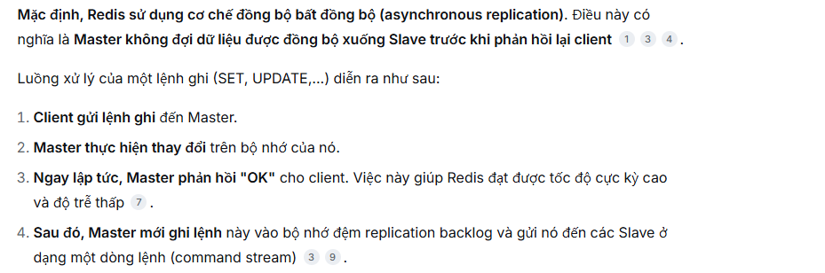
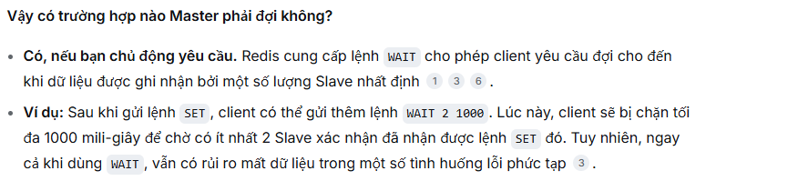
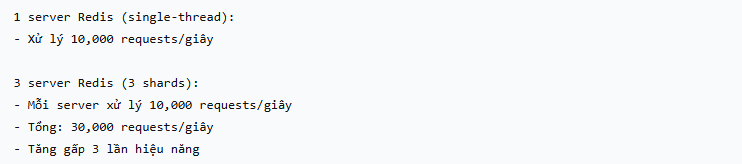

# Redis

## Tài liệu tham khảo

- [What's new? | Docs](https://redis.io/docs/latest/develop/whats-new/)
- <https://redis.io/docs/latest/develop/data-types/>
- <https://redis.io/docs/latest/operate/oss_and_stack/management/persistence/>
- <https://redis.io/docs/latest/develop/data-types/json/>
- <https://redis.io/docs/latest/operate/oss_and_stack/stack-with-enterprise/search/>
- <https://redis.io/docs/latest/develop/clients/jedis/vecsearch/>
- <https://redis.io/docs/latest/operate/oss_and_stack/management/optimization/latency/>
- <https://redis.io/docs/latest/operate/oss_and_stack/management/optimization/latency-monitor/>
- <https://redis.io/docs/latest/develop/using-commands/pipelining/>
- <https://redis.io/docs/latest/develop/using-commands/transactions/>
- <https://redis.io/docs/latest/commands/>
- <https://redis.io/docs/latest/integrate/redis-data-integration/>
- <https://redis.io/technology/redis-enterprise-cluster-architecture/>
- <https://blog.bytebytego.com/p/a-crash-course-in-redis>

## Redis Overview

🙂 Redis (REmote DIctionary Server) là một **in-memory data structure store/server** hiệu suất cao. Nói ngắn gọn, Redis lưu dữ liệu theo dạng `key -> value`, nhưng value không chỉ là string đơn giản mà có thể là nhiều cấu trúc dữ liệu khác nhau như `String`, `Hash`, `List`, `Set`, `Sorted Set`, `Stream`, `JSON`, `Time series`, `Vector set`,... Vì vậy Redis thường được dùng như **cache**, **database**, **message broker**, **stream/event engine**, **search engine**, hoặc **vector database** tùy theo use case.

Nguồn chuẩn để đối chiếu: Redis docs mô tả Redis là một **data structure server**, hỗ trợ nhiều data types cho các bài toán từ caching, queuing đến event processing; Redis cũng có cơ chế persistence xuống disk bằng RDB/AOF nếu cần lưu dữ liệu bền vững.

### 1. In-memory database

**In-memory database** nghĩa là Redis ưu tiên lưu và xử lý dữ liệu trong RAM, nên thao tác đọc/ghi thường có độ trễ rất thấp. Tuy nhiên, vì RAM là volatile memory, nếu muốn dữ liệu không mất khi restart/crash thì cần bật persistence. Redis hỗ trợ nhiều lựa chọn persistence:

- **RDB**: snapshot dataset tại một thời điểm theo interval cấu hình.
- **AOF**: append lại các write command vào log để replay khi restart.
- **No persistence**: tắt persistence, thường hợp với cache thuần.
- **RDB + AOF**: kết hợp cả snapshot và append-only log.

Ví dụ thực tế:

- Cache profile user: `user:1001 -> JSON/string/hash profile`, đặt TTL 10 phút để giảm query xuống MySQL/PostgreSQL.
- Cache access token/session: `session:{token} -> userId`, TTL theo thời gian sống của session.
- Lưu counter realtime: `INCR product:123:view_count` để tăng view count nhanh, sau đó batch sync về database chính.

```redis
SET user:1001:name "Tony" EX 600
GET user:1001:name

INCR product:123:view_count
```

### 2. Data structure store

**Data structure store** là điểm làm Redis khác cache key-value đơn giản. Redis không chỉ lưu blob text, mà cung cấp command tối ưu cho từng cấu trúc dữ liệu. Nhờ đó, nhiều thao tác có thể làm trực tiếp ở Redis thay vì kéo toàn bộ data về application rồi tự xử lý.

Một số ví dụ thực tế và vì sao nên dùng:

| Data type | Dùng khi nào | Vì sao hợp |
| --- | --- | --- |
| **String** | Cache HTML/API response, token, counter, feature flag | Value là một chuỗi/bytes đơn giản, thao tác `GET/SET` rất nhanh. Nếu value là số, Redis hỗ trợ tăng/giảm atomic bằng `INCR`, `DECR`, `INCRBY`. |
| **Hash** | Object phẳng như user profile, cart summary, product stock | Mỗi key Redis chứa nhiều field-value nhỏ. Khi cần sửa `city` hoặc `stock`, ta sửa đúng field đó bằng `HSET`, không cần đọc và ghi lại toàn bộ object. |
| **List** | Queue đơn giản, timeline theo thứ tự insert | List giữ thứ tự phần tử. Có thể push/pop hai đầu danh sách, phù hợp hàng đợi đơn giản hoặc danh sách sự kiện gần nhất. |
| **Set** | Danh sách unique như user đã like bài viết, user online, blacklist token | Set tự đảm bảo không trùng phần tử. Kiểm tra một phần tử có tồn tại không bằng `SISMEMBER`, phù hợp các bài toán membership. |
| **Sorted Set** | Leaderboard, ranking, feed score, delayed job theo timestamp | Mỗi member có một score. Redis tự giữ thứ tự theo score, nên lấy top N hoặc range theo điểm/thời gian rất tiện. |
| **Stream** | Event log, message stream, consumer group | Stream giống append-only log cho event. Hợp khi nhiều consumer cần đọc event theo thứ tự và có tracking đã xử lý tới đâu. |

Tư duy chọn nhanh:

- Nếu chỉ cần `key -> value` đơn giản: dùng `String`.
- Nếu value là object phẳng và hay sửa từng field: dùng `Hash`.
- Nếu cần danh sách có thứ tự insert và push/pop: dùng `List`.
- Nếu cần tập phần tử không trùng và check tồn tại nhanh: dùng `Set`.
- Nếu cần sắp xếp theo điểm, rank, timestamp: dùng `Sorted Set`.
- Nếu dữ liệu là dòng event cần consumer xử lý: dùng `Stream`.

```redis
HSET user:1001 name "Tony" age 25 city "HCM"
HGET user:1001 name

SADD post:99:liked_users 1001 1002 1003
SISMEMBER post:99:liked_users 1001

ZADD leaderboard 9500 user:1001 8700 user:1002
ZREVRANGE leaderboard 0 9 WITHSCORES
```

Giải thích ví dụ:

- `HSET user:1001 name "Tony" age 25 city "HCM"`: tạo một Hash đại diện cho user `1001`, gồm các field `name`, `age`, `city`.
- `HGET user:1001 name`: lấy riêng field `name`, không cần lấy toàn bộ object user.
- `SADD post:99:liked_users 1001 1002 1003`: thêm các user đã like post `99` vào Set. Nếu thêm lại `1001`, Redis không tạo bản ghi trùng.
- `SISMEMBER post:99:liked_users 1001`: kiểm tra user `1001` đã like post `99` chưa.
- `ZADD leaderboard 9500 user:1001 8700 user:1002`: thêm user vào leaderboard, mỗi user có score riêng.
- `ZREVRANGE leaderboard 0 9 WITHSCORES`: lấy top 10 user có score cao nhất kèm điểm.

Điểm quan trọng ở đây là Redis không bắt application phải tự xử lý mọi thứ. Ví dụ nếu lưu danh sách user like bằng một JSON string, app phải `GET`, parse JSON, kiểm tra trùng, thêm user, serialize rồi `SET` lại. Với `Set`, Redis làm đúng bài toán membership bằng command chuyên dụng.

> Lưu ý chỉnh lại so với ghi chú cũ: `Integer` không nên xem là một data type riêng độc lập trong Redis. Redis `String` có thể chứa số và dùng các command như `INCR`, `DECR`, `INCRBY` để thao tác atomic. `Linked List` cũng không nên viết như data type public; ở góc nhìn Redis command/API thì data type là `List`.

### 3. Document database / JSON field query

Redis có hỗ trợ **JSON** như một Redis data type: có thể `JSON.SET`, `JSON.GET`, cập nhật theo path, thao tác trên field/array/object bên trong document. Khi kết hợp với Redis Search/Query, JSON document có thể được **index** và query theo field text, numeric, tag, geo, full-text, fuzzy, vector,...

Vì vậy có thể hiểu Redis có khả năng làm **document-style database** cho các use case cần JSON linh hoạt và latency thấp. Tuy nhiên nên nói chính xác là: Redis hỗ trợ lưu/query JSON document thông qua RedisJSON + Redis Search/Query, chứ không nên hiểu Redis mặc định giống MongoDB ở mọi khía cạnh như query planner, transaction model, storage model, hoặc workload tối ưu.

Ví dụ thực tế: lưu product catalog dạng JSON và index các field hay query.

```redis
JSON.SET product:1001 $ '{
  "name": "iPhone 15",
  "brand": "Apple",
  "price": 19990000,
  "category": "phone",
  "stock": 42
}'

JSON.GET product:1001 $.price
JSON.NUMINCRBY product:1001 $.stock -1
```

Để query nhanh theo field như `brand`, `price`, `category`, ta cần tạo index cho các field đó bằng Redis Search/Query. Nếu không có index, Redis vẫn có thể lấy document theo key rất nhanh, nhưng không tự nhiên query field giống SQL/document DB.


### 4. String vs Hash vs JSON khi lưu object

Trong Redis, dùng `String`, `Hash`, hoặc `JSON` để lưu object đều được, nhưng nên chọn theo cách mình cần đọc/ghi:

| Cách lưu | Khi nào hợp | Điểm cần chú ý |
| --- | --- | --- |
| `String` chứa JSON serialized | Object nhỏ, thường đọc/ghi nguyên khối, làm cache response/API payload | Muốn sửa 1 field thường phải deserialize -> sửa -> serialize -> ghi đè toàn bộ |
| `Hash` | Object phẳng, field ít nested, cần đọc/sửa từng field nhanh | Không tự nhiên cho object nested sâu |
| `JSON` | Object nested, array, schema linh hoạt, cần update/query theo path | Muốn query theo field nhanh thì nên kết hợp index |

Ví dụ:

```redis
# String: cache nguyên response
SET cache:user:1001 '{"id":1001,"name":"Tony","city":"HCM"}' EX 600

# Hash: sửa field riêng lẻ
HSET user:1001 id 1001 name "Tony" city "HCM"
HSET user:1001 city "Da Nang"

# JSON: object nested
JSON.SET order:9001 $ '{
  "id": 9001,
  "customer": {"id": 1001, "name": "Tony"},
  "items": [{"sku": "A01", "qty": 2}]
}'
JSON.GET order:9001 $.customer.name
```

### 5. Vector database

**Vector database**: Redis có khả năng lưu trữ và tìm kiếm vector embeddings. Embedding là mảng số biểu diễn ý nghĩa của text, hình ảnh, audio,... Redis Search có thể index vector field trong Hash hoặc JSON object; khoảng cách giữa hai vector thể hiện mức độ giống nhau về mặt ngữ nghĩa.

Ví dụ thực tế:

- Semantic search: user search "điện thoại chụp ảnh đẹp", hệ thống tìm product description gần nghĩa nhất.
- RAG chatbot: lưu embedding của document chunks vào Redis, khi user hỏi thì tìm các chunk liên quan nhất để đưa vào context.
- Recommendation: tìm item/user có vector gần nhau để gợi ý sản phẩm/nội dung.

```redis
# Pseudo flow:
# 1. App tạo embedding từ text bằng model AI.
# 2. Lưu embedding vào Redis Hash/JSON.
# 3. Tạo vector index bằng FT.CREATE.
# 4. Query top K vector gần nhất bằng FT.SEARCH.
```

### Đánh giá lại ghi chú cũ

- Đúng: Redis là NoSQL, key-value oriented, thường dùng làm cache/message broker/database/stream engine; dữ liệu chủ yếu xử lý trong RAM; có persistence để phục hồi sau restart.
- Cần sửa: Redis không chỉ là key-value string store mà là data structure store. Không nên liệt kê `Integer` như data type riêng; nên dùng `String` + atomic numeric commands. Không nên viết `Linked List` như data type public; nên viết `List`.
- Cần nói cẩn trọng hơn: Redis có thể đóng vai trò document-style database khi dùng JSON + Search/Query, nhưng không nên nói "giống MongoDB" theo nghĩa thay thế hoàn toàn. Cách chuẩn hơn là: Redis hỗ trợ lưu JSON, cập nhật bằng JSONPath, index/query JSON document, và phù hợp khi cần latency thấp.

## 😀 Use case

- Thường được sử dụng để đặt trước main database (MySQL, PostgreSQL,...) để cải thiện hiệu năng của hệ thống do Redis dùng RAM nên nhanh hơn + giảm số lượng truy vấn tối đa xuống main database.
- Sử dụng làm rate limit.
- Sử dụng làm distributed lock.
- Sử dụng làm blacklist.

## Why is Redis fast?


Redis nhanh vì nhiều yếu tố cộng lại, không phải chỉ vì “dùng RAM”. Nói chuẩn hơn: Redis tối ưu cho các thao tác dữ liệu nhỏ, command đơn giản, data structure phù hợp, event loop ít overhead, và giảm chi phí network round-trip khi dùng đúng cách.

### 1. Dữ liệu chủ yếu nằm trong RAM

Redis ưu tiên xử lý dữ liệu trong memory. So với database chính phải đọc page từ disk, kiểm tra buffer pool, xử lý storage engine,... Redis thường truy cập trực tiếp dữ liệu đang nằm trong RAM nên latency rất thấp.

Ví dụ:

```redis
GET user:1001:name
```

Với cache hit, Redis chỉ cần tìm key trong memory rồi trả value. Nếu không có Redis, application có thể phải query DB:

```sql
SELECT name FROM users WHERE id = 1001;
```

Query DB vẫn có thể nhanh nếu index tốt và data nằm trong cache của DB, nhưng nó thường phải đi qua nhiều tầng hơn: SQL parser, optimizer, executor, storage engine, lock/MVCC, network, connection pool,... Redis thì command đơn giản hơn nhiều.

### 2. Key-value lookup thường rất nhanh

Redis lookup key bằng cấu trúc hash table nội bộ, nên các command như `GET` thường có time complexity `O(1)`. Điều này nghĩa là Redis không scan toàn bộ dữ liệu để tìm `user:1001:name`; nó tính hash của key rồi tìm vị trí tương ứng.

```redis
SET user:1001:name "Tony"
GET user:1001:name
```

Vì sao nhanh:

- Không cần parse SQL phức tạp.
- Không cần join nhiều bảng.
- Không cần query planner chọn execution plan.
- Không phải đọc record theo nhiều tầng index/table như RDBMS.

Lưu ý: `O(1)` không có nghĩa là “luôn nhanh tuyệt đối”. Nếu value quá lớn, network chậm, key bị hot, hoặc server thiếu RAM thì latency vẫn tăng.

### 3. Command được thiết kế theo data structure

Redis nhanh vì mỗi data type có command chuyên dụng. Thay vì lấy cả object/list về app rồi tự xử lý, ta đẩy đúng thao tác xuống Redis.

Ví dụ `Hash`:

```redis
HSET user:1001 name "Tony" age 25 city "HCM"
HGET user:1001 city
```

Redis lấy đúng field `city`, không cần trả toàn bộ object user.

Ví dụ `Sorted Set`:

```redis
ZADD leaderboard 9500 user:1001 8700 user:1002
ZREVRANGE leaderboard 0 9 WITHSCORES
```

Redis giữ thứ tự theo score, nên bài toán leaderboard không cần app tự sort toàn bộ danh sách user. Tuy nhiên không phải command nào cũng `O(1)`: `GET`, `HGET` thường `O(1)`, `LPUSH` thường `O(1)`, còn `ZADD` là `O(log N)` vì phải duy trì thứ tự trong sorted set. Vẫn nhanh vì Redis chọn cấu trúc dữ liệu phù hợp cho từng command.

### 4. Redis xử lý command chủ yếu bằng một event loop

Redis thường được mô tả là **mostly single-threaded** ở góc nhìn **command execution**: một Redis process dùng event loop để nhận request từ nhiều client, rồi xử lý command trên main thread theo thứ tự. Redis docs gọi kỹ thuật này là **multiplexing**: nhiều connection cùng được phục vụ bởi một event loop, nhưng tại một thời điểm Redis chỉ execute một command trên shared data.

Điểm quan trọng: Redis không nhanh vì “một thread luôn nhanh hơn nhiều thread”. Redis nhanh vì workload của Redis thường là command nhỏ, chạy rất ngắn, thao tác trên memory, và không cần nhiều lock phức tạp quanh shared data.

#### Vì sao single event loop lại giúp Redis nhanh?

- **Ít lock hơn**: nếu nhiều worker thread cùng sửa shared data, hệ thống phải dùng lock/mutex để tránh race condition. Lock làm code phức tạp hơn và có overhead. Redis execute command tuần tự trên main thread nên tránh được phần lớn overhead này.
- **Atomic ở mức command**: một command đang chạy thì command khác không chen vào giữa được. Vì vậy các command như `INCR`, `HSET`, `LPUSH` có tính atomic tự nhiên ở mức một command.
- **Predictable hơn**: vì request được xử lý tuần tự, ta dễ lý luận thứ tự thay đổi dữ liệu hơn so với nhiều thread cùng ghi.
- **Không block trên socket I/O theo kiểu đơn giản**: Redis được thiết kế quanh event loop/non-blocking I/O, nên một client chậm không nên làm Redis đứng chờ socket theo cách blocking thông thường.

Ví dụ counter:

```redis
INCR product:123:view_count
```

Nếu 100 request cùng `INCR product:123:view_count`, Redis xếp chúng vào event loop và execute lần lượt:

```text
view_count = 0
request 1: INCR -> 1
request 2: INCR -> 2
request 3: INCR -> 3
...
request 100: INCR -> 100
```

Kết quả counter tăng đúng 100 lần mà application không cần tự dùng distributed lock cho thao tác cộng đơn giản này.

Nếu làm ở application theo kiểu đọc rồi ghi:

```text
App A đọc view_count = 10
App B đọc view_count = 10
App A ghi 11
App B ghi 11
```

thì có thể mất update nếu không có lock/transaction. Còn `INCR` là một command atomic trong Redis, nên Redis tự đảm bảo mỗi lần tăng được áp dụng tuần tự.

#### Nhưng single event loop cũng là con dao hai lưỡi

Vì Redis xử lý command tuần tự, nếu một command chạy lâu thì các request khác phải chờ. Redis docs nhấn mạnh đây là hệ quả trực tiếp của single-threaded command execution.

Ví dụ nguy hiểm:

```redis
KEYS *
```

`KEYS *` scan toàn bộ keyspace, nếu production có hàng triệu key thì command này có thể block Redis trong thời gian đáng kể. Trong lúc đó, các command nhanh như sau cũng phải xếp hàng chờ:

```redis
GET user:1001:name
INCR product:123:view_count
SET session:abc user:1001 EX 1800
```

Cách đúng hơn là dùng `SCAN`, vì `SCAN` duyệt keyspace theo từng batch nhỏ:

```redis
SCAN 0 MATCH user:* COUNT 100
```

Tương tự, các command xử lý collection lớn như `SORT`, `SUNION` trên set rất lớn, `LREM` trên list lớn, hoặc Lua script chạy lâu đều có thể làm latency tăng vì chúng giữ event loop bận.

Ví dụ transaction/Lua cũng cần cẩn thận:

```redis
MULTI
SINTER huge:set:1 huge:set:2
ZREMRANGEBYSCORE huge:zset 0 100000
EXEC
```

Các command trong transaction được execute tuần tự khi `EXEC`, và request khác không chen vào giữa transaction đó. Đây là tính isolation tốt, nhưng nếu gom các command nặng vào một transaction thì main event loop cũng bị giữ lâu hơn.

#### Ví dụ thực tế: vì sao app thỉnh thoảng bị spike latency?

Giả sử bình thường API login dùng Redis để check session:

```redis
GET session:token:abc
```

Command này rất nhanh. Nhưng cùng lúc có một job admin chạy:

```redis
KEYS session:*
```

Nếu Redis có rất nhiều session key, `KEYS` có thể chiếm main thread. API login không chậm vì `GET` chậm, mà chậm vì `GET` phải chờ command trước đó chạy xong. Đây là kiểu latency spike rất phổ biến khi dùng Redis sai command trong production.

#### Redis có thật sự chỉ có một thread không?

Không nên hiểu máy móc là Redis “chỉ có đúng một thread cho mọi thứ”. Câu chuẩn hơn là:

> Redis chủ yếu dùng một main thread để execute command trên dữ liệu Redis, nhưng Redis vẫn có thể dùng thêm thread/process khác cho một số việc nền như network I/O, disk I/O, lazy free, AOF fsync, RDB/AOF rewrite.

Tách ra 3 phần sẽ dễ hiểu hơn:

| Thành phần | Có thể multi-thread/process không? | Làm nhiệm vụ gì |
| --- | --- | --- |
| **Main thread / event loop** | Chủ yếu 1 thread | Nhận event từ client, parse command, execute command trên dữ liệu Redis, trả response. Đây là phần quyết định tính tuần tự/atomic của Redis command. |
| **Background thread** | Có | Làm một số việc nền như lazy freeing, AOF fsync, một số I/O tùy version/config. Mục tiêu là giảm việc nặng khỏi main event loop. |
| **Background child process** | Có | `BGSAVE`, `BGREWRITEAOF` thường fork child process để ghi RDB hoặc rewrite AOF, tránh parent process phải trực tiếp ghi toàn bộ dataset xuống disk. |
| **I/O threads từ Redis 6** | Có nếu bật cấu hình | Hỗ trợ đọc/ghi network I/O tốt hơn, nhất là workload nhiều connection/traffic lớn. Nhưng command execution trên dữ liệu vẫn chủ yếu ở main thread. |

##### 1. Main thread là gì?

Main thread là nơi Redis execute command thật sự lên dữ liệu.

Ví dụ:

```redis
SET stock:iphone15 10
INCR product:123:view_count
HSET user:1001 name "Tony" city "HCM"
GET user:1001
```

Các command này khi đến Redis sẽ đi qua event loop và được execute tuần tự. Tại một thời điểm, main thread đang chạy một command thì command khác phải chờ. Chính điều này tạo ra tính atomic ở mức command.

Ví dụ 2 request cùng giảm tồn kho nếu dùng command atomic:

```redis
DECR stock:iphone15
DECR stock:iphone15
```

Redis không chạy 2 command này song song trên cùng dữ liệu. Nó chạy lần lượt:

```text
stock = 10
request A: DECR -> 9
request B: DECR -> 8
```

Không có chuyện cả A và B cùng đọc `10`, rồi cùng ghi `9` như lỗi race condition kiểu read-modify-write ở application.

##### 2. Vì sao không dùng nhiều worker thread để execute command song song?

Nếu Redis cho nhiều thread cùng sửa dữ liệu memory, nó phải giải quyết các bài toán rất khó:

- Thread A đang sửa `stock:iphone15`, thread B cũng sửa `stock:iphone15` thì ai thắng?
- Thread A đang đọc Hash, thread B đang resize/rehash object đó thì có race không?
- Command trên nhiều key như `MSET`, `SUNION`, transaction, Lua script cần lock bao nhiêu key?
- Lock quá nhỏ thì code phức tạp; lock quá lớn thì multi-thread cũng không còn nhiều lợi ích.

Redis chọn hướng khác: execute command rất nhanh trên một main thread, tránh lock phức tạp. Với workload Redis thông thường là command nhỏ và chạy trong memory, cách này cho latency thấp và behavior dễ đoán.

Nhưng trade-off là: nếu một command chạy lâu, nó giữ main thread, command khác phải đợi.

##### 3. Background thread/process làm gì?

Redis vẫn cần làm một số việc nặng ngoài command execution. Ví dụ:

- Ghi dữ liệu xuống disk cho persistence.
- Rewrite AOF để file log nhỏ lại.
- Free object lớn mà không muốn main thread đứng lâu.
- Làm một số thao tác I/O nền.

Ví dụ `BGSAVE`:

```redis
BGSAVE
```

`BGSAVE` tạo snapshot RDB. Redis parent process fork ra child process; child process ghi RDB xuống disk, parent process tiếp tục phục vụ client. Nhờ đó, Redis không cần dừng toàn bộ request để ghi dataset ra file.

Nhưng `fork` vẫn có chi phí. Với dataset rất lớn, lúc fork có thể gây latency spike. Vì vậy production Redis lớn cần theo dõi các chỉ số như `latest_fork_usec`.

Kiểm tra bằng:

```redis
INFO persistence
```

Trong output chú ý các field như:

```text
rdb_bgsave_in_progress
latest_fork_usec
aof_rewrite_in_progress
```

##### 4. Redis 6 I/O threading là gì?

Từ Redis 6, Redis có thể dùng I/O threads để hỗ trợ network read/write. Điều này không có nghĩa là nhiều thread cùng execute command trên dữ liệu. Cách hiểu đúng:

```text
Client sockets/network I/O  -> có thể được hỗ trợ bởi I/O threads
Command execution/data write -> vẫn chủ yếu chạy trên main thread
```

I/O threading hữu ích khi bottleneck nằm ở network I/O: nhiều connection, response lớn, throughput mạng cao. Nhưng nếu bottleneck là command nặng như `KEYS *`, `SORT` collection lớn, Lua script lâu, thì I/O threads không cứu được vì main thread vẫn bị command đó giữ.

##### 5. Cách chạy demo thực tế

Nếu máy có Docker, chạy Redis độc lập:

```powershell
docker run --name redis-thread-demo -p 6379:6379 -d redis:7
```

Mở Redis CLI:

```powershell
docker exec -it redis-thread-demo redis-cli
```

Kiểm tra Redis đang chạy:

```redis
PING
```

Kết quả:

```text
PONG
```

Kiểm tra thông tin server:

```redis
INFO server
```

Bạn sẽ thấy các thông tin kiểu:

```text
redis_version:...
process_id:...
tcp_port:6379
```

Kiểm tra persistence/fork:

```redis
INFO persistence
```

Chạy thử `BGSAVE`:

```redis
BGSAVE
INFO persistence
```

Ý nghĩa: `BGSAVE` yêu cầu Redis tạo snapshot ở background child process. Nếu dataset nhỏ thì rất nhanh, nhưng với dataset lớn thì `fork` có thể gây latency spike.

##### 6. Demo atomic counter

Trong `redis-cli`:

```redis
DEL product:123:view_count
INCR product:123:view_count
INCR product:123:view_count
GET product:123:view_count
```

Kết quả:

```text
(integer) 1
(integer) 2
"2"
```

Nếu muốn bắn nhiều lần:

```powershell
docker exec -it redis-thread-demo redis-cli -r 100 INCR product:123:view_count
```

Sau đó kiểm tra:

```powershell
docker exec -it redis-thread-demo redis-cli GET product:123:view_count
```

Ý nghĩa: dù 100 command được gửi liên tục, Redis vẫn apply từng `INCR` tuần tự, không mất update.

##### 7. Demo command chậm block event loop

Không nên làm trên production. Chỉ demo local.

Tạo nhiều key:

```powershell
1..10000 | ForEach-Object { "SET session:$_ user:$_" } | docker exec -i redis-thread-demo redis-cli --pipe
```

Lệnh trên tạo 10.000 key dạng:

```text
session:1
session:2
...
session:10000
```

Với dataset nhỏ thì `KEYS session:*` chưa thấy chậm:

```redis
KEYS session:*
```

Nhưng về nguyên lý, `KEYS` phải quét toàn bộ keyspace. Nếu có hàng triệu key, main thread bận scan, các request khác phải chờ. Cách production nên dùng:

```redis
SCAN 0 MATCH session:* COUNT 100
```

`SCAN` trả từng batch nhỏ, giảm khả năng block event loop lâu.

Muốn thấy rõ hơn việc một command lâu giữ event loop, mở **2 terminal**.

Terminal 1 chạy Lua script cố tình lâu:

```powershell
docker exec -it redis-thread-demo redis-cli EVAL "local x=0; for i=1,100000000 do x=x+i end; return x" 0
```

Trong lúc terminal 1 đang chạy, terminal 2 thử gọi:

```powershell
docker exec -it redis-thread-demo redis-cli PING
```

Nếu script ở terminal 1 chưa xong, `PING` ở terminal 2 có thể phải chờ. Đây chính là ý “Redis execute command tuần tự trên main event loop”: `PING` vốn rất nhanh, nhưng vẫn phải đợi command trước đó nhả main thread.

> Chỉ chạy demo Lua này ở local. Trong production, Lua script dài hoặc command `O(N)` trên dữ liệu lớn là nguồn gây latency spike rất khó chịu.

##### 8. Demo Slow Log

Cấu hình log command chạy quá 1 microsecond để dễ thấy trong local demo:

```redis
CONFIG SET slowlog-log-slower-than 1
CONFIG SET slowlog-max-len 128
```

Chạy vài command:

```redis
SET a 1
GET a
KEYS *
```

Xem slow log:

```redis
SLOWLOG GET 10
```

Trong production không nên set threshold quá thấp như vậy vì log sẽ nhiễu. Thường dùng threshold lớn hơn, ví dụ vài ms hoặc theo latency SLO của hệ thống.

##### 9. Cleanup demo

Thoát CLI:

```redis
exit
```

Xóa container:

```powershell
docker rm -f redis-thread-demo
```

Tóm lại:

- Redis execute command trên dữ liệu chủ yếu bằng main thread, nên command atomic và ít lock overhead.
- Redis vẫn có background thread/process cho việc nền.
- Redis 6 I/O threading hỗ trợ network read/write, không biến Redis thành multi-threaded data execution engine.
- Muốn Redis nhanh ổn định thì tránh command nặng block event loop, kiểm tra command complexity, dùng `SCAN` thay `KEYS`, dùng slow log/latency monitor để bắt spike.

#### Khi nào cần cẩn thận?

- Command complexity là `O(N)` hoặc tệ hơn trên collection lớn.
- Key/value quá lớn, ví dụ một key chứa JSON/string vài MB.
- Lua script hoặc transaction gom quá nhiều việc.
- Dùng `KEYS` trong production.
- RDB/AOF rewrite/fork trên dataset lớn gây latency spike.
- Một hot key bị quá nhiều request cùng đánh vào.

#### Cách quan sát và xử lý

- Kiểm tra độ phức tạp command trong Redis command docs trước khi dùng với collection lớn.
- Dùng `SCAN`, `SSCAN`, `HSCAN`, `ZSCAN` thay cho kiểu scan/block toàn bộ.
- Dùng Redis Slow Log để xem command nào thực thi lâu.
- Dùng latency monitor/`redis-cli --latency` để quan sát latency spike.
- Nếu cần chạy query nặng phục vụ admin/report, cân nhắc chạy trên replica thay vì primary đang phục vụ traffic realtime.

### 5. Network round-trip thường là bottleneck lớn

Redis xử lý nhiều command rất nhanh, đến mức thời gian client gửi request qua network rồi chờ response có thể trở thành phần tốn kém hơn bản thân command. Redis docs gọi chi phí này là **RTT (Round Trip Time)**.

Ví dụ không tối ưu:

```redis
SET k1 v1
SET k2 v2
SET k3 v3
```

Nếu client gửi từng command và chờ từng response, nó phải trả 3 lần RTT.

Cách tốt hơn là dùng command gom nhóm hoặc pipeline:

```redis
MSET k1 v1 k2 v2 k3 v3
```

Hoặc pipeline nhiều command để gửi một batch, giảm số lần đi-về qua network. Đây là lý do cùng một Redis server nhưng app dùng pipeline/MGET/MSET đúng cách có thể nhanh hơn rất nhiều so với app gọi từng command lẻ trong vòng lặp.

### 6. Redis nhanh nhưng vẫn có giới hạn

Các thứ cần quan tâm khi dùng Redis:

- **RAM giới hạn**: Redis lưu dữ liệu trong memory nên dataset lớn sẽ tốn chi phí cao.
- **Network bandwidth**: value lớn hoặc request quá nhiều có thể nghẽn mạng.
- **Hot key**: một key bị truy cập quá nhiều có thể tạo bottleneck.
- **Slow command**: command `O(N)` trên collection lớn có thể làm tăng latency.
- **Persistence/fork**: RDB/AOF rewrite có thể ảnh hưởng tài nguyên nếu dataset lớn.

=> Tóm lại, Redis nhanh vì nó đưa dữ liệu nóng vào RAM, dùng key lookup và command chuyên dụng cho data structure, giảm overhead xử lý query phức tạp, và có mô hình event loop đơn giản. Nhưng muốn nhanh thật trong production thì còn phải thiết kế key, TTL, data size, command complexity, pipeline/batching và memory policy cho đúng.

### Đánh giá lại ghi chú cũ

- Đúng: Redis nhanh vì in-memory, key-value lookup nhanh, data structures tối ưu, command đơn giản, và phần execute command chủ yếu single-thread nên ít overhead lock/context switching.
- Cần sửa: Không nên nói `List` được triển khai dạng `LinkedList` như một kết luận học thuộc. Ở mức Redis API, nên nhớ `List` hỗ trợ push/pop hai đầu nhanh; chi tiết internal encoding có thể thay đổi theo version.
- Cần bổ sung: tốc độ Redis trong thực tế còn phụ thuộc network RTT. Nếu gọi Redis từng command trong loop, app vẫn có thể chậm; nên dùng `MGET/MSET`, command variadic, Lua script hoặc pipeline khi phù hợp.

## Redis mechanism

**Atomic** tức mỗi lệnh của redis không thể chia nhỏ hơn được nữa

- Một phần là Redis sử dụng single thread, nên các câu lệnh gửi lên sẽ được thực thi tuần tự, không xảy ra race condition, giúp đảm bảo consistency data.
- Ví dụ như 100 request tăng 1 đơn vị lên 1 value nằm trong redis thì sẽ tăng đúng 100 đơn vị thực, do 100 request này sẽ thực thi tuần tự -> vừa nhanh, lại còn chả phải sử dụng lock mà vẫn đạt tuần tự.

## Redis persistence

Redis là một in-memory database, nghĩa là dữ liệu nóng được xử lý chủ yếu trong RAM. Nếu Redis chỉ lưu trong RAM, khi process Redis chết hoặc server restart thì dữ liệu có thể mất. **Persistence** là cơ chế Redis ghi dữ liệu xuống durable storage như SSD/HDD để có thể phục hồi sau restart/crash.

Điểm cần hiểu đúng: persistence không phải một lựa chọn “bật là an toàn tuyệt đối”. Nó là trade-off giữa:

- **Durability**: chấp nhận mất bao nhiêu dữ liệu nếu Redis/server crash?
- **Latency**: mỗi write có bị chậm vì phải đợi disk không?
- **Throughput**: hệ thống ghi được bao nhiêu request/giây?
- **Recovery time**: Redis restart và load lại data nhanh hay chậm?
- **Disk size**: file persistence chiếm bao nhiêu dung lượng?

Redis có 4 hướng chính:

| Mode | Cách hoạt động | Hợp khi nào |
| --- | --- | --- |
| **No persistence** | Không ghi data xuống disk | Redis chỉ là cache, mất data có thể rebuild từ DB chính |
| **RDB** | Snapshot dataset theo thời điểm | Backup định kỳ, restart nhanh, chấp nhận mất dữ liệu giữa 2 snapshot |
| **AOF** | Ghi log các write command | Cần durability tốt hơn RDB, chấp nhận file lớn hơn và có thể tốn I/O hơn |
| **RDB + AOF** | Kết hợp snapshot và append log | Production cần cân bằng backup, durability và recovery |

Ví dụ chọn mode theo use case:

- Cache product/user profile đọc từ MySQL: có thể dùng **No persistence** hoặc **RDB nhẹ**, vì mất cache thì rebuild lại được.
- Rate limit/session/token blacklist: tùy nghiệp vụ. Nếu mất vài giây/phút data không nghiêm trọng thì RDB/AOF everysec được; nếu token blacklist rất quan trọng thì cần cân nhắc AOF/DB chính.
- Shopping cart, order draft, inventory reservation: không nên xem Redis persistence là lớp durability duy nhất nếu mất dữ liệu gây hậu quả lớn. Thường cần DB chính hoặc event log bền vững hơn.
- Leaderboard/game state realtime: có thể dùng AOF everysec hoặc RDB + AOF, tùy chấp nhận mất tối đa bao nhiêu update.

### RDB

**RDB** (Redis Database) là cơ chế snapshot: Redis chụp toàn bộ dataset tại một thời điểm và ghi ra file `.rdb`.

Ví dụ config snapshot:

```conf
save 900 1
save 300 10
save 60 10000
```

Ý nghĩa:

- Sau 900 giây nếu có ít nhất 1 key thay đổi thì tạo snapshot.
- Sau 300 giây nếu có ít nhất 10 key thay đổi thì tạo snapshot.
- Sau 60 giây nếu có ít nhất 10000 key thay đổi thì tạo snapshot.

#### RDB chạy như thế nào?

Khi cần snapshot, Redis thường dùng `fork()`:

```text
Redis parent process
  ├─ tiếp tục phục vụ client request
  └─ child process ghi snapshot ra file dump.rdb
```

Parent process vẫn xử lý command cho client, child process ghi dữ liệu xuống disk. Nhờ copy-on-write của OS, child process nhìn thấy dataset tại thời điểm fork, còn parent vẫn có thể nhận write mới.

Chạy thủ công:

```redis
BGSAVE
```

Kiểm tra trạng thái:

```redis
INFO persistence
LASTSAVE
```

Các field đáng chú ý:

```text
rdb_bgsave_in_progress
rdb_last_bgsave_status
latest_fork_usec
```

#### Ưu điểm của RDB

- File `.rdb` nhỏ gọn, phù hợp backup định kỳ.
- Dễ copy sang storage khác như S3/NAS/backup server.
- Redis restart thường nhanh hơn AOF nếu dataset lớn, vì chỉ load snapshot thay vì replay nhiều command.
- Parent process không trực tiếp ghi toàn bộ dataset xuống disk; child process làm phần ghi file.

#### Nhược điểm của RDB

- Có thể mất dữ liệu giữa hai snapshot.
- `fork()` có thể gây latency spike nếu dataset lớn, vì OS phải copy page table/copy-on-write metadata.
- Không phù hợp nếu yêu cầu durability rất cao, ví dụ “không được mất quá vài giây dữ liệu”.

Ví dụ mất dữ liệu:

```text
12:00:00 Redis tạo dump.rdb
12:04:59 app ghi 10.000 order draft mới
12:05:00 server mất điện trước snapshot kế tiếp
```

Khi restart, Redis load lại snapshot 12:00:00. Các write từ 12:00:00 đến 12:04:59 có thể mất.

#### Khi nào dùng RDB?

- Cache có thể rebuild.
- Backup định kỳ.
- Muốn restart nhanh.
- Chấp nhận mất vài phút dữ liệu khi crash.

### AOF

**AOF** (Append Only File) là cơ chế ghi log các write command. Khi Redis restart, Redis replay lại AOF để dựng lại dataset.

Ví dụ:

```redis
SET user:1001:name "Tony"
INCR product:123:view_count
HSET cart:1001 total 199000
```

AOF sẽ ghi lại các command làm thay đổi dataset. Khi restart, Redis đọc AOF và chạy lại các command đó để khôi phục state.

Bật AOF:

```conf
appendonly yes
```

Hoặc bật runtime:

```redis
CONFIG SET appendonly yes
```

> Lưu ý: nếu bật runtime bằng `CONFIG SET`, cần đảm bảo config được persist lại bằng config file hoặc `CONFIG REWRITE` nếu phù hợp. Nếu không, restart có thể quay về config cũ.

#### appendfsync là gì?

Ghi AOF có 2 bước khác nhau:

```text
write vào OS buffer -> fsync xuống disk thật
```

`write` chỉ đưa data vào buffer của OS. `fsync` ép OS flush data xuống disk. Redis cho chọn policy:

| Policy | Config | Mất dữ liệu tối đa khi crash | Hiệu năng |
| --- | --- | --- | --- |
| Fsync mỗi write | `appendfsync always` | Ít nhất trong các lựa chọn AOF | Chậm nhất, latency cao vì phải chờ disk |
| Fsync mỗi giây | `appendfsync everysec` | Thường có thể mất tối đa khoảng 1 giây write | Cân bằng, default/recommended phổ biến |
| Không tự fsync | `appendfsync no` | Phụ thuộc OS flush, có thể mất nhiều hơn | Nhanh nhất, ít an toàn nhất |

Ví dụ config hay gặp:

```conf
appendonly yes
appendfsync everysec
```

Ý nghĩa: Redis append write command vào AOF, và fsync khoảng mỗi giây bằng background thread. Nếu máy mất điện đúng lúc, có thể mất khoảng 1 giây dữ liệu gần nhất, nhưng write performance vẫn cao.

#### Vì sao AOF cần rewrite?

Nếu AOF ghi mọi write command, file sẽ lớn dần:

```redis
SET user:1:name "A"
SET user:1:name "B"
SET user:1:name "C"
SET user:1:name "Tony"
```

Về state cuối cùng, chỉ cần:

```redis
SET user:1:name "Tony"
```

`BGREWRITEAOF` tạo lại AOF nhỏ hơn, chỉ chứa lượng command tối thiểu để dựng state hiện tại.

Chạy thủ công:

```redis
BGREWRITEAOF
```

Kiểm tra:

```redis
INFO persistence
```

Các field đáng chú ý:

```text
aof_enabled
aof_rewrite_in_progress
aof_last_bgrewrite_status
aof_current_size
aof_base_size
```

Redis cũng có thể tự rewrite AOF khi file đủ lớn theo config:

```conf
auto-aof-rewrite-percentage 100
auto-aof-rewrite-min-size 64mb
```

Ý nghĩa phổ biến: khi AOF hiện tại lớn hơn 100% so với size sau lần rewrite gần nhất và ít nhất đạt 64MB, Redis có thể trigger rewrite.

#### Redis 7 multi-part AOF

Từ Redis 7, AOF không nhất thiết chỉ là một file đơn. Redis dùng **multi-part AOF**:

- **base file**: snapshot nền, có thể ở format RDB hoặc AOF.
- **incremental AOF file**: các thay đổi sau base file.
- **manifest file**: theo dõi các file AOF đang hợp lệ.

Ý nghĩa thực tế: rewrite AOF an toàn và hiệu quả hơn so với mô hình AOF đơn cũ, nhưng khi backup AOF thì cần backup đúng cả thư mục AOF/manifest, không chỉ copy bừa một file.

#### Ưu điểm của AOF

- Durability tốt hơn RDB, đặc biệt với `appendfsync everysec` hoặc `always`.
- AOF là append-only log, dễ hiểu hơn về mặt recovery.
- Có thể rewrite để giảm kích thước.
- Nếu lỡ ghi nhiều lần cùng một key, rewrite có thể compact lại command cuối cùng cần thiết.

#### Nhược điểm của AOF

- File thường lớn hơn RDB.
- Restart có thể chậm hơn RDB nếu phải replay nhiều command.
- `appendfsync always` có latency cao vì phải đợi disk thường xuyên.
- AOF rewrite/fork vẫn có thể gây spike với dataset lớn.
- Nếu lưu data nhạy cảm, AOF có thể chứa command/value dạng dễ đọc, cần chú ý quyền file/encryption/backup security.

#### Khi nào dùng AOF?

- Cần giảm tối đa mất dữ liệu so với RDB.
- Chấp nhận tốn disk hơn.
- Chấp nhận latency/IO trade-off.
- Phù hợp production khi Redis giữ dữ liệu quan trọng hơn cache thuần.

### Hybrid persistence

**Hybrid persistence** thường được hiểu là bật cả RDB và AOF để tận dụng ưu điểm của cả hai.

Config ví dụ:

```conf
save 900 1
save 300 10
save 60 10000

appendonly yes
appendfsync everysec
```

Khi cả RDB và AOF cùng tồn tại, Redis docs nói Redis sẽ dùng AOF để reconstruct dataset khi restart vì AOF thường đầy đủ hơn RDB.

Ngoài ra Redis có option:

```conf
aof-use-rdb-preamble yes
```

Ý nghĩa: phần base của AOF rewrite có thể dùng format RDB để load nhanh và compact hơn, sau đó phần AOF incremental replay các write mới hơn. Đây là lý do nhiều tài liệu gọi nó là hybrid AOF.

Flow dễ hình dung:

```text
T0: Redis có dataset hiện tại
T1: AOF rewrite chạy
T2: Redis tạo base snapshot dạng RDB
T3: các write mới tiếp tục ghi vào incremental AOF
Restart: load base RDB trước -> replay incremental AOF sau
```

#### Khi nào dùng RDB + AOF?

- Muốn backup định kỳ bằng RDB.
- Muốn durability tốt hơn bằng AOF.
- Muốn restart không quá chậm nhờ base snapshot.
- Production Redis có dữ liệu tương đối quan trọng.

Tuy nhiên nếu nghiệp vụ là banking/order/payment, không nên chỉ dựa vào Redis persistence như nguồn dữ liệu duy nhất. Redis có thể rất bền nếu config đúng, nhưng database giao dịch/event log vẫn là nơi phù hợp hơn cho source of truth.

### So sánh nhanh RDB vs AOF

| Tiêu chí | RDB | AOF |
| --- | --- | --- |
| Cách lưu | Snapshot theo thời điểm | Append write command |
| Mất dữ liệu khi crash | Có thể mất dữ liệu từ snapshot gần nhất | Tùy `appendfsync`, thường ít hơn RDB |
| File size | Thường nhỏ hơn | Thường lớn hơn |
| Restart | Thường nhanh hơn | Có thể chậm hơn vì replay log |
| Backup | Rất hợp backup định kỳ | Backup được, Redis 7 cần chú ý multi-part AOF |
| Latency runtime | Ít ảnh hưởng thường xuyên, nhưng fork có thể spike | Tùy fsync policy, rewrite/fork có thể spike |
| Use case | Cache, backup, disaster recovery | Durability tốt hơn, dữ liệu quan trọng hơn cache |

### Demo thực tế với Docker

#### 1. Chạy Redis không persistence

```powershell
docker run --name redis-no-persist -p 6380:6379 -d redis:7 redis-server --save "" --appendonly no
docker exec -it redis-no-persist redis-cli SET demo:key "hello"
docker exec -it redis-no-persist redis-cli GET demo:key
docker restart redis-no-persist
docker exec -it redis-no-persist redis-cli GET demo:key
```

Kỳ vọng: sau restart, key có thể mất vì không có persistence.

Cleanup:

```powershell
docker rm -f redis-no-persist
```

#### 2. Chạy Redis với RDB

```powershell
docker volume create redis-rdb-data
docker run --name redis-rdb -p 6381:6379 -v redis-rdb-data:/data -d redis:7 redis-server --save 60 1 --appendonly no
docker exec -it redis-rdb redis-cli SET demo:key "rdb-value"
docker exec -it redis-rdb redis-cli BGSAVE
Start-Sleep -Seconds 1
docker exec -it redis-rdb redis-cli LASTSAVE
docker restart redis-rdb
docker exec -it redis-rdb redis-cli GET demo:key
```

Kỳ vọng: key còn vì `BGSAVE` đã tạo snapshot xuống `/data/dump.rdb`.

Kiểm tra:

```powershell
docker exec -it redis-rdb redis-cli INFO persistence
```

Cleanup:

```powershell
docker rm -f redis-rdb
docker volume rm redis-rdb-data
```

#### 3. Chạy Redis với AOF everysec

```powershell
docker volume create redis-aof-data
docker run --name redis-aof -p 6382:6379 -v redis-aof-data:/data -d redis:7 redis-server --appendonly yes --appendfsync everysec
docker exec -it redis-aof redis-cli SET demo:key "aof-value"
Start-Sleep -Seconds 2
docker restart redis-aof
docker exec -it redis-aof redis-cli GET demo:key
```

Kỳ vọng: key còn vì command `SET` đã được append vào AOF và fsync theo policy everysec.

Kiểm tra AOF:

```powershell
docker exec -it redis-aof redis-cli INFO persistence
docker exec -it redis-aof redis-cli BGREWRITEAOF
docker exec -it redis-aof redis-cli INFO persistence
```

Cleanup:

```powershell
docker rm -f redis-aof
docker volume rm redis-aof-data
```

### Gợi ý chọn persistence

- Redis chỉ là cache trước database chính: có thể **no persistence** hoặc **RDB**.
- Cần backup định kỳ và restart nhanh: **RDB**.
- Cần giảm mất dữ liệu xuống khoảng vài giây: **AOF everysec**.
- Cực kỳ nhạy cảm với mất dữ liệu: cân nhắc **AOF always**, nhưng phải chấp nhận latency cao; thường nên dùng DB giao dịch làm source of truth.
- Production phổ biến: **RDB + AOF everysec**, theo dõi `INFO persistence`, backup định kỳ, test restore thật.

### Đánh giá lại ghi chú cũ

- Đúng: Redis có RDB, AOF và có thể kết hợp cả hai; RDB dùng fork child process; AOF replay command khi restart; AOF rewrite giúp compact file.
- Cần sửa: Không nên viết “đảm bảo dữ liệu không bị mất” theo nghĩa tuyệt đối. RDB có thể mất dữ liệu giữa các snapshot; AOF `everysec` vẫn có thể mất khoảng 1 giây; `always` an toàn hơn nhưng chậm hơn.
- Cần bổ sung: Khi cả RDB và AOF được bật, Redis thường ưu tiên AOF khi restart vì AOF thường đầy đủ hơn. Redis 7 dùng multi-part AOF nên backup AOF cần chú ý cả thư mục/manifest.

## Redis Architecture type

### Redis Standalone

**Redis Standalone** chỉ có 1 node duy nhất trong architecture này


- Dễ tiếp cận, dễ config, deploy, thường dùng trong các dự án nhỏ + Scale đơn giản, không cần thay đổi code mà chỉ cần nâng phần cứng
- Do sử dụng 1 core do chỉ sử dụng 1 single-thread trên toàn bộ hệ thống nên hiệu năng có thể ảnh hưởng nếu số lượng request bùng nổ + giới hạn vật lý do không thể cứ scale up lên mãi được + Single point of failure: do chỉ có 1 instance của Redis nên nếu nó sập thì sẽ không sử dụng được ⇒ cần chuyển sang Redis Sentinel để tránh SPoF và lượng req chia đều cho các node.

### Redis Sentinel


- Bản chất là Master-slave architecture, tránh được vấn đề Single point of failure ở architecture trước: nếu Master node bị fail thì sẽ được chuyển sang dùng Slave node.
- Việc ghi thì buộc phải xảy ra trên Master, sau đó mới đồng bộ trên Slave chứ không ghi trực tiếp trên Slave (việc ghi xuống Slave là async để đảm bảo tốc độ cao dẫn tới có khả năng inconsistency data + tuy nhiên vẫn có thể config sync bằng WAIT)





- Slave giúp tăng tốc việc đọc bằng cách phân phối tải đều trên các node khi đọc thay vì chỉ đọc trên Master.
- Sentinal cung cấp tính năng giám sát các instance của Redis trong Master-slave một cách tự động. (Sentinal đóng vai trò như Service Discovery, Zookeeper,...) Hoạt động bằng cách kiểm tra hoạt động.
- **Failover**: Khi Master gặp sự cố và ngừng hoạt động, hệ thống sẽ trải qua quá trình chuyển đổi dự phòng (failover). Quá trình này có thể được thực hiện thủ công hoặc tự động + trong mô hình Master-Slave thuần túy, nếu Master chết, hệ thống sẽ ngừng nhận lệnh Write. Để xử lý việc này tự động, chúng ta thường dùng Redis Sentinel:
- Phát hiện: Sentinel sẽ liên tục "ping" Master. Nếu Master không trả lời trong một khoảng thời gian, Sentinel sẽ đánh dấu là Master đã chết.
- Bầu cử (Failover): Các Sentinel sẽ biểu quyết và chọn ra một con Slave "khỏe mạnh" nhất để đôn lên làm Master mới.
- Cấu hình lại: Sentinel thông báo địa chỉ Master mới cho các Slave còn lại và cho Client.
- Tuy nhiên lượng RAM sử dụng của Master, Slave là cần giống nhau, và chứa toàn bộ dữ liệu giống nhau ⇒ khi mức độ sử dụng disk/ RAM/ request rất lớn sẽ không đáp ứng được, cần scale sang dạng Redis Cluster để mỗi node giữ lượng data nhất định và lượng request được chia cho từng node.

### Redis Cluster


- Sinh ra để giải quyết vấn đề dùng RAM trên 1 instance của Redis quá lớn (thậm chí 1 máy tính không đủ phần cứng cho 1 instance/ nâng cấp phần cứng đắt đỏ hơn chi phí scale out) + Redis sử dụng single thread nên việc quá nhiều request tại 1 thời điểm cũng có thể gây quá tải.

⇒ sharding 1 Master thành nhiều các Master



- Mỗi Master chứa 1 tập các giá trị thay vì toàn bộ dữ liệu như Redis Sentinel. (nếu lúc trước 1 Master chứa toàn bộ giá trị A, B, C, D,... thì giờ chia thành 4 Master chả hạn, mỗi instance 1 chứa tập giá trị A, instance 2 chứa B,...)
- Ngoài ra mỗi Master sẽ có tập Slave riêng của mình để mỗi khi mà Master die thì Slave cũng sẽ lên thế chỗ (tiếp thu ưu điểm của Sentinal) + chia đều request cho từng node.
- Việc sharding này giúp mở rộng hệ thống Redis Cluster theo chiều ngang 1 cách hiệu quả + việc thêm 1 Master instance sẽ phân phối lại dữ liệu để đảm bảo cân bằng dữ liệu giữa các instance.

### Hash slots concept

**Hash slots concept**: mỗi key-value được lưu trữ vào Redis, thực sự là nó sẽ lưu vào 1 Hash slot.

- Hash slot bản thân là 1 tập các key-value của Redis + mỗi 1 instance sẽ cũng có 1 tập các Hash slot (1 Redis instance = n Hash slot; 1 Hash slot = n key-value)
- Số lượng giá trị trong các Hash slot có thể sẽ khác nhau do tính toán dựa trên thuật toán hash -> dẫn tới số lượng key-value trên các instance có thể khác nhau.
- Số lượng Hash slot của toàn bộ Redis Cluster sẽ là 2^14 = 16384 Hash slot sử dụng để suy ra khi write/ read dữ liệu từ instance nào dựa vào key của dữ liệu.

```text
HASH_SLOT = CRC16(key) mod 16384

(Ví dụ lưu key-value: “key 1” - “value 1”, sử dụng hash slot = 1 tức nó sẽ nằm trên Node A
Tiếp tục lưu key-value trên vào Node A)
```

- Lý do 2^14 không phải ngẫu nhiên vì các phép module với 2^x thì sẽ nhanh hơn nhiều so với chia cho các số khác (chuyển từ phép mod -> AND các bit) -> tăng tốc độ read, write dữ liệu.
- Mỗi khi khởi động Redis Cluster/ thêm, bớt instance, việc chia dữ liệu sẽ xảy ra: số lượng Hash slot trên các instance sẽ giống nhau:


- Bằng cách này, tuy là buộc phải chia lại khi thêm/ bớt instance, nhưng chỉ cần di chuyển các Hash slots thôi thay vì phải hash lại toàn bộ key và tính toán vị trí nó nằm ở instance nào -> rất nhanh (Sau khi thêm Node E, nhận thấy rằng chia lại số lượng Hash slot ở Node A -> thay vì tính lại hash toàn bộ key để chia lại instance thì chỉ cần chuyển tất cả giá trị ở ô 3276 tới 4095 để move sang Node B)
- Việc chia lại này sẽ không lock các request của client.
- Từ Redis version >= 7.0 đã giới thiệu Pub/Sub trên Redis Cluster

## Distributed Lock

**Distributed Lock** (Khóa phân tán) là một cơ chế quản lý truy cập tài nguyên dùng trong hệ thống phân tán (Distributed Systems).

- Trong một ứng dụng chạy trên một server duy nhất, bạn có thể dùng `synchronized` (Java) hoặc `lock` (C#) để ngăn hai thread cùng sửa một biến. Nhưng khi ứng dụng của bạn chạy trên nhiều server khác nhau, các cơ chế lock nội tại đó không còn tác dụng. Distributed Lock ra đời để đảm bảo tại một thời điểm, chỉ có duy nhất một tiến trình (process) trên toàn hệ thống được phép truy cập vào tài nguyên dùng chung.
- Để triển khai Distributed Lock, chúng ta cần một "trọng tài" ở giữa mà tất cả các server đều có thể nhìn thấy. Các "trọng tài" phổ biến nhất là Redis, ZooKeeper, hoặc Database (PostgreSQL/MySQL).

**Quy trình cơ bản:**

- **Acquire** (Lấy khóa): Client gửi yêu cầu tạo một "key" đặc nhất trên bộ lưu trữ chung kèm theo thời gian hết hạn (TTL).
- **Execute** (Thực thi): Nếu tạo thành công (nghĩa là chưa ai giữ khóa), Client thực hiện logic nghiệp vụ.
- **Release** (Giải phóng): Sau khi xong việc, Client xóa "key" đó để người khác có thể vào.

**Usecase**: **Ngăn chặn Double-Spending (Thanh toán trùng):** Đảm bảo một đơn hàng không bị trừ tiền hai lần khi người dùng nhấn nút "Thanh toán" liên tục hoặc do retry mechanism của hệ thống + **Tránh Race Condition trong Inventory:** Khi có chương trình Flash Sale, hàng nghìn request đổ vào cùng lúc. Lock giúp đảm bảo số lượng tồn kho được trừ chính xác, không bị bán quá số lượng (overselling) + **Task Scheduling:** Trong hệ thống có nhiều instance chạy ngầm (Cron job), Distributed Lock giúp đảm bảo chỉ có **một** instance thực thi task gửi email vào lúc 12h đêm, tránh việc khách hàng nhận được 10 email giống hệt nhau + **Data Migration/Cleanup:** Đảm bảo chỉ một tiến trình thực hiện việc dọn dẹp hoặc chuyển đổi dữ liệu tại một thời điểm để tránh xung đột dữ liệu.

**Ưu nhược điểm**: **Tính nhất quán (Consistency):** Đảm bảo an toàn dữ liệu tuyệt đối trong môi trường đa server + **Khả năng mở rộng (Scalability):** Cho phép hệ thống scale-out (tăng số lượng instance) mà vẫn kiểm soát được tính đúng đắn của các thao tác quan trọng + **Điều phối (Coordination):** Giúp các thành phần rời rạc trong microservices hoạt động nhịp nhàng với nhau >< **Hiệu năng (Latency):** Việc phải gọi qua mạng (Network call) tới Redis/ZooKeeper để lấy/nhả lock sẽ làm chậm tốc độ xử lý so với lock nội bộ + **Single Point of Failure:** Nếu hệ thống quản lý lock (như Redis) bị chết, toàn bộ các luồng nghiệp vụ cần lock sẽ bị đình trệ + **Vấn đề Deadlock & Timeout:** Nếu một tiến trình lấy được lock nhưng bị "treo" hoặc crash trước khi nhả lock, tài nguyên có thể bị khóa vĩnh viễn nếu không có cơ chế **TTL (Time-to-Live)** hợp lý + **Độ phức tạp:** Việc triển khai lock "chuẩn" không hề dễ.

### Redlock Redis

**Redlock Redis**: là một thuật toán triển khai khóa phân tán (distributed lock) cho Redis, được đề xuất bởi chính tác giả của Redis là Salvatore Sanfilippo (antirez).

- Nó được thiết kế để giải quyết bài toán: "Làm thế nào để đảm bảo tính an toàn của việc khóa (mutual exclusion) trong môi trường phân tán, nơi có nhiều tiến trình truy cập vào tài nguyên dùng chung và Redis có thể hoạt động trong mô hình cụm (cluster) không đồng bộ?"
- Trong một ứng dụng đơn lẻ, bạn có thể dùng lệnh SETNX (SET if Not eXists) của Redis để tạo khóa >< Trong hệ thống phân tán, nếu chỉ dùng 1 Redis master, sẽ xảy ra Single Point of Failure. Nếu master đó bị crash, khóa sẽ biến mất. Để khắc phục, người ta thường thêm slave (replication). Nhưng replication của Redis là bất đồng bộ. Điều này gây ra lỗi nghiêm trọng: Client A lấy được khóa ở Master → Master bị crash trước khi kịp sao chép dữ liệu khóa sang Slave → Slave được bầu lên làm Master mới → Client B kết nối vào Master mới cũng có thể lấy được khóa cho cùng một tài nguyên (vì Master mới không có thông tin khóa cũ) → có 2 client cùng nghĩ mình đang giữ khóa ⇒ Redlock ra đời để giải quyết lỗ hổng này.

**Nguyên tắc cốt lõi của Redlock là đồng thuận đa số** (Thay vì chỉ dùng 1 Redis instance, Redlock giả định chúng ta có một cụm N Redis masters độc lập (thường khuyến nghị N là 5). Quan trọng là các instance này hoàn toàn độc lập, không có replication hay bất kỳ cơ chế đồng bộ ngầm nào giữa chúng.)

- Để được coi là "giữ khóa" thành công, Client phải ghi thành công khóa vào đa số các instance (ít nhất là N/2 + 1 instance). Ví dụ với 5 server, cần thành công ít nhất 3 server.
- Lấy thời gian hiện tại: Client ghi lại thời gian bắt đầu (T1) tính bằng mili giây + lần lượt lấy khóa: Client gửi lệnh SET khóa tới tuần tự N instance + thời gian timeout cho mỗi lần kết nối nhỏ hơn nhiều so với thời gian sống của khóa (TTL). Ví dụ khóa sống 10 giây, thì timeout chỉ nên tầm 5-50ms. Mục đích là để nếu một Redis bị chết, client không bị treo quá lâu mà bỏ qua nhanh để chuyển sang instance khác.
- Tính "thời gian trôi qua": Sau khi nhận được phản hồi từ tất cả (hoặc hết thời gian chờ), client tính tổng thời gian đã dùng để thực hiện bước 2 (gọi là elapsed = now - T1).
- Kiểm tra điều kiện thành công: Client coi như đã lấy được khóa khi và chỉ khi nó nhận được thành công từ ít nhất (N/2 + 1) instance (với N=5 thì tối thiểu là 3) và tổng thời gian trôi qua (elapsed) phải nhỏ hơn thời gian sống của khóa (TTL).
- Tính thời gian hiệu lực còn lại: Nếu thành công, thời gian thực sự mà client có thể sử dụng tài nguyên là: TTL - elapsed. Ví dụ: SET TTL là 10 giây, nhưng client mất 2 giây để ghi vào 3 cái Redis, vậy client chỉ còn được dùng tài nguyên trong 8 giây.
- Xử lý thất bại: Nếu không thỏa mãn đa số (ví dụ chỉ ghi được 2 server) hoặc thời gian trôi qua vượt quá TTL, client phải hủy khóa (rollback) bằng cách gửi lệnh giải phóng khóa (thường là script Lua xóa key) tới tất cả các instance (kể cả những cái đã ghi thành công). Điều này để tránh tình trạng rác (orphan lock).
