# 1. Scale From Zero to Millions of Users

> Tài liệu học tập mở rộng từ Chương 1 của *System Design Interview: An Insider's Guide* - Alex Xu. Nội dung được viết lại theo cách dễ tiếp cận với người mới, đồng thời bổ sung các vấn đề thường gặp trong production, cách xử lý, giới hạn và đánh đổi của từng giải pháp.

## 1.1. Chương này giúp chúng ta giải quyết vấn đề gì?

Một ứng dụng có vài trăm người dùng và một ứng dụng có hàng triệu người dùng không nhất thiết phải khác nhau hoàn toàn về chức năng, nhưng chúng khác nhau rất nhiều về cách phân bổ tài nguyên, cách lưu dữ liệu và cách phản ứng khi một thành phần bị lỗi. Khi lượng truy cập còn nhỏ, một server có thể xử lý cả HTTP request, business logic và database. Khi traffic tăng, cách tổ chức này dần xuất hiện bottleneck: CPU không đủ, database hết connection, file tĩnh chiếm bandwidth, request dài chặn request ngắn hoặc một lần deploy làm toàn bộ dịch vụ ngừng hoạt động.

Mục tiêu của chương không phải đưa ra một kiến trúc lớn rồi yêu cầu mọi ứng dụng áp dụng nguyên mẫu. Mục tiêu là học cách thay đổi hệ thống từng bước dựa trên vấn đề đã đo được. Mỗi thành phần mới như load balancer, cache, CDN, replica, queue hoặc shard đều phải trả lời ba câu hỏi:

1. Thành phần này đang giải quyết bottleneck hoặc failure mode nào?
2. Sau khi thêm thành phần, hệ thống xuất hiện vấn đề mới nào?
3. Lợi ích nhận được có xứng đáng với chi phí và độ phức tạp tăng thêm hay không?

Sau khi học xong chương này, bạn cần có khả năng nhìn vào một kiến trúc và giải thích được đường đi của request, nơi dữ liệu được lưu, điều xảy ra khi một node hỏng và bước mở rộng tiếp theo nên được thực hiện ở đâu. Bạn không cần nhớ tên tất cả sản phẩm cloud, nhưng phải hiểu rõ vai trò và giới hạn của từng nhóm thành phần.

## 1.2. Nguyên tắc chung: scale dựa trên số liệu, không dựa trên cảm giác

Số lượng user đăng ký không nói chính xác hệ thống đang chịu bao nhiêu tải. Một triệu tài khoản nhưng chỉ có mười nghìn người hoạt động mỗi ngày có thể nhẹ hơn một hệ thống chỉ có một trăm nghìn tài khoản nhưng mỗi người tạo hàng nghìn request. Vì vậy, trước khi thay đổi kiến trúc, cần thu thập ít nhất các số liệu sau:

- Số người dùng hoạt động hằng ngày và số user truy cập đồng thời.
- Request trung bình mỗi giây, request lúc cao điểm và tỷ lệ đọc/ghi.
- P50, P95 và P99 latency thay vì chỉ nhìn latency trung bình.
- CPU, memory, disk IOPS, network throughput và số database connection.
- Dung lượng dữ liệu tăng mỗi ngày và thời gian phải lưu dữ liệu.
- Error rate, timeout rate và tỷ lệ request phải retry.

Ví dụ, nếu P99 latency cao nhưng CPU của web server vẫn thấp, việc thêm web server có thể không giúp ích. Request có thể đang chờ một query chậm, chờ lấy connection từ pool hoặc chờ external API. Ngược lại, nếu các request độc lập với nhau, CPU web server luôn trên 85% và downstream vẫn còn capacity, scale ngang web tier có thể là bước hợp lý.

Nguyên tắc thực tế là xác định bottleneck, thay đổi đúng một nhóm nguyên nhân, đo lại kết quả rồi mới tiếp tục. Nếu thêm nhiều lớp hạ tầng cùng lúc, đội phát triển khó biết thay đổi nào thực sự có tác dụng và thay đổi nào chỉ làm hệ thống phức tạp hơn.

## 1.3. Giai đoạn đầu: toàn bộ hệ thống chạy trên một server

Khi mới xây dựng MVP, cách đơn giản nhất là chạy web server, application và database trên cùng một máy. DNS trả về IP của máy này; browser hoặc mobile app gửi HTTP request trực tiếp tới server; application xử lý business logic, đọc hoặc ghi database rồi trả HTML hoặc JSON về client.

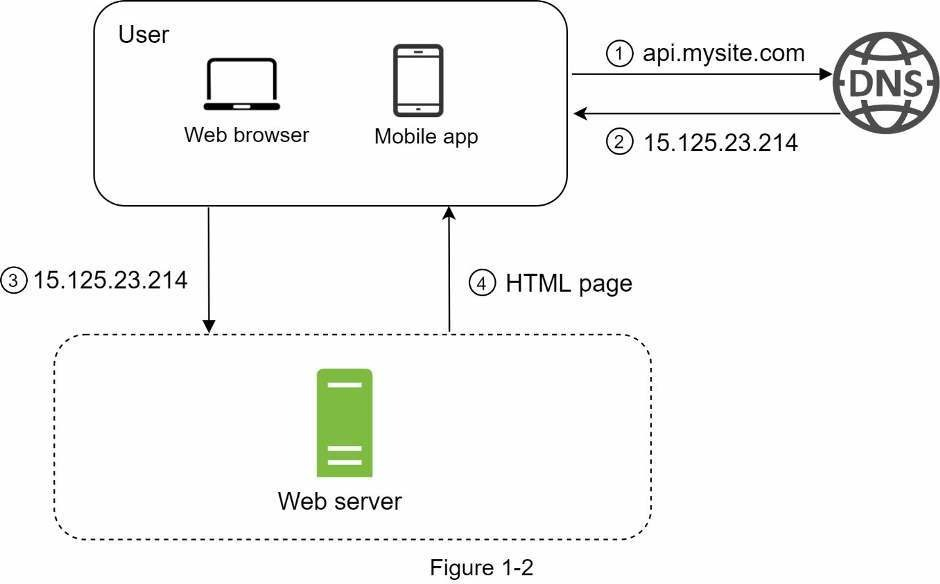

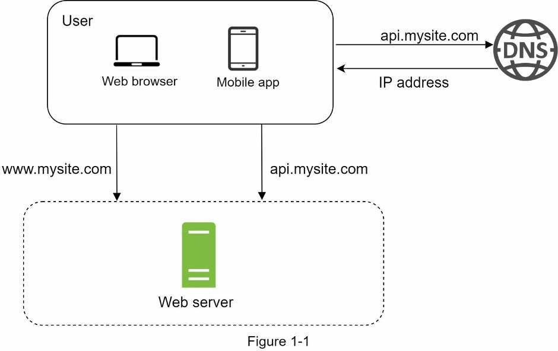

Luồng xử lý có thể mô tả như sau:

```text
User
  -> DNS tìm địa chỉ IP
  -> HTTP request đến server
  -> Application xử lý nghiệp vụ
  -> Database đọc hoặc ghi dữ liệu
  -> Server trả response cho user
```

### Vì sao kiến trúc này phù hợp lúc đầu?

Một server giúp đội phát triển deploy nhanh, debug đơn giản và không phải xử lý các vấn đề của distributed system. Không có replication lag, không có message giao trùng, không cần distributed tracing và không cần đồng bộ cấu hình giữa nhiều node. Nếu sản phẩm chưa chứng minh được nhu cầu thật, sự đơn giản này có giá trị lớn hơn khả năng scale chưa chắc sẽ được sử dụng.

Ví dụ, một website nội bộ có 50 nhân viên hoặc một cửa hàng mới mở có vài trăm lượt truy cập mỗi ngày hoàn toàn có thể chạy Spring Boot cùng PostgreSQL trên một máy ảo. Đội phát triển vẫn cần backup dữ liệu, giám sát tài nguyên và có cách khôi phục server, nhưng chưa cần Kubernetes hoặc database cluster.

### Vấn đề sẽ xuất hiện khi tải tăng

Application và database dùng chung CPU, RAM và disk nên có thể ảnh hưởng lẫn nhau. Một truy vấn report đọc nhiều dữ liệu có thể làm disk bận và khiến HTTP request chậm. Một lỗi memory leak trong application có thể chiếm hết RAM của database. Khi server cần restart để deploy, toàn bộ sản phẩm bị gián đoạn. Nếu disk hỏng hoặc máy mất kết nối, cả application và dữ liệu đều không thể truy cập.

### Cách xử lý thực tế và giới hạn

Bước ngắn hạn thường là tăng cấu hình máy, tối ưu code, thêm index đúng chỗ và cấu hình backup. Cách này mua thêm thời gian mà không làm thay đổi kiến trúc. Tuy nhiên, scale dọc luôn có giới hạn phần cứng và một server vẫn là single point of failure. Vì vậy, khi traffic hoặc yêu cầu availability tăng đủ lớn, hệ thống phải bắt đầu tách các trách nhiệm ra khỏi nhau.

## 1.4. Tách application và database thành hai tầng

Bước mở rộng đầu tiên thường là đưa application và database sang hai server hoặc hai managed service riêng. Application server nhận request và thực thi business logic; database server tập trung vào transaction, index, query và lưu trữ bền vững.

```text
Client -> Application Server -> Database Server
```

Việc tách này cho phép nâng CPU của application khi business logic nặng, đồng thời nâng memory và disk IOPS của database khi truy vấn tăng. Database có thể nằm trong private network và chỉ chấp nhận kết nối từ application, nhờ đó giảm bề mặt tấn công. Đội vận hành cũng có thể backup, restore và nâng version database độc lập với việc deploy application.

### Vấn đề thực tế: tách server nhưng latency lại tăng

Khi hai thành phần không còn chạy cùng máy, mỗi query trở thành một network call. Nếu một API thực hiện 100 query nhỏ theo kiểu N+1, network latency sẽ bị nhân lên và response có thể chậm hơn trước. Giải pháp không phải đưa database trở lại cùng máy mà là giảm số round trip, batch query, dùng join phù hợp, prefetch dữ liệu và đo slow query.

### Chọn SQL hay NoSQL

Quy mô lớn không có nghĩa là bắt buộc phải thay SQL bằng NoSQL. SQL thường phù hợp khi dữ liệu có quan hệ rõ, cần transaction và cần bảo đảm constraint, ví dụ order, payment, ledger hoặc inventory. NoSQL có thể phù hợp khi access pattern đơn giản, schema thay đổi nhiều, dữ liệu rất lớn hoặc cần phân bố theo key, ví dụ session, event, time-series hoặc document catalog.

Một hệ thống thực tế thường dùng nhiều loại storage theo mục đích. Website bán hàng có thể dùng PostgreSQL cho đơn hàng, Redis cho cache và session, Elasticsearch/OpenSearch cho tìm kiếm sản phẩm, còn object storage dùng để lưu ảnh. Đây không phải là thay thế một database bằng nhiều database một cách tùy ý; mỗi storage phải có ownership và nguồn dữ liệu chuẩn được xác định rõ.

### Đánh đổi

Tách tầng giúp scale và bảo mật tốt hơn nhưng làm tăng network dependency. Application phải xử lý timeout, connection pool và trường hợp database tạm thời không phản hồi. Chi phí cũng tăng vì có ít nhất hai nhóm tài nguyên phải vận hành.

## 1.5. Scale dọc và scale ngang

### 1.5.1. Scale dọc

Scale dọc, hay scale up, là tăng năng lực của một server bằng cách thêm CPU, RAM, disk hoặc network bandwidth. Ví dụ, database được nâng từ 4 CPU và 16 GB RAM lên 16 CPU và 64 GB RAM.

Scale dọc thường là lựa chọn đầu tiên vì ít thay đổi code và có thể thực hiện nhanh. Database nhận thêm memory sẽ giữ được nhiều page trong buffer cache; application có thêm CPU sẽ xử lý được nhiều request hơn. Với hệ thống vừa và nhỏ, đây có thể là giải pháp kinh tế hơn việc vận hành nhiều node.

Giới hạn của scale dọc là một máy không thể lớn vô hạn, giá tài nguyên cao cấp thường tăng nhanh và server vẫn có thể là single point of failure. Một số lần resize yêu cầu restart, vì vậy hệ thống có thể bị gián đoạn. Scale dọc cũng không tự giải quyết lỗi phần mềm; một memory leak cuối cùng vẫn dùng hết lượng RAM lớn hơn.

### 1.5.2. Scale ngang

Scale ngang, hay scale out, là thêm nhiều instance cùng xử lý một loại công việc. Thay vì chạy một web server 32 CPU, hệ thống có thể chạy tám web server 4 CPU phía sau load balancer. Khi một instance hỏng, các instance khác vẫn tiếp tục phục vụ request.

Scale ngang phù hợp nhất với workload có thể chia nhỏ và xử lý độc lập. Web request stateless, image processing job và consumer đọc queue là các ví dụ tốt. Stateful database khó scale ngang hơn vì dữ liệu phải được replicate hoặc partition, transaction phải giữ tính đúng đắn và node cần thống nhất về trạng thái.

Microsoft khuyến nghị hệ thống scale ngang nên tránh instance stickiness, đồng thời nhấn mạnh rằng thêm web server không có tác dụng nếu bottleneck thật sự nằm ở database ([Azure Architecture Center](https://learn.microsoft.com/en-us/azure/architecture/guide/design-principles/scale-out)).

### Đánh đổi giữa hai cách scale

Scale dọc đơn giản nhưng có giới hạn và khả năng chịu lỗi thấp. Scale ngang tăng availability và elasticity nhưng tạo ra các vấn đề như load balancing, distributed logging, shared state, data consistency và deployment nhiều instance. Trong production, hai cách thường được kết hợp: mỗi node có cấu hình đủ mạnh để hoạt động hiệu quả, sau đó số node được tăng hoặc giảm theo tải.

## 1.6. Load balancer: phân phối request giữa nhiều server

Khi web tier có nhiều server, client không thể tự biết server nào đang khỏe, server nào đang deploy hoặc server nào đã quá tải. Load balancer cung cấp một endpoint chung, nhận request từ client rồi chuyển request đến một backend phù hợp.

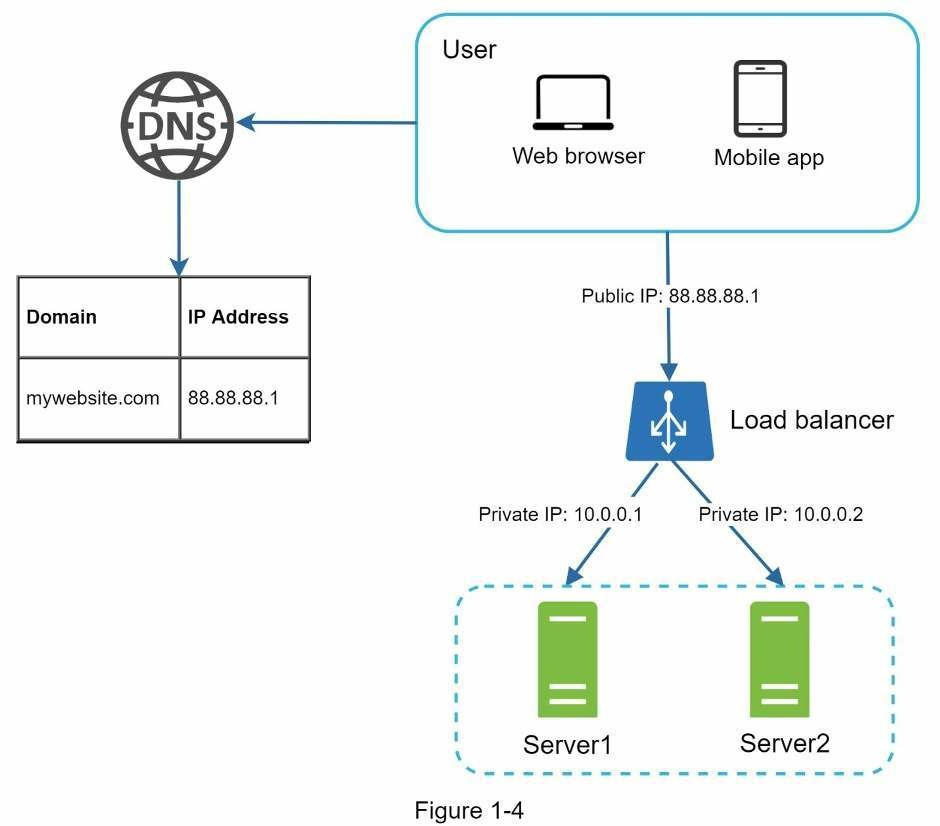

```text
                         -> Application 1
Client -> Load Balancer  -> Application 2
                         -> Application 3
```

Load balancer thường thực hiện health check định kỳ. Khi một instance không vượt qua health check, traffic mới tạm thời không được gửi tới instance đó. AWS mô tả Elastic Load Balancing là thành phần chuyển traffic tới các target đã đăng ký và chỉ tiếp tục định tuyến đến target khỏe mạnh ([AWS ELB documentation](https://docs.aws.amazon.com/elasticloadbalancing/latest/userguide/how-elastic-load-balancing-works.html)).

### Load balancer giải quyết được gì?

Load balancer cho phép web tier scale ngang, giảm ảnh hưởng khi một instance hỏng và hỗ trợ rolling deployment. Nó cũng có thể terminate TLS, route theo host/path, giới hạn connection và chuyển traffic giữa các version trong canary deployment.

### Load balancer không giải quyết được gì?

Nếu mọi backend đều gọi cùng một database đang quá tải, thêm backend chỉ tạo thêm connection và query vào database. Nếu application giữ session trong memory cục bộ, request đi sang server khác có thể mất trạng thái. Nếu health check chỉ kiểm tra process còn chạy nhưng không kiểm tra dependency quan trọng, load balancer vẫn có thể gửi traffic tới một instance không thực sự phục vụ được request.

### Cấu hình thực tế cần chú ý

Health check phải đủ nhẹ nhưng phản ánh đúng khả năng phục vụ. Timeout quá ngắn có thể loại server chỉ vì một lần chậm; timeout quá dài làm traffic tiếp tục đi vào server lỗi. Khi scale-in hoặc deploy, server nên ngừng nhận request mới rồi chờ request đang chạy hoàn tất trong thời gian giới hạn, thay vì bị tắt ngay lập tức.

### Đánh đổi

Load balancer tăng availability của backend nhưng trở thành thành phần quan trọng ở đường vào. Managed load balancer thường được chọn để nhà cung cấp chịu trách nhiệm redundancy và capacity của lớp này, đổi lại doanh nghiệp phải trả phí và phụ thuộc vào giới hạn của dịch vụ.

## 1.7. Database replication: tăng khả năng đọc và chịu lỗi

Khi chỉ có một database, node đó có thể trở thành bottleneck và single point of failure. Replication tạo thêm bản sao dữ liệu trên các node khác. Trong mô hình phổ biến, primary nhận thao tác ghi, còn read replica nhận thay đổi từ primary và phục vụ một phần truy vấn đọc.

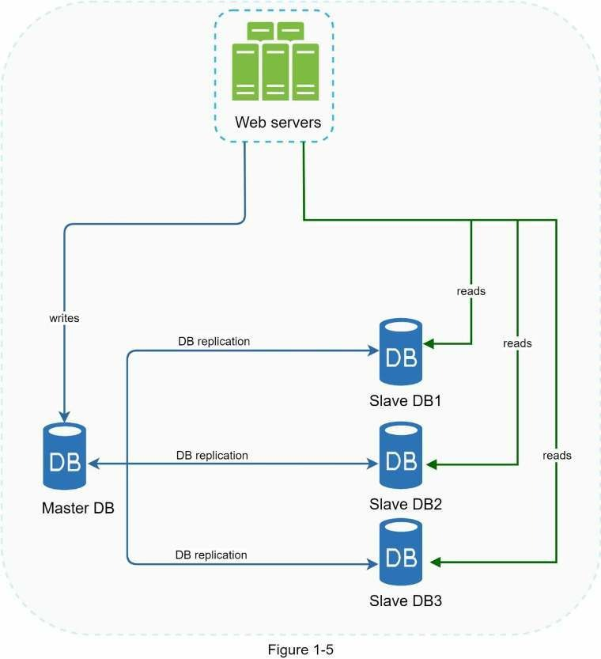

```text
Write -> Primary -> replicate -> Replica 1
                         └----> Replica 2

Read -------------------------> Replicas
```

AWS RDS cho biết read replica giúp giảm tải primary cho workload đọc nhiều; replication thường diễn ra bất đồng bộ, vì vậy replica có thể chậm hơn primary trong một khoảng thời gian ([AWS RDS documentation](https://docs.aws.amazon.com/AmazonRDS/latest/UserGuide/USER_ReadRepl.html)).

### Trường hợp sử dụng phù hợp

Read replica hữu ích khi hệ thống có tỷ lệ đọc cao, ví dụ product catalog, news feed hoặc báo cáo. Các query phân tích chạy lâu có thể được chuyển sang replica để không cạnh tranh tài nguyên với transaction trên primary. Replica ở khu vực khác cũng có thể hỗ trợ disaster recovery, mặc dù quy trình promote và đồng bộ dữ liệu phải được kiểm thử trước.

### Vấn đề production: replication lag

Giả sử user cập nhật địa chỉ giao hàng trên primary rồi lập tức tải lại trang. Nếu request đọc được chuyển tới replica chưa nhận thay đổi, user vẫn thấy địa chỉ cũ. Với dữ liệu cần read-after-write, application có thể đọc primary trong một khoảng ngắn, trả luôn object vừa ghi trong response hoặc theo dõi lag để không route request nhạy cảm tới replica đang chậm.

Synchronous replication có thể giảm nguy cơ mất dữ liệu vì primary chỉ xác nhận sau khi replica đã nhận thay đổi. Đổi lại, write latency cao hơn và nếu replica không liên lạc được, write có thể bị chặn. Asynchronous replication cho write nhanh và availability cao hơn, nhưng chấp nhận lag và có khả năng mất phần dữ liệu chưa kịp replicate khi primary hỏng.

### Failover không hoàn toàn đơn giản

Khi primary hỏng, một replica có thể được promote thành primary mới. Tuy nhiên, application phải tìm đúng endpoint mới, đảm bảo không có hai primary cùng nhận write và xử lý phần dữ liệu chưa replicate. Managed database tự động hóa nhiều bước nhưng ứng dụng vẫn cần retry có kiểm soát, idempotency và connection recovery.

### Replication không phải backup

Nếu application xóa nhầm một bảng, thao tác xóa cũng được replicate. Backup độc lập giúp quay lại thời điểm trước khi dữ liệu bị xóa hoặc hỏng. Một chiến lược an toàn phải có cả replication để tăng availability và backup đã được thử restore để phục hồi dữ liệu.

## 1.8. Cache: giảm latency và giảm tải database

Cache giữ bản sao của dữ liệu thường được đọc trong memory để application không phải lặp lại cùng một query hoặc phép tính tốn tài nguyên. Cache không thay thế nguồn dữ liệu chính; nó là bản sao có thể hết hạn hoặc bị mất.

Pattern dễ bắt đầu nhất là cache-aside:

```text
Application đọc cache
  -> Cache hit: trả dữ liệu ngay
  -> Cache miss: đọc database
                   -> ghi kết quả vào cache với TTL
                   -> trả dữ liệu cho client
```

Redis khuyến nghị cache-aside cho workload đọc lặp lại nhiều: application kiểm tra Redis trước, đọc primary khi miss rồi ghi kết quả vào cache với TTL ([Redis documentation](https://redis.io/docs/latest/develop/use-cases/cache-aside/)).

### Ví dụ thực tế

API `GET /products/123` được gọi 10.000 lần mỗi phút nhưng thông tin sản phẩm chỉ thay đổi vài lần mỗi ngày. Nếu object được cache trong Redis 5 phút, phần lớn request không cần query database. Khi sản phẩm được cập nhật, application ghi database trước rồi xóa cache key để lần đọc tiếp theo nạp dữ liệu mới.

### Chọn dữ liệu để cache

Dữ liệu phù hợp thường có tần suất đọc cao, chi phí tạo kết quả lớn và chấp nhận cũ trong một khoảng ngắn, ví dụ product detail, public profile, configuration hoặc kết quả aggregation. Số dư tài khoản, trạng thái khóa tiền và quyết định thanh toán không nên dựa tùy ý vào cache cũ vì hậu quả của dữ liệu sai lớn hơn lợi ích latency.

### Các lỗi cache thường gặp trong production

**Cache penetration** xảy ra khi client liên tục hỏi một key không tồn tại, khiến mọi request đều đi xuống database. Hệ thống có thể cache kết quả “không tồn tại” trong thời gian ngắn, validate input hoặc dùng Bloom filter trong trường hợp phù hợp.

**Cache stampede** xảy ra khi một hot key hết hạn và hàng nghìn request cùng query database để tải lại. Cách xử lý thường là single-flight/distributed lock, refresh sớm trong background hoặc tạm trả dữ liệu cũ theo stale-while-revalidate.

**Cache avalanche** xảy ra khi nhiều key hết hạn gần cùng thời điểm. TTL có thể được thêm jitter ngẫu nhiên để phân tán thời điểm refresh.

**Hot key** xảy ra khi một key nhận quá nhiều request và làm một cache node quá tải. Giải pháp có thể là local cache ngắn hạn, nhân bản hot value hoặc phân tán key, nhưng mỗi cách làm tăng độ khó invalidation.

### Khi cache bị lỗi

Application thường fallback về database, nhưng nếu toàn bộ traffic lập tức chuyển xuống database thì chính cơ chế fallback có thể làm database sập. Production system cần giới hạn concurrency, rate limit, circuit breaker và có thể ưu tiên request quan trọng. Một số dữ liệu ít quan trọng có thể trả response suy giảm thay vì cố đọc database bằng mọi giá.

### Đánh đổi

Cache đổi độ mới tuyệt đối của dữ liệu và độ phức tạp invalidation lấy latency thấp cùng database load nhỏ hơn. TTL ngắn làm dữ liệu mới hơn nhưng tăng cache miss; TTL dài tăng hit ratio nhưng kéo dài thời gian stale. Giá trị TTL phải dựa trên loại dữ liệu và mức sai lệch nghiệp vụ chấp nhận được.

## 1.9. CDN: đưa nội dung đến gần người dùng

CDN lưu bản sao nội dung tại các edge server phân bố theo địa lý. Khi file đã có ở edge, request không phải đi về origin server, nhờ đó giảm latency cho người dùng ở xa và giảm bandwidth của hạ tầng gốc.

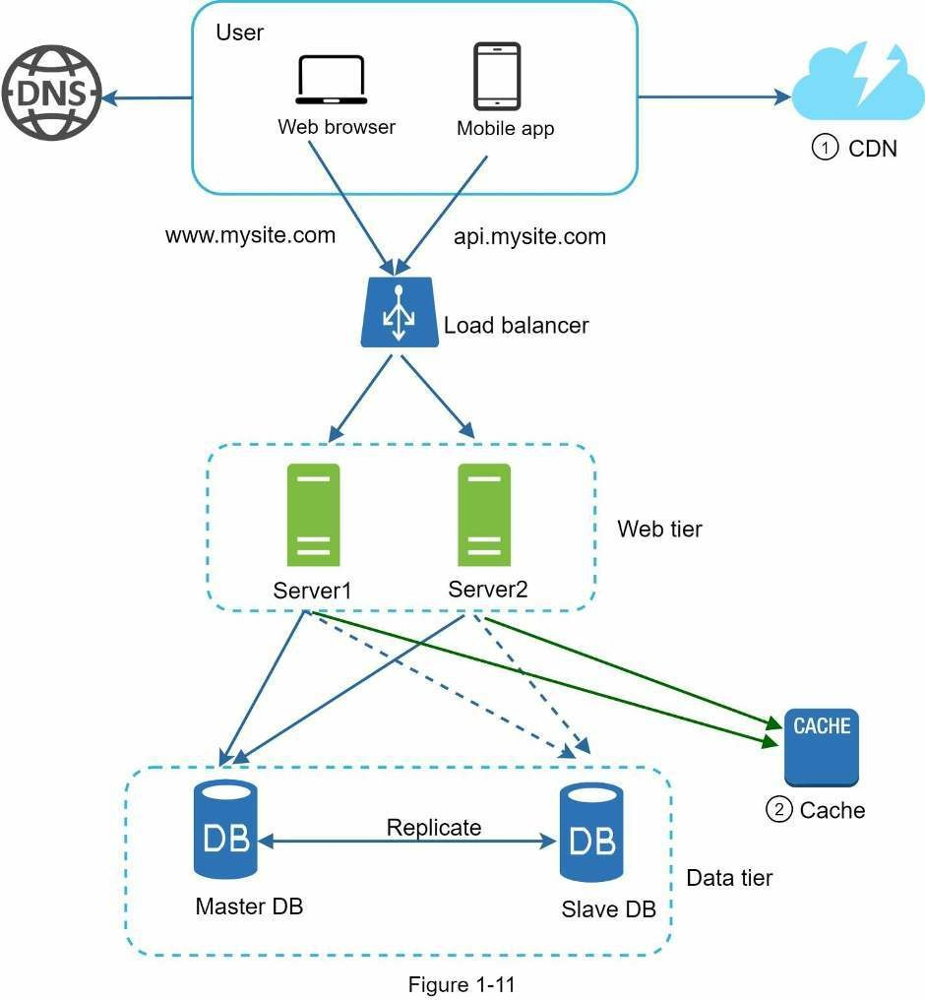

Cloudflare mô tả CDN cache nội dung tại các data center gần người dùng hơn origin, giúp giảm tải origin và cải thiện thời gian phản hồi ([Cloudflare Cache documentation](https://developers.cloudflare.com/cache/)).

### Nội dung phù hợp

Image, CSS, JavaScript, font, file download và video segment là các đối tượng dễ cache. HTML hoặc API response cũng có thể được cache nhưng cần cache key và rule chính xác. Nếu response phụ thuộc user mà CDN không đưa cookie, authorization hoặc tenant vào cache key đúng cách, dữ liệu riêng tư của một user có thể bị trả cho user khác.

### Cache miss và cache hit

Khi edge chưa có file, nó gọi origin, nhận nội dung và lưu theo TTL; request này gọi là cache miss và thường chậm hơn. Các request sau được trả từ edge, gọi là cache hit. Vì vậy, cần theo dõi cache hit ratio, origin request rate và bandwidth, thay vì chỉ kiểm tra CDN đã bật hay chưa.

### Cập nhật nội dung

Với static asset, cách an toàn là dùng tên file chứa content hash như `app.a8f31c.js`. Version mới tạo URL mới nên không cần xóa bản cũ ngay. Với URL không đổi, đội vận hành phải purge/invalidate CDN hoặc chờ TTL, nhưng purge toàn cầu có thể mất thời gian và tạo một đợt miss lớn về origin.

### Hạn chế và đánh đổi

CDN tăng chi phí request và data transfer, làm debugging cache phức tạp hơn và có thể trả nội dung cũ. Nếu CDN lỗi, fallback thẳng về origin có thể làm origin quá tải. CDN rất hiệu quả với nội dung cacheable nhưng không thay thế việc scale API hoặc database cho dữ liệu động cần cập nhật tức thời.

## 1.10. Stateless web tier: điều kiện để scale ngang an toàn

Web server stateless không giữ state cần cho request tiếp theo trong memory hoặc local disk của chính instance đó. State vẫn tồn tại nhưng được đặt trong shared storage, database, Redis, object storage hoặc một token được thiết kế phù hợp.

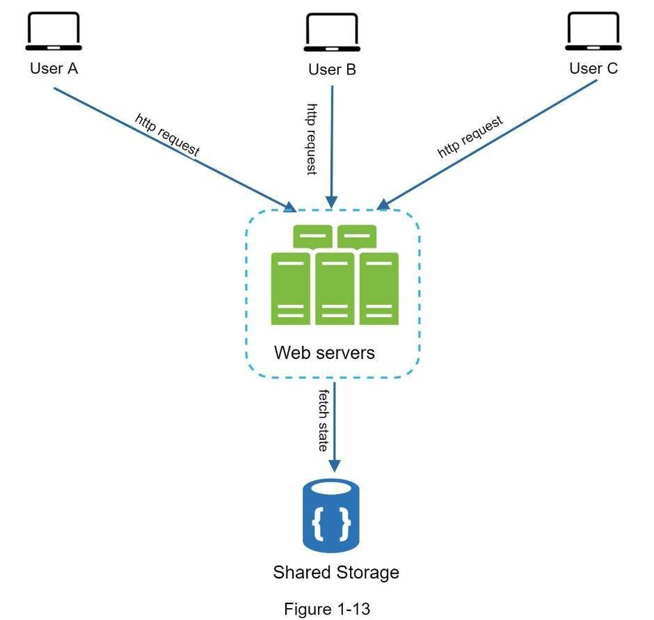

```text
                         -> Application 1 --┐
Client -> Load Balancer  -> Application 2 --+-> Shared state store
                         -> Application 3 --┘
```

Nếu session của user A chỉ nằm trong memory của application 1, load balancer phải luôn đưa user A trở lại instance này. Sticky session có thể tạm giải quyết routing nhưng làm tải phân bố không đều, khiến scale-in khó và làm user mất session khi instance hỏng.

Khi session được chuyển sang Redis hoặc database dùng chung, bất kỳ instance nào cũng xử lý được request. File upload nên được lưu ở object storage thay vì local disk, vì instance mới không nhìn thấy file trên instance cũ và file có thể mất khi container bị thay thế.

Token tự chứa như JWT có thể giảm lần đọc session store, nhưng không phải giải pháp miễn phí. Token khó revoke tức thì, payload cũ còn hiệu lực đến khi hết hạn và dữ liệu trong payload không tự cập nhật khi quyền của user thay đổi. Với yêu cầu revoke mạnh, hệ thống vẫn có thể cần blacklist, token version hoặc session store.

Microsoft khuyến nghị tránh instance affinity để mọi instance có thể xử lý mọi request khi scale ngang ([Azure Architecture Center](https://learn.microsoft.com/en-us/azure/architecture/guide/design-principles/scale-out)).

### Đánh đổi

Stateless web tier làm autoscaling, failover và rolling deployment đơn giản hơn, nhưng shared state store trở thành dependency quan trọng và tạo thêm network call. Vì vậy, state store cũng cần capacity planning, replication, timeout và monitoring.

## 1.11. Autoscaling: thêm tài nguyên theo tải

Autoscaling tự động tăng hoặc giảm số instance dựa trên metric hoặc lịch. Cơ chế này giúp hệ thống đáp ứng traffic thay đổi và giảm chi phí lúc ít tải, nhưng nó không thể thay thế capacity planning hoặc sửa một application có bottleneck trong code.

Metric phù hợp phụ thuộc workload. HTTP service có thể scale theo request rate, latency hoặc CPU. Queue consumer nên quan tâm queue depth và tuổi message cũ nhất. Service chờ I/O có thể latency cao dù CPU thấp, vì vậy chỉ dùng CPU dễ đưa ra quyết định sai.

### Vấn đề: autoscaling phản ứng chậm hơn traffic

Nếu traffic tăng trong 20 giây nhưng instance cần hai phút để sẵn sàng, hệ thống sẽ quá tải trước khi capacity mới xuất hiện. Với flash sale đã biết thời gian, đội vận hành thường scale trước theo lịch. Với spike không dự đoán được, cần minimum capacity, cache, CDN, queue, rate limiting và load shedding để giữ hệ thống trong giới hạn trong lúc chờ instance mới.

### Vấn đề: scale application làm database sập

Giả sử mỗi instance có pool 50 database connection. Tăng từ 10 lên 100 instance tạo nhu cầu tối đa 5.000 connection, trong khi database chỉ chịu được vài trăm. Vì vậy, autoscaling policy phải đi cùng connection budget, pool size hợp lý, connection proxy và giới hạn maximum instance.

### Scale-in an toàn

Khi giảm instance, node cần ngừng nhận request mới, hoàn tất request hoặc job đang chạy trong thời gian giới hạn rồi mới tắt. Queue consumer phải commit trạng thái đúng lúc để job chưa hoàn tất được giao lại. Nếu tắt ngay, user có thể nhận lỗi và job có thể bị mất hoặc xử lý trùng.

### Đánh đổi

Scale nhanh giữ latency ổn định nhưng làm chi phí tăng và có thể dồn tải xuống dependency. Scale chậm tiết kiệm hơn nhưng dễ vi phạm SLO trong spike. Cooldown dài giảm dao động thêm-bớt node nhưng phản ứng chậm; cooldown ngắn linh hoạt hơn nhưng dễ tạo scaling oscillation.

## 1.12. Multi-data-center và multi-region

Khi user phân bố toàn cầu, quy định yêu cầu dữ liệu ở khu vực cụ thể hoặc downtime của cả region vượt quá mức doanh nghiệp chấp nhận, hệ thống có thể được triển khai tại nhiều data center hoặc region.

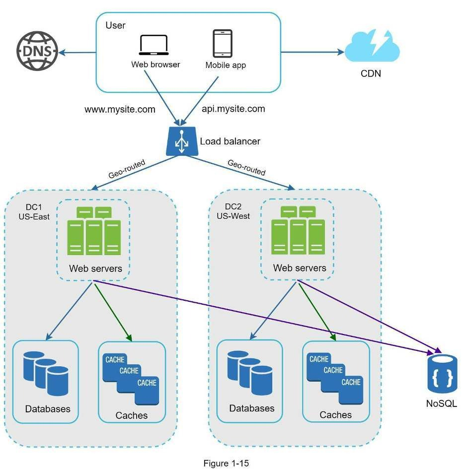

**Active-passive** dùng một region chính phục vụ traffic, còn region phụ duy trì backup, pilot light hoặc warm standby để nhận traffic khi failover. Mô hình này đơn giản hơn active-active nhưng có thời gian khôi phục và capacity của region phụ phải được kiểm tra.

**Active-active** cho nhiều region cùng phục vụ traffic. User có thể được route đến region gần nhất, nhưng dữ liệu ghi đồng thời ở nhiều nơi tạo ra conflict, ordering và consistency phức tạp. Một hệ thống có thể active-active ở web tier nhưng chỉ ghi vào một home region cho mỗi user hoặc tenant để giảm xung đột.

### RTO và RPO

RTO là thời gian tối đa doanh nghiệp chấp nhận để dịch vụ phục hồi. RPO là lượng dữ liệu tối đa có thể mất, thường biểu diễn bằng thời gian. Backup-and-restore có chi phí thấp nhưng RTO dài; warm standby tốn nhiều hơn nhưng phục hồi nhanh; active-active có thể đạt RTO rất thấp nhưng vận hành phức tạp và đắt nhất.

### Các vấn đề thực tế

DNS failover không tức thì vì resolver có cache. Dữ liệu giữa region có replication lag. Cross-region transfer tốn tiền và có latency. Schema migration phải tương thích khi hai region deploy không cùng thời điểm. Việc failover chưa bao giờ diễn tập có thể không hoạt động khi sự cố thật xảy ra.

AWS khuyến nghị xem multi-region là quyết định dựa trên RTO/RPO, latency toàn cầu, data residency và phạm vi thảm họa; với nhiều workload, multi-zone trong một region đã cung cấp mức resilience phù hợp và ít phức tạp hơn ([AWS Prescriptive Guidance](https://docs.aws.amazon.com/prescriptive-guidance/latest/security-reference-architecture/multi-region-architecture.html)).

### Đánh đổi

Multi-region đổi chi phí, độ phức tạp consistency và công sức vận hành lấy khả năng chịu lỗi cấp region cùng latency địa lý tốt hơn. Không nên chọn active-active chỉ vì kiến trúc trông mạnh; doanh nghiệp cần chứng minh lợi ích tương xứng với chi phí và thường xuyên diễn tập failover.

## 1.13. Message queue: xử lý bất đồng bộ và hấp thụ traffic spike

Message queue tách producer tạo công việc khỏi consumer xử lý công việc. Producer gửi message vào queue rồi có thể kết thúc request; consumer lấy message và xử lý theo tốc độ của mình.

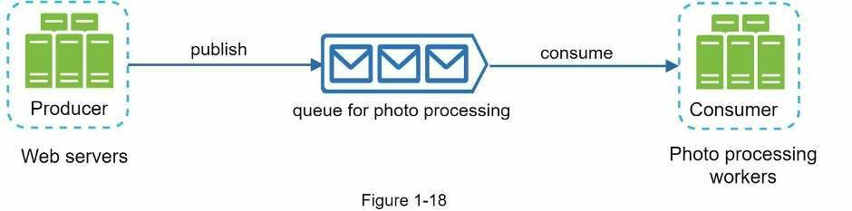

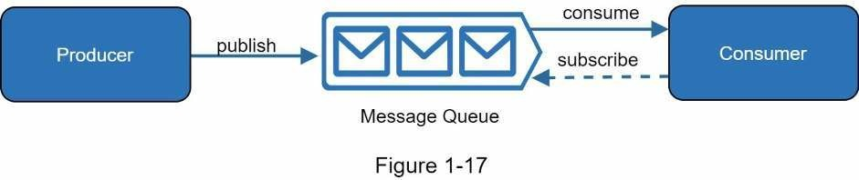

Ví dụ, khi user upload ảnh, API lưu file gốc rồi gửi job `RESIZE_IMAGE` vào queue và trả trạng thái “đã nhận”. Worker tạo thumbnail sau đó. Nếu lượng upload tăng nhanh, queue giữ tạm các job chưa xử lý; đội vận hành có thể tăng worker mà không cần tăng API server.

Queue phù hợp với gửi email, tạo báo cáo, xử lý ảnh, đồng bộ search index, notification và event processing. Nó không phù hợp nếu client bắt buộc phải có kết quả cuối cùng trước khi tiếp tục, trừ khi hệ thống có cơ chế chờ và timeout rõ ràng.

### Delivery và idempotency

Nhiều queue cung cấp at-least-once delivery, nghĩa là message có thể được giao lại khi consumer xử lý xong nhưng chưa kịp acknowledge. Consumer phải idempotent để cùng một message không tạo hai invoice hoặc trừ tiền hai lần. Cách phổ biến là dùng event ID/idempotency key và lưu trạng thái đã xử lý trong storage có tính nhất quán phù hợp.

### Retry và poison message

Lỗi tạm thời có thể retry với exponential backoff và jitter. Message lỗi do dữ liệu sai không nên retry vô hạn vì nó chiếm tài nguyên và chặn message khác. Sau số lần giới hạn, message được chuyển sang dead-letter queue để quan sát, sửa nguyên nhân và replay có kiểm soát.

### Backlog

Nếu producer tạo 1.500 message mỗi giây nhưng consumer chỉ xử lý 1.000, queue vẫn nhận message nhưng độ trễ tăng liên tục. Metric cần theo dõi không chỉ là queue depth mà còn là tuổi của message cũ nhất, producer rate, consumer rate và số message trong dead-letter queue.

Thêm consumer chỉ có tác dụng khi database hoặc external API phía sau còn capacity. Nếu 100 consumer cùng gọi một API giới hạn 500 request mỗi giây, scale consumer có thể làm tỷ lệ lỗi tăng thay vì giảm backlog.

### Ordering và throughput

Giữ thứ tự toàn cục thường làm giảm khả năng xử lý song song. Nếu nghiệp vụ chỉ cần đúng thứ tự theo `order_id`, queue có thể partition theo order để các event của cùng order đi cùng partition, trong khi các order khác vẫn xử lý song song.

### Đánh đổi

Queue tăng resilience và tách tốc độ producer-consumer, nhưng làm kết quả trở thành eventual consistency, tăng độ khó debug và yêu cầu xử lý duplicate, retry, ordering cùng schema evolution.

## 1.14. Database sharding: chia dữ liệu và lưu lượng ghi

Replication tạo nhiều bản sao của cùng dữ liệu để scale đọc và chịu lỗi. Sharding chia tập dữ liệu thành các phần khác nhau để nhiều database cùng gánh dung lượng và write throughput. Trong hệ thống lớn, mỗi shard có thể tiếp tục có primary và replica riêng.

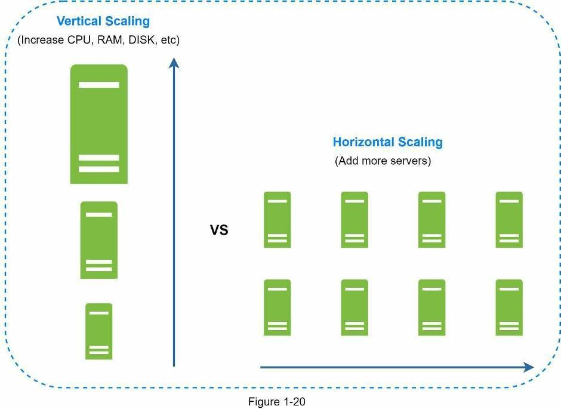

Ví dụ chia theo hash của `user_id`:

```text
shard_id = hash(user_id) % 4

user 20 -> shard 0
user 21 -> shard 1
user 22 -> shard 2
user 23 -> shard 3
```

### Khi nào thật sự cần shard?

Sharding nên được cân nhắc khi dữ liệu không còn vừa một database node, write throughput đã vượt giới hạn của primary hoặc index quá lớn dù query và schema đã được tối ưu. Trước đó, cần kiểm tra slow query, index, data retention, archive, cache, read replica và scale dọc. Shard quá sớm khiến mọi thay đổi nghiệp vụ sau này khó hơn.

### Chọn shard key

Shard key phải phân bố dữ liệu và traffic tương đối đều, xuất hiện trong phần lớn query quan trọng, ít thay đổi và tránh một key nhận tỷ lệ tải quá lớn. Chọn `country` khi 80% user ở Việt Nam tạo ra hot shard. Chọn `created_month` khiến toàn bộ write của tháng hiện tại tập trung vào một shard. Hash `user_id` phân bố tốt nhưng truy vấn tất cả user theo khoảng thời gian phải đọc nhiều shard.

### Hot partition

Ngay cả khi dữ liệu phân bố đều, traffic có thể không đều. Một merchant lớn tạo 40% giao dịch sẽ làm shard chứa merchant đó quá tải. Hệ thống có thể tách tenant lớn, thêm hash suffix, dùng virtual shard hoặc tạo read model riêng. Tuy nhiên, resharding dữ liệu đang chạy tốn network, ảnh hưởng latency và cần cơ chế đọc/ghi đúng trong thời gian migration.

### Query và transaction cross-shard

Join nhiều shard yêu cầu fan-out query rồi tổng hợp kết quả. Pagination, sorting và aggregation toàn cục trở nên đắt. Transaction đi qua nhiều shard cần protocol và failure handling phức tạp; nhiều hệ thống thay đổi data model để transaction quan trọng nằm trong cùng shard.

### Global ID và rebalancing

Auto-increment cục bộ có thể tạo ID trùng giữa các shard. Hệ thống có thể dùng Snowflake-like ID, UUID hoặc cấp dải ID. Khi thêm shard, công thức modulo đơn giản có thể làm nhiều key đổi vị trí, vì vậy consistent hashing, virtual shard hoặc routing directory thường được cân nhắc.

### Đánh đổi

Sharding đổi query đơn giản, transaction dễ và vận hành tập trung lấy dung lượng cùng write throughput lớn hơn. Shard key là quyết định khó thay đổi; cần bắt đầu từ access pattern thực tế chứ không chỉ từ cấu trúc bảng.

## 1.15. Tách loại dữ liệu và storage theo mục đích

Khi hệ thống lớn lên, không phải toàn bộ dữ liệu đều cần cùng một storage. Transactional database phù hợp với dữ liệu nghiệp vụ cần constraint. Object storage phù hợp với ảnh, video và file. Search engine phù hợp với full-text search. Cache phù hợp với hot data có thể tái tạo. Data warehouse phù hợp với báo cáo trên lượng dữ liệu lớn.

Việc tách storage giúp mỗi workload dùng công cụ phù hợp, nhưng tạo câu hỏi quan trọng về source of truth. Ví dụ, PostgreSQL có thể là nguồn chuẩn của product; sau khi cập nhật, event được gửi để đồng bộ sang search index. Search có thể chậm vài giây, nhưng không được xem là nơi xác nhận giá cuối cùng khi checkout.

Dual write trực tiếp vào database và search engine có thể rơi vào trạng thái một bên thành công, một bên thất bại. Production system thường dùng transactional outbox hoặc change data capture để phát event đáng tin cậy, sau đó consumer cập nhật read model và có khả năng retry.

Đánh đổi của polyglot persistence là mỗi storage thêm backup, monitoring, security, capacity planning và kỹ năng vận hành. Chỉ nên thêm khi access pattern thực sự khác và lợi ích rõ ràng.

## 1.16. Kiến trúc tổng hợp sau khi mở rộng

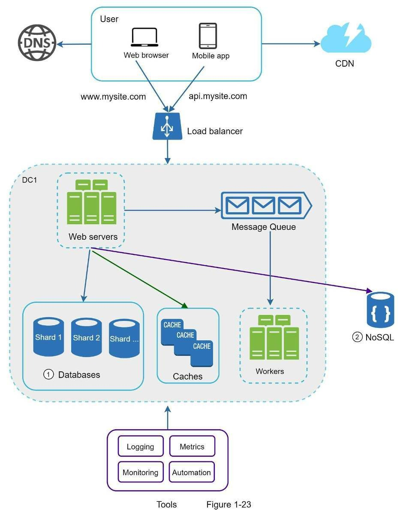

Một hệ thống lớn có thể đặt DNS và CDN ở lớp ngoài; load balancer phân phối traffic tới nhiều stateless application instance; cache giảm truy vấn lặp lại; database có replica hoặc shard; queue cùng worker xử lý công việc bất đồng bộ; object storage giữ file; nhiều data center phục vụ yêu cầu về latency và resilience.

Sơ đồ tổng hợp không phải checklist bắt buộc. Nếu ứng dụng không có file lớn, object storage và CDN có thể chưa quan trọng. Nếu write throughput còn thấp, sharding chỉ làm transaction và query khó hơn. Nếu downtime một region vẫn nằm trong mức chấp nhận, multi-region có thể không xứng đáng với chi phí.

Kiến trúc đúng là kiến trúc đáp ứng SLO và yêu cầu nghiệp vụ với độ phức tạp thấp nhất mà đội ngũ có thể vận hành an toàn.

## 1.17. Ví dụ xuyên suốt: scale một website bán hàng

### Bước 1: sản phẩm mới ra mắt

Hệ thống chạy một Spring Boot application và PostgreSQL trên cùng VM. Mục tiêu chính là kiểm tra sản phẩm có người dùng hay không. Đội phát triển thiết lập backup, basic monitoring và deployment có thể lặp lại, nhưng chưa thêm cluster.

### Bước 2: application bắt đầu thường xuyên quá tải

Database được chuyển sang managed database riêng. Application được làm stateless, session chuyển sang Redis hoặc cơ chế token phù hợp, sau đó nhiều instance được đặt sau load balancer. Việc này giải quyết giới hạn CPU của web tier và giảm downtime khi một instance lỗi.

Giới hạn còn lại là mọi instance vẫn dùng cùng database. Connection pool phải được giới hạn để việc scale application không làm database cạn connection.

### Bước 3: phần lớn traffic là xem sản phẩm

Product detail được cache trong Redis, còn ảnh và static asset được đưa lên object storage cùng CDN. Read replica được dùng cho báo cáo và một số truy vấn đọc chấp nhận lag. Checkout vẫn đọc giá và tồn kho từ nguồn dữ liệu có consistency phù hợp.

Đánh đổi là dữ liệu product trên cache, search và replica có thể lệch trong thời gian ngắn. Hệ thống phải xác định nơi nào chỉ hiển thị tham khảo và nơi nào đưa ra quyết định cuối cùng.

### Bước 4: email và xử lý ảnh làm request chậm

API chỉ ghi trạng thái cần thiết rồi gửi job sang queue. Worker tạo thumbnail, gửi email và cập nhật search index. Request của user kết thúc nhanh hơn và worker scale độc lập.

Đổi lại, UI phải hiển thị trạng thái “đang xử lý”, consumer phải idempotent và đội vận hành cần theo dõi backlog cùng dead-letter queue.

### Bước 5: flash sale tạo traffic spike

Capacity được scale trước, CDN và cache được pre-warm có chọn lọc, rate limiter bảo vệ endpoint, queue hấp thụ công việc không cần đồng bộ. Luồng đặt hàng dùng idempotency key để client retry không tạo nhiều order.

Nếu tồn kho giới hạn, hệ thống cần cơ chế reservation hoặc serialized update phù hợp. Cache không được tự quyết định còn hàng vì dữ liệu cũ có thể dẫn đến bán vượt tồn kho.

### Bước 6: dữ liệu và write throughput vượt một database

Đội phát triển phân tích access pattern và shard order theo một key cho phép các thao tác quan trọng nằm cùng shard. Reporting được chuyển sang pipeline riêng để không fan-out query nặng lên mọi shard. Quá trình migration dùng dual-read hoặc routing version có kiểm soát và được đo liên tục.

### Bước 7: mở rộng sang nhiều quốc gia

CDN đã giải quyết phần lớn static latency. Nếu API latency, data residency hoặc RTO/RPO vẫn yêu cầu, hệ thống mới cân nhắc multi-region. Có thể route user theo home region thay vì active-active write toàn cầu để giảm conflict.

## 1.18. Ước lượng nhanh để định hướng thiết kế

Giả sử website có 1.000.000 daily active users, mỗi user tạo trung bình 20 request mỗi ngày, peak traffic gấp 5 lần mức trung bình và response trung bình 20 KB.

```text
Request mỗi ngày = 1.000.000 x 20 = 20.000.000
QPS trung bình    = 20.000.000 / 86.400 ≈ 232
Peak QPS          = 232 x 5 ≈ 1.160
Peak bandwidth    = 1.160 x 20 KB ≈ 23 MB/s
```

Các số này không trực tiếp cho biết cần bao nhiêu server. Load test phải xác định một instance xử lý được bao nhiêu QPS ở latency mục tiêu. Nếu mỗi request tạo năm database query, peak database query rate có thể gần 5.800 query/giây trước cache. Nếu CDN phục vụ 70% byte response và cache loại bỏ 80% product query, tải thật xuống backend có thể giảm đáng kể.

Ước lượng giúp phát hiện phần quan trọng cần hỏi sâu. Video platform phải tập trung bandwidth và storage; chat system quan tâm concurrent connection; payment system quan tâm write correctness, idempotency và audit; news feed quan tâm fan-out cùng cache.

## 1.19. Các sự cố scale thường gặp trong production

### 1.19.1. Traffic tăng nhanh hơn autoscaling

**Vấn đề:** Traffic tăng gấp 20 lần trong vài chục giây, nhưng instance cần hai phút để khởi động. Hệ thống quá tải trước khi capacity mới sẵn sàng.

**Cách xử lý:** Giữ minimum capacity, scale trước cho sự kiện đã biết, dùng CDN/cache, queue công việc có thể trì hoãn và load shedding request ít quan trọng. Rate limiting giữ số request trong capacity thật của hệ thống.

**Hạn chế và đánh đổi:** Capacity dự phòng làm tăng chi phí; rate limiting khiến một số user bị từ chối; queue chỉ trì hoãn chứ không xóa công việc. Hệ thống đổi chi phí hoặc tỷ lệ thành công ngắn hạn lấy khả năng sống sót của luồng quan trọng.

### 1.19.2. Database hết connection sau khi web tier scale

**Vấn đề:** Số application instance tăng 10 lần và mỗi instance giữ pool riêng, khiến tổng connection vượt giới hạn database.

**Cách xử lý:** Đặt connection budget toàn hệ thống, giảm pool mỗi instance, dùng connection proxy/pooler, rút ngắn transaction và tối ưu query. Autoscaling cần maximum instance dựa trên capacity downstream.

**Hạn chế và đánh đổi:** Pool nhỏ làm request chờ; pool lớn làm database cạn tài nguyên. Proxy giảm chi phí tạo connection nhưng không làm query nặng nhanh hơn.

### 1.19.3. Retry storm kéo sập dependency

**Vấn đề:** Dependency chậm làm request timeout; mọi client và service retry ngay, tạo thêm tải đúng lúc dependency đang yếu.

**Cách xử lý:** Retry chỉ lỗi tạm thời, dùng exponential backoff và jitter, giới hạn số lần, áp dụng circuit breaker, bulkhead và concurrency limit. Write request dùng idempotency key.

**Hạn chế và đánh đổi:** Fail fast làm một số request thất bại sớm, nhưng ngăn thread và connection bị giữ đến cạn kiệt. Timeout ngắn tạo lỗi giả; timeout dài làm tài nguyên bị chiếm lâu.

### 1.19.4. Queue tăng nhưng consumer không thể scale tiếp

**Vấn đề:** Consumer đã tăng số lượng nhưng external API có rate limit hoặc database phía sau đã đủ tải, vì vậy backlog vẫn tăng.

**Cách xử lý:** Tách queue theo độ ưu tiên, giới hạn producer, batch request, tối ưu dependency và cung cấp trạng thái xử lý cho user. Nếu nghiệp vụ cho phép, giảm chất lượng hoặc bỏ công việc quá hạn không còn giá trị.

**Hạn chế và đánh đổi:** Không thể tạo throughput vượt quá dependency cuối cùng. Ưu tiên job quan trọng đồng nghĩa job khác chậm hơn; bỏ job cũ chỉ phù hợp với dữ liệu có thể mất như refresh cache, không phù hợp với payment.

### 1.19.5. Hot shard dù tổng capacity còn nhiều

**Vấn đề:** Một tenant hoặc key tạo phần lớn traffic và làm một shard quá tải, trong khi các shard còn lại nhàn rỗi.

**Cách xử lý:** Tách tenant lớn, dùng composite key/hash suffix, virtual shard hoặc read model riêng. Metric phải được xem theo partition, không chỉ tổng cluster.

**Hạn chế và đánh đổi:** Phân tán write tốt hơn có thể làm query theo range và transaction khó hơn. Resharding đang chạy tốn network và có rủi ro dữ liệu được route sai trong thời gian migration.

### 1.19.6. Rolling deployment làm version cũ và mới xung đột

**Vấn đề:** Version mới ghi schema database hoặc message format mà version cũ không đọc được, dù từng version chạy riêng đều đúng.

**Cách xử lý:** Dùng backward-compatible API/event, migration expand-and-contract, feature flag và canary deployment. Xóa field cũ chỉ sau khi mọi consumer đã ngừng sử dụng.

**Hạn chế và đánh đổi:** Code tạm thời phải hỗ trợ hai format và deployment có nhiều bước hơn. Đổi lại, hệ thống tránh downtime và rollback an toàn hơn.

### 1.19.7. Observability không đủ để tìm bottleneck

**Vấn đề:** Request đi qua nhiều service, cache, database và queue nhưng log không có correlation ID, nên đội vận hành không biết thời gian bị mất ở đâu.

**Cách xử lý:** Dùng structured log, trace ID, distributed tracing và metric theo latency, error, traffic, saturation. Dashboard ưu tiên SLI liên quan user; alert dựa trên tác động thay vì mọi dao động CPU nhỏ.

**Hạn chế và đánh đổi:** Log/trace có chi phí và có thể chứa dữ liệu nhạy cảm. Sampling giảm chi phí nhưng có thể bỏ sót request hiếm. Observability sâu tốn tài nguyên, nhưng thiếu nó kéo dài thời gian phát hiện và phục hồi sự cố.

### 1.19.8. Chi phí tăng nhanh hơn traffic

**Vấn đề:** Traffic tăng ba lần nhưng chi phí tăng tám lần do provision dư, replica ít dùng, cross-region transfer và nhiều cluster luôn phải chạy tối thiểu.

**Cách xử lý:** Theo dõi cost theo service và business transaction, rightsizing, điều chỉnh retention, tăng cache hit ratio, xóa tài nguyên không dùng và chỉ áp dụng multi-region cho workload thật sự cần.

**Hạn chế và đánh đổi:** Giảm capacity dự phòng tiết kiệm chi phí nhưng giảm khả năng chịu spike. Managed service có đơn giá cao hơn trong một số trường hợp, nhưng có thể giảm đáng kể chi phí nhân sự và rủi ro vận hành.

## 1.20. Monitoring: phải nhìn thấy hệ thống đang gần giới hạn ở đâu

Một hệ thống chỉ được xem là scale được khi đội vận hành biết nó đang tiến gần giới hạn ở thành phần nào. Average latency không đủ vì một nhóm user có thể rất chậm trong khi trung bình vẫn đẹp. P95 cho biết 95% request nhanh hơn giá trị đó; P99 giúp nhìn thấy phần đuôi chậm thường xuất hiện khi tài nguyên bão hòa.

### Client và edge

Theo dõi DNS error, CDN hit ratio, time to first byte, tổng thời gian tải và HTTP 4xx/5xx. Nếu CDN hit ratio giảm đột ngột, origin traffic có thể tăng mạnh dù số user không đổi.

### Application

Theo dõi request rate, P50/P95/P99 latency, error rate, CPU, memory, thread pool, event loop lag và thời gian chờ connection. Metric nên được tách theo endpoint vì một API report chậm có thể che khuất API checkout quan trọng.

### Database

Theo dõi query latency, slow query, connection, lock wait, deadlock, CPU, memory, disk IOPS và replication lag. Query count trên mỗi request giúp phát hiện N+1. Database có CPU thấp nhưng disk latency cao vẫn có thể là bottleneck.

### Cache

Theo dõi hit ratio, eviction, memory, latency, connection và hot key. Hit ratio cao nhưng miss tập trung vào một hot key vẫn có thể gây sự cố. Cần biết tải xuống database khi cache hoàn toàn mất để thiết kế fallback.

### Queue

Theo dõi producer rate, consumer rate, queue depth, tuổi message cũ nhất, retry count và dead-letter count. Queue depth ổn định không luôn có nghĩa hệ thống khỏe nếu message đang bị mất hoặc producer đã lỗi không gửi được.

### Capacity test

Load test cần đo điểm saturation, không chỉ chứng minh hệ thống chạy được ở tải trung bình. Test nên bao gồm cache cold start, một instance bị mất, database failover, dependency chậm và traffic spike. Kết quả giúp xác định minimum capacity, autoscaling threshold và giới hạn rate limiter.

## 1.21. Bảng quyết định nhanh

| Dấu hiệu quan sát | Kiểm tra trước | Giải pháp có thể phù hợp | Giải pháp không tự xử lý |
|---|---|---|---|
| Web CPU cao và request độc lập | Profile, load test, downstream latency | Scale ngang + load balancer | Database bottleneck |
| Database đọc quá tải | Slow query, index, query/request | Cache hoặc read replica | Primary write quá tải |
| Database write/dung lượng chạm trần | Data model, retention, shard key | Partition/sharding | Cross-shard query đơn giản |
| Static asset tải chậm ở xa | Cache header, origin latency | CDN | Dynamic API cần dữ liệu mới |
| HTTP request chờ tác vụ dài | Tác vụ có cần kết quả ngay không | Queue + worker | Luồng bắt buộc đồng bộ |
| Traffic thay đổi theo giờ | Startup time, capacity/instance | Autoscaling theo metric/lịch | Spike nhanh hơn thời gian scale |
| Một region không đạt RTO/RPO | Multi-zone, backup, restore test | Warm standby/multi-region | Chi phí và vận hành đơn giản |
| User thấy dữ liệu cũ sau khi ghi | Replica lag, cache invalidation | Read primary, session consistency | Scale read tối đa |

## 1.22. Những nhầm lẫn cần tránh

**“Nhiều user thì phải dùng microservices.”** Một modular monolith stateless vẫn có thể chạy trên nhiều instance và phục vụ lượng traffic lớn. Microservices phù hợp khi cần tách domain, ownership, deployment hoặc scaling độc lập, nhưng làm network call, consistency và observability khó hơn.

**“Thêm cache luôn làm hệ thống tốt hơn.”** Cache chỉ hữu ích khi dữ liệu được đọc lại hoặc phép tính tốn kém. Dữ liệu thay đổi liên tục và cần chính xác tuyệt đối có thể không phù hợp vì invalidation làm tăng rủi ro.

**“Read replica giúp tăng tốc ghi.”** Read replica chủ yếu chia tải đọc. Trong mô hình một primary, write vẫn bị giới hạn bởi primary.

**“Replication là backup.”** Replication giúp availability; backup giúp quay lại trạng thái trước khi dữ liệu bị xóa hoặc hỏng. Hệ thống cần cả hai nếu dữ liệu quan trọng.

**“Stateless nghĩa là không có state.”** State vẫn tồn tại nhưng không gắn với một application instance cụ thể. Nó được chuyển sang storage dùng chung hoặc token phù hợp.

**“Queue bảo đảm không mất và không trùng message.”** Delivery guarantee phụ thuộc sản phẩm và cấu hình. Application vẫn cần idempotency, retry, dead-letter handling và monitoring.

**“Multi-region luôn tốt hơn.”** Multi-region tăng resilience và giảm latency địa lý nhưng làm consistency, deployment, debugging và chi phí khó hơn. Multi-zone thường là bước cần đánh giá trước.

**“Hệ thống scale được nghĩa là thêm server vô hạn.”** Mọi hệ thống đều có giới hạn ở database, queue partition, external API, network hoặc chi phí. Scale tốt nghĩa là biết giới hạn, đo được khoảng cách tới giới hạn và có cách suy giảm có kiểm soát.

## 1.23. Checklist thiết kế trong phỏng vấn hoặc design review

### Yêu cầu và quy mô

- Chức năng chính và chức năng ngoài phạm vi là gì?
- DAU, concurrent user, average QPS và peak QPS là bao nhiêu?
- Tỷ lệ đọc/ghi, kích thước request/response và tốc độ tăng dữ liệu là bao nhiêu?
- SLO về latency, availability, durability, RTO và RPO là gì?

### Luồng request và dữ liệu

- Request đi qua những thành phần nào?
- Thành phần nào là source of truth?
- Dữ liệu nào có thể stale và stale tối đa bao lâu?
- Tác vụ nào phải đồng bộ, tác vụ nào có thể đưa vào queue?

### Scale và reliability

- Web tier đã stateless chưa?
- Mỗi instance chịu được bao nhiêu tải theo load test?
- Load balancer health check điều gì?
- Cache key, TTL và invalidation được xử lý ra sao?
- Replica lag ảnh hưởng use case nào?
- Có thật sự cần shard không và shard key là gì?
- Một server, zone, region hoặc dependency hỏng thì hệ thống phản ứng thế nào?
- Retry có backoff, jitter và idempotency chưa?

### Vận hành

- Metric nào cho biết hệ thống gần saturation?
- Alert nào phản ánh tác động thực tới user?
- Có dashboard, trace ID, runbook và rollback không?
- Backup đã được thử restore chưa?
- Failover đã được diễn tập chưa?
- Nếu traffic tăng 10 lần, bottleneck đầu tiên sẽ nằm ở đâu?

## 1.24. Tóm tắt chương

Quá trình scale thường diễn ra theo hướng sau, nhưng thứ tự có thể thay đổi theo bottleneck thật của từng sản phẩm:

```text
Một server
  -> tách application và database
  -> scale ngang web tier bằng load balancer
  -> replication cho scale đọc và availability
  -> cache dữ liệu đọc nhiều
  -> CDN cho nội dung cacheable
  -> stateless web tier và autoscaling
  -> queue cho công việc bất đồng bộ
  -> tách storage theo access pattern
  -> sharding khi một database không còn đủ
  -> multi-region khi yêu cầu kinh doanh thật sự cần
```

Mỗi bước giải quyết một vấn đề nhưng tạo ra giới hạn mới. Load balancer giúp phân phối request nhưng không sửa database bottleneck. Replica tăng khả năng đọc nhưng tạo replication lag. Cache giảm latency nhưng tạo stale data và invalidation. Queue hấp thụ spike nhưng tạo duplicate và eventual consistency. Sharding tăng write capacity nhưng làm query cùng transaction khó hơn. Multi-region tăng resilience nhưng làm đồng bộ dữ liệu và vận hành phức tạp hơn.

Nguyên tắc cần nhớ là: **đo đúng bottleneck, áp dụng giải pháp nhỏ nhất đủ giải quyết bottleneck, xác định failure mode mới, rồi tiếp tục đo**. Một kiến trúc tốt không phải kiến trúc có nhiều thành phần nhất, mà là kiến trúc đáp ứng yêu cầu với chi phí và độ phức tạp mà đội ngũ có thể kiểm soát.

## 1.25. Câu hỏi tự kiểm tra

1. Vì sao số user đăng ký không đủ để quyết định số server?
2. Khi nào scale dọc hợp lý hơn scale ngang?
3. Load balancer không thể giải quyết những bottleneck nào?
4. Vì sao thêm application instance có thể làm database hết connection?
5. Replication lag ảnh hưởng read-after-write như thế nào?
6. Tại sao replication không thay thế backup?
7. Cache stampede hình thành ra sao và có những cách giảm nào?
8. Vì sao stateless web tier giúp rolling deployment và autoscaling?
9. Queue backlog cần theo dõi metric nào ngoài số message?
10. Vì sao consumer phải idempotent?
11. Replication và sharding giải quyết hai vấn đề khác nhau như thế nào?
12. Một shard key phân bố dữ liệu đều nhưng vẫn có thể không phù hợp vì sao?
13. Khi nào CDN không giúp giảm latency của API?
14. Multi-zone khác multi-region về failure domain và chi phí như thế nào?
15. Nếu traffic tăng 10 lần, bạn sẽ dùng số liệu nào để tìm bottleneck đầu tiên?

## 1.26. Tài liệu đọc thêm

- [Azure - Design to scale out](https://learn.microsoft.com/en-us/azure/architecture/guide/design-principles/scale-out)
- [AWS - How Elastic Load Balancing works](https://docs.aws.amazon.com/elasticloadbalancing/latest/userguide/how-elastic-load-balancing-works.html)
- [AWS - Working with DB read replicas](https://docs.aws.amazon.com/AmazonRDS/latest/UserGuide/USER_ReadRepl.html)
- [Redis - Cache-aside](https://redis.io/docs/latest/develop/use-cases/cache-aside/)
- [Cloudflare - Cache/CDN documentation](https://developers.cloudflare.com/cache/)
- [AWS - Multi-Region Architecture](https://docs.aws.amazon.com/prescriptive-guidance/latest/security-reference-architecture/multi-region-architecture.html)

> Nguồn chính: *System Design Interview: An Insider's Guide* - Alex Xu, Chương 1. Các hình minh họa được trích từ bản PDF do người đọc cung cấp để phục vụ ghi chú học tập cá nhân.

