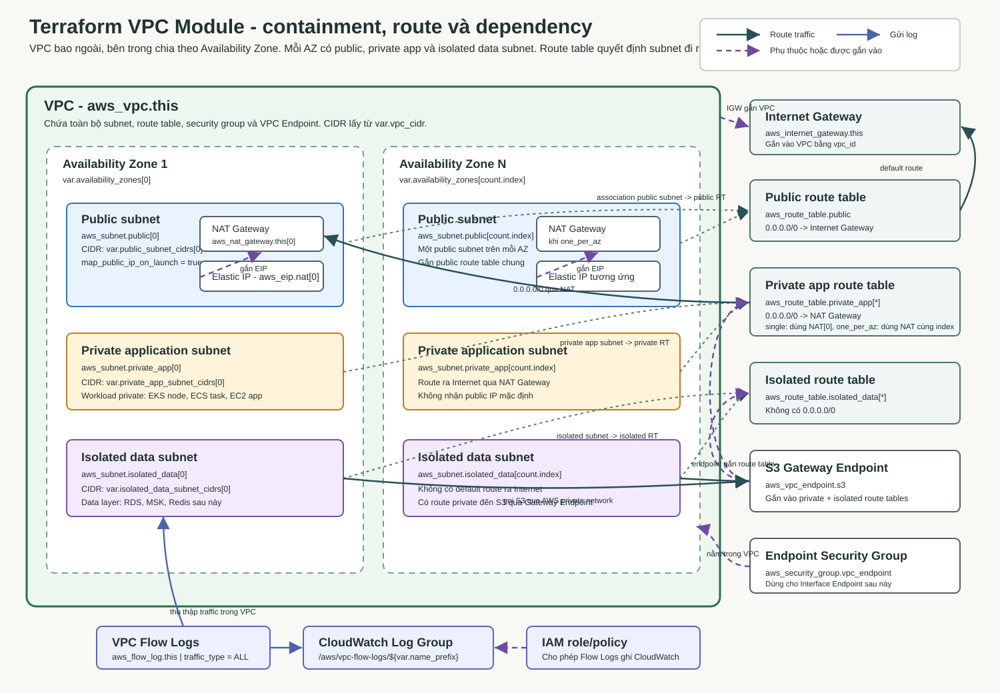

# VPC Module

Module này dùng để tạo VPC và các thành phần network nền có thể dùng lại cho nhiều môi trường.

Các root module có thể gọi lại module này với giá trị khác nhau:

```text
terraform/environments/dev/network
terraform/environments/staging/network
terraform/environments/production/network
```

Module không hard-code giá trị riêng của `dev`, `staging` hoặc `production`. Khác biệt giữa môi trường phải nằm ở root module hoặc file `.tfvars`.

## Module này tạo gì?

Module hiện tạo các nhóm resource chính:

- VPC.
- Internet Gateway.
- Public subnets.
- Private application subnets.
- Isolated data subnets.
- Elastic IP cho NAT Gateway.
- NAT Gateway theo chế độ `single` hoặc `one_per_az`.
- Route table cho từng nhóm subnet.
- Route table association.
- S3 Gateway VPC Endpoint.
- Security group nền cho Interface VPC Endpoint sau này.
- CloudWatch Log Group cho VPC Flow Logs nếu bật.
- IAM role/policy cho VPC Flow Logs nếu bật.
- VPC Flow Logs nếu bật.

Module này chưa tạo EKS, RDS, MSK, ElastiCache hoặc workload ứng dụng.

## Sơ đồ liên kết thành phần



Luồng chính:

- Khung lớn `VPC` bao toàn bộ các thành phần network nội bộ.
- Mỗi khung `Availability Zone` chứa đủ ba lớp subnet: public, private application và isolated data.
- NAT Gateway nằm trong public subnet; Elastic IP được gắn vào NAT Gateway.
- Public subnet dùng public route table để đi Internet qua Internet Gateway.
- Private application subnet dùng private route table để đi Internet ra ngoài qua NAT Gateway.
- Isolated data subnet không có default route ra Internet, chỉ được gắn S3 Gateway Endpoint để gọi S3 qua đường riêng của AWS.
- VPC Flow Logs gửi log về CloudWatch Logs thông qua IAM role/policy.
- Security group `vpc_endpoint` được chuẩn bị cho các Interface VPC Endpoint sau này.

Chú giải trong ảnh:

- Mũi tên liền là đường route traffic.
- Mũi tên đứt là quan hệ phụ thuộc hoặc quan hệ được gắn vào.
- Mũi tên xanh là luồng gửi log.

## Nguyên tắc network

Public subnet có route:

```text
0.0.0.0/0 -> Internet Gateway
```

Private application subnet có route:

```text
0.0.0.0/0 -> NAT Gateway
```

Isolated data subnet không có route mặc định ra Internet Gateway hoặc NAT Gateway. Đây là subnet dành cho data layer sau này.

Với lab cá nhân, `nat_gateway_mode = "single"` giúp giảm chi phí vì chỉ tạo một NAT Gateway. Với môi trường cần khả dụng cao hơn, `nat_gateway_mode = "one_per_az"` tạo một NAT Gateway cho mỗi AZ.

## Các file trong module

| File | Vai trò |
|---|---|
| `variables.tf` | Khai báo interface đầu vào của module. |
| `main.tf` | Tạo VPC, subnet, route table, gateway, endpoint, security group và flow logs. |
| `outputs.tf` | Trả giá trị từ module về root module. |
| `README.md` | Giải thích phạm vi, kiến trúc và từng phần trong module. |
| `vpc-architecture.svg` | Ảnh minh họa liên kết các thành phần network. |

## Input của module

| Biến | Ý nghĩa |
|---|---|
| `name_prefix` | Tiền tố đặt tên resource, ví dụ `newgate2601-dev`. |
| `vpc_cidr` | CIDR block của VPC, ví dụ `10.20.0.0/16`. |
| `availability_zones` | Danh sách AZ dùng để chia subnet. |
| `public_subnet_cidrs` | CIDR cho public subnets. |
| `private_app_subnet_cidrs` | CIDR cho private application subnets. |
| `isolated_data_subnet_cidrs` | CIDR cho isolated data subnets. |
| `nat_gateway_mode` | Chế độ tạo NAT Gateway: `single` hoặc `one_per_az`. |
| `enable_vpc_flow_logs` | Bật/tắt VPC Flow Logs. |
| `tags` | Map tag chung truyền từ root module xuống. |

Root module `dev/network` truyền các giá trị này trong `main.tf`.

## Output của module

Module trả về các giá trị nền để root module sau dùng lại:

- `name_prefix`
- `vpc_id`
- `public_subnet_ids`
- `private_app_subnet_ids`
- `isolated_data_subnet_ids`
- `public_route_table_id`
- `private_app_route_table_ids`
- `isolated_data_route_table_ids`
- `vpc_endpoint_security_group_id`

Các root module khác như `dev/eks`, `dev/data` hoặc `dev/observability` sẽ dùng output network để gắn EKS, RDS, MSK, Redis và logging vào đúng VPC/subnet.

## Thứ tự logic trong `main.tf`

Terraform không chạy file theo kiểu script từ trên xuống dưới một cách máy móc. Terraform đọc toàn bộ resource, dựng dependency graph từ các reference như `aws_vpc.this.id`, rồi tạo resource theo thứ tự phụ thuộc.

Luồng logic của file:

```text
1. Data source
   -> đọc AWS region hiện tại

2. Locals
   -> tính số AZ
   -> tính số NAT Gateway cần tạo

3. VPC
   -> tạo mạng chính bằng vpc_cidr

4. Internet Gateway
   -> gắn cổng Internet vào VPC

5. Subnets
   -> tạo public subnets
   -> tạo private application subnets
   -> tạo isolated data subnets

6. Internet egress
   -> tạo Elastic IP
   -> tạo NAT Gateway trong public subnet

7. Route tables
   -> public route table đi Internet Gateway
   -> private app route table đi NAT Gateway
   -> isolated data route table không có default route Internet

8. Route table associations
   -> gắn subnet vào đúng route table

9. VPC endpoints
   -> tạo security group nền cho Interface Endpoint sau này
   -> tạo S3 Gateway Endpoint

10. Flow logs
   -> tạo CloudWatch Log Group
   -> tạo IAM role/policy
   -> bật VPC Flow Logs
```

## Giải thích từng dòng trong `main.tf`

### Data source đọc AWS region

```hcl
data "aws_region" "current" {}
```

| Dòng | Giải thích |
|---|---|
| `data "aws_region" "current" {}` | Khai báo data source để đọc region AWS hiện tại từ provider. Module dùng giá trị này khi tạo service name cho S3 Gateway Endpoint, ví dụ `com.amazonaws.ap-southeast-1.s3`. |

#### Chi tiết data source `aws_region`

Data source trong Terraform dùng để đọc thông tin đã tồn tại, không tạo resource mới. `aws_region.current` chỉ hỏi AWS provider rằng hiện tại Terraform đang chạy ở region nào.

Các thành phần bên trong:

| Thành phần | Ý nghĩa |
|---|---|
| `data` | Khai báo đây là data source, không phải resource cần tạo. |
| `aws_region` | Loại data source của AWS provider, dùng để lấy region hiện tại. |
| `current` | Tên local trong Terraform để các chỗ khác reference, ví dụ `data.aws_region.current.name`. |
| `{}` | Block rỗng vì data source này không cần input thêm. |

Ví dụ cụ thể:

```text
Provider AWS đang cấu hình region: ap-southeast-1
data.aws_region.current.name = ap-southeast-1
```

Khi module tạo S3 Gateway Endpoint:

```hcl
service_name = "com.amazonaws.${data.aws_region.current.name}.s3"
```

Terraform sẽ render thành:

```text
com.amazonaws.ap-southeast-1.s3
```

Nhờ vậy module không hard-code region. Nếu root module chạy ở `us-east-1`, service name tự đổi thành `com.amazonaws.us-east-1.s3`.

### Local values

```hcl
locals {
  az_count          = length(var.availability_zones)
  nat_gateway_count = var.nat_gateway_mode == "one_per_az" ? local.az_count : 1
}
```

| Dòng | Giải thích |
|---|---|
| `locals {` | Bắt đầu block local values, dùng để đặt các giá trị tính toán nội bộ trong module. |
| `az_count = length(var.availability_zones)` | Đếm số Availability Zone được truyền vào. Nếu có 3 AZ thì `az_count` bằng `3`. |
| `nat_gateway_count = var.nat_gateway_mode == "one_per_az" ? local.az_count : 1` | Tính số NAT Gateway cần tạo. Nếu mode là `one_per_az` thì tạo một NAT Gateway trên mỗi AZ, ngược lại chỉ tạo một NAT Gateway. |
| `}` | Kết thúc block `locals`. |

#### Chi tiết local values

`locals` là nơi đặt biến tính toán nội bộ của module. Khác với `variable`, giá trị trong `locals` không được truyền từ bên ngoài vào mà được module tự tính từ input đã nhận.

Các thành phần bên trong:

| Thành phần | Ý nghĩa |
|---|---|
| `az_count` | Số lượng Availability Zone mà module sẽ trải subnet ra. |
| `length(...)` | Hàm Terraform trả về số phần tử của list. |
| `nat_gateway_count` | Số lượng NAT Gateway cần tạo. Giá trị này được dùng trong `count` của `aws_eip.nat` và `aws_nat_gateway.this`. |
| `condition ? true_value : false_value` | Cú pháp điều kiện của Terraform. Nếu condition đúng thì lấy vế giữa, nếu sai thì lấy vế sau dấu `:`. |

Ví dụ với lab tiết kiệm chi phí:

```hcl
availability_zones = ["ap-southeast-1a", "ap-southeast-1b"]
nat_gateway_mode   = "single"
```

Kết quả:

```text
az_count = 2
nat_gateway_count = 1
```

Terraform sẽ tạo 2 public subnet, 2 private app subnet, 2 isolated data subnet, nhưng chỉ tạo 1 NAT Gateway.

Ví dụ với môi trường cần khả dụng cao hơn:

```hcl
availability_zones = ["ap-southeast-1a", "ap-southeast-1b", "ap-southeast-1c"]
nat_gateway_mode   = "one_per_az"
```

Kết quả:

```text
az_count = 3
nat_gateway_count = 3
```

Terraform sẽ tạo 3 NAT Gateway, mỗi AZ có một NAT Gateway riêng để private subnet trong AZ đó không phụ thuộc vào NAT ở AZ khác.

### VPC

```hcl
# VPC
resource "aws_vpc" "this" {
  cidr_block           = var.vpc_cidr
  enable_dns_hostnames = true
  enable_dns_support   = true

  tags = merge(var.tags, {
    Name = "${var.name_prefix}-vpc"
  })
}
```

| Dòng | Giải thích |
|---|---|
| `# VPC` | Comment đánh dấu phần tạo VPC chính. |
| `resource "aws_vpc" "this" {` | Khai báo resource AWS VPC. Tên local trong Terraform là `aws_vpc.this`. |
| `cidr_block = var.vpc_cidr` | Gán CIDR block cho VPC từ biến đầu vào, ví dụ `10.20.0.0/16`. |
| `enable_dns_hostnames = true` | Bật DNS hostname cho resource trong VPC. Tùy chọn này hữu ích cho EC2, EKS và nhiều dịch vụ AWS khác. |
| `enable_dns_support = true` | Bật DNS resolver nội bộ của VPC. Nếu tắt, nhiều tên miền nội bộ AWS sẽ không resolve đúng. |
| `tags = merge(var.tags, {` | Ghép tag chung truyền từ root module với tag riêng của resource này. |
| `Name = "${var.name_prefix}-vpc"` | Đặt tag `Name`, ví dụ `newgate2601-dev-vpc`. |
| `})` | Kết thúc hàm `merge` cho tag. |
| `}` | Kết thúc resource `aws_vpc.this`. |

#### Chi tiết config VPC

VPC là mạng riêng ảo trong AWS. Tất cả subnet, route table, security group, NAT Gateway, VPC Endpoint và Flow Logs trong module này đều thuộc về VPC này.

Các thành phần bên trong:

| Thành phần | Ý nghĩa |
|---|---|
| `cidr_block` | Dải IP lớn của toàn VPC. Tất cả subnet bên trong VPC phải lấy CIDR nhỏ hơn nằm trong dải này. |
| `enable_dns_support` | Bật DNS resolver nội bộ của AWS cho VPC. |
| `enable_dns_hostnames` | Cho phép resource trong VPC có DNS hostname. |
| `tags` | Metadata để đặt tên, phân loại, quản lý chi phí và tìm resource dễ hơn. |

Ví dụ cụ thể:

```hcl
vpc_cidr = "10.20.0.0/16"
```

VPC sẽ có dải IP:

```text
10.20.0.0 -> 10.20.255.255
```

Các subnet hợp lệ có thể là:

```text
10.20.1.0/24    public subnet
10.20.11.0/24   private app subnet
10.20.21.0/24   isolated data subnet
```

Các subnet không hợp lệ nếu nằm ngoài VPC CIDR:

```text
10.30.1.0/24
172.16.1.0/24
```

Vì các CIDR này không nằm trong `10.20.0.0/16`, AWS sẽ không cho tạo subnet trong VPC này.

Ví dụ tag sau khi merge:

```hcl
var.tags = {
  Environment = "dev"
  Project     = "springboot-learning"
}
```

Resource VPC sẽ có tag:

```text
Environment = dev
Project     = springboot-learning
Name        = newgate2601-dev-vpc
```

### Internet Gateway

```hcl
resource "aws_internet_gateway" "this" {
  vpc_id = aws_vpc.this.id

  tags = merge(var.tags, {
    Name = "${var.name_prefix}-igw"
  })
}
```

| Dòng | Giải thích |
|---|---|
| `resource "aws_internet_gateway" "this" {` | Khai báo Internet Gateway, là cổng để VPC có thể kết nối Internet. |
| `vpc_id = aws_vpc.this.id` | Gắn Internet Gateway vào VPC vừa tạo. Reference này cũng tạo dependency: phải có VPC trước rồi mới có Internet Gateway. |
| `tags = merge(var.tags, {` | Ghép tag chung với tag riêng. |
| `Name = "${var.name_prefix}-igw"` | Đặt tên cho Internet Gateway, ví dụ `newgate2601-dev-igw`. |
| `})` | Kết thúc hàm `merge`. |
| `}` | Kết thúc resource Internet Gateway. |

Internet Gateway chưa tự làm subnet thành public. Subnet chỉ public khi route table của subnet có route `0.0.0.0/0` trỏ tới Internet Gateway.

#### Chi tiết config Internet Gateway

Internet Gateway là cổng Internet được gắn vào VPC. Nó cho phép traffic ra/vào Internet khi route table và resource phía trong cũng cho phép.

Các thành phần bên trong:

| Thành phần | Ý nghĩa |
|---|---|
| `vpc_id` | ID của VPC mà Internet Gateway được attach vào. |
| `tags` | Tag định danh Internet Gateway. |

Ví dụ cụ thể:

```text
VPC: vpc-abc123
Internet Gateway: igw-def456
Route public: 0.0.0.0/0 -> igw-def456
```

Một EC2 trong public subnet có public IP có thể đi Internet theo luồng:

```text
EC2 private IP/public IP
-> public subnet
-> public route table
-> 0.0.0.0/0 trỏ tới Internet Gateway
-> Internet
```

Nếu chỉ tạo Internet Gateway nhưng chưa có route `0.0.0.0/0 -> igw`, subnet vẫn chưa đi Internet được. Nếu có route nhưng EC2 không có public IP hoặc không qua Load Balancer public, Internet bên ngoài cũng không chủ động vào EC2 được.

### Public subnets

```hcl
# Subnets
resource "aws_subnet" "public" {
  count = local.az_count

  vpc_id                  = aws_vpc.this.id
  cidr_block              = var.public_subnet_cidrs[count.index]
  availability_zone       = var.availability_zones[count.index]
  map_public_ip_on_launch = true

  tags = merge(var.tags, {
    Name = "${var.name_prefix}-public-${count.index + 1}"
    Tier = "public"
  })
}
```

| Dòng | Giải thích |
|---|---|
| `# Subnets` | Comment đánh dấu phần tạo các subnet. |
| `resource "aws_subnet" "public" {` | Khai báo nhóm public subnet. Vì có `count`, Terraform sẽ tạo nhiều subnet cùng loại. |
| `count = local.az_count` | Tạo một public subnet cho mỗi Availability Zone. |
| `vpc_id = aws_vpc.this.id` | Đặt subnet này vào VPC chính. |
| `cidr_block = var.public_subnet_cidrs[count.index]` | Lấy CIDR của public subnet theo index hiện tại, ví dụ phần tử thứ nhất cho AZ thứ nhất. |
| `availability_zone = var.availability_zones[count.index]` | Đặt subnet vào AZ tương ứng với index hiện tại. |
| `map_public_ip_on_launch = true` | Cho phép resource tạo trong subnet này tự nhận public IP nếu loại resource hỗ trợ. |
| `tags = merge(var.tags, {` | Ghép tag chung với tag riêng cho subnet. |
| `Name = "${var.name_prefix}-public-${count.index + 1}"` | Đặt tên public subnet theo số thứ tự bắt đầu từ 1. |
| `Tier = "public"` | Đánh dấu subnet thuộc tầng public. |
| `})` | Kết thúc hàm `merge`. |
| `}` | Kết thúc resource public subnet. |

#### Chi tiết config public subnet

Public subnet là subnet dành cho các thành phần cần chạm Internet trực tiếp hoặc làm điểm ra Internet cho resource private.

Các thành phần bên trong:

| Thành phần | Ý nghĩa |
|---|---|
| `count` | Tạo nhiều public subnet, mỗi subnet ứng với một AZ. |
| `vpc_id` | Subnet nằm trong VPC nào. |
| `cidr_block` | Dải IP riêng của subnet. Dải này phải nằm trong `var.vpc_cidr`. |
| `availability_zone` | AZ nơi subnet được tạo. |
| `map_public_ip_on_launch` | Tự gán public IP cho EC2 khi launch trong subnet nếu instance dùng setting mặc định của subnet. |
| `Tier = "public"` | Tag giúp phân biệt subnet public với private và isolated. |

Ví dụ cụ thể:

```hcl
availability_zones   = ["ap-southeast-1a", "ap-southeast-1b"]
public_subnet_cidrs  = ["10.20.1.0/24", "10.20.2.0/24"]
```

Terraform tạo:

```text
aws_subnet.public[0]
  AZ: ap-southeast-1a
  CIDR: 10.20.1.0/24
  Name: newgate2601-dev-public-1

aws_subnet.public[1]
  AZ: ap-southeast-1b
  CIDR: 10.20.2.0/24
  Name: newgate2601-dev-public-2
```

Khi public subnet được association với public route table:

```text
10.20.1.25 -> 8.8.8.8
public subnet -> public route table -> Internet Gateway -> Internet
```

NAT Gateway cũng được đặt trong public subnet vì NAT Gateway cần đi được Internet thông qua Internet Gateway.

### Private application subnets

```hcl
resource "aws_subnet" "private_app" {
  count = local.az_count

  vpc_id            = aws_vpc.this.id
  cidr_block        = var.private_app_subnet_cidrs[count.index]
  availability_zone = var.availability_zones[count.index]

  tags = merge(var.tags, {
    Name = "${var.name_prefix}-private-app-${count.index + 1}"
    Tier = "private-app"
  })
}
```

| Dòng | Giải thích |
|---|---|
| `resource "aws_subnet" "private_app" {` | Khai báo nhóm subnet private dành cho application workload. |
| `count = local.az_count` | Tạo một private app subnet cho mỗi AZ. |
| `vpc_id = aws_vpc.this.id` | Đặt subnet vào VPC chính. |
| `cidr_block = var.private_app_subnet_cidrs[count.index]` | Lấy CIDR private app subnet theo index hiện tại. |
| `availability_zone = var.availability_zones[count.index]` | Đặt subnet vào AZ tương ứng. |
| `tags = merge(var.tags, {` | Ghép tag chung với tag riêng. |
| `Name = "${var.name_prefix}-private-app-${count.index + 1}"` | Đặt tên private app subnet theo số thứ tự. |
| `Tier = "private-app"` | Đánh dấu subnet thuộc tầng private application. |
| `})` | Kết thúc hàm `merge`. |
| `}` | Kết thúc resource private app subnet. |

Subnet này thường dùng cho EKS node, ECS task, EC2 application hoặc service nội bộ. Nó không tự có public IP và đi Internet outbound qua NAT Gateway.

#### Chi tiết config private application subnet

Private application subnet là nơi đặt workload ứng dụng không cần nhận kết nối trực tiếp từ Internet. Nó vẫn có thể đi ra Internet để pull image, gọi API ngoài hoặc cập nhật package nếu route table trỏ tới NAT Gateway.

Các thành phần bên trong:

| Thành phần | Ý nghĩa |
|---|---|
| `count` | Tạo một private app subnet trên mỗi AZ. |
| `vpc_id` | Subnet nằm trong VPC chính. |
| `cidr_block` | Dải IP dành cho workload ứng dụng private. |
| `availability_zone` | AZ nơi subnet được tạo. |
| `Tier = "private-app"` | Tag đánh dấu subnet dành cho application workload private. |

Ví dụ cụ thể:

```hcl
private_app_subnet_cidrs = ["10.20.11.0/24", "10.20.12.0/24"]
```

Terraform tạo:

```text
aws_subnet.private_app[0] -> 10.20.11.0/24 trong ap-southeast-1a
aws_subnet.private_app[1] -> 10.20.12.0/24 trong ap-southeast-1b
```

Một EKS node trong private app subnet có IP `10.20.11.25` muốn pull Docker image từ Internet:

```text
10.20.11.25
-> private app subnet
-> private app route table
-> NAT Gateway trong public subnet
-> Internet Gateway
-> Internet
```

Internet bên ngoài không thể chủ động gọi thẳng vào `10.20.11.25` vì resource này không có public IP và subnet không route inbound trực tiếp từ Internet Gateway.

### Isolated data subnets

```hcl
resource "aws_subnet" "isolated_data" {
  count = local.az_count

  vpc_id            = aws_vpc.this.id
  cidr_block        = var.isolated_data_subnet_cidrs[count.index]
  availability_zone = var.availability_zones[count.index]

  tags = merge(var.tags, {
    Name = "${var.name_prefix}-isolated-data-${count.index + 1}"
    Tier = "isolated-data"
  })
}
```

| Dòng | Giải thích |
|---|---|
| `resource "aws_subnet" "isolated_data" {` | Khai báo nhóm subnet cô lập dành cho data layer. |
| `count = local.az_count` | Tạo một isolated data subnet cho mỗi AZ. |
| `vpc_id = aws_vpc.this.id` | Đặt subnet vào VPC chính. |
| `cidr_block = var.isolated_data_subnet_cidrs[count.index]` | Lấy CIDR isolated data subnet theo index hiện tại. |
| `availability_zone = var.availability_zones[count.index]` | Đặt subnet vào AZ tương ứng. |
| `tags = merge(var.tags, {` | Ghép tag chung với tag riêng. |
| `Name = "${var.name_prefix}-isolated-data-${count.index + 1}"` | Đặt tên isolated data subnet theo số thứ tự. |
| `Tier = "isolated-data"` | Đánh dấu subnet thuộc tầng isolated data. |
| `})` | Kết thúc hàm `merge`. |
| `}` | Kết thúc resource isolated data subnet. |

Subnet này dành cho RDS, MSK, Redis hoặc các thành phần dữ liệu cần hạn chế đường ra Internet.

#### Chi tiết config isolated data subnet

Isolated data subnet là subnet cô lập hơn private app subnet. Nó không có default route ra Internet Gateway hoặc NAT Gateway. Mục tiêu là đặt data layer vào khu vực ít đường ra/vào hơn.

Các thành phần bên trong:

| Thành phần | Ý nghĩa |
|---|---|
| `count` | Tạo một isolated data subnet trên mỗi AZ. |
| `vpc_id` | Subnet nằm trong VPC chính. |
| `cidr_block` | Dải IP dành cho data layer. |
| `availability_zone` | AZ nơi subnet được tạo. |
| `Tier = "isolated-data"` | Tag đánh dấu subnet dành cho data layer. |

Ví dụ cụ thể:

```hcl
isolated_data_subnet_cidrs = ["10.20.21.0/24", "10.20.22.0/24"]
```

Terraform tạo:

```text
aws_subnet.isolated_data[0] -> 10.20.21.0/24 trong ap-southeast-1a
aws_subnet.isolated_data[1] -> 10.20.22.0/24 trong ap-southeast-1b
```

Ví dụ RDS có IP `10.20.21.30` trong isolated subnet:

```text
App trong private subnet -> RDS trong isolated subnet:3306
```

Luồng này có thể hoạt động nếu security group của RDS cho phép app truy cập. Nhưng RDS không có đường mặc định đi Internet:

```text
10.20.21.30 -> 8.8.8.8
isolated route table không có 0.0.0.0/0
=> Không có route Internet mặc định
```

Nếu subnet này cần gọi S3, module gắn S3 Gateway Endpoint vào isolated route table để đi qua mạng riêng của AWS, không cần NAT Gateway.

### Elastic IP cho NAT Gateway

```hcl
# Internet egress
resource "aws_eip" "nat" {
  count = local.nat_gateway_count

  domain = "vpc"

  tags = merge(var.tags, {
    Name = "${var.name_prefix}-nat-eip-${count.index + 1}"
  })
}
```

| Dòng | Giải thích |
|---|---|
| `# Internet egress` | Comment đánh dấu phần cấu hình outbound Internet. |
| `resource "aws_eip" "nat" {` | Khai báo Elastic IP dùng cho NAT Gateway. |
| `count = local.nat_gateway_count` | Tạo số Elastic IP bằng số NAT Gateway cần có. |
| `domain = "vpc"` | Chỉ định Elastic IP dùng trong phạm vi VPC. |
| `tags = merge(var.tags, {` | Ghép tag chung với tag riêng. |
| `Name = "${var.name_prefix}-nat-eip-${count.index + 1}"` | Đặt tên Elastic IP theo số thứ tự. |
| `})` | Kết thúc hàm `merge`. |
| `}` | Kết thúc resource Elastic IP. |

Elastic IP là public IP cố định gắn vào NAT Gateway.

#### Chi tiết config Elastic IP

Elastic IP là địa chỉ IPv4 public cố định do AWS cấp. Trong module này, Elastic IP không gắn trực tiếp vào EC2 mà gắn vào NAT Gateway.

Các thành phần bên trong:

| Thành phần | Ý nghĩa |
|---|---|
| `count` | Số lượng Elastic IP cần tạo, bằng số NAT Gateway. |
| `domain = "vpc"` | Elastic IP được dùng trong VPC. |
| `tags` | Tag định danh Elastic IP của NAT Gateway. |

Ví dụ với `nat_gateway_mode = "single"`:

```text
nat_gateway_count = 1
aws_eip.nat[0] -> public IP cố định cho aws_nat_gateway.this[0]
```

Ví dụ với `nat_gateway_mode = "one_per_az"` và 3 AZ:

```text
nat_gateway_count = 3
aws_eip.nat[0] -> NAT Gateway AZ 1
aws_eip.nat[1] -> NAT Gateway AZ 2
aws_eip.nat[2] -> NAT Gateway AZ 3
```

Vì NAT Gateway dùng Elastic IP, khi private app subnet đi Internet, phía service bên ngoài sẽ nhìn thấy source IP là Elastic IP của NAT Gateway, không phải private IP thật của workload.

Ví dụ:

```text
EKS node private IP: 10.20.11.25
NAT Gateway Elastic IP: 13.250.10.20
External API thấy source IP: 13.250.10.20
```

### NAT Gateway

```hcl
resource "aws_nat_gateway" "this" {
  count = local.nat_gateway_count

  allocation_id = aws_eip.nat[count.index].id
  subnet_id     = aws_subnet.public[count.index].id

  tags = merge(var.tags, {
    Name = "${var.name_prefix}-nat-${count.index + 1}"
  })

  depends_on = [aws_internet_gateway.this]
}
```

| Dòng | Giải thích |
|---|---|
| `resource "aws_nat_gateway" "this" {` | Khai báo NAT Gateway để private subnet có thể đi Internet outbound. |
| `count = local.nat_gateway_count` | Tạo một hoặc nhiều NAT Gateway tùy `nat_gateway_mode`. |
| `allocation_id = aws_eip.nat[count.index].id` | Gắn Elastic IP cùng index vào NAT Gateway. |
| `subnet_id = aws_subnet.public[count.index].id` | Đặt NAT Gateway trong public subnet cùng index. NAT Gateway phải nằm ở public subnet để đi được Internet. |
| `tags = merge(var.tags, {` | Ghép tag chung với tag riêng. |
| `Name = "${var.name_prefix}-nat-${count.index + 1}"` | Đặt tên NAT Gateway theo số thứ tự. |
| `})` | Kết thúc hàm `merge`. |
| `depends_on = [aws_internet_gateway.this]` | Yêu cầu Terraform tạo Internet Gateway trước NAT Gateway. |
| `}` | Kết thúc resource NAT Gateway. |

#### Chi tiết config NAT Gateway

NAT Gateway cho phép resource trong private subnet đi ra Internet theo chiều outbound, nhưng không cho Internet chủ động mở kết nối ngược vào private resource.

Các thành phần bên trong:

| Thành phần | Ý nghĩa |
|---|---|
| `count` | Số NAT Gateway được tạo theo `nat_gateway_count`. |
| `allocation_id` | ID của Elastic IP gắn vào NAT Gateway. |
| `subnet_id` | Public subnet nơi NAT Gateway được đặt. |
| `depends_on` | Ép Terraform tạo Internet Gateway trước để NAT Gateway có đường Internet ổn định khi khởi tạo. |
| `tags` | Tag định danh NAT Gateway. |

Ví dụ với mode `single`:

```text
aws_nat_gateway.this[0]
  nằm trong aws_subnet.public[0]
  dùng aws_eip.nat[0]

aws_route_table.private_app[0] -> NAT[0]
aws_route_table.private_app[1] -> NAT[0]
aws_route_table.private_app[2] -> NAT[0]
```

Ưu điểm là rẻ hơn vì chỉ có một NAT Gateway. Nhược điểm là nếu AZ chứa NAT Gateway gặp sự cố, private subnet ở AZ khác cũng có thể bị ảnh hưởng đường outbound.

Ví dụ với mode `one_per_az`:

```text
aws_nat_gateway.this[0] nằm trong public subnet AZ 1
aws_nat_gateway.this[1] nằm trong public subnet AZ 2
aws_nat_gateway.this[2] nằm trong public subnet AZ 3

private route table AZ 1 -> NAT[0]
private route table AZ 2 -> NAT[1]
private route table AZ 3 -> NAT[2]
```

Ưu điểm là đúng mô hình high availability hơn. Nhược điểm là chi phí cao hơn vì NAT Gateway tính phí theo giờ và theo lượng data xử lý.

Ví dụ luồng outbound:

```text
App 10.20.11.25 trong private app subnet
-> route 0.0.0.0/0 của private route table
-> NAT Gateway trong public subnet
-> Internet Gateway
-> https://example.com
```

Luồng inbound từ Internet vào app private không được mở tự động:

```text
Internet -> NAT Gateway -> App private
=> Không hoạt động theo kiểu chủ động inbound
```

### Public route table

```hcl
# Route tables
resource "aws_route_table" "public" {
  vpc_id = aws_vpc.this.id

  route {
    cidr_block = "0.0.0.0/0"
    gateway_id = aws_internet_gateway.this.id
  }

  tags = merge(var.tags, {
    Name = "${var.name_prefix}-public-rt"
    Tier = "public"
  })
}
```

| Dòng | Giải thích |
|---|---|
| `# Route tables` | Comment đánh dấu phần route table. |
| `resource "aws_route_table" "public" {` | Khai báo public route table. |
| `vpc_id = aws_vpc.this.id` | Tạo route table trong VPC chính. |
| `route {` | Bắt đầu khai báo một route trong route table. |
| `cidr_block = "0.0.0.0/0"` | Route mặc định cho mọi IPv4 destination không match route cụ thể hơn. |
| `gateway_id = aws_internet_gateway.this.id` | Gửi traffic mặc định ra Internet Gateway. Đây là điểm làm subnet gắn route table này trở thành public subnet. |
| `}` | Kết thúc block route. |
| `tags = merge(var.tags, {` | Ghép tag chung với tag riêng. |
| `Name = "${var.name_prefix}-public-rt"` | Đặt tên public route table. |
| `Tier = "public"` | Đánh dấu route table thuộc tầng public. |
| `})` | Kết thúc hàm `merge`. |
| `}` | Kết thúc public route table. |

#### Chi tiết config public route table

Route table quyết định gói tin rời subnet sẽ đi đâu. Public route table trong module này có default route ra Internet Gateway.

Các thành phần bên trong:

| Thành phần | Ý nghĩa |
|---|---|
| `vpc_id` | Route table thuộc VPC nào. |
| `route` | Một rule định tuyến trong route table. |
| `cidr_block = "0.0.0.0/0"` | Destination mặc định cho mọi IPv4 ngoài các route cụ thể hơn. |
| `gateway_id` | Target của route là Internet Gateway. |
| `Tier = "public"` | Tag đánh dấu route table public. |

Ví dụ route lookup:

```text
Destination: 8.8.8.8
Route table có 0.0.0.0/0 -> Internet Gateway
=> Gửi traffic ra Internet Gateway
```

Ví dụ public subnet association:

```text
aws_subnet.public[0] -> aws_route_table.public
aws_subnet.public[1] -> aws_route_table.public
```

Khi một EC2 có public IP trong public subnet gọi Internet:

```text
EC2 -> public route table -> Internet Gateway -> Internet
```

Khi Internet gọi vào EC2 public:

```text
Internet -> Internet Gateway -> public route table -> EC2 public IP
```

Luồng inbound này còn phụ thuộc security group/NACL của EC2. Route đúng chưa đủ để cho phép kết nối.

### Private application route tables

```hcl
resource "aws_route_table" "private_app" {
  count = local.az_count

  vpc_id = aws_vpc.this.id

  route {
    cidr_block     = "0.0.0.0/0"
    nat_gateway_id = aws_nat_gateway.this[var.nat_gateway_mode == "one_per_az" ? count.index : 0].id
  }

  tags = merge(var.tags, {
    Name = "${var.name_prefix}-private-app-rt-${count.index + 1}"
    Tier = "private-app"
  })
}
```

| Dòng | Giải thích |
|---|---|
| `resource "aws_route_table" "private_app" {` | Khai báo route table cho private application subnet. |
| `count = local.az_count` | Tạo một private route table cho mỗi AZ. |
| `vpc_id = aws_vpc.this.id` | Tạo route table trong VPC chính. |
| `route {` | Bắt đầu route mặc định. |
| `cidr_block = "0.0.0.0/0"` | Route mặc định cho traffic đi ra ngoài VPC. |
| `nat_gateway_id = aws_nat_gateway.this[var.nat_gateway_mode == "one_per_az" ? count.index : 0].id` | Gửi traffic mặc định qua NAT Gateway. Nếu mode `one_per_az`, route table AZ nào dùng NAT cùng index; nếu mode `single`, tất cả dùng NAT đầu tiên. |
| `}` | Kết thúc block route. |
| `tags = merge(var.tags, {` | Ghép tag chung với tag riêng. |
| `Name = "${var.name_prefix}-private-app-rt-${count.index + 1}"` | Đặt tên private app route table theo số thứ tự. |
| `Tier = "private-app"` | Đánh dấu route table thuộc tầng private application. |
| `})` | Kết thúc hàm `merge`. |
| `}` | Kết thúc private app route table. |

#### Chi tiết config private application route table

Private app route table cho workload private đi Internet outbound qua NAT Gateway. Nó không trỏ trực tiếp tới Internet Gateway.

Các thành phần bên trong:

| Thành phần | Ý nghĩa |
|---|---|
| `count` | Tạo một route table private app cho mỗi AZ. |
| `vpc_id` | Route table thuộc VPC chính. |
| `cidr_block = "0.0.0.0/0"` | Default route cho traffic đi ngoài VPC. |
| `nat_gateway_id` | Target của default route là NAT Gateway. |
| `var.nat_gateway_mode == "one_per_az" ? count.index : 0` | Chọn NAT Gateway cùng AZ nếu mode `one_per_az`, hoặc NAT đầu tiên nếu mode `single`. |

Ví dụ mode `single` với 2 AZ:

```text
aws_route_table.private_app[0] route 0.0.0.0/0 -> aws_nat_gateway.this[0]
aws_route_table.private_app[1] route 0.0.0.0/0 -> aws_nat_gateway.this[0]
```

Ví dụ mode `one_per_az` với 2 AZ:

```text
aws_route_table.private_app[0] route 0.0.0.0/0 -> aws_nat_gateway.this[0]
aws_route_table.private_app[1] route 0.0.0.0/0 -> aws_nat_gateway.this[1]
```

Ví dụ route lookup từ app:

```text
Source: 10.20.11.25
Destination: 52.216.10.20
Route table: private_app[0]
Matched route: 0.0.0.0/0 -> NAT Gateway
=> Traffic đi qua NAT, sau đó ra Internet Gateway
```

Nếu bỏ route này, private app subnet vẫn nói chuyện được với resource trong VPC qua local route mặc định của VPC, nhưng không đi Internet được.

### Isolated data route tables

```hcl
resource "aws_route_table" "isolated_data" {
  count = local.az_count

  vpc_id = aws_vpc.this.id

  tags = merge(var.tags, {
    Name = "${var.name_prefix}-isolated-data-rt-${count.index + 1}"
    Tier = "isolated-data"
  })
}
```

| Dòng | Giải thích |
|---|---|
| `resource "aws_route_table" "isolated_data" {` | Khai báo route table cho isolated data subnet. |
| `count = local.az_count` | Tạo một isolated route table cho mỗi AZ. |
| `vpc_id = aws_vpc.this.id` | Tạo route table trong VPC chính. |
| `tags = merge(var.tags, {` | Ghép tag chung với tag riêng. |
| `Name = "${var.name_prefix}-isolated-data-rt-${count.index + 1}"` | Đặt tên isolated data route table theo số thứ tự. |
| `Tier = "isolated-data"` | Đánh dấu route table thuộc tầng isolated data. |
| `})` | Kết thúc hàm `merge`. |
| `}` | Kết thúc isolated data route table. |

Route table này không có route `0.0.0.0/0`, vì vậy isolated data subnet không có đường mặc định ra Internet.

#### Chi tiết config isolated data route table

Isolated route table chỉ giữ local route mặc định của VPC và các route private do endpoint thêm vào. Nó không có default route ra NAT Gateway hoặc Internet Gateway.

Các thành phần bên trong:

| Thành phần | Ý nghĩa |
|---|---|
| `count` | Tạo một isolated route table cho mỗi AZ. |
| `vpc_id` | Route table thuộc VPC chính. |
| Không có `route { cidr_block = "0.0.0.0/0" ... }` | Cố ý không tạo đường mặc định ra Internet. |
| `Tier = "isolated-data"` | Tag đánh dấu route table cho data subnet. |

Ví dụ route lookup:

```text
Source: RDS trong 10.20.21.30
Destination: 8.8.8.8
Route table: isolated_data[0]
Không có 0.0.0.0/0
=> Không có đường ra Internet
```

Ví dụ traffic nội bộ vẫn có thể hoạt động:

```text
App 10.20.11.25 -> RDS 10.20.21.30:3306
Matched route: local route của VPC
=> Có route nội bộ trong VPC
```

Điều kiện còn lại là security group của RDS phải cho phép source từ app.

### Route table association cho public subnet

```hcl
resource "aws_route_table_association" "public" {
  count = local.az_count

  subnet_id      = aws_subnet.public[count.index].id
  route_table_id = aws_route_table.public.id
}
```

| Dòng | Giải thích |
|---|---|
| `resource "aws_route_table_association" "public" {` | Khai báo association để gắn public subnet vào public route table. |
| `count = local.az_count` | Tạo một association cho mỗi public subnet. |
| `subnet_id = aws_subnet.public[count.index].id` | Chọn public subnet theo index hiện tại. |
| `route_table_id = aws_route_table.public.id` | Gắn subnet đó vào public route table chung. |
| `}` | Kết thúc association. |

Nếu chỉ tạo route table mà không association, subnet sẽ không dùng route table đó.

#### Chi tiết association public subnet

Association là bước gắn subnet vào route table cụ thể. Resource route table chỉ là “bảng luật”; subnet chỉ dùng bảng luật đó khi có association.

Các thành phần bên trong:

| Thành phần | Ý nghĩa |
|---|---|
| `count` | Tạo một association cho mỗi public subnet. |
| `subnet_id` | Public subnet được gắn route table. |
| `route_table_id` | Public route table được gắn vào subnet. |

Ví dụ:

```text
aws_subnet.public[0] -> aws_route_table.public
aws_subnet.public[1] -> aws_route_table.public
```

Sau association, cả hai public subnet đều dùng route:

```text
0.0.0.0/0 -> Internet Gateway
```

Nếu thiếu association này, public subnet có thể rơi về main route table mặc định của VPC. Khi đó dù đã tạo public route table, subnet vẫn chưa chắc đi Internet đúng như mong muốn.

### Route table association cho private app subnet

```hcl
resource "aws_route_table_association" "private_app" {
  count = local.az_count

  subnet_id      = aws_subnet.private_app[count.index].id
  route_table_id = aws_route_table.private_app[count.index].id
}
```

| Dòng | Giải thích |
|---|---|
| `resource "aws_route_table_association" "private_app" {` | Khai báo association cho private app subnet. |
| `count = local.az_count` | Tạo một association cho mỗi private app subnet. |
| `subnet_id = aws_subnet.private_app[count.index].id` | Chọn private app subnet theo index hiện tại. |
| `route_table_id = aws_route_table.private_app[count.index].id` | Gắn subnet vào private app route table cùng index. |
| `}` | Kết thúc association. |

#### Chi tiết association private app subnet

Association này gắn từng private app subnet với route table private app cùng index. Cách này giúp mỗi AZ có route table riêng.

Các thành phần bên trong:

| Thành phần | Ý nghĩa |
|---|---|
| `subnet_id` | Private app subnet cần gắn route table. |
| `route_table_id` | Private app route table tương ứng. |
| `count.index` | Giữ cùng thứ tự giữa subnet và route table. |

Ví dụ:

```text
aws_subnet.private_app[0] -> aws_route_table.private_app[0]
aws_subnet.private_app[1] -> aws_route_table.private_app[1]
```

Với `one_per_az`, cách gắn cùng index giúp subnet ở AZ nào đi NAT Gateway của AZ đó:

```text
private_app subnet AZ 1 -> private_app RT[0] -> NAT[0]
private_app subnet AZ 2 -> private_app RT[1] -> NAT[1]
```

Với `single`, route table vẫn tách theo AZ nhưng cùng trỏ về NAT đầu tiên:

```text
private_app RT[0] -> NAT[0]
private_app RT[1] -> NAT[0]
```

### Route table association cho isolated data subnet

```hcl
resource "aws_route_table_association" "isolated_data" {
  count = local.az_count

  subnet_id      = aws_subnet.isolated_data[count.index].id
  route_table_id = aws_route_table.isolated_data[count.index].id
}
```

| Dòng | Giải thích |
|---|---|
| `resource "aws_route_table_association" "isolated_data" {` | Khai báo association cho isolated data subnet. |
| `count = local.az_count` | Tạo một association cho mỗi isolated data subnet. |
| `subnet_id = aws_subnet.isolated_data[count.index].id` | Chọn isolated data subnet theo index hiện tại. |
| `route_table_id = aws_route_table.isolated_data[count.index].id` | Gắn subnet vào isolated data route table cùng index. |
| `}` | Kết thúc association. |

#### Chi tiết association isolated data subnet

Association này đảm bảo isolated data subnet dùng đúng isolated route table, tức là không có default route ra Internet.

Các thành phần bên trong:

| Thành phần | Ý nghĩa |
|---|---|
| `subnet_id` | Isolated data subnet cần gắn route table. |
| `route_table_id` | Isolated route table tương ứng. |
| `count.index` | Giữ cùng thứ tự giữa subnet và route table. |

Ví dụ:

```text
aws_subnet.isolated_data[0] -> aws_route_table.isolated_data[0]
aws_subnet.isolated_data[1] -> aws_route_table.isolated_data[1]
```

Khi RDS nằm trong `isolated_data[0]`, nó dùng `isolated_data_rt[0]`. Vì route table này không có `0.0.0.0/0`, RDS không có đường Internet mặc định.

### Security group cho VPC Interface Endpoint

```hcl
# VPC endpoints
resource "aws_security_group" "vpc_endpoint" {
  name        = "${var.name_prefix}-vpc-endpoint-sg"
  description = "Security group for VPC interface endpoints."
  vpc_id      = aws_vpc.this.id

  ingress {
    description = "HTTPS from inside VPC"
    from_port   = 443
    to_port     = 443
    protocol    = "tcp"
    cidr_blocks = [var.vpc_cidr]
  }

  egress {
    description = "All outbound"
    from_port   = 0
    to_port     = 0
    protocol    = "-1"
    cidr_blocks = ["0.0.0.0/0"]
  }

  tags = merge(var.tags, {
    Name = "${var.name_prefix}-vpc-endpoint-sg"
  })
}
```

| Dòng | Giải thích |
|---|---|
| `# VPC endpoints` | Comment đánh dấu phần VPC Endpoint. |
| `resource "aws_security_group" "vpc_endpoint" {` | Khai báo security group dùng cho Interface VPC Endpoint sau này. |
| `name = "${var.name_prefix}-vpc-endpoint-sg"` | Đặt tên security group. |
| `description = "Security group for VPC interface endpoints."` | Mô tả mục đích của security group. |
| `vpc_id = aws_vpc.this.id` | Tạo security group trong VPC chính. |
| `ingress {` | Bắt đầu rule inbound. |
| `description = "HTTPS from inside VPC"` | Mô tả rule: cho phép HTTPS từ bên trong VPC. |
| `from_port = 443` | Port bắt đầu là 443. |
| `to_port = 443` | Port kết thúc là 443. |
| `protocol = "tcp"` | Dùng giao thức TCP. HTTPS chạy trên TCP 443. |
| `cidr_blocks = [var.vpc_cidr]` | Chỉ cho phép nguồn nằm trong CIDR của VPC. |
| `}` | Kết thúc rule ingress. |
| `egress {` | Bắt đầu rule outbound. |
| `description = "All outbound"` | Mô tả rule: cho phép outbound. |
| `from_port = 0` | Port bắt đầu là 0. Với protocol `-1`, giá trị này mang nghĩa tất cả port. |
| `to_port = 0` | Port kết thúc là 0. Với protocol `-1`, giá trị này mang nghĩa tất cả port. |
| `protocol = "-1"` | Cho phép tất cả protocol. |
| `cidr_blocks = ["0.0.0.0/0"]` | Cho phép outbound tới mọi IPv4 destination. |
| `}` | Kết thúc rule egress. |
| `tags = merge(var.tags, {` | Ghép tag chung với tag riêng. |
| `Name = "${var.name_prefix}-vpc-endpoint-sg"` | Đặt tag `Name` cho security group. |
| `})` | Kết thúc hàm `merge`. |
| `}` | Kết thúc security group. |

Security group này chưa tự tạo Interface Endpoint. Nó là nền để dùng lại khi sau này thêm endpoint như ECR API, ECR Docker, CloudWatch Logs, STS hoặc Secrets Manager.

#### Ingress và egress trong security group này

Security group là firewall ở mức resource trong VPC. Với Interface VPC Endpoint, security group thường được gắn vào các ENI của endpoint. Khi một workload trong VPC gọi endpoint, traffic sẽ đi tới ENI này, nên inbound rule của security group phải cho phép workload đó kết nối vào endpoint.

`ingress` nghĩa là rule cho traffic đi vào resource đang gắn security group.

Trong block này:

```hcl
ingress {
  description = "HTTPS from inside VPC"
  from_port   = 443
  to_port     = 443
  protocol    = "tcp"
  cidr_blocks = [var.vpc_cidr]
}
```

Các thành phần bên trong:

| Thành phần | Ý nghĩa |
|---|---|
| `description` | Ghi chú cho người đọc biết rule này dùng làm gì. Ở đây là cho phép HTTPS từ bên trong VPC. |
| `from_port` | Port bắt đầu của dải port được cho phép. |
| `to_port` | Port kết thúc của dải port được cho phép. |
| `protocol` | Giao thức mạng được cho phép, ví dụ `tcp`, `udp`, `icmp` hoặc `-1`. |
| `cidr_blocks` | Danh sách dải IP nguồn được phép đi vào security group. Với ingress, đây là phía client/source. |

Ở rule hiện tại:

```text
Nguồn được phép: var.vpc_cidr
Giao thức: TCP
Port được phép: 443
Chiều traffic: từ trong VPC đi vào Interface Endpoint
```

Ví dụ cụ thể:

```text
VPC CIDR: 10.20.0.0/16
Private app subnet: 10.20.11.0/24
EKS node IP: 10.20.11.25
Interface Endpoint ENI IP: 10.20.12.80
Service endpoint: com.amazonaws.ap-southeast-1.ecr.api
```

Khi EKS node `10.20.11.25` gọi ECR API qua HTTPS:

```text
10.20.11.25:random_port -> 10.20.12.80:443 TCP
```

Security group kiểm tra inbound ở phía endpoint:

```text
Source 10.20.11.25 có nằm trong 10.20.0.0/16 không? Có.
Destination port có phải 443 không? Có.
Protocol có phải TCP không? Có.
=> Cho phép đi vào Interface Endpoint.
```

Nếu một nguồn ngoài VPC, ví dụ `203.0.113.10`, cố gọi vào endpoint:

```text
203.0.113.10 -> 10.20.12.80:443 TCP
```

Security group kiểm tra:

```text
Source 203.0.113.10 có nằm trong 10.20.0.0/16 không? Không.
=> Bị chặn.
```

Nếu một máy trong VPC gọi sai port, ví dụ port `80`:

```text
10.20.11.25 -> 10.20.12.80:80 TCP
```

Security group kiểm tra:

```text
Source nằm trong VPC CIDR? Có.
Destination port có phải 443 không? Không.
=> Bị chặn.
```

`egress` nghĩa là rule cho traffic đi ra khỏi resource đang gắn security group.

Trong block này:

```hcl
egress {
  description = "All outbound"
  from_port   = 0
  to_port     = 0
  protocol    = "-1"
  cidr_blocks = ["0.0.0.0/0"]
}
```

Các thành phần bên trong:

| Thành phần | Ý nghĩa |
|---|---|
| `description` | Ghi chú cho người đọc biết rule outbound này dùng làm gì. |
| `from_port` | Port bắt đầu. Khi `protocol = "-1"`, AWS hiểu là tất cả port, nên `0` chỉ là giá trị placeholder. |
| `to_port` | Port kết thúc. Khi `protocol = "-1"`, AWS hiểu là tất cả port, nên `0` chỉ là giá trị placeholder. |
| `protocol` | `-1` nghĩa là tất cả protocol. |
| `cidr_blocks` | Danh sách dải IP đích được phép đi ra. Với egress, đây là phía destination. |

Ở rule hiện tại:

```text
Đích được phép: 0.0.0.0/0
Giao thức: tất cả
Port: tất cả
Chiều traffic: từ Interface Endpoint ENI đi ra ngoài
```

Với security group của Interface Endpoint, egress thường ít gây chú ý hơn ingress vì security group của AWS là stateful. Stateful nghĩa là nếu request inbound đã được cho phép, response quay ngược lại thường được tự động cho phép, không cần tự viết một ingress/egress rule đối xứng theo chiều ngược lại.

Ví dụ request đã được ingress cho phép:

```text
Request:
10.20.11.25:51520 -> 10.20.12.80:443 TCP

Response:
10.20.12.80:443 -> 10.20.11.25:51520 TCP
```

Vì security group stateful, response từ endpoint về client trong VPC được coi là traffic phản hồi của kết nối đã được cho phép.

Nếu muốn viết chặt hơn, egress có thể giới hạn về VPC CIDR:

```hcl
egress {
  description = "Return traffic to VPC"
  from_port   = 0
  to_port     = 0
  protocol    = "-1"
  cidr_blocks = [var.vpc_cidr]
}
```

Nhưng trong module hiện tại, egress để `0.0.0.0/0` để đơn giản cho lab và tránh lỗi kết nối khó debug khi sau này thêm nhiều Interface Endpoint khác nhau.

Tóm tắt nhanh:

| Rule | Hỏi câu gì? | Với cấu hình hiện tại |
|---|---|---|
| `ingress` | Ai được phép đi vào endpoint? | Chỉ IP nằm trong `var.vpc_cidr`, dùng TCP port `443`. |
| `egress` | Endpoint được phép đi ra đâu? | Mọi IPv4 destination, mọi protocol, mọi port. |

### S3 Gateway VPC Endpoint

```hcl
resource "aws_vpc_endpoint" "s3" {
  vpc_id            = aws_vpc.this.id
  service_name      = "com.amazonaws.${data.aws_region.current.name}.s3"
  vpc_endpoint_type = "Gateway"
  route_table_ids   = concat(aws_route_table.private_app[*].id, aws_route_table.isolated_data[*].id)

  tags = merge(var.tags, {
    Name = "${var.name_prefix}-s3-endpoint"
  })
}
```

| Dòng | Giải thích |
|---|---|
| `resource "aws_vpc_endpoint" "s3" {` | Khai báo VPC Endpoint cho Amazon S3. |
| `vpc_id = aws_vpc.this.id` | Tạo endpoint trong VPC chính. |
| `service_name = "com.amazonaws.${data.aws_region.current.name}.s3"` | Ghép service name theo region hiện tại, ví dụ `com.amazonaws.ap-southeast-1.s3`. |
| `vpc_endpoint_type = "Gateway"` | Chọn loại Gateway Endpoint. S3 và DynamoDB thường dùng loại này. |
| `route_table_ids = concat(aws_route_table.private_app[*].id, aws_route_table.isolated_data[*].id)` | Gắn endpoint vào route table của private app và isolated data subnet để các subnet này gọi S3 qua đường private của AWS. |
| `tags = merge(var.tags, {` | Ghép tag chung với tag riêng. |
| `Name = "${var.name_prefix}-s3-endpoint"` | Đặt tên endpoint. |
| `})` | Kết thúc hàm `merge`. |
| `}` | Kết thúc S3 Gateway Endpoint. |

Gateway Endpoint không cần security group. Nó hoạt động bằng cách thêm route nội bộ vào các route table được chỉ định.

#### Chi tiết config S3 Gateway Endpoint

S3 Gateway Endpoint cho phép subnet trong VPC gọi S3 qua đường private của AWS thay vì đi qua NAT Gateway hoặc Internet Gateway.

Các thành phần bên trong:

| Thành phần | Ý nghĩa |
|---|---|
| `vpc_id` | VPC nơi endpoint được tạo. |
| `service_name` | Tên service AWS cần tạo endpoint, được ghép theo region hiện tại. |
| `vpc_endpoint_type = "Gateway"` | Chọn Gateway Endpoint, phù hợp với S3. |
| `route_table_ids` | Danh sách route table được gắn endpoint. Các subnet dùng route table này sẽ có đường private tới S3. |
| `concat(...)` | Ghép list private app route table IDs và isolated data route table IDs thành một list chung. |
| `tags` | Tag định danh endpoint. |

Ví dụ cụ thể:

```text
Region: ap-southeast-1
service_name: com.amazonaws.ap-southeast-1.s3
route_table_ids:
  - private_app_rt[0]
  - private_app_rt[1]
  - isolated_data_rt[0]
  - isolated_data_rt[1]
```

Khi app trong private subnet gọi S3:

```text
10.20.11.25 -> s3.ap-southeast-1.amazonaws.com
private app route table có S3 Gateway Endpoint route
=> Traffic đi qua AWS private network tới S3
```

Khi data component trong isolated subnet gọi S3:

```text
10.20.21.30 -> S3
isolated route table có S3 Gateway Endpoint route
=> Vẫn gọi được S3 dù không có NAT Gateway và không có Internet Gateway route
```

Điểm quan trọng:

```text
S3 Gateway Endpoint không tạo ENI trong subnet.
S3 Gateway Endpoint không dùng security group.
S3 Gateway Endpoint hoạt động thông qua route table.
```

Khác với Interface Endpoint:

```text
Interface Endpoint tạo ENI trong subnet.
Interface Endpoint dùng security group.
Interface Endpoint thường dùng cho ECR, CloudWatch Logs, STS, Secrets Manager...
```

### CloudWatch Log Group cho VPC Flow Logs

```hcl
# Flow logs
resource "aws_cloudwatch_log_group" "vpc_flow_logs" {
  count = var.enable_vpc_flow_logs ? 1 : 0

  name              = "/aws/vpc-flow-logs/${var.name_prefix}"
  retention_in_days = 30

  tags = merge(var.tags, {
    Name = "${var.name_prefix}-vpc-flow-logs"
  })
}
```

| Dòng | Giải thích |
|---|---|
| `# Flow logs` | Comment đánh dấu phần VPC Flow Logs. |
| `resource "aws_cloudwatch_log_group" "vpc_flow_logs" {` | Khai báo CloudWatch Log Group để nhận log network flow của VPC. |
| `count = var.enable_vpc_flow_logs ? 1 : 0` | Nếu bật `enable_vpc_flow_logs` thì tạo 1 log group, nếu tắt thì không tạo. |
| `name = "/aws/vpc-flow-logs/${var.name_prefix}"` | Đặt tên log group theo môi trường/module. |
| `retention_in_days = 30` | Giữ log 30 ngày để tránh lưu quá lâu và phát sinh chi phí không cần thiết. |
| `tags = merge(var.tags, {` | Ghép tag chung với tag riêng. |
| `Name = "${var.name_prefix}-vpc-flow-logs"` | Đặt tag `Name` cho log group. |
| `})` | Kết thúc hàm `merge`. |
| `}` | Kết thúc CloudWatch Log Group. |

#### Chi tiết config CloudWatch Log Group

CloudWatch Log Group là nơi lưu log của VPC Flow Logs. Nếu `enable_vpc_flow_logs = false`, resource này không được tạo.

Các thành phần bên trong:

| Thành phần | Ý nghĩa |
|---|---|
| `count` | Bật/tắt việc tạo log group dựa trên biến `enable_vpc_flow_logs`. |
| `name` | Tên log group trong CloudWatch Logs. |
| `retention_in_days` | Số ngày giữ log trước khi AWS tự xóa. |
| `tags` | Tag định danh log group. |

Ví dụ khi bật:

```hcl
enable_vpc_flow_logs = true
name_prefix          = "newgate2601-dev"
```

Terraform tạo:

```text
CloudWatch Log Group:
/aws/vpc-flow-logs/newgate2601-dev
Retention: 30 ngày
```

Ví dụ khi tắt:

```hcl
enable_vpc_flow_logs = false
```

Kết quả:

```text
count = 0
Không tạo aws_cloudwatch_log_group.vpc_flow_logs
Không tạo IAM role/policy cho Flow Logs
Không tạo aws_flow_log.this
```

Vì các resource Flow Logs đều dùng cùng điều kiện `count`, module tránh tạo nửa vời kiểu có Flow Log nhưng thiếu log group hoặc thiếu IAM role.

### IAM role cho VPC Flow Logs

```hcl
resource "aws_iam_role" "vpc_flow_logs" {
  count = var.enable_vpc_flow_logs ? 1 : 0

  name = "${var.name_prefix}-vpc-flow-logs-role"

  assume_role_policy = jsonencode({
    Version = "2012-10-17"
    Statement = [
      {
        Effect = "Allow"
        Principal = {
          Service = "vpc-flow-logs.amazonaws.com"
        }
        Action = "sts:AssumeRole"
      }
    ]
  })

  tags = merge(var.tags, {
    Name = "${var.name_prefix}-vpc-flow-logs-role"
  })
}
```

| Dòng | Giải thích |
|---|---|
| `resource "aws_iam_role" "vpc_flow_logs" {` | Khai báo IAM role cho dịch vụ VPC Flow Logs. |
| `count = var.enable_vpc_flow_logs ? 1 : 0` | Chỉ tạo role khi bật VPC Flow Logs. |
| `name = "${var.name_prefix}-vpc-flow-logs-role"` | Đặt tên IAM role. |
| `assume_role_policy = jsonencode({` | Tạo trust policy bằng JSON. `jsonencode` giúp viết policy bằng HCL object rồi chuyển sang JSON. |
| `Version = "2012-10-17"` | Version chuẩn của IAM policy language. |
| `Statement = [` | Bắt đầu danh sách statement trong policy. |
| `{` | Bắt đầu một statement. |
| `Effect = "Allow"` | Cho phép hành động được khai báo trong statement. |
| `Principal = {` | Khai báo ai được assume role này. |
| `Service = "vpc-flow-logs.amazonaws.com"` | Cho phép service VPC Flow Logs assume role. |
| `}` | Kết thúc `Principal`. |
| `Action = "sts:AssumeRole"` | Cho phép hành động assume role thông qua AWS STS. |
| `}` | Kết thúc statement. |
| `]` | Kết thúc danh sách statement. |
| `})` | Kết thúc `jsonencode`. |
| `tags = merge(var.tags, {` | Ghép tag chung với tag riêng. |
| `Name = "${var.name_prefix}-vpc-flow-logs-role"` | Đặt tag `Name` cho role. |
| `})` | Kết thúc hàm `merge`. |
| `}` | Kết thúc IAM role. |

#### Chi tiết config IAM role cho Flow Logs

IAM role này là vai trò mà dịch vụ VPC Flow Logs được phép assume để ghi log vào CloudWatch Logs.

Các thành phần bên trong:

| Thành phần | Ý nghĩa |
|---|---|
| `count` | Chỉ tạo role khi bật VPC Flow Logs. |
| `name` | Tên IAM role. |
| `assume_role_policy` | Trust policy, quy định service nào được assume role này. |
| `jsonencode` | Chuyển object HCL thành JSON policy hợp lệ cho AWS IAM. |
| `Principal.Service` | Service AWS được phép assume role. |
| `Action = "sts:AssumeRole"` | Hành động cho phép service nhận quyền của role. |

Ví dụ trust policy sau khi render:

```json
{
  "Version": "2012-10-17",
  "Statement": [
    {
      "Effect": "Allow",
      "Principal": {
        "Service": "vpc-flow-logs.amazonaws.com"
      },
      "Action": "sts:AssumeRole"
    }
  ]
}
```

Luồng hoạt động:

```text
VPC Flow Logs service
-> sts:AssumeRole vào IAM role này
-> nhận quyền ghi CloudWatch Logs từ IAM policy gắn với role
-> ghi log network flow
```

Nếu thiếu role này, VPC Flow Logs không có danh tính IAM để ghi log vào CloudWatch Logs.

### IAM policy cho VPC Flow Logs

```hcl
resource "aws_iam_role_policy" "vpc_flow_logs" {
  count = var.enable_vpc_flow_logs ? 1 : 0

  name = "${var.name_prefix}-vpc-flow-logs-policy"
  role = aws_iam_role.vpc_flow_logs[0].id

  policy = jsonencode({
    Version = "2012-10-17"
    Statement = [
      {
        Effect = "Allow"
        Action = [
          "logs:CreateLogStream",
          "logs:PutLogEvents",
          "logs:DescribeLogGroups",
          "logs:DescribeLogStreams"
        ]
        Resource = "${aws_cloudwatch_log_group.vpc_flow_logs[0].arn}:*"
      }
    ]
  })
}
```

| Dòng | Giải thích |
|---|---|
| `resource "aws_iam_role_policy" "vpc_flow_logs" {` | Khai báo inline policy gắn trực tiếp vào IAM role của Flow Logs. |
| `count = var.enable_vpc_flow_logs ? 1 : 0` | Chỉ tạo policy khi bật VPC Flow Logs. |
| `name = "${var.name_prefix}-vpc-flow-logs-policy"` | Đặt tên policy. |
| `role = aws_iam_role.vpc_flow_logs[0].id` | Gắn policy vào role đã tạo. Vì role dùng `count`, cần truy cập phần tử `[0]`. |
| `policy = jsonencode({` | Tạo policy document bằng JSON. |
| `Version = "2012-10-17"` | Version chuẩn của IAM policy language. |
| `Statement = [` | Bắt đầu danh sách statement. |
| `{` | Bắt đầu một statement. |
| `Effect = "Allow"` | Cho phép các action bên dưới. |
| `Action = [` | Bắt đầu danh sách quyền CloudWatch Logs. |
| `"logs:CreateLogStream"` | Cho phép tạo log stream trong log group. |
| `"logs:PutLogEvents"` | Cho phép ghi log event vào log stream. |
| `"logs:DescribeLogGroups"` | Cho phép đọc metadata log group. |
| `"logs:DescribeLogStreams"` | Cho phép đọc metadata log stream. |
| `]` | Kết thúc danh sách action. |
| `Resource = "${aws_cloudwatch_log_group.vpc_flow_logs[0].arn}:*"` | Giới hạn quyền vào các log stream bên trong log group đã tạo. |
| `}` | Kết thúc statement. |
| `]` | Kết thúc danh sách statement. |
| `})` | Kết thúc `jsonencode`. |
| `}` | Kết thúc IAM role policy. |

#### Chi tiết config IAM policy cho Flow Logs

IAM policy này cấp quyền cụ thể cho role của VPC Flow Logs. Role trả lời câu hỏi “ai được assume”, còn policy trả lời câu hỏi “sau khi assume thì được làm gì”.

Các thành phần bên trong:

| Thành phần | Ý nghĩa |
|---|---|
| `count` | Chỉ tạo policy khi bật VPC Flow Logs. |
| `name` | Tên inline policy. |
| `role` | IAM role mà policy được gắn vào. |
| `policy` | JSON policy document chứa danh sách quyền. |
| `logs:CreateLogStream` | Cho phép tạo log stream trong log group. |
| `logs:PutLogEvents` | Cho phép ghi log event. |
| `logs:DescribeLogGroups` | Cho phép đọc thông tin log group. |
| `logs:DescribeLogStreams` | Cho phép đọc thông tin log stream. |
| `Resource = "${aws_cloudwatch_log_group.vpc_flow_logs[0].arn}:*"` | Giới hạn quyền vào các log stream nằm dưới log group của module. |

Ví dụ log group ARN:

```text
arn:aws:logs:ap-southeast-1:123456789012:log-group:/aws/vpc-flow-logs/newgate2601-dev
```

Policy resource sẽ thành:

```text
arn:aws:logs:ap-southeast-1:123456789012:log-group:/aws/vpc-flow-logs/newgate2601-dev:*
```

Ý nghĩa:

```text
Flow Logs được ghi vào log stream bên trong log group này,
nhưng không được tự do ghi vào mọi log group khác trong account.
```

Ví dụ nếu thiếu `logs:PutLogEvents`:

```text
Flow Logs có thể tạo stream nhưng không ghi event được
=> CloudWatch không có log traffic thực tế
```

Ví dụ nếu thiếu `logs:CreateLogStream`:

```text
Flow Logs không tạo được stream mới
=> Không có nơi để ghi event cho VPC
```

### Bật VPC Flow Logs

```hcl
resource "aws_flow_log" "this" {
  count = var.enable_vpc_flow_logs ? 1 : 0

  iam_role_arn    = aws_iam_role.vpc_flow_logs[0].arn
  log_destination = aws_cloudwatch_log_group.vpc_flow_logs[0].arn
  traffic_type    = "ALL"
  vpc_id          = aws_vpc.this.id

  tags = merge(var.tags, {
    Name = "${var.name_prefix}-vpc-flow-log"
  })
}
```

| Dòng | Giải thích |
|---|---|
| `resource "aws_flow_log" "this" {` | Khai báo resource bật VPC Flow Logs. |
| `count = var.enable_vpc_flow_logs ? 1 : 0` | Chỉ bật Flow Logs khi biến `enable_vpc_flow_logs` là `true`. |
| `iam_role_arn = aws_iam_role.vpc_flow_logs[0].arn` | Chỉ định IAM role mà Flow Logs dùng để ghi log. |
| `log_destination = aws_cloudwatch_log_group.vpc_flow_logs[0].arn` | Chỉ định CloudWatch Log Group nhận log. |
| `traffic_type = "ALL"` | Ghi cả traffic accepted và rejected. |
| `vpc_id = aws_vpc.this.id` | Bật Flow Logs ở phạm vi toàn bộ VPC. |
| `tags = merge(var.tags, {` | Ghép tag chung với tag riêng. |
| `Name = "${var.name_prefix}-vpc-flow-log"` | Đặt tag `Name` cho Flow Log. |
| `})` | Kết thúc hàm `merge`. |
| `}` | Kết thúc resource Flow Log. |

#### Chi tiết config VPC Flow Logs

`aws_flow_log.this` là resource bật tính năng VPC Flow Logs cho toàn bộ VPC. Nó liên kết VPC, IAM role và CloudWatch Log Group lại với nhau.

Các thành phần bên trong:

| Thành phần | Ý nghĩa |
|---|---|
| `count` | Chỉ tạo Flow Log khi `enable_vpc_flow_logs = true`. |
| `iam_role_arn` | IAM role mà Flow Logs dùng để ghi log. |
| `log_destination` | CloudWatch Log Group nhận log. |
| `traffic_type = "ALL"` | Ghi cả accepted traffic và rejected traffic. |
| `vpc_id` | Bật Flow Logs ở phạm vi toàn bộ VPC. |
| `tags` | Tag định danh Flow Log. |

Ví dụ log một kết nối được cho phép:

```text
App 10.20.11.25 -> RDS 10.20.21.30:3306
Security group cho phép
Flow Logs ghi ACCEPT
```

Ví dụ log một kết nối bị chặn:

```text
App 10.20.11.25 -> RDS 10.20.21.30:3306
Security group hoặc NACL chặn
Flow Logs ghi REJECT
```

Vì `traffic_type = "ALL"`, log sẽ hữu ích khi debug cả hai tình huống:

```text
ACCEPT: traffic có đi qua.
REJECT: traffic bị chặn ở network layer.
```

Luồng đầy đủ khi bật:

```text
VPC network traffic
-> aws_flow_log.this
-> assume aws_iam_role.vpc_flow_logs
-> ghi vào aws_cloudwatch_log_group.vpc_flow_logs
```

Nếu muốn giảm lượng log và chi phí, có thể đổi `traffic_type` trong tương lai:

```hcl
traffic_type = "REJECT"
```

Khi đó chỉ log traffic bị chặn. Module hiện tại dùng `ALL` vì giai đoạn học/lab cần quan sát đầy đủ hơn.

## Ghi chú về `count` và index

Các resource như subnet, NAT Gateway và route table dùng `count` để tạo nhiều bản giống nhau theo số lượng AZ.

Ví dụ:

```hcl
aws_subnet.public[count.index].id
```

Khi `count.index = 0`, Terraform lấy public subnet đầu tiên. Khi `count.index = 1`, Terraform lấy public subnet thứ hai.

Vì vậy các list đầu vào như `availability_zones`, `public_subnet_cidrs`, `private_app_subnet_cidrs` và `isolated_data_subnet_cidrs` phải có cùng số phần tử và đúng thứ tự tương ứng.

## Vì sao module không hard-code môi trường?

Không viết giá trị riêng của `dev` trực tiếp trong module, ví dụ:

```hcl
cidr_block = "10.20.0.0/16"
```

Thay vào đó, module nhận biến:

```hcl
cidr_block = var.vpc_cidr
```

Khác biệt giữa môi trường nằm ở root module hoặc file `.tfvars`:

```text
dev        -> vpc_cidr = "10.20.0.0/16"
staging    -> vpc_cidr = "10.30.0.0/16"
production -> vpc_cidr = "10.40.0.0/16"
```

Cùng một module `vpc` có thể dùng lại cho cả ba môi trường mà không copy code.
